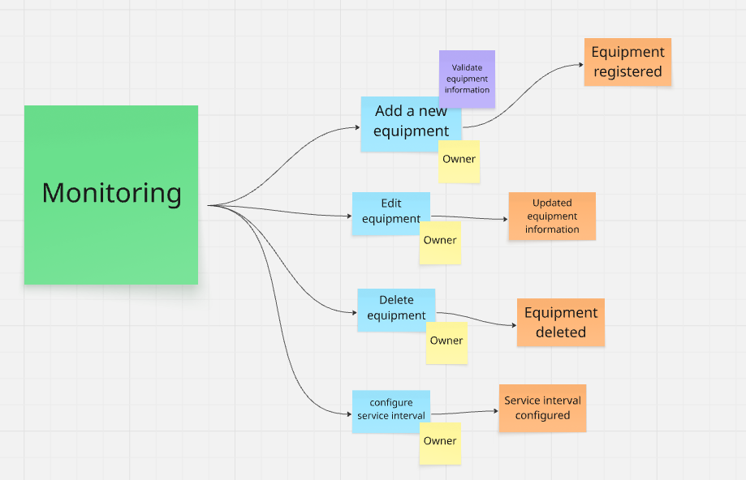
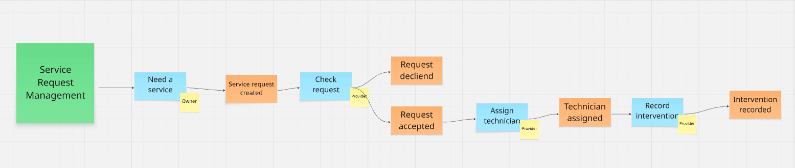
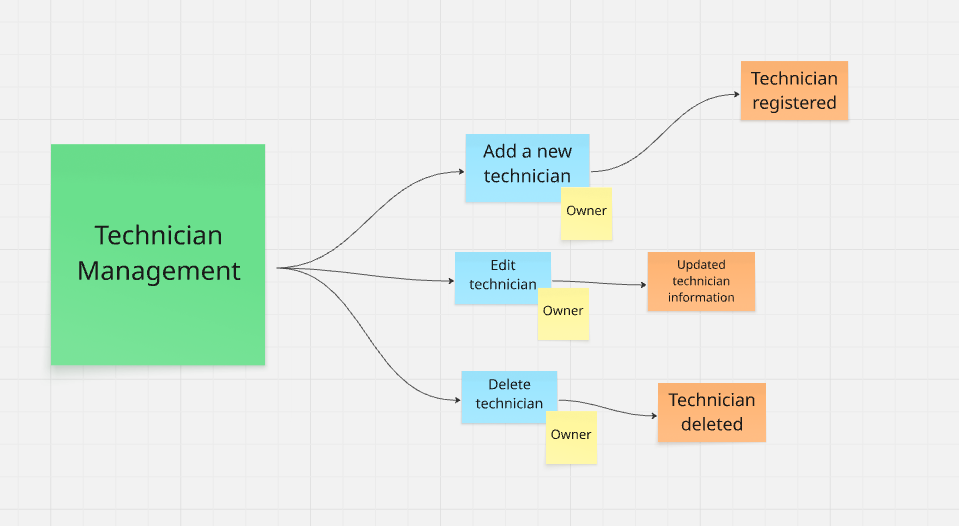
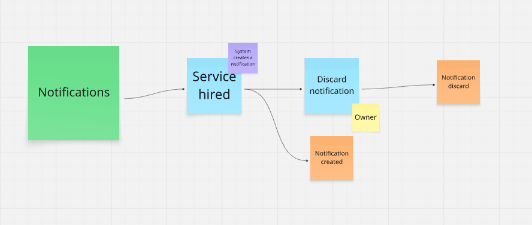
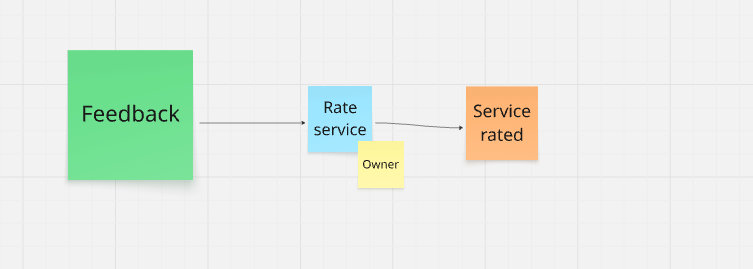
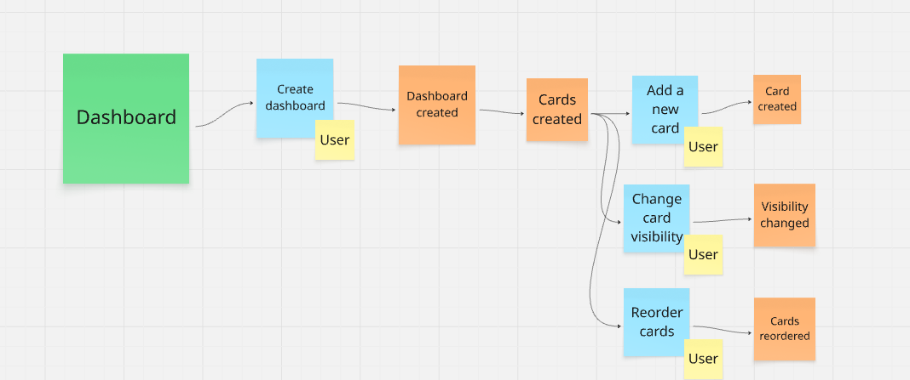

 <h1>Universidad Peruana de Ciencias Aplicadas</h1>
 
  <h2>Carrera: Ingeniería de Software</h2>
  <h2>Periodo: 2026-20</h2>
 
  <h2>Curso: Desarolllo de soluciones IOT</h2>
  <h2>Codigo del Curso: 1ASI0572</h2>
  <h2>NRC: 8740</h2>
  <h2>Profesor: David Carlos Olivera</h2>
 
 <h1>Informe del Avance 1</h1>
  <h2>Startup: Frostshield </h2>
  <h2>Producto: IceTrack </h2>
 
  <h2>Integrantes</h2>
 

 
| 
Alumno
 | 
Código
 |
| :-----------------------------------: | :-----------------------------------: |
|  Arostegui Alzamora, Cesar Augusto    |  U202114548                           |
|  Cuentas Peña, Joaquin Alberto        |  U20201f788                           |
|  Guillen Galindo, Julio Adolfo        |  U20241a352                           |
|  Jiménez Guerra, Gianmarco Fabian     |  U202123843                           |
|  Tenorio Medina, Piero Francesco      |  U202318731                           |
|  Quijada Magro, Jeremy Alexander      |  U202219657                           |
|  Fajardo Monrroy, Walter Luis         |  u202221632                           |

 

   <h3>Septiembre 2026</h3>

## Registro de Versiones del Informe

 
| Versión | Fecha      | Autor             | Descripción de modificación                                      |
| :-----: | :--------: | :---------------: | :-----------------------------------------------------           |
| 1.1     | 15/04/2026 | Jeremy Quijada    | Desarrollo del Capitulo I Enfocado en la solución IOT            |
| 1.1     | 11/09/2026 | Walter Fajardo    | Desarrollo de las partes 2.3, 2.3.1, 2.3.2, 2.3.3                |
| 1.2     | 14/09/2026 | Piero Tenorio     | Primera Versión del User Flow Diagram y el Bounded Context Canvas|
| 1.3     | 19/09/2026 | Piero Tenorio     | Versión Actualizada del Bounded Context Canvas y User Flow       |

## Project Report Collaboration Insights

- **URL de la organización del proyecto:** 
  https://github.com/IceTrack-IoT/Report-IceTrack_Iot
   

- **URL del repositorio del reporte:** 
  https://github.com/IceTrack-IoT/Report-IceTrack
   
  
- **URL del repositorio de la Landing Page:**
  https://github.com/IceTrack-IoT/Landing-Page-IceTrack
   

- **URL del repositorio del Frontend:** 
  https://github.com/IceTrack-IoT/Frontend-IceTrack
   

- **URL del repositorio del Backend:** 
  https://github.com/IceTrack-IoT/Platform-IceTrack

## Contenido

- [Capítulo I: Introducción](#capítulo-i-introducción)
  - [1.1. Startup Profile](#11-startup-profile)
    - [1.1.1. Descripción de la Startup](#111-descripción-de-la-startup)
    - [1.1.2. Perfiles de integrantes del equipo](#112-perfiles-de-integrantes-del-equipo)
  - [1.2. Solution Profile](#12-solution-profile)
    - [1.2.1. Antecedentes y problemática](#121-antecedentes-y-problemática)
    - [1.2.2. Lean UX Process.](#122-lean-ux-process)
      - [1.2.2.1. Lean UX Problem Statements.](#1221-lean-ux-problem-statements)
      - [1.2.2.2. Lean UX Assumptions.](#1222-lean-ux-assumptions)
      - [1.2.2.3. Lean UX Hypothesis Statements.](#1223-lean-ux-hypothesis-statements)
      - [1.2.2.4. Lean UX Canvas.](#1224-lean-ux-canvas)
  - [1.3. Segmentos objetivo.](#13-segmentos-objetivo)

- [Capítulo II: Requirements Elicitation \& Analysis](#capítulo-ii-requirements-elicitation--analysis)
  - [2.1. Competidores](#21-competidores)
    - [2.1.1. Análisis competitivo](#211-análisis-competitivo)
    - [2.1.2. Estrategias y tácticas frente a competidores](#212-estrategias-y-tácticas-frente-a-competidores)
  - [2.2. Entrevistas](#22-entrevistas)
    - [2.2.1. Diseño de entrevistas](#221-diseño-de-entrevistas)
    - [2.2.2. Registro de entrevistas](#222-registro-de-entrevistas)
    - [2.2.3. Análisis de entrevistas](#223-análisis-de-entrevistas)
  - [2.3. Needfinding](#23-needfinding)
    - [2.3.1. User Personas](#231-user-personas)
    - [2.3.2. User Task Matrix](#232-user-task-matrix)
    - [2.3.3. User Journey Mapping](#233-user-journey-mapping)
    - [2.3.4. Empathy Mapping](#234-empathy-mapping)
  - [2.4. Big Picture Event Storming](#24-big-picture-event-storming)
    - [2.4.1. Identity and Access Management](#241-identity-and-access-management)
    - [2.4.2. Asset Management](#242-asset-management)
    - [2.4.3. Monitoring](#243-monitoring)
    - [2.4.4. Service Request Management](#244-service-request-management)
    - [2.4.5. Technician Management](#245-technician-management)
    - [2.4.6. Notifications](#246-notifications)
    - [2.4.7. Feedback](#247-feedback)
    - [2.4.8. Dashboard](#248-dashboard)
  - [2.5. Ubiquitous Language](#25-ubiquitous-language)

- [Capítulo III: Requirements Specification](#capítulo-iii-requirements-specification)
  - [3.1. User Stories.](#31-user-stories)
  - [3.2. Impact Mapping.](#32-impact-mapping)
  - [3.3. Product Backlog.](#33-product-backlog)

- [Capítulo IV: Solution Software Design](#capítulo-iv-solution-software-design)
  - [4.1. Strategic-Level Domain-Driven Design](#41-strategic-level-domain-driven-design)
    - [4.1.1. Design-Level EventStorming](#411-design-level-eventstorming)
      - [4.1.1.1. Candidate Context Discovery](#4111-candidate-context-discovery)
      - [4.1.1.2. Domain Message Flows Modeling](#4112-domain-message-flows-modeling)
      - [4.1.1.3. Bounded Context Canvases](#4113-bounded-context-canvases)
    - [4.1.2. Context Mapping](#412-context-mapping)
    - [4.1.3. Software Architecture](#413-software-architecture)
      - [4.1.3.1. Software Architecture System Landscape Diagram](#4131-software-architecture-system-landscape-diagram)
      - [4.1.3.2. Software Architecture Context Level Diagrams](#4132-software-architecture-context-level-diagrams)
      - [4.1.3.3. Software Architecture Container Level Diagrams](#4133-software-architecture-container-level-diagrams)
      - [4.1.3.4. Software Architecture Deployment Diagrams](#4134-software-architecture-deployment-diagrams)
    - [4.2. Tactical-Level Domain-Driven Design](#42-tactical-level-domain-driven-design)
      - [4.2.1. Bounded Context: Identity and Access Management](#421-bounded-context-identity-and-access-management)
        - [4.2.1.1. Domain Layer](#4211-domain-layer)
        - [4.2.1.2. Interface Layer](#4212-interface-layer)
        - [4.2.1.3. Application Layer](#4213-application-layer)
        - [4.2.1.4. Infrastructure Layer](#4214-infrastructure-layer)
        - [4.2.1.5. Bounded Context Software Architecture Component Level Diagrams](#4215-bounded-context-software-architecture-component-level-diagrams)
        - [4.2.1.6. Bounded Context Software Architecture Code Level Diagrams](#4216-bounded-context-software-architecture-code-level-diagrams)
          - [4.2.1.6.1. Bounded Context Domain Layer Class Diagrams](#42161-bounded-context-domain-layer-class-diagrams)
          - [4.2.1.6.2. Bounded Context Database Design Diagram](#42162-bounded-context-database-design-diagram)
      - [4.2.2. Bounded Context: Profiles and Preferences Management](#422-bounded-context-profiles-and-preferences-management)
        - [4.2.2.1. Domain Layer](#4221-domain-layer)
        - [4.2.2.2. Interface Layer](#4222-interface-layer)
        - [4.2.2.3. Application Layer](#4223-application-layer)
        - [4.2.2.4. Infrastructure Layer](#4224-infrastructure-layer)
        - [4.2.2.5. Bounded Context Software Architecture Component Level Diagrams](#4225-bounded-context-software-architecture-component-level-diagrams)
        - [4.2.2.6. Bounded Context Software Architecture Code Level Diagrams](#4226-bounded-context-software-architecture-code-level-diagrams)
          - [4.2.2.6.1. Bounded Context Domain Layer Class Diagrams](#42261-bounded-context-domain-layer-class-diagrams)
          - [4.2.2.6.2. Bounded Context Database Design Diagram](#42262-bounded-context-database-design-diagram)
      - [4.2.3. Bounded Context: Monitoring and Alerting](#423-bounded-context-monitoring-and-alerting) 
        - [4.2.3.1. Domain Layer](#4231-domain-layer)
        - [4.2.3.2. Interface Layer](#4232-interface-layer)
        - [4.2.3.3. Application Layer](#4233-application-layer)
        - [4.2.3.4. Infrastructure Layer](#4234-infrastructure-layer)
        - [4.2.3.5. Bounded Context Software Architecture Component Level Diagrams](#4235-bounded-context-software-architecture-component-level-diagrams)
        - [4.2.3.6. Bounded Context Software Architecture Code Level Diagrams](#4236-bounded-context-software-architecture-code-level-diagrams)
          - [4.2.3.6.1. Bounded Context Domain Layer Class Diagrams](#42361-bounded-context-domain-layer-class-diagrams)
          - [4.2.3.6.2. Bounded Context Database Design Diagram](#42362-bounded-context-database-design-diagram)
      - [4.2.4. Bounded Context: Assets Management](#424-bounded-context-assets-management)
        - [4.2.4.1. Domain Layer](#4241-domain-layer)
        - [4.2.4.2. Interface Layer](#4242-interface-layer)
        - [4.2.4.3. Application Layer](#4243-application-layer)
        - [4.2.4.4. Infrastructure Layer](#4244-infrastructure-layer)
        - [4.2.4.5. Bounded Context Software Architecture Component Level Diagrams](#4245-bounded-context-software-architecture-component-level-diagrams)
        - [4.2.4.6. Bounded Context Software Architecture Code Level Diagrams](#4246-bounded-context-software-architecture-code-level-diagrams)
          - [4.2.4.6.1. Bounded Context Domain Layer Class Diagrams](#42461-bounded-context-domain-layer-class-diagrams)
          - [4.2.4.6.2. Bounded Context Database Design Diagram](#42462-bounded-context-database-design-diagram)
      - [4.2.5. Bounded Context: Device Management](#425-bounded-context-device-management)
        - [4.2.5.1. Domain Layer](#4251-domain-layer)
        - [4.2.5.2. Interface Layer](#4252-interface-layer)
        - [4.2.5.3. Application Layer](#4253-application-layer)
        - [4.2.5.4. Infrastructure Layer](#4254-infrastructure-layer)
        - [4.2.5.5. Bounded Context Software Architecture Component Level Diagrams](#4255-bounded-context-software-architecture-component-level-diagrams)
        - [4.2.5.6. Bounded Context Software Architecture Code Level Diagrams](#4256-bounded-context-software-architecture-code-level-diagrams)
          - [4.2.5.6.1. Bounded Context Domain Layer Class Diagrams](#42561-bounded-context-domain-layer-class-diagrams)
          - [4.2.5.6.2. Bounded Context Database Design Diagram](#42562-bounded-context-database-design-diagram)
      - [4.2.6. Bounded Context: Service Request Management](#426-bounded-context-service-request-management)
        - [4.2.6.1. Domain Layer](#4261-domain-layer)
        - [4.2.6.2. Interface Layer](#4262-interface-layer)
        - [4.2.6.3. Application Layer](#4263-application-layer)     
        - [4.2.6.4. Infrastructure Layer](#4264-infrastructure-layer)
        - [4.2.6.5. Bounded Context Software Architecture Component Level Diagrams](#4265-bounded-context-software-architecture-component-level-diagrams)
        - [4.2.6.6. Bounded Context Software Architecture Code Level Diagrams](#4266-bounded-context-software-architecture-code-level-diagrams)
          - [4.2.6.6.1. Bounded Context Domain Layer Class Diagrams](#42661-bounded-context-domain-layer-class-diagrams)
          - [4.2.6.6.2. Bounded Context Database Design Diagram](#42662-bounded-context-database-design-diagram)
      - [4.2.7. Bounded Context: Notification Management](#427-bounded-context-notification-management)
        - [4.2.7.1. Domain Layer](#4271-domain-layer)     
        - [4.2.7.2. Interface Layer](#4272-interface-layer)
        - [4.2.7.3. Application Layer](#4273-application-layer)
        - [4.2.7.4. Infrastructure Layer](#4274-infrastructure-layer)
        - [4.2.7.5. Bounded Context Software Architecture Component Level Diagrams](#4275-bounded-context-software-architecture-component-level-diagrams)
        - [4.2.7.6. Bounded Context Software Architecture Code Level Diagrams](#4276-bounded-context-software-architecture-code-level-diagrams)
          - [4.2.7.6.1. Bounded Context Domain Layer Class Diagrams](#42761-bounded-context-domain-layer-class-diagrams)
          - [4.2.7.6.2. Bounded Context Database Design Diagram](#42762-bounded-context-database-design-diagram)
      - [4.2.8. Bounded Context: Reporting and Analytics](#428-bounded-context-reporting-and-analytics)
        - [4.2.8.1. Domain Layer](#4281-domain-layer)
        - [4.2.8.2. Interface Layer](#4282-interface-layer)
        - [4.2.8.3. Application Layer](#4283-application-layer)
        - [4.2.8.4. Infrastructure Layer](#4284-infrastructure-layer)
        - [4.2.8.5. Bounded Context Software Architecture Component Level Diagrams](#4285-bounded-context-software-architecture-component-level-diagrams)
        - [4.2.8.6. Bounded Context Software Architecture Code Level Diagrams](#4286-bounded-context-software-architecture-code-level-diagrams)
          - [4.2.8.6.1. Bounded Context Domain Layer Class Diagrams](#42861-bounded-context-domain-layer-class-diagrams)
          - [4.2.8.6.2. Bounded Context Database Design Diagram](#42862-bounded-context-database-design-diagram)

- [Conclusiones](#conclusiones)
  - [Conclusiones y Recomendaciones](#conclusiones-y-recomendaciones)
- [Bibliografía](#bibliografía)
- [Anexos](#anexos)
  - [Recursos y enlaces del proyecto](#recursos-y-enlaces-del-proyecto)

## Student Outcome
El curso contribuye al cumplimiento del Student Outcome ABET:

**ABET – EAC - Student Outcome 5**

**Criterio**: *La capacidad de funcionar efectivamente en un equipo cuyos miembros juntos proporcionan liderazgo, crean un entorno de colaboración e inclusivo, establecen objetivos, planifican tareas y cumplen objetivos.*

En el siguiente cuadro se describe las acciones realizadas y enunciados de conclusiones por parte del grupo, que permiten sustentar el haber alcanzado el logro del ABET – EAC - Student Outcome 5.

| Criterio específico | Acciones realizadas | Conclusiones |
| :------------------ | :------------------ | :----------- |
| Trabaja en equipo para proporcionar liderazgo en forma conjunta | **Piero Francesco Tenorio Medina**   **AV1**: Dentro de esta entrega se desarrolló la refactorización del curso en términos de la solución implementada. Se informó a cada integrante sobre posibles mejoras a los diagramas como tambien de los servicios que se implementarán dentro del proyecto. |- |
| Crea un entorno colaborativo e inclusivo, establece metas, planifica tareas y cumple objetivos. | **Piero Francesco Tenorio Medina**   **AV1**: Dentro de esta entrega se estableció metas para algunos de los integrantes del grupo que se vean implicados en ciertos puntos del trabajo en los que me veía implicado.  | -|

# Capítulo I: Introducción

## 1.1. Startup Profile

### 1.1.1. Descripción de la Startup

Nuestra startup ofrece una plataforma de Inteligencia de Datos orientada a optimizar la gestión, monitoreo y mantenimiento de equipos de refrigeración en negocios que dependen de la cadena de frío. La plataforma permite recopilar y centralizar información proveniente de sensores IoT instalados en los equipos, así como integrarse con los controladores y sistemas de monitoreo existentes en los negocios, transformando los datos obtenidos en información útil para la toma de decisiones.

Las funcionalidades clave de la plataforma incluyen el monitoreo en tiempo real de variables como temperatura, consumo energético y tiempo de funcionamiento de los equipos. Además, genera alertas automáticas ante anomalías o posibles fallos, ofrece informes técnicos detallados, historiales de rendimiento y permite gestionar y programar mantenimientos de manera inteligente. Estas herramientas permiten a empresas, técnicos y proveedores supervisar continuamente el estado de los equipos, mejorar la eficiencia operativa, prevenir pérdidas ocasionadas por fallos inesperados y mantener un registro completo de su funcionamiento y mantenimiento.

**Misión:** Ofrecer una solución tecnológica inteligente que permita a las empresas proteger su inventario y optimizar la gestión, monitoreo y mantenimiento de sus equipos de refrigeración. Asimismo, proporcionar herramientas especializadas que faciliten el trabajo de técnicos y proveedores, mejorando su eficiencia y capacidad de respuesta.

**Visión:** Ser la empresa líder en gestión, monitoreo y mantenimiento inteligente de equipos de refrigeración en el mercado peruano, comenzando por consolidar nuestra presencia y posicionamiento en Lima.

### 1.1.2. Perfiles de integrantes del equipo

| **Integrante**            | **Quijada Magro Jeremy Alexander**        									                   |
| :------------------------ | :----------------------------------------------------------------------------- |
| **Código del Estudiante** | u202219657                                   									            	   |
| **Carrera**               | Ingeniería de Software                       									                 |
| **Descripción**           | Mi nombre es Jeremy Alexander Quijada Magro, tengo 21 años y curso la carrera de Ingeniería de Software. Me considero una persona ordenada y responsable. Me centro en conocmiento en C#, Kva y el uso del front con Vue, Angular y React. En este proyecto apoyaré con todos los conocimientos que he adquirido en los cursos pasados con la meta de aprender a realizar pruebas de calidad sobre este proyecto  										                                                                            		|
| **Foto**                  |  |

---

| **Integrante**            | **Guillen Galindo Julio Adolfo**                                     						 |
| :------------------------ | :------------------------------------------------------------------------------- |
| **Código del Estudiante** | u20241a352                       						                      				  	   |
| **Carrera**               | Ingeniería de Software                                                           |
| **Descripción**           | Actualmente curso la carrera de Ingeniería de Software en la UPC. Me considero una persona discreta, pero responsable y enfocada en cumplir los proyectos dentro de los plazos establecidos. Poseo conocimientos en C++ y Python; disfruto trabajar en equipo cuando existe colaboración y apoyo mutuo. Además, me motiva aplicar lo aprendido para afrontar los desafíos que puedan surgir en los próximos ciclos.                                                                          |
| **Foto**                  |  |

---

| **Integrante**            | **Gianmarco Fabian Jiménez Guerra**                                        	            |
| :------------------------ | :-------------------------------------------------------------------------------------- |
| **Código del Estudiante** | u202123843																	                                            |
| **Carrera**               | Ingeniería de Software														                                      |
| **Descripción**           | Estudiante de Ingeniería de Software con conocimiento sobre desarrollo de aplicaciones web y análisis de datos. Estoy motivado por aprender nuevos temas relacionados a Software y por trabajar en equipo. Considero que mi conocimiento sobre las tecnologías: Java, Python, Angular y C# me permitirá desempeñarme de manera correcta para apoyar en este proyecto.|
| **Foto**                  |      |

---

| **Integrante**            | **Piero Francesco Tenorio Medina**                                        	            |
| :------------------------ | :-------------------------------------------------------------------------------------- |
| **Código del Estudiante** | u202318731																	                                            |
| **Carrera**               | Ingeniería de Software														                                      |
| **Descripción**           | Estudiante de la carrera de Ingeniería de Software con conocimiento sobre desarrollo de aplicaciones web, especialmente en el entorno Backend. Tengo conocimientos sobre las tecnologías: Java,Vue, Angular y C#. Como integrante de un equipo, me gusta trabajar y comunicarme con los integrantes para poder cumplir los objetivos del proyecto. Estoy abierto a aprender nuevas herramientas que me permitan desempeñar mejor dentro de mi carrera.|
| **Foto**                  |      |

---

| **Integrante**            | **Cesar Augusto Arostegui Alzamora**                                  |
| :------------------------ | :----------------------------------------------------------------------------------- |
| **Código del Estudiante** | u202114548                                                                           |
| **Carrera**               | Ingeniería de Software                                                               |
| **Descripción**           | - Estudiante de la carrera de Ingeniería de Software, actualmente tengo 22 años. Mi lenguaje de programación más utilizado y favorito es TypeScript. Actualmente me encuentro desarrollando habilidades en áreas como DevOps y frameworks de desarrollo móvil. También me interesan las tecnologías de inteligencia artificial y su aplicación en soluciones empresariales.                                                            |
| **Foto**                  |                       |

---

| **Integrante**            | **-**                                                    |
| :------------------------ | :----------------------------------------------------------------------------------- |
| **Código del Estudiante** | -                                                                          |
| **Carrera**               | -                                                            |
| **Descripción**           | -													                                                   |
| **Foto**                  | - |

## 1.2. Solution Profile

### 1.2.1. Antecedentes y problemática

| **5W & 2H**                                                 | **Descripcion**                                                                 |
| :---------------------------------------------------------- | :------------------------------------------------------------------------------ |
| **What: ¿Cuál es el problema?**                 			      | Los negocios que dependen de la cadena de frío enfrentan vulnerabilidades operativas críticas debido a la falta de telemetría y control en tiempo real. Esta carencia provoca fallas mecánicas inesperadas, incrementos dramáticos en el consumo eléctrico —la refrigeración puede representar entre el 30% y el 60% del gasto energético total en plantas de procesamiento (Dawsongroup, 2024)— y un mantenimiento puramente reactivo. A nivel nacional, el deficiente manejo de la cadena de frío es responsable de la pérdida de más del 33% de los alimentos producidos (FAO, citado en Agraria, 2019), causando un severo impacto financiero. 	   	            |
| **When: ¿Cuándo sucede este problema?**         			      | Es una amenaza constante durante la operación 24/7 de las cámaras térmicas. El riesgo se agudiza en horarios no laborables, durante picos de producción estacional, o frente a anomalías climáticas como las olas de calor advertidas por entidades como Osinergmin, que elevan la exigencia térmica. La situación se torna crítica ante la ausencia de un monitoreo automatizado que notifique desviaciones de temperatura (ej. quiebres de los -18°C en congelación) antes de que el deterioro químico y biológico del producto sea irreversible (Zabarburu, 2026).					                 |
| **Where: ¿Dónde se produce este suceso?**      			        | El problema tiene alcance nacional en el Perú, impactando a supermercados, laboratorios y plantas agroindustriales. No obstante, el impacto es crítico en Lima, el principal nodo logístico del país. La limitada infraestructura refrigerada y las brechas logísticas en estas zonas incrementan el riesgo en la cadena de suministro alimentaria y médica (Agroperú, 2026). Además, afecta directamente a las empresas contratistas de mantenimiento que operan en diversas sedes sin capacidad de gestión centralizada de los equipos.           |
| **Who: ¿Quiénes están involucrados?**          			        | Involucra principalmente a dos actores: Los dueños y operadores comerciales (retail, agroexportación, clínicas) que asumen directamente los costos de mermas, sobrecostos energéticos y daños reputacionales. Las empresas de servicio técnico, que operan en desventaja al tener que atender emergencias sin datos de diagnóstico preventivo, lo que reduce su eficiencia operativa y aumenta los tiempos de respuesta (Seguas, 2024). 	  |
| **Why: ¿Cuál es la causa del problema?**        			      | La causa raíz es la falta de digitalización y la fragmentación de datos técnicos en "silos de información". Los parámetros vitales operan atrapados en controladores electrónicos aislados que no transmiten información a un sistema en la nube. Esta falta de visibilidad en línea impide detectar ineficiencias tempranas —como aislamientos defectuosos o desgaste de compresores— obligando a una gestión reactiva que actúa solo cuando el componente ya falló o el producto se dañó (Dawsongroup, 2024).  |
| **How: ¿Qué llevó a la persona a llegar a esta situación?** | La situación actual deriva de una histórica falta de inversión tecnológica y dependencia de esquemas de mantenimiento correctivo ("apagar incendios"). En lugar de adoptar plataformas IoT para el monitoreo, las organizaciones han operado a ciegas, esperando que el problema se manifieste físicamente. Este enfoque ha prolongado un ciclo de ineficiencias, elevados Costos Totales de Propiedad (TCO) y un desgaste acelerado de infraestructura que una estrategia de mantenimiento predictivo habría evitado.    |
| **How Much: ¿Cuánto es el impacto financiero?** 			      | El impacto económico es devastador y cuantificable. A nivel nacional, las deficiencias y fallas en la gestión de la cadena de frío provocan que el Perú pierda más del 33% de los alimentos que produce anualmente (Agraria.pe, 2019). Además, en sectores críticos como el de la salud, una sola interrupción no detectada en los sistemas de refrigeración ha generado pérdidas de hasta S/ 14 millones por lotes malogrados debido a la ruptura térmica (La Noticia Perú, 2023). A estos valores directos se suma el sobreconsumo eléctrico constante y los altos costos del mantenimiento correctivo de emergencia. |

### 1.2.2. Lean UX Process.

#### 1.2.2.1. Lean UX Problem Statements.

El estado actual del sector de la refrigeración comercial se caracteriza por una gestión principalmente reactiva de los equipos, especialmente en negocios que dependen de la cadena de frío, como restaurantes, supermercados y laboratorios, así como en técnicos especializados y proveedores de equipos que brindan servicios de mantenimiento. Estos actores enfrentan problemas relacionados con fallas inesperadas, pérdidas de inventario, consumo energético elevado, dificultad para realizar un seguimiento continuo del estado de los equipos y falta de información centralizada para gestionar los servicios de mantenimiento.

Aunque algunos negocios cuentan con sensores, controladores o sistemas de monitoreo, la información suele encontrarse aislada entre diferentes equipos, fabricantes o herramientas, dificultando su interpretación y aprovechamiento para la toma de decisiones. Asimismo, los técnicos y proveedores requieren información histórica y herramientas que les permitan organizar sus actividades, diagnosticar problemas y brindar un servicio más eficiente.

Lo que las soluciones existentes no abordan completamente es la necesidad de contar con una plataforma especializada que centralice la información de los equipos de refrigeración y, al mismo tiempo, permita obtener datos directamente mediante sensores IoT, independientemente de los sistemas existentes en el negocio. Este vacío limita la capacidad de los usuarios para detectar anomalías oportunamente, anticiparse a posibles fallas, analizar el rendimiento de los equipos y mantener un historial unificado de su funcionamiento y mantenimiento.

Nuestro producto, IceTrack, abordará este vacío mediante una plataforma de Inteligencia de Datos especializada en equipos de refrigeración. La solución permitirá conectar sensores IoT para recopilar información en tiempo real, integrar datos provenientes de controladores y sistemas de monitoreo existentes, centralizar dicha información y transformarla en indicadores, alertas y recomendaciones útiles. Además, proporcionará herramientas para la gestión de mantenimientos, historial técnico, seguimiento de servicios y análisis del rendimiento de los equipos.

Nuestro enfoque inicial estará dirigido a negocios de Lima que dependen de la cadena de frío y necesitan reducir los riesgos asociados a fallas en sus equipos, así como a técnicos y proveedores de servicios de refrigeración que buscan mejorar la gestión y eficiencia de sus operaciones.

Sabremos que tendremos éxito cuando los negocios utilicen de manera recurrente el monitoreo de sus equipos, respondan oportunamente a las alertas generadas por la plataforma, reduzcan las fallas críticas y las pérdidas asociadas a problemas de refrigeración, y mejoren su eficiencia energética. Asimismo, consideraremos exitoso el producto cuando técnicos y proveedores utilicen la plataforma para gestionar sus servicios, reduzcan sus tiempos de atención y mantengan una mayor continuidad en sus relaciones con los clientes.

#### 1.2.2.2. Lean UX Assumptions.

##### Business Assumptions

- Creemos que existe una oportunidad de mercado para una solución especializada en la gestión y monitoreo inteligente de equipos de refrigeración.
- Creemos que los negocios que dependen de la cadena de frío están dispuestos a invertir en una solución que permita reducir pérdidas y mejorar el control de sus equipos..
- Creemos que la incorporación de sensores IoT como parte de la solución permitirá diferenciarnos de las plataformas genéricas de gestión de mantenimiento.
- Creemos que establecer alianzas con proveedores y técnicos especializados facilitará la entrada de IceTrack al mercado.
- Creemos que iniciar operaciones en Lima permitirá validar el modelo de negocio antes de ampliar la solución a otras regiones del Perú.

##### Business Outcome Assumptions

- Creemos que la adopción de IceTrack permitirá reducir las pérdidas económicas ocasionadas por fallas en los sistemas de refrigeración.
- Creemos que el monitoreo continuo permitirá disminuir la frecuencia y el impacto de fallas críticas.
- Creemos que la identificación de ineficiencias permitirá reducir el consumo energético de los equipos monitoreados.
- Creemos que la gestión centralizada permitirá reducir los costos asociados al mantenimiento correctivo y las reparaciones de emergencia.
- Creemos que la mejora en la gestión de servicios permitirá incrementar la productividad de los técnicos y proveedores.
- Creemos que una experiencia de servicio más transparente y proactiva permitirá aumentar la satisfacción y retención de los clientes.

##### User Assumptions

- Creemos que los negocios que dependen de la cadena de frío serán usuarios principales de la plataforma y utilizarán el sistema para supervisar el estado de sus equipos.
- Creemos que los responsables de los negocios necesitarán visualizar información de temperatura, consumo energético, tiempo de funcionamiento y alertas.
- Creemos que los técnicos especializados en refrigeración utilizarán la plataforma para gestionar servicios, consultar información de los equipos y revisar su historial técnico.
- Creemos que los proveedores de equipos utilizarán la plataforma como una herramienta para mejorar y diferenciar sus servicios postventa.
- Creemos que algunos usuarios tendrán conocimientos tecnológicos limitados, por lo que necesitarán una interfaz sencilla y procesos de configuración intuitivos.
- Creemos que los usuarios requerirán acceso a la plataforma desde diferentes ubicaciones y dispositivos para supervisar equipos y gestionar servicios.

##### User Outcome and Benefit Assumptions

- Creemos que los negocios desean conocer en tiempo real el estado de sus equipos para detectar problemas antes de que ocasionen pérdidas.
- Creemos que los negocios desean recibir alertas oportunas que les permitan actuar ante variaciones anormales de temperatura u otras condiciones críticas.
- Creemos que los responsables de los negocios desean reducir sus costos operativos mediante un menor consumo energético y una mejor planificación del mantenimiento.
- Creemos que los técnicos desean disponer de información histórica y actualizada de cada equipo para diagnosticar problemas y realizar servicios con mayor eficiencia.
- Creemos que los técnicos desean organizar sus tareas, visitas y mantenimientos desde una única plataforma.
- Creemos que los proveedores desean contar con información centralizada que les permita ofrecer un servicio postventa más rápido, transparente y eficiente.
- Creemos que todos los usuarios desean contar con un historial confiable de los equipos para facilitar el seguimiento de su rendimiento y mantenimiento.

##### Feature Assumptions

- Creemos que la conexión de sensores IoT a los equipos permitirá recopilar automáticamente datos de temperatura y otras variables relevantes en tiempo real.
- Creemos que la integración con controladores y sistemas de monitoreo existentes permitirá centralizar información sin depender exclusivamente de una única fuente de datos.
- Creemos que un sistema de monitoreo en tiempo real permitirá a los usuarios visualizar el estado actual de sus equipos desde la plataforma.
- Creemos que un sistema de alertas automáticas permitirá notificar oportunamente a los usuarios cuando se detecten valores anormales o condiciones que puedan indicar una falla.
- Creemos que el historial técnico de cada equipo permitirá a los usuarios consultar su comportamiento, incidencias y mantenimientos anteriores para facilitar la toma de decisiones.
- Creemos que un módulo de gestión y programación de mantenimientos permitirá a técnicos y proveedores organizar sus actividades y reducir mantenimientos reactivos.
- Creemos que los informes de rendimiento permitirán identificar tendencias, anomalías e ineficiencias en los equipos.
- Creemos que el análisis de consumo energético permitirá identificar oportunidades para reducir el uso innecesario de energía.
- Creemos que una interfaz web y móvil permitirá a los usuarios consultar información y gestionar sus actividades tanto desde sus oficinas como desde el campo.

#### 1.2.2.3. Lean UX Hypothesis Statements.

**Hipótesis 1: Conexión mediante sensores IoT**

Creemos que lograremos aumentar la adopción y el valor percibido de IceTrack al proporcionar datos confiables y continuos sobre los equipos de refrigeración.

Si los responsables de negocios que dependen de la cadena de frío y los técnicos especializados obtienen información automática y actualizada sobre el estado de los equipos con la conexión de sensores IoT que recopilen datos directamente desde los sistemas de refrigeración.

Sabremos que hemos tenido éxito cuando los usuarios mantengan sus equipos conectados y consulten regularmente los datos recopilados por los sensores para supervisar su funcionamiento.

**Hipótesis 2: Monitoreo en tiempo real**

Creemos que lograremos reducir la ocurrencia e impacto de fallas críticas relacionadas con los equipos de refrigeración.

Si los responsables de negocios que dependen de la cadena de frío pueden conocer en tiempo real el estado y las principales variables de funcionamiento de sus equipos con un módulo de monitoreo en tiempo real conectado a sensores IoT y otras fuentes de datos.

Sabremos que hemos tenido éxito cuando los usuarios consulten regularmente el estado de sus equipos y detecten anomalías antes de que generen una falla crítica o una pérdida de inventario.

**Hipótesis 3: Alertas automáticas**

Creemos que lograremos reducir las pérdidas ocasionadas por fallas o condiciones anormales de los equipos.

Si los responsables de negocios y técnicos especializados pueden recibir una notificación oportuna ante una anomalía o condición crítica con un sistema de alertas automáticas basado en los datos recopilados por la plataforma.

Sabremos que hemos tenido éxito cuando los usuarios reciban las alertas, actúen ante ellas y logren resolver o mitigar incidentes antes de que produzcan pérdidas significativas.

**Hipótesis 4: Historial técnico**

Creemos que lograremos mejorar la eficiencia del diagnóstico y mantenimiento de los equipos.

Si los técnicos y proveedores de servicios de refrigeración pueden consultar el comportamiento histórico, incidencias y mantenimientos realizados en cada equipo con un historial técnico centralizado y asociado a cada activo.

Sabremos que hemos tenido éxito cuando los técnicos consulten el historial durante sus servicios y reduzcan el tiempo necesario para identificar las causas de los problemas.

**Hipótesis 5: Gestión y programación de mantenimientos**

Creemos que lograremos reducir los costos asociados al mantenimiento reactivo y mejorar la productividad de los técnicos.

Si los técnicos y proveedores de servicios de refrigeración pueden planificar, organizar y realizar seguimiento de sus actividades de mantenimiento con un módulo de programación y gestión de mantenimientos.

Sabremos que hemos tenido éxito cuando aumente el porcentaje de mantenimientos planificados y disminuya el tiempo promedio empleado en gestionar y atender servicios.

**Hipótesis 6: Informes de rendimiento**

Creemos que lograremos mejorar la toma de decisiones relacionada con el funcionamiento de los equipos.

Si los responsables de negocios y proveedores pueden analizar el rendimiento de sus equipos mediante información histórica y reportes comprensibles con un módulo de generación de informes de rendimiento.

Sabremos que hemos tenido éxito cuando los usuarios consulten los informes periódicamente y utilicen la información obtenida para realizar acciones de mantenimiento, optimización o reemplazo de equipos.

**Hipótesis 7: Análisis del consumo energético**

Creemos que lograremos disminuir los costos operativos asociados al consumo energético de los equipos de refrigeración.

Si los responsables de negocios pueden identificar equipos con un consumo energético elevado o comportamientos ineficientes con un módulo de monitoreo y análisis del consumo energético.

Sabremos que hemos tenido éxito cuando los usuarios identifiquen oportunidades de ahorro y se observe una reducción del consumo energético en los equipos intervenidos.

**Hipótesis 8: Gestión de usuarios, roles y ubicaciones**

Creemos que lograremos facilitar la administración de equipos en organizaciones con múltiples usuarios o establecimientos.

Si los responsables de negocios y proveedores que gestionan múltiples usuarios, equipos o ubicaciones pueden controlar el acceso a la información según las responsabilidades de cada persona con un sistema de gestión de usuarios, roles y ubicaciones.

Sabremos que hemos tenido éxito cuando las organizaciones puedan administrar diferentes usuarios y equipos desde una misma cuenta sin comprometer la seguridad ni la organización de la información.

**Hipótesis 9: Plataforma multiplataforma**

Creemos que lograremos aumentar la frecuencia de uso de IceTrack y facilitar la supervisión de los equipos fuera de las oficinas.

Si los responsables de negocios y técnicos pueden consultar información y gestionar sus actividades desde diferentes ubicaciones con una plataforma disponible mediante interfaces web y móvil.

Sabremos que hemos tenido éxito cuando los usuarios accedan a la plataforma tanto desde sus lugares de trabajo como durante sus actividades en campo.

#### 1.2.2.4. Lean UX Canvas.

<figure style="page-break-inside: avoid; text-align: center;">
  
  <figcaption style="font-size: 0.9em; color: #555;">
    <strong>Figura 1:</strong> Lean UX Canvas.
  </figcaption>
</figure>

## 1.3. Segmentos objetivo.

**Segmento Objetivo 1: Heladerias con equipos de refrigeración**

**Aspectos demográficos:**
- **Tipo de negocio:** Medianas empresas.
- **Nivel de necesidad:** Alta dependencia de sistemas de refrigeración.

**Aspectos geográficos:**
- **Nacionalidad:** Peruana.
- **Zona geográfica:** Urbana.
- **Departamento:** Lima.

**Aspectos psicográficos:**
- **Motivación:** Evitar pérdidas económicas por fallas en la refrigeración y reducir costos operativos.
- **Valores:** La eficiencia, la calidad del inventario y el control de las operaciones.
- **Intereses:** La adopción de tecnología para optimizar la gestión y asegurar la tranquilidad en la operación diaria.

---

**Segmento Objetivo 2: Técnicos y empresas de mantenimiento**

**Aspectos demográficos:**
- **Tipo de negocio:** Compañías de servicio técnico.
- **Rubro:** Mantenimiento y reparación de equipos de refrigeración.
- **Nivel de necesidad:** Alta demanda de organización y eficiencia en sus procesos.

**Aspectos geográficos:**
- **Nacionalidad:** Peruana.
- **Zona geográfica:** Urbana.
- **Departamento:** Lima.

**Aspectos psicográficos:**
- **Motivación:** Incrementar la productividad, reducir el tiempo en tareas administrativas y mejorar la calidad de su servicio.
- **Valores:** La profesionalidad, la eficiencia y la tecnología como herramienta para facilitar su trabajo.
- **Intereses:** Contar con una plataforma que centralice la información, automatice la generación de reportes y mejore la comunicación con sus clientes.

# Capítulo II: Requirements Elicitation & Analysis

## 2.1. Competidores

**Competidor 1: Loratech**  
Loratech es una empresa peruana especializada en soluciones de Internet de las Cosas (IoT) que ofrece sistemas de monitoreo para cámaras y equipos de refrigeración. Su solución permite supervisar variables como temperatura, humedad, apertura de puertas y consumo energético, generando alertas ante condiciones anormales. Asimismo, permite monitorear el funcionamiento del compresor y sus ciclos de trabajo para identificar comportamientos anómalos, facilitando la planificación del mantenimiento y la prevención de fallas que puedan ocasionar pérdidas de productos refrigerados.

---

**Competidor 2: JChip – iControl**  
JChip es una empresa peruana que ofrece soluciones de telemetría e Internet de las Cosas mediante su plataforma iControl. Su tecnología permite recopilar y centralizar información proveniente de sensores y equipos para realizar el monitoreo remoto de variables operativas. Sus soluciones pueden aplicarse a sistemas de refrigeración y cadena de frío, permitiendo supervisar parámetros como temperatura y consumo energético, así como generar alertas y analizar el comportamiento de los equipos para facilitar la detección de anomalías y apoyar las actividades de mantenimiento.

---

**Competidor 3: SafeSense**  
SafeSense es una plataforma peruana de monitoreo IoT desarrollada por SIMS Technology, orientada al control de temperatura en procesos que requieren mantener condiciones térmicas controladas. La solución utiliza sensores conectados a una plataforma web y móvil para visualizar información en tiempo real, configurar alertas automáticas y consultar historiales de mediciones. Asimismo, permite administrar múltiples sensores desde un dashboard centralizado y generar reportes, facilitando la detección temprana de desviaciones de temperatura y la prevención de pérdidas asociadas a fallas en la cadena de frío.

### 2.1.1. Análisis competitivo

<table> <tr> <th colspan="6">Competitive Analysis Landscape</th> </tr>

<tr>
  <td colspan="2">¿Por qué llevar a cabo este análisis?</td>
  <td colspan="4">Con el objetivo de evaluar y comparar las funcionalidades, tecnologías, modelos de negocio y estrategias de los principales competidores relacionados con el monitoreo de sistemas de refrigeración e IoT, con el propósito de identificar fortalezas y debilidades, detectar oportunidades de negocio y determinar aspectos que permitan diferenciar a IceTrack de las soluciones existentes en el mercado.</td>
</tr>
  <tr>
  <td colspan="2"></td>
  <td>IceTrack   </img></td>
  <td>Loratech   </img></td>
  <td>JChip - iControl   </img></td>
  <td>SafeSense   </img></td>
  </tr>

<tr>
  <td rowspan="2">Perfil</td>
  <td>Overview</td>
  <td>IceTrack es una plataforma de monitoreo y gestión orientada a equipos de refrigeración. Integra información obtenida mediante sensores IoT para supervisar el funcionamiento de los equipos y facilitar su mantenimiento, conectando las necesidades de los negocios con el trabajo de técnicos especializados.</td>
  <td>Loratech es una empresa peruana especializada en soluciones IoT. Entre sus aplicaciones ofrece sistemas para el monitoreo de cámaras de frío mediante sensores y redes administrables en la nube, permitiendo supervisar variables ambientales y el funcionamiento de componentes como el compresor.</td>
  <td>JChip ofrece soluciones de telemetría e IoT mediante herramientas orientadas al monitoreo remoto y centralización de información obtenida de dispositivos y sensores.</td>
  <td>SafeSense es una solución peruana de SIMS Technology orientada al monitoreo IoT de temperatura y cadena de frío. Integra sensores, una plataforma web y una aplicación móvil para supervisar condiciones térmicas y generar alertas.</td>
</tr>

<tr>
  <td>Ventaja competitiva ¿Qué valor ofrece a los clientes?</td>
  <td>Busca integrar en una misma plataforma el monitoreo de equipos de refrigeración, alertas automáticas, análisis del consumo energético, historial técnico y gestión de mantenimientos, proporcionando herramientas tanto a los negocios como a los técnicos responsables de los equipos.</td>
  <td>Combina monitoreo ambiental con información sobre el funcionamiento del equipo. Puede supervisar temperatura, humedad, apertura de puertas, consumo energético y ciclos de trabajo del compresor, permitiendo detectar patrones anómalos y apoyar el mantenimiento predictivo.</td>
  <td>Permite utilizar tecnologías IoT y telemetría para obtener información de equipos de manera remota, reduciendo la dependencia de inspecciones exclusivamente presenciales.</td>
  <td>Ofrece una solución IoT con hardware y software integrados, monitoreo continuo, alertas configurables, historial y reportes, además de soporte local en diferentes ciudades del Perú.</td>
</tr>

<tr>
  <td rowspan="2">Perfil de Marketing</td>
  <td>Mercado Objetivo</td> <td>Inicialmente, heladerías medianas ubicadas en Lima que dependen de equipos de refrigeración para conservar sus productos. También se dirige a técnicos y empresas dedicadas al mantenimiento y reparación de equipos de refrigeración.</td>
  <td>Empresas peruanas que requieren soluciones IoT para monitorear procesos y activos. Su oferta para cámaras de frío puede ser utilizada por organizaciones que necesitan conservar productos bajo condiciones controladas.</td>
  <td>Empresas que requieren soluciones de telemetría, automatización y monitoreo remoto mediante tecnologías IoT.</td>
  <td>Principalmente empresas de agroindustria, laboratorios, almacenamiento y logística que necesitan monitorear temperatura y mantener trazabilidad de sus procesos de cadena de frío.</td>
</tr>

<tr> 
  <td>Estrategias de Marketing</td>
  <td>Marketing digital dirigido inicialmente a heladerías y empresas de mantenimiento de Lima, demostraciones de la plataforma, presencia en redes sociales y alianzas con técnicos y proveedores de equipos de refrigeración.</td>
  <td>Marketing B2B mediante presencia digital y oferta de soluciones IoT personalizadas para diferentes sectores empresariales, destacando aplicaciones específicas como cámaras de frío e Industria 4.0.</td>
  <td>Promoción de soluciones tecnológicas y servicios de telemetría orientados principalmente al mercado empresarial.</td>
  <td>Marketing B2B mediante demostraciones empresariales, casos de uso por industria, presencia digital y contacto directo con empresas interesadas en implementar monitoreo IoT.</td>
</tr>

<tr>
  <td rowspan="3">Perfil de Producto</td>
  <td>Productos & Servicios</td>
  <td>Monitoreo en tiempo real de equipos de refrigeración, sensores IoT, alertas automáticas, historial técnico, gestión y programación de mantenimientos, informes de rendimiento, análisis de consumo energético y administración de usuarios, equipos y ubicaciones.</td>
  <td>Monitoreo IoT de cámaras de frío, temperatura, humedad, apertura de puertas, consumo energético y ciclos de funcionamiento del compresor. Incluye alertas y funcionalidades orientadas al mantenimiento predictivo.</td>
  <td>Soluciones de telemetría e IoT para recopilar, transmitir y visualizar información proveniente de equipos y sensores.</td>
  <td>Sensores IoT de temperatura, monitoreo en tiempo real, dashboard web, aplicación móvil, alertas automáticas, historial de mediciones y reportes exportables.</td>
</tr>

<tr>
  <td>Precios & Costos</td>
  <td>Modelo de precios aún por definir. Se contempla un esquema que considere el uso de la plataforma y los dispositivos IoT necesarios para conectar y monitorear los equipos.</td>
  <td>Los precios de implementación y operación no se encuentran publicados de manera abierta y dependen de la solución IoT requerida por cada empresa.</td>
  <td>Los precios no se encuentran disponibles públicamente y requieren cotización según las necesidades del proyecto.</td>
  <td>Cuenta con un modelo de hardware más suscripción. Publica un precio referencial de S/ 200 + IGV por sensor y S/ 20 mensuales por sensor para el acceso a la plataforma.</td>
</tr>

<tr> 
  <td>Canales de distribución (Web y/o Móvil)</td>
  <td>Plataforma web y aplicación móvil.</td>
  <td>Soluciones IoT administrables mediante plataformas en la nube.</td>
  <td>Plataformas y soluciones digitales de monitoreo y telemetría.</td>
  <td>Dashboard web y aplicación móvil para monitoreo y recepción de alertas.</td>
</tr>

<tr>
  <td rowspan="4">Análisis SWOT</td>
  <td>Fortalezas</td>
  <td>Integra monitoreo IoT con funcionalidades orientadas específicamente a la gestión del mantenimiento. Considera tanto las necesidades de las heladerías como las de técnicos y empresas de mantenimiento.</td>
  <td>Experiencia en soluciones IoT en Perú, monitoreo de múltiples variables, uso de tecnología LoRaWAN y capacidad para analizar el consumo energético y los ciclos del compresor para mantenimiento predictivo.</td>
  <td>Experiencia en soluciones de telemetría y monitoreo remoto aplicables a diferentes contextos empresariales.</td>
  <td>Solución desarrollada en Perú con sensores IoT, monitoreo en tiempo real, alertas, plataforma web, aplicación móvil, reportes y un modelo de precios públicamente disponible.</td>
</tr>

<tr> 
  <td>Debilidades</td>
  <td>Al ser una nueva solución, inicialmente carece de posicionamiento, cartera de clientes y datos históricos suficientes para validar el impacto de sus funcionalidades. Además, requiere la instalación e integración de sensores IoT en los equipos.</td>
  <td>Su propuesta abarca numerosos sectores y aplicaciones IoT, por lo que no está enfocada exclusivamente en las necesidades operativas y de gestión de las heladerías ni en la administración integral del trabajo de técnicos de refrigeración.</td>
  <td>La información pública disponible sobre funcionalidades específicas, precios y aplicaciones especializadas para refrigeración comercial es limitada.</td>
  <td>Su enfoque actual está principalmente orientado al monitoreo de temperatura y trazabilidad en agroindustria, laboratorios y logística, y no a la gestión integral del mantenimiento de equipos de refrigeración comercial.</td>
</tr>

<tr> 
  <td>Oportunidades</td>
  <td>Especialización inicial en heladerías de Lima, incorporación progresiva de nuevas funciones de mantenimiento predictivo y posibilidad de expansión posterior hacia restaurantes, minimarkets, supermercados y otros negocios dependientes de refrigeración.</td>
  <td>Expansión de soluciones IoT hacia más negocios que dependen de refrigeración comercial y crecimiento de aplicaciones de mantenimiento predictivo y eficiencia energética.</td>
  <td>Crecimiento de la adopción de tecnologías IoT y telemetría en empresas que buscan digitalizar el monitoreo de sus equipos y procesos.</td>
  <td>Expansión de su solución hacia nuevos sectores comerciales que requieren control térmico, así como incorporación de nuevos tipos de sensores y funcionalidades analíticas.</td>
</tr>

<tr> 
  <td>Amenazas</td> 
  <td>Ingreso o expansión de proveedores IoT ya establecidos hacia el segmento de refrigeración comercial, reducción de precios de soluciones competidoras y resistencia de pequeñas y medianas empresas a invertir inicialmente en sensores y suscripciones.</td>
  <td>Aparición de proveedores IoT de menor costo y soluciones especializadas que ofrezcan funcionalidades similares específicamente para determinados nichos de mercado.</td>
  <td>Competencia creciente de proveedores nacionales e internacionales de plataformas IoT y telemetría con soluciones especializadas.</td>
  <td>Competencia de plataformas IoT con sensores de menor costo o con funcionalidades adicionales de mantenimiento predictivo y gestión técnica.</td> 
</tr> 
</table>

### 2.1.2. Estrategias y tácticas frente a competidores

Con el fin de posicionar a IceTrack en el mercado de monitoreo y gestión de equipos de refrigeración comercial, se plantean estrategias orientadas a diferenciar la propuesta frente a las soluciones IoT existentes, considerando inicialmente las necesidades de las heladerías y empresas encargados del mantenimiento de sus equipos.

1. **Estrategias de Diferenciación:**

#### Solución integral para equipos de refrigeración comercial  
La plataforma permitirá supervisar variables como temperatura, consumo energético y tiempo de funcionamiento, generar alertas ante anomalías y centralizar la información de los equipos. A diferencia de soluciones enfocadas principalmente en el monitoreo de variables mediante sensores.

####  Historial técnico centralizado por equipo  
Cada equipo de refrigeración contará con un historial que reúna sus mediciones, incidencias y mantenimientos realizados. Esto permitirá que los técnicos dispongan de información previa antes de realizar una intervención y que los responsables de las heladerías puedan consultar el comportamiento y mantenimiento de sus equipos a lo largo del tiempo.

#### Integración entre negocios y técnicos de mantenimiento  
La información generada por los sensores podrá ser utilizada no solo para supervisar los equipos, sino también para facilitar el diagnóstico, planificación y seguimiento de las actividades de mantenimiento.

#### Interfaz intuitiva y multiplataforma  
La disponibilidad mediante interfaces web y móvil permitirá que administradores y técnicos accedan a la información tanto desde el establecimiento como durante sus actividades en campo.

2. **Tácticas de Marketing:**

#### Marketing digital dirigido a heladerías  
Durante la etapa inicial, las campañas digitales estarán orientadas principalmente a heladerías medianas de Lima. La comunicación se enfocará en problemas concretos del negocio, como la pérdida de productos por fallas de refrigeración, la detección tardía de variaciones de temperatura y los costos asociados al consumo energético y mantenimiento correctivo.

#### Demostraciones y pruebas piloto  
Se buscará implementar pruebas piloto con heladerías seleccionadas para demostrar el funcionamiento de los sensores y de la plataforma en condiciones reales. Estas experiencias permitirán obtener retroalimentación de los usuarios, validar las funcionalidades propuestas y generar casos de uso que posteriormente puedan emplearse para promocionar IceTrack.

3. **Estrategias de Precios:**

#### Prueba inicial de la solución:  
Se podrá ofrecer un periodo de implementación piloto que permita al negocio conocer el funcionamiento de IceTrack y evaluar los beneficios del monitoreo antes de contratar el servicio de manera permanente.

#### Transparencia en los costos  
La propuesta comercial buscará presentar de manera clara los costos correspondientes al hardware IoT, instalación y uso de la plataforma, facilitando que los clientes puedan evaluar la inversión requerida y compararla con los posibles costos derivados de fallas, pérdidas de productos y mantenimientos correctivos.

4. **Expansión y Adaptabilidad:**

#### Colaboraciones con proveedores locales  
Se buscarán acuerdos con técnicos especializados, empresas de mantenimiento, distribuidores de equipos y proveedores de soluciones de refrigeración. Estas alianzas permitirán desarrollar una red local que facilite la instalación de sensores, soporte técnico y atención de los equipos conectados a IceTrack.

#### Enfoque inicial en Lima y expansión progresiva  
IceTrack concentrará inicialmente sus esfuerzos en heladerías ubicadas en Lima, permitiendo validar la propuesta en un segmento y territorio específicos. Una vez comprobado el funcionamiento del modelo, se podrá evaluar su expansión hacia otras ciudades del Perú que dependan de equipos de refrigeración comercial.

## 2.2. Entrevistas

### 2.2.1. Diseño de entrevistas

Las entrevistas tienen como finalidad conocer cómo se realiza actualmente el monitoreo y mantenimiento de los equipos de refrigeración, identificar los principales problemas que enfrentan los usuarios y evaluar el interés en una solución digital que facilite la supervisión, prevención de fallas y gestión del mantenimiento.

Los resultados obtenidos permitirán validar las hipótesis planteadas y orientar el diseño de las funcionalidades de IceTrack de acuerdo con las necesidades reales de sus potenciales usuarios.

**Preguntas para el Segmento Objetivo 1 - Heladerías con equipos de refrigeración:**

1. ¿Qué tipos de equipos de refrigeración utilizan actualmente? Por ejemplo, congeladoras, vitrinas refrigeradas o cámaras de frío.

2. Aproximadamente, ¿cuántos equipos de refrigeración tienen en funcionamiento por local?

3. ¿Cómo supervisan actualmente que los equipos estén funcionando correctamente y mantengan la temperatura adecuada?

4. ¿Alguna vez han tenido una falla en un equipo de refrigeración que haya ocasionado pérdida de helados, insumos u otros productos? ¿Qué ocurrió y qué impacto tuvo para el negocio?

5. Cuando un equipo presenta una falla, ¿cómo se enteran normalmente y cuánto tiempo suele pasar hasta que un técnico pueda revisarlo?

6. ¿Cómo llevan actualmente el registro de los mantenimientos, reparaciones o fallas anteriores de cada equipo?

7. ¿Supervisan actualmente el consumo eléctrico de sus equipos de refrigeración? ¿Han identificado alguna vez un aumento de consumo relacionado con un equipo funcionando de manera ineficiente?

8. ¿Utilizan actualmente sensores, aplicaciones o algún sistema digital para monitorear sus equipos? En caso afirmativo, ¿qué utilizan y qué aspectos consideran que podrían mejorar?

9. Si pudiera recibir una alerta en su celular cuando un equipo presente una temperatura anormal o un posible problema de funcionamiento, ¿en qué situaciones considera que sería más útil?

10. ¿Qué información le gustaría poder consultar sobre cada equipo desde una plataforma? Por ejemplo, temperatura actual, consumo energético, historial de fallas, mantenimientos realizados o próximas fechas de mantenimiento.

11. ¿Qué factores serían importantes para que considere implementar una solución de monitoreo en sus equipos? Por ejemplo, precio, facilidad de instalación, precisión de las alertas, facilidad de uso o soporte técnico.

12. Si una solución de este tipo demostrara que puede ayudar a detectar problemas antes de que ocasionen pérdidas, ¿consideraría pagar una suscripción mensual? ¿Qué modalidad de pago le resultaría más conveniente?

---

**Preguntas para el Segmento Objetivo 2 - Técnicos y empresas de mantenimiento de refrigeración:**

1. ¿Qué tipos de equipos de refrigeración atiende con mayor frecuencia?

2. ¿Trabaja actualmente con heladerías? En caso afirmativo, ¿qué problemas encuentra con mayor frecuencia en sus equipos?

3. ¿Cómo recibe y organiza actualmente las solicitudes de mantenimiento de sus clientes?

4. ¿Cómo programa los mantenimientos preventivos y las visitas técnicas?

5. ¿Lleva un historial de las reparaciones y mantenimientos realizados a cada equipo? ¿Cómo registra actualmente esta información?

6. ¿Cuáles son las principales dificultades que enfrenta al diagnosticar una falla en un equipo de refrigeración?

7. ¿Utiliza actualmente alguna aplicación, software o herramienta digital para gestionar clientes, equipos, mantenimientos o reportes? En caso afirmativo, ¿cuál y qué limitaciones encuentra?

8. ¿Considera que recibir alertas sobre posibles anomalías en los equipos de sus clientes podría ayudarle a realizar mantenimientos de manera más preventiva? ¿Por qué?

9. ¿Qué información debería contener el historial técnico de un equipo para que sea realmente útil durante un diagnóstico o mantenimiento?

10. ¿Qué tan útil sería generar automáticamente un reporte después de cada mantenimiento para compartirlo con el cliente?

11. Si pudiera administrar desde una misma plataforma los equipos de diferentes clientes y establecimientos, ¿cómo podría beneficiar esto a su trabajo o empresa?

12. ¿Qué funcionalidades considera indispensables en una plataforma de monitoreo y gestión de mantenimiento para que realmente la incorporara a su trabajo?

### 2.2.2. Registro de entrevistas
## Segmento objetivo #1: Negocios con equipos de refrigeración

### Entrevista 1:

- **Nombres y apellidos:** Sonia Rocio
- **Edad:** 59
- **Distrito:** Lima

- **Inicio:** 0:00
- **Duración:** 3:48 min
- **URL:** [`https://upcedupe-my.sharepoint.com/:v:/g/personal/u20241a352_upc_edu_pe/ETKJctLbRiVHtT6Ar-dPgXoBGK4k22YajjNwWnianXrDiw?nav=eyJyZWZlcnJhbEluZm8iOnsicmVmZXJyYWxBcHAiOiJPbmVEcml2ZUZvckJ1c2luZXNzIiwicmVmZXJyYWxBcHBQbGF0Zm9ybSI6IldlYiIsInJlZmVycmFsTW9kZSI6InZpZXciLCJyZWZlcnJhbFZpZXciOiJNeUZpbGVzTGlua0NvcHkifX0&e=44iERI`](https://upcedupe-my.sharepoint.com/:v:/g/personal/u20241a352_upc_edu_pe/ETKJctLbRiVHtT6Ar-dPgXoBGK4k22YajjNwWnianXrDiw?nav=eyJyZWZlcnJhbEluZm8iOnsicmVmZXJyYWxBcHAiOiJPbmVEcml2ZUZvckJ1c2luZXNzIiwicmVmZXJyYWxBcHBQbGF0Zm9ybSI6IldlYiIsInJlZmVycmFsTW9kZSI6InZpZXciLCJyZWZlcnJhbFZpZXciOiJNeUZpbGVzTGlua0NvcHkifX0&e=44iERI)
- **Resumen:** Sonia es una emprendedora que dirige un minimarket en Lima. Su negocio depende en gran medida del buen estado de sus equipos de refrigeración, ya que conserva productos perecibles como embutidos, lácteos y bebidas. Durante la entrevista comentó que ha sufrido pérdidas económicas por fallas imprevistas en sus congeladoras y señaló que no cuenta con herramientas digitales que le permitan anticipar estos problemas. Actualmente controla la temperatura de forma manual y realiza mantenimientos cada cierto tiempo, una rutina que considera necesaria pero vulnerable a errores humanos. Mostró gran interés en disponer de una solución tecnológica que le avise automáticamente de posibles fallas, le genere un historial técnico completo y le entregue reportes de cada servicio. Sonia afirmó que estaría dispuesta a pagar por este servicio si le garantiza una reducción significativa de sus pérdidas operativas. Para ella, una herramienta como IceTrack sería una opción innovadora que le permitiría profesionalizar la gestión de su negocio, asi esta entrevista evidencia la urgencia de digitalizar los procesos de mantenimiento en los pequeños empresarios.

---

#### Entrevista 2:

- **Nombres y apellidos:** Mauricio Mego
- **Edad:** 21
- **Distrito:** Lima

- **Inicio:** 0:00
- **Duración:** 3:44 min
- **URL:** [`https://upcedupe-my.sharepoint.com/:v:/g/personal/u20241a352_upc_edu_pe/EceJ9blY8XxCtV5UevVH-7sBMvCyM6BVY5_L9s-novpIcA?nav=eyJyZWZlcnJhbEluZm8iOnsicmVmZXJyYWxBcHAiOiJPbmVEcml2ZUZvckJ1c2luZXNzIiwicmVmZXJyYWxBcHBQbGF0Zm9ybSI6IldlYiIsInJlZmVycmFsTW9kZSI6InZpZXciLCJyZWZlcnJhbFZpZXciOiJNeUZpbGVzTGlua0NvcHkifX0&e=Wwa7i3`](https://upcedupe-my.sharepoint.com/:v:/g/personal/u20241a352_upc_edu_pe/EceJ9blY8XxCtV5UevVH-7sBMvCyM6BVY5_L9s-novpIcA?nav=eyJyZWZlcnJhbEluZm8iOnsicmVmZXJyYWxBcHAiOiJPbmVEcml2ZUZvckJ1c2luZXNzIiwicmVmZXJyYWxBcHBQbGF0Zm9ybSI6IldlYiIsInJlZmVycmFsTW9kZSI6InZpZXciLCJyZWZlcnJhbFZpZXciOiJNeUZpbGVzTGlua0NvcHkifX0&e=Wwa7i3)
- **Resumen:** Mauricio administra un negocio que almacena carnes, pescados y alimentos que requieren refrigeración. Necesita que sus equipos de refrigeración estén en buen estado para así poder generar ganancias. En la entrevista, él comentó que una vez sufrió una perdida considerable ya que sus equipos de refrigeración fallaron por falta de mantenimiento. También nos comenta que cada semana tiene que estar verificando que sus equipos estén en buen estado y tiene que llamar a un tercero para que arregle los errores, si es que hay. Menciona que sería de suma importancia recibir alertas automáticas ya que no estaría tan preocupado por revisar sus equipos, le daría confianza a la aplicación. En conclusión, Mauricio estaría dispuesto a adquirir una aplicación como IceTrack, ya que satisface las necesidades que tiene y le ayudaría a poder mantener sus equipos de refrigeración sin preocupaciones.

---

#### Entrevista 3:

- **Nombre:** Henrry
- **Edad:** 28 años
- **Distrito:** Lima

- **Inicio:** 0:00
- **Duración:** 6:14 min
- **URL:** [`https://upcedupe-my.sharepoint.com/:v:/g/personal/u202113432_upc_edu_pe/EUpgnK1QktxBuAwnwQ0w84YBz2dqNPvYY2qZF9vHKmjtUg?e=jXqqPX&nav=eyJyZWZlcnJhbEluZm8iOnsicmVmZXJyYWxBcHAiOiJTdHJlYW1XZWJBcHAiLCJyZWZlcnJhbFZpZXciOiJTaGFyZURpYWxvZy1MaW5rIiwicmVmZXJyYWxBcHBQbGF0Zm9ybSI6IldlYiIsInJlZmVycmFsTW9kZSI6InZpZXcifX0%3D`](https://upcedupe-my.sharepoint.com/:v:/g/personal/u202113432_upc_edu_pe/EUpgnK1QktxBuAwnwQ0w84YBz2dqNPvYY2qZF9vHKmjtUg?e=jXqqPX&nav=eyJyZWZlcnJhbEluZm8iOnsicmVmZXJyYWxBcHAiOiJTdHJlYW1XZWJBcHAiLCJyZWZlcnJhbFZpZXciOiJTaGFyZURpYWxvZy1MaW5rIiwicmVmZXJyYWxBcHBQbGF0Zm9ybSI6IldlYiIsInJlZmVycmFsTW9kZSI6InZpZXcifX0%3D)
- **Resumen:** Henry, de 28 años y residente en Lima, dirige un negocio de producción y distribución de yogures y helados que depende de equipos de refrigeración. Ha sufrido pérdidas por fallas en la cadena de frío, realiza supervisión semanal y mantenimiento mensual, y ya usa herramientas digitales para monitorear temperatura por lote. Valora altamente recibir alertas automáticas ante anomalías, desea historial técnico y reportes por equipo, prefiere acceder desde tablet/PC, y consideraría pagar (idealmente pago único) si la solución reduce pérdidas; dejaría de usarla ante fallas recurrentes, mal soporte o costos injustificados.

---

## Segmento Objetivo 2 - Técnicos y empresas de mantenimiento:

**Entrevista 1:**

- **Nombres y apellidos:** Carlo Gabriel Mimbela
- **Edad:** 23
- **Distrito:** Los Olivos
- **Inicio:** XXXX min
- **Duración:** XXXX min
- **Url:** [`Url entrevista`](https//)

- **Resumen:** Carlo Mimbela es un técnico especializado en refrigeración. Mencionó que ha trabajado con negocios de heladerías y sus distintos equipos de refrigeración, con los que ha detectado que los principales problemas son las obstrucciones del sistema de hielo o
acumulaciones de hielo que afectan la temperatura. Asimismo, menciona que el taller tiene un método trabajoso para la gestión de visitas o solicitudes de mantenimiento, pues se utiliza como medio las llamadas telefónicas o WhatsApp.
Carlo habla sobre que los mantenimientos preventivos se realizan mediante recordatorios utilizando un calendario semanal y que el historial de mantenimientos se almacena o registra de manera física con papel. Respecto a las dificultades para diagnosticar fallas, se habló de un acceso limitado a ciertos parámetros de operación en tiempo real como la temperatura, presión, consumo eléctrico, etc.
Carlo comenta que se utilzia WhatsApp Business para gestionar los clientes, lo cual tiene limitaciones para generar reportes o hacer seguimiento de los equipos de los clientes. Adicionalmente, se mencionó que sería de gran utilidad contar con información básica de  equipos de refrigeración, los repuestos, atenciones. 
Carlo sugiere que el taller aceptaría cualquier iniciativa que permita optimizar procesos y reducir tiempos de respuesta ante emergencia. 
Finalmente, se menciona que estaría bueno contar con un historial digital accesible, paneles de control, reportes automáticos y programación de solicitudes automatizadas.

---

**Entrevista 2:**

- **Nombres y apellidos:** Jackeline Bravo
- **Edad:** 36
- **Distrito:** Comas
- **Duración:** 5:35 min
- **Resumen:** Jackeline, profesional con 13 años de trayectoria en el sector de mantenimiento y servicios de refrigeración, se desempeña en el área administrativa. Su labor actual incluye la gestión de reportes técnicos a través de hojas de cálculo de Excel y la planificación de rutas operativas mediante métodos manuales y aplicaciones móviles. La entrevistada considera que una plataforma representaría un avance significativo, ya que facilitaría la centralización de datos sobre los equipos atendidos y ofrecería una visualización en tiempo real de su estado. Subraya la conveniencia de una función de ingreso de datos en campo, lo cual optimizaría el flujo de información y minimizaría errores. Además, resalta la utilidad de las alertas automáticas para una respuesta proactiva. En conclusión, el testimonio de Jackeline valida la necesidad de que la industria adopte soluciones tecnológicas para optimizar sus procesos y elevar el estándar de sus servicios, reafirmando la importancia de la profesionalización digital.
- **Url:**

#### Entrevista 3:

- **Nombre:** Raúl Mendoza
- **Edad:** 38 años
- **Distrito:** Lima

- **Inicio:** 0:00
- **Duración:** 4:39 min
- **URL:** [`https://upcedupe-my.sharepoint.com/:v:/g/personal/u202113432_upc_edu_pe/EUqpD1FJnrVBl_2lPPv7VxABpUfMZLpoH4j3E9gqqiWldg?e=s0QAJN&nav=eyJyZWZlcnJhbEluZm8iOnsicmVmZXJyYWxBcHAiOiJTdHJlYW1XZWJBcHAiLCJyZWZlcnJhbFZpZXciOiJTaGFyZURpYWxvZy1MaW5rIiwicmVmZXJyYWxBcHBQbGF0Zm9ybSI6IldlYiIsInJlZmVycmFsTW9kZSI6InZpZXcifX0%3D`](https://upcedupe-my.sharepoint.com/:v:/g/personal/u202113432_upc_edu_pe/EUqpD1FJnrVBl_2lPPv7VxABpUfMZLpoH4j3E9gqqiWldg?e=s0QAJN&nav=eyJyZWZlcnJhbEluZm8iOnsicmVmZXJyYWxBcHAiOiJTdHJlYW1XZWJBcHAiLCJyZWZlcnJhbFZpZXciOiJTaGFyZURpYWxvZy1MaW5rIiwicmVmZXJyYWxBcHBQbGF0Zm9ybSI6IldlYiIsInJlZmVycmFsTW9kZSI6InZpZXcifX0%3D)
- **Resumen:** Raúl Mendoza, técnico con 12 años de experiencia en aire acondicionado y refrigeración comercial en Lima, atiende 25–30 clientes al mes. Organiza visitas con Google Calendar/WhatsApp y lleva historiales en Excel y fotos, lo que le genera desorden y reprocesos (cambios de horario, falta de info previa, planificación manual de rutas). Considera muy útil una app móvil, simple y en español para ver equipos por cliente, recibir alertas en tiempo real, capturar fotos, registrar intervenciones y generar reportes automáticos; abandonó antes una plataforma por compleja, en otro idioma y costosa.

### 2.2.3. Análisis de entrevistas

## Segmento objetivo #1: Negocios con equipos de refrigeración

#### Entrevista 3:
**Análisis:** El caso de Henry evidencia una necesidad crítica de mitigación de riesgo: productos altamente sensibles a temperatura hacen que el valor percibido se concentre en monitoreo continuo, umbrales configurables y notificaciones inmediatas. El historial por equipo y reportes automáticos aportan trazabilidad para auditorías internas y decisiones de mantenimiento. Para un MVP orientado a propietarios, conviene priorizar un dashboard de estado (temperatura/alertas/lotes afectados), políticas de alertas (SMS/WhatsApp/email) y resiliencia ante caídas de red (buffer local y reintentos). La disposición a pago puede explorarse con precio único por instalación + add-on de monitoreo; la métrica de éxito es reducción de pérdidas por lote.

## Segmento Objetivo 2 - Técnicos y empresas de mantenimiento:

#### Entrevista 3:
**Análisis:** En técnicos de campo, el dolor principal es operativo y de productividad: agenda fragmentada, registros dispersos y reportes manuales. El encaje de valor está en una solución mobile-first que centralice inventario de equipos por cliente, permita checklist/fotos in situ y genere reportes en un clic; además, integrar notificaciones desde sensores del cliente habilita servicio proactivo. Requisitos clave de adopción: simplicidad, localización al español, y compatibilidad con herramientas existentes (Calendar/Maps/WhatsApp). Para el MVP, priorizar agenda con recordatorios, historial por equipo, captura de evidencia y exporte de reportes; luego evaluar ruteo automático y modelos de suscripción por técnico con prueba gratuita.

## 2.3. Needfinding

### 2.3.1. User Personas

Este apartado expone los arquetipos de User Persona, elaborados a partir del análisis de las entrevistas realizadas a nuestros segmentos objetivo. Estas representaciones sintetizan de manera estratégica los objetivos, destrezas, motivaciones y principales puntos de dolor de los usuarios, integrando sus necesidades reales con las tendencias del sector para detectar oportunidades de mercado y construir una solución a su medida.

**Segmento Objetivo 1: Heladerias con equipos de refrigeración**

 

**Segmento Objetivo 2: Técnicos y empresas de mantenimiento**

### 2.3.2. User Task Matrix

En esta sección se presenta el User Task Matrix, realizado en base a los User Persona que representan a los dos segmentos clave identificados:

Segmento 1: Heladerías con equipos de refrigeración (representado por Alicia Vargas).

Segmento 2: Técnicos y empresas de mantenimiento (representado por Luis Paredes).

Las tareas se determinaron mediante el análisis cualitativo de las entrevistas, valorando luego su periodicidad e impacto crítico para cada perfil.

<table>
  <tr>
    <th rowspan="2">Tarea / Task</th>
    <th colspan="2">Alicia Vargas</th>
    <th colspan="2">Luis Paredes</th>
  </tr>
  <tr>
    <th>Frecuencia</th>
    <th>Importancia</th>
    <th>Frecuencia</th>
    <th>Importancia</th>
  </tr>
  <tr>
    <td>Verificar temperatura de vitrinas y congeladoras</td>
    <td>Alta</td>
    <td>Alta</td>
    <td>Alta</td>
    <td>Alta</td>
  </tr>
  <tr>
    <td>Registrar consumo energético</td>
    <td>Media</td>
    <td>Media</td>
    <td>Alta</td>
    <td>Media</td>
  </tr>
  <tr>
    <td>Coordinar servicios de mantenimiento</td>
    <td>Media</td>
    <td>Alta</td>
    <td>Alta</td>
    <td>Alta</td>
  </tr>
  <tr>
    <td>Contactar técnicos o proveedores</td>
    <td>Media</td>
    <td>Media</td>
    <td>Alta</td>
    <td>Alta</td>
  </tr>
  <tr>
    <td>Realizar o solicitar mantenimiento preventivo</td>
    <td>Media</td>
    <td>Alta</td>
    <td>Alta</td>
    <td>Alta</td>
  </tr>
  <tr>
    <td>Revisar estado físico y estético de los equipos</td>
    <td>Alta</td>
    <td>Alta</td>
    <td>Alta</td>
    <td>Alta</td>
  </tr>
  <tr>
    <td>Generar reportes técnicos</td>
    <td>Baja</td>
    <td>Baja</td>
    <td>Media</td>
    <td>Alta</td>
  </tr>
  <tr>
    <td>Organizar agenda de mantenimientos</td>
    <td>Baja</td>
    <td>Media</td>
    <td>Alta</td>
    <td>Alta</td>
  </tr>
  <tr>
    <td>Supervisar cumplimiento de normas sanitarias</td>
    <td>Media</td>
    <td>Alta</td>
    <td>Baja</td>
    <td>Media</td>
  </tr>
  <tr>
    <td>Controlar calidad y textura del inventario de helados</td>
    <td>Alta</td>
    <td>Alta</td>
    <td>-</td>
    <td>-</td>
  </tr>
  <tr>
    <td>Comunicar incidencias a clientes o equipo</td>
    <td>-</td>
    <td>-</td>
    <td>Alta</td>
    <td>Alta</td>
  </tr>
</table>

 

**Análisis:**

El User Task Matrix permite contrastar la frecuencia y relevancia de las actividades en cada segmento analizado para orientar las decisiones de diseño. Las tareas prioritarias y recurrentes para ambos perfiles son el control térmico, la gestión del mantenimiento, la inspección física de las unidades y la solicitud de revisiones preventivas, lo que confirma un interés mutuo en la prevención operativa. No obstante, las prioridades difieren según el rol: Alicia Vargas se enfoca críticamente en la conservación de la textura y calidad de sus helados, requiriendo un control estricto de las vitrinas exhibidoras y congeladoras para evitar mermas totales, especialmente por cortes de energía fuera del horario comercial. Por su parte, Luis Paredes atiende los diagnósticos técnicos, los informes de servicio y el reporte de averías. A pesar de estas diferencias, ambos perfiles demandan una herramienta que facilite la supervisión de los activos a distancia, anticipe fallos y optimice sus procesos diarios.

### 2.3.3. User Journey Mapping

En esta sección se presentan los User Journey Maps de los dos segmentos objetivo: Alicia Vargas, propietaria de una heladería con equipos de refrigeración y Luis Paredes, técnico especializado en refrigeración. Cada mapa refleja el recorrido actual que estos usuarios realizan para cumplir sus objetivos sin contar aún con una solución tecnológica integrada, mostrando los puntos críticos, emociones, tareas clave y oportunidades de mejora. Estos recorridos nos permiten entender los desafíos que enfrentan los usuarios día a día.

 

**Segmento Objetivo 1: Heladerías con equipos de refrigeración**

 

**Segmento Objetivo 2: Técnicos y empresas de mantenimiento**

### 2.3.4. Empathy Mapping

En esta sección se presentan los Empathy Maps. Estos nos ayudarán a comprender las experiencias, emociones y pensamientos que expresan los usuarios de cada segmento objetivo.

 

**Segmento Objetivo 1: Heladerías con equipos de refrigeración**

 

**Segmento Objetivo 2: Técnicos y empresas de mantenimiento**

## 2.4. Big Picture Event Storming

En esta sección se presenta el Big Picture Event Storming de IceTrack IoT. El análisis permitió identificar y delimitar los bounded contexts que componen la plataforma, así como los actores, comandos, eventos de negocio y políticas que intervienen en cada uno de ellos.

Los diagramas representan los principales cambios de estado del sistema: la gestión de usuarios, sitios y equipos; la atención de solicitudes de servicio; la administración de técnicos; las notificaciones de mantenimiento; la evaluación del servicio y la personalización del dashboard. Esta representación facilita la comprensión del dominio, la definición de responsabilidades y la identificación de dependencias entre los procesos del negocio.

La siguiente leyenda se aplica a todos los diagramas: los bloques verdes representan bounded contexts, los celestes representan comandos, los naranjas representan eventos de dominio, los morados representan políticas o reglas de negocio y los amarillos identifican a los actores responsables de cada acción.

### 2.4.1. Identity and Access Management

Este bounded context gestiona el registro y la autenticación de usuarios. Incluye la validación de credenciales, la aplicación de políticas de contraseña, la asignación de roles y la emisión del token de acceso para utilizar la plataforma.

*Figura 2.4.1. Big Picture Event Storming del bounded context Identity and Access Management.*

### 2.4.2. Asset Management

Este bounded context administra los sitios o establecimientos asociados al Owner. Comprende el registro, actualización y eliminación lógica de sitios, aplicando reglas de unicidad para los datos de contacto y ubicación.

*Figura 2.4.2. Big Picture Event Storming del bounded context Asset Management.*

### 2.4.3. Monitoring

Este bounded context permite gestionar los equipos de refrigeración asociados a cada sitio. Considera su registro, actualización, configuración del intervalo de mantenimiento y eliminación lógica.

*Figura 2.4.3. Big Picture Event Storming del bounded context Monitoring.*

### 2.4.4. Service Request Management

Este es el bounded context central de la solución. Modela el ciclo de vida de una solicitud de servicio: creación por parte del Owner, revisión y aceptación o rechazo por parte del Provider, asignación de un técnico, registro de intervenciones, completitud o cancelación de la solicitud.

*Figura 2.4.4. Big Picture Event Storming del bounded context Service Request Management.*

### 2.4.5. Technician Management

Este bounded context permite al Provider registrar, actualizar y eliminar lógicamente a los técnicos que podrán ser asignados a solicitudes de servicio.

*Figura 2.4.5. Big Picture Event Storming del bounded context Technician Management.*

### 2.4.6. Notifications

Este bounded context administra las notificaciones vinculadas al mantenimiento de los equipos. Cuando se detecta que un equipo supera su intervalo configurado sin mantenimiento completado, el sistema genera una notificación que puede ser consultada y descartada por el Owner.

*Figura 2.4.6. Big Picture Event Storming del bounded context Notifications.*

### 2.4.7. Feedback

Este bounded context permite al Owner registrar una evaluación después de la atención de una solicitud de servicio. La evaluación considera comunicación, eficiencia, profesionalidad y un comentario asociado al técnico y al servicio realizado.

*Figura 2.4.7. Big Picture Event Storming del bounded context Feedback.*

### 2.4.8. Dashboard

Este bounded context permite que cada usuario configure su dashboard, administre las tarjetas visibles y defina su orden de presentación. La configuración se asocia de manera individual a cada usuario.

*Figura 2.4.8. Big Picture Event Storming del bounded context Dashboard.*

## 2.5. Ubiquitous Language

1. **User Profile (Perfil de Usuario):** Perfil del usuario dentro de la plataforma.

2. **Smart Dashboard (Panel Inteligente):** Interfaz central donde los usuarios monitorean el estado de sus equipos, reciben alertas y gestionan sus servicios.

3. **Performance Report (Reporte de Rendimiento):** Informe técnico con historial de uso, consumo energético, temperatura y fallas de cada equipo.

4. **Maintenance Schedule (Agenda de Mantenimientos):** Calendario inteligente para programar mantenimientos preventivos o correctivos.

5. **Failure Alert (Alerta de Falla):** Notificación automática ante anomalías críticas como sobrecalentamiento o cortes de energía.

6. **Equipment Inventory (Inventario de Equipos):** Registro de todos los equipos de congelación con sus datos técnicos y ubicación.

7. **Service Provider (Proveedor de Servicio):** Técnico o empresa que brinda mantenimiento, instalación o reparación de equipos de refrigeración.

8. **Technical History (Historial Técnico):** Registro detallado de todas las intervenciones realizadas a un equipo.

9. **Work Order (Orden de Trabajo):** Documento digital con las tareas asignadas a un técnico para una visita de servicio.

10. **Service Coordination (Coordinación de Servicio):** Proceso de conexión entre clientes y proveedores según disponibilidad, ubicación y necesidad.

11. **Automatic Report Generation (Generación Automática de Reportes):** Función que crea informes técnicos sin intervención manual.

12. **Real-Time Monitoring (Monitoreo en Tiempo Real):** Supervisión constante del estado operativo del equipo (temperatura, consumo, uso).

13. **Service Zone (Zona de Servicio):** Área donde un proveedor puede atender equipos con rapidez y eficiencia.

14. **Client Portfolio (Cartera de Clientes):** Lista de negocios atendidos por un proveedor, con sus datos y equipos registrados.

15. **Cold Equipment (Equipo de Congelación):** Unidad de refrigeración usada para conservar productos, como congeladoras, cámaras o vitrinas.

16. **Energy Consumption (Consumo Energético):** Registro del uso eléctrico de los equipos para detectar anomalías y optimizar recursos.

17. **Preventive Maintenance (Mantenimiento Preventivo):** Servicio planificado para evitar fallas y extender la vida útil del equipo.

18. **Corrective Maintenance (Mantenimiento Correctivo):** Servicio realizado para solucionar una falla existente en un equipo.

19. **Notification (Notificación):** Mensajes enviados automáticamente para informar sobre mantenimientos, fallas o cambios importantes.

# Capítulo III: Requirements Specification

## 3.1. User Stories.

Las historias de usuario para este proyecto se crearon enfocándose en las necesidades principales de tres tipos de usuarios: los clientes, que son dueños de equipos de refrigeración; los proveedores de servicios y equipos; y el técnico en campo, que opera principalmente desde la aplicación móvil multiplataforma integrada con la API RESTful.

Para mantener la organización, las historias se agruparon en épicas según sus funcionalidades. Los criterios de aceptación de cada historia se definieron utilizando la sintaxis Gherkin, asegurando que el equipo comprendiera el problema desde la perspectiva del usuario final.

| **Epic ID** | **Título de la Épica** | **Descripción** |
| --- | --- | --- |
| EP-01 | Gestión de Cuentas de Usuario | Esta epic se centra en todo lo necesario para que los usuarios puedan crear, acceder y administrar sus perfiles de forma segura en la plataforma. |
| EP-02 | Gestión y Monitoreo de Equipos e IoT | Esta epic abarca la funcionalidad para que los clientes agreguen, editen, enlacen dispositivos físicos ESP32 y monitoreen sus equipos de refrigeración mediante sensores. |
| EP-03 | Proceso de Solicitudes de Servicio | Esta epic cubre el ciclo completo de las solicitudes de servicio, desde que un cliente pide una reparación o mantenimiento hasta que el trabajo se completa, incluyendo la generación automatizada por alertas de sensores. |
| EP-04 | Análisis e Informes de Datos y Telemetría | Esta epic se encarga de la generación de reportes clave sobre el rendimiento de los equipos, el consumo energético, la telemetría en tiempo real y la eficiencia de los servicios. |
| EP-05 | Mecanismo de Evaluación del Servicio | Esta epic se enfoca en la funcionalidad que permite a los clientes calificar los servicios recibidos, proporcionando retroalimentación valiosa para el equipo. |
| EP-06 | Página de Aterrizaje y Experiencia Inicial | Esta epic cubre el desarrollo de la página de aterrizaje (landing page), asegurando que los visitantes entiendan rápidamente la propuesta de valor y puedan contactar al equipo comercial con facilidad. |
| EP-07 | Aplicación Móvil de Campo e Integración con API | Esta épica cubre la aplicación móvil multiplataforma (cross-platform) para el técnico en campo, integrada con la API RESTful, que permite recibir asignaciones, registrar intervenciones, actualizar estados y atender alertas push en tiempo real, incluso con conectividad intermitente. |

Además, para facilitar la planificación, el seguimiento y la priorización de las tareas, el equipo utilizó la plataforma Trello.

| **Epic / Story ID** | **Título** | **Descripción** | **Criterios de Aceptación** | **Relacionado con (Epic ID)** |
| --- | --- | --- | --- | --- |
| US-01 | Registro de usuario | Como nuevo usuario, quiero registrarme para acceder a la plataforma y empezar a gestionar mis equipos de refrigeración. | **Escenario 1: Crear cuenta exitosamente** Dado que el nuevo usuario accede al formulario de registro, Cuando ingresa un nombre de usuario, una contraseña y selecciona su rol, Entonces el sistema crea la cuenta exitosamente y redirige al usuario a la plataforma.  **Escenario 2: Intento de registro con nombre de usuario ya existente** Dado que el usuario intenta registrarse con un nombre de usuario que ya está registrado en el sistema, Cuando envía el formulario, Entonces el sistema muestra un mensaje de error indicando que el nombre de usuario no está disponible.  **Escenario 3: Validación de formato de contraseña** Dado que el usuario ingresa una contraseña que no cumple con las políticas de seguridad requeridas, Cuando intenta registrarse, Entonces el sistema muestra un mensaje de advertencia indicando los requisitos mínimos. | EP-01 |
| US-02 | Inicio de sesión | Como usuario, quiero iniciar sesión con mi cuenta para acceder a la plataforma. | **Escenario 1: Iniciar sesión correctamente** Dado que el usuario tiene una cuenta activa, Cuando ingresa sus datos correctamente, Entonces accede a su panel de control.  **Escenario 2: Intento de iniciar sesión con datos incorrectos** Dado que el usuario ingresa datos incorrectos, Cuando intenta iniciar sesión, Entonces el sistema muestra un mensaje de error. | EP-01 |
| US-03 | Gestionar equipos de refrigeración físicos y virtuales | Como cliente, quiero gestionar mis equipos de refrigeración y asociarles sus identificadores de dispositivos de monitoreo en la plataforma para mantener un registro y control detallado de cada activo. | **Escenario 1: Registro de un nuevo equipo con sensor IoT** Dado que el cliente tiene los detalles de un nuevo equipo e ID de su hardware de monitoreo, Cuando los ingresa en el sistema, Entonces el equipo se registra y queda enlazado correctamente al dispositivo físico.  **Escenario 2: Actualización de la información de un equipo** Dado que el cliente desea modificar los datos de un equipo ya registrado, Cuando realiza los cambios, Entonces la información del equipo se actualiza. | EP-02 |
| US-04 | Solicitar y gestionar servicios de mantenimiento y reparación | Como cliente, quiero solicitar servicios de mantenimiento (preventivo) y reparación (correctivo) para mis equipos, para asegurar su óptimo funcionamiento y recibir confirmación de mi solicitud. | **Escenario 1: Solicitud de servicio exitosa** Dado que el cliente requiere un servicio para uno de sus equipos, Cuando el sistema le permite seleccionar el tipo de servicio y detallar la solicitud, Entonces la solicitud se registra en el sistema y se le notifica al cliente.  **Escenario 2: Recepción de confirmación** Dado que la solicitud del cliente ha sido enviada, Cuando el sistema procesa la solicitud, Entonces el cliente recibe una confirmación de la recepción de su solicitud con un resumen de los detalles. | EP-03 |
| US-05 | Dar seguimiento al progreso del servicio | Como cliente, quiero seguir el avance de mi servicio solicitado para saber en qué etapa se encuentra y cuándo estará completado. | **Escenario 1: Visualización del estado del servicio** Dado que el cliente tiene una solicitud de servicio activa, Cuando accede a su información de servicios, Entonces se le presenta el estado actualizado de su solicitud.  **Escenario 2: Actualización de estado del servicio** Dado que una solicitud de servicio está en curso, Cuando su estado cambia (por ejemplo, de "En espera" a "En progreso"), Entonces el sistema refleja el nuevo estado para el cliente. | EP-03 |
| US-06 | Realizar seguimiento a solicitudes de servicio | Como empresario, quiero realizar un seguimiento detallado a las solicitudes de servicio de mis técnicos, para saber cómo van. | **Escenario 1: Ver estado de la solicitud de servicio** Dado que el empresario tiene acceso a solicitudes, Cuando ingresa al sistema, Entonces puede ver el estado actualizado de cada solicitud de servicio.  **Escenario 2: Actualización del estado de la solicitud** Dado que el empresario quiere seguir el progreso, Cuando un técnico actualiza el estado de la solicitud, Entonces el sistema muestra el estado en tiempo real. | EP-03 |
| US-07 | Registrar y gestionar técnicos | Como empresario, quiero registrar técnicos en la plataforma para incluirlos en mi equipo de trabajo y gestionar sus perfiles. | **Escenario 1: Registro exitoso de un técnico** Dado que el empresario completa todos los datos requeridos de un técnico, Cuando guarda la información, Entonces el técnico queda registrado exitosamente.  **Escenario 2: Intento de registro con datos faltantes** Dado que el empresario intenta registrar un técnico sin completar todos los campos obligatorios, Cuando intenta guardar el registro, Entonces no se permite la operación hasta que se completen los campos requeridos. | EP-01 |
| US-08 | Consultar el perfil de un técnico | Como empresario, quiero ver el perfil de cada técnico, incluyendo sus datos y métricas de rendimiento, para poder evaluar su desempeño. | **Escenario 1: Acceso a la información completa de un técnico** Dado que el empresario selecciona un técnico, Cuando accede a su perfil, Entonces puede visualizar sus datos personales, historial de servicios y calificaciones.  **Escenario 2: Visualización de perfil sin evaluaciones** Dado que un técnico no ha recibido evaluaciones, Cuando se consulta su perfil, Entonces las métricas de desempeño no son visibles. | EP-01 |
| US-09 | Asignar técnicos a servicios | Como empresario, quiero asignar un técnico a una solicitud de servicio para asegurar que se realice el trabajo adecuadamente. | **Escenario 1: Asignación de técnico** Dado que el empresario ha recibido una solicitud de servicio, Cuando selecciona un técnico, Entonces el técnico es asignado a la solicitud.  **Escenario 2: Notificación de asignación** Dado que un técnico ha sido asignado a un servicio, Cuando el empresario confirma la asignación, Entonces el técnico recibe una notificación con los detalles. | EP-03 |
| US-10 | Visualizar clientes y servicios asociados | Como empresario, quiero ver un listado de clientes y los servicios que han solicitado para organizar de manera eficaz el trabajo de los técnicos. | **Escenario 1: Acceso a la información de clientes** Dado que el empresario necesita ver los clientes con servicios pendientes, Cuando accede a la funcionalidad de clientes, Entonces puede visualizar a los clientes y sus servicios relacionados.  **Escenario 2: Filtrado de servicios por estado** Dado que el empresario quiere enfocarse en servicios específicos, Cuando aplica un filtro por el estado del servicio, Entonces la lista se actualiza mostrando solo los servicios que coinciden con el filtro. | EP-04 |
| US-11 | Visualizar equipos asignados a clientes | Como empresario, quiero ver un listado de los equipos que han sido entregados a los clientes para darles un seguimiento adecuado. | **Escenario 1: Acceso a la lista de equipos por cliente** Dado que el empresario quiere consultar los equipos de sus clientes, Cuando accede al listado de equipos, Entonces puede visualizar los equipos asignados a cada cliente.  **Escenario 2: Filtrado de equipos** Dado que el empresario necesita encontrar equipos específicos, Cuando aplica filtros por estado o tipo de equipo, Entonces la lista de equipos se actualiza mostrando los resultados correspondientes a los filtros aplicados. | EP-02 |
| US-12 | Evaluar un servicio completado | Como cliente, quiero evaluar un servicio una vez que ha finalizado para expresar mi satisfacción con el trabajo realizado. | **Escenario 1: Envío de la evaluación** Dado que el cliente ha recibido un servicio, Cuando envía una calificación, Entonces la evaluación es registrada.  **Escenario 2: Modificación de la evaluación** Dado que el cliente desea cambiar una evaluación ya enviada, Cuando actualiza la calificación dentro del plazo establecido, Entonces la nueva calificación reemplaza a la anterior. | EP-05 |
| US-13 | Visualizar la propuesta de valor principal | Como visitante, quiero conocer la propuesta de valor de la plataforma para entender si se ajusta a mis necesidades. | **Escenario 1: Propuesta visible al ingresar** Dado que un visitante llega a la página principal, Cuando la página carga, Entonces se le presenta una frase que explica claramente la propuesta de valor.  **Escenario 2: Contenido orientado a la gestión de refrigeración** Dado que el visitante pertenece al segmento de gestión de equipos, Cuando revisa la propuesta de valor, Entonces encuentra conceptos relacionados con gestión inteligente y monitoreo de equipos. | EP-06 |
| US-14 | Explorar soluciones específicas para mi rubro | Como visitante, quiero conocer las soluciones que ofrece la plataforma para mi tipo de negocio para saber si se ajusta a mis necesidades. | **Escenario 1: Información para negocios de refrigeración** Dado que un visitante explora las soluciones ofrecidas, Cuando revisa el contenido disponible, Entonces encuentra descripciones dirigidas a negocios que utilizan o gestionan equipos de refrigeración.  **Escenario 2: Información para empresas proveedoras de servicios** Dado que un visitante explora las soluciones ofrecidas, Cuando revisa el contenido disponible, Entonces encuentra información dirigida a empresas proveedoras de equipos o servicios de mantenimiento. | EP-06 |
| US-15 | Comprender las funcionalidades clave | Como visitante, quiero entender las funcionalidades principales de la plataforma para evaluar si se adaptan a mi operación. | **Escenario 1: Acceso a funcionalidades principales** Dado que un visitante consulta las características de la plataforma, Cuando revisa la lista de funcionalidades, Entonces puede identificar opciones clave como monitoreo en tiempo real, automatización de alertas y gestión remota.  **Escenario 2: Descripciones orientadas al valor** Dado que un visitante lee las descripciones de las funcionalidades, Cuando evalúa cada una, Entonces comprende el beneficio que aporta para su operación de refrigeración o mantenimiento. | EP-06 |
| US-16 | Conocer la misión y visión | Como visitante, quiero conocer la misión y visión de la empresa para entender su enfoque y propuesta de valor. | **Escenario 1: Acceso a la misión de la empresa** Dado que un visitante accede a la información institucional, Cuando revisa el contenido corporativo, Entonces encuentra una descripción clara de la misión.  **Escenario 2: Acceso a la visión de la empresa** Dado que un visitante accede a la información institucional, Cuando revisa el contenido estratégico, Entonces encuentra una descripción clara de la visión a futuro. | EP-06 |
| US-17 | Acceder a la plataforma web (Call to Action) | Como usuario registrado, quiero acceder fácilmente a la plataforma web desde la página de inicio para gestionar mis operaciones y equipos. | **Escenario 1: Visibilidad del acceso a la plataforma** Dado que un usuario registrado visita la página principal, Cuando busca cómo ingresar a su cuenta, Entonces encuentra una opción clara para acceder a la plataforma.  **Escenario 2: Redirección a la plataforma web** Dado que el usuario selecciona la opción para acceder a la plataforma, Cuando es redirigido, Entonces llega a la página de inicio de sesión de la plataforma web. | EP-06 |
| US-18 | Consultar equipos registrados | Como usuario operador, quiero visualizar los equipos registrados para monitorear su estado operativo. | **Escenario 1: Listado de equipos** Dado que el usuario accede al módulo Equipments, Cuando carga la pantalla, Entonces visualiza modelo, tipo, serial y estado de cada equipo.  **Escenario 2: Ver detalle** Dado que existe un equipo registrado, Cuando selecciona "Equipment Detail", Entonces el sistema muestra la información detallada del equipo. | EP-02 |
| US-19 | Visualizar dashboard principal con telemetría en tiempo real | Como usuario propietario del sistema, quiero visualizar un dashboard con métricas resumidas y flujos de temperatura en tiempo real provenientes de los sensores IoT, para conocer rápidamente el estado general de la operación. | **Escenario 1: Visualización de métricas y telemetría** Dado que el usuario ingresa al dashboard, Cuando carga la pantalla principal, Entonces visualiza la cantidad de equipos monitoreados, temperatura en tiempo real por sensor, alertas abiertas y reportes recientes.  **Escenario 2: Actualización en vivo de datos de sensores** Dado que el usuario mantiene abierto el dashboard, Cuando los dispositivos ESP32 envían nuevas lecturas vía API, Entonces los gráficos y estados se actualizan automáticamente sin recargar la página. | EP-04 |
| US-20 | Registrar nuevos sitios | Como usuario, quiero registrar nuevos sitios para organizar las ubicaciones donde operan los equipos. | **Escenario 1: Registro de sitio** Dado que el administrador desea crear una nueva sede, Cuando selecciona "Register New Site" e ingresa los datos requeridos, Entonces el sistema registra el sitio exitosamente.  **Escenario 2: Visualización de sitios** Dado que existen sitios registrados, Cuando accede al módulo Sites, Entonces visualiza nombre, dirección, contacto y teléfono. | EP-02 |
| US-21 | Crear solicitudes de servicio | Como cliente, quiero registrar solicitudes de servicio técnico para reportar incidencias o mantenimientos. | **Escenario 1: Nueva solicitud** Dado que el usuario necesita soporte técnico, Cuando selecciona "New Request" e ingresa la información requerida, Entonces el sistema registra la solicitud correctamente.  **Escenario 2: Visualización de solicitudes** Dado que existen solicitudes registradas, Cuando accede al módulo Services, Entonces visualiza número de orden, fecha, equipo, sede, proveedor, tipo y estado. | EP-03 |
| US-22 | Buscar reportes por filtros | Como administrador, quiero buscar reportes por nombre, tipo o estado para localizar información rápidamente. | **Escenario 1: Buscar por nombre** Dado que existen múltiples reportes, Cuando escribe un nombre en el buscador, Entonces el sistema muestra coincidencias relacionadas.  **Escenario 2: Filtrar por tipo o estado** Dado que el usuario necesita segmentar información, Cuando selecciona filtros de tipo o estado, Entonces se actualiza el listado con los resultados correctos. | EP-04 |
| US-23 | Cambiar idioma del sistema | Como usuario internacional, quiero cambiar el idioma del sistema para usar la plataforma en mi idioma preferido. | **Escenario 1: Cambio a español** Dado que el usuario selecciona ES, Cuando confirma la acción, Entonces la interfaz se muestra en español.  **Escenario 2: Cambio a inglés** Dado que el usuario selecciona EN, Cuando confirma la acción, Entonces la interfaz se muestra en inglés. | EP-01 |
| US-24 | Ver reporte de servicio realizado | Como cliente, quiero ver el reporte de servicio detallado para saber qué reparaciones se hicieron en mi equipo. | **Escenario 1: Generación del reporte de servicio** Dado que el servicio ha sido completado, Cuando el técnico termina, Entonces el sistema genera un reporte detallado.  **Escenario 2: Enviar reporte al cliente por correo** Dado que el reporte ha sido generado, Cuando se ha finalizado el servicio, Entonces el sistema envía el reporte al cliente. | EP-04 |
| US-25 | Visualizar métricas del sistema | Como usuario propietario del sistema, quiero visualizar un dashboard con métricas resumidas para conocer rápidamente el estado general de la operación. | **Escenario 1: Visualización de métricas** Dado que el usuario ingresa al dashboard, Cuando carga la pantalla principal, Entonces visualiza la cantidad de sitios, equipos monitoreados y servicios recientes.  **Escenario 2: Actualización de datos** Dado que el usuario necesita información reciente, Cuando selecciona el botón "Refresh Dashboard", Entonces el sistema actualiza los indicadores mostrados. | EP-04 |
| TS-01 | Creación de solicitudes de mantenimiento (API) | Como desarrollador, quiero implementar una API que me permita crear solicitudes de mantenimiento para que los negocios reporten necesidades de soporte técnico. | **Escenario 1: Creación exitosa de solicitud** Dado que se envía una solicitud POST a `/api/v1/service-requests` con los datos del equipo y la descripción del problema, Cuando la solicitud es procesada, Entonces se recibe una respuesta 201 y se guarda la solicitud en el sistema.  **Escenario 2: Datos incompletos en la solicitud** Dado que se envía una solicitud a `/api/v1/service-requests` sin un campo obligatorio, Cuando la solicitud es procesada, Entonces se recibe una respuesta 400 con el mensaje "Invalid data". | EP-03 |
| TS-02 | Registro de intervenciones técnicas por API RESTful | Como desarrollador, quiero registrar las intervenciones técnicas realizadas a través de la API para llevar un seguimiento detallado del mantenimiento. | **Escenario 1: Registro exitoso** Dado que se envía una solicitud POST a `/api/v1/interventions` con los datos del técnico y equipo, Cuando la solicitud es procesada, Entonces se recibe una respuesta 201 y el registro se almacena.  **Escenario 2: Registro con técnico no existente** Dado que el ID del técnico no existe, Cuando se realiza la solicitud POST a `/api/v1/interventions`, Entonces se recibe una respuesta 404 con el mensaje "Technician not found". | EP-03 |
| TS-03 | Gestión de evaluaciones de servicio vía API | Como desarrollador, mi objetivo es implementar un endpoint que permita a los clientes registrar y actualizar una evaluación de servicio para reflejar su experiencia. | **Escenario 1: Evaluación inicial del servicio** Dado que el cliente ha recibido un servicio, Cuando se envía una solicitud POST a `/api/v1/reviews` con la puntuación (1-5), Entonces se recibe una respuesta 201 y se almacena la evaluación asociada al servicio.  **Escenario 2: Edición dentro del plazo permitido** Dado que el cliente ya evaluó un servicio y han pasado menos de 48 horas, Cuando realiza una solicitud PUT a `/api/v1/reviews/{id}` con una nueva puntuación, Entonces se recibe una respuesta 200 y la evaluación anterior se actualiza. | EP-05 |
| TS-04 | Registrar nuevo usuario a través de API RESTful | Como desarrollador, quiero exponer un endpoint para registrar nuevos usuarios en la plataforma, validando datos como correo único y formato de contraseña, para permitir el acceso seguro de nuevos usuarios. | **Escenario 1: Registro exitoso** Dado que el endpoint `/api/v1/users` está disponible, Cuando se envía una solicitud POST con datos válidos (nombre, email único, contraseña válida), Entonces el sistema responde con 201 y devuelve el usuario registrado.  **Escenario 2: Registro con email existente** Dado que existe un correo ya registrado en el sistema, Cuando se intenta registrar nuevamente, Entonces se devuelve un 400 con mensaje "Email already registered". | EP-01 |
| TS-05 | Consulta de estado de servicios por API | Como desarrollador, mi objetivo es crear un endpoint para que clientes y empresarios puedan consultar el estado de una solicitud de servicio en tiempo real. | **Escenario 1: Consulta exitosa del estado** Dado que se envía una solicitud GET a `/api/v1/requests/{id}` con un ID válido, Cuando la solicitud es procesada, Entonces se recibe una respuesta 200 y se devuelve el estado actual de la solicitud.  **Escenario 2: Consulta con ID existente** Dado que el ID de la solicitud no existe, Cuando se realiza la consulta, Entonces se recibe una respuesta 404 con el mensaje "Request not found". | EP-03 |
| US-26 | Programar dispositivo ESP32 para envío de telemetría IoT | Como desarrollador de hardware, quiero programar el microcontrolador ESP32 con sensores conectados para enviar datos de temperatura y variables operativas hacia la API en la nube, para asegurar la alimentación continua de telemetría. | **Escenario 1: Envío exitoso de datos de telemetría** Dado que el dispositivo ESP32 está configurado con las credenciales de red y la URL del endpoint IoT, Cuando el sensor registra una lectura de temperatura y el script ejecuta la solicitud HTTP POST hacia `/api/v1/telemetry` con una estructura de payload correcta, Entonces el servidor responde con un código 201 Created y almacena los datos.  **Escenario 2: Reintento ante pérdida de conectividad** Dado que el dispositivo ESP32 pierde la conexión a internet temporalmente, Cuando intenta enviar las lecturas de los sensores, Entonces el dispositivo almacena los paquetes en un búfer local y reintenta la transmisión de forma automática una vez restablecida la red. | EP-02 |
| US-27 | Visualización de datos de sensores IoT en tiempo real desde el dashboard | Como usuario propietario o técnico, quiero visualizar los datos de temperatura y variables operativas en tiempo real dentro del dashboard, para conocer el estado actual de los equipos de refrigeración. | **Escenario 1: Carga inicial de datos en tiempo real** Dado que el usuario accede al dashboard principal de un equipo con sensor IoT activo, Cuando la interfaz establece la conexión con el servicio de streaming o actualización periódica, Entonces se visualizan las métricas de temperatura actuales actualizadas sin necesidad de recargar la página.  **Escenario 2: Gráfico de comportamiento histórico y actual** Dado que el usuario selecciona un equipo monitoreado por ESP32, Cuando visualiza el módulo de gráficos de rendimiento, Entonces el sistema muestra una línea de tiempo continua que combina los datos históricos con las últimas lecturas de los sensores. | EP-04 |
| US-28 | Generación de alertas automáticas por anomalías térmicas en sensores | Como sistema, quiero generar alertas automáticas cuando los datos de los sensores IoT superen los umbrales configurados, para notificar inmediatamente una posible falla en la cadena de frío. | **Escenario 1: Detección de temperatura fuera de rango** Dado que un sensor ESP32 reporta una temperatura superior al límite máximo permitido (ej. mayor a -15°C en congelación), Cuando la API procesa la trama de telemetría recibida, Entonces el sistema genera una alerta crítica automática en la plataforma y registra la incidencia.  **Escenario 2: Envío de notificación push o correo** Dado que se ha generado una alerta automática por anomalía térmica, Cuando el sistema procesa el evento de riesgo, Entonces se envía una notificación inmediata al usuario propietario y a los técnicos asignados. | EP-02 |
| US-29 | Interpretación y actuación sobre datos de sensores IoT | Como usuario operador o administrador, quiero interpretar de forma clara los datos y alertas provenientes de los sensores IoT, para tomar decisiones operativas y gestionar acciones correctivas eficaces. | **Escenario 1: Visualización de estado de alerta en la interfaz** Dado que un equipo presenta una alerta activa por anomalía en el sensor, Cuando el usuario visualiza el listado o detalle del equipo, Entonces el sistema resalta visualmente el estado con un indicador claro y muestra opciones sugeridas de actuación (como crear una orden de servicio correctivo).  **Escenario 2: Creación automatizada de orden de trabajo correctiva** Dado que el usuario revisa una alerta crítica generada por el ESP32, Cuando hace clic en el botón "Generar Orden de Servicio", Entonces el sistema precarga los datos del equipo afectado en el formulario de nueva solicitud de mantenimiento. | EP-03 |
| US-30 | Recibir y aceptar asignación de servicio en la aplicación móvil | Como técnico en campo, quiero recibir y aceptar las asignaciones de servicio desde la aplicación móvil multiplataforma para organizar mis visitas sin depender de la plataforma web. | **Escenario 1: Recepción de asignación en la aplicación móvil** Dado que el empresario ha asignado un servicio al técnico, Cuando el técnico abre la aplicación móvil cross-platform sincronizada con la API RESTful, Entonces visualiza la nueva orden con sede, equipo, fecha y prioridad.  **Escenario 2: Aceptación y cambio de estado** Dado que el técnico visualiza una orden pendiente en la aplicación móvil, Cuando pulsa "Aceptar servicio", Entonces la aplicación consume el endpoint PUT `/api/v1/requests/{id}` y el estado cambia a "En progreso" tanto en el móvil como en la plataforma web. | EP-07 |
| US-31 | Registrar intervención técnica desde la aplicación móvil en campo | Como técnico en campo, quiero registrar la intervención realizada desde la aplicación móvil, incluso con conectividad intermitente, para dejar constancia inmediata del mantenimiento ejecutado. | **Escenario 1: Registro en línea de la intervención** Dado que el técnico ha concluido el servicio en la sede del cliente, Cuando completa el formulario móvil (diagnóstico, acciones, repuestos y evidencia fotográfica) y pulsa "Finalizar", Entonces la aplicación envía un POST a `/api/v1/interventions` mediante la API RESTful y la intervención queda asociada al equipo y a la orden.  **Escenario 2: Registro diferido sin conexión** Dado que el técnico no dispone de conexión a internet en la sede, Cuando registra la intervención en la aplicación móvil, Entonces la aplicación la almacena en la cola local segura y la sincroniza automáticamente con la API RESTful al restablecerse la red, sin duplicar registros. | EP-07 |
| US-32 | Recibir y atender alertas push de anomalías térmicas en la aplicación móvil | Como técnico en campo, quiero recibir notificaciones push de alertas críticas en la aplicación móvil para acudir oportunamente a los equipos con riesgo de ruptura de la cadena de frío. | **Escenario 1: Recepción de alerta push crítica** Dado que el sistema ha generado una alerta crítica por anomalía térmica, Cuando el servicio de notificaciones procesa el evento, Entonces el técnico asignado recibe una notificación push en la aplicación móvil con el equipo, la sede, la temperatura registrada y el nivel de severidad.  **Escenario 2: Navegación contextual desde la alerta** Dado que el técnico recibe una alerta push en la aplicación móvil, Cuando pulsa sobre la notificación, Entonces la aplicación abre directamente el detalle del equipo afectado, muestra la telemetría reciente obtenida vía API RESTful y ofrece la acción "Generar orden de servicio". | EP-07 |
| US-33 | Actualizar el estado del servicio y consultar telemetría desde la aplicación móvil | Como técnico en campo, quiero consultar el detalle del equipo y actualizar el estado del servicio desde la aplicación móvil para mantener la trazabilidad operativa durante el desplazamiento. | **Escenario 1: Consulta de equipo y telemetría en campo** Dado que el técnico ha aceptado una orden en la aplicación móvil, Cuando accede al detalle del equipo vinculado, Entonces visualiza el historial técnico, la última telemetría de temperatura y las intervenciones previas consumidas desde la API RESTful.  **Escenario 2: Actualización de estado en campo** Dado que el técnico se encuentra en camino o en sitio, Cuando selecciona un nuevo estado ("En camino", "En sitio", "Completado"), Entonces la aplicación sincroniza el cambio con la API RESTful y el nuevo estado queda visible inmediatamente para el empresario y el cliente. | EP-07 |
| US-34 | Iniciar sesión con Google mediante OAuth 2.0 (servicio externo de terceros) | Como nuevo usuario, quiero iniciar sesión o registrarme con mi cuenta de Google mediante OAuth 2.0 para acceder a la plataforma sin crear una contraseña adicional. | **Escenario 1: Autenticación exitosa con Google OAuth 2.0** Dado que el usuario selecciona "Continuar con Google" en la plataforma web o en la aplicación móvil, Cuando autoriza a IceTrack en la pantalla de consentimiento de Google y el servicio externo devuelve un ID Token válido, Entonces el backend valida el token contra Google OAuth 2.0, crea o vincula la cuenta y otorga una sesión segura con JWT propio.  **Escenario 2: Autenticación rechazada o token inválido** Dado que el usuario cancela el consentimiento o Google devuelve un token inválido o caducado, Cuando la plataforma procesa la respuesta del servicio externo de terceros, Entonces deniega el acceso, muestra un mensaje que indica que no fue posible autenticar con Google y conserva la opción de ingreso con credenciales tradicionales. | EP-01 |
| TS-06 | Integración de la aplicación móvil cross-platform con la API RESTful | Como desarrollador, quiero implementar la aplicación móvil multiplataforma (cross-platform) integrada con la API RESTful para que el técnico en campo opere con los mismos datos que la plataforma web. | **Escenario 1: Consumo autenticado de la API desde el móvil** Dado que la aplicación móvil cross-platform dispone de un token JWT vigente (obtenido por credenciales o Google OAuth 2.0), Cuando solicita GET a `/api/v1/requests/assigned` con el encabezado Authorization Bearer, Entonces recibe una respuesta 200 con las órdenes asignadas y las presenta en el listado móvil.  **Escenario 2: Registro offline-first con sincronización** Dado que la aplicación móvil pierde conectividad durante el registro de una intervención, Cuando restablece la conexión e intenta sincronizar la cola local con POST a `/api/v1/interventions`, Entonces la API responde 201 por cada registro pendiente, sin duplicados, y la aplicación confirma la sincronización al técnico. | EP-07 |

---

**Requisitos No Funcionales (RNF)**

| **RNF ID** | **Categoría** | **Descripción del Requisito No Funcional** |
| --- | --- | --- |
| RNF-01 | **Rendimiento y Disponibilidad** | La plataforma en la nube debe garantizar una disponibilidad continua (Uptime del 90% en el servicio SaaS) para la recepción de tramas de telemetría provenientes de los dispositivos ESP32. |
| RNF-02 | **Tiempo de Respuesta** | El dashboard principal y las vistas de telemetría en tiempo real deben actualizar las lecturas de los sensores con una latencia menor a 3 segundos tras la recepción del paquete HTTP POST. |
| RNF-03 | **Escalabilidad** | La arquitectura del backend debe ser capaz de soportar un incremento concurrente en el envío de datos de sensores IoT desde múltiples dispositivos distribuidos sin degradar el rendimiento general del sistema. |
| RNF-04 | **Seguridad y Cifrado** | Las comunicaciones entre los microcontroladores ESP32, la API RESTful y la interfaz web deben utilizar protocolos seguros de cifrado (HTTPS/TLS) para proteger la integridad de los datos de los usuarios y de la telemetría. |
| RNF-05 | **Resiliencia y Tolerancia a Fallos** | Los dispositivos de hardware (ESP32) deben contar con un mecanismo de almacenamiento local en búfer para reintentar el envío de datos de telemetría de forma automática ante cortes temporales de red. |
| RNF-06 | **Usabilidad y Accesibilidad** | La interfaz web y móvil debe contar con un diseño responsivo (mobile-first) e intuitivo, asegurando que los usuarios puedan interpretar las alertas críticas de temperatura sin requerir capacitación técnica compleja. |

## 3.2. Impact Mapping.
El equipo desarrolló un Impact Mapping en colaboración utilizando la herramienta UXPressia. Este mapa se creó para conectar los objetivos de negocio directamente con los requisitos funcionales de la plataforma.

<figure style="page-break-inside: avoid; text-align: center;">
  
  <figcaption style="font-size: 0.9em; color: #555;">
    <strong>Figura 1:</strong> Impact Mapping.
  </figcaption>
</figure>

## 3.3. Product Backlog.
Para el desarrollo de nuestra plataforma, hemos creado un Product Backlog que funciona como una lista completa de todas las funcionalidades, características e incluso tareas técnicas necesarias para avanzar en el proyecto.

Para mantener el proyecto organizado, usamos la escala de Fibonacci (1, 2, 3, 5, 8, 13, 21) para estimar el esfuerzo de cada tarea. Esta escala de Story Points nos ayuda a priorizar y planificar de la siguiente manera:

1: Tareas sencillas y rápidas.
2: Tareas de complejidad moderada.
3: Tareas que requieren más tiempo y esfuerzo.
5: Tareas complejas.
8: Tareas de alta complejidad que impactan varias áreas del proyecto.

<figure style="page-break-inside: avoid; text-align: center;">
  
  <figcaption style="font-size: 0.9em; color: #555;">
    <strong>Figura 1:</strong> Product Backlog.
  </figcaption>
</figure>

| Orden | User Story ID | Titulo | Descripcion | Story Points |
| --- | --- | --- | --- | --- |
| 01 | US-13 | Visualizar la propuesta de valor principal | Como visitante, quiero conocer la propuesta de valor de la plataforma para entender si se ajusta a mis necesidades. | 2 |
| 02 | US-14 | Explorar soluciones específicas para mi rubro | Como visitante, quiero conocer las soluciones que ofrece la plataforma para mi tipo de negocio para saber si se ajusta a mis necesidades. | 2 |
| 03 | US-15 | Comprender las funcionalidades clave | Como visitante, quiero entender las funcionalidades principales de la plataforma para evaluar si se adaptan a mi operación. | 3 |
| 04 | US-16 | Conocer la misión y visión | Como visitante, quiero conocer la misión y visión de la empresa para entender su enfoque y propuesta de valor. | 2 |
| 05 | US-17 | Acceder a la plataforma web (Call to Action) | Como usuario registrado, quiero acceder fácilmente a la plataforma web desde la página de inicio para gestionar mis operaciones y equipos. | 2 |
| 06 | US-26 | Programar dispositivo ESP32 para envío de telemetría IoT | Como desarrollador de hardware, quiero programar el microcontrolador ESP32 con sensores conectados para enviar datos de temperatura y variables operativas hacia la API en la nube, para asegurar la alimentación continua de telemetría. | 8 |
| 07 | TS-04 | Registrar nuevo usuario a través de API RESTful | Como desarrollador, quiero exponer un endpoint para registrar nuevos usuarios en la plataforma, validando datos como correo único y formato de contraseña, para permitir el acceso seguro de nuevos usuarios. | 5 |
| 08 | TS-01 | Creación de solicitudes de mantenimiento (API) | Como desarrollador, quiero implementar una API que me permita crear solicitudes de mantenimiento para que los negocios reporten necesidades de soporte técnico. | 8 |
| 09 | TS-02 | Registro de intervenciones técnicas por API RESTful | Como desarrollador, quiero registrar las intervenciones técnicas realizadas a través de la API para llevar un seguimiento detallado del mantenimiento. | 5 |
| 10 | TS-03 | Gestión de evaluaciones de servicio vía API | Como desarrollador, mi objetivo es implementar un endpoint que permita a los clientes registrar y actualizar una evaluación de servicio para reflejar su experiencia. | 5 |
| 11 | TS-05 | Consulta de estado de servicios por API | Como desarrollador, mi objetivo es crear un endpoint para que clientes y empresarios puedan consultar el estado de una solicitud de servicio en tiempo real. | 8 |
| 12 | US-01 | Registro de usuario | Como nuevo usuario, quiero registrarme para acceder a la plataforma y empezar a gestionar mis equipos de refrigeración. | 5 |
| 13 | US-02 | Inicio de sesión | Como usuario, quiero iniciar sesión con mi cuenta para acceder a la plataforma. | 3 |
| 14 | US-20 | Registrar nuevos sitios | Como usuario, quiero registrar nuevos sitios para organizar las ubicaciones donde operan los equipos. | 5 |
| 15 | US-03 | Gestionar equipos de refrigeración físicos y virtuales | Como cliente, quiero gestionar mis equipos de refrigeración y asociarles sus identificadores de dispositivos de monitoreo en la plataforma para mantener un registro y control detallado de cada activo. | 5 |
| 16 | US-18 | Consultar equipos registrados | Como usuario operador, quiero visualizar los equipos registrados para monitorear su estado operativo. | 3 |
| 17 | US-11 | Visualizar equipos asignados a clientes | Como empresario, quiero ver un listado de los equipos que han sido entregados a los clientes para darles un seguimiento adecuado. | 3 |
| 18 | US-19 | Visualizar dashboard principal con telemetría en tiempo real | Como usuario propietario del sistema, quiero visualizar un dashboard con métricas resumidas y flujos de temperatura en tiempo real provenientes de los sensores IoT, para conocer rápidamente el estado general de la operación. | 8 |
| 19 | US-27 | Visualización de datos de sensores IoT en tiempo real desde el dashboard | Como usuario propietario o técnico, quiero visualizar los datos de temperatura y variables operativas en tiempo real dentro del dashboard, para conocer el estado actual de los equipos de refrigeración. | 8 |
| 20 | US-25 | Visualizar métricas del sistema | Como usuario propietario del sistema, quiero visualizar un dashboard con métricas resumidas para conocer rápidamente el estado general de la operación. | 8 |
| 21 | US-28 | Generación de alertas automáticas por anomalías térmicas en sensores | Como sistema, quiero generar alertas automáticas cuando los datos de los sensores IoT superen los umbrales configurados, para notificar inmediatamente una posible falla en la cadena de frío. | 8 |
| 22 | US-29 | Interpretación y actuación sobre datos de sensores IoT | Como usuario operador o administrador, quiero interpretar de forma clara los datos y alertas provenientes de los sensores IoT, para tomar decisiones operativas y gestionar acciones correctivas eficaces. | 5 |
| 23 | US-04 | Solicitar y gestionar servicios de mantenimiento y reparación | Como cliente, quiero solicitar servicios de mantenimiento (preventivo) y reparación (correctivo) para mis equipos, para asegurar su óptimo funcionamiento y recibir confirmación de mi solicitud. | 5 |
| 24 | US-21 | Crear solicitudes de servicio | Como cliente, quiero registrar solicitudes de servicio técnico para reportar incidencias o mantenimientos. | 5 |
| 25 | US-05 | Dar seguimiento al progreso del servicio | Como cliente, quiero seguir el avance de mi servicio solicitado para saber en qué etapa se encuentra y cuándo estará completado. | 3 |
| 26 | US-06 | Realizar seguimiento a solicitudes de servicio | Como empresario, quiero realizar un seguimiento detallado a las solicitudes de servicio de mis técnicos, para saber cómo van. | 3 |
| 27 | US-07 | Registrar y gestionar técnicos | Como empresario, quiero registrar técnicos en la plataforma para incluirlos en mi equipo de trabajo y gestionar sus perfiles. | 5 |
| 28 | US-08 | Consultar el perfil de un técnico | Como empresario, quiero ver el perfil de cada técnico, incluyendo sus datos y métricas de rendimiento, para poder evaluar su desempeño. | 3 |
| 29 | US-09 | Asignar técnicos a servicios | Como empresario, quiero asignar un técnico a una solicitud de servicio para asegurar que se realice el trabajo adecuadamente. | 8 |
| 30 | US-10 | Visualizar clientes y servicios asociados | Como empresario, quiero ver un listado de clientes y los servicios que han solicitado para organizar de manera eficaz el trabajo de los técnicos. | 5 |
| 31 | US-12 | Evaluar un servicio completado | Como cliente, quiero evaluar un servicio una vez que ha finalizado para expresar mi satisfacción con el trabajo realizado. | 5 |
| 32 | US-22 | Buscar reportes por filtros | Como administrador, quiero buscar reportes por nombre, tipo o estado para localizar información rápidamente. | 3 |
| 33 | US-23 | Cambiar idioma del sistema | Como usuario internacional, quiero cambiar el idioma del sistema para usar la plataforma en mi idioma preferido. | 3 |
| 34 | US-24 | Ver reporte de servicio realizado | Como cliente, quiero ver el reporte de servicio detallado para saber qué reparaciones se hicieron en mi equipo. | 3 |
| 35 | US-34 | Iniciar sesión con Google mediante OAuth 2.0 (servicio externo de terceros) | Como nuevo usuario, quiero iniciar sesión o registrarme con mi cuenta de Google mediante OAuth 2.0 para acceder a la plataforma sin crear una contraseña adicional. | 5 |
| 36 | US-30 | Recibir y aceptar asignación de servicio en la aplicación móvil | Como técnico en campo, quiero recibir y aceptar las asignaciones de servicio desde la aplicación móvil multiplataforma para organizar mis visitas sin depender de la plataforma web. | 5 |
| 37 | US-31 | Registrar intervención técnica desde la aplicación móvil en campo | Como técnico en campo, quiero registrar la intervención realizada desde la aplicación móvil, incluso con conectividad intermitente, para dejar constancia inmediata del mantenimiento ejecutado. | 8 |
| 38 | US-32 | Recibir y atender alertas push de anomalías térmicas en la aplicación móvil | Como técnico en campo, quiero recibir notificaciones push de alertas críticas en la aplicación móvil para acudir oportunamente a los equipos con riesgo de ruptura de la cadena de frío. | 5 |
| 39 | US-33 | Actualizar el estado del servicio y consultar telemetría desde la aplicación móvil | Como técnico en campo, quiero consultar el detalle del equipo y actualizar el estado del servicio desde la aplicación móvil para mantener la trazabilidad operativa durante el desplazamiento. | 5 |
| 40 | TS-06 | Integración de la aplicación móvil cross-platform con la API RESTful | Como desarrollador, quiero implementar la aplicación móvil multiplataforma (cross-platform) integrada con la API RESTful para que el técnico en campo opere con los mismos datos que la plataforma web. | 8 |

# Capítulo IV: Solution Software Design

## 4.1. Strategic-Level Domain-Driven Design
### 4.1.1. Design-Level EventStorming

En esta sección se aplican las técnicas de EventStorming para poder identificar los distintos Bounded Context dentro del dominio de la aplicación, asi como las interacciones y dependencias entre ellos. Esto nos permite tener una visión clara de cómo se estructura los distintos componentes y cómo se comunican entre sí.

#### 4.1.1.1. Candidate Context Discovery

En esta sección aplicamos la técnica de Candidate Discovery para identificar y separar los posibles Bounded Context. Esto divide el trabajo en subramas donde se trabajan distintas funcionalidades por separado.

Con esto, nos llevó a crear los siguientes Bounded Context:

| Bounded Context | Descripción | Eventos Clave |
| :--- | :--- | :--- |
| IAM | Contexto donde se maneja la autenticación de los usuarios (dueños de negocio, proveedores de mantenimiento y técnicos), el registro de cuentas y la validación de credenciales mediante JWT. | Usuario Registrado, Sesión Iniciada |
| Profiles and Preferences Management | Contexto donde se administran los datos personales y profesionales de dueños y técnicos (nombre, contacto, especialidad), así como las preferencias de presentación de cada usuario: disposición y visibilidad de las tarjetas de su panel de control, rango de temperatura preferido e idioma de la interfaz. | Perfil Creado, Perfil Actualizado, Configuración de Dashboard Actualizada |
| Assets Management | Contexto donde se administran las sedes (Sites) de un dueño de negocio y el catálogo de equipos de refrigeración instalados en ellas, incluyendo el umbral de temperatura de cada equipo y su intervalo de mantenimiento preventivo. | Sitio Creado, Equipo Registrado, Umbral de Temperatura Actualizado |
| Monitoring and Alerting | Contexto núcleo del negocio. Ingiere la telemetría agregada enviada por los dispositivos IoT, mantiene el histórico de lecturas de cada equipo y gestiona el ciclo de vida completo de una alerta —térmica o de conectividad— desde que se detecta hasta que se resuelve. | Lectura Registrada, Alerta Generada, Alerta Resuelta |
| Device Management | Contexto donde se administra el ciclo de vida del hardware físico (placas IoT): registro, emparejamiento con un equipo, rotación de credenciales de acceso y baja del dispositivo. | Dispositivo Registrado, Dispositivo Emparejado, Dispositivo Dado de Baja |
| Service Request Management | Contexto donde se gestiona el ciclo de vida completo de una solicitud de mantenimiento —creación, aceptación, asignación de técnico, registro de intervenciones en campo y finalización—, así como la calificación que el cliente otorga al servicio recibido una vez completado. | Solicitud Creada, Solicitud Completada, Reseña Creada |
| Notification Management | Contexto donde se generan y gestionan las notificaciones dirigidas a cada usuario, ya sea por mantenimiento vencido, alertas de monitoreo o actualizaciones de una solicitud de servicio. | Notificación Generada, Notificación Leída, Notificación Descartada |
| Reporting and Analytics | Contexto donde se calculan indicadores de negocio a partir de la información de los demás contextos: cumplimiento de mantenimiento, tiempo de actividad de los equipos y desempeño de los técnicos. | Reporte Generado |

#### 4.1.1.2. Domain Message Flows Modeling

El Domain Message Flow Modeling es una técnica que nos permite representar cómo fluyen los mensajes de dominios (comandos, eventos y consultas) entre los distintos Bounded Context. Esto se hace con el objetivo de especificar dentro de el entorno las dependencias y responsabilidades de cada uno de los contextos.

**Escenario 01: Registro y la Creación de Dashboard**

**Escenario 02: Crear/Registrar Equipo en el Sitio**

**Escenario 03: Crear Solicitud de Servicio referenciando un Equipo**

**Escenario 04: Generar Reporte de cumplimiento**

**Escenario 05: Emparejar dispositivo IoT a un Equipo**

#### 4.1.1.3. Bounded Context Canvases

El Bounded Context Canvas es una herramienta que se aplica dentro del marco del DDD (Domain-Driven Design) que nos permite representar de manera clara los límites, las responsabilidades e interacciones de cada contexto dentro de un sistema que pueda llegar a ser complejo.

En esta sección se representan los Bounded Context correspondientes a los contextos identificados dentro de la aplicación a trabajar:

**IAM (Identity and Access Management)**

**Profiles and Preferences Management**

**Assets Management**

**Device Management**

**Service Request Management**

**Notification Management**

**Reporting and Analytics**

**Monitoring and Alerting**

### 4.1.2. Context Mapping

El Context Mapping es la técnica de DDD estratégico que permite visualizar las relaciones e integraciones entre los Bounded Context identificados, así como con sistemas externos. Define quién es Upstream (U: proveedor del modelo/datos) y quién es Downstream (D: consumidor), y qué patrón de integración se aplica: Conformist (CF), Anticorruption Layer (ACL), Open Host Service (OHS) y Published Language (PL).

En conjunto, el mapa muestra una arquitectura fuertemente centrada en **Monitoring como Core Domain**, con **Service como segundo núcleo operativo**, y con **Notification y Reporting como contextos de soporte o consumo** que dependen de casi todos los demás. **IAM y Google** actúan como contextos genéricos de soporte a la entrada del sistema, mientras **Asset y Device** forman la base física IoT. La elección homogénea de Conformist con ACL es coherente para un equipo único y una plataforma centralizada: simplifica la integración al imponer el modelo Upstream, pero delega en cada Downstream la responsabilidad de traducir y protegerse mediante ACL, lo que facilita la evolución independiente de cada Bounded Context.

### 4.1.3. Software Architecture

En esta sección se presentan los diagramas de arquitectura de software que representan la estructura y organización del sistema, incluyendo los componentes principales, sus relaciones y la forma en que interactúan entre sí.

#### 4.1.3.1. Software Architecture System Landscape Diagram

El System Landscape Diagram presenta una vista de alcance del sistema IceTrack y su entorno, delimitando lo que pertenece a la solución y lo que es externo a ella. 

En conjunto, el landscape justifica el alcance del MVP: adquisición propia con hardware ESP32 y DS18B20/DHT22, procesamiento Edge con resiliencia offline, plataforma Cloud para telemetría, alertas y servicios, Landing pública para adquisición y delegación de identidad a Google, dejando la integración con controladores legacy como roadmap.

#### 4.1.3.2. Software Architecture Context Level Diagrams

El Context Level Diagram muestra la relación entre el sistema IceTrack y los actores externos que interactúan con él, incluyendo usuarios, sistemas de terceros y dispositivos IoT.

#### 4.1.3.3. Software Architecture Container Level Diagrams

El Container Level Diagram muestra los contenedores de software que componen el sistema IceTrack, incluyendo aplicaciones web, servicios backend, bases de datos y otros componentes relevantes.

#### 4.1.3.4. Software Architecture Deployment Diagrams

El Deployment Diagram muestra la infraestructura de despliegue del sistema IceTrack, incluyendo nodos cloud, dispositivos IoT Edge (ESP32), base de datos y servicios externos como Google OAuth 2.0.

## 4.2. Tactical-Level Domain-Driven Design

En esta sección se aplican las técnicas de DDD a nivel táctico para diseñar la arquitectura de software de cada uno de los Bounded Context identificados en la sección anterior. Esto incluye la definición de las capas de cada contexto, los componentes que lo conforman y cómo interactúan entre sí. También se incluyen diagramas de componentes y diagramas de código para cada contexto, lo que permite una mayor claridad en la implementación de cada uno de los contextos y su integración con el resto del sistema.

### 4.2.1. Bounded Context: Identity and Access Management

En el Bounded Context de IAM se manejan todas las funcionalidades relacionadas con la gestión de identidades, autenticación y autorización de los usuarios dentro del sistema. Esto incluye el registro de usuarios, la asignación de roles y permisos, y la verificación de credenciales para el acceso a la aplicación. Es un contexto de soporte genérico, Upstream de Profiles.

#### 4.2.1.1. Domain Layer.

#### 4.2.1.2. Interface Layer.

#### 4.2.1.3. Application Layer.

#### 4.2.1.4. Infrastructure Layer.

#### 4.2.1.5. Bounded Context Software Architecture Component Level Diagrams.

#### 4.2.1.6. Bounded Context Software Architecture Code Level Diagrams.
##### 4.2.1.6.1. Bounded Context Domain Layer Class Diagrams.

##### 4.2.1.6.2. Bounded Context Database Design Diagram.

---

### 4.2.2. Bounded Context: Profiles and Preferences Management

#### 4.2.2.1. Domain Layer.

#### 4.2.2.2. Interface Layer.

#### 4.2.2.3. Application Layer.

#### 4.2.2.4. Infrastructure Layer.

#### 4.2.2.5. Bounded Context Software Architecture Component Level Diagrams.

#### 4.2.2.6. Bounded Context Software Architecture Code Level Diagrams.
##### 4.2.2.6.1. Bounded Context Domain Layer Class Diagrams.

##### 4.2.2.6.2. Bounded Context Database Design Diagram.

---

### 4.2.3. Bounded Context: Monitoring and Alerting

#### 4.2.3.1. Domain Layer.

#### 4.2.3.2. Interface Layer.

#### 4.2.3.3. Application Layer.

#### 4.2.3.4. Infrastructure Layer.

#### 4.2.3.5. Bounded Context Software Architecture Component Level Diagrams.

#### 4.2.3.6. Bounded Context Software Architecture Code Level Diagrams.
##### 4.2.3.6.1. Bounded Context Domain Layer Class Diagrams.

##### 4.2.3.6.2. Bounded Context Database Design Diagram.

---

### 4.2.4. Bounded Context: Assets Management

#### 4.2.4.1. Domain Layer.

#### 4.2.4.2. Interface Layer.

#### 4.2.4.3. Application Layer.

#### 4.2.4.4. Infrastructure Layer.

#### 4.2.4.5. Bounded Context Software Architecture Component Level Diagrams.

#### 4.2.4.6. Bounded Context Software Architecture Code Level Diagrams.
##### 4.2.4.6.1. Bounded Context Domain Layer Class Diagrams.

##### 4.2.4.6.2. Bounded Context Database Design Diagram.

---

### 4.2.5. Bounded Context: Device Management

#### 4.2.5.1. Domain Layer. 
#### 4.2.5.2. Interface Layer. 
#### 4.2.5.3. Application Layer. 
#### 4.2.5.4. Infrastructure Layer. 
#### 4.2.5.5. Bounded Context Software Architecture Component Level Diagrams. 

#### 4.2.5.6. Bounded Context Software Architecture Code Level Diagrams.
##### 4.2.5.6.1. Bounded Context Domain Layer Class Diagrams.

##### 4.2.5.6.2. Bounded Context Database Design Diagram.

---

### 4.2.6. Bounded Context: Service Request Management

#### 4.2.6.1. Domain Layer. 
#### 4.2.6.2. Interface Layer. 
#### 4.2.6.3. Application Layer. 
#### 4.2.6.4. Infrastructure Layer. 
#### 4.2.6.5. Bounded Context Software Architecture Component Level Diagrams. 

#### 4.2.6.6. Bounded Context Software Architecture Code Level Diagrams. 
##### 4.2.6.6.1. Bounded Context Domain Layer Class Diagrams.

##### 4.2.6.6.2. Bounded Context Database Design Diagram. 

---

### 4.2.7. Bounded Context: Notification Management
#### 4.2.7.1. Domain Layer. 
#### 4.2.7.2. Interface Layer. 
#### 4.2.7.3. Application Layer. 
#### 4.2.7.4. Infrastructure Layer. 
#### 4.2.7.5. Bounded Context Software Architecture Component Level Diagrams. 

#### 4.2.7.6. Bounded Context Software Architecture Code Level Diagrams. 
##### 4.2.7.6.1. Bounded Context Domain Layer Class Diagrams.

##### 4.2.7.6.2. Bounded Context Database Design Diagram. 

---

### 4.2.8. Bounded Context: Reporting and Analytics
#### 4.2.8.1. Domain Layer. 
#### 4.2.8.2. Interface Layer. 
#### 4.2.8.3. Application Layer. 
#### 4.2.8.4. Infrastructure Layer. 
#### 4.2.8.5. Bounded Context Software Architecture Component Level Diagrams. 

#### 4.2.8.6. Bounded Context Software Architecture Code Level Diagrams.
##### 4.2.8.6.1. Bounded Context Domain Layer Class Diagrams.

##### 4.2.8.6.2. Bounded Context Database Design Diagram. 

---

# Conclusiones

## Conclusiones y Recomendaciones

* La implementación de una suite de pruebas integral, que abarca pruebas unitarias (xUnit, MSTest), pruebas de integración (Postman, Swagger), pruebas BDD (Cucumber) y pruebas de sistema (Selenium), permitió validar tanto la lógica de negocio del backend en C# como el comportamiento de la interfaz en Vue.js. Esto asegura que la plataforma IceTrack funcione de manera estable y cumpla con los requisitos del usuario final.

* La adopción de herramientas de análisis estático de código, como SonarQube Cloud para el backend y ESLint para el frontend, resultó fundamental para detectar vulnerabilidades de forma temprana, controlar la complejidad ciclomática y mantener estándares de codificación Microsoft y Vue.js. Esto eleva significativamente la mantenibilidad y seguridad del software.

* Las entrevistas de validación y la evaluación de heurísticas UX demostraron que IceTrack posee una arquitectura de información sólida y un diseño limpio que ayuda a los técnicos a no sobrecargarse cognitivamente.

* El monitoreo continuo mediante Jira y la trazabilidad de repositorios en GitHub facilitaron enormemente la asignación de roles, la gestión de incidencias y la rápida corrección de "bugs" detectados durante la ejecución de pruebas automatizadas, fomentando un entorno de trabajo ágil y colaborativo.

* Para asegurar la calidad sostenida a lo largo del tiempo, se recomienda incrementar y mantener la cobertura de pruebas unitarias por encima del umbral del 80%. Además, se sugiere integrar las pruebas automatizadas de interfaz (Selenium) de forma directa en el pipeline de GitHub Actions para bloquear automáticamente un *Pull Request* si se rompe la interfaz visual.

# Bibliografía

- Agraria.pe. (2 de julio de 2019). *Perú pierde más del 33% de los alimentos que produce por mal uso de la cadena de frío*. Agencia Agraria de Noticias. https://www.agraria.pe/noticias/peru-pierde-mas-del-33-de-los-alimentos-que-produce-por-mal--19324

- Agroperú Informa. (2 de julio de 2026). *Eficiencia en la cadena de frío reduce el desperdicio de alimentos y fortalece el abastecimiento*. Agroperú. https://www.agroperu.pe/eficiencia-en-la-cadena-de-frio-reduce-el-desperdicio-de-alimentos-y-fortalece-el-abastecimiento/

- Axios. (s.f.). *Axios: Promise based HTTP client for the browser and node.js*. https://axios-http.com/docs/intro

- Conventional Commits. (s.f.). *Conventional commits*. https://www.conventionalcommits.org/

- Dawsongroup TCS. (2024). *Eficiencia energética en refrigeración industrial: cómo reducir el consumo sin comprometer la calidad*. Dawsongroup Ibérica. https://dawsongrouptcs.com/iberica/proyectos/eficiencia-energetica-en-refrigeracion-industrial-como-reducir-el-consumo-sin-comprometer-la-calidad/

- Google. (s.f.). *Google HTML/CSS style guide*. https://google.github.io/styleguide/htmlcssguide.html

- PrimeVue. (s.f.). *PrimeVue: The most complete UI component library for Vue.js*. https://primevue.org

- REST API Tutorial. (s.f.). *What is REST?*. https://www.restapitutorial.com/introduction/whatisrest

- RESTfulAPI.net. (s.f.). *REST API tutorial*. https://restfulapi.net

- Seguas. (2024). *La importancia del frío industrial en la industria alimentaria*. Seguas - Refrigeración Industrial. https://www.seguas.com/importancia-frio-industria-alimentaria/

- W3Schools. (s.f.). *HTML style guide and coding conventions*. https://www.w3schools.com/html/html5_syntax.asp

- Zabarburu. (4 de marzo de 2026). *Guía básica sobre cadena de frío y su continuidad térmica*. Zabarburu Soluciones. https://zabarburu.com.pe/recursos/guias/sobre-cadena-de-frio/

- La Noticia Perú. (29 de septiembre de 2023). *Se malograron 345 mil vacunas y las pérdidas ascienden a S/14 millones.* La Noticia. https://lanoticia.com.pe/se-malograron-345-mil-vacunas-y-las-perdidas-ascienden-a-s-14-millones/

# Anexos

## Recursos y enlaces del proyecto
  
- **URL de la organización del proyecto:** 
  https://github.com/1ASI0730-2520-7452-G1-FrostShield
   
- **URL del repositorio del reporte:** 
  https://github.com/1ASI0730-2520-7452-G1-FrostShield/Report
   
- **URL del repositorio de la Landing Page:** 
  https://github.com/1ASI0730-2520-7452-G1-FrostShield/IceTrack---Landing-Page
   
- **URL del repositorio del Frontend:** 
  https://github.com/1ASI0730-2520-7452-G1-FrostShield/IceTrack-Frontend
   
- **URL del repositorio del Backend:** 
  https://github.com/1ASI0730-2520-7452-G1-FrostShield/IceTrack-Platform
   
- **URL del Landing Page desplegado:** 
  https://1asi0730-2520-7452-g1-frostshield.github.io/IceTrack---Landing-Page/
   
- **URL del Frontend desplegado:** 
  https://ice-track-frontend.vercel.app/
   
- **URL del Backend desplegado:** 
  https://icetrack-platform.onrender.com
   
- **Video About-The-Team:** 
  - YouTube: https://www.youtube.com/watch?v=Au_UI13KXkM
   
- **Video About-The-Product:**
  - YouTube: https://youtu.be/hKL4tEhWjGE

- **Enlace del Lucidchart:**
https://lucid.app/lucidchart/817cb83d-3d5c-4aca-9dd8-25223ee29a7f/edit?viewport_loc=-1747%2C-10860%2C36858%2C19690%2C0_0&invitationId=inv_b7e0210c-55d8-452c-a5f7-617ffe06cfaa