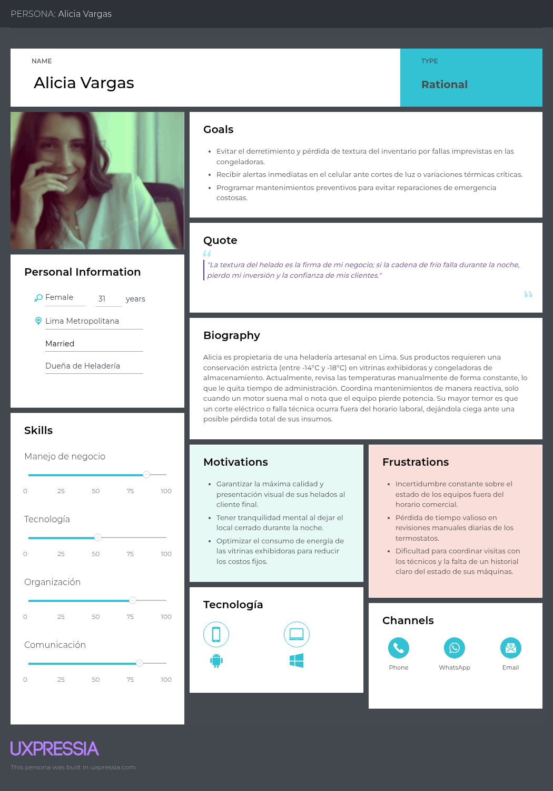
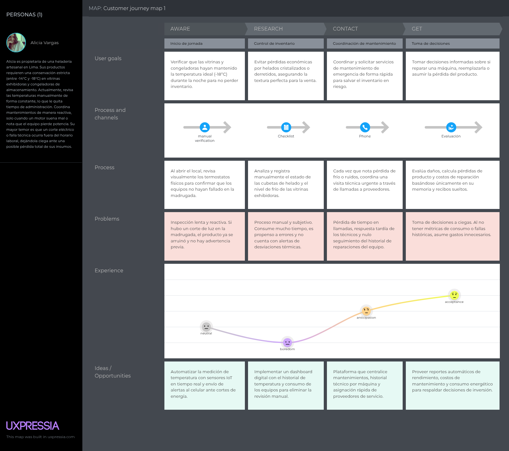
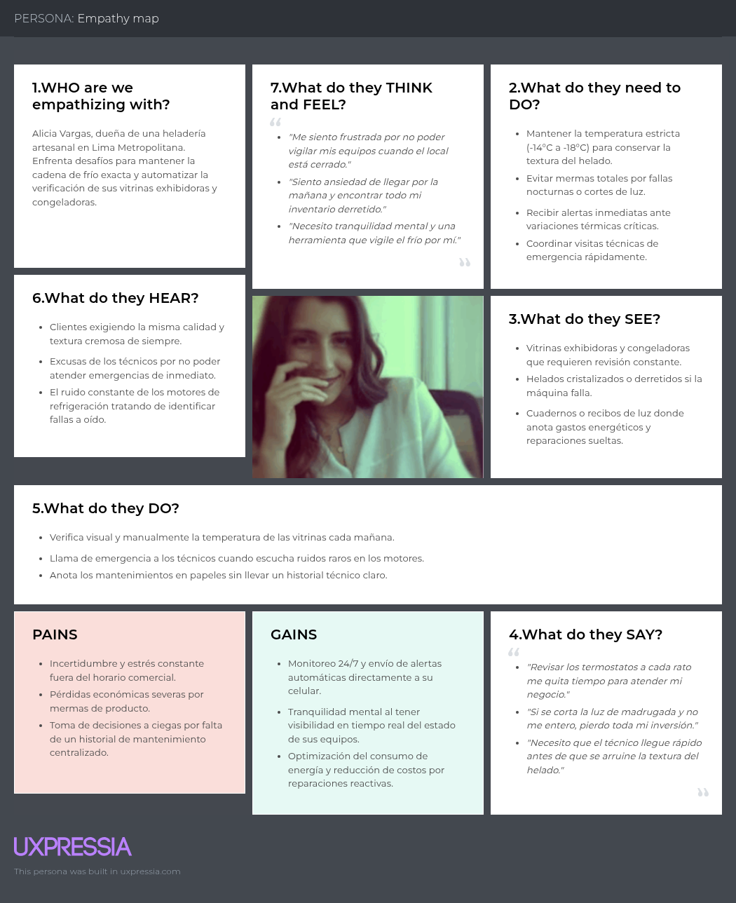
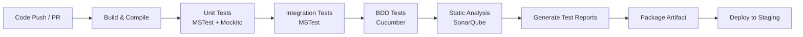

 <h1>Universidad Peruana de Ciencias Aplicadas</h1>
 
  <h2>Carrera: Ingeniería de Software</h2>
  <h2>Periodo: 2026-20</h2>
 
  <h2>Curso: Desarolllo de soluciones IOT</h2>
  <h2>Codigo del Curso: 1ASI0572</h2>
  <h2>NRC: 8740</h2>
  <h2>Profesor: David Carlos Olivera</h2>
 
 <h1>Informe del Avance 1</h1>
  <h2>Startup: Frostshield </h2>
  <h2>Producto: IceTrack </h2>
 
  <h2>Integrantes</h2>
 

 
| 
Alumno
 | 
Código
 |
| :-----------------------------------: | :-----------------------------------: |
|  -  |  -                              |
|  Gordon Salas, Gabriel Fernando       |  U20221E229                           |
|  Cuentas Peña, Joaquin Alberto       |  U20201f788                           |
|  Guillen Galindo, Julio Adolfo        |  U20241a352                           |
|  Jiménez Guerra, Gianmarco Fabian     |  U202123843                           |
|  Tenorio Medina, Piero Francesco      |  U202318731                           |
|  Quijada Magro, Jeremy Alexander      |  U202219657                           |
|  Fajardo Monrroy, Walter Luis         |  u202221632                           |

 

   <h3>Septiembre 2026</h3>

## Registro de Versiones del Informe

 
| Versión | Fecha      | Autor             | Descripción de modificación                        	|
| :-----: | :--------: | :---------------: | :----------------------------------------------------- |
| 1.1     | 15/04/2026 | Jeremy Quijada    | Desarrollo del Capitulo I Enfocado en la solución IOT |

## Project Report Collaboration Insights

- **URL de la organización del proyecto:** 
  https://github.com/IceTrack-IoT/Report-IceTrack_Iot
   

- **URL del repositorio del reporte:** 
  https://github.com/IceTrack-IoT/Report-IceTrack
   
  
- **URL del repositorio de la Landing Page:**
  https://github.com/IceTrack-IoT/Landing-Page-IceTrack
   

- **URL del repositorio del Frontend:** 
  https://github.com/IceTrack-IoT/Frontend-IceTrack
   

- **URL del repositorio del Backend:** 
  https://github.com/IceTrack-IoT/Platform-IceTrack

## Contenido

- [Capitulo 1: Introducción](#capitulo-1-introducción)
  - [1.1 Startup Profile](#11-startup-profile)
    - [1.1.1 Descripción de la Startup](#111-descripción-de-la-startup)
    - [1.1.2 Perfiles de integrantes del equipo](#112-perfiles-de-integrantes-del-equipo)
  - [1.2 Solution Profile](#12-solution-profile)
    - [1.2.1 Antecedentes y Problematica](#121-antecedentes-y-problematica)
    - [1.2.2 Lean UX Process](#122-lean-ux-process)
      - [1.2.2.1 Lean UX Problem Statements](#1221-lean-ux-problem-statements)
      - [1.2.2.2 Lean UX Assumption](#1222-lean-ux-assumption)
      - [1.2.2.3 Lean UX Hypothesis Statements](#1223-lean-ux-hypothesis-statements)
      - [1.2.2.4 Lean UX Canvas](#1224-lean-ux-canvas)
  - [1.3 Segmentos objetivos](#13-segmentos-objetivos)

- [Capítulo II: Requirements Elicitation \& Analysis](#capítulo-ii-requirements-elicitation--analysis)
  - [2.1. Competidores](#21-competidores)
    - [2.1.1. Análisis competitivo](#211-análisis-competitivo)
    - [2.1.2. Estrategias y tácticas frente a competidores](#212-estrategias-y-tácticas-frente-a-competidores)
  - [2.2. Entrevistas](#22-entrevistas)
    - [2.2.1. Diseño de entrevistas](#221-diseño-de-entrevistas)
    - [2.2.2. Registro de entrevistas](#222-registro-de-entrevistas)
    - [2.2.3. Análisis de entrevistas](#223-análisis-de-entrevistas)
  - [2.3. Needfinding](#23-needfinding)
    - [2.3.1. User Personas](#231-user-personas)
    - [2.3.2. User Task Matrix](#232-user-task-matrix)
    - [2.3.3. User Journey Mapping](#233-user-journey-mapping)
    - [2.3.4. Empathy Mapping](#234-empathy-mapping)
  - [2.4. Big Picture Event Storming](#24-big-picture-event-storming)
  - [2.5. Ubiquitous Language](#25-ubiquitous-language)

- [Capítulo III: Requirements Specification](#capítulo-iii-requirements-specification)
  - [3.1. User Stories.](#31-user-stories)
  - [3.2. Impact Mapping.](#32-impact-mapping)
  - [3.3. Product Backlog.](#33-product-backlog)

- [Capítulo IV: Solutcion Software Design](#capítulo-iv-solutcion-software-design)
  - [4.1. Strategic-Level Domain-Driven Design](#41-strategic-level-domain-driven-design)
    - [4.1.1. Design-Level EventStorming](#411-design-level-eventstorming)
      - [4.1.1.1. Candidate Context Discovery](#4111-candidate-context-discovery)
      - [4.1.1.2. Domain Message Flows Modeling](#4112-domain-message-flows-modeling)
      - [4.1.1.3. Bounded Context Canvases](#4113-bounded-context-canvases)
    - [4.1.2. Context Mapping](#412-context-mapping)
    - [4.1.3. Software Architecture](#413-software-architecture)
      - [4.1.3.1. Software Architecture System Landscape Diagram](#4131-software-architecture-system-landscape-diagram)
      - [4.1.3.2. Software Architecture Context Level Diagrams](#4132-software-architecture-context-level-diagrams)
      - [4.1.3.3. Software Architecture Container Level Diagrams](#4133-software-architecture-container-level-diagrams)
    - [4.2. Tactical-Level Domain-Driven Design](#42-tactical-level-domain-driven-design)
      - [4.2.1. Bounded Context: <Bounded Context Name>](#421-bounded-context-bounded-context-name)
        - [4.2.1.1. Domain Layer](#4211-domain-layer)
        - [4.2.1.2. Interface Layer](#4212-interface-layer)
        - [4.2.1.3. Application Layer](#4213-application-layer)
        - [4.2.1.4. Infrastructure Layer](#4214-infrastructure-layer)
        - [4.2.1.5. Bounded Context Software Architecture Component Level Diagrams](#4215-bounded-context-software-architecture-component-level-diagrams)
        - [4.2.1.6. Bounded Context Software Architecture Code Level Diagrams](#4216-bounded-context-software-architecture-code-level-diagrams)
          - [4.2.1.6.1. Bounded Context Domain Layer Class Diagrams](#42161-bounded-context-domain-layer-class-diagrams)
          - [4.2.1.6.2. Bounded Context Database Design Diagram](#42162-bounded-context-database-design-diagram)

- [Capítulo V: Solution UI/UX](#capítulo-v-solution-uiux)
  - [5.1. Style Guidelines](#51-style-guidelines)
    - [5.1.1. General Style Guidelines](#511-general-style-guidelines)
    - [5.1.2. Web Style Guidelines](#512-web-style-guidelines)
  - [5.2. Information Architecture](#52-information-architecture)
    - [5.2.1. Organization Systems](#521-organization-systems)
    - [5.2.2. Labeling Systems](#522-labeling-systems)
    - [5.2.3. SEO Tags and Meta Tags](#523-seo-tags-and-meta-tags)
    - [5.2.4. Searching Systems](#524-searching-systems)
    - [5.2.5. Navigation Systems](#525-navigation-systems)
  - [5.3. Landing Page UI Design](#53-landing-page-ui-design)
    - [5.3.1. Landing Page Wireframe](#531-landing-page-wireframe)
    - [5.3.2. Landing Page Mock-up](#532-landing-page-mock-up)
  - [5.4. Applications UX/UI Design](#54-web-applications-uxui-design)
    - [5.4.1. Applications Wireframes](#541-web-applications-wireframes)
    - [5.4.2. Applications Wireflow Diagrams](#542-web-applications-wireflow-diagrams)
    - [5.4.3. Applications Mock-ups](#543-web-applications-mock-ups)
    - [5.4.4. Applications User Flow Diagrams](#544-web-applications-user-flow-diagrams)
  - [5.5. Aplications Prototyping](#55-web-applications-prototyping)
  - [5.6. IoT Devive Design](#56-iot-devive-design)

- [Capítulo VI: Product Implementation, Validation & Deployment  ](#capítulo-iv-product-implementation-validation--deployment)
  - [6.1 Software Configuration Management](#61-software-configuration-management)
    - [6.1.1 Software Development Environment Configuration](#611-software-development-environment-configuration)
    - [6.1.2 Source Code Management](#612-source-code-management)
    - [6.1.3 Source Code Style Guide & Conventions](#613-source-code-style-guide--conventions)
    - [6.1.4 Software Deployment Configuration](#614-software-deployment-configuration)
  - [6.2 Landing Page, Services & Applications Implementation](#62-landing-page-services--applications-implementation)
    - [6.2.1 Sprint 1](#621-sprint-1)
      - [6.2.1.1 Sprint Planning](#6211-sprint-planning)
      - [6.2.1.2 Sprint Backlog](#6212-sprint-backlog)
      - [6.2.1.3 Sprint Review](#6213-sprint-review)
      - [6.2.1.4 Sprint Retrospective](#6214-sprint-retrospective)
      - [6.2.1.5 Sprint Demo](#6215-sprint-demo)
      - [6.2.1.6 Sprint Retrospective Summary](#6216-sprint-retrospective-summary)
      - [6.2.1.7 Sprint Retrospective Action Items](#6217-sprint-retrospective-action-items)
      - [6.2.1.8 Sprint Retrospective Reminders](#6218-sprint-retrospective-reminders)
      - [6.2.1.9 Sprint Retrospective Checklist](#6219-sprint-retrospective-checklist)
  - [6.3 Validation Interviews](#63-validation-interviews)
    - [6.3.1 Diseño de entrevistas](#631-diseño-de-entrevistas)
    - [6.3.2 Registro de entrevistas](#632-registro-de-entrevistas)
    - [6.3.3 Evaluaciones según heurísticas](#633-evaluaciones-según-heurísticas)
  - [6.4 Video About-the-Product](#64-video-about-the-product)

- [Conclusiones](#conclusiones)
  - [Conclusiones y Recomendaciones](#conclusiones-y-recomendaciones)
- [Bibliografía](#bibliografía)
- [Anexos](#anexos)
  - [Recursos y enlaces del proyecto](#recursos-y-enlaces-del-proyecto)

## Student Outcome
El curso contribuye al cumplimiento del Student Outcome ABET:

**ABET – EAC - Student Outcome 5**

**Criterio**: *La capacidad de funcionar efectivamente en un equipo cuyos miembros juntos proporcionan liderazgo, crean un entorno de colaboración e inclusivo, establecen objetivos, planifican tareas y cumplen objetivos.*

En el siguiente cuadro se describe las acciones realizadas y enunciados de conclusiones por parte del grupo, que permiten sustentar el haber alcanzado el logro del ABET – EAC - Student Outcome 5.

| Criterio específico | Acciones realizadas | Conclusiones |
| :------------------ | :------------------ | :----------- |
| Trabaja en equipo para proporcionar liderazgo en forma conjunta | - |- |
| Crea un entorno colaborativo e inclusivo, establece metas, planifica tareas y cumple objetivos. | - | -|

# Capitulo 1: Introducción

## 1.1 Startup Profile

### 1.1.1 Descripción de la Startup

Nuestra startup ofrece una plataforma de Inteligencia de Datos orientada a optimizar la gestión, monitoreo y mantenimiento de equipos de refrigeración en negocios que dependen de la cadena de frío. La plataforma permite recopilar y centralizar información proveniente de sensores IoT instalados en los equipos, así como integrarse con los controladores y sistemas de monitoreo existentes en los negocios, transformando los datos obtenidos en información útil para la toma de decisiones.

Las funcionalidades clave de la plataforma incluyen el monitoreo en tiempo real de variables como temperatura, consumo energético y tiempo de funcionamiento de los equipos. Además, genera alertas automáticas ante anomalías o posibles fallos, ofrece informes técnicos detallados, historiales de rendimiento y permite gestionar y programar mantenimientos de manera inteligente. Estas herramientas permiten a empresas, técnicos y proveedores supervisar continuamente el estado de los equipos, mejorar la eficiencia operativa, prevenir pérdidas ocasionadas por fallos inesperados y mantener un registro completo de su funcionamiento y mantenimiento.

**Misión:** Ofrecer una solución tecnológica inteligente que permita a las empresas proteger su inventario y optimizar la gestión, monitoreo y mantenimiento de sus equipos de refrigeración. Asimismo, proporcionar herramientas especializadas que faciliten el trabajo de técnicos y proveedores, mejorando su eficiencia y capacidad de respuesta.

**Visión:** Ser la empresa líder en gestión, monitoreo y mantenimiento inteligente de equipos de refrigeración en el mercado peruano, comenzando por consolidar nuestra presencia y posicionamiento en Lima.

### 1.1.2 Perfiles de integrantes del equipo

| **Integrante**            | **Quijada Magro Jeremy Alexander**        									                   |
| :------------------------ | :----------------------------------------------------------------------------- |
| **Código del Estudiante** | u202219657                                   									            	   |
| **Carrera**               | Ingeniería de Software                       									                 |
| **Descripción**           | Mi nombre es Jeremy Alexander Quijada Magro, tengo 21 años y curso la carrera de Ingeniería de Software. Me considero una persona ordenada y responsable. Me centro en conocmiento en C#, Kva y el uso del front con Vue, Angular y React. En este proyecto apoyaré con todos los conocimientos que he adquirido en los cursos pasados con la meta de aprender a realizar pruebas de calidad sobre este proyecto  										                                                                            		|
| **Foto**                  |  |

---

| **Integrante**            | **Guillen Galindo Julio Adolfo**                                     						 |
| :------------------------ | :------------------------------------------------------------------------------- |
| **Código del Estudiante** | u20241a352                       						                      				  	   |
| **Carrera**               | Ingeniería de Software                                                           |
| **Descripción**           | Actualmente curso la carrera de Ingeniería de Software en la UPC. Me considero una persona discreta, pero responsable y enfocada en cumplir los proyectos dentro de los plazos establecidos. Poseo conocimientos en C++ y Python; disfruto trabajar en equipo cuando existe colaboración y apoyo mutuo. Además, me motiva aplicar lo aprendido para afrontar los desafíos que puedan surgir en los próximos ciclos.                                                                          |
| **Foto**                  |  |

---

| **Integrante**            | **Gianmarco Fabian Jiménez Guerra**                                        	            |
| :------------------------ | :-------------------------------------------------------------------------------------- |
| **Código del Estudiante** | u202123843																	                                            |
| **Carrera**               | Ingeniería de Software														                                      |
| **Descripción**           | Estudiante de Ingeniería de Software con conocimiento sobre desarrollo de aplicaciones web y análisis de datos. Estoy motivado por aprender nuevos temas relacionados a Software y por trabajar en equipo. Considero que mi conocimiento sobre las tecnologías: Java, Python, Angular y C# me permitirá desempeñarme de manera correcta para apoyar en este proyecto.|
| **Foto**                  |      |

---

| **Integrante**            | **Piero Francesco Tenorio Medina**                                        	            |
| :------------------------ | :-------------------------------------------------------------------------------------- |
| **Código del Estudiante** | u202318731																	                                            |
| **Carrera**               | Ingeniería de Software														                                      |
| **Descripción**           | Estudiante de la carrera de Ingeniería de Software con conocimiento sobre desarrollo de aplicaciones web, especialmente en el entorno Backend. Tengo conocimientos sobre las tecnologías: Java,Vue, Angular y C#. Como integrante de un equipo, me gusta trabajar y comunicarme con los integrantes para poder cumplir los objetivos del proyecto. Estoy abierto a aprender nuevas herramientas que me permitan desempeñar mejor dentro de mi carrera.|
| **Foto**                  |      |

---

| **Integrante**            | **-**                                                  |
| :------------------------ | :----------------------------------------------------------------------------------- |
| **Código del Estudiante** | -                                                                          |
| **Carrera**               | Ingeniería de Software                                                               |
| **Descripción**           | -            |
| **Foto**                  | - |

---

| **Integrante**            | **-**                                                    |
| :------------------------ | :----------------------------------------------------------------------------------- |
| **Código del Estudiante** | -                                                                          |
| **Carrera**               | -                                                            |
| **Descripción**           | -													                                                   |
| **Foto**                  | - |

## 1.2 Solution Profile

### 1.2.1 Antecedentes y Problematica

| **5W & 2H**                                                 | **Descripcion**                                                                 |
| :---------------------------------------------------------- | :------------------------------------------------------------------------------ |
| **What: ¿Cuál es el problema?**                 			      | Los negocios que dependen de la cadena de frío enfrentan vulnerabilidades operativas críticas debido a la falta de telemetría y control en tiempo real. Esta carencia provoca fallas mecánicas inesperadas, incrementos dramáticos en el consumo eléctrico —la refrigeración puede representar entre el 30% y el 60% del gasto energético total en plantas de procesamiento (Dawsongroup, 2024)— y un mantenimiento puramente reactivo. A nivel nacional, el deficiente manejo de la cadena de frío es responsable de la pérdida de más del 33% de los alimentos producidos (FAO, citado en Agraria, 2019), causando un severo impacto financiero. 	   	            |
| **When: ¿Cuándo sucede este problema?**         			      | Es una amenaza constante durante la operación 24/7 de las cámaras térmicas. El riesgo se agudiza en horarios no laborables, durante picos de producción estacional, o frente a anomalías climáticas como las olas de calor advertidas por entidades como Osinergmin, que elevan la exigencia térmica. La situación se torna crítica ante la ausencia de un monitoreo automatizado que notifique desviaciones de temperatura (ej. quiebres de los -18°C en congelación) antes de que el deterioro químico y biológico del producto sea irreversible (Zabarburu, 2026).					                 |
| **Where: ¿Dónde se produce este suceso?**      			        | El problema tiene alcance nacional en el Perú, impactando a supermercados, laboratorios y plantas agroindustriales. No obstante, el impacto es crítico en Lima, el principal nodo logístico del país. La limitada infraestructura refrigerada y las brechas logísticas en estas zonas incrementan el riesgo en la cadena de suministro alimentaria y médica (Agroperú, 2026). Además, afecta directamente a las empresas contratistas de mantenimiento que operan en diversas sedes sin capacidad de gestión centralizada de los equipos.           |
| **Who: ¿Quiénes están involucrados?**          			        | Involucra principalmente a dos actores: Los dueños y operadores comerciales (retail, agroexportación, clínicas) que asumen directamente los costos de mermas, sobrecostos energéticos y daños reputacionales. Las empresas de servicio técnico, que operan en desventaja al tener que atender emergencias sin datos de diagnóstico preventivo, lo que reduce su eficiencia operativa y aumenta los tiempos de respuesta (Seguas, 2024). 	  |
| **Why: ¿Cuál es la causa del problema?**        			      | La causa raíz es la falta de digitalización y la fragmentación de datos técnicos en "silos de información". Los parámetros vitales operan atrapados en controladores electrónicos aislados que no transmiten información a un sistema en la nube. Esta falta de visibilidad en línea impide detectar ineficiencias tempranas —como aislamientos defectuosos o desgaste de compresores— obligando a una gestión reactiva que actúa solo cuando el componente ya falló o el producto se dañó (Dawsongroup, 2024).  |
| **How: ¿Qué llevó a la persona a llegar a esta situación?** | La situación actual deriva de una histórica falta de inversión tecnológica y dependencia de esquemas de mantenimiento correctivo ("apagar incendios"). En lugar de adoptar plataformas IoT para el monitoreo, las organizaciones han operado a ciegas, esperando que el problema se manifieste físicamente. Este enfoque ha prolongado un ciclo de ineficiencias, elevados Costos Totales de Propiedad (TCO) y un desgaste acelerado de infraestructura que una estrategia de mantenimiento predictivo habría evitado.    |
| **How Much: ¿Cuánto es el impacto financiero?** 			      | El impacto económico es devastador y cuantificable. A nivel nacional, las deficiencias y fallas en la gestión de la cadena de frío provocan que el Perú pierda más del 33% de los alimentos que produce anualmente (Agraria.pe, 2019). Además, en sectores críticos como el de la salud, una sola interrupción no detectada en los sistemas de refrigeración ha generado pérdidas de hasta S/ 14 millones por lotes malogrados debido a la ruptura térmica (La Noticia Perú, 2023). A estos valores directos se suma el sobreconsumo eléctrico constante y los altos costos del mantenimiento correctivo de emergencia. |

### 1.2.2 Lean UX Process

#### 1.2.2.1 Lean UX Problem Statements

El estado actual del sector de la refrigeración comercial se caracteriza por una gestión principalmente reactiva de los equipos, especialmente en negocios que dependen de la cadena de frío, como restaurantes, supermercados y laboratorios, así como en técnicos especializados y proveedores de equipos que brindan servicios de mantenimiento. Estos actores enfrentan problemas relacionados con fallas inesperadas, pérdidas de inventario, consumo energético elevado, dificultad para realizar un seguimiento continuo del estado de los equipos y falta de información centralizada para gestionar los servicios de mantenimiento.

Aunque algunos negocios cuentan con sensores, controladores o sistemas de monitoreo, la información suele encontrarse aislada entre diferentes equipos, fabricantes o herramientas, dificultando su interpretación y aprovechamiento para la toma de decisiones. Asimismo, los técnicos y proveedores requieren información histórica y herramientas que les permitan organizar sus actividades, diagnosticar problemas y brindar un servicio más eficiente.

Lo que las soluciones existentes no abordan completamente es la necesidad de contar con una plataforma especializada que centralice la información de los equipos de refrigeración y, al mismo tiempo, permita obtener datos directamente mediante sensores IoT, independientemente de los sistemas existentes en el negocio. Este vacío limita la capacidad de los usuarios para detectar anomalías oportunamente, anticiparse a posibles fallas, analizar el rendimiento de los equipos y mantener un historial unificado de su funcionamiento y mantenimiento.

Nuestro producto, IceTrack, abordará este vacío mediante una plataforma de Inteligencia de Datos especializada en equipos de refrigeración. La solución permitirá conectar sensores IoT para recopilar información en tiempo real, integrar datos provenientes de controladores y sistemas de monitoreo existentes, centralizar dicha información y transformarla en indicadores, alertas y recomendaciones útiles. Además, proporcionará herramientas para la gestión de mantenimientos, historial técnico, seguimiento de servicios y análisis del rendimiento de los equipos.

Nuestro enfoque inicial estará dirigido a negocios de Lima que dependen de la cadena de frío y necesitan reducir los riesgos asociados a fallas en sus equipos, así como a técnicos y proveedores de servicios de refrigeración que buscan mejorar la gestión y eficiencia de sus operaciones.

Sabremos que tendremos éxito cuando los negocios utilicen de manera recurrente el monitoreo de sus equipos, respondan oportunamente a las alertas generadas por la plataforma, reduzcan las fallas críticas y las pérdidas asociadas a problemas de refrigeración, y mejoren su eficiencia energética. Asimismo, consideraremos exitoso el producto cuando técnicos y proveedores utilicen la plataforma para gestionar sus servicios, reduzcan sus tiempos de atención y mantengan una mayor continuidad en sus relaciones con los clientes.

#### 1.2.2.2 Lean UX Assumption

##### Business Assumptions

- Creemos que existe una oportunidad de mercado para una solución especializada en la gestión y monitoreo inteligente de equipos de refrigeración.
- Creemos que los negocios que dependen de la cadena de frío están dispuestos a invertir en una solución que permita reducir pérdidas y mejorar el control de sus equipos..
- Creemos que la incorporación de sensores IoT como parte de la solución permitirá diferenciarnos de las plataformas genéricas de gestión de mantenimiento.
- Creemos que establecer alianzas con proveedores y técnicos especializados facilitará la entrada de IceTrack al mercado.
- Creemos que iniciar operaciones en Lima permitirá validar el modelo de negocio antes de ampliar la solución a otras regiones del Perú.

##### Business Outcome Assumptions

- Creemos que la adopción de IceTrack permitirá reducir las pérdidas económicas ocasionadas por fallas en los sistemas de refrigeración.
- Creemos que el monitoreo continuo permitirá disminuir la frecuencia y el impacto de fallas críticas.
- Creemos que la identificación de ineficiencias permitirá reducir el consumo energético de los equipos monitoreados.
- Creemos que la gestión centralizada permitirá reducir los costos asociados al mantenimiento correctivo y las reparaciones de emergencia.
- Creemos que la mejora en la gestión de servicios permitirá incrementar la productividad de los técnicos y proveedores.
- Creemos que una experiencia de servicio más transparente y proactiva permitirá aumentar la satisfacción y retención de los clientes.

##### User Assumptions

- Creemos que los negocios que dependen de la cadena de frío serán usuarios principales de la plataforma y utilizarán el sistema para supervisar el estado de sus equipos.
- Creemos que los responsables de los negocios necesitarán visualizar información de temperatura, consumo energético, tiempo de funcionamiento y alertas.
- Creemos que los técnicos especializados en refrigeración utilizarán la plataforma para gestionar servicios, consultar información de los equipos y revisar su historial técnico.
- Creemos que los proveedores de equipos utilizarán la plataforma como una herramienta para mejorar y diferenciar sus servicios postventa.
- Creemos que algunos usuarios tendrán conocimientos tecnológicos limitados, por lo que necesitarán una interfaz sencilla y procesos de configuración intuitivos.
- Creemos que los usuarios requerirán acceso a la plataforma desde diferentes ubicaciones y dispositivos para supervisar equipos y gestionar servicios.

##### User Outcome and Benefit Assumptions

- Creemos que los negocios desean conocer en tiempo real el estado de sus equipos para detectar problemas antes de que ocasionen pérdidas.
- Creemos que los negocios desean recibir alertas oportunas que les permitan actuar ante variaciones anormales de temperatura u otras condiciones críticas.
- Creemos que los responsables de los negocios desean reducir sus costos operativos mediante un menor consumo energético y una mejor planificación del mantenimiento.
- Creemos que los técnicos desean disponer de información histórica y actualizada de cada equipo para diagnosticar problemas y realizar servicios con mayor eficiencia.
- Creemos que los técnicos desean organizar sus tareas, visitas y mantenimientos desde una única plataforma.
- Creemos que los proveedores desean contar con información centralizada que les permita ofrecer un servicio postventa más rápido, transparente y eficiente.
- Creemos que todos los usuarios desean contar con un historial confiable de los equipos para facilitar el seguimiento de su rendimiento y mantenimiento.

##### Feature Assumptions

- Creemos que la conexión de sensores IoT a los equipos permitirá recopilar automáticamente datos de temperatura y otras variables relevantes en tiempo real.
- Creemos que la integración con controladores y sistemas de monitoreo existentes permitirá centralizar información sin depender exclusivamente de una única fuente de datos.
- Creemos que un sistema de monitoreo en tiempo real permitirá a los usuarios visualizar el estado actual de sus equipos desde la plataforma.
- Creemos que un sistema de alertas automáticas permitirá notificar oportunamente a los usuarios cuando se detecten valores anormales o condiciones que puedan indicar una falla.
- Creemos que el historial técnico de cada equipo permitirá a los usuarios consultar su comportamiento, incidencias y mantenimientos anteriores para facilitar la toma de decisiones.
- Creemos que un módulo de gestión y programación de mantenimientos permitirá a técnicos y proveedores organizar sus actividades y reducir mantenimientos reactivos.
- Creemos que los informes de rendimiento permitirán identificar tendencias, anomalías e ineficiencias en los equipos.
- Creemos que el análisis de consumo energético permitirá identificar oportunidades para reducir el uso innecesario de energía.
- Creemos que una interfaz web y móvil permitirá a los usuarios consultar información y gestionar sus actividades tanto desde sus oficinas como desde el campo.

#### 1.2.2.3 Lean UX Hypothesis Statements

**Hipótesis 1: Conexión mediante sensores IoT**

Creemos que lograremos aumentar la adopción y el valor percibido de IceTrack al proporcionar datos confiables y continuos sobre los equipos de refrigeración.

Si los responsables de negocios que dependen de la cadena de frío y los técnicos especializados obtienen información automática y actualizada sobre el estado de los equipos con la conexión de sensores IoT que recopilen datos directamente desde los sistemas de refrigeración.

Sabremos que hemos tenido éxito cuando los usuarios mantengan sus equipos conectados y consulten regularmente los datos recopilados por los sensores para supervisar su funcionamiento.

**Hipótesis 2: Monitoreo en tiempo real**

Creemos que lograremos reducir la ocurrencia e impacto de fallas críticas relacionadas con los equipos de refrigeración.

Si los responsables de negocios que dependen de la cadena de frío pueden conocer en tiempo real el estado y las principales variables de funcionamiento de sus equipos con un módulo de monitoreo en tiempo real conectado a sensores IoT y otras fuentes de datos.

Sabremos que hemos tenido éxito cuando los usuarios consulten regularmente el estado de sus equipos y detecten anomalías antes de que generen una falla crítica o una pérdida de inventario.

**Hipótesis 3: Alertas automáticas**

Creemos que lograremos reducir las pérdidas ocasionadas por fallas o condiciones anormales de los equipos.

Si los responsables de negocios y técnicos especializados pueden recibir una notificación oportuna ante una anomalía o condición crítica con un sistema de alertas automáticas basado en los datos recopilados por la plataforma.

Sabremos que hemos tenido éxito cuando los usuarios reciban las alertas, actúen ante ellas y logren resolver o mitigar incidentes antes de que produzcan pérdidas significativas.

**Hipótesis 4: Historial técnico**

Creemos que lograremos mejorar la eficiencia del diagnóstico y mantenimiento de los equipos.

Si los técnicos y proveedores de servicios de refrigeración pueden consultar el comportamiento histórico, incidencias y mantenimientos realizados en cada equipo con un historial técnico centralizado y asociado a cada activo.

Sabremos que hemos tenido éxito cuando los técnicos consulten el historial durante sus servicios y reduzcan el tiempo necesario para identificar las causas de los problemas.

**Hipótesis 5: Gestión y programación de mantenimientos**

Creemos que lograremos reducir los costos asociados al mantenimiento reactivo y mejorar la productividad de los técnicos.

Si los técnicos y proveedores de servicios de refrigeración pueden planificar, organizar y realizar seguimiento de sus actividades de mantenimiento con un módulo de programación y gestión de mantenimientos.

Sabremos que hemos tenido éxito cuando aumente el porcentaje de mantenimientos planificados y disminuya el tiempo promedio empleado en gestionar y atender servicios.

**Hipótesis 6: Informes de rendimiento**

Creemos que lograremos mejorar la toma de decisiones relacionada con el funcionamiento de los equipos.

Si los responsables de negocios y proveedores pueden analizar el rendimiento de sus equipos mediante información histórica y reportes comprensibles con un módulo de generación de informes de rendimiento.

Sabremos que hemos tenido éxito cuando los usuarios consulten los informes periódicamente y utilicen la información obtenida para realizar acciones de mantenimiento, optimización o reemplazo de equipos.

**Hipótesis 7: Análisis del consumo energético**

Creemos que lograremos disminuir los costos operativos asociados al consumo energético de los equipos de refrigeración.

Si los responsables de negocios pueden identificar equipos con un consumo energético elevado o comportamientos ineficientes con un módulo de monitoreo y análisis del consumo energético.

Sabremos que hemos tenido éxito cuando los usuarios identifiquen oportunidades de ahorro y se observe una reducción del consumo energético en los equipos intervenidos.

**Hipótesis 8: Gestión de usuarios, roles y ubicaciones**

Creemos que lograremos facilitar la administración de equipos en organizaciones con múltiples usuarios o establecimientos.

Si los responsables de negocios y proveedores que gestionan múltiples usuarios, equipos o ubicaciones pueden controlar el acceso a la información según las responsabilidades de cada persona con un sistema de gestión de usuarios, roles y ubicaciones.

Sabremos que hemos tenido éxito cuando las organizaciones puedan administrar diferentes usuarios y equipos desde una misma cuenta sin comprometer la seguridad ni la organización de la información.

**Hipótesis 9: Plataforma multiplataforma**

Creemos que lograremos aumentar la frecuencia de uso de IceTrack y facilitar la supervisión de los equipos fuera de las oficinas.

Si los responsables de negocios y técnicos pueden consultar información y gestionar sus actividades desde diferentes ubicaciones con una plataforma disponible mediante interfaces web y móvil.

Sabremos que hemos tenido éxito cuando los usuarios accedan a la plataforma tanto desde sus lugares de trabajo como durante sus actividades en campo.

#### 1.2.2.4 Lean UX Canvas

<figure style="page-break-inside: avoid; text-align: center;">
  
  <figcaption style="font-size: 0.9em; color: #555;">
    <strong>Figura 1:</strong> Lean UX Canvas.
  </figcaption>
</figure>

## 1.3 Segmentos objetivos

**Segmento Objetivo 1: Negocios con equipos de refrigeración**

**Aspectos demográficos:**
- **Tipo de negocio:** Medianas empresas.
- **Rubro:** Alimentario, farmacéutico, restauración y comercio minorista.
- **Nivel de necesidad:** Alta dependencia de sistemas de refrigeración.

**Aspectos geográficos:**
- **Nacionalidad:** Peruana.
- **Zona geográfica:** Urbana.
- **Departamento:** Lima.

**Aspectos psicográficos:**
- **Motivación:** Evitar pérdidas económicas por fallas en la refrigeración y reducir costos operativos.
- **Valores:** La eficiencia, la calidad del inventario y el control de las operaciones.
- **Intereses:** La adopción de tecnología para optimizar la gestión y asegurar la tranquilidad en la operación diaria.

---

**Segmento Objetivo 2: Técnicos y empresas de mantenimiento**

**Aspectos demográficos:**
- **Tipo de negocio:** Compañías de servicio técnico.
- **Rubro:** Mantenimiento y reparación de equipos de refrigeración.
- **Nivel de necesidad:** Alta demanda de organización y eficiencia en sus procesos.

**Aspectos geográficos:**
- **Nacionalidad:** Peruana.
- **Zona geográfica:** Urbana.
- **Departamento:** Lima.

**Aspectos psicográficos:**
- **Motivación:** Incrementar la productividad, reducir el tiempo en tareas administrativas y mejorar la calidad de su servicio.
- **Valores:** La profesionalidad, la eficiencia y la tecnología como herramienta para facilitar su trabajo.
- **Intereses:** Contar con una plataforma que centralice la información, automatice la generación de reportes y mejore la comunicación con sus clientes.

# Capítulo II: Requirements Elicitation & Analysis

## 2.1. Competidores

**Competidor 1: ServiceTitan**
ServiceTitan es un software en la nube diseñado para negocios de servicios de campo, como climatización (HVAC), plomería y electricidad. Centraliza tareas clave como la asignación de citas, el seguimiento de proyectos y la facturación, destacando por una interfaz intuitiva que agiliza la operativa diaria del personal técnico en tiempo real.

---

**Competidor 2: Sensefinity**
Sensefinity es una solución basada en IoT diseñada para supervisar la cadena de frío. La plataforma rastrea variables críticas como la temperatura, la humedad y las vibraciones tanto en tránsito como en bodega, emitiendo alertas inmediatas e informes en la nube ante cualquier anomalía. Esto permite a sectores como la industria farmacéutica, el comercio minorista y la logística garantizar una trazabilidad integral, cumplir con normativas estrictas y minimizar el desperdicio de productos sensibles.

---

**Competidor 3: TempGenius**
TempGenius es un sistema de supervisión en tiempo real enfocado en el control de temperatura y humedad para múltiples sectores, con especial énfasis en la refrigeración comercial. A través de sensores en la nube, la plataforma genera informes continuos y emite notificaciones inmediatas ante cualquier desvío térmico, brindando a las empresas mayor control operativo para prevenir pérdidas de producto e impactos económicos.

### 2.1.1. Análisis competitivo

<table> 
  <tr>
    <th colspan="7"> Competitive Analysis Landscape </th>
  </tr>
  <tr>
    <td colspan="2" rowspan="2">¿Por qué llevar acabo este análisis? </td>
    <td colspan="5"> Con el objetivo de evaluar y comparar funcionalidades, tecnología, precios y estrategias de marketing de los principales competidores para identificar nuestras fortalezas y debilidades, detectar oportunidades negocio y identificar puntos que nos hagan diferenciar de la competencia. </td>
  </tr>
  <tr>
  </tr>
  <tr>
    <td colspan="2"> </td>
    <td> IceTrack   </img> </td>
    <td> ServiceTitan   </img> </td>
    <td> Sensefinity   </img> </td>
    <td> TempGenius   </img> </td>
  </tr>
  <tr>
    <td rowspan="2">Perfil</td>
    <td>Overview</td>
    <td> IceTrack es una plataforma integral de monitoreo y gestión para sistemas de refrigeración, que conecta negocios con técnicos especializados. Ofrece monitoreo en tiempo real, alertas automáticas, mantenimiento preventivo, y trazabilidad de cada equipo. </td>
    <td> ServiceTitan es una plataforma de gestión de servicios basada en la nube que ofrece soluciones de software para empresas de servicios, incluidos técnicos de HVAC, fontaneros y electricistas. </td>
    <td> Sensefinity es una solución IoT que combina sensores físicos con plataforma en la nube para monitoreo y trazabilidad de la cadena de frío. </td>
    <td> TempGenius es un software de monitoreo de temperatura y humedad en tiempo real para diversas industrias, incluida la refrigeración comercial. Permite a los usuarios gestionar y recibir alertas automáticas sobre sus equipos. </td>
  </tr>
  <tr>
    <td>Ventaja competitiva ¿Qué valor ofrece a los clientes?</td>
    <td> Ofrece una solución automatizada y centralizada para negocios que necesitan monitorear y gestionar sus equipos de refrigeración. Permite a los técnicos optimizar sus visitas y el mantenimiento preventivo, mejorando la eficiencia operativa. </td>
    <td> Ofrece una plataforma todo-en-uno para la gestión de servicios con características como la programación de citas, facturación y seguimiento en tiempo real de proyectos. </td>
    <td> Ofrece soluciones con foco en logística y permite monitorear productos en tiempo real durante su transporte y almacenamiento. </td>
    <td> Ofrece monitoreo preciso en tiempo real de la temperatura y humedad, con alertas automáticas, y un enfoque especial en la fiabilidad y precisión de los datos. </td>
  </tr>
  <tr>
    <td rowspan="2">Perfil de Marketing</td>
    <td> Mercado Objetivo </td>
    <td> Negocios que dependen de sistemas de refrigeración, como supermercados, minimarkets, laboratorios, restaurantes, entre otros. También incluye técnicos de refrigeración y proveedores de equipos. </td>
    <td> Empresas de servicios como HVAC, fontaneros, electricistas, y otros proveedores de servicios técnicos. </td>
    <td> Supermercados, farmacéuticas, operadores logísticos y empresas de exportación internacional. </td>
    <td> Usuarios de diversas industrias, especialmente en áreas que requieren monitoreo continuo de temperatura y humedad, como el sector alimentario y farmacéutico. </td>
  </tr>
  <tr>
    <td> Estrategias de Marketing </td>
    <td> Marketing digital, colaboraciones estratégicas con empresas del sector alimentario y farmacéutico, demostraciones gratuitas y promociones en redes sociales. </td>
    <td> Marketing digital, colaboraciones con empresas de servicios y promoción en plataformas de negocio. </td>
    <td> Marketing en ferias globales de logística y alianzas estratégicas con empresas de exportación. </td>
    <td> Marketing en redes sociales, promociones para nuevos usuarios y colaboraciones con industrias reguladas como la farmacéutica y alimentaria. </td>
  </tr>
  <tr>
    <td rowspan="3">Perfil de Producto</td>
    <td> Productos & Servicios </td>
    <td> Gestión de equipos de refrigeración en tiempo real, alertas automáticas, mantenimiento preventivo, reportes técnicos automáticos y trazabilidad de cada equipo. </td>
    <td> Plataforma de gestión de servicios que incluye programación de citas, gestión de personal, facturación, y seguimiento de proyectos en tiempo real. </td>
    <td> Plataforma de monitoreo y gestión de sistemas de refrigeración en la nube, con alertas preventivas e informes automáticos. Además ofrece sensores para monitorear temperatura, humedad, etc. </td>
    <td> Plataforma de monitoreo de temperatura y humedad en tiempo real, con alertas automáticas, reportes detallados y gestión de datos históricos. </td>
  </tr>
  <tr>
    <td> Precios & Costos </td>
    <td> Modelo basado en comisiones bajas por cada reserva o cita pagada para negocios, con una versión gratuita para usuarios. </td>
    <td> Suscripción mensual o anual, con tarifas adicionales por características avanzadas o soporte personalizado. </td>
    <td> Basado en subscripciones por conectividad y por servicios utilizados. Posible coste de instalación de hardware. </td>
    <td> Varía según la cantidad de equipos monitoreados y las características seleccionadas, con modelos de suscripción mensual o anual. </td>
  </tr>
  <tr> 
    <td>Canales de distribución (Web y/o Móvil)</td>
    <td> Plataforma en línea y aplicación móvil disponible para dispositivos iOS y Android. </td>
    <td> Plataforma en línea y aplicación móvil disponible para dispositivos iOS y Android. </td>
    <td> Plataforma en línea y aplicación móvil. </td>
    <td> Aplicación móvil disponible en tiendas de aplicaciones y plataforma en línea. </td>
  </tr>
  <tr>
    <td rowspan="4"> Análisis SWOT </td>
    <td> Fortalezas </td>
    <td> Monitoreo en tiempo real, alertas automáticas y mantenimiento preventivo para evitar fallas críticas. Función de trazabilidad completa de los equipos. </td>
    <td> Amplia funcionalidad para gestión de servicios y seguimiento en tiempo real de proyectos. </td>
    <td> Especialización en IoT y trazabilidad de la cadena de frío. Permite cumplir con normativas logísticas. Hardware propio optimizado para monitoreo en tiempo real.</td>
    <td> Precisión en el monitoreo de temperatura y humedad, con alertas automáticas y un enfoque flexible en diferentes industrias. </td>
  </tr>
  <tr>
    <td> Debilidades </td>
    <td> Dependencia de la adopción inicial por parte de los usuarios, lo que podría afectar la expansión. </td>
    <td> Puede ser más complejo de usar para pequeñas empresas sin experiencia en gestión de software. </td>
    <td> Fuerte dependencia de hardware, tiene menos presencia en el Perú. </td>
    <td> Puede resultar costoso para pequeñas empresas debido a las suscripciones y los costos adicionales por dispositivos. </td>
  </tr>
  <tr>
    <td> Oportunidades </td>
    <td> Expansión en el sector de la gestión de refrigeración, con foco en la eficiencia operativa y la reducción de costos. </td>
    <td> Expansión a nuevos mercados, introducción de nuevos servicios, mejorar la experiencia del usuario. </td>
    <td> Alianza con operadores logísticos. Aumento de regulaciones en farmaceúticas y alimentos. </td>
    <td> Expansión a nuevos mercados, introducción de nuevas características y servicios, colaboraciones estratégicas con marcas de belleza. </td>
  </tr>
  <tr>
    <td> Amenazas </td>
    <td> Competencia de aplicaciones ya establecidas en la gestión de refrigeración y mantenimiento. </td>
    <td> Competencia de otras plataformas de gestión de servicios que ofrecen características similares. </td>
    <td> Competencia con soluciones más económicas. Restricciones de conectividad por IoT en ciertas regiones. </td>
    <td> Competencia de otras plataformas de monitoreo de temperatura y humedad, con características similares y precios más bajos. </td>
  </tr>
</table>

### 2.1.2. Estrategias y tácticas frente a competidores

Con el fin de posicionarnos con ventaja en el sector de supervisión y administración de frío comercial, definimos acciones clave orientadas a superar las propuestas actuales del mercado:

1. **Estrategias de Diferenciación:**

**Solución Integral para Refrigeración comercial:** Mientras que otras alternativas son genéricas, IceTrack se enfoca de lleno en la cadena de frío, combinando telemetría en vivo, notificaciones preventivas y registro operativo continuo. Este enfoque minimiza paradas imprevistas y facilita una administración preventiva de cada unidad de refrigeración.

**Trazabilidad Completa de Equipos:** La plataforma registra la hoja de vida técnica de cada activo, una cualidad ausente en herramientas generales como ServiceTitan en lo relativo al frío comercial. Esto se traduce en una supervisión precisa de los activos y un estándar de servicio superior.

**Interfaz Intuitiva y Fácil de Usar:** El diseño del sistema prioriza la simplicidad operativa, permitiendo que tanto operarios de campo como administradores lo manejen con fluidez desde el primer día, sin requerir capacitaciones complejas.

2. **Tácticas de Marketing:**

**Marketing Digital y Demostraciones Gratuitas:** Ejecutaremos pauta digital segmentada para el rubro gastronómico, cadenas de retail y centros de salud, evidenciando el ahorro operativo y el control de mermas. Esto contrasta con la presencia digital más tradicional y pasiva de competidores directos como TempGenius.

**Fidelización de Usuarios a Largo Plazo:** Diseñaremos planes de incentivos y beneficios exclusivos para técnicos y empresas que mantengan su actividad en la plataforma y aporten retroalimentación, fortaleciendo la retención en un mercado donde la lealtad suele descuidarse.

3. **Estrategias de Precios:**

**Modelo Freemium:** Brindamos un plan básico sin costo de entrada para captar a micro y pequeñas empresas antes de comprometer presupuesto, una propuesta más accesible frente a los planes cerrados y de pago obligatorio de ServiceTitan.

**Comisiones Bajas por Reserva:** Manejamos una tarifa mínima por cada servicio coordinado mediante el software, reduciendo la barrera de entrada económica y ofreciendo una estructura mucho más flexible que las tarifas fijas convencionales.

4. **Expansión y Adaptabilidad:**

**Enfoque Regional Inicial y Expansión Nacional:** A diferencia de la escala multinacional dispersa de soluciones como TempGenius, IceTrack consolidará su tracción inicial en Lima para luego escalar a provincias, garantizando un ajuste óptimo a la realidad operativa del país antes de mirar hacia el exterior.

**Colaboraciones con Proveedores Locales:** Estableceremos acuerdos comerciales con distribuidores de repuestos, talleres y técnicos especializados en el territorio nacional, construyendo una red de soporte local que difícilmente pueden igualar las plataformas extranjeras.

## 2.2. Entrevistas

### 2.2.1. Diseño de entrevistas

Este apartado reúne las preguntas diseñadas para nuestros segmentos objetivo con el fin de recopilar percepciones y experiencias clave. Los hallazgos obtenidos servirán como insumo esencial para guiar el diseño y perfeccionamiento de la propuesta.

**Preguntas para el Segmento Objetivo 1 - Negocios con equipos de refrigeración:**

1. ¿Cuál es su edad y en qué ciudad vive?

2. ¿A qué se dedica principalmente su negocio?

3. ¿Qué productos o insumos necesita mantener en frío?

4. ¿Cuántos equipos de refrigeración tiene actualmente en funcionamiento?

5. ¿Ha experimentado pérdidas debido a fallas en los equipos? ¿Cómo impactaron en su negocio?

6. Actualmente, ¿cómo supervisa el estado de sus equipos (temperatura, consumo eléctrico, posibles fallas)?

7. ¿Con qué frecuencia realiza mantenimiento y quién se encarga?

8. ¿Utiliza actualmente alguna herramienta digital para la gestión o monitoreo de estos equipos?

9. ¿Qué tan valioso le resultaría recibir alertas automáticas en caso de fallas o variaciones de temperatura?

10. ¿Le interesaría contar con un historial técnico y reportes automáticos de cada equipo?

11. ¿Estaría dispuesto a pagar una suscripción si esta solución le ayuda a evitar pérdidas y mejorar la eficiencia?

12. En su opinión, ¿qué funcionalidades son indispensables para que usted use una herramienta de este tipo?

13. ¿En que dispositivos le gustaría acceder a la herramienta?

14. ¿Qué situaciones lo llevarían a dejar de usar una aplicación de este tipo?

**Preguntas para el Segmento Objetivo 2 - Técnicos y empresas de mantenimiento:**

1. ¿Cuál es su edad y en qué ciudad vive?

2. ¿A qué se dedica específicamente y hace cuánto tiempo?

3. ¿Cuántos clientes o negocios atiende regularmente?

4. ¿Cómo organiza actualmente sus visitas técnicas y mantenimientos?

5. ¿Lleva un historial técnico de los equipos que repara? ¿Cómo lo gestiona?

6. ¿Cuáles son las principales dificultades que enfrenta al coordinar servicios técnicos con clientes?

7. ¿Cómo planifica o coordina sus rutas de visitas? ¿Utiliza alguna herramienta digital o lo hace manualmente?

8. ¿Qué tan valioso sería para usted contar con una aplicación donde pueda ver todos los equipos que atiende o provee a sus clientes?

9. ¿Le interesaría recibir alertas en tiempo real sobre fallas en los equipos de sus clientes?

10. ¿Qué tanto valora la posibilidad de generar reportes automáticos y mantener trazabilidad de cada intervención?

11. ¿Estaría dispuesto a utilizar una plataforma que le ayude a organizarse mejor y escalar su servicio?

12. ¿Ha probado anteriormente alguna plataforma similar? Si es afirmativo ¿Por qué la dejó de usar?

13. ¿qué beneficios cree que podría aportar la implementación de una solución digital a su trabajo o empresa?

14. ¿Qué características considera indispensables para que una plataforma de este tipo sea realmente útil para usted?

### 2.2.2. Registro de entrevistas
## Segmento objetivo #1: Negocios con equipos de refrigeración

### Entrevista 1:

- **Nombres y apellidos:** Sonia Rocio
- **Edad:** 59
- **Distrito:** Lima

- **Inicio:** 0:00
- **Duración:** 3:48 min
- **URL:** [`https://upcedupe-my.sharepoint.com/:v:/g/personal/u20241a352_upc_edu_pe/ETKJctLbRiVHtT6Ar-dPgXoBGK4k22YajjNwWnianXrDiw?nav=eyJyZWZlcnJhbEluZm8iOnsicmVmZXJyYWxBcHAiOiJPbmVEcml2ZUZvckJ1c2luZXNzIiwicmVmZXJyYWxBcHBQbGF0Zm9ybSI6IldlYiIsInJlZmVycmFsTW9kZSI6InZpZXciLCJyZWZlcnJhbFZpZXciOiJNeUZpbGVzTGlua0NvcHkifX0&e=44iERI`](https://upcedupe-my.sharepoint.com/:v:/g/personal/u20241a352_upc_edu_pe/ETKJctLbRiVHtT6Ar-dPgXoBGK4k22YajjNwWnianXrDiw?nav=eyJyZWZlcnJhbEluZm8iOnsicmVmZXJyYWxBcHAiOiJPbmVEcml2ZUZvckJ1c2luZXNzIiwicmVmZXJyYWxBcHBQbGF0Zm9ybSI6IldlYiIsInJlZmVycmFsTW9kZSI6InZpZXciLCJyZWZlcnJhbFZpZXciOiJNeUZpbGVzTGlua0NvcHkifX0&e=44iERI)
- **Resumen:** Sonia es una emprendedora que dirige un minimarket en Lima. Su negocio depende en gran medida del buen estado de sus equipos de refrigeración, ya que conserva productos perecibles como embutidos, lácteos y bebidas. Durante la entrevista comentó que ha sufrido pérdidas económicas por fallas imprevistas en sus congeladoras y señaló que no cuenta con herramientas digitales que le permitan anticipar estos problemas. Actualmente controla la temperatura de forma manual y realiza mantenimientos cada cierto tiempo, una rutina que considera necesaria pero vulnerable a errores humanos. Mostró gran interés en disponer de una solución tecnológica que le avise automáticamente de posibles fallas, le genere un historial técnico completo y le entregue reportes de cada servicio. Sonia afirmó que estaría dispuesta a pagar por este servicio si le garantiza una reducción significativa de sus pérdidas operativas. Para ella, una herramienta como IceTrack sería una opción innovadora que le permitiría profesionalizar la gestión de su negocio, asi esta entrevista evidencia la urgencia de digitalizar los procesos de mantenimiento en los pequeños empresarios.

---

#### Entrevista 2:

- **Nombres y apellidos:** Mauricio Mego
- **Edad:** 21
- **Distrito:** Lima

- **Inicio:** 0:00
- **Duración:** 3:44 min
- **URL:** [`https://upcedupe-my.sharepoint.com/:v:/g/personal/u20241a352_upc_edu_pe/EceJ9blY8XxCtV5UevVH-7sBMvCyM6BVY5_L9s-novpIcA?nav=eyJyZWZlcnJhbEluZm8iOnsicmVmZXJyYWxBcHAiOiJPbmVEcml2ZUZvckJ1c2luZXNzIiwicmVmZXJyYWxBcHBQbGF0Zm9ybSI6IldlYiIsInJlZmVycmFsTW9kZSI6InZpZXciLCJyZWZlcnJhbFZpZXciOiJNeUZpbGVzTGlua0NvcHkifX0&e=Wwa7i3`](https://upcedupe-my.sharepoint.com/:v:/g/personal/u20241a352_upc_edu_pe/EceJ9blY8XxCtV5UevVH-7sBMvCyM6BVY5_L9s-novpIcA?nav=eyJyZWZlcnJhbEluZm8iOnsicmVmZXJyYWxBcHAiOiJPbmVEcml2ZUZvckJ1c2luZXNzIiwicmVmZXJyYWxBcHBQbGF0Zm9ybSI6IldlYiIsInJlZmVycmFsTW9kZSI6InZpZXciLCJyZWZlcnJhbFZpZXciOiJNeUZpbGVzTGlua0NvcHkifX0&e=Wwa7i3)
- **Resumen:** Mauricio administra un negocio que almacena carnes, pescados y alimentos que requieren refrigeración. Necesita que sus equipos de refrigeración estén en buen estado para así poder generar ganancias. En la entrevista, él comentó que una vez sufrió una perdida considerable ya que sus equipos de refrigeración fallaron por falta de mantenimiento. También nos comenta que cada semana tiene que estar verificando que sus equipos estén en buen estado y tiene que llamar a un tercero para que arregle los errores, si es que hay. Menciona que sería de suma importancia recibir alertas automáticas ya que no estaría tan preocupado por revisar sus equipos, le daría confianza a la aplicación. En conclusión, Mauricio estaría dispuesto a adquirir una aplicación como IceTrack, ya que satisface las necesidades que tiene y le ayudaría a poder mantener sus equipos de refrigeración sin preocupaciones.

---

#### Entrevista 3:

- **Nombre:** Henrry
- **Edad:** 28 años
- **Distrito:** Lima

- **Inicio:** 0:00
- **Duración:** 6:14 min
- **URL:** [`https://upcedupe-my.sharepoint.com/:v:/g/personal/u202113432_upc_edu_pe/EUpgnK1QktxBuAwnwQ0w84YBz2dqNPvYY2qZF9vHKmjtUg?e=jXqqPX&nav=eyJyZWZlcnJhbEluZm8iOnsicmVmZXJyYWxBcHAiOiJTdHJlYW1XZWJBcHAiLCJyZWZlcnJhbFZpZXciOiJTaGFyZURpYWxvZy1MaW5rIiwicmVmZXJyYWxBcHBQbGF0Zm9ybSI6IldlYiIsInJlZmVycmFsTW9kZSI6InZpZXcifX0%3D`](https://upcedupe-my.sharepoint.com/:v:/g/personal/u202113432_upc_edu_pe/EUpgnK1QktxBuAwnwQ0w84YBz2dqNPvYY2qZF9vHKmjtUg?e=jXqqPX&nav=eyJyZWZlcnJhbEluZm8iOnsicmVmZXJyYWxBcHAiOiJTdHJlYW1XZWJBcHAiLCJyZWZlcnJhbFZpZXciOiJTaGFyZURpYWxvZy1MaW5rIiwicmVmZXJyYWxBcHBQbGF0Zm9ybSI6IldlYiIsInJlZmVycmFsTW9kZSI6InZpZXcifX0%3D)
- **Resumen:** Henry, de 28 años y residente en Lima, dirige un negocio de producción y distribución de yogures y helados que depende de equipos de refrigeración. Ha sufrido pérdidas por fallas en la cadena de frío, realiza supervisión semanal y mantenimiento mensual, y ya usa herramientas digitales para monitorear temperatura por lote. Valora altamente recibir alertas automáticas ante anomalías, desea historial técnico y reportes por equipo, prefiere acceder desde tablet/PC, y consideraría pagar (idealmente pago único) si la solución reduce pérdidas; dejaría de usarla ante fallas recurrentes, mal soporte o costos injustificados.

---

## Segmento Objetivo 2 - Técnicos y empresas de mantenimiento:

#### **Entrevista 1:**

- **Nombres y apellidos:** Diego Ivan Cabrera Buitrón
- **Edad:** 26
- **Distrito:** Los Olivos
- **Inicio:** 0:15 min
- **Duración:** 5:01 min
- **Url:** [`https://upcedupe-my.sharepoint.com/:v:/g/personal/u202215462_upc_edu_pe/EVNBPAe0oLJJt9Z25_ztjjwB-BcIJIUhWsD3XCvjQJsKDQ?e=YNt2wV&nav=eyJyZWZlcnJhbEluZm8iOnsicmVmZXJyYWxBcHAiOiJTdHJlYW1XZWJBcHAiLCJyZWZlcnJhbFZpZXciOiJTaGFyZURpYWxvZy1MaW5rIiwicmVmZXJyYWxBcHBQbGF0Zm9ybSI6IldlYiIsInJlZmVycmFsTW9kZSI6InZpZXcifX0%3D`](https://upcedupe-my.sharepoint.com/:v:/g/personal/u202215462_upc_edu_pe/EVNBPAe0oLJJt9Z25_ztjjwB-BcIJIUhWsD3XCvjQJsKDQ?e=YNt2wV&nav=eyJyZWZlcnJhbEluZm8iOnsicmVmZXJyYWxBcHAiOiJTdHJlYW1XZWJBcHAiLCJyZWZlcnJhbFZpZXciOiJTaGFyZURpYWxvZy1MaW5rIiwicmVmZXJyYWxBcHBQbGF0Zm9ybSI6IldlYiIsInJlZmVycmFsTW9kZSI6InZpZXcifX0%3D)

- **Resumen:** Diego Cabrera es un técnico especializado en refrigeración con 2 años de experiencia en este rubro. Durante la entrevista, comentó que regularmente atiende negocios como supermercados, farmacias, etc. Generalmente, coordinar citas técnicas mediante llamadas y aplicaciones como Whatsapp. Para el registro e historial de sus visitas utiliza Excel y cuadernos para redactar el historial e informes técnicos. Actualmente, considera que una de las mayores dificultades que enfrenta es la complicada coordinación de visitas técnicas ya que lo clientes usualmente olvidan revisar sus equipos que derivan a fallas graves. Así mismo, menciona que no tener un historial técnico afecta negativamente en su rendimiento. Él considera valioso un historial técnico para tener un panorama más completo de la situación de los equipos. También destacó la posibilidad de generar reportes automáticos, recibir alertas sobre fallas y mejorar su planificación en una plataforma centralizada. En su opinión, considera que implementar una plataforma de este tipo sería ideal para mejorar su eficiencia, ahorrar tiempo y una mejor comunicación con sus clientes.

---

#### **Entrevista 2:**

- **Nombres y apellidos:** Jackeline Bravo
- **Edad:** 36
- **Distrito:** Comas
- **Duración:** 5:35 min
- **Resumen:** Jackeline, profesional con 13 años de trayectoria en el sector de mantenimiento y servicios de refrigeración, se desempeña en el área administrativa. Su labor actual incluye la gestión de reportes técnicos a través de hojas de cálculo de Excel y la planificación de rutas operativas mediante métodos manuales y aplicaciones móviles. La entrevistada considera que una plataforma representaría un avance significativo, ya que facilitaría la centralización de datos sobre los equipos atendidos y ofrecería una visualización en tiempo real de su estado. Subraya la conveniencia de una función de ingreso de datos en campo, lo cual optimizaría el flujo de información y minimizaría errores. Además, resalta la utilidad de las alertas automáticas para una respuesta proactiva. En conclusión, el testimonio de Jackeline valida la necesidad de que la industria adopte soluciones tecnológicas para optimizar sus procesos y elevar el estándar de sus servicios, reafirmando la importancia de la profesionalización digital.
- **Url:**

#### Entrevista 3:

- **Nombre:** Raúl Mendoza
- **Edad:** 38 años
- **Distrito:** Lima

- **Inicio:** 0:00
- **Duración:** 4:39 min
- **URL:** [`https://upcedupe-my.sharepoint.com/:v:/g/personal/u202113432_upc_edu_pe/EUqpD1FJnrVBl_2lPPv7VxABpUfMZLpoH4j3E9gqqiWldg?e=s0QAJN&nav=eyJyZWZlcnJhbEluZm8iOnsicmVmZXJyYWxBcHAiOiJTdHJlYW1XZWJBcHAiLCJyZWZlcnJhbFZpZXciOiJTaGFyZURpYWxvZy1MaW5rIiwicmVmZXJyYWxBcHBQbGF0Zm9ybSI6IldlYiIsInJlZmVycmFsTW9kZSI6InZpZXcifX0%3D`](https://upcedupe-my.sharepoint.com/:v:/g/personal/u202113432_upc_edu_pe/EUqpD1FJnrVBl_2lPPv7VxABpUfMZLpoH4j3E9gqqiWldg?e=s0QAJN&nav=eyJyZWZlcnJhbEluZm8iOnsicmVmZXJyYWxBcHAiOiJTdHJlYW1XZWJBcHAiLCJyZWZlcnJhbFZpZXciOiJTaGFyZURpYWxvZy1MaW5rIiwicmVmZXJyYWxBcHBQbGF0Zm9ybSI6IldlYiIsInJlZmVycmFsTW9kZSI6InZpZXcifX0%3D)
- **Resumen:** Raúl Mendoza, técnico con 12 años de experiencia en aire acondicionado y refrigeración comercial en Lima, atiende 25–30 clientes al mes. Organiza visitas con Google Calendar/WhatsApp y lleva historiales en Excel y fotos, lo que le genera desorden y reprocesos (cambios de horario, falta de info previa, planificación manual de rutas). Considera muy útil una app móvil, simple y en español para ver equipos por cliente, recibir alertas en tiempo real, capturar fotos, registrar intervenciones y generar reportes automáticos; abandonó antes una plataforma por compleja, en otro idioma y costosa.

### 2.2.3. Análisis de entrevistas

## Segmento objetivo #1: Negocios con equipos de refrigeración

#### Entrevista 3:
**Análisis:** El caso de Henry evidencia una necesidad crítica de mitigación de riesgo: productos altamente sensibles a temperatura hacen que el valor percibido se concentre en monitoreo continuo, umbrales configurables y notificaciones inmediatas. El historial por equipo y reportes automáticos aportan trazabilidad para auditorías internas y decisiones de mantenimiento. Para un MVP orientado a propietarios, conviene priorizar un dashboard de estado (temperatura/alertas/lotes afectados), políticas de alertas (SMS/WhatsApp/email) y resiliencia ante caídas de red (buffer local y reintentos). La disposición a pago puede explorarse con precio único por instalación + add-on de monitoreo; la métrica de éxito es reducción de pérdidas por lote.

## Segmento Objetivo 2 - Técnicos y empresas de mantenimiento:

#### Entrevista 3:
**Análisis:** En técnicos de campo, el dolor principal es operativo y de productividad: agenda fragmentada, registros dispersos y reportes manuales. El encaje de valor está en una solución mobile-first que centralice inventario de equipos por cliente, permita checklist/fotos in situ y genere reportes en un clic; además, integrar notificaciones desde sensores del cliente habilita servicio proactivo. Requisitos clave de adopción: simplicidad, localización al español, y compatibilidad con herramientas existentes (Calendar/Maps/WhatsApp). Para el MVP, priorizar agenda con recordatorios, historial por equipo, captura de evidencia y exporte de reportes; luego evaluar ruteo automático y modelos de suscripción por técnico con prueba gratuita.

## 2.3. Needfinding

### 2.3.1. User Personas

Este apartado expone los arquetipos de User Persona, elaborados a partir del análisis de las entrevistas realizadas a nuestros segmentos objetivo. Estas representaciones sintetizan de manera estratégica los objetivos, destrezas, motivaciones y principales puntos de dolor de los usuarios, integrando sus necesidades reales con las tendencias del sector para detectar oportunidades de mercado y construir una solución a su medida.

**Segmento Objetivo 1: Negocios con equipos de refrigeración**

 

**Segmento Objetivo 2: Técnicos y empresas de mantenimiento**

### 2.3.2. User Task Matrix

En esta sección se presenta el User Task Matrix, realizado en base a los los User Persona que representan a los dos segmentos clave identificados:

Segmento 1: Negocios con equipos de refrigeración (representado por Alicia Vargas).

Segmento 2: Técnicos y empresas de mantenimiento (representado por Luis Paredes).

Las tareas se determinaron mediante el análisis cualitativo de las entrevistas, valorando luego su periodicidad e impacto crítico para cada perfil.

<table>
  <tr>
    <th rowspan="2">Tarea / Task</th>
    <th colspan="2">Alicia Vargas</th>
    <th colspan="2">Luis Paredes</th>
  </tr>
  <tr>
    <th>Frecuencia</th>
    <th>Importancia</th>
    <th>Frecuencia</th>
    <th>Importancia</th>
  </tr>
  <tr>
    <td>Verificar temperatura de equipos</td>
    <td>Alta</td>
    <td>Alta</td>
    <td>Alta</td>
    <td>Alta</td>
  </tr>
  <tr>
    <td>Registrar consumo energético</td>
    <td>Media</td>
    <td>Media</td>
    <td>Alta</td>
    <td>Media</td>
  </tr>
  <tr>
    <td>Coordinar servicios de mantenimiento</td>
    <td>Media</td>
    <td>Alta</td>
    <td>Alta</td>
    <td>Alta</td>
  </tr>
  <tr>
    <td>Contactar técnicos o proveedores</td>
    <td>Media</td>
    <td>Media</td>
    <td>Alta</td>
    <td>Alta</td>
  </tr>
  <tr>
    <td>Realizar mantenimiento preventivo o solicitarlo</td>
    <td>Media</td>
    <td>Alta</td>
    <td>Alta</td>
    <td>Alta</td>
  </tr>
  <tr>
    <td>Revisar estado físico de los equipos</td>
    <td>Media</td>
    <td>Alta</td>
    <td>Alta</td>
    <td>Alta</td>
  </tr>
  <tr>
    <td>Generar reportes técnicos</td>
    <td>Baja</td>
    <td>Baja</td>
    <td>Media</td>
    <td>Alta</td>
  </tr>
  <tr>
    <td>Organizar agenda de mantenimientos</td>
    <td>Baja</td>
    <td>Media</td>
    <td>Alta</td>
    <td>Alta</td>
  </tr>
  <tr>
    <td>Supervisar cumplimiento de normas sanitarias</td>
    <td>Media</td>
    <td>Alta</td>
    <td>Baja</td>
    <td>Media</td>
  </tr>
  <tr>
    <td>Controlar inventario de productos refrigerados</td>
    <td>Alta</td>
    <td>Alta</td>
    <td>-</td>
    <td>-</td>
  </tr>
  <tr>
    <td>Comunicar incidencias a clientes o equipo</td>
    <td>-</td>
    <td>-</td>
    <td>Alta</td>
    <td>Alta</td>
  </tr>
</table>

 

**Análisis:**

El User Task Matrix permite contrastar la frecuencia y relevancia de las actividades en cada segmento analizado para orientar las decisiones de diseño. Las tareas prioritarias y recurrentes para ambos perfiles son el control térmico, la gestión del mantenimiento, la inspección física de las unidades y la ejecución o solicitud de revisiones preventivas, lo que confirma un interés mutuo en la prevención operativa. No obstante, las prioridades difieren según el rol: Alicia Vargas se enfoca en la continuidad del negocio y el control de existencias, mientras que Luis Paredes atiende los diagnósticos técnicos, los informes de servicio y el reporte de averías. A pesar de estas diferencias, ambos perfiles demandan una herramienta que facilite la supervisión de los activos, anticipe fallos y optimice sus procesos diarios.

### 2.3.3. User Journey Mapping

En esta sección se presentan los User Journey Maps de los dos segmentos objetivo: Alicia Vargas, propietaria de un mini-market, y Luis Paredes, técnico especializado en refrigeración. Cada mapa refleja el recorrido actual que estos usuarios realizan para cumplir sus objetivos sin contar aún con una solución tecnológica integrada, mostrando los puntos críticos, emociones, tareas clave y oportunidades de mejora. Estos recorridos nos permiten entender los desafíos que enfrentan los usuarios día a día.

 

**Segmento Objetivo 1: Negocios con equipos de refrigeración**

 

**Segmento Objetivo 2: Técnicos y empresas de mantenimiento**

### 2.3.4. Empathy Mapping

En esta sección se presentan los Empathy Maps. Estos nos ayudarán a comprender las experiencias, emociones y pensamientos que expresan los usuarios de cada segmento objetivo.

 

**Segmento Objetivo 1: Negocios con equipos de refrigeración**

 

**Segmento Objetivo 2: Técnicos y empresas de mantenimiento**

## 2.4. Big Picture Event Storming

En esta sección se presenta el trabajo realizado durante la sesión de Big Picture Event Storming, enfocada en comprender el dominio general del negocio. Para ello se utilizaron post-its en LucidChart para mapear los eventos significativos que ocurren en el flujo operativo actual, desde la detección de fallas en los equipos de refrigeración hasta el seguimiento posterior al servicio técnico. Ello nos permitió identificar procesos clave, actores involucrados, relaciones entre eventos, y oportunidades de mejora para el desarrollo de nuestra solución.

## 2.5. Ubiquitous Language

1. **User Profile (Perfil de Usuario):** Perfil del usuario dentro de la plataforma.

2. **Smart Dashboard (Panel Inteligente):** Interfaz central donde los usuarios monitorean el estado de sus equipos, reciben alertas y gestionan sus servicios.

3. **Performance Report (Reporte de Rendimiento):** Informe técnico con historial de uso, consumo energético, temperatura y fallas de cada equipo.

4. **Maintenance Schedule (Agenda de Mantenimientos):** Calendario inteligente para programar mantenimientos preventivos o correctivos.

5. **Failure Alert (Alerta de Falla):** Notificación automática ante anomalías críticas como sobrecalentamiento o cortes de energía.

6. **Equipment Inventory (Inventario de Equipos):** Registro de todos los equipos de congelación con sus datos técnicos y ubicación.

7. **Service Provider (Proveedor de Servicio):** Técnico o empresa que brinda mantenimiento, instalación o reparación de equipos de refrigeración.

8. **Technical History (Historial Técnico):** Registro detallado de todas las intervenciones realizadas a un equipo.

9. **Work Order (Orden de Trabajo):** Documento digital con las tareas asignadas a un técnico para una visita de servicio.

10. **Service Coordination (Coordinación de Servicio):** Proceso de conexión entre clientes y proveedores según disponibilidad, ubicación y necesidad.

11. **Automatic Report Generation (Generación Automática de Reportes):** Función que crea informes técnicos sin intervención manual.

12. **Real-Time Monitoring (Monitoreo en Tiempo Real):** Supervisión constante del estado operativo del equipo (temperatura, consumo, uso).

13. **Service Zone (Zona de Servicio):** Área donde un proveedor puede atender equipos con rapidez y eficiencia.

14. **Client Portfolio (Cartera de Clientes):** Lista de negocios atendidos por un proveedor, con sus datos y equipos registrados.

15. **Cold Equipment (Equipo de Congelación):** Unidad de refrigeración usada para conservar productos, como congeladoras, cámaras o vitrinas.

16. **Energy Consumption (Consumo Energético):** Registro del uso eléctrico de los equipos para detectar anomalías y optimizar recursos.

17. **Preventive Maintenance (Mantenimiento Preventivo):** Servicio planificado para evitar fallas y extender la vida útil del equipo.

18. **Corrective Maintenance (Mantenimiento Correctivo):** Servicio realizado para solucionar una falla existente en un equipo.

19. **Notification (Notificación):** Mensajes enviados automáticamente para informar sobre mantenimientos, fallas o cambios importantes.

# Capítulo III: Requirements Specification

## 3.1. To-Be Scenario Mapping

**Segmento objetivo #1: Negocios con equipos de refrigeración**

<figure style="page-break-inside: avoid; text-align: center;">
  
  <figcaption style="font-size: 0.9em; color: #555;">
    <strong>Figura 1:</strong> To Be Scenario Mapping: Negocios con equipos de refrigeración (Segmento 1).
  </figcaption>
</figure>

**Segmento objetivo #2: Técnicos y empresas de mantenimiento**

<figure style="page-break-inside: avoid; text-align: center;">
  
  <figcaption style="font-size: 0.9em; color: #555;">
    <strong>Figura 2:</strong> To Be Scenario Mapping - Técnicos y empresas de mantenimiento (Segmento 2).
  </figcaption>
</figure>

## 3.2. User Stories.

Las historias de usuario para este proyecto se crearon en colaboración con el equipo de desarrollo, enfocándose en las necesidades principales de dos tipos de usuarios: los clientes, que son dueños de equipos de refrigeración, y los proveedores de servicios y equipos.

Para mantener la organización, las historias se agruparon en épicas según sus funcionalidades. Los criterios de aceptación de cada historia se definieron utilizando la sintaxis Gherkin, asegurando que el equipo comprendiera el problema desde la perspectiva del usuario final.

Para facilitar la planificación, el seguimiento y la priorización de las tareas, el equipo utilizó la plataforma Trello.

| **Epic / Story ID** | **Título**                                                    | **Descripción**          | **Criterios de Aceptación**               | **Relacionado con (Epic ID)** |
| :-----------------: | :------------------------------------------------------------ | :----------------------- | :---------------------------------------- | :---------------------------- |
| US-01               | Registro de usuario                                           | Como nuevo usuario, quiero registrarme para acceder a la plataforma y sus funcionalidades según mi perfil                                                                                | **Escenario 1: Crear cuenta exitosamente** Dado que el nuevo usuario accede al formulario de registro, Cuando ingresa un nombre de usuario, una contraseña y selecciona su rol, Entonces el sistema crea la cuenta exitosamente y redirige al usuario a la plataforma.  **Escenario 2: Intento de registro con nombre de usuario ya existente** Dado que el usuario intenta registrarse con un nombre de usuario que ya está registrado en el sistema, Cuando envía el formulario, Entonces el sistema muestra un mensaje de error indicando que el nombre de usuario no está disponible.  **Escenario 3: Validación de formato de contraseña** Dado que el usuario ingresa una contraseña que no cumple con las políticas de seguridad requeridas, Cuando intenta registrarse, Entonces el sistema muestra un mensaje de advertencia indicando los requisitos mínimos.           | EP-01       |
| US-02               | Inicio de sesión                                              | Como usuario, quiero acceder a mi cuenta en la plataforma para utilizar sus funcionalidades.                                                                      | **Escenario 1: Iniciar sesión correctamente**   Dado que el usuario tiene una cuenta activa,  Cuando ingresa sus datos correctamente,  Entonces accede a su panel de control.  **Escenario 2: Intento de iniciar sesión con datos incorrectos**  Dado que el usuario ingresa datos incorrectos,  Cuando intenta iniciar sesión,  Entonces el sistema muestra un mensaje de error.                         | EP-01       |
| US-03               | Gestionar equipos de refrigeración                            | Como cliente, quiero gestionar mis equipos de refrigeración en la plataforma para mantener un registro y control detallado de cada uno.                                                                             | **Escenario 1: Registro de un nuevo equipo**  Dado que el cliente tiene los detalles de un nuevo equipo,  Cuando los ingresa,  Entonces el equipo se registra correctamente.  **Escenario 2: Actualización de la información de un equipo**  Dado que el cliente desea modificar los datos de un equipo ya registrado,  Cuando realiza los cambios,  Entonces la información del equipo se actualiza.     | EP-02       |
| US-04               | Solicitar y gestionar servicios de mantenimiento y reparación | Como cliente, quiero solicitar servicios de mantenimiento (preventivo) y reparación (correctivo) para mis equipos, para asegurar su óptimo funcionamiento y recibir confirmación de mi solicitud.             | **Escenario 1: Solicitud de servicio exitosa**  Dado que el cliente requiere un servicio para uno de sus equipos,  Cuando el sistema le permite seleccionar el tipo de servicio y detallar la solicitud,  Entonces la solicitud se registra en el sistema y se le notifica al cliente.   **Escenario 2: Recepción de confirmación** Dado que la solicitud del cliente ha sido enviada,  Cuando el sistema procesa la solicitud,  Entonces el cliente recibe una confirmación de la recepción de su solicitud con un resumen de los detalles.                                                                         | EP-03       |
| US-05               | Dar seguimiento al progreso del servicio                      | Como cliente, quiero seguir el avance de mi servicio solicitado para saber en qué etapa se encuentra y cuándo estará completado.                                                                           | **Escenario 1: Visualización del estado del servicio**   Dado que el cliente tiene una solicitud de servicio activa,  Cuando accede a su información de servicios,  Entonces se le presenta el estado actualizado de su solicitud.   **Escenario 2: Actualización de estado del servicio**  Dado que una solicitud de servicio está en curso,  Cuando su estado cambia (por ejemplo, de "En espera" a "En progreso"),  Entonces el sistema refleja el nuevo estado para el cliente.                                                                              | EP-03       |
| US-06               | Realizar seguimiento a solicitudes de servicio                | Como empresario, quiero realizar un seguimiento detallado a las solicitudes de servicio de mis técnicos, para saber cómo van.                                                                                  | **Escenario 1: Ver estado de la solicitud de servicio**  Dado que el empresario tiene acceso a solicitudes  Cuando ingresa al sistema,  Entonces puede ver el estado actualizado de cada solicitud de servicio.  **Escenario 2: Actualización del estado de la solicitud** Dado que el empresario quiere seguir el progreso,  Cuando un técnico actualiza el estado de la solicitud,  Entonces el sistema muestra el estado en tiempo real. | EP-03       |
| US-07               | Registrar y gestionar técnicos                                | Como empresario, quiero registrar técnicos en la plataforma para incluirlos en mi equipo de trabajo y gestionar sus perfiles.                                                                             | **Escenario 1: Registro exitoso de un técnico**  Dado que el empresario completa todos los datos requeridos de un técnico,  Cuando guarda la información,  Entonces el técnico queda registrado exitosamente.  **Escenario 2: Intento de registro con datos faltantes**  Dado que el empresario intenta registrar un técnico sin completar todos los campos obligatorios,  Cuando intenta guardar el registro,  Entonces no se permite la operación hasta que se completen los campos requeridos.                                                                           | EP-01       |
| US-08               | Consultar el perfil de un técnico                             | Como empresario, quiero ver el perfil de cada técnico, incluyendo sus datos y métricas de rendimiento, para poder evaluar su desempeño.                                                                            | **Escenario 1: Acceso a la información completa de un técnico**  Dado que el empresario selecciona un técnico,  Cuando accede a su perfil,  Entonces puede visualizar sus datos personales, historial de servicios y calificaciones.  **Escenario 2: Visualización de perfil sin evaluaciones**  Dado que un técnico no ha recibido evaluaciones,  Cuando se consulta su perfil,  Entonces las métricas de desempeño no son visibles. | EP-01       |
| US-09              | Asignar técnicos a servicios                                   | Como empresario, quiero asignar un técnico a una solicitud de servicio para asegurar que se realice el trabajo adecuadamente.                                                                        | **Escenario 1: Asignación de técnico**  Dado que el empresario ha recibido una solicitud de servicio,  Cuando selecciona un técnico,  Entonces el técnico es asignado a la solicitud.  **Escenario 2: Notificación de asignación**  Dado que un técnico ha sido asignado a un servicio,  Cuando el empresario confirma la asignación,  Entonces el técnico recibe una notificación con los detalles. | EP-03       |
| US-10               | Visualizar clientes y servicios asociados                     | Como empresario, quiero ver un listado de clientes y los servicios que han solicitado para organizar de manera eficaz el trabajo de los técnicos.                                                              | **Escenario 1: Acceso a la información de clientes**  Dado que el empresario necesita ver los clientes con servicios pendientes,  Cuando accede a la funcionalidad de clientes,  Entonces puede visualizar a los clientes y sus servicios relacionados.  **Escenario 2: Filtrado de servicios por estado**  Dado que el empresario quiere enfocarse en servicios específicos,  Cuando aplica un filtro por el estado del servicio,  Entonces la lista se actualiza mostrando solo los servicios que coinciden con el filtro.                                                                               | EP-04       |
| US-11               | Visualizar equipos asignados a clientes                       | Como empresario, quiero ver un listado de los equipos que han sido entregados a los clientes para darles un seguimiento adecuado.                                                                             | **Escenario 1: Acceso a la lista de equipos por cliente**  Dado que el empresario quiere consultar los equipos de sus clientes,  Cuando accede al listado de equipos,  Entonces puede visualizar los equipos asignados a cada cliente.  **Escenario 2: Filtrado de equipos**  Dado que el empresario necesita encontrar equipos específicos,  Cuando aplica filtros por estado o tipo de equipo,  Entonces la lista de equipos se actualiza mostrando los resultados correspondientes a los filtros aplicados.                                                                            | EP-02       |
| US-12               | Evaluar un servicio completado                                | Como cliente, quiero evaluar un servicio una vez que ha finalizado para expresar mi satisfacción con el trabajo realizado.                                                                            | **Escenario 1: Envío de la evaluación**  Dado que el cliente ha recibido un servicio,  Cuando envía una calificación,  Entonces la evaluación es registrada.  **Escenario 2: Modificación de la evaluación**  Dado que el cliente desea cambiar una evaluación ya enviada,  Cuando actualiza la calificación dentro del plazo establecido,  Entonces la nueva calificación reemplaza a la anterior.       | EP-05       |
| US-13               | Visualizar la propuesta de valor principal                    | Como visitante, quiero conocer la propuesta de valor de la plataforma para entender si se ajusta a mis necesidades.                                                                          | **Escenario 1: Propuesta visible al ingresar**  Dado que un visitante llega a la página principal,  Cuando la página carga,  Entonces se le presenta una frase que explica claramente la propuesta de valor.  **Escenario 2: Contenido orientado a la gestión de refrigeración**  Dado que el visitante pertenece al segmento de gestión de equipos,  Cuando revisa la propuesta de valor,  Entonces encuentra conceptos relacionados con gestión inteligente y monitoreo de equipos.                                                                              | EP-06       |
| US-14               | Explorar soluciones específicas para mi rubro                 | Como visitante, quiero conocer las soluciones que ofrece la plataforma para mi tipo de negocio para saber si se ajusta a mis necesidades.                                                                          | **Escenario 1: Información para negocios de refrigeración**  Dado que un visitante explora las soluciones ofrecidas,  Cuando revisa el contenido disponible,  Entonces encuentra descripciones dirigidas a negocios que utilizan o gestionan equipos de refrigeración.  **Escenario 2: Información para empresas proveedoras de servicios**  Dado que un visitante explora las soluciones ofrecidas,  Cuando revisa el contenido disponible,  Entonces encuentra información dirigida a empresas proveedoras de equipos o servicios de mantenimiento.                                                                        | EP-06       |
| US-15               | Comprender las funcionalidades clave                          | Como visitante, quiero entender las funcionalidades principales de la plataforma para evaluar si se adaptan a mi operación.                                                                            | **Escenario 1: Acceso a funcionalidades principales**  Dado que un visitante consulta las características de la plataforma,  Cuando revisa la lista de funcionalidades,  Entonces puede identificar opciones clave como monitoreo en tiempo real, automatización de alertas y gestión remota.  **Escenario 2: Descripciones orientadas al valor**  Dado que un visitante lee las descripciones de las funcionalidades,  Cuando evalúa cada una,  Entonces comprende el beneficio que aporta para su operación de refrigeración o mantenimiento.                                                                        | EP-06       |
| US-16               | Conocer la misión y visión                                    | Como visitante, quiero conocer la misión y visión de la empresa para entender su enfoque y propuesta de valor.                                                                                | **Escenario 1: Acceso a la misión de la empresa**  Dado que un visitante accede a la información institucional,  Cuando revisa el contenido corporativo,  Entonces encuentra una descripción clara de la misión.  **Escenario 2: Acceso a la visión de la empresa**  Dado que un visitante accede a la información institucional,  Cuando revisa el contenido estratégico,  Entonces encuentra una descripción clara de la visión a futuro. | EP-06       |
| US-17               | Acceder a la plataforma web (Call to Action)                  | Como usuario registrado, quiero acceder fácilmente a la plataforma web desde la página de inicio para gestionar mis operaciones y equipos.                                                                | **Escenario 1: Visibilidad del acceso a la plataforma**  Dado que un usuario registrado visita la página principal,  Cuando busca cómo ingresar a su cuenta,  Entonces encuentra una opción clara para acceder a la plataforma.  **Escenario 2: Redirección a la plataforma web**  Dado que el usuario selecciona la opción para acceder a la plataforma,  Cuando es redirigido,  Entonces llega a la página de inicio de sesión de la plataforma web. | EP-06       |
| US-18               | Consultar equipos registrados                                 | Como usuario operador, quiero visualizar los equipos registrados para monitorear su estado operativo.                                                                            | **Escenario 1: Listado de equipos** Dado que el usuario accede al módulo Equipments, Cuando carga la pantalla, Entonces visualiza modelo, tipo, serial y estado de cada equipo.  **Escenario 2: Ver detalle** Dado que existe un equipo registrado, Cuando selecciona "Equipment Detail", Entonces el sistema muestra la información detallada del equipo.                                          | EP-02       |
| US-19               | Visualizar dashboard principal                                | Como usuario propietario del sistema, quiero visualizar un dashboard con métricas resumidas para conocer rápidamente el estado general de la operación.                                                              | **Escenario 1: Visualización de métricas** Dado que el usuario ingresa al dashboard, Cuando carga la pantalla principal, Entonces visualiza la cantidad de equipos monitoreados, alertas abiertas, temperatura promedio y reportes recientes.  **Escenario 2: Actualización de datos** Dado que el usuario necesita información reciente, Cuando selecciona el botón "Refresh Dashboard", Entonces el sistema actualiza los indicadores mostrados. | EP-04       |
| US-20               | Registrar nuevos sitios                                       | Como usuario, quiero registrar nuevos sitios para organizar las ubicaciones donde operan los equipos.                                                                              | **Escenario 1: Registro de sitio** Dado que el administrador desea crear una nueva sede, Cuando selecciona "Register New Site" e ingresa los datos requeridos, Entonces el sistema registra el sitio exitosamente.  **Escenario 2: Visualización de sitios** Dado que existen sitios registrados, Cuando accede al módulo Sites, Entonces visualiza nombre, dirección, contacto y teléfono.          | EP-02       |
| US-21               | Crear solicitudes de servicio                                 | Como cliente, quiero registrar solicitudes de servicio técnico para reportar incidencias o mantenimientos.                                                                       | **Escenario 1: Nueva solicitud** Dado que el usuario necesita soporte técnico, Cuando selecciona "New Request" e ingresa la información requerida, Entonces el sistema registra la solicitud correctamente.  **Escenario 2: Visualización de solicitudes** Dado que existen solicitudes registradas, Cuando accede al módulo Services, Entonces visualiza número de orden, fecha, equipo, sede, proveedor, tipo y estado. | EP-03       |
| US-22               | Buscar reportes por filtros                                   | Como administrador, quiero buscar reportes por nombre, tipo o estado para localizar información rápidamente.                                                                          | **Escenario 1: Buscar por nombre** Dado que existen múltiples reportes, Cuando escribe un nombre en el buscador, Entonces el sistema muestra coincidencias relacionadas.  **Escenario 2: Filtrar por tipo o estado** Dado que el usuario necesita segmentar información, Cuando selecciona filtros de tipo o estado, Entonces se actualiza el listado con los resultados correctos.                   | EP-04       |
| US-23               | Cambiar idioma del sistema                                    | Como usuario internacional, quiero cambiar el idioma del sistema para usar la plataforma en mi idioma preferido.                                                                            | **Escenario 1: Cambio a español** Dado que el usuario selecciona ES, Cuando confirma la acción, Entonces la interfaz se muestra en español.  **Escenario 2: Cambio a inglés** Dado que el usuario selecciona EN, Cuando confirma la acción, Entonces la interfaz se muestra en inglés.                                                                               | EP-01       |
| US-24               | Ver reporte de servicio realizado                             | Como cliente, quiero ver el reporte de servicio detallado para saber qué reparaciones se hicieron en mi equipo.                                                                               | **Escenario 1: Generación del reporte de servicio**  Dado que el servicio ha sido completado,  Cuando el técnico termina,  Entonces el sistema genera un reporte detallado.  **Escenario 2: Enviar reporte al cliente por correo**  Dado que el reporte ha sido generado,  Cuando se ha finalizado el servicio,  Entonces el sistema envía el reporte al cliente			                                  | EP-04       |
| US-25               | Visualizar dashboard principal                                | Como usuario propietario del sistema, quiero visualizar un dashboard con métricas resumidas para conocer rápidamente el estado general de la operación.                                                              | **Escenario 1: Visualización de métricas** Dado que el usuario ingresa al dashboard, Cuando carga la pantalla principal, Entonces visualiza la cantidad de sitios, equipos monitoreados y servicios recientes.  **Escenario 2: Actualización de datos** Dado que el usuario necesita información reciente, Cuando selecciona el botón "Refresh Dashboard", Entonces el sistema actualiza los indicadores mostrados. | EP-04       |     
| TS-01               | Creación de solicitudes de mantenimiento (API)                | Como desarrollador, quiero implementar una API que me permita crear solicitudes de mantenimiento para que los negocios reporten necesidades de soporte técnico.                                              | **Escenario 1: Creación exitosa de solicitud**  Dado que se envía una solicitud POST a `/api/v1/service-requests` con los datos del equipo y la descripción del problema,   Cuando la solicitud es procesada,   Entonces se recibe una respuesta 201 y se guarda la solicitud en el sistema.  **Escenario 2: Datos incompletos en la solicitud**  Dado que se envía una solicitud a `/api/v1/service-requests` sin un campo obligatorio,   Cuando la solicitud es procesada,   Entonces se recibe una respuesta 400 con el mensaje "Invalid data".                                                                       | EP-03       |
| TS-02               | Registro de intervenciones técnicas por API RESTful           | Como desarrollador, quiero registrar las intervenciones técnicas realizadas a través de la API para llevar un seguimiento detallado del mantenimiento.                                                          | **Escenario 1: Registro exitoso**   Dado que se envía una solicitud POST a `/api/v1/interventions` con los datos del técnico y equipo,   Cuando la solicitud es procesada,   Entonces se recibe una respuesta 201 y el registro se almacena.  Escenario 2: Registro con técnico no existente  Dado que el ID del técnico no existe,   Cuando se realiza la solicitud POST a `/api/v1/interventions`,   Entonces se recibe una respuesta 404 con el mensaje "Technician not found".                                                                               | EP-03       |
| TS-03               | Gestión de evaluaciones de servicio vía API                   | Como desarrollador, mi objetivo es implementar un endpoint que permita a los clientes registrar y actualizar una evaluación de servicio para reflejar su experiencia.                                                | **Escenario 1: Evaluación inicial del servicio**  Dado que el cliente ha recibido un servicio,   Cuando se envía una solicitud POST a `/api/v1/reviews` con la puntuación (1-5),   Entonces se recibe una respuesta 201 y se almacena la evaluación asociada al servicio.  **Escenario 2: Edición dentro del plazo permitido**  Dado que el cliente ya evaluó un servicio y han pasado menos de 48 horas,   Cuando realiza una solicitud PUT a `/api/v1/reviews/{id}` con una nueva puntuación,   Entonces se recibe una respuesta 200 y la evaluación anterior se actualiza.                                  | EP-05       |
| TS-04               | Registrar nuevo usuario a través de API RESTful               | Como desarrollador, quiero exponer un endpoint para registrar nuevos usuarios en la plataforma, validando datos como correo único y formato de contraseña, para permitir el acceso seguro de nuevos usuarios.     | **Escenario 1: Registro exitoso** Dado que el endpoint `/api/v1/users` está disponible, Cuando se envía una solicitud POST con datos válidos (nombre, email único, contraseña válida), Entonces el sistema responde con 201 y devuelve el usuario registrado. **Escenario 2: Registro con email existente** Dado un correo ya registrado,   Cuando se intenta registrar nuevamente,   Entonces se devuelve un 400 con mensaje "Email already registered". | EP-01       |
| TS-05               | Consulta de estado de servicios por API                       | Como desarrollador, mi objetivo es crear un endpoint para que clientes y empresarios puedan consultar el estado de una solicitud de servicio en tiempo real.                                                 | **Escenario 1: Consulta exitosa del estado**  Dado que se envía una solicitud GET a `/api/v1/requests/{id}` con un ID válido,   Cuando la solicitud es procesada,   Entonces se recibe una respuesta 200 y se devuelve el estado actual de la solicitud.  **Escenario 2: Consulta con ID existente**  Dado que el ID de la solicitud no existe,  Cuando se realiza la consulta,   Entonces se recibe una respuesta 404 con el mensaje "Request not found".                                                                               | EP-03       |
| EP-01               | Gestión de Cuentas de Usuario                                 | Esta epic se centra en todo lo necesario para que los usuarios puedan crear, acceder y administrar sus perfiles de forma segura en la plataforma.                                                              | |
| EP-02               | Gestión y Monitoreo de Equipos                                | Esta epic abarca la funcionalidad para que los clientes agreguen, editen y monitoreen sus equipos de refrigeración, facilitando su control.                                                               | |
| EP-03               | Proceso de Solicitudes de Servicio                            | Esta epic cubre el ciclo completo de las solicitudes de servicio, desde que un cliente pide una reparación o mantenimiento hasta que el trabajo se completa y se le da seguimiento.                              | |
| EP-04               | Análisis e Informes de Datos                                  | Esta epic se encarga de la generación de reportes clave sobre el rendimiento de los equipos, el consumo energético y la eficiencia de los servicios, permitiendo un análisis detallado.                       | |
| EP-05               | Mecanismo de Evaluación del Servicio                          | Esta epic se enfoca en la funcionalidad que permite a los clientes calificar los servicios recibidos, proporcionando retroalimentación valiosa para el equipo.                                             | |
| EP-06               | Página de Aterrizaje y Experiencia Inicial                    | Esta epic cubre el desarrollo de la página de aterrizaje (landing page), asegurando que los visitantes entiendan rápidamente la propuesta de valor y puedan contactar al equipo comercial con facilidad.           | |

## 3.3. Impact Mapping.
El equipo desarrolló un Impact Mapping en colaboración utilizando la herramienta UXPressia. Este mapa se creó para conectar los objetivos de negocio directamente con los requisitos funcionales de la plataforma.

<figure style="page-break-inside: avoid; text-align: center;">
  
  <figcaption style="font-size: 0.9em; color: #555;">
    <strong>Figura 1:</strong> Impact Mapping.
  </figcaption>
</figure>

## 3.4. Product Backlog.
Para el desarrollo de nuestra plataforma, hemos creado un Product Backlog que funciona como una lista completa de todas las funcionalidades, características e incluso tareas técnicas necesarias para avanzar en el proyecto.

Para mantener el proyecto organizado, usamos la escala de Fibonacci (1, 2, 3, 5, 8, 13, 21) para estimar el esfuerzo de cada tarea. Esta escala de Story Points nos ayuda a priorizar y planificar de la siguiente manera:

1: Tareas sencillas y rápidas.
2: Tareas de complejidad moderada.
3: Tareas que requieren más tiempo y esfuerzo.
5: Tareas complejas.
8: Tareas de alta complejidad que impactan varias áreas del proyecto.

<figure style="page-break-inside: avoid; text-align: center;">
  
  <figcaption style="font-size: 0.9em; color: #555;">
    <strong>Figura 1:</strong> Product Backlog.
  </figcaption>
</figure>

| Orden | User Story ID | Titulo                                                        | Descripcion                                                                             | Story Points |
| :---: | :-----------: | :------------------------------------------------------------ | :-------------------------------------------------------------------------------------- | :----------: |
| 01    | US-16         | Conocer la misión y visión                                    | Como visitante, quiero conocer la misión y visión de la empresa para entender su enfoque y propuesta de valor.                                                                                  | 2            |
| 02    | US-17         | Acceder a la plataforma web (Call to Action)                  | Como usuario registrado, quiero acceder fácilmente a la plataforma web desde la página de inicio para gestionar mis operaciones y equipos.                                                                  | 2            |
| 03    | US-04         | Solicitar y gestionar servicios de mantenimiento y reparación | Como cliente, quiero solicitar servicios de mantenimiento (preventivo) y reparación (correctivo) para mis equipos, para asegurar su óptimo funcionamiento y recibir confirmación de mi solicitud.               | 5            |
| 04    | US-24         | Ver reporte de servicio realizado                             | Como cliente, quiero ver el reporte de servicio detallado para saber qué reparaciones se hicieron en mi equipo.                                                                                 | 3            |
| 05    | US-03         | Gestionar equipos de refrigeración                            | Como cliente, quiero gestionar mis equipos de refrigeración en la plataforma para mantener un registro y control detallado de cada uno.                                                                            | 5            |
| 06    | US-09         | Asignar técnicos a servicios                                  | Como empresario, quiero asignar un técnico a una solicitud de servicio para asegurar que se realice el trabajo adecuadamente.                                                                          | 8            |
| 07    | US-12         | Evaluar un servicio completado		                            | Como cliente, quiero evaluar un servicio una vez que ha finalizado para expresar mi satisfacción con el trabajo realizado.                                                                              | 5            |
| 08    | US-01         | Registro de usuario                                           | Como nuevo usuario, quiero registrarme para acceder a la plataforma y empezar a gestionar mis equipos de refrigeración.                                                                          | 5            |
| 09    | US-02         | Inicio de sesión                                              | Como usuario, quiero iniciar sesión con mi cuenta para acceder a la plataforma.                                                                             | 3            |
| 10    | US-25         | Visualizar desaborad principal                                | Como usuario propietario del sistema, quiero visualizar un dashboard con métricas resumidas para conocer rápidamente el estado general de la operación.                                                         | 8            |
| 11    | US-20         | Registrar nuevos sitios                       			        	| Como usuario, quiero registrar nuevos sitios para organizar las ubicaciones donde operan los equipos.					                                                                       | 5            |
| 12    | US-21         | Crear solicitudes de servicio                                 | Como cliente, quiero registrar solicitudes de servicio técnico para reportar incidencias o mantenimientos.                                                                         | 5            |
| 13    | TS-01         | Creación de solicitudes de mantenimiento (API)                | Como desarrollador, quiero implementar una API que me permita crear solicitudes de mantenimiento para que los negocios reporten necesidades de soporte técnico.                                                | 8            |
| 14    | TS-02         | Registro de intervenciones técnicas por API RESTful           | Como desarrollador, quiero registrar las intervenciones técnicas realizadas a través de la API para llevar un seguimiento detallado del mantenimiento.                                                            | 5            |
| 15    | TS-03         | Gestión de evaluaciones de servicio vía API                   | Como desarrollador, mi objetivo es implementar un endpoint que permita a los clientes registrar y actualizar una evaluación de servicio para reflejar su experiencia.                                               | 5            |
| 16    | TS-04         | Registrar nuevo usuario a través de API RESTful               | Como desarrollador, quiero exponer un endpoint para registrar nuevos usuarios en la plataforma, validando datos como correo único y formato de contraseña, para permitir el acceso de nuevos usuarios.	            | 5            |
| 17    | TS-05         | Consulta de estado de servicios por API                       | Como desarrollador, mi objetivo es crear un endpoint para que clientes y empresarios puedan consultar el estado de una solicitud de servicio en tiempo real.                                                   | 8            |

# Capitulo IV: Solution Software Design

## 4.1. Strategic-Level Domain-Driven Design
### 4.1.1. Design-Level EventStorming

En esta sección se aplican las técnicas de EventStorming para poder identificar los distintos Bounded Context dentro del dominio de la aplicación, asi como las interacciones y dependencias entre ellos. Esto nos permite tener una visión clara de cómo se estructura los distintos componentes y cómo se comunican entre sí.

#### 4.1.1.1. Candidate Context Discovery

En esta sección aplicamos la técnica de Candidate Discovery para identificar y separar los posibles Bounded Context. Esto divide el trabajo en subramas donde se trabajan distintas funcionalidades por separado.

Con esto, nos llevó a crear los siguientes Bounded Context:

| Bounded Context| Descripcion | Eventos Clave|
|:---:|:---:|:---:|

#### 4.1.1.2. Domain Message Flows Modeling

El Domain Message Flow Modeling es una técnica que nos permite representar cómo fluyen los mensajes de dominios (comandos, eventos y consultas) entre los distintos Bounded Context. Esto se hace con el objetivo de especificar dentro de el entorno las dependencias y responsabilidades de cada uno de los contextos.

#### 4.1.1.3. Bounded Context Canvases

El Bounded Context Canvas es una herramienta que se aplica dentro del marco del DDD (Domain-Drive-Design) que nos permite representar de manera clara los límites, las responsabilidades e interacciones de cada contexto dentro de un sistemas que pueda llegar a ser complejo.

En esta sección se representan los Bounded Context correspondientes a los contextos indetificados dentro de la aplicación a trabajar:

### 4.1.2. Context Mapping
### 4.1.3. Software Architecture
#### 4.1.3.1. Software Architecture System Landscape Diagram
#### 4.1.3.2. Software Architecture Context Level Diagrams
#### 4.1.3.3. Software Architecture Container Level Diagrams

## 4.2. Tactical-Level Domain-Driven Design
### 4.2.1. Bounded Context:
#### 4.2.1.1. Domain Layer
#### 4.2.1.2. Interface Layer
#### 4.2.1.3. Application Layer
#### 4.2.1.4. Infrastructure Layer
#### 4.2.1.5. Bounded Context Software Architecture Component Level Diagrams
#### 4.2.1.6. Bounded Context Software Architecture Code Level Diagrams
#### 4.2.1.6.1. Bounded Context Domain Layer Class Diagrams
#### 4.2.1.6.2. Bounded Context Database Design Diagram

# Capítulo V: Product Design

## 5.1. Style Guidelines
El diseño del logo de IceTrack busca transmitir los conceptos de protección, tecnología y monitoreo constante. Se eligió como elemento central un escudo estilizado con un copo de nieve integrado, simbolizando la protección de la cadena de frío. El escudo representa confianza y seguridad, mientras que el copo de nieve refleja el enfoque en la refrigeración. De manera complementaria, las líneas suaves y geométricas refuerzan la idea de precisión, estabilidad y eficiencia tecnológica.

### 5.1.1. General Style Guidelines
- Branding:
(En proceso...)

- Typography:
La tipografía seleccionada es Roboto Serif, por su claridad, legibilidad y llamativa, ideal para interfaces digitales enfocadas en datos técnicos. Para el cuerpo de texto, se utiliza Inter 14px con un interlineado de 1.5, garantizando una lectura fluida. Los tamaños se adaptan en contexto web según la jerarquía: títulos, subtítulos y párrafos.
   - Escala:
    

      
    

    
   - Weights:
    

      
    

    
   - Nomenclatura:
    

      
    

    
   - Example:
    

      
    

  
- Colors:
La paleta de colores de IceTrack prioriza la tecnología, frescura y acción. El celeste transmite frescura, usado para botones y acentos principales. El rojo, asociado con la energía y acción. Este color incrementa la sensación de emergencia, siendo ideal para captar la atención de manera inmediata. Gris oscuro/azulado (Deep Navy): aporta seriedad y profesionalismo, usado en textos y fondos secundarios. El gris claro aporta seriedad, usado en fondos. Por ultimo, el azul oscuro transmite estabilidad y tecnología. Es el color base de botones o avisoos.

- Spacing:
El espaciado está diseñado para ofrecer una experiencia clara y ordenada, facilitando la lectura de datos técnicos y alertas:
  - Entre secciones principales: mínimo 20px para marcar el cambio de contexto.
  - Entre encabezados y párrafos: 16px para reforzar jerarquía visual.
  - Entre párrafos consecutivos: 14px para mantener continuidad y evitar bloques densos.
  - Espaciado de botones e inputs: mínimo 10px entre elementos para garantizar usabilidad.

- Tono de comunicación:
IceTrack transmite profesionalismo, confianza y proactividad, claves para un sistema que protege inventarios y garantiza la continuidad operativa:
  - Profesional y técnico, de modo que sea comprensible para empresas, técnicos y proveedores.
  - Preventivo y confiable, orientado a la acción rápida sin generar alarma innecesaria.
  - Empático y cercano, resaltando que IceTrack está diseñado para apoyar y facilitar el trabajo, no para complicarlo.

- Lenguaje aplicado:
  - Claro y directo, evitando tecnicismos complejos cuando no son necesarios.
  - Orientado a la acción, con instrucciones breves y fáciles de seguir.
  - Consistente en terminología técnica, garantizando coherencia en alertas, reportes y documentación.

### 5.1.2. Web Style Guidelines
Elegimos la paleta basada en azules, rojo blanco y negro, porque queremos representar los valores de tecnología, confianza y alerta crítica. El azul oscuro transmite estabilidad y profesionalismo, siendo el color principal de fondos y tipografías. El azul claro simboliza frescura, innovación y eficiencia, usado en botones y elementos interactivos. El rojo se reserva para alertas y notificaciones, comunicando de manera inmediata fallas o eventos críticos en los equipos de refrigeración.

El uso balanceado de estos tonos asegura que la información clave sea rápidamente perceptible sin perder sobriedad visual. Los contrastes se aplican estratégicamente para mantener un diseño ordenado, moderno y fácil de interpretar en cualquier dispositivo.

En cuanto a la tipografía, dado que IceTrack se orienta a la gestión técnica y empresarial, optamos por una fuente clara y contemporánea, como el Inter, que refuerza la legibilidad de dashboards y reportes. Los tamaños son medianos a grandes para asegurar claridad en datos críticos, mientras que los títulos y botones aplican variaciones de peso y tamaño para resaltar lo más importante en cada sección.

  

    
  

- Tipografía:
Se respetará la relación tipográfica establecida en los General Style Guidelines.

- Responsive Design Standards:
IceTrack está diseñado como una aplicación mobile-first, adaptándose fluidamente a distintos dispositivos:

  - Mobile (360px – 768px)
    - Navegación tipo hamburguesa.
    - Cards apiladas en columna.
    - Botones grandes y legibles.

  - Tablet (769px – 1024px)
    - Layout en 2 columnas.
    - Menú lateral colapsable.

  - Desktop (1025px en adelante)
    - Menú principal siempre visible.
    - Layout de 3 columnas en dashboards y secciones de métricas.

- Interactivity
  - Botones:
    - Bordes redondeados en 12px.
    - Hover: cambio de fondo a azul claro o sombra suave.
    - Feedback claro al una animación sutil.

  - Transiciones y animaciones:
    - Duración: 200–300ms.
    - Curva: ease-in-out.

- Accessibility
  - Todo ícono debe tener alternativa textual (aria-label o alt).
  - Navegación totalmente compatible con teclado (Tab, Enter, Esc).
  - Fuente mínima: 16px para garantizar legibilidad.
  - Colores con contraste suficiente para cumplir con WCAG AA.

- UI Consistency
  - Iconografía uniforme, estilo outline con grosor consistente.
  - Botones y formularios con la misma geometría y espaciado.
  - Uso consistente de colores: azul para acciones, rojo solo para alertas.
  - Estándar de espaciado basado en múltiplos de 8px para mantener ritmo visual.

## 5.2. Information Architecture

### 5.2.1. Organization Systems
Se utilizaran diversos métodos para organizar la información según su relevancia, y su presentación visual se ha realizado de las siguientes maneras:

- Organización Jerárquica: Se usara en el dashboard principal, donde se prioriza mostrar primero las alertas críticas, luego los indicadores de consumo energético, y en reportes históricos.

- Organización Secuencial: En los flujos de interacción, como el registro de equipos, creación de solicitudes de servicio o configuración de alertas de mantenimiento.

- Organización Matricial: Para la comparación de datos energéticos y desempeño de equipos en los sistemas.

### 5.2.2. Labeling Systems
En IceTrack, el sistema de etiquetado ha sido diseñado para maximizar la claridad y reducir la carga cognitiva de los usuarios. Todas las etiquetas en la navegación, en los reportes o en la gestión de equipos, priorizan la simplicidad, la consistencia semántica y un lenguaje directo, profesional y fácil de comprender, sin sacrificar precisión técnica.

- Principios clave del sistema de etiquetado:
  - Las etiquetas evitarán tecnicismos innecesarios y ambigüedades. Se emplearán términos comunes que puedan ser entendidos tanto por empresarios como por técnicos.
  - Un mismo concepto siempre se representará con la misma palabra en todos los entornos (web, app móvil, correos de notificación).
  - Las etiquetas se limitarán a 1–3 palabras, descriptivas y directas.
  - Las etiquetas más críticas tendrán un mayor peso visual en la jerarquía tipográfica definida en la guía de estilo.

- Etiquetas principales por área
  - Navegación global: Inicio, Equipos, Servicios, Reportes, Alertas, Administración, Ayuda
  - Landing Page: Bienvenido a IceTrack, Soluciones, Funcionalidades, Casos de uso, Contáctanos
  - Gestión de equipos: Añadir equipo, Control remoto, Ajustar temperatura, Historial
  - Servicios de mantenimiento:, Solicitudes, Progreso, Confirmación, Historial
  - Reportes y métricas:, Consumo, Comparar, Descargar, Desempeño técnico

- Acciones del usuario Crear cuenta, Iniciar sesión, Solicitar servicio, Ver reporte, Configurar alerta, Descargar PDF, Cerrar sesión

- Asociaciones entre etiquetas: “Equipo crítico”, “Alerta preventiva”, “Reporte generado”

### 5.2.3. SEO Tags and Meta Tags
- Landing Page
  - Title: Gestión inteligente de equipos de refrigeración.
  - Meta Description: Optimiza la gestión de tu cadena de frío con monitoreo en tiempo real, alertas automáticas y mantenimiento predictivo, protegiendo tu inventario y reduciendo pérdidas.
  - Meta Keywords: gestión de refrigeración, mantenimiento predictivo, monitoreo en tiempo real, cadena de frío, eficiencia energética, equipos de refrigeración
  - Meta Author: Frostshield 

- Web Application:
  - Title: Monitoreo y gestión de tus equipos de refrigeración
  - Meta Description: Supervisa el estado de tus equipos, recibe alertas inmediatas y gestiona servicios de mantenimiento desde una sola plataforma.
  - Meta Keywords: monitoreo de refrigeración, gestión de equipos, alertas preventivas, mantenimiento en línea, reportes energéticos, técnicos de refrigeración
  - Meta Author: Frostshield 

### 5.2.4. Searching Systems
Las decisiones de búsqueda en IceTrack están orientadas a garantizar que los usuarios —empresarios, técnicos y proveedores— encuentren rápidamente la información crítica de sus equipos y servicios, sin sentirse abrumados por grandes volúmenes de datos.

- Opciones de Búsqueda
  - Barra de búsqueda
    - Permite ingresar términos específicos como nombre del equipo, tipo de servicio o estado del equipo.
    - Los resultados se muestran de forma instantánea conforme el usuario escribe.
  
  - Categorías
    - Congeladoras
    - Refrigeradores
    - Equipos de frío industrial
    - Mantenimiento preventivo
    - Alertas de fallas
    - Historial de consumo
  
  - Etiquetas populares
    - Mantenimiento programado
    - Alerta crítica
    - Servicio completado

- Filtros disponibles
  - Por tipo de equipo: Congeladoras o refrigeradores.
  - Por estado del equipo: Activo, en reparación, necesita mantenimiento.
  - Por fecha de última revisión: Últimos 7 días, últimos 30 días.
  - Por consumo energético: Rango mínimo–máximo según eficiencia.

- Apariencia de los datos después de la búsqueda
  - Listados de resultados: Incluyen nombre del equipo, estado, próxima fecha de mantenimiento y consumo energético.
  - Resumen y descripción: Cada resultado presenta un historial de mantenimiento o alertas recientes.
  - Ordenación y filtros aplicados: El usuario puede ordenar por relevancia, estado del equipo, consumo energético. Los filtros activos se muestran claramente en la parte superior.
  - Revisiones y comentarios: Cada resultado puede incluir reseñas o comentarios de técnicos/clientes sobre el desempeño y la calidad del servicio.

### 5.2.5. Navigation Systems
La estructura de navegación en IceTrack está diseñada para ofrecer una experiencia de usuario fluida, asegurando acceso rápido a funcionalidades críticas y manteniendo coherencia visual con la identidad de la marca.

- Páginas principales
  - Inicio: Dashboard con estado general de equipos y alertas críticas.
  - Funcionalidades: Descripción de herramientas clave como monitoreo en tiempo real, alertas automáticas y reportes.
  - Beneficios: Explicación de ventajas competitivas (ahorro energético, reducción de pérdidas, eficiencia operativa).
  - Nosotros: Información sobre la misión, visión y el equipo de IceTrack.
  - Contacto: Formulario de contacto y datos de soporte.

- Opciones de usuario
  - Inicias Sesion: Acceso para usuarios registrados.
  - Registrarme: Registro de nuevos clientes, técnicos y proveedores.
  - Perfil: Configuración y gestión de información personal o empresarial.
  - Cerrar sesión: Salida segura de la cuenta.

- Búsqueda y navegación
  - Barra de búsqueda: Disponible en todas las páginas para localizar equipos, servicios o reportes.
  - Categorías: Filtrado por tipo de equipo o tipo de servicio.
  - Explorar: Navegación rápida hacia módulos principales (Equipos, Servicios, Reportes, Administración).

- Branding e identidad
 - El logo y nombre IceTrack estarán visibles en la esquina superior izquierda de todas las vistas, asegurando coherencia de marca.
 - Los colores y tipografía seguirán los lineamientos definidos en la guía de estilo, reforzando la identidad visual y la confianza del usuario.

## 5.3. Landing Page UI Design

### 5.3.1. Landing Page Wireframe
El wireframe del landing page de IceTrack se diseñó para guiar la creación de una interfaz clara e intuitiva. Este esquema visual, enfocado en la usabilidad y el flujo de información, define la estructura de cada sección:

**Header:** Contiene el logo de IceTrack y una navegación simple que facilita el acceso a las diferentes secciones de la página.

**Hero Section:** Muestra la propuesta de valor de forma impactante. Es la primera impresión del usuario y comunica de inmediato el valor principal de la solución.

**Beneficios:** Detalla los puntos clave que los clientes ganarán al usar la aplicación, explicando cómo IceTrack resuelve sus problemas específicos.

**Sobre Nosotros:** Presenta la misión y visión de la empresa, construyendo confianza y conectando con el usuario a través de los valores de la marca.

**Testimonios:** Incluye el feedback de clientes satisfechos, sirviendo como prueba social para validar la efectividad y calidad del servicio.

**Contacto (Formulario):** Ofrece un formulario sencillo para que los usuarios puedan solicitar información o una demostración, facilitando la conversión.

**Footer:** Contiene información legal, enlaces a redes sociales y datos de contacto, ofreciendo un cierre profesional y completo.

El objetivo principal de este wireframe es asegurar que el diseño final sea lógico, atractivo y, sobre todo, que guíe al usuario hacia una acción clara, como registrarse o contactar a la empresa.

<figure style="page-break-inside: avoid; text-align: center;">
	

    	
  	

  <figcaption style="font-size: 0.9em; color: #555;">
    <strong>Figura 1:</strong> Wireframe del Landing Page.
  </figcaption>
</figure>

### 5.3.2. Landing Page Mock-up

Los mockups del landing page de IceTrack elevan la estructura del wireframe a un nivel visual y estético. Aquí, el enfoque ya no es solo la funcionalidad, sino también el diseño, los colores, la tipografía y las imágenes, con el objetivo de crear una experiencia de usuario atractiva y profesional.

**Inicio**
Presenta la propuesta de valor principal con una imagen atractiva y un texto impactante, capturando la atención del visitante de inmediato.

<figure style="page-break-inside: avoid; text-align: center;">
  
  <figcaption style="font-size: 0.9em; color: #555;">
    <strong>Figura 1:</strong> Inicio.
  </figcaption>
</figure>

---

**Beneficios**
Usa íconos personalizados y un diseño limpio para destacar las ventajas clave de la app, facilitando la lectura y comprensión.

<figure style="page-break-inside: avoid; text-align: center;">
  
  <figcaption style="font-size: 0.9em; color: #555;">
    <strong>Figura 2:</strong> Beneficios.
  </figcaption>
</figure>

---

**Sobre Nosotros**
Comunica la misión y visión de la empresa con un estilo visual que inspira confianza y conecta con los valores del usuario.

<figure style="page-break-inside: avoid; text-align: center;">
  
  <figcaption style="font-size: 0.9em; color: #555;">
    <strong>Figura 3:</strong> Sobre Nosotros.
  </figcaption>
</figure>

---

**Testimonios**
Incluye citas y fotos de clientes reales, proporcionando prueba social para validar la calidad del servicio.

<figure style="page-break-inside: avoid; text-align: center;">
  
  <figcaption style="font-size: 0.9em; color: #555;">
    <strong>Figura 4:</strong> Testimonios.
  </figcaption>
</figure>

---

**Contacto**
Ofrece un formulario simple y directo con campos bien organizados para que los interesados puedan solicitar información fácilmente.

<figure style="page-break-inside: avoid; text-align: center;">
  
  <figcaption style="font-size: 0.9em; color: #555;">
    <strong>Figura 5:</strong> Contacto.
  </figcaption>
</figure>

## 5.4. Web Applications UX/UI Design

### 5.4.1. Web Applications Wireframes

Los wireframes de las aplicaciones web de IceTrack muestran cómo se estructuran las pantallas y dónde se ubican los elementos de navegación. Estos esquemas visuales, que se centran en la funcionalidad y la facilidad de uso, guían el diseño final. Su objetivo es asegurar que la aplicación sea intuitiva y que la interacción del usuario sea fluida y eficiente, lo que ayuda a diseñadores y desarrolladores a optimizar la disposición de cada componente.

<figure style="page-break-inside: avoid; text-align: center;">
  

    
  

  <figcaption style="font-size: 0.9em; color: #555;">
    <strong>Figura 1:</strong> Wireframe Registro.
  </figcaption>
</figure>

---

<figure style="page-break-inside: avoid; text-align: center;">
  

    
  

  <figcaption style="font-size: 0.9em; color: #555;">
    <strong>Figura 2:</strong> Wireframe Dashboard.
  </figcaption>
</figure>

---

<figure style="page-break-inside: avoid; text-align: center;">
  

    
  

  <figcaption style="font-size: 0.9em; color: #555;">
    <strong>Figura 3:</strong> Wireframe Sitios y equipos.
  </figcaption>
</figure>

---

<figure style="page-break-inside: avoid; text-align: center;">
  

    
  

  <figcaption style="font-size: 0.9em; color: #555;">
    <strong>Figura 4:</strong> Wireframe Detalle del equipo.
  </figcaption>
</figure>

---

<figure style="page-break-inside: avoid; text-align: center;">
  

    
  

  <figcaption style="font-size: 0.9em; color: #555;">
    <strong>Figura 5:</strong> Wireframe Alertas.
  </figcaption>
</figure>

---

<figure style="page-break-inside: avoid; text-align: center;">
  

    
  

  <figcaption style="font-size: 0.9em; color: #555;">
    <strong>Figura 6:</strong> Wireframe Órdenes.
  </figcaption>
</figure>

### 5.4.2. Web Applications Wireflow Diagrams

### 5.4.3. Web Applications Mock-ups

**Login**
En esta sección, los usuarios pueden crear sus cuentas para acceder a la aplicación. Es el punto de entrada que les permite gestionar y monitorear sus equipos.

<figcaption style="font-size: 0.9em; color: #555;">
    <strong>Figura 1:</strong> Login Mockup.
  </figcaption>

---

**Registro**
Es el centro de control de la app. Aquí se visualiza un resumen ejecutivo de las operaciones clave: estado de los equipos, cantidad de órdenes pendientes y alertas activas. Es una vista rápida para tomar decisiones.

<figcaption style="font-size: 0.9em; color: #555;">
    <strong>Figura 2:</strong> Register Mockup.
  </figcaption>

---

**Órdenes**
Esta sección es para gestionar los servicios técnicos. Se pueden crear, asignar y hacer seguimiento a las órdenes de trabajo para mantenimiento preventivo o correctivo, garantizando que cada tarea se complete de forma eficiente.

<figcaption style="font-size: 0.9em; color: #555;">
    <strong>Figura 3:</strong> Order Mockup.
  </figcaption>

---

**Sitios y Equipos**
Esta sección funciona como un inventario centralizado. Aquí se listan y gestionan todos los sitios (ubicaciones físicas) y los equipos de refrigeración que tienen asignados.

<figcaption style="font-size: 0.9em; color: #555;">
    <strong>Figura 5:</strong> Sites & Equipment Mockup.
  </figcaption>

---

**Detalles del Equipo**
Al seleccionar un equipo en particular, se accede a esta sección. Aquí se puede ver toda la información detallada del equipo: especificaciones técnicas, historial de mantenimiento, estado actual y alertas recientes.

<figcaption style="font-size: 0.9em; color: #555;">
    <strong>Figura 6:</strong> Equipment details.
  </figcaption>

---

**Panel de Control**

<figcaption style="font-size: 0.9em; color: #555;">
    <strong>Figura 7:</strong> Dashboard Mockup.
  </figcaption>

---

**Administración**

<figcaption style="font-size: 0.9em; color: #555;">
    <strong>Figura 9:</strong> Admin Mockup.
  </figcaption>

---

### 4.4.4. Web Applications User Flow Diagrams

<figcaption style="font-size: 0.9em; color: #555;">
    <strong>Figura 1:</strong> Web Applications User Flow Diagram.
  </figcaption>

## 5.5. Web Applications Prototyping

La sección de Prototipado de Aplicaciones Web muestra un modelo interactivo y funcional de la aplicación IceTrack antes de su desarrollo final. Este proceso permite simular el flujo de usuario, la navegación y las interacciones principales, garantizando que el diseño sea intuitivo y que la experiencia de usuario sea la mejor posible. Es la fase donde las ideas se validan con un producto tangible.

URL: https://www.figma.com/proto/ssl7G9KRip9XbC0tBXqUnc/Untitled?node-id=1-2&p=f&t=Kj4CziPHI6VX6P3M-1&scaling=contain&content-scaling=responsive&page-id=0%3A1

---

## 5.6. IoT Device Design

---

## 4.6. Domain-Driven Software Architecture
### 4.6.1. Design-Level EventStorming

### 4.6.2. Software Architecture Context Diagram

<figcaption style="font-size: 0.9em; color: #555;">
    <strong>Figura 1:</strong> Context Diagram.
</figcaption>

### 4.6.3. Software Architecture Container Diagrams

<figcaption style="font-size: 0.9em; color: #555;">
    <strong>Figura 1:</strong> Container Diagrams.
</figcaption>

### 4.6.4. Software Architecture Components Diagrams

<figcaption style="font-size: 0.9em; color: #555;">
    <strong>Figura 1:</strong> API REST Component Diagrams.
</figcaption>

  
<figcaption style="font-size: 0.9em; color: #555;">
    <strong>Figura 2:</strong> Assets Management BC Component Diagrams.
</figcaption>

  
<figcaption style="font-size: 0.9em; color: #555;">
    <strong>Figura 3:</strong> Dashboard BC Component Diagrams.
</figcaption>

   
<figcaption style="font-size: 0.9em; color: #555;">
    <strong>Figura 4:</strong> Monitoring BC Component Diagrams.
</figcaption>

  
<figcaption style="font-size: 0.9em; color: #555;">
    <strong>Figura 5:</strong> Reporting BC Component Diagrams.
</figcaption>

   
<figcaption style="font-size: 0.9em; color: #555;">
    <strong>Figura 6:</strong> Services BC Component Diagrams.
</figcaption>

## 4.7. Software Object-Oriented Design
### 4.7.1. Class Diagrams

<figcaption style="font-size: 0.9em; color: #555;">
    <strong>Figura 1:</strong> Class Diagram.
</figcaption>

### 4.7.2. Class Dictionary

El modelo de base de datos propuesto tiene como finalidad gestionar y monitorear equipos industriales mediante un sistema de mantenimiento predictivo y administración de activos. La estructura permite almacenar información relacionada con organizaciones, usuarios, sitios y equipos. Todas estas entidades se encuentran relacionadas entre sí para garantizar un control eficiente de los activos y facilitar la detección temprana de incidencias dentro de la plataforma.

### User

La entidad **User** almacena la información de los usuarios que acceden al sistema. Entre los datos registrados se encuentran el correo electrónico, nombre completo, contraseña cifrada, estado de la cuenta y fecha de creación. El atributo **id** funciona como llave primaria (PK), permitiendo identificar de manera única a cada usuario dentro de la plataforma.

### Organization

La entidad **Organization** representa las empresas o entidades que utilizan el sistema para gestionar sus activos y operaciones de mantenimiento. Dentro de sus atributos se encuentran el nombre de la organización y la fecha de creación. El campo **id** corresponde a la llave primaria (PK).

### Site

La entidad **Site** almacena la información de las ubicaciones físicas pertenecientes a una organización. Cada sitio cuenta con datos como nombre, dirección y fecha de creación. El atributo **id** representa la llave primaria (PK), mientras que **org_id** funciona como llave foránea (FK) que vincula el sitio con la organización propietaria.

### Equipment

La tabla **Equipment** registra los equipos o activos monitoreados dentro de cada sitio. Entre sus atributos se incluyen nombre, estado operativo, temperatura mínima permitida, temperatura máxima permitida y fecha de creación. La llave primaria es **id**, mientras que **org_id** y **site_id** permiten relacionar el equipo con una organización y un sitio específico.

### WorkOrder

La entidad **WorkOrder** representa las órdenes de trabajo generadas para atender incidencias detectadas en los equipos. Dentro de sus atributos se incluyen estado de la orden, prioridad, título, descripción, fecha de programación, fecha de inicio, fecha de finalización y fecha de creación. El atributo **id** funciona como llave primaria (PK), mientras que **org_id**, **site_id**, **equipment_id**, **created_by** y **assigned_to** permiten relacionar la orden con la organización, ubicación, equipo y usuarios involucrados.

## Relaciones del Modelo

. **Organización**: Una organización puede poseer múltiples sitios, mientras que cada sitio pertenece únicamente a una organización.

. **Sitio**: Un sitio puede albergar múltiples equipos, mientras que cada equipo se encuentra asociado a un único sitio.

. **Equipo**: Un equipo puede tener varios sensores instalados para monitorear diferentes variables operativas. Cada sensor pertenece únicamente a un equipo.

. **Usuario**: Los usuarios pueden crear y ser asignados a órdenes de trabajo. Esto facilita la gestión de responsabilidades y el seguimiento de las actividades de mantenimiento.

## 4.8. Database Design
### 4.8.1. Relational Non-Relational Database Diagram

<figcaption style="font-size: 0.9em; color: #555;">
    <strong>Figura 1:</strong> Database Diagram.
</figcaption>

# Capítulo V: Product Implementation, Validation & Deployment

## 5.1. Software Configuration Management

### 5.1.1. Software Development Environment Configuration

**Project Management**

Para la administración del proyecto, se utilizaron varias herramientas para la comunicación, la planificación y el control de versiones.

| Plataforma                   | Descripción                                                                                                                       | Enlace               |
| :--------------------------- | :-------------------------------------------------------------------------------------------------------------------------------- | :------------------- |
| Trello                       | Esta plataforma de gestión de proyectos ofrece el seguimiento detallado del progreso de cada tarea, además de permitir la designación de responsables para cada actividad dentro del equipo de trabajo.                                                                                                                                                 | https://trello.com   |
| Herramientas de Comunicación | La comunicación interna del equipo se gestionó a través de Discord y WhatsApp para reuniones y mensajes rápidos, respectivamente. | https://discord.com/ |
| GitHub                       | Se creó una organización para centralizar el código fuente y su versionado, lo que permitió un control de versiones eficiente y una gestión ordenada.                                                                                                                                                          | https://github.com   |

**Requirement Management**

En la fase inicial, se emplearon herramientas para la recolección y organización de los requisitos del proyecto, lo que aseguró una base sólida para el desarrollo.

| Plataforma | Descripción                                                                                                                                                                  | Enlace                 |
| :--------- | :--------------------------------------------------------------------------------------------------------------------------------------------------------------------------- | :--------------------- |
| UXPressia  | Fue la herramienta principal para el diseño. Permitió al equipo crear y validar propuestas de diseño con wireframes, mockups y prototipos interactivos, lo que aseguró un producto final efectivo y atractivo.                                                                                                                                                                                  | https://uxpressia.com/ |
| Miro       | Esta herramienta se usó para visualizar y desarrollar los escenarios "As-Is" (estado actual) y "To-Be" (estado futuro), lo que ayudó a planificar la evolución del proyecto. | https://miro.com/es/   |

**Product UX/UI Desing**

Para el diseño de la experiencia y la interfaz de usuario, se usó una plataforma colaborativa que simplificó el flujo de trabajo.

| Plataforma | Descripción        																																															                        |						            |
| :--------: | :--------------------------------------------------------------------------------------------------------------------------------------- | :-------------------- |
| Figma      | Fue la herramienta principal para el diseño. Permitió al equipo crear y validar propuestas de diseño con wireframes, mockups y prototipos interactivos, lo que aseguró un producto final efectivo y atractivo.   | https://www.figma.com |

**Software Development**

El desarrollo se realizó utilizando un conjunto de lenguajes y entornos de programación que garantizan la estructura, el estilo y la interactividad del producto.

| Plataforma          | Descripción                                                                                                                                    | Link                                       |
| :------------------ | :--------------------------------------------------------------------------------------------------------------------------------------------- | :----------------------------------------- |
| HTML                | Sirve para definir la estructura y el contenido de una página web.                                                                             | https://www.w3schools.com/html/default.asp |
| CSS                 | Se encarga de la presentación visual y el estilo de la página web.                                                                             | https://www.w3schools.com/css/default.asp  |
| JS                  | Añade interactividad y dinamismo a la página web.                                                                                              | https://www.w3schools.com/js/default.asp   |
| Visual Studio Code  | Entorno de desarrollo que facilita la escritura, edición, depuración y gestión de código para una amplia gama de lenguajes y proyectos.        | https://code.visualstudio.com              |
| JetBrains ToolBox   | Aplicación de gestión que contiene IDEs como IntelliJ IDEA, WebStorm y Rider (cada miembro del equipo trabajó en alguna de estas herramientas) | https://www.jetbrains.com/toolbox-app/     |

**Software Documentation**

La documentación y la publicación del proyecto se manejaron con herramientas que optimizan la colaboración y el despliegue final.

| Plataforma | Descripción                                                            | Link                   |
| :--------- | :--------------------------------------------------------------------- | :--------------------- |
| GitHub     | Gestión de la documentación en función a repositorios y organizaciones | `https://github.com`   |
| Markdown   | Formato base para la presentación y documentación del proyecto         | `https://markdown.es/` |

Se utilizó la estrategia GitHub Flow para la colaboración y el control de versiones, usando ramas específicas para cada funcionalidad. Esto mantuvo el proyecto organizado. También sirvió como repositorio central para toda la documentación.
Para el despliegue de la Landing Page se utilizó GitHub Pages, una herramienta perfecta para publicar sitios web estáticos.

 

### 5.1.2. Source Code Management

Definir convenciones de nomenclatura para ramas en Git es crucial para mantener un flujo de trabajo organizado y mejorar la colaboración. Al seguir modelos como Git Flow, se puede crear una estructura clara que hace más predecible la gestión del proyecto.

---

#### **Beneficios de la Nomenclatura Predictiva**

Un esquema de nombres consistente ofrece múltiples ventajas:

- **Automatización de procesos (CI/CD)**: Facilita la configuración de flujos de trabajo de integración y despliegue continuos.
- **Identificación de propósito**: Permite a los desarrolladores identificar rápidamente el objetivo y el alcance de cada rama.

---

#### **Estrategia de Ramificación (Git Flow)**

En nuestro proyecto, aplicamos un modelo simplificado de Git Flow con las siguientes ramas principales:

* **Rama `main`**: Contiene el **código de producción**, incluyendo archivos CSS, imágenes, JavaScript y el `index.html`. Esta rama se mantiene siempre en un estado **estable y listo para ser desplegado**.
* **Rama `gh-pages`**: Esta rama se usa para **desplegar el proyecto en GitHub Pages**, lo que permite una visualización en tiempo real del sitio web.

Además de estas, gestionamos el progreso del desarrollo en un repositorio separado, donde organizamos las tareas en epics y usamos archivos `.feature` para definir los **criterios de aceptación** de cada funcionalidad.

---

#### **Flujo de Trabajo y Herramientas**

Elegimos **GitHub** como nuestra plataforma de colaboración principal. Esto nos ayuda a **dar seguimiento al progreso** del equipo, **gestionar los cambios** y **visualizar las actualizaciones** del proyecto. Una de las ventajas es que las actualizaciones en el código se reflejan automáticamente en la rama `gh-pages`, lo que permite a los interesados ver los avances en tiempo real.

---

#### **Convenciones de Nomenclatura**

A continuación, se detallan las convenciones de nomenclatura para diferentes tipos de ramas que usamos en nuestro proyecto:

1. **Master branch (Rama principal):** Es la rama principal del proyecto, donde se almacena el código estable y listo para producción. Solo se integrarán cambios que hayan sido probados y validados previamente en las ramas de desarrollo y funcionalidad.

2. **Develop Branch (Rama de Desarrollo):** Esta rama actúa como un espacio de integración para el trabajo en equipo, permitiendo pruebas y ajustes de las nuevas funcionalidades antes de fusionarlas con la rama principal. Garantiza que el código sea funcional y estable.

3. **Feature branch (Ramas de funcionalidad):** Cada nueva funcionalidad o tarea específica se desarrollará en su propia rama. Una vez completada y probada, se integrará en la rama de desarrollo. Las ramas de funcionalidad seguirán un esquema de nombres descriptivos.

✔ **Ramas de característica (`feature`)**
- Prefijo: `feature/`
- Formato: `feature/nombre-corto-descriptivo`
- Ejemplos: `feature/login-ui`, `feature/pdf-export`, `feature/api-integration-usuarios`

✔ **Ramas de lanzamiento (`release`)**
- Prefijo: `release/`
- Formato: `release/x.y.z (donde x, y, z representan el número mayor, menor y de parche)`
- Ejemplos: `release/1.0.0`, `release/2.1.0`

✔ **Ramas de corrección urgente (`hotfix`)**
- Prefijo: `hotfix/`
- Formato: `hotfix/x.y.z-nombre-corto`
- Ejemplos: `hotfix/1.0.1-fix-login-error`, `hotfix/2.3.2-bug-carrito`

---

**Repositorio de Github:**
- Enlace para acceder a la organizacion en Github: `https://github.com/1ASI0732-FrostShield`
- Enlace para acceder al repositorio de la Landing Page: `https://github.com/1ASI0732-FrostShield/Landing-Page-IceTrack`
- Enlace para acceder al repositorio del Informe: `https://github.com/1ASI0732-FrostShield/Report-IceTrack`

### 5.1.3. Source Code Style Guide & Conventions

Para asegurar la calidad, mantenibilidad y coherencia de nuestra solución, hemos definido un conjunto de convenciones y buenas prácticas. Dado que el proyecto inicial es una landing page, nos centramos en los estándares para HTML, CSS y JavaScript, los pilares de nuestro desarrollo.

**Convenciones de Nomenclatura**

Para mantener la consistencia y la claridad, seguimos las siguientes convenciones:

**Variables y Funciones en JavaScript:** Se utiliza la convención camelCase (ej. myVariable, initializeVideos()). Los nombres deben ser descriptivos.

**Constantes en JavaScript:** Se utilizan letras mayúsculas y guiones bajos para separar las palabras (SNAKE_CASE) para valores que no cambian (ej. VIDEO_CONFIG).

**Archivos:** Los nombres de archivos se escriben en minúsculas y se separan con guiones (ej. index.html, style.css, languages.js).

**HTML**
La estructura de nuestro documento HTML se basa en la semántica web, utilizando etiquetas con un significado claro para el navegador y los desarrolladores. Esto no solo mejora la accesibilidad y el SEO, sino que también facilita la comprensión del código. A continuación, se detallan las etiquetas utilizadas:

* `<!DOCTYPE html>` - Define el tipo de documento como HTML5.
* `<html>` - Raíz del documento HTML.
* `<head>` - Encabezado del documento, donde se incluyen metadatos.
* `<meta>` - Define metadatos sobre el documento (charset y viewport).
* `<title>` - Título del documento.
* `<link>` - Para enlaces de icono, hoja de estilos CSS y fuente externa.
* `<body>` - Cuerpo del documento, donde se encuentra el contenido visible.
* `<header>` - Encabezado de la página.
* `
` - Contenedor para el logo y otros elementos.
* `` - Imagen del logo.
* `<nav>` - Contenedor para la navegación.
* `<ul>` - Lista no ordenada de enlaces de navegación.
* `<li>` - Elemento de lista para cada enlace de navegación.
* `<a>` - Enlaces de navegación.
* `<button>` - Botón para el modo de deuteranopia.
* `<section>` - Define secciones de contenido principal:
    * Sección principal: `<h1>`, `
`
    * Por Qué Interactiva: `<h2>`, ``, `
`, `<h3>`, `
`
    * Valor Propuesto: `<h3>`, `
`, ``
    * Presentamos a...: `<h2>`, `<h4>`, `
`, ``
    * Servicios: `<h2>`, `
`, `<h4>`, `
`
    * Testimonios: `<h2>`, `
`, ``
    * Cómo empezar: `<h2>`, `<h5>`, `<strong>`, `
`
    * Descargar: `<h2>`, `<h3>`, ``, `<a>`, ``
* `<footer>` - Pie de página.
* `<small>` - Texto de derechos reservados.
* `<script>` - Script JavaScript para funcionalidades.

**CSS**

Nuestra guía de estilo para CSS se centra en la claridad y la consistencia. Se han definido propiedades clave para el diseño visual, asegurando que todos los elementos se vean y se comporten de manera uniforme.

* `width:` Representa el ancho de un elemento.
* `height:` Representa el alto de un elemento.
* `padding:` Representa el espacio con relleno entre el borde y el contenido.
* `font-family:` Representa el tipo de letra.
* `font-size:` Representa el tamaño de letra.
* `font-weight:` Representa el grueso o el peso de la letra.
* `font-style:` Representa el estilo de letra.
* `Text-align:` Representa la alineación del texto.
* `color:` Otorga color al elemento.
* `Background-color:` Otorga color del fondo del elemento.

### 5.1.4. Software Deployment Configuration

Para poder publicar nuestra landing page, seguimos una serie de pasos específicos utilizando GitHub Pages, que permite alojar sitios web estáticos directamente desde un repositorio.

El despliegue en GitHub Pages requiere que los archivos estén organizados de una manera particular para que la plataforma los reconozca y los sirva correctamente.

**1. Organización del Repositorio:**

- Los archivos principales deben estar en la carpeta raíz del repositorio.

- Los nombres de los archivos deben seguir la convención establecida: index.html para la página principal, styles.css para los estilos, y script.js para los scripts.

- Las imágenes se guardan en una carpeta llamada assets/images.

- El archivo languages.js se utiliza para gestionar las traducciones.

**2. Subida de Archivos:**

- Una vez que los archivos están correctamente organizados, se suben al repositorio a través de un commit.

**3. Configuración en GitHub Pages:**

- Se navega a Settings > Pages dentro del repositorio.

- Se selecciona la rama main como la fuente de despliegue.

- Se configura la carpeta raíz (/root) para el origen de la página.

**4. Despliegue Automático:**

- GitHub Pages inicia un proceso de verificación y despliegue automático.

- Al finalizar, se genera una URL pública para acceder a la landing page.

Además, nuestra solución incluye un archivo llamado languages.js, que contiene las traducciones en español e inglés. Este archivo es cargado por el script principal main.js para permitir que los usuarios cambien el idioma de la página de forma dinámica.

**Github Pages:**

URL de la Landing Page desplegada en Github Pages: https://1asi0732-frostshield.github.io/Landing-Page-IceTrack/

## 5.2. Landing Page, Services & Applications Implementation

### 5.2.1. Sprint Backlogs

El objetivo principal de este Sprint es elaborar el Frontend de nuestra plataforma. Para ello, dividimos el desarrollo de esta según las User Stories pertenecientes a la Epic enfocada en la aplicacion web. La plataforma elegida para ser la herramienta de control de tareas fue Trello, el cuál se presenta una captura de pantalla de nuestro tablero y su enlace público.

Enlace: https://trello.com/b/mLKlTDIY/frontend

<figcaption style="font-size: 0.9em; color: #555;">
    <strong>Figura 1:</strong> Sprint Backlog 2.
  </figcaption>

<table border="1">
<tr>
    <th colspan="3">Sprint #</th>
    <th colspan="10">Sprint 2</th>
</tr>
<tr>
    <td colspan="3">User Story</td>
    <td colspan="10">Work-Item/Task</td>
</tr>
<tr>
    <td colspan="1">Id</td>
    <td colspan="2">Title</td>
    <td colspan="1">Id</td>
    <td colspan="2">Title</td>
    <td colspan="3">Description</td>
    <td colspan="1">Estimation (Hours)</td>
    <td colspan="2">Assigned To</td>
    <td colspan="1">Status (To do/ In-Process/ To-Review/ Done)</td>
</tr>

<tr>
    <td colspan="1">US-01</td>
    <td colspan="2">Registro de usuario</td>
    <td colspan="1">UT-01</td>
    <td colspan="2">Crear formulario de registro</td>
    <td colspan="3">Implementar formulario con campos: nombre, username, contraseña, role y confirmación.</td>
    <td colspan="1">4</td>
    <td colspan="2">Marcia Melgarejo</td>
    <td colspan="1">Done</td>
</tr>

<tr>
    <td colspan="1">US-01</td>
    <td colspan="2">Registro de usuario</td>
    <td colspan="1">UT-02</td>
    <td colspan="2">Validar formato de contraseñas</td>
    <td colspan="3">Añadir validaciones visuales en tiempo real (contraseña ≥ 8 caracteres).</td>
    <td colspan="1">3</td>
    <td colspan="2">Jeremy Quijada</td>
    <td colspan="1">Done</td>
</tr>

<tr>
    <td colspan="1">US-01</td>
    <td colspan="2">Registro de usuario</td>
    <td colspan="1">UT-03</td>
    <td colspan="2">Integrar API de registro</td>
    <td colspan="3">Enlazar el formulario con el endpoint de backend `/api/v1/users`.</td>
    <td colspan="1">3</td>
    <td colspan="2">Julio Guillén</td>
    <td colspan="1">Done</td>
</tr>

<tr>
    <td colspan="1">US-02</td>
    <td colspan="2">Inicio de sesión</td>
    <td colspan="1">UT-04</td>
    <td colspan="2">Diseñar pantalla de login</td>
    <td colspan="3">Crear vista con campos de email y contraseña, y enlace a “Olvidé mi contraseña”.</td>
    <td colspan="1">3</td>
    <td colspan="2">Gabriel Gordon</td>
    <td colspan="1">Done</td>
</tr>

<tr>
    <td colspan="1">US-02</td>
    <td colspan="2">Inicio de sesión</td>
    <td colspan="1">UT-05</td>
    <td colspan="2">Integrar API de login</td>
    <td colspan="3">Implementar autenticación usando endpoint `/api/v1/auth` y manejo de token JWT.</td>
    <td colspan="1">4</td>
    <td colspan="2">Julio Guillén</td>
    <td colspan="1">Done</td>
</tr>

<tr>
    <td colspan="1">US-07</td>
    <td colspan="2">Registrar y gestionar técnicos</td>
    <td colspan="1">UT-06</td>
    <td colspan="2">Crear vista de registro de técnicos</td>
    <td colspan="3">Implementar formulario con campos requeridos (nombre, correo, especialidad).</td>
    <td colspan="1">3</td>
    <td colspan="2">Gianmarco Jiménez</td>
    <td colspan="1">Done</td>
</tr>

<tr>
    <td colspan="1">US-07</td>
    <td colspan="2">Registrar y gestionar técnicos</td>
    <td colspan="1">UT-07</td>
    <td colspan="2">Tabla dinámica de técnicos</td>
    <td colspan="3">Mostrar lista de técnicos con opciones de editar y eliminar registros.</td>
    <td colspan="1">4</td>
    <td colspan="2">Gianmarco Jiménez</td>
    <td colspan="1">Done</td>
</tr>

<tr>
    <td colspan="1">US-03</td>
    <td colspan="2">Gestionar equipos de refrigeración</td>
    <td colspan="1">UT-08</td>
    <td colspan="2">Crear vista de listado de equipos</td>
    <td colspan="3">Mostrar tabla con equipos registrados (nombre, modelo, estado, fecha de instalación).</td>
    <td colspan="1">4</td>
    <td colspan="2">Javier Gonzales</td>
    <td colspan="1">Done</td>
</tr>

<tr>
    <td colspan="1">US-03</td>
    <td colspan="2">Gestionar equipos de refrigeración</td>
    <td colspan="1">UT-09</td>
    <td colspan="2">Crear formulario para nuevo equipo</td>
    <td colspan="3">Diseñar formulario para registrar un nuevo equipo de refrigeración.</td>
    <td colspan="1">3</td>
    <td colspan="2">Javier Gonzales</td>
    <td colspan="1">Done</td>
</tr>

<tr>
    <td colspan="1">US-03</td>
    <td colspan="2">Gestionar equipos de refrigeración</td>
    <td colspan="1">UT-10</td>
    <td colspan="2">Integrar API de equipos</td>
    <td colspan="3">Conectar la vista con el endpoint `/api/v1/equipos` para registrar y listar equipos.</td>
    <td colspan="1">3</td>
    <td colspan="2">Gabriel Gordon</td>
    <td colspan="1">Done</td>
</tr>

<tr>
    <td colspan="1">US-17</td>
    <td colspan="2">Acceder a la plataforma web (Call to Action)</td>
    <td colspan="1">UT-11</td>
    <td colspan="2">Vincular botón "Iniciar sesión" con la app web</td>
    <td colspan="3">Asegurar que el botón de la landing page redirija correctamente al login del portal.</td>
    <td colspan="1">1</td>
    <td colspan="2">Jeremy Quijada</td>
    <td colspan="1">Done</td>
</tr>
</table>

### 5.2.2. Implemented Landing Page Evidence

**Inicio**
Muestra el logo de la marca, una navegación clara y un botón de "Registrarse" en un color llamativo para guiar al usuario.
Presenta la propuesta de valor principal con una imagen atractiva y un texto impactante, capturando la atención del visitante de inmediato

---

**Beneficios**
Detalla las principales ventajas que los usuarios obtienen al usar el producto, mostrando cómo resuelve sus problemas de manera efectiva.

---

**Sobre Nosotros**
Explica la misión y visión de la empresa, compartiendo los valores y la historia para generar confianza.

---

**Testimonios**
Muestra opiniones de clientes satisfechos, actuando como prueba social para validar la calidad del producto o servicio.

---

**Contacto**
Ofrece un medio para que los usuarios se comuniquen, ya sea para pedir más información o para agendar una demostración.

### 5.2.3. Implemented Frontend Web Application Evidence

**Login:**

 

**Dashboard:**

 

**Sites:**

 

**Equipments:**

 

**Service Requests:**

### 5.2.4. Acuerdo de Servicio SaaS 

El presente documento establece los términos legales que rigen el uso de la plataforma **IceTrack**, operada por **FrostShield.** Este acuerdo garantiza la transparencia y define las responsabilidades entre el proveedor del software y el cliente final (Dueños de negocios y Proveedores de servicios).

#### 1. Definiciones Clave
* **Servicio SaaS:** El acceso a la plataforma en la nube IceTrack, incluyendo monitoreo, alertas y gestión de mantenimiento.
* **Usuario:** Cualquier persona autorizada por el Cliente para utilizar los módulos de la plataforma (Administradores, Técnicos u Operadores).
* **Datos del Cliente:** Información técnica recolectada de los equipos de refrigeración (temperatura, energía, logs de falla).

#### 2. Alcance de la Licencia
FrostShield otorga una licencia de uso bajo suscripción, no exclusiva y limitada. El Cliente acepta que el software se proporciona "tal cual" y se compromete a no realizar ingeniería inversa ni intentar vulnerar la seguridad del backend desarrollado para la gestión de la cadena de frío.

#### 3. Niveles de Servicio (SLA)
FrostShield garantiza un **Uptime del 90%**. El soporte técnico responderá a incidencias críticas en un tiempo no mayor a 4 horas laborales. Los periodos de mantenimiento programado se notificarán con 48 horas de antelación a través del Dashboard principal.

#### 4. Responsabilidades del Usuario
* **Hardware y Conectividad:** El Cliente es responsable de asegurar que sus controladores locales sean compatibles con los protocolos de comunicación de IceTrack.
* **Seguridad de Cuenta:** El usuario debe proteger sus credenciales de acceso, siendo responsable de cualquier acción realizada bajo su perfil.

#### 5. Propiedad Intelectual y Datos
Todos los derechos sobre la arquitectura de software, diseños (Mockups) y algoritmos de monitoreo pertenecen a FrostShield. El Cliente mantiene la propiedad de sus datos históricos, aunque FrostShield podrá utilizar métricas anonimizadas para optimizar los modelos predictivos de la plataforma.

#### 6. Política de Pagos y Suspensión
El servicio se factura de forma mensual según el plan elegido. El impago de la suscripción tras 15 días del vencimiento facultará a FrostShield a suspender el acceso a los módulos de alertas y reportes históricos hasta la regularización del pago.

#### 7. Protección de Datos y Privacidad
En cumplimiento con la normativa de protección de datos, FrostShield asegura que la información técnica y personal se almacena bajo estándares de cifrado SSL/TLS, garantizando que no será compartida con terceros sin consentimiento explícito.

### 5.2.5. Implemented RESTful API and Serverless Backend Evidence

**Dashboard**

**Equipment**

**Site**

**User**

**Authentication**

### 5.2.6. RESTful API documentation

**Dashboard**

| Verbo HTTP | Endpoint 		 					                  | Descripción 				         |
| :--------: | :--------------------------------------- | :--------------------------- |
| GET		     | /api/v1/dashboard-config/{id}     	     	| Obtener ID				           |
| GET 		   | /api/v1/dashboard-config/user/{userId}   | Obtener configuracion por ID |
| POST 		   | /api/v1/dashboard-config				        	| Crea configuracion		       |
| POST 		   | /api/v1/dashboard-config/{id}/cards 		  | Añade cartas				         |
| GET 		   | /api/v1/dashboard-config/available-cards | Obtener cartas disponible	   |

**Equipment**

| Verbo HTTP | Endpoint 		  	  | Descripción	 			|
| :--------: | :--------------------- | :---------------------- |
| POST		 | /api/v1/equipment	  | Crear equipo 			|
| GET		 | /api/v1/equipment 	  | Tener todos los equipos |
| GET		 | /api/v1/equipment/{id} | Tener equipo por ID     |

**Site**

| Verbo HTTP | Endpoint 	     | Descripción	 		  |
| :--------: | :---------------- | :--------------------- |
| POST		 | /api/v1/site	  	 | Crear site 			  |
| GET		 | /api/v1/site 	 | Tener todos los sitios |
| GET		 | /api/v1/site/{id} | Tener sitio por ID     |

**User**

| Verbo HTTP | Endpoint      	   | Descripción	   |
| :--------: | :------------------ | :---------------- |
| GET		 | /api/v1/report/{id} | Tener user por ID |
| GET		 | /api/v1/users 	   | Tener usuarios    |

**Authentication**

| Verbo HTTP | Endpoint 		  			          | Descripción	   |
| :--------: | :----------------------------- | :------------- |
| POST		   | /api/v1/authentication/sign-in | Iniciar sesión |
| POST		   | /api/v1/authentication/sign-up | Registrarse    |

### 5.2.7. Team Collaboration Insights

Landing Page:

Frontend:

Backend:

## 5.3. Video About-the-Product

En esta parte, el equipo ofrece una síntesis de los puntos más importantes de IceTrack. El contenido audiovisual describe detalladamente las funciones principales de la aplicación, mostrando cómo cada una fue creada para atender las necesidades de los sistemas de refrigeración, ya sea en entornos domésticos o comerciales.

La narración guía al espectador por toda la experiencia de uso, mientras que testimonios reales aportan credibilidad al compartir cómo la aplicación ha facilitado la supervisión de sistemas de refrigeración, tanto para técnicos como para usuarios sin experiencia. Estos relatos destacan la facilidad de uso y la mejora en la eficiencia y confiabilidad de los equipos.

En conjunto, el video no solo presenta el producto, sino que lo posiciona como una solución digital efectiva para apoyar el mantenimiento y control responsable de la refrigeración, demostrando su utilidad, su usabilidad y su impacto positivo.

**Video Explicativo**

        

URL de la Versión Publicada

- **Link:** https://youtu.be/hKL4tEhWjGE

# Capítulo VI: Product Verification & Validation

## 6.1 Testing Suites & Validation

### 6.1.1 Core Entities Unit Tests

En esta sección se presentan las pruebas unitarias realizadas sobre las entidades principales del backend del sistema IceTrack Platform. Estas pruebas fueron desarrolladas utilizando **MSTest** y **Moq** en .NET 9 y tienen como objetivo validar el correcto funcionamiento de la lógica interna de los agregados y modelos del dominio de manera aislada, sin depender de la base de datos ni de servicios externos. Se evaluaron escenarios relacionados con la creación de entidades, actualización de estados, validación de atributos y ejecución de métodos principales, garantizando así la estabilidad y confiabilidad de los componentes críticos del sistema.

Se ejecutaron un total de **70 pruebas unitarias**, distribuidas en 12 archivos de prueba que cubren los 6 bounded contexts del sistema. A continuación se presentan los resultados obtenidos:

**Resultados de ejecución:**

| Total | Passed | Failed | Skipped | Duration |
|:---:|:---:|:---:|:---:|:---:|
| 70 | 70 | 0 | 0 | 184 ms |

**Pruebas por componente:**

| Componente | Archivo de prueba | Pruebas | Resultado |
|:---|---|:---:|:---:|
| IAM (User) | `Aggregates/IAM.cs` | 6 |  6/6 |
| Monitoring (Equipment) | `Aggregates/Monitoring.cs` | 9 |  9/9 |
| Monitoring Pipeline (Controller) | `MonitoringPipelineTests.cs` | 5 |  5/5 |
| WebApplicationBuilder Extensions | `WebApplicationBuilderExtensionsTests.cs` | 2 |  2/2 |
| Dashboard (DashboardConfig + Commands) | `Aggregates/Dashboard.cs` | 20 |  20/20 |
| ServiceRequest | `Aggregates/ServiceRequest.cs` | 8 |  8/8 |
| Intervention | `Aggregates/Intervention.cs` | 4 |  4/4 |
| Technician | `Aggregates/Technician.cs` | 4 |  4/4 |
| Notification | `Aggregates/Notification.cs` | 4 |  4/4 |
| Review | `Aggregates/Review.cs` | 3 |  3/3 |
| Site | `Aggregates/Site.cs` | 6 |  6/6 |

**Análisis de Cobertura de Código:**

Se realizó un análisis de cobertura de código utilizando `dotnet-coverage`, obteniendo los siguientes resultados por bounded context:

| Bounded Context | Block Coverage | Funciones Cubiertas |
|:---|---|:---:|
| IAM | 100% | 4/4 |
| Monitoring | 80% | 4/5 |
| ServiceRequests | 100% | 11/11 |
| Dashboard | 100% | 15/15 |
| Technicians | 100% | 4/4 |
| Notifications | 100% | 4/4 |
| Feedback | 100% | 2/2 |
| Assets Management | 71% | 5/7 |

Las imágenes a continuación muestran los resultados visuales de las pruebas unitarias ejecutadas en el entorno de desarrollo:

+ IAM Service Test

    

+ Monitoring Service Test

    

+ Service Request Service Test

    

+ Dashboard Service Test

    

+ Technicians Service Test

    

+ Notifications Service Test

    

+ Feedback Service Test

    

+ Assets Management Service Test

    

### 6.1.2 Core Integration Tests

En esta sección se muestran las pruebas de integración ejecutadas para validar la interacción entre los diferentes componentes del sistema IceTrack Platform. Las pruebas se realizaron utilizando Postman y Swagger, verificando el correcto funcionamiento de los endpoints RESTful del backend, así como la comunicación entre controladores, servicios, lógica de negocio y base de datos MySQL. Se probaron operaciones principales como registro de usuarios, creación de equipos, generación de solicitudes de servicio y configuración del dashboard, asegurando que el flujo completo de información funcione correctamente entre módulos.

+ Sign In

    

+ Sign up

    

    

+ Post Dashboard

    

+ Post Equipment

    

    

+ Post Service Request

    

+ Post Site

    

    

 

### 6.1.3 Core Behavior-Driven Development

En esta sección se aplican técnicas de Behavior-Driven Development (BDD) para describir y validar el comportamiento esperado del sistema desde la perspectiva del usuario final. Para ello, se definieron escenarios funcionales utilizando sintaxis Gherkin mediante archivos .feature, representando diferentes flujos de interacción del sistema, como el registro de usuarios, gestión de equipos, creación de solicitudes de servicio y visualización del dashboard. Estos escenarios permiten documentar de forma clara los criterios de aceptación y facilitan la comprensión del comportamiento funcional de la plataforma tanto para desarrolladores como para stakeholders del proyecto.

+ US01:

    

+ US03:

    

+ US04:

    

+ US25:

    

### 6.1.4 Core System Tests

| ID    | Nombre del caso de uso | Descripción | 
| :---  | :--------------------- | :---------- | 
| US-01 | Registro de usuario    | Como nuevo usuario, quiero registrarme para acceder a la plataforma y empezar a gestionar mis equipos de refrigeración. | 

---

| ID    | Nombre del caso de uso | Descripción | 
| :---  | :--------------------- | :---------- | 
| US-03 | Gestionar equipos de refrigeración    | Como cliente, quiero gestionar mis equipos de refrigeración en la plataforma para mantener un registro y control detallado de cada uno. | 
                        

---

| ID    | Nombre del caso de uso | Descripción | 
| :---  | :--------------------- | :---------- | 
| US-04 | Solicitar y gestionar servicios de mantenimiento y reparación    | Como cliente, quiero solicitar servicios de mantenimiento (preventivo) y reparación (correctivo) para mis equipos, para asegurar su óptimo funcionamiento y recibir confirmación de mi solicitud.| 

---

| ID    | Nombre del caso de uso | Descripción | 
| :---  | :--------------------- | :---------- | 
| US-16 | Conocer la misión y visión      | Como visitante, quiero conocer la misión y visión de la empresa para entender su enfoque y propuesta de valor.| 

---

| ID    | Nombre del caso de uso | Descripción | 
| :---  | :--------------------- | :---------- | 
| US-17 | Acceder a la plataforma web (Call to Action)     | Como usuario registrado, quiero acceder fácilmente a la plataforma web desde la página de inicio para gestionar mis operaciones y equipos.| 

---

| ID    | Nombre del caso de uso | Descripción | 
| :---  | :--------------------- | :---------- | 
| US-21 | Crear solicitudes de servicio     | Como cliente, quiero registrar solicitudes de servicio técnico para reportar incidencias o mantenimientos.| 

---

| ID    | Nombre del caso de uso | Descripción | 
| :---  | :--------------------- | :---------- | 
| US-02 | Inicio de sesión      | Como usuario, quiero iniciar sesión con mi cuenta para acceder a la plataforma.| 

---

| ID    | Nombre del caso de uso | Descripción | 
| :---  | :--------------------- | :---------- | 
| US-20 |  Registrar nuevos sitios    |Como usuario, quiero registrar nuevos sitios para organizar las ubicaciones donde operan los equipos. | 

---

| ID    | Nombre del caso de uso | Descripción | 
| :---  | :--------------------- | :---------- | 
| US-23 |  Cambiar idioma del sistema    | Como usuario internacional, quiero cambiar el idioma del sistema para usar la plataforma en mi idioma preferido. |

---

| ID    | Nombre del caso de uso | Descripción | 
| :---  | :--------------------- | :---------- | 
| US-09 |  Asignar técnicos a servicios    | Como empresario, quiero asignar un técnico a una solicitud de servicio para asegurar que se realice el trabajo adecuadamente. |

## 6.2 Static testing & Verification

### 6.2.1 Static Code Analysis

Esta sección se centra en los métodos de prueba estática y verificación del código, asegurando que el software cumpla con los estándares de calidad y seguridad antes de su ejecución. Estos métodos permiten identificar defectos en una fase temprana del ciclo de vida del desarrollo.  

El análisis de código estático implica la revisión del código fuente sin necesidad de ejecutarlo, utilizando herramientas automatizadas y revisiones manuales. Este enfoque ayuda a detectar errores, vulnerabilidades de seguridad y oportunidades de mejora en el código, lo que contribuye a aumentar la calidad general del software y a reducir el costo de las correcciones en etapas posteriores del desarrollo.

### 6.2.1.1 Coding Standard & Code Conventions

Para garantizar la calidad y sostenibilidad de **IceTrack**, el equipo aplica estándares de codificación que aseguran un código limpio y legible.

#### Frontend

Se siguen las guías oficiales de estilo de **Vue.js** y **ESLint**:

* **Componentes:** Uso de **PascalCase** para archivos de componentes (e.g., `EquipmentCard.vue`) y **kebab-case** para su uso en plantillas HTML.
* **Propiedades y Métodos:** Uso de **camelCase** para definir *props* y funciones internas.

#### Backend

Se aplican las convenciones oficiales de Microsoft:

* **Nomenclatura:** **PascalCase** para clases y métodos; **camelCase** para parámetros y variables locales.
* **Arquitectura:** Separación de responsabilidades mediante controladores, servicios y repositorios.

#### 6.2.1.2 Code Quality & Code Security

La calidad del código y la seguridad son pilares esenciales para garantizar un software confiable y mantenible.  

- **Calidad del Código (Backend y Frontend):**  
  En el backend desarrollado en C# con Rider, utilizamos SonarQube Cloud para medir métricas clave como complejidad ciclomática, duplicación y mantenibilidad. El análisis continuo nos permite detectar problemas de fiabilidad y mantener un estándar de calidad alto. En el frontend construido en Vue.js, aplicamos ESLint junto con SonarQube para validar estilo, buenas prácticas y consistencia en el código, asegurando que cada commit cumpla con las reglas establecidas.  

- **Seguridad del Código:**  
  SonarQube también nos ayuda a identificar vulnerabilidades comunes como inyecciones SQL y Cross-Site Scripting (XSS). Además, se revisan los *security hotspots* para mitigar riesgos en etapas tempranas del desarrollo. En el frontend, ESLint contribuye a reducir errores que podrían derivar en fallos de seguridad, complementando la revisión manual y las prácticas de codificación segura.  

###### Prueba de SonarQube Cloud:

###### Prueba de ESLint:

### 6.2.2 Reviews

Las revisiones de código son un proceso fundamental para garantizar la calidad y la conformidad con las normas establecidas. Este proceso implica tanto revisiones manuales como automáticas y debe seguir ciertas pautas:

#####  Tipos de Revisiones
- **Revisión de Código por Pares:** Un desarrollador revisa el código de otro desarrollador para garantizar que cumpla con los estándares y sea comprensible.  
- **Revisión de Código Formal:** Incluye una reunión estructurada donde se evalúa el código con un checklist, lo que permite detectar problemas en grupo.  
- **Revisión Automática:** Utilización de herramientas como SonarLint, SonarQube (backend C#) y ESLint (frontend Vue/TypeScript) para detectar errores y problemas de calidad en tiempo real.  

#####  Proceso de Revisión
- **Creación de Pull Requests:** Los desarrolladores deben crear un PR que incluya una descripción clara de los cambios realizados y las pruebas asociadas.  
- **Checklist de Revisión:** Debe existir una lista de verificación que cubra aspectos como la claridad del código, la cobertura de pruebas y el manejo de errores.  
- **Comentarios y Feedback:** Los revisores deben proporcionar comentarios constructivos y específicos, y cualquier problema identificado debe ser abordado antes de la aprobación final.  
- **Aprobación o Rechazo de PR:** El PR debe ser aprobado por al menos un revisor adicional antes de fusionarse en la rama principal.  

#####  Criterios de Aceptación
- **Calidad y Seguridad del Código:** El código debe cumplir con los estándares de calidad y no introducir vulnerabilidades de seguridad.  
- **Cobertura de Pruebas:** Se requiere una cobertura mínima de pruebas (por ejemplo, 80%) para asegurar que el código nuevo esté adecuadamente probado.  

##### Frecuencia de Revisiones
Las revisiones de código deben realizarse de forma regular, preferiblemente al final de cada sprint o en intervalos definidos, para asegurar que el código no se acumule y se mantenga la calidad.  

## 6.3 Validation Interviews

### 6.3.1 Diseño de Entrevistas

A continuación, se presentan las preguntas que se utilizarán en las entrevistas de validación para evaluar la usabilidad de la aplicación. Estas están diseñadas para explorar las heurísticas de usabilia y obtener información sobre las experiencas del usuario. 

1. ¿La aplicación proporciona información clara sobre lo que está sucediendo en cada momento?
2. ¿Hubo algún término, icono o frase que te resultara extraño o difícil de entender? ¿Cuál?
3. Si cometieras un error o quisieras retroceder, ¿qué tan fácil o difícil te resultó encontrar la salida?
4. ¿Las palabras, frases y conceptos en la aplicación son comprensibles y familiares para ti?
5. ¿Notaste cambios en los colores, botones o palabras que te hicieran dudar si seguías en la misma sección de la aplicación?
6. ¿Hay alguna pantalla que sientas que tiene demasiada información o elementos que te distraen de tu objetivo?
7. Si pudieras cambiar una sola cosa para que la app sea más fácil de usar, ¿qué sería?
8.  ¿Sientes que la aplicación tiene un diseño limpio y sin desorden?
9. ¿Te resulta fácil encontrar características y funciones en la aplicación sin tener que recordarlas?
10. ¿Consideras que el tamaño de los textos y los botones es adecuado para una interacción rápida, o sentiste alguna dificultad física al navegar?"

### 6.3.2 Registro de Entrevistas

**Segmento objetivo : Técnicos y empresas de mantenimiento**

**Entrevista 01**

**Nombres:** Hector

**Apellidos:** Rios 

**Edad:** 22 años

**Distrito:** San Miguel

**Evidencia de la reunión:**

**Enlace de entrevista:** https://1drv.ms/v/c/e3ea863cec5de463/IQAZva0qO9J9Ro5XI4Crb4pnAT_L58E45u4_zQsSNuyMjU4?e=y3aUOh

**Resumen de la entrevista:**

Hector, nos comentó que no tuvo dificultades para regresar a pantallas anteriores o cancelar una
acción en curso, como cuando editaba información sobre sus recursos y activos dentro de la aplicación. También destacó que la estructura es sumamente limpia, lo que evita la sobrecarga cognitiva y permite que un técnico se enfoque en las tareas prioritarias, como las solicitudes pendientes. 

El entrevistado concluyó que IceTrack presenta una arquitectura de información sólida y un diseño minimalista que facilita la operatividad diaria. Calificó la herramienta como práctica y eficiente con las necesidades reales de un proveedor de servicios técnicos.

### 6.3.3 Evaluaciones según heurísticas

#### UX Heuristics & Principles Evaluation
#### Usability - Inclusive Design - Information Architecture

**CARRERA**: Ingeniería de Software  
**CURSO**: Diseño de Experimentos  
**NRC**: 12316 
**PROFESORES**: Julio Manuel Noriega Melendez
**AUDITOR**: FrostShield

**CLIENTE(S)**:

* Gonzales Alvarado, Javier Sebastian
* Gordon Salas, Gabriel Fernando
* Guillen Galindo, Julio Adolfo
* Jiménez Guerra, Gianmarco Fabian
* Melgarejo Gomez, Marcia Victoria
* Quijada Magro, Jeremy Alexander

**SITE O APP A EVALUAR**: IceTrack Platform

**TAREAS A EVALUAR**:

El alcance de esta evaluación incluye la revisión de la usabilidad de las siguientes tareas basadas en los módulos de Frontend implementados:

* Pantallas de Inicio de sesión y Registro 
* Dashboard Principal
* Gestión de Sedes
* Gestión y Monitoreo de Equipos 
* Gestión de Solicitudes de Servicio 
* Registro y Detalle de Intervenciones Técnicas 
* Configuración de Notificaciones y Ajustes de Administrador

**ESCALA DE SEVERIDAD**:
Los errores han sido puntuados tomando en cuenta la siguiente escala de severidad:

| Nivel | Descripción |
| :---- | :----------------------------------------------------------------------------------------------------------------------------------------------- |
| 1     | **Problema superficial**: puede ser fácilmente superado por el usuario o ocurre con muy poca frecuencia. No necesita ser arreglado a no ser que exista disponibilidad de tiempo. |
| 2     | **Problema menor**: puede ocurrir un poco más frecuentemente o es un poco más difícil de superar para el usuario. Se le debería asignar una prioridad baja resolverlo de cara al siguiente release. |
| 3     | **Problema mayor**: ocurre frecuentemente o los usuarios no son capaces de resolverlos. Es importante que sean corregidos y se les debe asignar una prioridad alta. |
| 4     | **Problema muy grave**: un error de gran impacto que impide al usuario continuar con el uso de la herramienta. Es imperativo que sea corregido antes del lanzamiento. |

#### TABLA RESUMEN:

| # | Problema | Escala de severidad | Heurística/Principio violada(o) |
| :- | :---------------------------------------------------------------------------------------------- | :------------------ | :------------------------------------ |
| 1 | Transición inmediata tras el registro sin confirmación visual persistente. | 3 | Visibilidad del estado del sistema |
| 2 | Duplicidad de lógica de validación de campos (teléfono/texto) en múltiples formularios. | 2 | Consistencia y estándares |
| 3 | El Dashboard no prioriza visualmente las alertas críticas sobre los KPIs generales. | 2 | Estética y diseño minimalista |
| 4 | Falta de retroalimentación inmediata al intentar registrar un equipo en una sede sin conexión. | 3 | Prevención de errores |

#### DESCRIPCIÓN DE PROBLEMAS

#### PROBLEMA #1:

* **Severidad**: 3
* **Heurística violada**: Visibilidad del estado del sistema (#1)
* **Problema**: Al completar el registro de un nuevo usuario, el sistema redirige casi instantáneamente a la pantalla de inicio de sesión. Aunque aparece un mensaje de éxito, la velocidad de la redirección impide que el usuario confirme con seguridad que su cuenta fue creada correctamente o que lea instrucciones adicionales.

**Recomendación**: Implementar una pantalla de confirmación intermedia o un "toast" de éxito con una duración de al menos 3 segundos antes de la redirección automática, permitiendo que el usuario procese el resultado de su acción.

 

#### PROBLEMA #2:

* **Severidad**: 2
* **Heurística violada**: Consistencia y estándares (#4)
* **Problema**: Se observa que las validaciones de entrada para teléfonos y nombres están codificadas de forma independiente en cada componente (`sites-list`, `technician-list`). Esto puede generar comportamientos divergentes si se actualiza la regla en un lugar y no en otro (ej. permitir 9 dígitos en uno y no validar longitud en otro).

**Recomendación**: Centralizar las funciones de validación (como `onPhoneInput` y `onTextInput`) en un archivo de utilitarios compartido para asegurar que todos los formularios de la plataforma IceTrack se comporten de manera idéntica.

 

#### PROBLEMA #3:

* **Severidad**: 2
* **Heurística violada**: Estética y diseño minimalista (#8)
* **Problema**: El Dashboard presenta múltiples tarjetas de KPI y gráficos de rosca con el mismo peso visual. Para un negocio que depende de la cadena de frío, la información sobre "Alertas Abiertas" debería tener una jerarquía visual superior a la cantidad total de sedes, ya que requiere acción inmediata.

**Recomendación**: Utilizar colores de contraste (como rojos o naranjas intensos) o un tamaño mayor para la tarjeta de alertas críticas en el Dashboard para que el usuario identifique lo urgente de un solo vistazo.

 

#### PROBLEMA #4:

* **Severidad**: 3
* **Heurística violada**: Prevención de errores (#5)
* **Problema**: En el formulario de "Nueva Solicitud de Servicio", el sistema permite seleccionar equipos que ya tienen una solicitud activa o en progreso. Esto puede causar duplicidad de órdenes y confusión tanto para el cliente como para el proveedor técnico.

**Recomendación**: Deshabilitar o filtrar los equipos que ya tienen un estado "In Progress" o "Accepted" en el desplegable de selección del formulario de nueva solicitud, evitando que el usuario cometa el error de duplicar el reporte.

# Capítulo VII: DevOps Practices

## 7.1 Continuous Integration

### 7.1.1 Tools and Practices
En el ámbito del desarrollo y pruebas de software, es esencial contar con herramientas y métodos que aseguren tanto la calidad del código como la productividad del equipo. En nuestro proceso de trabajo, empleamos una variedad de herramientas que optimizan tanto la creación como la validación de la funcionalidad y el comportamiento previsto de la aplicación. Estas herramientas abarcan distintas fases del ciclo de vida del software, desde la escritura del código hasta la ejecución de pruebas y la automatización de tareas. 
Algunas de las herramientas principales que utilizamos son:

| Herramienta  | Tipo                                        | Descripción                                                                                                | Propósito    |
| :----------- | :------------------------------------------ | :--------------------------------------------------------------------------------------------------------- | :----------- |
| **Cucumber** | Pruebas BDD                                 | Framework que permite escribir escenarios de prueba en lenguaje Gherkin y vincularlos con Steps en código. | Validar funcionalidades del sistema asegurando trazabilidad con las User Stories.                |
| **Mockito**  | Pruebas Unitarias (Backend C#)              | Librería de mocking para simular dependencias en pruebas unitarias.                                        | Asegurar que las clases y métodos del backend funcionen correctamente de forma aislada.            |
| **MS Test**  | Framework de pruebas unitarias (Backend C#) | Herramienta nativa de .NET para crear y ejecutar pruebas unitarias y de integración.                       | Validar el comportamiento esperado del código backend y asegurar la cobertura mínima requerida.     |

### 7.1.2 Build & Test Suite Pipeline Components

El pipeline de integración continua se diseñó para automatizar la construcción, las pruebas y el análisis del código en cada push o pull request, asegurando que solo el código que cumpla con los criterios de calidad avance en el flujo. A continuación, se presenta el diagrama del pipeline y la descripción de cada componente.

#### Diagrama del Pipeline de Build & Test

#### Componentes del Pipeline

| Componente | Herramienta | Descripción | Propósito | Orden |
|:-----------|:------------|:------------|:----------|:-----:|
| **Code Checkout** | GitHub Actions | Obtener el código fuente automáticamente al realizar un push o abrir un pull request. | Iniciar el pipeline ante cualquier cambio en el repositorio. | 1 |
| **Build** | .NET SDK | Compilar la solución completa del backend. | Verificar que el código compile sin errores ni advertencias. | 2 |
| **Unit Tests** | MSTest + Mockito | Ejecutar pruebas unitarias sobre las clases del backend de forma aislada, utilizando Mockito para simular dependencias. | Validar que cada unidad de código funcione correctamente por sí misma. | 3 |
| **Integration Tests** | MSTest | Ejecutar pruebas de integración que verifican la interacción entre servicios, repositorios y controladores. | Asegurar que los componentes del sistema se comuniquen correctamente. | 4 |
| **BDD Tests** | Cucumber + Selenium | Ejecutar pruebas de aceptación escritas en lenguaje Gherkin, automatizando escenarios de la interfaz web. | Validar que el sistema cumple con los criterios de aceptación definidos en las User Stories. | 5 |
| **Static Analysis** | SonarQube | Analizar el código fuente en busca de malas prácticas, vulnerabilidades y deuda técnica. | Garantizar la calidad, seguridad y mantenibilidad del código. | 6 |
| **Test Reports** | ReportGenerator / GitHub Actions | Generar reportes detallados con los resultados de las pruebas ejecutadas. | Documentar la trazabilidad y permitir la revisión de fallos. | 7 |
| **Artifact** | .NET Build Output | Empaquetar la aplicación compilada como artefacto. | Preparar el binario para su despliegue en el entorno de staging. | 8 |

#### Flujo de Ejecución

El pipeline se activa automáticamente con cada push a una rama de desarrollo o al abrir un pull request. La secuencia comienza con la compilación del proyecto; si esta falla, el pipeline se detiene y notifica al equipo. Superada la compilación, se ejecutan las pruebas unitarias y de integración. A continuación, se ejecutan las pruebas BDD con Cucumber para validar el comportamiento funcional. Posteriormente, SonarQube realiza un análisis estático del código. Finalmente, se generan los reportes de prueba y se empaqueta el artefacto listo para desplegar en staging. Esta estructura modular permite detectar fallos en etapas tempranas y mantener la calidad del software.

**Units Test y Integration Test:**

    

**Selenium:**

## 7.2 Continuous Delivery
Su objetivo es el de automatizar la integración y pruebas del código, manteniendo todo listo para un despliegue cuando sea necesario.

### 7.2.1 Tools and Practices

El **Continuous Delivery** se diseñó para asegurar que el software estuviera siempre listo para producción, pero con un control humano en la etapa final. Esto permitió que el equipo mantuviera calidad y coordinación, evitando despliegues automáticos no deseados.

#### Tools:
| Herramienta        | Tipo                    | Descripción                                 | Propósito    |
| :----------------- | :---------------------- | :------------------------------------------ | :----------- |
| **GitHub Actions** | Automatización de CI/CD | Configuramos pipelines que ejecutan pruebas unitarias (MS Test, Mockito), pruebas BDD (Cucumber) y validaciones de calidad. La etapa de despliegue queda preparada pero pendiente de aprobación manual.           | Garantizar que cada commit y PR pase por validaciones automáticas antes de estar listo para producción. |
| **Jira**           | Gestión de aprobación   | Usado para coordinar la aprobación del despliegue. Después de que el pipeline valida el código, un responsable revisa y aprueba el paso a producción.                                    | Asegurar que el despliegue sea revisado por al menos un miembro del equipo antes de ejecutarse.         |

#### Practices
- **Feature Branching y Merge Requests:** Cada funcionalidad se desarrolla en ramas separadas. Tras pasar pruebas automáticas, se fusiona a la rama estable, pero el despliegue requiere aprobación manual.  
- **Pipeline de Validación en Staging:** Los cambios se prueban en un entorno staging similar a producción, donde se ejecutan pruebas automáticas y manuales antes de aprobar el despliegue.  
- **Despliegue Semiautomático:** El pipeline prepara la aplicación para producción, pero el despliegue final solo se realiza cuando un responsable lo aprueba.  
- **Aprobación Manual:** Antes de desplegar, un miembro del equipo revisa los resultados de pruebas y valida que el código cumpla los criterios de calidad.  
- **Rollback Manual:** En caso de errores, el equipo puede revertir manualmente el despliegue, asegurando control sobre la operación.  

Este enfoque permitió que el equipo mantuviera un balance entre automatización y control humano, asegurando calidad en cada sprint sin perder seguridad en el paso a producción.

### 7.2.2 Stages Deployment Pipeline Components

Nuestro equipose organizó en varias etapas que nos permitieron mantener control y calidad en cada despliegue. Como grupo, cada uno tuvo un rol en estas fases para asegurar que el código estuviera siempre listo, pero con supervisión antes de llegar a producción.

#### Integración Continua (CI)
Cuando hacíamos un commit en una rama de desarrollo, el pipeline ejecutaba automáticamente las pruebas unitarias (MS Test, Mockito) y las pruebas BDD (Cucumber). Esto nos garantizaba que el código estuviera en un estado “desplegable” y que no se rompiera la rama estable.

#### Despliegue Manual
Aunque el pipeline dejaba la aplicación lista para producción, el despliegue final requería aprobación manual. Un miembro del equipo revisaba los resultados y confirmaba que todo estuviera correcto. Esto nos daba mayor control y evitaba errores en producción.

#### Monitoreo y Feedback
Después de cada despliegue, utilizábamos herramientas de monitoreo para observar cómo el nuevo código afectaba el rendimiento. El feedback era compartido en Jira, donde cada integrante podía comentar y asignar tareas de corrección si era necesario.

#### Aprobación del Despliegue
El pipeline quedaba en espera hasta que uno de nosotros (desarrollador responsable o administrador) aprobaba el despliegue a producción. Esta práctica aseguraba que siempre hubiera supervisión humana y que el código cumpliera con los criterios de calidad definidos por el equipo.

## 7.3 Continuous deployment

La finalidad del Continuous Deployment (CD) consiste en automatizar el envío de modificaciones validadas del software desde el entorno de desarrollo hacia producción, permitiendo publicar nuevas versiones de manera automática siempre que cumplan satisfactoriamente con todas las verificaciones y pruebas requeridas.

### 7.3.1 Tools and Practices

En esta sección se describen las herramientas utilizadas para facilitar el despliegue y publicación de la aplicación.

| Herramienta | Función principal       | Descripción                                                                                  |
| :---------- | :---------------------- | :------------------------------------------------------------------------------------------- |
| GitHub      | Control de versiones    | Permitió almacenar y gestionar el código fuente del proyecto de manera colaborativa.         |
| Vercel      | Despliegue del frontend | Plataforma utilizada para publicar la aplicación frontend y permitir su acceso desde la web. |
| MySQL       | Base de datos           | Sistema gestor de base de datos utilizado para almacenar la información del sistema.         |
| Rider       | Desarrollo Backend      | IDE utilizado para el desarrollo y pruebas del backend de la aplicación.                     |
| WebStorm    | Desarrollo Frontend     | IDE utilizado para el desarrollo del frontend y validación de la interfaz de usuario.        |

Estrategias utilizadas:

| Estrategia        | Descripción                                                                                               |
| :---------------- | :-------------------------------------------------------------------------------------------------------- |
| Feature Branching | Cada integrante desarrolló funcionalidades en ramas separadas antes de integrarlas al proyecto principal. |
| Validación Manual | Antes de publicar cambios, el equipo realizaba pruebas funcionales y revisiones manuales.                 |
| Despliegue Manual | La publicación de nuevas versiones se realizaba manualmente mediante Vercel.                              |

### 7.3.2 Production Deployment Pipeline Components

En esta sección se describen los componentes utilizados durante el proceso de despliegue y publicación de la aplicación.

**Base de Datos (MySQL)**

La aplicación utilizó MySQL como sistema gestor de base de datos para almacenar y administrar la información del sistema.

| Componente                  | Función                                                                                     |
| :-------------------------- | :------------------------------------------------------------------------------------------ |
| Almacenamiento de datos     | Permitió guardar la información utilizada por la aplicación.                                |
| Gestión de registros        | Facilitó el manejo y consulta de los datos almacenados en el sistema.                       |
| Persistencia de información | Garantizó que los datos permanezcan disponibles durante el funcionamiento de la aplicación. |

**Backend (Rider + Backend)**

El backend de la aplicación fue desarrollado y probado utilizando Rider como entorno de desarrollo.

| Componente                       | Función                                                                                        |
| :------------------------------- | :--------------------------------------------------------------------------------------------- |
| Desarrollo del backend           | Rider permitió implementar la lógica y funcionalidades del sistema.                            |
| Pruebas y validación             | Se realizaron pruebas funcionales y validaciones del backend antes de su publicación.          |
| Integración con la base de datos | El backend permitió la comunicación entre la aplicación y MySQL para el manejo de información. |

**Frontend (WebStorm + Vercel)**

El frontend de la aplicación fue desarrollado en WebStorm y publicado mediante Vercel.

| Componente                   | Función                                                                                                |
| :--------------------------- | :----------------------------------------------------------------------------------------------------- |
| Desarrollo del frontend      | WebStorm permitió desarrollar y organizar la interfaz de usuario de la aplicación.                     |
| Publicación de la aplicación | Vercel facilitó el despliegue y acceso al frontend desde la web.                                       |
| Actualización de versiones   | Las nuevas versiones de la aplicación pudieron ser publicadas de manera rápida mediante la plataforma. |

**Control de Versiones y Colaboración (GitHub)**

GitHub fue utilizado como plataforma principal para el almacenamiento y gestión del código fuente del proyecto, permitiendo el trabajo colaborativo entre los integrantes del equipo.

| Componente           | Función                                                                                                    |
| :------------------- | :--------------------------------------------------------------------------------------------------------- |
| Control de versiones | Permitió registrar y administrar los cambios realizados en el código fuente.                               |
| Trabajo colaborativo | Facilitó la integración de funcionalidades desarrolladas por los distintos integrantes del equipo.         |
| Gestión de ramas     | Permitió organizar el desarrollo mediante ramas independientes para nuevas funcionalidades y correcciones. |

## 7.4 Continuous Monitoring

Mediante el monitoreo continuo, se pudo supervisar el funcionamiento correcto de la aplicación durante el desarrollo y durante las pruebas. Para ello, se usaron herramientas enfocadas en pruebas automatizadas, validación de APIs, control de versiones y seguimiento de incidencias. Con ello, se pudo mejorar la calidad de software.

### 7.4.1 Tools and Practices

Las herramientas utilizadas para el monitoreo y asegurameitno de calidad de la aplicación fueron las siguientes:

**Selenium:** Utilizado para realizar pruebas automatizadas sobre la interfaz web desarrollada en Vue y la interfaz de la landing page, validando funcionalidades críticas como formularios, navegación e inicio de sesión.

---

**Swagger UI:** Empleado para probar y validar los endpoints del backend desarrollado en C#, verificando respuestas HTTP, parámetros y funcionamiento de las APIs REST.

---

**MSTest:** Utilizado para desarrollar y ejecutar pruebas unitarias sobre la lógica de negocio del backend.

---

**GitHub:** Utilizado para el control de versiones, administración de cambios y colaboración entre los integrantes del equipo.

---

**Jira:** empleado para el seguimiento de tareas, incidencias y errores detectados durante las pruebas y el desarrollo del proyecto.

### 7.4.2 Monitoring Pipeline Components

El flujo de monitoreo estuvo conformado por diferentes componentes y etapas en las que nos encargamos de validar la calidad y funcionamiento del sistema.

Las pruebas unitarias realizadas en Rider con MsTest permitieron validar el comportamiento de los componentes internos y de la lógica del backend desarrollado en C#. Asimismo, Selenium automatizó pruebas funcionales sobre la interfaz web simulando acciones reales de los usuarios para detectar errores de funcionamiento.

Swagger UI permitió monitorear y validar continuamente el funcionamiento de las APIs REST, facilitando la integración entre frontend y backend mediante pruebas de endpoints y verificación de respuestas.

Finalmente, GitHub permitió mantener un registro y seguimiento de cambios realizados en el proyecto y nos ayudó en el manejo de versiones, mientras que Jira facilitó la supervisión del progreso y resolución de incidencias.

### 7.4.3 Alerting Pipeline Components

El componente de alertas estuvo basado principalmente en la detección de errores mediante pruebas automatizadas y el seguimiento de incidencias registradas durante el desarrollo.

Jira fue muy importante en la gestión de errores al realizar las pruebas unitarias automatizadas y en las mejoras del backend, permitiendo asignar responsables y realizar seguimiento hasta su resolución.

Adicionalmente, GitHub permitió identificar cambios realizados en el código fuente y facilitar la revisión colaborativa para prevenir errores antes de integrar nuevas funcionalidades al sistema.

### 7.4.4 Notification Pipeline Components

El pipeline de notificaciones permitió mantener informado al equipo sobre el estado del proyecto, las modificaciones del mismo y los resultados de las pruebas realizadas.

GitHub fue de gran ayuda pues facilitó la notificación de cambios mediante commits, pull requests y actualizaciones del repositorio, permitiendo la colaboración continua entre los integrantes del equipo.

# Capítulo VIII: Experiment-Driven Development 
## 8.1. Experiment Planning 

### 8.1.1. As-Is Summary. 

La aplicación actual se centra en ofrecer una plataforma para la gestión de sitios y equipos de refrigeración, proporcionando funcionalidades básicas como la creación y seguimiento de solicitudes de servicio, el registro de intervenciones técnicas, la gestión de técnicos, la calificación de servicios mediante reviews y la visualización de dashboards con KPIs. Sin embargo, la plataforma carece de ciertas capacidades que limitan su valor percibido y la experiencia del usuario. La interfaz no ofrece opciones de personalización visual, y las funcionalidades de visualización geográfica y generación de documentos no están presentes, lo que restringe su utilidad en escenarios de campo y toma de decisiones.

**Problemas identificados:**
- **Visualización geográfica limitada:** La aplicación no cuenta con un mapa interactivo que permita a los usuarios ubicar geográficamente sus sitios y equipos registrados, dificultando la gestión visual de activos distribuidos en múltiples ubicaciones.
- **Ausencia de exportación de reportes:** No es posible generar documentación descargable en formatos como PDF del historial de servicios e intervenciones, lo que limita la capacidad de los dueños de compartir informes.
- **Falta de alertas de mantenimiento preventivo:** La plataforma no cuenta con un sistema de recordatorios automáticos programados que notifique a los dueños cuando un equipo se aproxima a su fecha de mantenimiento, dependiendo completamente de la acción manual del usuario.
- **Personalización visual insuficiente:** La interfaz carece de un modo oscuro y opciones de personalización de temas, lo que afecta la comodidad visual de los usuarios que trabajan en entornos con diferentes condiciones de luz.
- **Retroalimentación post-servicio no estructurada:** No existe un módulo automatizado de encuestas de satisfacción que se active al completar un servicio, perdiendo la oportunidad de recolectar retroalimentación sistemática y medible de los dueños.

**Objetivos de mejora:**
Para abordar los problemas identificados y mejorar la aplicación, se establecen los siguientes objetivos:

- **Implementación de mapa interactivo:** Integrar una vista geográfica con  que permita visualizar todos los sitios y equipos registrados en un mapa.
- **Exportación de reportes a PDF:** Desarrollar un módulo de generación de reportes descargables que incluya el historial de servicios, intervenciones y estado de equipos por sitio.
- **Sistema de alertas de mantenimiento preventivo:** Implementar un mecanismo de notificaciones automáticas programadas que recuerde a los dueños las fechas próximas de mantenimiento de sus equipos.
- **Personalización visual:** Agregar un modo oscuro y opciones de personalización de tema (colores) que permitan al usuario adaptar la interfaz a sus preferencias visuales y condiciones de entorno.
- **Módulo de encuestas de satisfacción post-servicio:** Incorporar un cuestionario automatizado que se active al completar una intervención, permitiendo recolectar calificaciones y comentarios estructurados de los dueños para medir la calidad del servicio.

### 8.1.2. Raw Material: Assumptions, Knowledge Gaps, Ideas, Claims. 

**Assumptions:**
* Se asume que los dueños de equipos de refrigeración se beneficiarían de una vista geográfica para gestionar sitios y equipos distribuidos en múltiples ubicaciones.
* Se asume que la posibilidad de exportar reportes en formato PDF aporta valor a los dueños al facilitar el intercambio de información con otros stakeholders.
* Se asume que una parte significativa de los dueños puede olvidar las fechas de mantenimiento preventivo cuando no dispone de recordatorios automáticos.
* Se asume que la incorporación de un modo oscuro mejoraría la experiencia de uso para usuarios que utilizan la plataforma durante períodos prolongados o en entornos con poca iluminación.
* Se asume que los dueños estarían dispuestos a proporcionar retroalimentación después de una intervención si el proceso de evaluación es simple y rápido.

**Knowledge Gaps:**
* Se desconoce si los dueños prefieren una vista geográfica, una vista de lista o una combinación de ambas para gestionar sitios y equipos.
* Se desconoce qué tan importante es para los dueños la exportación de reportes en PDF en comparación con la consulta directa de información dentro de la plataforma.
* Se desconoce con qué frecuencia los dueños programan mantenimientos preventivos y qué dificultades encuentran para realizar su seguimiento.
* Se desconoce si la ausencia de un modo oscuro representa una necesidad relevante para los usuarios de la plataforma.
* Se desconoce qué porcentaje de usuarios estaría dispuesto a responder encuestas post-servicio y cuál es la longitud de encuesta que consideran aceptable.

**Ideas:**
* Incorporar una vista geográfica interactiva que permita visualizar los sitios registrados mediante marcadores geolocalizados y representar el estado de los equipos utilizando indicadores visuales.
* Implementar una funcionalidad de exportación de reportes en formato PDF que incluya información sobre servicios realizados, intervenciones técnicas y estado de equipos.
* Desarrollar un sistema de alertas de mantenimiento preventivo que notifique automáticamente a los dueños antes de las fechas programadas de mantenimiento.
* Agregar opciones de personalización visual, incluyendo modo oscuro y configuración de temas de color.
* Incorporar un módulo de encuestas de satisfacción automatizadas que se active al finalizar una intervención y permita recopilar calificaciones y comentarios de los dueños.

**Claims:**
* Una vista geográfica interactiva permitirá a los dueños localizar y supervisar sus sitios y equipos de manera más eficiente que utilizando únicamente listas tradicionales.
* La disponibilidad de reportes descargables en formato PDF facilitará la distribución y presentación de información relacionada con los servicios e intervenciones realizadas.
* Las alertas automáticas de mantenimiento preventivo contribuirán a que los usuarios realicen mantenimientos programados con mayor regularidad.
* La incorporación de opciones de personalización visual mejorará la experiencia de uso y la satisfacción de los usuarios.
* Las encuestas de satisfacción automatizadas aumentarán la cantidad de retroalimentación recopilada después de cada intervención.

### 8.1.3. Experiment-Ready Questions. 

Para recopilar conocimiento en áreas donde actualmente el equipo carece de información y genera confusión. Usamos la tecnica de los Cinco W, para generar estas preguntas:

* **Who (Quién):** ¿Quién es el responsable principal de autorizar y dar seguimiento a los mantenimientos preventivos dentro de los negocios de refrigeración comercial?
* **What (Qué):** ¿Qué formato, métricas o nivel de detalle consideran indispensable los dueños al momento de descargar o compartir el historial técnico de un equipo con terceros?
* **Where (Dónde):** ¿Dónde (o en qué tipo de dispositivo y condiciones de iluminación) prefieren los usuarios visualizar la información de sus equipos mientras realizan la supervisión diaria?
* **When (Cuándo):** ¿Cuándo es el momento exacto y más efectivo para enviar una encuesta de satisfacción al cliente tras una intervención técnica para asegurar una alta tasa de respuesta?
* **Why (Por qué):** ¿Por qué los dueños de negocios enfrentan olvidos, dificultades o retrasos continuos al programar y ejecutar sus mantenimientos preventivos?
* **How (Cómo):** ¿Cómo supervisan y localizan actualmente los dueños sus activos cuando estos se encuentran distribuidos en múltiples sitios geográficos?

Partiendo de las dudas y afirmaciones del equipo, buscamos probar la viabilidad e impacto de funcionalidades específicas usando las siguientes preguntas:

* ¿Reducirán las alertas automáticas de mantenimiento preventivo los olvidos y retrasos en los mantenimientos programados?
* ¿Mejorará la gestión de sitios y equipos la incorporación de una vista geográfica interactiva dentro de la plataforma?
* ¿Aumentará el valor percibido de la plataforma al permitir la exportación de reportes en formato PDF?
* ¿Aumentará la cantidad y calidad de la retroalimentación recibida mediante encuestas de satisfacción automatizadas después de cada intervención?
* ¿Mejorará la experiencia de usuario la incorporación de opciones de personalización visual como modo oscuro y temas de color?

### 8.1.4. Question Backlog.

Esta sección presenta el backlog como una lista priorizada de preguntas para la investigación.

| Prioridad | Pregunta de Investigación | El "Por qué" | C | R | I | I | Total Score |
| --- | --- | --- | --- | --- | --- | --- | --- |
| **1** | ¿Reducirán las alertas automáticas de mantenimiento preventivo los olvidos y retrasos en los mantenimientos programados? | Los mantenimientos preventivos son fundamentales para garantizar el correcto funcionamiento de los equipos de refrigeración. Si los usuarios olvidan realizar mantenimientos programados, aumenta el riesgo de fallas y costos de reparación. Un sistema de alertas automáticas podría ayudar a gestionar mejor estas actividades. | 8 | 4 | 10 | 9 | **31** |
| **2** | ¿Mejorará la gestión de sitios y equipos la incorporación de una vista geográfica interactiva dentro de la plataforma? | Los usuarios que administran múltiples sitios necesitan una forma rápida e intuitiva de visualizar la ubicación de sus activos. Una vista geográfica podría facilitar la supervisión de equipos distribuidos y mejorar la identificación de sitios que requieren atención. | 8 | 5 | 9 | 8 | **30** |
| **3** | ¿Aumentará el valor percibido de la plataforma al permitir la exportación de reportes en formato PDF? | Los dueños de equipos frecuentemente necesitan compartir información sobre servicios, mantenimientos e intervenciones. La posibilidad de generar reportes descargables podría facilitar esta tarea y aumentar el valor percibido de la plataforma. | 7 | 3 | 8 | 7 | **25** |
| **4** | ¿Aumentará la cantidad y calidad de la retroalimentación recibida mediante encuestas de satisfacción automatizadas después de cada intervención? | La retroalimentación permite evaluar la calidad de los servicios e identificar mejoras. Automatizar la recolección de opiniones puede incrementar la participación de los usuarios y proporcionar información más consistente para la toma de decisiones. | 6 | 3 | 7 | 8 | **24** |
| **5** | ¿Mejorará la experiencia de usuario la incorporación de opciones de personalización visual como modo oscuro y temas de color? | La personalización visual permite adaptar la interfaz a preferencias y condiciones de trabajo. Esto puede mejorar la comodidad durante el uso prolongado y aumentar la satisfacción general con la experiencia de usuario. | 7 | 2 | 6 | 6 | **21** |

*(Nota: C = Confianza, R = Riesgo, I = Impacto, I = Interés)*

### 8.1.5. Experiment Cards. 
##### Tarjeta de Experimento 1: Alertas Automáticas

| Question | ¿Reducirán las alertas automáticas de mantenimiento preventivo los olvidos y retrasos en los mantenimientos programados? |
|----------|-------------------------------------------------------------------------------------------------------------------------|
| **Why** | Los mantenimientos preventivos son fundamentales para garantizar el correcto funcionamiento. Si los usuarios olvidan realizarlos, aumenta el riesgo de fallas. Un sistema de alertas podría ayudar a gestionar mejor estas actividades y reducir descuidos. |
| **What** | Implementar un sistema de alertas automáticas que notifique a los dueños mediante la plataforma cuando se acerque la fecha de mantenimiento. |
| **Hypothesis** | Se espera que la implementación de alertas automáticas aumente en un 10% la tasa de cumplimiento de mantenimiento preventivo realizado dentro de la fecha programada. |
| **Measures** | Medir la **tasa de cumplimiento de mantenimiento preventivo (MCR)** antes y después de implementar las alertas, analizando los registros de mantenimientos programados y completados. |
| **Conditions** | **Experimental:** Los usuarios reciben notificaciones automáticas antes de la fecha de mantenimiento. **Control:** Los usuarios no reciben notificaciones y gestionan los mantenimientos de forma manual. |
| **Scale** | Según la tabla de escala del experimento (ver 8.2.5), se considera **Excelente** si el incremento observado supera el MDE de 44 p.p., **Aceptable** si se aproxima al MDE, y **Desfavorable** si está por debajo del MDE. |

---

##### Tarjeta de Experimento 2: Vista Geográfica Interactiva

| Question | ¿Mejorará la gestión de sitios y equipos la incorporación de una vista geográfica interactiva dentro de la plataforma? |
|----------|----------------------------------------------------------------------------------------------------------------------|
| **Why** | Los usuarios que administran múltiples sitios necesitan una forma rápida e intuitiva de visualizar la ubicación de sus activos para mejorar la identificación de sitios que requieren atención. |
| **What** | Incorporar una vista geográfica interactiva que muestre los sitios registrados mediante marcadores geolocalizados. |
| **Hypothesis** | Se espera que la incorporación de una vista geográfica interactiva incremente el puntaje de usabilidad (SUS) en al menos un 5%. |
| **Measures** | Aplicar la encuesta **System Usability Scale (SUS)** a los usuarios después de utilizar la vista geográfica y comparar los resultados con la línea base obtenida antes de la implementación. |
| **Conditions** | **Experimental:** Los usuarios acceden a la vista geográfica interactiva para gestionar sitios y equipos. **Control:** Los usuarios gestionan sitios y equipos mediante la vista de lista tradicional. |
| **Scale** | Según la tabla de escala del experimento (ver 8.2.5), se considera **Aceptable** si el incremento observado se aproxima al MDE de 13.3 pts, **Ideal** si lo iguala o supera, y **Desfavorable** si está por debajo del MDE. |

---

##### Tarjeta de Experimento 3: Exportación de Reportes en PDF

| Question | ¿Aumentará el valor percibido de la plataforma al permitir la exportación de reportes en formato PDF? |
|----------|-----------------------------------------------------------------------------------------------------|
| **Why** | Los dueños de equipos frecuentemente necesitan compartir información sobre servicios e intervenciones con otras personas. Generar reportes descargables facilita esta tarea. |
| **What** | Implementar la opción de exportar reportes técnicos en formato PDF con información sobre historial de servicios y estado de equipos. |
| **Hypothesis** | Se espera que al menos el 20% de los usuarios activos utilice la funcionalidad de exportación de reportes en PDF durante el período de evaluación. |
| **Measures** | Medir la **tasa de adopción de la funcionalidad (FAR)** analizando los registros de actividad del sistema para calcular el porcentaje de usuarios activos que utilizan la exportación de reportes en PDF. |
| **Conditions** | **Experimental:** Los usuarios tienen disponible la opción de exportar reportes en PDF desde las secciones de equipos y servicios. **Control:** Los usuarios no disponen de la funcionalidad de exportación y solo pueden visualizar la información en pantalla. |
| **Scale** | Según la tabla de escala del experimento (ver 8.2.5), se considera **Excelente** si la adopción observada supera el MDE de 25 p.p., **Aceptable** si se aproxima al MDE, y **Desfavorable** si está por debajo del MDE. |

---

##### Tarjeta de Experimento 4: Encuestas de Satisfacción Automatizadas

| Question | ¿Aumentará la cantidad y calidad de la retroalimentación recibida mediante encuestas de satisfacción automatizadas después de cada intervención? |
|----------|------------------------------------------------------------------------------------------------------------------------------------------------|
| **Why** | La retroalimentación permite evaluar la calidad de los servicios. Automatizar este proceso puede incrementar la participación de los usuarios y proporcionar información más consistente. |
| **What** | Incorporar un módulo de encuestas de satisfacción que se envíe automáticamente tras finalizar una intervención técnica. |
| **Hypothesis** | Se espera que la implementación de encuestas automatizadas incremente en un 10% la participación de los usuarios (SPR) y en un 8% la cantidad de respuestas recibidas. |
| **Measures** | Medir la **tasa de participación en encuestas (SPR)** calculando el porcentaje de encuestas respondidas frente a las enviadas, y analizar la cantidad de respuestas recibidas antes y después de la automatización. |
| **Conditions** | **Experimental:** Las encuestas de satisfacción se envían automáticamente al finalizar cada intervención técnica. **Control:** Las encuestas se aplican de forma manual o no están disponibles. |
| **Scale** | Según la tabla de escala del experimento (ver 8.2.5), se considera **Ideal** si el incremento observado iguala o supera el MDE de 44 p.p., **Aceptable** si se aproxima al MDE, y **Desfavorable** si está por debajo del MDE. |

---

##### Tarjeta de Experimento 5: Personalización Visual 

| Question | ¿Mejorará la experiencia de usuario la incorporación de opciones de personalización visual como modo oscuro y temas de color? |
|----------|----------------------------------------------------------------------------------------------------------------------------|
| **Why** | La personalización visual permite adaptar la interfaz a preferencias y condiciones de trabajo, mejorando la comodidad durante el uso prolongado. |
| **What** | Implementar un modo oscuro y opciones de personalización de temas de color accesibles desde la configuración. |
| **Hypothesis** | Se espera que las opciones de personalización visual aumenten en un 8% la satisfacción de los usuarios (CSAT) y mantengan un puntaje medio de SEO en Lighthouse superior a 80. |
| **Measures** | Evaluar la satisfacción de los usuarios mediante encuestas **CSAT** después de utilizar las opciones de personalización. Como medida complementaria, se verificará que la funcionalidad mantenga un puntaje **Lighthouse SEO** superior a 80. |
| **Conditions** | **Experimental:** Los usuarios tienen acceso a opciones de personalización visual (modo oscuro, temas de color). **Control:** Los usuarios utilizan la plataforma con la apariencia predeterminada sin opciones de personalización. |
| **Scale** | Según la tabla de escala del experimento (ver 8.2.5), se considera **Aceptable** si el incremento en CSAT se aproxima al MDE de 0.89 pts, **Ideal** si lo iguala o supera, y **Desfavorable** si está por debajo del MDE. Para Lighthouse SEO se evalúa si el puntaje se mantiene sobre 80. |

## 8.2. Experiment Design 

### 8.2.1. Hypotheses. 

+ Hypothesis 1

| Field | Description |
| ------------------- | -------------------------------------------------------------------------------------------------------------------------------------------------------------------------------------------------------------------------------------------- |
| **Question**        | ¿Reducirán las alertas automáticas de mantenimiento preventivo los olvidos y retrasos en los mantenimientos programados?                                                                                                                     |
| **Belief**          | Los usuarios suelen olvidar o postergar actividades de mantenimiento preventivo debido a la falta de recordatorios oportunos. La implementación de alertas automáticas permitirá una mejor planificación y seguimiento de estas actividades. |
| **Hypothesis**      | La implementación de alertas automáticas aumentará en un 10% la tasa de cumplimiento de mantenimiento preventivo realizado dentro de la fecha programada.                                                                                  |
| **Null Hypothesis** | La implementación de alertas automáticas no generará un aumento significativo en la tasa de cumplimiento de mantenimiento preventivo dentro de la fecha programada.                                                                         |

+ Hypothesis 2

| Field | Description  |
| ------------------- | ------------------------------------------------------------------------------------------------------------------------------------------------------------------------------------------------------------- |
| **Question**        | ¿Mejorará la gestión de sitios y equipos la incorporación de una vista geográfica interactiva dentro de la plataforma?                                                                                        |
| **Belief**          | Una representación visual de los sitios y equipos permitirá a los usuarios identificar rápidamente la ubicación de sus activos y facilitará la supervisión de múltiples instalaciones.                        |
| **Hypothesis**      | La incorporación de una vista geográfica interactiva incrementará en al menos un 5% el puntaje de usabilidad (SUS) de la plataforma.                                                                         |
| **Null Hypothesis** | La incorporación de una vista geográfica interactiva no generará un incremento significativo en el puntaje de usabilidad (SUS) de la plataforma.                                                              |

+ Hypothesis 3

| Field | Description |
| ------------------- | --------------------------------------------------------------------------------------------------------------------------------------------------------------------------------------------------------------------- |
| **Question**        | ¿Aumentará el valor percibido de la plataforma al permitir la exportación de reportes en formato PDF?                                                                                                                 |
| **Belief**          | La posibilidad de descargar y compartir reportes facilitará la gestión de la información relacionada con mantenimientos e intervenciones, generando una mayor percepción de utilidad de la plataforma.                |
| **Hypothesis**      | Al menos el 20% de los usuarios activos utilizará la funcionalidad de exportación de reportes en PDF durante el período de evaluación.                                                                                 |
| **Null Hypothesis** | La incorporación de la exportación de reportes en PDF no alcanzará una adopción relevante (menos del 20% de los usuarios activos) durante el período de evaluación.                                                     |

+ Hypothesis 4

| Field | Description |
| ------------------- | ----------------------------------------------------------------------------------------------------------------------------------------------------------------------------------------------- |
| **Question**        | ¿Aumentará la cantidad y calidad de la retroalimentación recibida mediante encuestas de satisfacción automatizadas después de cada intervención?                                                |
| **Belief**          | Automatizar la recolección de opiniones facilitará la participación de los usuarios y permitirá obtener información más consistente sobre la calidad del servicio brindado.                     |
| **Hypothesis**      | La implementación de encuestas automatizadas incrementará en un 10% la participación de los usuarios en procesos de retroalimentación y aumentará en un 8% la cantidad de respuestas recibidas. |
| **Null Hypothesis** | La implementación de encuestas automatizadas no generará un incremento significativo en la participación de los usuarios ni en la cantidad de respuestas obtenidas.                             |

+ Hypothesis 5

| Field | Description |
| ------------------- | ---------------------------------------------------------------------------------------------------------------------------------------------------------------------------------------------------------- |
| **Question**        | ¿Mejorará la experiencia de usuario la incorporación de opciones de personalización visual como modo oscuro y temas de color?                                                                              |
| **Belief**          | Permitir que los usuarios adapten la apariencia de la plataforma a sus preferencias personales mejorará la comodidad de uso y la satisfacción general durante sesiones prolongadas de trabajo.             |
| **Hypothesis**      | La incorporación de opciones de personalización visual aumentará en un 8% la satisfacción de los usuarios (CSAT) y mantendrá un puntaje medio de SEO en Lighthouse superior a 80.                           |
| **Null Hypothesis** | La incorporación de opciones de personalización visual no generará mejoras significativas en la satisfacción de los usuarios (CSAT) ni degradará el puntaje medio de SEO en Lighthouse por debajo de 80.  |

###   Domain Business Metrics

Con el objetivo de asegurar que los experimentos realizados en IceTrack generen evidencia objetiva y alineada con los objetivos del negocio, se definieron las siguientes métricas de dominio. Estas métricas serán utilizadas para evaluar el impacto de cada experimento y servirán como base para la toma de decisiones durante el proceso de validación.

| Métrica | Descripción | Fórmula | Técnica de Recolección | Meta |
| -------------------------------------- | -------------------------------------------------------------------------------------------------------- | --------------------------------------------------------------------------------- | ----------------------------------------------------------------- | ------------------------------------------ |
| **Maintenance Compliance Rate (MCR)**  | Mide el porcentaje de mantenimientos preventivos realizados dentro de la fecha programada.               | (Mantenimientos realizados a tiempo / Mantenimientos programados) × 100           | Registros de mantenimiento almacenados en la plataforma.          | Incrementar en 10%.                        |
| **System Usability Score (SUS)**       | Evalúa la facilidad de uso percibida por los usuarios al interactuar con la plataforma.                  | Puntaje SUS obtenido en encuesta estandarizada (0-100).                           | Encuesta SUS aplicada después del uso de la funcionalidad.        | Incrementar en 5%.                         |
| **Feature Adoption Rate (FAR)**        | Mide el porcentaje de usuarios activos que utilizan una nueva funcionalidad implementada.                | (Usuarios que utilizan la funcionalidad / Usuarios activos) × 100                 | Registros de actividad y eventos del sistema.                     | Alcanzar al menos 20%.                     |
| **Survey Participation Rate (SPR)**    | Mide el porcentaje de usuarios que completan una encuesta de satisfacción después de una intervención.   | (Encuestas respondidas / Encuestas enviadas) × 100                                | Registros de encuestas y respuestas almacenadas.                  | Incrementar en 10%.                        |
| **Customer Satisfaction Score (CSAT)** | Mide el nivel de satisfacción general de los usuarios respecto a la experiencia de uso de la plataforma. | Promedio de las puntuaciones obtenidas en encuestas de satisfacción (escala 1-5). | Encuestas de satisfacción aplicadas a los usuarios.               | Incrementar en 8%.                         |
| Lighthouse SEO Score (LSS) | Evalúa el nivel de optimización SEO de la aplicación web mediante auditorías Lighthouse. | Puntaje obtenido en la categoría SEO de Lighthouse. | Auditorías realizadas con Google Lighthouse y PageSpeed Insights. | Mantener un puntaje superior a 80. |

Las métricas descritas constituyen la referencia oficial para la evaluación de los experimentos planteados en IceTrack. Todas las hipótesis, medidas y condiciones definidas posteriormente deberán estar asociadas a una o más de estas métricas para garantizar consistencia y trazabilidad en el proceso de experimentación.

### 8.2.3. Measures. 

+ Measure 1

| Field  | Description |
| ------------ | ------------------------------------------------------------------------------------------------------------------------------------------------------------------------------------------------------------------------------------------------------------------------------------- |
| **Question** | ¿Reducirán las alertas automáticas de mantenimiento preventivo los olvidos y retrasos en los mantenimientos programados?  |
| **Measure**  | Medir la tasa de cumplimiento de mantenimiento preventivo antes y después de implementar las alertas automáticas. Se analizarán los registros de mantenimientos programados y completados para determinar si los usuarios realizan las actividades dentro de las fechas establecidas. |

 

+ Measure 2

| Field | Description |
| ------------ | --------------------------------------------------------------------------------------------------------------------------------------------------------------------------------------------------------------------------------------------------------------------------------------------------- |
| **Question** | ¿Mejorará la gestión de sitios y equipos la incorporación de una vista geográfica interactiva dentro de la plataforma?                                                                                                                                                                              |
| **Measure**  | Aplicar la encuesta System Usability Scale (SUS) a los usuarios después de utilizar la vista geográfica interactiva y comparar los resultados con los obtenidos antes de la implementación. Esto permitirá evaluar si la nueva funcionalidad mejora la facilidad de uso percibida de la plataforma. |

 

+ Measure 3

| Field  | Description  |
| ------------ | ------------------------------------------------------------------------------------------------------------------------------------------------------------------------------------------------------------------------------------------------ |
| **Question** | ¿Aumentará el valor percibido de la plataforma al permitir la exportación de reportes en formato PDF?                                                                                                                                            |
| **Measure**  | Analizar la cantidad de usuarios que utilizan la funcionalidad de exportación de reportes en PDF durante el período de evaluación. Se utilizarán registros de actividad del sistema para calcular la tasa de adopción de la nueva funcionalidad. |

 

+ Measure 4

| Field  | Description |
| ------------ | ---------------------------------------------------------------------------------------------------------------------------------------------------------------------------------------------------------------------------------------------------------------------------- |
| **Question** | ¿Aumentará la cantidad y calidad de la retroalimentación recibida mediante encuestas de satisfacción automatizadas después de cada intervención?                                                                                                                             |
| **Measure**  | Medir el porcentaje de usuarios que completan las encuestas de satisfacción enviadas automáticamente después de una intervención. Además, se analizará la cantidad de respuestas recibidas para determinar si la automatización incrementa la participación de los usuarios. |

 

+ Measure 5

| Field | Description|
| ------------ | ----------------------------------------------------------------------------------------------------------------------------------------------------------------------------------------------------------------------------------------------------------------------------------------------------------------------- |
| **Question** | ¿Mejorará la experiencia de usuario la incorporación de opciones de personalización visual como modo oscuro y temas de color? |
| **Measure**  | Evaluar la satisfacción de los usuarios mediante encuestas CSAT después de utilizar las opciones de personalización visual. Como medida complementaria, se verificará que la funcionalidad mantenga niveles adecuados de rendimiento y accesibilidad mediante auditorías Lighthouse realizadas sobre la aplicación web. |

### 8.2.4. Conditions. 

+ Condition 1

| Field | Description |
| -------------------------- | --------------------------------------------------------------------------------------------------------------------------------------------------------------------------------------------------------------------------------- |
| **Question**               | ¿Reducirán las alertas automáticas de mantenimiento preventivo los olvidos y retrasos en los mantenimientos programados?                                                                                                          |
| **Condición Experimental** | Se espera que la tasa de cumplimiento de mantenimiento preventivo aumente en un 10% después de implementar las alertas automáticas y que los usuarios realicen más actividades de mantenimiento dentro de las fechas programadas. |
| **Condición de Control**   | No habrá un incremento significativo en la tasa de cumplimiento de mantenimiento preventivo después de implementar las alertas automáticas.                                                                                       |

 

+ Condition 2

| Field | Description |
| -------------------------- | ------------------------------------------------------------------------------------------------------------------------------------------------------------------------------------------ |
| **Question**               | ¿Mejorará la gestión de sitios y equipos la incorporación de una vista geográfica interactiva dentro de la plataforma?                                                                     |
| **Condición Experimental** | Se espera que el puntaje de usabilidad (SUS) aumente en al menos un 5% y que los usuarios perciban una mayor facilidad para localizar y gestionar información relacionada con sus equipos. |
| **Condición de Control**   | No habrá una mejora significativa en el puntaje de usabilidad ni en la percepción de facilidad de uso después de implementar la vista geográfica interactiva.                              |

 

+ Condition 3

| Field | Description |
| -------------------------- | -------------------------------------------------------------------------------------------------------------------------------------------------- |
| **Question**               | ¿Aumentará el valor percibido de la plataforma al permitir la exportación de reportes en formato PDF?                                              |
| **Condición Experimental** | Se espera que al menos el 20% de los usuarios activos utilice la funcionalidad de exportación de reportes en PDF durante el período de evaluación. |
| **Condición de Control**   | La funcionalidad de exportación de reportes en PDF no alcanzará una adopción significativa por parte de los usuarios activos.                      |

 

+ Condition 4

| Field  | Description |
| -------------------------- | --------------------------------------------------------------------------------------------------------------------------------------------------------- |
| **Question**               | ¿Aumentará la cantidad y calidad de la retroalimentación recibida mediante encuestas de satisfacción automatizadas después de cada intervención?          |
| **Condición Experimental** | Se espera que la tasa de participación en encuestas aumente en un 10% después de implementar el sistema automatizado de recolección de retroalimentación. |
| **Condición de Control**   | No habrá un incremento significativo en la cantidad de usuarios que completen las encuestas de satisfacción.                                              |

 

+ Condition 5

| Field | Description |
| -------------------------- | --------------------------------------------------------------------------------------------------------------------------------------------------------------------------------------------------------- |
| **Question**               | ¿Mejorará la experiencia de usuario la incorporación de opciones de personalización visual como modo oscuro y temas de color?                                                                             |
| **Condición Experimental** | Se espera que el nivel de satisfacción de los usuarios (CSAT) aumente en un 8% y que la aplicación incremente su puntaje Lighthouse SEO mayor a 80.|
| **Condición de Control**   | No habrá una mejora significativa en la satisfacción de los usuarios ni cambios relevantes en los indicadores evaluados mediante Lighthouse.                                                              |

### 8.2.5. Scale Calculations and Decisions.

Para evaluar las hipótesis planteadas en IceTrack, se definió un tamaño de muestra de **n = 20** participantes por experimento, considerando la disponibilidad de usuarios en los segmentos objetivo del proyecto. Sobre esta base, se calcularon los parámetros estadísticos que permiten determinar la cantidad mínima de evidencia necesaria para tomar decisiones confiables.

#### Parámetros Estadísticos

| Parámetro | Valor | Justificación |
|:----------|:-----:|:--------------|
| Nivel de significancia (α) | 0.05 | Convención estándar en experimentos de ingeniería de software (5% de probabilidad de falso positivo). |
| Poder estadístico (1-β) | 0.80 | Convención estándar (80% de probabilidad de detectar un efecto real si existe). |
| Tamaño de muestra (n) | 20 | Definido según la disponibilidad de participantes en los segmentos objetivo del proyecto. |

#### Cálculo de Escala por Experimento

| Experimento | Hipótesis / Decisión | n | α | Poder (1-β) | MDE | Desf. | Acept. | Ideal | Excel. |
|:------------|:---------------------|:-:|:-:|:-----------:|:---:|:-----:|:------:|:-----:|:------:|
| **E1:** Alertas automáticas de mantenimiento preventivo | Aumentar la tasa de cumplimiento de mantenimiento preventivo en un 10% (de ~40% a ~50%). Implementar alertas automáticas que notifiquen antes de las fechas programadas. | 20 | 0.05 | 0.80 | 44 p.p. |  |  |  | X |
| **E2:** Vista geográfica interactiva | Aumentar el puntaje de usabilidad SUS en al menos un 5% (≈5 puntos, σ≈15). Implementar mapa interactivo para ubicar sitios y equipos. | 20 | 0.05 | 0.80 | 13.3 pts |  | X |  |  |
| **E3:** Exportación de reportes en PDF | Alcanzar al menos un 20% de usuarios activos que utilicen la funcionalidad de exportación. Implementar opción de exportar reportes técnicos en PDF. | 20 | 0.05 | 0.80 | 25 p.p. |  |  |  | X |
| **E4:** Encuestas automatizadas de satisfacción | Aumentar la participación en encuestas en un 10% (de ~30% a ~40%) y las respuestas recibidas en un 8%. Incorporar encuestas automáticas post-intervención. | 20 | 0.05 | 0.80 | 44 p.p. |  |  | X |  |
| **E5:** Personalización visual (modo oscuro / temas) | Aumentar el puntaje CSAT en un 8% (≈0.4 pts en escala Likert 1-5, σ≈1.0) y mantener Lighthouse > 80. Implementar opciones visuales en configuración. | 20 | 0.05 | 0.80 | 0.89 pts |  | X |  |  |

**Nota sobre el MDE:** El Efecto Mínimo Detectable (MDE) se calculó con la fórmula para dos grupos independientes considerando n=20, α=0.05 y poder=0.80. Para proporciones (E1, E3, E4) se utilizó `MDE = (Z_α/2 + Z_β) × √(p₁(1-p₁)/n + p₂(1-p₂)/n)`. Para medias (E2, E5) se utilizó `MDE = (Z_α/2 + Z_β) × σ × √(1/n + 1/n)`. Los niveles de la escala se asignaron según la proximidad del resultado observado al MDE calculado.

#### Escala de Decisión

| Nivel | Criterio |
|:------|:---------|
| **Desfavorable** | El resultado observado está por debajo del MDE calculado y no alcanza la meta establecida. |
| **Aceptable** | El resultado observado se aproxima al MDE calculado, pero no supera la meta. Requiere ajustes. |
| **Ideal** | El resultado observado iguala o supera el MDE calculado, alcanzando la meta establecida. |
| **Excelente** | El resultado observado supera significativamente el MDE calculado y la meta establecida. |

### 8.2.6. Methods Selection.

Para seleccionar la herramienta más adecuada para la evaluación de IceTrack, se compararon cuatro alternativas orientadas al análisis de rendimiento, monitoreo y experiencia de usuario: Google Analytics, Catchpoint, RedLine13 y Lighthouse.

| Herramienta | Google Analytics | Catchpoint | RedLine13 | Lighthouse |
| :--- | :--- | :--- | :--- | :--- |
| **Precio** | Cuenta con un plan gratuito suficiente para analizar tráfico, sesiones y comportamiento general de usuarios. | Basado principalmente en suscripción, orientado a empresas con necesidades avanzadas de monitoreo. | Cuenta con opciones gratuitas o de bajo costo, aunque algunas funciones avanzadas pueden requerir pago. | Gratuito y disponible desde Chrome DevTools, PageSpeed Insights o ejecución local. |
| **Capacidad de análisis** | Permite analizar usuarios, sesiones, eventos, rutas de navegación y conversiones. | Permite monitorear rendimiento y experiencia de usuario desde múltiples ubicaciones y dispositivos. | Está orientado a pruebas de carga, estrés y rendimiento bajo concurrencia. | Evalúa rendimiento, accesibilidad, buenas prácticas y SEO de aplicaciones web. |
| **Sencillez** | Requiere configuración inicial y definición de eventos para obtener resultados útiles. | Tiene una interfaz más avanzada, por lo que requiere mayor curva de aprendizaje. | Requiere conocimientos técnicos sobre pruebas de carga y configuración de escenarios. | Es sencillo de ejecutar y ofrece resultados visuales fáciles de interpretar. |
| **Ventajas** | Útil para analizar comportamiento real de usuarios y evolución del tráfico. | Adecuado para monitoreo empresarial continuo y análisis desde diferentes regiones. | Permite simular múltiples usuarios y analizar el comportamiento del sistema bajo carga. | Entrega reportes claros con puntajes y recomendaciones concretas para mejorar la aplicación. |
| **Limitaciones** | No evalúa directamente aspectos técnicos como accesibilidad o buenas prácticas del frontend. | Puede ser excesivo para un proyecto universitario por su orientación empresarial. | Su enfoque en carga puede no ser prioritario para el alcance actual del proyecto. | No mide comportamiento real de usuarios, sino resultados de auditoría técnica. |
| **Aplicación en IceTrack** | Podría utilizarse en una fase posterior para medir usuarios activos y navegación. | No se considera necesario para el alcance actual del proyecto. | Podría ser útil si se desea evaluar carga en backend, pero no será la prioridad. | Se utilizará como herramienta principal para evaluar rendimiento, accesibilidad, buenas prácticas y SEO. |

Después de comparar las herramientas, se decide utilizar **Lighthouse** como herramienta principal de evaluación. Esta decisión se justifica porque IceTrack requiere una herramienta gratuita, accesible, sencilla de ejecutar y capaz de entregar resultados claros sobre la calidad técnica del frontend.

### 8.2.7. Data Analytics: Goals, KPIs and Metrics Selection.

Se llevaron a cabo pruebas de rendimiento, accesibilidad y mejores prácticas con Lighthouse. A continuación, se mostrarán ejemplos del uso de IceTrack en ambos segmentos objetivos:

Vista inicial:

Vista de registro:

Vista de login:

Vista de dashboard:

Vista de equipos:

Vista de sitios:

Vista de servicios completados:

Para la organización y distribución de estas pruebas, se utilizó Jira:

Luego se realizó un análiiss en base a las pruebas con los resultados obtenidos en cada una de ellas:

Con estos datos, pudimos graficar las tendencias del rendimiento, accesibilidad, recomendaciones y SEO de la plataforma:

### 8.2.8. Web and Mobile Tracking Plan. 
Para IceTrack, el plan de seguimiento web y móvil tiene como finalidad monitorear el comportamiento general de la aplicación y evaluar el impacto de las mejoras implementadas durante el desarrollo del proyecto. Este seguimiento permitirá obtener información útil sobre el rendimiento, la accesibilidad, la experiencia de usuario y la estabilidad de las funcionalidades principales.

A diferencia de un monitoreo centrado únicamente en métricas generales, en IceTrack se priorizará el seguimiento de las vistas y flujos más importantes para los dos segmentos objetivo del proyecto. De esta manera, el análisis permitirá observar si la plataforma responde adecuadamente a las necesidades de ambos perfiles.

El monitoreo se desarrollará en dos etapas principales: Implementación Inicial y Seguimiento Continuo.

#### 1. Implementación Inicial

Durante esta primera fase, se realizará la evaluación inicial de las vistas principales de IceTrack. El objetivo será obtener una línea base que permita conocer el estado actual de la aplicación antes de aplicar mejoras o ajustes finales.

En esta etapa se recopilarán datos relacionados con:

- Rendimiento de carga de las principales vistas web.
- Accesibilidad de la interfaz.
- Buenas prácticas de desarrollo frontend.
- SEO básico de las páginas evaluadas.
- Observaciones visuales sobre navegación, estructura y consistencia de la interfaz.
- Claridad de la información presentada en dashboards, reportes y módulos de equipos.

#### 2. Seguimiento Continuo

Después de la evaluación inicial, se realizará un seguimiento continuo durante el avance del proyecto. Esta etapa permitirá comparar los resultados obtenidos después de aplicar cambios o mejoras en la aplicación.

El seguimiento continuo se enfocará en:

- Comparar los puntajes iniciales y finales de Lighthouse.
- Revisar si las optimizaciones aplicadas mejoran el rendimiento de las vistas.
- Identificar si los cambios visuales afectan la accesibilidad.
- Verificar que las buenas prácticas y el SEO no disminuyan después de nuevas modificaciones.
- Registrar observaciones sobre errores, lentitud o problemas visuales detectados durante las pruebas.
- Analizar si las vistas críticas mantienen una experiencia consistente después de cada cambio.

## 8.3. Experimentation 
### 8.3.1. To-Be User Stories.

| User Story ID | Título                                           | Descripción                                                                                                                                                          | Criterios de Aceptación                                                                                                                                                                                                                                                                                                                                    | Relacionado con (EpicID) |
| ------------- | ------------------------------------------------ | -------------------------------------------------------------------------------------------------------------------------------------------------------------------- | ---------------------------------------------------------------------------------------------------------------------------------------------------------------------------------------------------------------------------------------------------------------------------------------------------------------------------------------------------------- | ------------------------ |
| US-TB-01      | Alertas automáticas de mantenimiento preventivo  | **Como** propietario, **quiero** recibir alertas automáticas antes de la fecha programada de mantenimiento, **para** evitar retrasos y olvidos.                      | Escenario 1: **Dado que** un mantenimiento está próximo a vencer, **Cuando** faltan 7 días para la fecha programada, **Entonces** el sistema envía una notificación al usuario.    Escenario 2: **Dado que** el mantenimiento ya fue realizado, **Cuando** se registra la intervención, **Entonces** la alerta pendiente desaparece automáticamente. | EP-03                    |
| US-TB-02      | Vista geográfica interactiva de sitios y equipos | **Como** propietario, **quiero** visualizar mis sitios y equipos en un mapa interactivo, **para** localizar rápidamente mis activos.                                 | Escenario 1: **Dado que** existen sitios registrados, **Cuando** ingreso al módulo de mapa, **Entonces** visualizo marcadores con la ubicación de cada sitio.    Escenario 2: **Dado que** selecciono un marcador, **Cuando** hago clic sobre él, **Entonces** se muestran los equipos asociados a dicho sitio.                                      | EP-04                    |
| US-TB-03      | Exportación de reportes en PDF                   | **Como** propietario, **quiero** exportar reportes en formato PDF, **para** compartir y almacenar información de mantenimiento.                                      | Escenario 1: **Dado que** visualizo un reporte, **Cuando** presiono "Export PDF", **Entonces** se descarga un archivo PDF correctamente generado.    Escenario 2: **Dado que** el reporte contiene múltiples registros, **Cuando** genero el PDF, **Entonces** toda la información aparece correctamente estructurada.                               | EP-04                    |
| US-TB-04      | Encuestas automáticas de satisfacción            | **Como** cliente, **quiero** recibir automáticamente una encuesta después de cada servicio realizado, **para** brindar retroalimentación sobre la atención recibida. | Escenario 1: **Dado que** una solicitud cambia a estado completado, **Cuando** finaliza la intervención, **Entonces** el sistema envía automáticamente una encuesta.    Escenario 2: **Dado que** el usuario responde la encuesta, **Cuando** envía sus respuestas, **Entonces** estas quedan registradas en la plataforma.                          | EP-03                    |
| US-TB-05      | Personalización visual de la interfaz            | **Como** usuario, **quiero** activar modo oscuro y seleccionar temas de color, **para** adaptar la apariencia de la plataforma a mis preferencias.                   | Escenario 1: **Dado que** activo el modo oscuro, **Cuando** navego por la aplicación, **Entonces** toda la interfaz utiliza la configuración seleccionada.    Escenario 2: **Dado que** selecciono un tema de color, **Cuando** vuelvo a iniciar sesión, **Entonces** la preferencia permanece guardada.                                             | EP-01                    |

### 8.3.2. To-Be Product Backlog.

| Orden | User Story ID | Título                                           | Story Points (1/2/3/5/8) |
| ----- | ------------- | ------------------------------------------------ | ------------------------ |
| 1     | US-TB-02      | Vista geográfica interactiva de sitios y equipos | 8                        |
| 2     | US-TB-04      | Encuestas automáticas de satisfacción            | 8                        |
| 3     | US-TB-01      | Alertas automáticas de mantenimiento preventivo  | 5                        |
| 4     | US-TB-03      | Exportación de reportes en PDF                   | 5                        |
| 5     | US-TB-05      | Personalización visual de la interfaz            | 3                        |

**Interpretación de los Story Points**

**8 puntos:** historias de alta complejidad técnica que requieren integración de múltiples componentes y manejo de información dinámica. Ejemplos: Vista geográfica interactiva (integración con mapas, geolocalización y asociación de activos) y encuestas automáticas (automatización de envíos, almacenamiento de respuestas y seguimiento de participación).

**5 puntos:** funcionalidades de complejidad media-alta que implican lógica de negocio específica y mejoras significativas para el usuario. Ejemplos: alertas automáticas de mantenimiento preventivo (programación y gestión de notificaciones), exportación de reportes PDF (generación dinámica de documentos) y personalización visual (persistencia de preferencias y adaptación de la interfaz).

**3 puntos:** tareas de complejidad media-baja asociadas a validaciones, configuraciones o funcionalidades limitadas a un módulo específico.

**2 puntos:** tareas de baja complejidad centradas principalmente en validaciones simples o ajustes menores de interfaz.

### 8.3.3. Pipeline-supported, Experiment-Driven To-Be Software Platform Lifecycle 
#### 8.3.3.1. To-Be Sprint Backlogs 
#### 8.3.3.2. Implemented To-Be Landing Page Evidence 
#### 8.3.3.3. Implemented To-Be Frontend-Web Application Evidence 
#### 8.3.3.4. Implemented To-Be RESTful API and/or Serverless Backend Evidence 
#### 8.3.3.5. Team Collaboration Insights
### 8.3.4. To-Be Validation Interviews
#### 8.3.4.1. Diseño de Entrevistas
#### 8.3.4.2. Registro de Entrevistas
## 8.4. Experiment Aftermath & Analysis 
### 8.4.1. Analysis and Interpretation of Results 
### 8.4.2. Re-scored and Re-prioritized Question Backlog 
## 8.5. Continuous Learning 
### 8.5.1. Shareback Session Artifacts: Learning Workflow 
## 8.6. To-Be Software Platform Pre-launch 
### 8.6.1. About-the-Product Intro Video

# Conclusiones

## Conclusiones y Recomendaciones

* La implementación de una suite de pruebas integral, que abarca pruebas unitarias (xUnit, MSTest), pruebas de integración (Postman, Swagger), pruebas BDD (Cucumber) y pruebas de sistema (Selenium), permitió validar tanto la lógica de negocio del backend en C# como el comportamiento de la interfaz en Vue.js. Esto asegura que la plataforma IceTrack funcione de manera estable y cumpla con los requisitos del usuario final.

* La adopción de herramientas de análisis estático de código, como SonarQube Cloud para el backend y ESLint para el frontend, resultó fundamental para detectar vulnerabilidades de forma temprana, controlar la complejidad ciclomática y mantener estándares de codificación Microsoft y Vue.js. Esto eleva significativamente la mantenibilidad y seguridad del software.

* Las entrevistas de validación y la evaluación de heurísticas UX demostraron que IceTrack posee una arquitectura de información sólida y un diseño limpio que ayuda a los técnicos a no sobrecargarse cognitivamente.

* El monitoreo continuo mediante Jira y la trazabilidad de repositorios en GitHub facilitaron enormemente la asignación de roles, la gestión de incidencias y la rápida corrección de "bugs" detectados durante la ejecución de pruebas automatizadas, fomentando un entorno de trabajo ágil y colaborativo.

* Para asegurar la calidad sostenida a lo largo del tiempo, se recomienda incrementar y mantener la cobertura de pruebas unitarias por encima del umbral del 80%. Además, se sugiere integrar las pruebas automatizadas de interfaz (Selenium) de forma directa en el pipeline de GitHub Actions para bloquear automáticamente un *Pull Request* si se rompe la interfaz visual.

# Bibliografía

- Agraria.pe. (2 de julio de 2019). *Perú pierde más del 33% de los alimentos que produce por mal uso de la cadena de frío*. Agencia Agraria de Noticias. https://www.agraria.pe/noticias/peru-pierde-mas-del-33-de-los-alimentos-que-produce-por-mal--19324

- Agroperú Informa. (2 de julio de 2026). *Eficiencia en la cadena de frío reduce el desperdicio de alimentos y fortalece el abastecimiento*. Agroperú. https://www.agroperu.pe/eficiencia-en-la-cadena-de-frio-reduce-el-desperdicio-de-alimentos-y-fortalece-el-abastecimiento/

- Axios. (s.f.). *Axios: Promise based HTTP client for the browser and node.js*. https://axios-http.com/docs/intro

- Conventional Commits. (s.f.). *Conventional commits*. https://www.conventionalcommits.org/

- Dawsongroup TCS. (2024). *Eficiencia energética en refrigeración industrial: cómo reducir el consumo sin comprometer la calidad*. Dawsongroup Ibérica. https://dawsongrouptcs.com/iberica/proyectos/eficiencia-energetica-en-refrigeracion-industrial-como-reducir-el-consumo-sin-comprometer-la-calidad/

- Google. (s.f.). *Google HTML/CSS style guide*. https://google.github.io/styleguide/htmlcssguide.html

- PrimeVue. (s.f.). *PrimeVue: The most complete UI component library for Vue.js*. https://primevue.org

- REST API Tutorial. (s.f.). *What is REST?*. https://www.restapitutorial.com/introduction/whatisrest

- RESTfulAPI.net. (s.f.). *REST API tutorial*. https://restfulapi.net

- Seguas. (2024). *La importancia del frío industrial en la industria alimentaria*. Seguas - Refrigeración Industrial. https://www.seguas.com/importancia-frio-industria-alimentaria/

- W3Schools. (s.f.). *HTML style guide and coding conventions*. https://www.w3schools.com/html/html5_syntax.asp

- Zabarburu. (4 de marzo de 2026). *Guía básica sobre cadena de frío y su continuidad térmica*. Zabarburu Soluciones. https://zabarburu.com.pe/recursos/guias/sobre-cadena-de-frio/

- La Noticia Perú. (29 de septiembre de 2023). *Se malograron 345 mil vacunas y las pérdidas ascienden a S/14 millones.* La Noticia. https://lanoticia.com.pe/se-malograron-345-mil-vacunas-y-las-perdidas-ascienden-a-s-14-millones/

# Anexos

## Recursos y enlaces del proyecto
  
- **URL de la organización del proyecto:** 
  https://github.com/1ASI0730-2520-7452-G1-FrostShield
   
- **URL del repositorio del reporte:** 
  https://github.com/1ASI0730-2520-7452-G1-FrostShield/Report
   
- **URL del repositorio de la Landing Page:** 
  https://github.com/1ASI0730-2520-7452-G1-FrostShield/IceTrack---Landing-Page
   
- **URL del repositorio del Frontend:** 
  https://github.com/1ASI0730-2520-7452-G1-FrostShield/IceTrack-Frontend
   
- **URL del repositorio del Backend:** 
  https://github.com/1ASI0730-2520-7452-G1-FrostShield/IceTrack-Platform
   
- **URL del Landing Page desplegado:** 
  https://1asi0730-2520-7452-g1-frostshield.github.io/IceTrack---Landing-Page/
   
- **URL del Frontend desplegado:** 
  https://ice-track-frontend.vercel.app/
   
- **URL del Backend desplegado:** 
  https://icetrack-platform.onrender.com
   
- **Video About-The-Team:** 
  - YouTube: https://www.youtube.com/watch?v=Au_UI13KXkM
   
- **Video About-The-Product:**
  - YouTube: https://youtu.be/hKL4tEhWjGE
