<div align = "center">
 <h1>Universidad Peruana de Ciencias Aplicadas</h1>
 
  <h2>Carrera: Ingeniería de Software</h2>
  <h2>Periodo: 2026-20</h2>
<br>
  <h2>Curso: Desarollo de soluciones IOT</h2>
  <h2>Codigo del Curso: 1ASI0572</h2>
  <h2>NRC: 8740</h2>
  <h2>Profesor: David Carlos Olivera</h2>
<br>
 <h1>Informe del Avance Parcial</h1>
  <h2>Startup: Frostshield </h2>
  <h2>Producto: IceTrack </h2>
<br>
  <h2>Integrantes</h2>
 
<div align="center">
 
| <div style="width:500px">Alumno</div> | <div style="width:200px">Código</div> |
| :-----------------------------------: | :-----------------------------------: |
|  Arostegui Alzamora, Cesar Augusto    |  U202114548                           |
|  Cuentas Peña, Joaquin Alberto        |  U20201f788                           |
|  Guillen Galindo, Julio Adolfo        |  U20241a352                           |
|  Jiménez Guerra, Gianmarco Fabian     |  U202123843                           |
|  Tenorio Medina, Piero Francesco      |  U202318731                           |
|  Quijada Magro, Jeremy Alexander      |  U202219657                           |
|  Fajardo Monrroy, Walter Luis         |  u202221632                           |

</div>

<br>

   <h3>Septiembre 2026</h3>

</div>

## Registro de Versiones del Informe

<div align="center">
 
| Versión | Fecha      | Autor                 | Descripción de modificación                                                       |
| :-----: | :--------: | :-------------------: | :-------------------------------------------------------------------------------- |
| 1.1     | 15/04/2026 | Jeremy Quijada        | Desarrollo del Capitulo I Enfocado en la solución IOT                             |
| 1.1     | 11/09/2026 | Walter Fajardo        | Desarrollo de las partes 2.3, 2.3.1, 2.3.2, 2.3.3                                 |
| 1.2     | 14/09/2026 | Piero Tenorio         | Primera Versión del User Flow Diagram y el Bounded Context Canvas                 |
| 1.3     | 19/09/2026 | Piero Tenorio         | Versión Actualizada del Bounded Context Canvas y User Flow                        |
| 1.4     | 19/09/2026 | Gianmarco Jiménez     | Versión Actualizada del Big Picture Event Storming con todos los Bounded Contexts |
| 1.5     | 19/09/2026 | Gianmarco Jiménez     | Versión Actualizada del Ubiquitous Language                                       |
| 1.6     | 20/09/2026 | Cesar Arostegui       | Desarrollo del Software Architecture y Tactical-Level Domain-Driven Design        |
| 1.7     | 20/09/2026 | Joaquin Cuentas       | Desarrollo del Software Architecture y C4 diagrams       |
| 2.0     | 8/10/2026 | Piero Tenorio Medina    | Desarrollo de la primera versión Style Guidelines| 
| 2.1     | 8/10/2026 | Joaquin Cuentas   | Desarrollo de wireframes, mockups y userflow | 


</div>

## Project Report Collaboration Insights

- **URL de la organización del proyecto:** 
  https://github.com/IceTrack-IoT/Report-IceTrack_Iot
  <br>

- **URL del repositorio del reporte:** 
  https://github.com/IceTrack-IoT/Report-IceTrack
  <br>
  
- **URL del repositorio de la Landing Page:**
  https://github.com/IceTrack-IoT/Landing-Page-IceTrack
  <br>

- **URL del repositorio del Frontend:** 
  https://github.com/IceTrack-IoT/Frontend-IceTrack
  <br>

- **URL del repositorio del Backend:** 
  https://github.com/IceTrack-IoT/Platform-IceTrack

## Contenido

- [Capítulo I: Introducción](#capítulo-i-introducción)
  - [1.1. Startup Profile](#11-startup-profile)
    - [1.1.1. Descripción de la Startup](#111-descripción-de-la-startup)
    - [1.1.2. Perfiles de integrantes del equipo](#112-perfiles-de-integrantes-del-equipo)
  - [1.2. Solution Profile](#12-solution-profile)
    - [1.2.1. Antecedentes y problemática](#121-antecedentes-y-problemática)
    - [1.2.2. Lean UX Process.](#122-lean-ux-process)
      - [1.2.2.1. Lean UX Problem Statements.](#1221-lean-ux-problem-statements)
      - [1.2.2.2. Lean UX Assumptions.](#1222-lean-ux-assumptions)
        - [Business Assumptions](#business-assumptions)
        - [Business Outcome Assumptions](#business-outcome-assumptions)
        - [User Assumptions](#user-assumptions)
        - [User Outcome and Benefit Assumptions](#user-outcome-and-benefit-assumptions)
        - [Feature Assumptions](#feature-assumptions)
      - [1.2.2.3. Lean UX Hypothesis Statements.](#1223-lean-ux-hypothesis-statements)
      - [1.2.2.4. Lean UX Canvas.](#1224-lean-ux-canvas)
  - [1.3. Segmentos objetivo.](#13-segmentos-objetivo)
- [Capítulo II: Requirements Elicitation \& Analysis](#capítulo-ii-requirements-elicitation--analysis)
  - [2.1. Competidores](#21-competidores)
    - [2.1.1. Análisis competitivo](#211-análisis-competitivo)
    - [2.1.2. Estrategias y tácticas frente a competidores](#212-estrategias-y-tácticas-frente-a-competidores)
      - [Solución integral para equipos de refrigeración comercial ](#solución-integral-para-equipos-de-refrigeración-comercial-)
      - [Historial técnico centralizado por equipo ](#historial-técnico-centralizado-por-equipo-)
      - [Integración entre negocios y técnicos de mantenimiento ](#integración-entre-negocios-y-técnicos-de-mantenimiento-)
      - [Interfaz intuitiva y multiplataforma ](#interfaz-intuitiva-y-multiplataforma-)
      - [Marketing digital dirigido a heladerías ](#marketing-digital-dirigido-a-heladerías-)
      - [Demostraciones y pruebas piloto ](#demostraciones-y-pruebas-piloto-)
      - [Prueba inicial de la solución: ](#prueba-inicial-de-la-solución-)
      - [Transparencia en los costos ](#transparencia-en-los-costos-)
      - [Colaboraciones con proveedores locales ](#colaboraciones-con-proveedores-locales-)
      - [Enfoque inicial en Lima y expansión progresiva ](#enfoque-inicial-en-lima-y-expansión-progresiva-)
  - [2.2. Entrevistas](#22-entrevistas)
    - [2.2.1. Diseño de entrevistas](#221-diseño-de-entrevistas)
    - [2.2.2. Registro de entrevistas](#222-registro-de-entrevistas)
  - [Segmento objetivo #1: Heladerías con equipos de refrigeración](#segmento-objetivo-1-heladerías-con-equipos-de-refrigeración)
      - [Entrevistas:](#entrevistas)
      - [Entrevista 2:](#entrevista-2)
      - [Entrevista 3:](#entrevista-3)
  - [Segmento Objetivo 2 - Técnicos y empresas de mantenimiento de refrigeración:](#segmento-objetivo-2---técnicos-y-empresas-de-mantenimiento-de-refrigeración)
      - [Entrevista 3:](#entrevista-3-1)
    - [2.2.3. Análisis de entrevistas](#223-análisis-de-entrevistas)
  - [Segmento objetivo #1: Heladerías con equipos de refrigeración](#segmento-objetivo-1-heladerías-con-equipos-de-refrigeración-1)
  - [Segmento Objetivo 2 - Técnicos y empresas de mantenimiento de refrigeración:](#segmento-objetivo-2---técnicos-y-empresas-de-mantenimiento-de-refrigeración-1)
  - [2.3. Needfinding](#23-needfinding)
    - [2.3.1. User Personas](#231-user-personas)
    - [2.3.2. User Task Matrix](#232-user-task-matrix)
    - [2.3.3. User Journey Mapping](#233-user-journey-mapping)
    - [2.3.4. Empathy Mapping](#234-empathy-mapping)
  - [2.4. Big Picture Event Storming](#24-big-picture-event-storming)
  - [1. IAM](#1-iam)
  - [2. Profiles and Preferences](#2-profiles-and-preferences)
  - [3. Assets Management](#3-assets-management)
  - [4. Device Management](#4-device-management)
  - [5. Service Request and Feedback Management](#5-service-request-and-feedback-management)
  - [6. Notifications Management](#6-notifications-management)
  - [7. Reporting and Analysis Management](#7-reporting-and-analysis-management)
  - [8. Monitoring and Alerting Management](#8-monitoring-and-alerting-management)
  - [2.5. Ubiquitous Language](#25-ubiquitous-language)
- [Capítulo III: Requirements Specification](#capítulo-iii-requirements-specification)
  - [3.1. User Stories.](#31-user-stories)
    - [Épicas](#épicas)
    - [User Stories](#user-stories)
    - [Technical Stories](#technical-stories)
  - [3.2. Impact Mapping.](#32-impact-mapping)
  - [3.3. Product Backlog.](#33-product-backlog)
- [Capítulo IV: Solution Software Design](#capítulo-iv-solution-software-design)
  - [4.1. Strategic-Level Domain-Driven Design](#41-strategic-level-domain-driven-design)
    - [4.1.1. Design-Level EventStorming](#411-design-level-eventstorming)
      - [4.1.1.1. Candidate Context Discovery](#4111-candidate-context-discovery)
      - [4.1.1.2. Domain Message Flows Modeling](#4112-domain-message-flows-modeling)
      - [4.1.1.3. Bounded Context Canvases](#4113-bounded-context-canvases)
    - [4.1.2. Context Mapping](#412-context-mapping)
    - [4.1.3. Software Architecture](#413-software-architecture)
      - [4.1.3.1. Software Architecture System Landscape Diagram](#4131-software-architecture-system-landscape-diagram)
      - [4.1.3.2. Software Architecture Context Level Diagrams](#4132-software-architecture-context-level-diagrams)
      - [4.1.3.3. Software Architecture Container Level Diagrams](#4133-software-architecture-container-level-diagrams)
      - [4.1.3.4. Software Architecture Deployment Diagrams](#4134-software-architecture-deployment-diagrams)
  - [4.2. Tactical-Level Domain-Driven Design](#42-tactical-level-domain-driven-design)
    - [4.2.1. Bounded Context: Identity and Access Management](#421-bounded-context-identity-and-access-management)
      - [4.2.1.1. Domain Layer.](#4211-domain-layer)
      - [4.2.1.2. Interface Layer.](#4212-interface-layer)
      - [4.2.1.3. Application Layer.](#4213-application-layer)
      - [4.2.1.4. Infrastructure Layer.](#4214-infrastructure-layer)
      - [4.2.1.5. Bounded Context Software Architecture Component Level Diagrams.](#4215-bounded-context-software-architecture-component-level-diagrams)
      - [4.2.1.6. Bounded Context Software Architecture Code Level Diagrams.](#4216-bounded-context-software-architecture-code-level-diagrams)
        - [4.2.1.6.1. Bounded Context Domain Layer Class Diagrams.](#42161-bounded-context-domain-layer-class-diagrams)
        - [4.2.1.6.2. Bounded Context Database Design Diagram.](#42162-bounded-context-database-design-diagram)
    - [4.2.2. Bounded Context: Profiles and Preferences Management](#422-bounded-context-profiles-and-preferences-management)
      - [4.2.2.1. Domain Layer.](#4221-domain-layer)
      - [4.2.2.2. Interface Layer.](#4222-interface-layer)
      - [4.2.2.3. Application Layer.](#4223-application-layer)
      - [4.2.2.4. Infrastructure Layer.](#4224-infrastructure-layer)
      - [4.2.2.5. Bounded Context Software Architecture Component Level Diagrams.](#4225-bounded-context-software-architecture-component-level-diagrams)
      - [4.2.2.6. Bounded Context Software Architecture Code Level Diagrams.](#4226-bounded-context-software-architecture-code-level-diagrams)
        - [4.2.2.6.1. Bounded Context Domain Layer Class Diagrams.](#42261-bounded-context-domain-layer-class-diagrams)
        - [4.2.2.6.2. Bounded Context Database Design Diagram.](#42262-bounded-context-database-design-diagram)
    - [4.2.3. Bounded Context: Monitoring and Alerting](#423-bounded-context-monitoring-and-alerting)
      - [4.2.3.1. Domain Layer.](#4231-domain-layer)
      - [4.2.3.2. Interface Layer.](#4232-interface-layer)
      - [4.2.3.3. Application Layer.](#4233-application-layer)
      - [4.2.3.4. Infrastructure Layer.](#4234-infrastructure-layer)
      - [4.2.3.5. Bounded Context Software Architecture Component Level Diagrams.](#4235-bounded-context-software-architecture-component-level-diagrams)
      - [4.2.3.6. Bounded Context Software Architecture Code Level Diagrams.](#4236-bounded-context-software-architecture-code-level-diagrams)
        - [4.2.3.6.1. Bounded Context Domain Layer Class Diagrams.](#42361-bounded-context-domain-layer-class-diagrams)
        - [4.2.3.6.2. Bounded Context Database Design Diagram.](#42362-bounded-context-database-design-diagram)
    - [4.2.4. Bounded Context: Assets Management](#424-bounded-context-assets-management)
      - [4.2.4.1. Domain Layer.](#4241-domain-layer)
      - [4.2.4.2. Interface Layer.](#4242-interface-layer)
      - [4.2.4.3. Application Layer.](#4243-application-layer)
      - [4.2.4.4. Infrastructure Layer.](#4244-infrastructure-layer)
      - [4.2.4.5. Bounded Context Software Architecture Component Level Diagrams.](#4245-bounded-context-software-architecture-component-level-diagrams)
      - [4.2.4.6. Bounded Context Software Architecture Code Level Diagrams.](#4246-bounded-context-software-architecture-code-level-diagrams)
        - [4.2.4.6.1. Bounded Context Domain Layer Class Diagrams.](#42461-bounded-context-domain-layer-class-diagrams)
        - [4.2.4.6.2. Bounded Context Database Design Diagram.](#42462-bounded-context-database-design-diagram)
    - [4.2.5. Bounded Context: Device Management](#425-bounded-context-device-management)
      - [4.2.5.1. Domain Layer.](#4251-domain-layer)
      - [4.2.5.2. Interface Layer.](#4252-interface-layer)
      - [4.2.5.3. Application Layer.](#4253-application-layer)
      - [4.2.5.4. Infrastructure Layer.](#4254-infrastructure-layer)
      - [4.2.5.5. Bounded Context Software Architecture Component Level Diagrams.](#4255-bounded-context-software-architecture-component-level-diagrams)
      - [4.2.5.6. Bounded Context Software Architecture Code Level Diagrams.](#4256-bounded-context-software-architecture-code-level-diagrams)
        - [4.2.5.6.1. Bounded Context Domain Layer Class Diagrams.](#42561-bounded-context-domain-layer-class-diagrams)
        - [4.2.5.6.2. Bounded Context Database Design Diagram.](#42562-bounded-context-database-design-diagram)
    - [4.2.6. Bounded Context: Service Request Management](#426-bounded-context-service-request-management)
      - [4.2.6.1. Domain Layer.](#4261-domain-layer)
      - [4.2.6.2. Interface Layer.](#4262-interface-layer)
      - [4.2.6.3. Application Layer.](#4263-application-layer)
      - [4.2.6.4. Infrastructure Layer.](#4264-infrastructure-layer)
      - [4.2.6.5. Bounded Context Software Architecture Component Level Diagrams.](#4265-bounded-context-software-architecture-component-level-diagrams)
      - [4.2.6.6. Bounded Context Software Architecture Code Level Diagrams.](#4266-bounded-context-software-architecture-code-level-diagrams)
        - [4.2.6.6.1. Bounded Context Domain Layer Class Diagrams.](#42661-bounded-context-domain-layer-class-diagrams)
        - [4.2.6.6.2. Bounded Context Database Design Diagram.](#42662-bounded-context-database-design-diagram)
    - [4.2.7. Bounded Context: Notification Management](#427-bounded-context-notification-management)
      - [4.2.7.1. Domain Layer.](#4271-domain-layer)
      - [4.2.7.2. Interface Layer.](#4272-interface-layer)
      - [4.2.7.3. Application Layer.](#4273-application-layer)
      - [4.2.7.4. Infrastructure Layer.](#4274-infrastructure-layer)
      - [4.2.7.5. Bounded Context Software Architecture Component Level Diagrams.](#4275-bounded-context-software-architecture-component-level-diagrams)
      - [4.2.7.6. Bounded Context Software Architecture Code Level Diagrams.](#4276-bounded-context-software-architecture-code-level-diagrams)
        - [4.2.7.6.1. Bounded Context Domain Layer Class Diagrams.](#42761-bounded-context-domain-layer-class-diagrams)
        - [4.2.7.6.2. Bounded Context Database Design Diagram.](#42762-bounded-context-database-design-diagram)
    - [4.2.8. Bounded Context: Reporting and Analytics](#428-bounded-context-reporting-and-analytics)
      - [4.2.8.1. Domain Layer.](#4281-domain-layer)
      - [4.2.8.2. Interface Layer.](#4282-interface-layer)
      - [4.2.8.3. Application Layer.](#4283-application-layer)
      - [4.2.8.4. Infrastructure Layer.](#4284-infrastructure-layer)
      - [4.2.8.5. Bounded Context Software Architecture Component Level Diagrams.](#4285-bounded-context-software-architecture-component-level-diagrams)
      - [4.2.8.6. Bounded Context Software Architecture Code Level Diagrams.](#4286-bounded-context-software-architecture-code-level-diagrams)
        - [4.2.8.6.1. Bounded Context Domain Layer Class Diagrams.](#42861-bounded-context-domain-layer-class-diagrams)
        - [4.2.8.6.2. Bounded Context Database Design Diagram.](#42862-bounded-context-database-design-diagram)
- [Capítulo V: Solution UI/UX Design](#capítulo-v-solution-uiux-design)
  - [5.1. Style Guidelines](#51-style-guidelines)
    - [5.1.1. General Style Guidelines](#511-general-style-guidelines)
    - [5.1.2. Web, Mobile and IoT Style Guidelines](#512-web-mobile-and-iot-style-guidelines)
  - [5.2. Information Architecture](#52-information-architecture)
    - [5.2.1. Organization Systems](#521-organization-systems)
    - [5.2.2. Labeling Systems](#522-labeling-systems)
    - [5.2.3. SEO Tags and Meta Tags](#523-seo-tags-and-meta-tags)
    - [5.2.4. Searching Systems](#524-searching-systems)
    - [5.2.5. Navigation Systems](#525-navigation-systems)
  - [5.3. Landing Page UI Design](#53-landing-page-ui-design)
    - [5.3.1. Landing Page Wireframe](#531-landing-page-wireframe)
    - [5.3.2. Landing Page Mock-up](#532-landing-page-mock-up)
  - [5.4. Applications UX/UI Design](#54-applications-uxui-design)
    - [5.4.1. Applications Wireframes](#541-applications-wireframes)
    - [5.4.2. Applications Wireflow Diagrams](#542-applications-wireflow-diagrams)
    - [5.4.2. Applications Mock-ups](#542-applications-mock-ups)
    - [5.4.3. Applications User Flow Diagrams](#543-applications-user-flow-diagrams)
  - [5.5. Applications Prototyping](#55-applications-prototyping)
  - [5.6. IoT Device Design](#56-iot-device-design)
- [Capítulo VI: Product Implementation, Validation \& Deployment](#capítulo-vi-product-implementation-validation--deployment)
  - [6.1. Software Configuration Management](#61-software-configuration-management)
  - [6.1.1. Software Development Environment Configuration](#611-software-development-environment-configuration)
    - [Project Management](#project-management)
      - [GitHub](#github)
    - [Requirements Management](#requirements-management)
      - [Trello](#trello)
      - [Lucidchart](#lucidchart)
    - [Product UX/UI Design](#product-uxui-design)
      - [Figma](#figma)
    - [Software Development](#software-development)
      - [Visual Studio Code](#visual-studio-code)
      - [WebStorm](#webstorm)
      - [Angular Framework](#angular-framework)
      - [Angular Material](#angular-material)
      - [Android Studio](#android-studio)
      - [Flutter](#flutter)
      - [IntelliJ IDEA](#intellij-idea)
      - [Spring Boot Framework](#spring-boot-framework)
      - [Spring Data JPA](#spring-data-jpa)
      - [Spring Security](#spring-security)
      - [Arduino IDE](#arduino-ide)
      - [Flask](#flask)
    - [Software Testing](#software-testing)
      - [Postman](#postman)
      - [JUnit](#junit)
    - [Software Deployment](#software-deployment)
      - [Vercel](#vercel)
      - [Render](#render)
    - [Software Documentation](#software-documentation)
      - [GitHub Markdown](#github-markdown)
      - [Swagger / OpenAPI](#swagger--openapi)
  - [6.1.2. Source Code Management](#612-source-code-management)
    - [GitHub Repositories](#github-repositories)
    - [GitFlow Workflow](#gitflow-workflow)
      - [Backend](#backend)
      - [Frontend Web Application](#frontend-web-application)
      - [Mobile Application](#mobile-application)
      - [Landing Page](#landing-page)
    - [6.1.3. Source Code Style Guide \& Conventions](#613-source-code-style-guide--conventions)
      - [General Principles](#general-principles)
      - [Language and Reference Matrix](#language-and-reference-matrix)
      - [Cross-Language Naming Summary](#cross-language-naming-summary)
      - [Universal Formatting Rules](#universal-formatting-rules)
      - [HTML, CSS and JavaScript (Landing Page)](#html-css-and-javascript-landing-page)
      - [TypeScript and Angular (Web Application)](#typescript-and-angular-web-application)
      - [Dart and Flutter (Mobile Application)](#dart-and-flutter-mobile-application)
      - [Java and Spring Boot (Backend Cloud)](#java-and-spring-boot-backend-cloud)
      - [Python and Flask (Edge API)](#python-and-flask-edge-api)
      - [C++ and Arduino (ESP32 Firmware)](#c-and-arduino-esp32-firmware)
      - [Gherkin (`.feature` Files)](#gherkin-feature-files)
      - [Git Conventions](#git-conventions)
      - [Automated Style Enforcement](#automated-style-enforcement)
    - [6.1.4. Software Deployment Configuration](#614-software-deployment-configuration)
      - [Deployment Overview](#deployment-overview)
      - [Deployment Diagram (C4 Model)](#deployment-diagram-c4-model)
      - [1. Platform Database (PostgreSQL v18)](#1-platform-database-postgresql-v18)
      - [2. Web Services (Spring Boot en Render)](#2-web-services-spring-boot-en-render)
      - [3. Web Application y Landing Page (Vercel)](#3-web-application-y-landing-page-vercel)
      - [4. Mobile Application (Flutter, Android)](#4-mobile-application-flutter-android)
      - [5. Edge API (Flask en el gateway del local)](#5-edge-api-flask-en-el-gateway-del-local)
      - [6. Embedded Application (ESP32)](#6-embedded-application-esp32)
      - [Post-Deployment Verification](#post-deployment-verification)
      - [Rollback](#rollback)
  - [6.2. Landing Page, Services \& Applications Implementation](#62-landing-page-services--applications-implementation)
    - [6.2.1. Sprint 1](#621-sprint-1)
      - [6.2.1.1. Sprint Planning 1](#6211-sprint-planning-1)
      - [6.2.1.2. Aspect Leaders and Collaborators](#6212-aspect-leaders-and-collaborators)
      - [6.2.1.3. Sprint Backlog 1](#6213-sprint-backlog-1)
      - [6.2.1.4. Development Evidence for Sprint Review](#6214-development-evidence-for-sprint-review)
      - [6.2.1.5. Testing Suite Evidence for Sprint Review](#6215-testing-suite-evidence-for-sprint-review)
      - [6.2.1.6. Execution Evidence for Sprint Review](#6216-execution-evidence-for-sprint-review)
      - [6.2.1.7. Services Documentation Evidence for Sprint Review](#6217-services-documentation-evidence-for-sprint-review)
      - [6.2.1.8. Software Deployment Evidence for Sprint Review](#6218-software-deployment-evidence-for-sprint-review)
      - [6.2.1.9. Team Collaboration Insights during Sprint](#6219-team-collaboration-insights-during-sprint)
- [Conclusiones](#conclusiones)
  - [Conclusiones y Recomendaciones](#conclusiones-y-recomendaciones)
- [Bibliografía](#bibliografía)
- [Anexos](#anexos)
  - [Recursos y enlaces del proyecto](#recursos-y-enlaces-del-proyecto)

## Student Outcome
El curso contribuye al cumplimiento del Student Outcome ABET:

**ABET – EAC - Student Outcome 5**

**Criterio**: *La capacidad de funcionar efectivamente en un equipo cuyos miembros juntos proporcionan liderazgo, crean un entorno de colaboración e inclusivo, establecen objetivos, planifican tareas y cumplen objetivos.*

En el siguiente cuadro se describe las acciones realizadas y enunciados de conclusiones por parte del grupo, que permiten sustentar el haber alcanzado el logro del ABET – EAC - Student Outcome 5.

| Criterio específico | Acciones realizadas | Conclusiones |
| :------------------ | :------------------ | :----------- |
| Trabaja en equipo para proporcionar liderazgo en forma conjunta | **Jeremy Quijada Magro** <br> **AV1**: Dentro de esta entrega tome el liderato para poder dividir y coordinar como realizar los diferentes entregables de esta entrega.<br> **Piero Francesco Tenorio Medina** <br> **AV1**: Dentro de esta entrega se desarrolló la refactorización del curso en términos de la solución implementada. Se informó a cada integrante sobre posibles mejoras a los diagramas como tambien de los servicios que se implementarán dentro del proyecto.<br> **TP:** Para esta entrega se consultó los distintos parámetros y escalas para la parte visual del proyecto. Además se consultó  sobre las correcciones y las distintas herramientas que se usarán dentro del proyecto para el desarrollo de las distintas funcionalidades. <br>**Gianmarco Fabian Jiménez Guerra** <br> **AV1**: Dentro de esta entrega pude contribuir en el trabajo en equipo definiendo mejor los bounded contexts y creando el Big Picture Event Storming de cada uno. Adicionalmente, como grupo, nos pudimos dividir la asignación de entrevistas.<br>**Cesar Augusto Arostegui Alzamora** <br> **AV1**: Dentro de esta entrega asumí el liderazgo del diseño de la arquitectura de software y del diseño táctico del dominio. Definí los diagramas de paisaje del sistema, contexto, contenedores y despliegue. Detallé cada contexto en sus capas de dominio, interfaz, aplicación e infraestructura. Elaboré los diagramas de componentes, clases y base de datos. Coordiné con el equipo la alineación entre contextos y la protección de la integración. Orienté a compañeros en decisiones de arquitectura para mantener coherencia en el modelo. <br> **Julio Adolfo Guillen Galindo** <br> **AV1**: Dentro de esta entrega contribuí en el desarrollo de los competidores y definiendo estrategias y tácticas. Asimismo, participé en el desarrollo de las entrevistas mediante su diseño, registro y posterior análisis. Coordiné estas actividades con los demás integrantes para asegurar que la información obtenida estuviera alineada con los segmentos objetivo y sirviera como base para la definición de los requerimientos de la solución.<br>**Joaquin Alberto Cuentas Peña** <br> **AV1**: Dentro de esta entrega contribuí en el desarrollo de los diagramas C4, en el nivel de components y deploy. Coordiné estas actividades con los demás integrantes para asegurar que la arquitectura del futuro proyecto tenga una base sólida sobre la cual desarrollarla.<br>**TP:** Para esta entrega trabajó el liderazgo promoviendo las primeras versiones del ux/ui de la aplicación en el apartado de wireframes, mockups y las secuencias de usuario mediante wireflow y userflow. De la misma manera se trabajó en conjunto para implementar la primera versión de prototype de la aplicación. <br>**Walter Luis Fajardo Monrroy** <br> **AV1**: Dentro de esta entrega asumí el liderazgo en la fase de análisis de usuarios (Needfinding). A partir de la información recopilada por el equipo, dirigí la creación de los User Personas, el User Task Matrix y el User Journey Mapping. Coordiné constantemente con mis compañeros para asegurar que los perfiles desarrollados y los puntos de dolor mapeados reflejaran fielmente la problemática de la cadena de frío, guiando así la visión del equipo hacia las necesidades reales del mercado. | **AV1**: Se logro liderazgo conjunto al distribuir responsabilidades según fortalezas y alinear decisiones de arquitectura, eventos y flujos entre contextos. La integración de aportes permitió cerrar y con coherencia técnica. |
| Crea un entorno colaborativo e inclusivo, establece metas, planifica tareas y cumple objetivos. | **Jeremy Quijada Magro** <br> **AV1**: Dentro de esta entrega tome el liderato para poder dividir y coordinar como realizar los diferentes entregables de esta entrega.<br> **Piero Francesco Tenorio Medina** <br> **AV1**: Dentro de esta entrega se estableció metas para algunos de los integrantes del grupo que se vean implicados en ciertos puntos del trabajo en los que me veía implicado.<br> **TP:** Para el desarrollo de esta entrega se establecieron objetivos relacionados a la entrega del proyecto. Se establecieron metas para cada integrante con un tiempo definido con tal de mantener cierto orden a la hora de trabajar cada segmento del documento.  <br> **Gianmarco Fabian Jiméenz Guerra** <br> **AV1**: Para esta entrega cada integrante del grupo contó con una tarea y una fecha de entrega. En mi caso, mi tarea era la de crear el Big Picture Event Storming basado en la lógica del prorgama y los flujos y tenía que conseguir una entrevista para el segmento objetivo número 2. Todo este aporte dentro del plazo establecido.<br>**Cesar Augusto Arostegui Alzamora** <br> **AV1**: Planifiqué el trabajo por bloques de avance y mantuve comunicación constante con el equipo para validar dependencias entre contextos. Aporté en un entorno de respeto e inclusión, atendiendo sugerencias y compartiendo avances de forma clara. Así contribuí al cumplimiento de los objetivos comunes del informe. <br>**Julio Adolfo Guillen Galindo** <br> **AV1**: Para esta entrega organicé la información recopilada, establecí los aspectos que debían analizarse para cada competidor y coordiné el diseño y registro de las entrevistas con los segmentos objetivo. Finalmente, analicé los resultados obtenidos y compartí los principales hallazgos con el equipo para contribuir al cumplimiento de los objetivos establecidos para el avance.<br>**Joaquin Alberto Cuentas Peña** <br> **AV1**: Dentro de esta entrega se estableció metas para el desarrollo del proyecto. En primer lugar la para la versión web y en segundo lugar para la versión móvil.<br>**TP:** Para esta entrega se establecieron metas para llevar al siguiente nivel de diseño de la aplicación. De esta manera se cumplió con el desarrollo de los diseños web.<br>**Walter Luis Fajardo Monrroy** <br> **AV1**: Para cumplir con esta sección del informe, planifiqué el desarrollo de los artefactos de Needfinding estableciendo metas y fechas internas. Compartí los borradores de los arquetipos y mapas de experiencia con el equipo, fomentando un espacio inclusivo donde todos pudieron brindar retroalimentación o sugerir cambios. Finalmente, entregué el User Task Matrix y los diagramas pulidos dentro de los plazos establecidos para no retrasar la fase de ideación e Impact Mapping. | **AV1**: Se creo un entorno colaborativo e inclusivo con metas claras, tareas asignadas y fechas de entrega cumplidas. La comunicación constante y el respeto por los avances de cada integrante permitieron cumplir los objetivos del avance y sentar bases sólidas para el proyecto. |

# Capítulo I: Introducción

## 1.1. Startup Profile

### 1.1.1. Descripción de la Startup

Nuestra startup ofrece una plataforma de Inteligencia de Datos orientada a optimizar la gestión, monitoreo y mantenimiento de equipos de refrigeración en negocios que dependen de la cadena de frío. La plataforma permite recopilar y centralizar información proveniente de sensores IoT instalados en los equipos, así como integrarse con los controladores y sistemas de monitoreo existentes en los negocios, transformando los datos obtenidos en información útil para la toma de decisiones.

Las funcionalidades clave de la plataforma incluyen el monitoreo en tiempo real de variables como temperatura, consumo energético y tiempo de funcionamiento de los equipos. Además, genera alertas automáticas ante anomalías o posibles fallos, ofrece informes técnicos detallados, historiales de rendimiento y permite gestionar y programar mantenimientos de manera inteligente. Estas herramientas permiten a empresas, técnicos y proveedores supervisar continuamente el estado de los equipos, mejorar la eficiencia operativa, prevenir pérdidas ocasionadas por fallos inesperados y mantener un registro completo de su funcionamiento y mantenimiento.

**Misión:** Ofrecer una solución tecnológica inteligente que permita a las empresas proteger su inventario y optimizar la gestión, monitoreo y mantenimiento de sus equipos de refrigeración. Asimismo, proporcionar herramientas especializadas que faciliten el trabajo de técnicos y proveedores, mejorando su eficiencia y capacidad de respuesta.

**Visión:** Ser la empresa líder en gestión, monitoreo y mantenimiento inteligente de equipos de refrigeración en el mercado peruano, comenzando por consolidar nuestra presencia y posicionamiento en Lima.


### 1.1.2. Perfiles de integrantes del equipo

<div align="center">

| **Integrante**            | **Quijada Magro Jeremy Alexander**                                                                             |
| :------------------------ | :------------------------------------------------------------------------------------------------------------- |
| **Código del Estudiante** | u202219657                                                                                                     |
| **Carrera**               | Ingeniería de Software                                                                                         |
| **Descripción**           | Mi nombre es Jeremy Alexander Quijada Magro, tengo 21 años y curso la carrera de Ingeniería de Software. Me considero una persona ordenada y responsable. Me centro en conocmiento en C#, Kva y el uso del front con Vue, Angular y React. En este proyecto apoyaré con todos los conocimientos que he adquirido en los cursos pasados con la meta de aprender a realizar pruebas de calidad sobre este proyecto                                                                                                |
| **Foto**                  |                                  |

---

| **Integrante**            | **Guillen Galindo Julio Adolfo**                                                                               |
| :------------------------ | :------------------------------------------------------------------------------------------------------------- |
| **Código del Estudiante** | u20241a352                                                                                                     |
| **Carrera**               | Ingeniería de Software                                                                                         |
| **Descripción**           | Actualmente curso la carrera de Ingeniería de Software en la UPC. Me considero una persona discreta, pero responsable y enfocada en cumplir los proyectos dentro de los plazos establecidos. Poseo conocimientos en C++ y Python; disfruto trabajar en equipo cuando existe colaboración y apoyo mutuo. Además, me motiva aplicar lo aprendido para afrontar los desafíos que puedan surgir en los próximos ciclos.                                                                          |
| **Foto**                  |                                |

---

| **Integrante**            | **Gianmarco Fabian Jiménez Guerra**                                                                            |
| :------------------------ | :------------------------------------------------------------------------------------------------------------- |
| **Código del Estudiante** | u202123843                                                                                                     |
| **Carrera**               | Ingeniería de Software                                                                                         |
| **Descripción**           | Estudiante de Ingeniería de Software con conocimiento sobre desarrollo de aplicaciones web y análisis de datos. Estoy motivado por aprender nuevos temas relacionados a Software y por trabajar en equipo. Considero que mi conocimiento sobre las tecnologías: Java, Python, Angular y C# me permitirá desempeñarme de manera correcta para apoyar en este proyecto. |
| **Foto**                  |                             |

---

| **Integrante**            | **Piero Francesco Tenorio Medina**                                                                             |
| :------------------------ | :------------------------------------------------------------------------------------------------------------- |
| **Código del Estudiante** | u202318731                                                                                                     |
| **Carrera**               | Ingeniería de Software                                                                                         |
| **Descripción**           | Estudiante de la carrera de Ingeniería de Software con conocimiento sobre desarrollo de aplicaciones web, especialmente en el entorno Backend. Tengo conocimientos sobre las tecnologías: Java,Vue, Angular y C#. Como integrante de un equipo, me gusta trabajar y comunicarme con los integrantes para poder cumplir los objetivos del proyecto. Estoy abierto a aprender nuevas herramientas que me permitan desempeñar mejor dentro de mi carrera. |
| **Foto**                  |                                                 |

---

| **Integrante**            | **Cesar Augusto Arostegui Alzamora**                                                                           |
| :------------------------ | :------------------------------------------------------------------------------------------------------------- |
| **Código del Estudiante** | u202114548                                                                                                     |
| **Carrera**               | Ingeniería de Software                                                                                         |
| **Descripción**           | - Estudiante de la carrera de Ingeniería de Software, actualmente tengo 22 años. Mi lenguaje de programación más utilizado y favorito es TypeScript. Actualmente me encuentro desarrollando habilidades en áreas como DevOps y frameworks de desarrollo móvil. También me interesan las tecnologías de inteligencia artificial y su aplicación en soluciones empresariales.                                                                                                |
| **Foto**                  |                                                 |

---

| **Integrante**            | **Joaquin Alberto Cuentas Peña**                                                                               |
| :------------------------ | :------------------------------------------------------------------------------------------------------------- |
| **Código del Estudiante** | u20201f788                                                                                                     |
| **Carrera**               | Ingeniería de Software                                                                                         |
| **Descripción**           | Soy estudiante de la carrera de ingeniería de software con afición orientada al apartado backend y microcontroladores. Cuento con experiencia desarrollando aplicaciones web, móviles y automatizaciones. Espero ampliar mis conocimientos para añadir los microservicios a mi abanico de conocimientos. |
| **Foto**                  |                                         |

---

| **Integrante**            | **Fajardo Monrroy, Walter Luis**                                                                               |
| :------------------------ | :------------------------------------------------------------------------------------------------------------- |
| **Código del Estudiante** | u202221632                                                                                                     |
| **Carrera**               | Ingeniería de Software                                                                                         |
| **Descripción**           | Soy estudiante de la carrera de Ingeniería de Software. Me considero una persona proactiva, responsable y orientada a la resolución de problemas. En este proyecto busco aportar mis conocimientos técnicos y trabajar de forma colaborativa para lograr los objetivos del equipo. |
| **Foto**                  |                                               |

</div>

## 1.2. Solution Profile

### 1.2.1. Antecedentes y problemática

| **5W & 2H**                                                 | **Descripcion**                                                                 |
| :---------------------------------------------------------- | :------------------------------------------------------------------------------ |
| **What: ¿Cuál es el problema?**                 			      | Los negocios que dependen de la cadena de frío enfrentan vulnerabilidades operativas críticas debido a la falta de telemetría y control en tiempo real. Esta carencia provoca fallas mecánicas inesperadas, incrementos dramáticos en el consumo eléctrico —la refrigeración puede representar entre el 30% y el 60% del gasto energético total en plantas de procesamiento (Dawsongroup, 2024)— y un mantenimiento puramente reactivo. A nivel nacional, el deficiente manejo de la cadena de frío es responsable de la pérdida de más del 33% de los alimentos producidos (FAO, citado en Agraria, 2019), causando un severo impacto financiero. 	   	            |
| **When: ¿Cuándo sucede este problema?**         			      | Es una amenaza constante durante la operación 24/7 de las cámaras térmicas. El riesgo se agudiza en horarios no laborables, durante picos de producción estacional, o frente a anomalías climáticas como las olas de calor advertidas por entidades como Osinergmin, que elevan la exigencia térmica. La situación se torna crítica ante la ausencia de un monitoreo automatizado que notifique desviaciones de temperatura (ej. quiebres de los -18°C en congelación) antes de que el deterioro químico y biológico del producto sea irreversible (Zabarburu, 2026).					                 |
| **Where: ¿Dónde se produce este suceso?**      			        | El problema tiene alcance nacional en el Perú, impactando a supermercados, laboratorios y plantas agroindustriales. No obstante, el impacto es crítico en Lima, el principal nodo logístico del país. La limitada infraestructura refrigerada y las brechas logísticas en estas zonas incrementan el riesgo en la cadena de suministro alimentaria y médica (Agroperú, 2026). Además, afecta directamente a las empresas contratistas de mantenimiento que operan en diversas sedes sin capacidad de gestión centralizada de los equipos.           |
| **Who: ¿Quiénes están involucrados?**          			        | Involucra principalmente a dos actores: Los dueños y operadores comerciales (retail, agroexportación, clínicas) que asumen directamente los costos de mermas, sobrecostos energéticos y daños reputacionales. Las empresas de servicio técnico, que operan en desventaja al tener que atender emergencias sin datos de diagnóstico preventivo, lo que reduce su eficiencia operativa y aumenta los tiempos de respuesta (Seguas, 2024). 	  |
| **Why: ¿Cuál es la causa del problema?**        			      | La causa raíz es la falta de digitalización y la fragmentación de datos técnicos en "silos de información". Los parámetros vitales operan atrapados en controladores electrónicos aislados que no transmiten información a un sistema en la nube. Esta falta de visibilidad en línea impide detectar ineficiencias tempranas —como aislamientos defectuosos o desgaste de compresores— obligando a una gestión reactiva que actúa solo cuando el componente ya falló o el producto se dañó (Dawsongroup, 2024).  |
| **How: ¿Qué llevó a la persona a llegar a esta situación?** | La situación actual deriva de una histórica falta de inversión tecnológica y dependencia de esquemas de mantenimiento correctivo ("apagar incendios"). En lugar de adoptar plataformas IoT para el monitoreo, las organizaciones han operado a ciegas, esperando que el problema se manifieste físicamente. Este enfoque ha prolongado un ciclo de ineficiencias, elevados Costos Totales de Propiedad (TCO) y un desgaste acelerado de infraestructura que una estrategia de mantenimiento predictivo habría evitado.    |
| **How Much: ¿Cuánto es el impacto financiero?** 			      | El impacto económico es devastador y cuantificable. A nivel nacional, las deficiencias y fallas en la gestión de la cadena de frío provocan que el Perú pierda más del 33% de los alimentos que produce anualmente (Agraria.pe, 2019). Además, en sectores críticos como el de la salud, una sola interrupción no detectada en los sistemas de refrigeración ha generado pérdidas de hasta S/ 14 millones por lotes malogrados debido a la ruptura térmica (La Noticia Perú, 2023). A estos valores directos se suma el sobreconsumo eléctrico constante y los altos costos del mantenimiento correctivo de emergencia. |

### 1.2.2. Lean UX Process.

#### 1.2.2.1. Lean UX Problem Statements.

El estado actual del sector de la refrigeración comercial se caracteriza por una gestión principalmente reactiva de los equipos, especialmente en negocios que dependen de la cadena de frío, como restaurantes, supermercados y laboratorios, así como en técnicos especializados y proveedores de equipos que brindan servicios de mantenimiento. Estos actores enfrentan problemas relacionados con fallas inesperadas, pérdidas de inventario, consumo energético elevado, dificultad para realizar un seguimiento continuo del estado de los equipos y falta de información centralizada para gestionar los servicios de mantenimiento.

Aunque algunos negocios cuentan con sensores, controladores o sistemas de monitoreo, la información suele encontrarse aislada entre diferentes equipos, fabricantes o herramientas, dificultando su interpretación y aprovechamiento para la toma de decisiones. Asimismo, los técnicos y proveedores requieren información histórica y herramientas que les permitan organizar sus actividades, diagnosticar problemas y brindar un servicio más eficiente.

Lo que las soluciones existentes no abordan completamente es la necesidad de contar con una plataforma especializada que centralice la información de los equipos de refrigeración y, al mismo tiempo, permita obtener datos directamente mediante sensores IoT, independientemente de los sistemas existentes en el negocio. Este vacío limita la capacidad de los usuarios para detectar anomalías oportunamente, anticiparse a posibles fallas, analizar el rendimiento de los equipos y mantener un historial unificado de su funcionamiento y mantenimiento.

Nuestro producto, **IceTrack**, abordará este vacío mediante una plataforma de Inteligencia de Datos especializada en equipos de refrigeración. La solución permitirá conectar sensores IoT para recopilar información en tiempo real, integrar datos provenientes de controladores y sistemas de monitoreo existentes, centralizar dicha información y transformarla en indicadores, alertas y recomendaciones útiles. Además, proporcionará herramientas para la gestión de mantenimientos, historial técnico, seguimiento de servicios y análisis del rendimiento de los equipos.

Nuestro enfoque inicial estará dirigido a negocios de Lima que dependen de la cadena de frío y necesitan reducir los riesgos asociados a fallas en sus equipos, así como a técnicos y proveedores de servicios de refrigeración que buscan mejorar la gestión y eficiencia de sus operaciones.

**Criterios de Éxito y Definition of Done (DoD):**

* **Adopción y Uso:** Al menos el 80% de los negocios piloto registran y consultan el estado de sus equipos de forma diaria durante un periodo de prueba de 30 días.
* **Tiempo de Respuesta:** El sistema emite y entrega alertas de excursión térmica en menos de 70 segundos desde que se detecta la anomalía en el borde (cumpliendo RNF-02).
* **Impacto Operativo:** Reducción del 25% en las horas dedicadas a tareas administrativas y de coordinación manual por parte de los técnicos en un plazo de 60 días tras la implementación.


#### 1.2.2.2. Lean UX Assumptions


##### Business Assumptions

- Creemos que existe una oportunidad de mercado para una solución especializada en la gestión y monitoreo inteligente de equipos de refrigeración.
- Creemos que los negocios que dependen de la cadena de frío están dispuestos a invertir en una solución que permita reducir pérdidas y mejorar el control de sus equipos..
- Creemos que la incorporación de sensores IoT como parte de la solución permitirá diferenciarnos de las plataformas genéricas de gestión de mantenimiento.
- Creemos que establecer alianzas con proveedores y técnicos especializados facilitará la entrada de IceTrack al mercado.
- Creemos que iniciar operaciones en Lima permitirá validar el modelo de negocio antes de ampliar la solución a otras regiones del Perú.

##### Business Outcome Assumptions

- Creemos que la adopción de IceTrack permitirá reducir las pérdidas económicas ocasionadas por fallas en los sistemas de refrigeración.
- Creemos que el monitoreo continuo permitirá disminuir la frecuencia y el impacto de fallas críticas.
- Creemos que la identificación de ineficiencias permitirá reducir el consumo energético de los equipos monitoreados.
- Creemos que la gestión centralizada permitirá reducir los costos asociados al mantenimiento correctivo y las reparaciones de emergencia.
- Creemos que la mejora en la gestión de servicios permitirá incrementar la productividad de los técnicos y proveedores.
- Creemos que una experiencia de servicio más transparente y proactiva permitirá aumentar la satisfacción y retención de los clientes.

##### User Assumptions

- Creemos que los negocios que dependen de la cadena de frío serán usuarios principales de la plataforma y utilizarán el sistema para supervisar el estado de sus equipos.
- Creemos que los responsables de los negocios necesitarán visualizar información de temperatura, consumo energético, tiempo de funcionamiento y alertas.
- Creemos que los técnicos especializados en refrigeración utilizarán la plataforma para gestionar servicios, consultar información de los equipos y revisar su historial técnico.
- Creemos que los proveedores de equipos utilizarán la plataforma como una herramienta para mejorar y diferenciar sus servicios postventa.
- Creemos que algunos usuarios tendrán conocimientos tecnológicos limitados, por lo que necesitarán una interfaz sencilla y procesos de configuración intuitivos.
- Creemos que los usuarios requerirán acceso a la plataforma desde diferentes ubicaciones y dispositivos para supervisar equipos y gestionar servicios.

##### User Outcome and Benefit Assumptions

- Creemos que los negocios desean conocer en tiempo real el estado de sus equipos para detectar problemas antes de que ocasionen pérdidas.
- Creemos que los negocios desean recibir alertas oportunas que les permitan actuar ante variaciones anormales de temperatura u otras condiciones críticas.
- Creemos que los responsables de los negocios desean reducir sus costos operativos mediante un menor consumo energético y una mejor planificación del mantenimiento.
- Creemos que los técnicos desean disponer de información histórica y actualizada de cada equipo para diagnosticar problemas y realizar servicios con mayor eficiencia.
- Creemos que los técnicos desean organizar sus tareas, visitas y mantenimientos desde una única plataforma.
- Creemos que los proveedores desean contar con información centralizada que les permita ofrecer un servicio postventa más rápido, transparente y eficiente.
- Creemos que todos los usuarios desean contar con un historial confiable de los equipos para facilitar el seguimiento de su rendimiento y mantenimiento.

##### Feature Assumptions

- Creemos que la conexión de sensores IoT a los equipos permitirá recopilar automáticamente datos de temperatura y otras variables relevantes en tiempo real.
- Creemos que la integración con controladores y sistemas de monitoreo existentes permitirá centralizar información sin depender exclusivamente de una única fuente de datos.
- Creemos que un sistema de monitoreo en tiempo real permitirá a los usuarios visualizar el estado actual de sus equipos desde la plataforma.
- Creemos que un sistema de alertas automáticas permitirá notificar oportunamente a los usuarios cuando se detecten valores anormales o condiciones que puedan indicar una falla.
- Creemos que el historial técnico de cada equipo permitirá a los usuarios consultar su comportamiento, incidencias y mantenimientos anteriores para facilitar la toma de decisiones.
- Creemos que un módulo de gestión y programación de mantenimientos permitirá a técnicos y proveedores organizar sus actividades y reducir mantenimientos reactivos.
- Creemos que los informes de rendimiento permitirán identificar tendencias, anomalías e ineficiencias en los equipos.
- Creemos que el análisis de consumo energético permitirá identificar oportunidades para reducir el uso innecesario de energía.
- Creemos que una interfaz web y móvil permitirá a los usuarios consultar información y gestionar sus actividades tanto desde sus oficinas como desde el campo.

#### 1.2.2.3. Lean UX Hypothesis Statements 

* **Hipótesis 1: Conexión mediante sensores IoT**
*Creemos que* lograremos aumentar la adopción y el valor percibido de IceTrack al proporcionar datos confiables y continuos sobre los equipos de refrigeración.
*Si* los responsables de negocios y técnicos obtienen información automática mediante sensores IoT conectados directamente a los equipos.
*Sabremos que hemos tenido éxito cuando* el 90% de los dispositivos instalados mantengan una sincronización continua sin pérdida de tramas durante un ciclo de prueba de 30 días.


* **Hipótesis 2: Monitoreo en tiempo real**
*Creemos que* lograremos reducir la ocurrencia e impacto de fallas críticas.
*Si* los usuarios pueden consultar en tiempo real las variables de funcionamiento mediante el módulo de monitoreo web y móvil.
*Sabremos que hemos tenido éxito cuando* el tiempo de detección de una anomalía se reduzca a menos de 2 minutos, logrando una frecuencia de consulta diaria por parte del operador del negocio.


* **Hipótesis 3: Alertas automáticas**
*Creemos que* lograremos disminuir las pérdidas de inventario por fallas térmicas.
*Si* los usuarios reciben notificaciones oportunas basadas en datos de la plataforma ante condiciones críticas.
*Sabremos que hemos tenido éxito cuando* el 95% de las alertas críticas sean atendidas por el personal del local antes de que transcurran 15 minutos desde su emisión, evitando mermas de productos.

* **Hipótesis 4: Historial técnico**
*Creemos que* mejoraremos la eficiencia del diagnóstico en campo.
*Si* los técnicos consultan el historial centralizado de incidencias y mantenimientos previos de cada activo.
*Sabremos que hemos tenido éxito cuando* el tiempo promedio de diagnóstico (MTTD) por parte del técnico se reduzca en un 30% en comparación con el registro en papel o bitácoras dispersas.

* **Hipótesis 5: Gestión y programación de mantenimientos**
*Creemos que* reduciremos los costos por mantenimiento reactivo.
*Si* los técnicos y proveedores planifican y hacen seguimiento de sus actividades mediante el módulo de gestión.
*Sabremos que hemos tenido éxito cuando* el porcentaje de mantenimientos preventivos ejecutados a tiempo aumente al menos un 40% al finalizar el primer mes de uso.


* **Hipótesis 6: Informes de rendimiento**
*Creemos que* mejoraremos la toma de decisiones sobre la infraestructura.
*Si* los usuarios analizan reportes históricos comprensibles de rendimiento y cadena de frío.
*Sabremos que hemos tenido éxito cuando* el 70% de los administradores utilicen los reportes mensuales exportados para justificar decisiones de mantenimiento o reemplazo de equipos.

* **Hipótesis 7: Análisis del consumo energético**
*Creemos que* disminuiremos los costos operativos de electricidad.
*Si* los negocios identifican equipos con consumos ineficientes mediante el módulo de análisis energético.
*Sabremos que hemos tenido éxito cuando* se detecten anomalías de consumo en la fase piloto que deriven en ajustes correctivos, logrando una baja estimada de al menos un 8% en la factura eléctrica del equipo intervenido en un plazo de 45 días.

* **Hipótesis 8: Gestión de usuarios, roles y ubicaciones**
*Creemos que* facilitaremos la administración en organizaciones multisede.
*Si* los administradores controlan los accesos y permisos según las responsabilidades de cada usuario.
*Sabremos que hemos tenido éxito cuando* negocios con más de dos locales logren configurar y segregar sus equipos por sede en menos de 10 minutos sin asistencia técnica externa.


* **Hipótesis 9: Plataforma multiplataforma (Web y Móvil)**
*Creemos que* aumentaremos la frecuencia de uso y la supervisión en campo.
*Si* los usuarios disponen de interfaces adaptadas tanto para la oficina (web) como para la movilidad del técnico (móvil).
*Sabremos que hemos tenido éxito cuando* el 50% de las interacciones de los técnicos ocurran desde la interfaz móvil en campo durante la atención de sus órdenes.

Para garantizar que ningún supuesto quede sin validar y cumplir con la trazabilidad, establecemos la siguiente matriz de correlación:

| Enunciado resumido del Supuesto | Hipótesis Relacionada | Experimento de Validación / Método | Métrica de Éxito del Experimento |
| --- | --- | --- | --- |
| Oportunidad de mercado y disposición a pagar | Hipótesis 1, 3 | Entrevistas de profundidad y prototipo de valor con 10 dueños de heladerías en Lima. | Al menos 6 de 10 negocios muestran intención clara de adopción del piloto. |
| Necesidad de visualizar temperatura y alertas | Hipótesis 2, 3 | Prueba de concepto (PoC) con sensores IoT simulados y envío de alertas a dispositivos móviles de prueba. | 100% de entrega exitosa de alertas en menos de 70 segundos en condiciones de red estables. |
| Técnicos requieren historial y organización | Hipótesis 4, 5 | Taller de validación de flujos (Prototype Walkthrough) con 3 técnicos de mantenimiento en Lima. | Reducción estimada del tiempo de registro administrativo validada positivamente por los técnicos. |
| Valor de sensores IoT y Dashboard en tiempo real | Hipótesis 1, 2, 9 | Implementación piloto de 1 semana midiendo tasa de retención de apertura de la plataforma web/móvil. | Uso activo diario en al menos 5 de los 7 días de la prueba piloto. |
| Utilidad del historial y programación de mantenimiento | Hipótesis 4, 5 | Simulación de asignación y cierre de 15 órdenes de servicio con técnicos reales. | Cero pérdida de registros de intervención y sincronización correcta de la cola offline. |

#### 1.2.2.4. Lean UX Canvas.

<figure style="page-break-inside: avoid; text-align: center;">
  
  <figcaption style="font-size: 0.9em; color: #555;">
    <strong>Figura 1:</strong> Lean UX Canvas.
  </figcaption>
</figure>

## 1.3. Segmentos objetivo.

**Segmento Objetivo 1: Heladerias con equipos de refrigeración**

**Aspectos demográficos:**
- **Tipo de negocio:** Medianas empresas.
- **Nivel de necesidad:** Alta dependencia de sistemas de refrigeración.

**Aspectos geográficos:**
- **Nacionalidad:** Peruana.
- **Zona geográfica:** Urbana.
- **Departamento:** Lima.

**Aspectos psicográficos:**
- **Motivación:** Evitar pérdidas económicas por fallas en la refrigeración y reducir costos operativos.
- **Valores:** La eficiencia, la calidad del inventario y el control de las operaciones.
- **Intereses:** La adopción de tecnología para optimizar la gestión y asegurar la tranquilidad en la operación diaria.

---

**Segmento Objetivo 2: Técnicos y empresas de mantenimiento**

**Aspectos demográficos:**
- **Tipo de negocio:** Compañías de servicio técnico.
- **Rubro:** Mantenimiento y reparación de equipos de refrigeración.
- **Nivel de necesidad:** Alta demanda de organización y eficiencia en sus procesos.

**Aspectos geográficos:**
- **Nacionalidad:** Peruana.
- **Zona geográfica:** Urbana.
- **Departamento:** Lima.

**Aspectos psicográficos:**
- **Motivación:** Incrementar la productividad, reducir el tiempo en tareas administrativas y mejorar la calidad de su servicio.
- **Valores:** La profesionalidad, la eficiencia y la tecnología como herramienta para facilitar su trabajo.
- **Intereses:** Contar con una plataforma que centralice la información, automatice la generación de reportes y mejore la comunicación con sus clientes.

# Capítulo II: Requirements Elicitation & Analysis

## 2.1. Competidores


**Competidor 1: Loratech** <br>
Loratech es una empresa peruana especializada en soluciones de Internet de las Cosas (IoT) que ofrece sistemas de monitoreo para cámaras y equipos de refrigeración. Su solución permite supervisar variables como temperatura, humedad, apertura de puertas y consumo energético, generando alertas ante condiciones anormales. Asimismo, permite monitorear el funcionamiento del compresor y sus ciclos de trabajo para identificar comportamientos anómalos, facilitando la planificación del mantenimiento y la prevención de fallas que puedan ocasionar pérdidas de productos refrigerados.

---

**Competidor 2: JChip – iControl** <br>
JChip es una empresa peruana que ofrece soluciones de telemetría e Internet de las Cosas mediante su plataforma iControl. Su tecnología permite recopilar y centralizar información proveniente de sensores y equipos para realizar el monitoreo remoto de variables operativas. Sus soluciones pueden aplicarse a sistemas de refrigeración y cadena de frío, permitiendo supervisar parámetros como temperatura y consumo energético, así como generar alertas y analizar el comportamiento de los equipos para facilitar la detección de anomalías y apoyar las actividades de mantenimiento.

---

**Competidor 3: SafeSense** <br>
SafeSense es una plataforma peruana de monitoreo IoT desarrollada por SIMS Technology, orientada al control de temperatura en procesos que requieren mantener condiciones térmicas controladas. La solución utiliza sensores conectados a una plataforma web y móvil para visualizar información en tiempo real, configurar alertas automáticas y consultar historiales de mediciones. Asimismo, permite administrar múltiples sensores desde un dashboard centralizado y generar reportes, facilitando la detección temprana de desviaciones de temperatura y la prevención de pérdidas asociadas a fallas en la cadena de frío.

### 2.1.1. Análisis competitivo

<table> <tr> <th colspan="6">Competitive Analysis Landscape</th> </tr>

<tr>
  <td colspan="2">¿Por qué llevar a cabo este análisis?</td>
  <td colspan="4">Con el objetivo de evaluar y comparar las funcionalidades, tecnologías, modelos de negocio y estrategias de los principales competidores relacionados con el monitoreo de sistemas de refrigeración e IoT, con el propósito de identificar fortalezas y debilidades, detectar oportunidades de negocio y determinar aspectos que permitan diferenciar a IceTrack de las soluciones existentes en el mercado.</td>
</tr>
  <tr>
  <td colspan="2"></td>
  <td>IceTrack <br> </img></td>
  <td>Loratech <br> 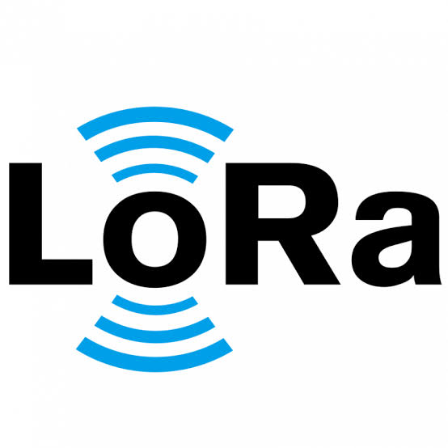</img></td>
  <td>JChip - iControl <br> 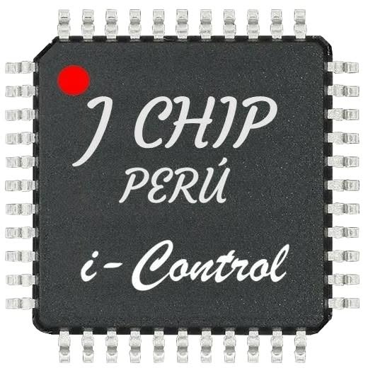</img></td>
  <td>SafeSense <br> 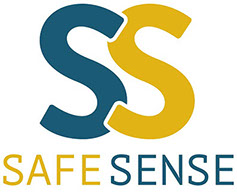</img></td>
  </tr>

<tr>
  <td rowspan="2">Perfil</td>
  <td>Overview</td>
  <td>IceTrack es una plataforma de monitoreo y gestión orientada a equipos de refrigeración. Integra información obtenida mediante sensores IoT para supervisar el funcionamiento de los equipos y facilitar su mantenimiento, conectando las necesidades de los negocios con el trabajo de técnicos especializados.</td>
  <td>Loratech es una empresa peruana especializada en soluciones IoT. Entre sus aplicaciones ofrece sistemas para el monitoreo de cámaras de frío mediante sensores y redes administrables en la nube, permitiendo supervisar variables ambientales y el funcionamiento de componentes como el compresor.</td>
  <td>JChip ofrece soluciones de telemetría e IoT mediante herramientas orientadas al monitoreo remoto y centralización de información obtenida de dispositivos y sensores.</td>
  <td>SafeSense es una solución peruana de SIMS Technology orientada al monitoreo IoT de temperatura y cadena de frío. Integra sensores, una plataforma web y una aplicación móvil para supervisar condiciones térmicas y generar alertas.</td>
</tr>

<tr>
  <td>Ventaja competitiva ¿Qué valor ofrece a los clientes?</td>
  <td>Busca integrar en una misma plataforma el monitoreo de equipos de refrigeración, alertas automáticas, análisis del consumo energético, historial técnico y gestión de mantenimientos, proporcionando herramientas tanto a los negocios como a los técnicos responsables de los equipos.</td>
  <td>Combina monitoreo ambiental con información sobre el funcionamiento del equipo. Puede supervisar temperatura, humedad, apertura de puertas, consumo energético y ciclos de trabajo del compresor, permitiendo detectar patrones anómalos y apoyar el mantenimiento predictivo.</td>
  <td>Permite utilizar tecnologías IoT y telemetría para obtener información de equipos de manera remota, reduciendo la dependencia de inspecciones exclusivamente presenciales.</td>
  <td>Ofrece una solución IoT con hardware y software integrados, monitoreo continuo, alertas configurables, historial y reportes, además de soporte local en diferentes ciudades del Perú.</td>
</tr>

<tr>
  <td rowspan="2">Perfil de Marketing</td>
  <td>Mercado Objetivo</td> <td>Inicialmente, heladerías medianas ubicadas en Lima que dependen de equipos de refrigeración para conservar sus productos. También se dirige a técnicos y empresas dedicadas al mantenimiento y reparación de equipos de refrigeración.</td>
  <td>Empresas peruanas que requieren soluciones IoT para monitorear procesos y activos. Su oferta para cámaras de frío puede ser utilizada por organizaciones que necesitan conservar productos bajo condiciones controladas.</td>
  <td>Empresas que requieren soluciones de telemetría, automatización y monitoreo remoto mediante tecnologías IoT.</td>
  <td>Principalmente empresas de agroindustria, laboratorios, almacenamiento y logística que necesitan monitorear temperatura y mantener trazabilidad de sus procesos de cadena de frío.</td>
</tr>

<tr> 
  <td>Estrategias de Marketing</td>
  <td>Marketing digital dirigido inicialmente a heladerías y empresas de mantenimiento de Lima, demostraciones de la plataforma, presencia en redes sociales y alianzas con técnicos y proveedores de equipos de refrigeración.</td>
  <td>Marketing B2B mediante presencia digital y oferta de soluciones IoT personalizadas para diferentes sectores empresariales, destacando aplicaciones específicas como cámaras de frío e Industria 4.0.</td>
  <td>Promoción de soluciones tecnológicas y servicios de telemetría orientados principalmente al mercado empresarial.</td>
  <td>Marketing B2B mediante demostraciones empresariales, casos de uso por industria, presencia digital y contacto directo con empresas interesadas en implementar monitoreo IoT.</td>
</tr>

<tr>
  <td rowspan="3">Perfil de Producto</td>
  <td>Productos & Servicios</td>
  <td>Monitoreo en tiempo real de equipos de refrigeración, sensores IoT, alertas automáticas, historial técnico, gestión y programación de mantenimientos, informes de rendimiento, análisis de consumo energético y administración de usuarios, equipos y ubicaciones.</td>
  <td>Monitoreo IoT de cámaras de frío, temperatura, humedad, apertura de puertas, consumo energético y ciclos de funcionamiento del compresor. Incluye alertas y funcionalidades orientadas al mantenimiento predictivo.</td>
  <td>Soluciones de telemetría e IoT para recopilar, transmitir y visualizar información proveniente de equipos y sensores.</td>
  <td>Sensores IoT de temperatura, monitoreo en tiempo real, dashboard web, aplicación móvil, alertas automáticas, historial de mediciones y reportes exportables.</td>
</tr>

<tr>
  <td>Precios & Costos</td>
  <td>Modelo de precios aún por definir. Se contempla un esquema que considere el uso de la plataforma y los dispositivos IoT necesarios para conectar y monitorear los equipos.</td>
  <td>Los precios de implementación y operación no se encuentran publicados de manera abierta y dependen de la solución IoT requerida por cada empresa.</td>
  <td>Los precios no se encuentran disponibles públicamente y requieren cotización según las necesidades del proyecto.</td>
  <td>Cuenta con un modelo de hardware más suscripción. Publica un precio referencial de S/ 200 + IGV por sensor y S/ 20 mensuales por sensor para el acceso a la plataforma.</td>
</tr>

<tr> 
  <td>Canales de distribución (Web y/o Móvil)</td>
  <td>Plataforma web y aplicación móvil.</td>
  <td>Soluciones IoT administrables mediante plataformas en la nube.</td>
  <td>Plataformas y soluciones digitales de monitoreo y telemetría.</td>
  <td>Dashboard web y aplicación móvil para monitoreo y recepción de alertas.</td>
</tr>

<tr>
  <td rowspan="4">Análisis SWOT</td>
  <td>Fortalezas</td>
  <td>Integra monitoreo IoT con funcionalidades orientadas específicamente a la gestión del mantenimiento. Considera tanto las necesidades de las heladerías como las de técnicos y empresas de mantenimiento.</td>
  <td>Experiencia en soluciones IoT en Perú, monitoreo de múltiples variables, uso de tecnología LoRaWAN y capacidad para analizar el consumo energético y los ciclos del compresor para mantenimiento predictivo.</td>
  <td>Experiencia en soluciones de telemetría y monitoreo remoto aplicables a diferentes contextos empresariales.</td>
  <td>Solución desarrollada en Perú con sensores IoT, monitoreo en tiempo real, alertas, plataforma web, aplicación móvil, reportes y un modelo de precios públicamente disponible.</td>
</tr>

<tr> 
  <td>Debilidades</td>
  <td>Al ser una nueva solución, inicialmente carece de posicionamiento, cartera de clientes y datos históricos suficientes para validar el impacto de sus funcionalidades. Además, requiere la instalación e integración de sensores IoT en los equipos.</td>
  <td>Su propuesta abarca numerosos sectores y aplicaciones IoT, por lo que no está enfocada exclusivamente en las necesidades operativas y de gestión de las heladerías ni en la administración integral del trabajo de técnicos de refrigeración.</td>
  <td>La información pública disponible sobre funcionalidades específicas, precios y aplicaciones especializadas para refrigeración comercial es limitada.</td>
  <td>Su enfoque actual está principalmente orientado al monitoreo de temperatura y trazabilidad en agroindustria, laboratorios y logística, y no a la gestión integral del mantenimiento de equipos de refrigeración comercial.</td>
</tr>

<tr> 
  <td>Oportunidades</td>
  <td>Especialización inicial en heladerías de Lima, incorporación progresiva de nuevas funciones de mantenimiento predictivo y posibilidad de expansión posterior hacia restaurantes, minimarkets, supermercados y otros negocios dependientes de refrigeración.</td>
  <td>Expansión de soluciones IoT hacia más negocios que dependen de refrigeración comercial y crecimiento de aplicaciones de mantenimiento predictivo y eficiencia energética.</td>
  <td>Crecimiento de la adopción de tecnologías IoT y telemetría en empresas que buscan digitalizar el monitoreo de sus equipos y procesos.</td>
  <td>Expansión de su solución hacia nuevos sectores comerciales que requieren control térmico, así como incorporación de nuevos tipos de sensores y funcionalidades analíticas.</td>
</tr>

<tr> 
  <td>Amenazas</td> 
  <td>Ingreso o expansión de proveedores IoT ya establecidos hacia el segmento de refrigeración comercial, reducción de precios de soluciones competidoras y resistencia de pequeñas y medianas empresas a invertir inicialmente en sensores y suscripciones.</td>
  <td>Aparición de proveedores IoT de menor costo y soluciones especializadas que ofrezcan funcionalidades similares específicamente para determinados nichos de mercado.</td>
  <td>Competencia creciente de proveedores nacionales e internacionales de plataformas IoT y telemetría con soluciones especializadas.</td>
  <td>Competencia de plataformas IoT con sensores de menor costo o con funcionalidades adicionales de mantenimiento predictivo y gestión técnica.</td> 
</tr> 
</table>

### 2.1.2. Estrategias y tácticas frente a competidores

Con el fin de posicionar a IceTrack en el mercado de monitoreo y gestión de equipos de refrigeración comercial, se plantean estrategias orientadas a diferenciar la propuesta frente a las soluciones IoT existentes, considerando inicialmente las necesidades de las heladerías y empresas encargados del mantenimiento de sus equipos.

1. **Estrategias de Diferenciación:**

#### Solución integral para equipos de refrigeración comercial <br>
La plataforma permitirá supervisar variables como temperatura, consumo energético y tiempo de funcionamiento, generar alertas ante anomalías y centralizar la información de los equipos. A diferencia de soluciones enfocadas principalmente en el monitoreo de variables mediante sensores.

####  Historial técnico centralizado por equipo <br>
Cada equipo de refrigeración contará con un historial que reúna sus mediciones, incidencias y mantenimientos realizados. Esto permitirá que los técnicos dispongan de información previa antes de realizar una intervención y que los responsables de las heladerías puedan consultar el comportamiento y mantenimiento de sus equipos a lo largo del tiempo.

#### Integración entre negocios y técnicos de mantenimiento <br>
La información generada por los sensores podrá ser utilizada no solo para supervisar los equipos, sino también para facilitar el diagnóstico, planificación y seguimiento de las actividades de mantenimiento.

#### Interfaz intuitiva y multiplataforma <br>
La disponibilidad mediante interfaces web y móvil permitirá que administradores y técnicos accedan a la información tanto desde el establecimiento como durante sus actividades en campo.

2. **Tácticas de Marketing:**

#### Marketing digital dirigido a heladerías <br>
Durante la etapa inicial, las campañas digitales estarán orientadas principalmente a heladerías medianas de Lima. La comunicación se enfocará en problemas concretos del negocio, como la pérdida de productos por fallas de refrigeración, la detección tardía de variaciones de temperatura y los costos asociados al consumo energético y mantenimiento correctivo.

#### Demostraciones y pruebas piloto <br>
Se buscará implementar pruebas piloto con heladerías seleccionadas para demostrar el funcionamiento de los sensores y de la plataforma en condiciones reales. Estas experiencias permitirán obtener retroalimentación de los usuarios, validar las funcionalidades propuestas y generar casos de uso que posteriormente puedan emplearse para promocionar IceTrack.

3. **Estrategias de Precios:**

#### Prueba inicial de la solución: <br>
Se podrá ofrecer un periodo de implementación piloto que permita al negocio conocer el funcionamiento de IceTrack y evaluar los beneficios del monitoreo antes de contratar el servicio de manera permanente.

#### Transparencia en los costos <br>
La propuesta comercial buscará presentar de manera clara los costos correspondientes al hardware IoT, instalación y uso de la plataforma, facilitando que los clientes puedan evaluar la inversión requerida y compararla con los posibles costos derivados de fallas, pérdidas de productos y mantenimientos correctivos.

4. **Expansión y Adaptabilidad:**

#### Colaboraciones con proveedores locales <br>
Se buscarán acuerdos con técnicos especializados, empresas de mantenimiento, distribuidores de equipos y proveedores de soluciones de refrigeración. Estas alianzas permitirán desarrollar una red local que facilite la instalación de sensores, soporte técnico y atención de los equipos conectados a IceTrack.

#### Enfoque inicial en Lima y expansión progresiva <br>
IceTrack concentrará inicialmente sus esfuerzos en heladerías ubicadas en Lima, permitiendo validar la propuesta en un segmento y territorio específicos. Una vez comprobado el funcionamiento del modelo, se podrá evaluar su expansión hacia otras ciudades del Perú que dependan de equipos de refrigeración comercial.

## 2.2. Entrevistas

### 2.2.1. Diseño de entrevistas

Las entrevistas tienen como finalidad conocer cómo se realiza actualmente el monitoreo y mantenimiento de los equipos de refrigeración, identificar los principales problemas que enfrentan los usuarios y evaluar el interés en una solución digital que facilite la supervisión, prevención de fallas y gestión del mantenimiento.

Los resultados obtenidos permitirán validar las hipótesis planteadas y orientar el diseño de las funcionalidades de IceTrack de acuerdo con las necesidades reales de sus potenciales usuarios.

**Preguntas para el Segmento Objetivo 1 - Heladerías con equipos de refrigeración:**

1. ¿Qué tipos de equipos de refrigeración utilizan actualmente? Por ejemplo, congeladoras, vitrinas refrigeradas o cámaras de frío.

2. Aproximadamente, ¿cuántos equipos de refrigeración tienen en funcionamiento por local?

3. ¿Cómo supervisan actualmente que los equipos estén funcionando correctamente y mantengan la temperatura adecuada?

4. ¿Alguna vez han tenido una falla en un equipo de refrigeración que haya ocasionado pérdida de helados, insumos u otros productos? ¿Qué ocurrió y qué impacto tuvo para el negocio?

5. Cuando un equipo presenta una falla, ¿cómo se enteran normalmente y cuánto tiempo suele pasar hasta que un técnico pueda revisarlo?

6. ¿Cómo llevan actualmente el registro de los mantenimientos, reparaciones o fallas anteriores de cada equipo?

7. ¿Supervisan actualmente el consumo eléctrico de sus equipos de refrigeración? ¿Han identificado alguna vez un aumento de consumo relacionado con un equipo funcionando de manera ineficiente?

8. ¿Qué herramientas o métodos utilizan actualmente para supervisar sus equipos de refrigeración? ¿Cómo ha sido su experiencia con ellos?

9. ¿Qué dificultades, si las hay, encuentra para detectar a tiempo las anomalías en sus equipos de refrigeración? ¿Cómo suele actuar cuando identifica una?

10. ¿Qué información consulta actualmente sobre sus equipos de refrigeración y para qué la utiliza? ¿Hay algún dato que necesite y que actualmente no tenga disponible?

11. ¿Qué aspectos considera al evaluar cambios o nuevas herramientas para la supervisión y el mantenimiento de sus equipos de refrigeración? ¿Qué factores influyen en su decisión de adoptarlas o no?

12. ¿Qué criterios tendría en cuenta para decidir si vale la pena invertir en una herramienta de monitoreo de equipos de refrigeración? ¿Qué beneficios esperaría obtener y qué aspectos podrían desanimarlo a contratarla?

---

**Preguntas para el Segmento Objetivo 2 - Técnicos y empresas de mantenimiento de refrigeración:**

1. ¿Qué tipos de equipos de refrigeración atiende con mayor frecuencia?

2. ¿Trabaja actualmente con heladerías? En caso afirmativo, ¿qué problemas encuentra con mayor frecuencia en sus equipos?

3. ¿Cómo recibe y organiza actualmente las solicitudes de mantenimiento de sus clientes?

4. ¿Cómo programa los mantenimientos preventivos y las visitas técnicas?

5. ¿Lleva un historial de las reparaciones y mantenimientos realizados a cada equipo? ¿Cómo registra actualmente esta información?

6. ¿Cuáles son las principales dificultades que enfrenta al diagnosticar una falla en un equipo de refrigeración?

7. ¿Utiliza actualmente alguna aplicación, software o herramienta digital para gestionar clientes, equipos, mantenimientos o reportes? En caso afirmativo, ¿cuál y qué limitaciones encuentra?

8. ¿Cómo identifica actualmente las posibles anomalías en los equipos de sus clientes y qué dificultades encuentra para anticiparse a las fallas?

9. ¿Qué información debería contener el historial técnico de un equipo para que sea realmente útil durante un diagnóstico o mantenimiento?

10. ¿Cómo documenta actualmente los trabajos de mantenimiento que realiza y de qué manera comunica los resultados a sus clientes?

11. ¿Cómo organiza actualmente la información de los equipos y mantenimientos de sus diferentes clientes? ¿Qué dificultades encuentra al gestionar esta información?

12. ¿Qué herramientas utiliza actualmente para gestionar sus actividades de mantenimiento y qué necesidades o dificultades siguen sin resolverse con ellas?

### 2.2.2. Registro de entrevistas

## Segmento objetivo #1: Heladerías con equipos de refrigeración

#### Entrevistas:

- **Nombres y apellidos:** Sonia De la Torre
- **Edad:** 59
- **Distrito:** Lima


- **Inicio:** 00:00 min
- **Duración:** 06:03 min
- **URL:** [`https://upcedupe-my.sharepoint.com/:v:/g/personal/u20241a352_upc_edu_pe/IQDtPmZWk-kPSL7Hk4eeGOo3AVHl5d9OkXV4RKNw_Aqf10U?e=aDtP0g&nav=eyJyZWZlcnJhbEluZm8iOnsicmVmZXJyYWxBcHAiOiJTdHJlYW1XZWJBcHAiLCJyZWZlcnJhbFZpZXciOiJTaGFyZURpYWxvZy1MaW5rIiwicmVmZXJyYWxBcHBQbGF0Zm9ybSI6IldlYiIsInJlZmVycmFsTW9kZSI6InZpZXcifSwicGxheWJhY2tPcHRpb25zIjp7fX0%3D`](https://upcedupe-my.sharepoint.com/:v:/g/personal/u20241a352_upc_edu_pe/IQDtPmZWk-kPSL7Hk4eeGOo3AVHl5d9OkXV4RKNw_Aqf10U?e=aDtP0g&nav=eyJyZWZlcnJhbEluZm8iOnsicmVmZXJyYWxBcHAiOiJTdHJlYW1XZWJBcHAiLCJyZWZlcnJhbFZpZXciOiJTaGFyZURpYWxvZy1MaW5rIiwicmVmZXJyYWxBcHBQbGF0Zm9ybSI6IldlYiIsInJlZmVycmFsTW9kZSI6InZpZXcifSwicGxheWJhY2tPcHRpb25zIjp7fX0%3D)

- **Resumen:** La entrevistada es propietaria de una heladería ubicada en Lima, donde utiliza congeladoras para conservar los diferentes sabores y presentaciones de helados que ofrece a sus clientes. Durante la entrevista comentó que ha tenido inconvenientes con sus equipos de refrigeración, llegando a perder parte de sus productos cuando se presentaron fallas inesperadas. Actualmente, revisa manualmente la temperatura de las congeladoras y coordina mantenimientos cada cierto tiempo para prevenir problemas. Sin embargo, considera que este proceso podría mejorar mediante el uso de tecnología. La entrevistada mostró interés en recibir notificaciones automáticas cuando un equipo presente alguna anomalía, así como disponer de un registro de los mantenimientos y reparaciones realizadas. También señaló que estaría dispuesta a pagar por IceTrack si la aplicación le ayuda a detectar problemas con anticipación, proteger sus productos y disminuir las pérdidas ocasionadas por fallas en las congeladoras.

---

#### Entrevista 2:

- **Nombres y apellidos:** Diego Avalos
- **Edad:** 21
- **Distrito:** Callao


- **Inicio:** 06:04 min
- **Duración:** 08:26 min
- **URL:** [`https://upcedupe-my.sharepoint.com/:v:/g/personal/u20241a352_upc_edu_pe/IQDtPmZWk-kPSL7Hk4eeGOo3AVHl5d9OkXV4RKNw_Aqf10U?e=qe5Asn&nav=eyJyZWZlcnJhbEluZm8iOnsicmVmZXJyYWxBcHAiOiJTdHJlYW1XZWJBcHAiLCJyZWZlcnJhbFZpZXciOiJTaGFyZURpYWxvZy1MaW5rIiwicmVmZXJyYWxBcHBQbGF0Zm9ybSI6IldlYiIsInJlZmVycmFsTW9kZSI6InZpZXcifSwicGxheWJhY2tPcHRpb25zIjp7InN0YXJ0VGltZUluU2Vjb25kcyI6MzY0LjM4fX0%3D`](https://upcedupe-my.sharepoint.com/:v:/g/personal/u20241a352_upc_edu_pe/IQDtPmZWk-kPSL7Hk4eeGOo3AVHl5d9OkXV4RKNw_Aqf10U?e=qe5Asn&nav=eyJyZWZlcnJhbEluZm8iOnsicmVmZXJyYWxBcHAiOiJTdHJlYW1XZWJBcHAiLCJyZWZlcnJhbFZpZXciOiJTaGFyZURpYWxvZy1MaW5rIiwicmVmZXJyYWxBcHBQbGF0Zm9ybSI6IldlYiIsInJlZmVycmFsTW9kZSI6InZpZXcifSwicGxheWJhY2tPcHRpb25zIjp7InN0YXJ0VGltZUluU2Vjb25kcyI6MzY0LjM4fX0%3D)

- **Resumen:** El entrevistado llego a perder parte de sus productos cuando se presentaron fallas inesperadas. Actualmente, revisa manualmente la temperatura de las congeladoras y coordina mantenimientos cada cierto tiempo para prevenir problemas. Sin embargo, considera que este proceso podría mejorar mediante el uso de tecnología. El entrevistado mostró interés en recibir notificaciones automáticas cuando un equipo presente alguna anomalía, así como disponer de un registro de los mantenimientos y reparaciones realizadas. También señaló que estaría dispuesta a pagar por IceTrack independientemente del tipo de membresía si la aplicación le ayuda a detectar problemas con anticipación, proteger sus productos y disminuir las pérdidas ocasionadas por fallas en las congeladoras.


---

#### Entrevista 3:

- **Nombre:** Gabrielle Coronel
- **Edad:** 22 años
- **Distrito:** San Isidro


- **Inicio:** 14:31 min
- **Duración:** 07:09 min
- **URL:** [`https://upcedupe-my.sharepoint.com/:v:/g/personal/u20241a352_upc_edu_pe/IQDtPmZWk-kPSL7Hk4eeGOo3AVHl5d9OkXV4RKNw_Aqf10U?e=A3pSiG&nav=eyJyZWZlcnJhbEluZm8iOnsicmVmZXJyYWxBcHAiOiJTdHJlYW1XZWJBcHAiLCJyZWZlcnJhbFZpZXciOiJTaGFyZURpYWxvZy1MaW5rIiwicmVmZXJyYWxBcHBQbGF0Zm9ybSI6IldlYiIsInJlZmVycmFsTW9kZSI6InZpZXcifSwicGxheWJhY2tPcHRpb25zIjp7InN0YXJ0VGltZUluU2Vjb25kcyI6ODcxLjAyfX0%3D`](https://upcedupe-my.sharepoint.com/:v:/g/personal/u20241a352_upc_edu_pe/IQDtPmZWk-kPSL7Hk4eeGOo3AVHl5d9OkXV4RKNw_Aqf10U?e=A3pSiG&nav=eyJyZWZlcnJhbEluZm8iOnsicmVmZXJyYWxBcHAiOiJTdHJlYW1XZWJBcHAiLCJyZWZlcnJhbFZpZXciOiJTaGFyZURpYWxvZy1MaW5rIiwicmVmZXJyYWxBcHBQbGF0Zm9ybSI6IldlYiIsInJlZmVycmFsTW9kZSI6InZpZXcifSwicGxheWJhY2tPcHRpb25zIjp7InN0YXJ0VGltZUluU2Vjb25kcyI6ODcxLjAyfX0%3D)

- **Resumen:** La entrevistada mencionó que anteriormente ha sufrido pérdidas debido a problemas en la cadena de frío, situación que afectó parte de los helados almacenados. Para prevenir estos inconvenientes, realiza revisiones semanales y programa el mantenimiento de sus equipos mensualmente; sin embargo, ella considera que el riesgo de pérdida aún sigue vigente por fallos inesperados. Además, ya utiliza algunas herramientas digitales para controlar la temperatura. La entrevistada considera muy útil recibir alertas automáticas, principalmente cuando se detecte alguna anomalía. Indicó que preferiría acceder a esta información desde una computadora o tablet y que estaría dispuesto a pagar por IceTrack, de preferencia mediante un pago único, siempre que la aplicación contribuya a disminuir las pérdidas de su heladería. Sin embargo, dejaría de utilizarla si presenta fallas frecuentes, un soporte técnico deficiente o costos que no se justifiquen.

---

## Segmento Objetivo 2 - Técnicos y empresas de mantenimiento de refrigeración:

**Entrevista 1:**

- **Nombres y apellidos:** Pablo Ramos
- **Edad:** 22
- **Distrito:** Los Olivos


- **Inicio:** 21:41 min
- **Duración:** 10:40 min
- **Url:** [`https://upcedupe-my.sharepoint.com/:v:/g/personal/u20241a352_upc_edu_pe/IQDtPmZWk-kPSL7Hk4eeGOo3AVHl5d9OkXV4RKNw_Aqf10U?e=5g3ck8&nav=eyJyZWZlcnJhbEluZm8iOnsicmVmZXJyYWxBcHAiOiJTdHJlYW1XZWJBcHAiLCJyZWZlcnJhbFZpZXciOiJTaGFyZURpYWxvZy1MaW5rIiwicmVmZXJyYWxBcHBQbGF0Zm9ybSI6IldlYiIsInJlZmVycmFsTW9kZSI6InZpZXcifSwicGxheWJhY2tPcHRpb25zIjp7InN0YXJ0VGltZUluU2Vjb25kcyI6MTMwMS42Mn19`](https://upcedupe-my.sharepoint.com/:v:/g/personal/u20241a352_upc_edu_pe/IQDtPmZWk-kPSL7Hk4eeGOo3AVHl5d9OkXV4RKNw_Aqf10U?e=5g3ck8&nav=eyJyZWZlcnJhbEluZm8iOnsicmVmZXJyYWxBcHAiOiJTdHJlYW1XZWJBcHAiLCJyZWZlcnJhbFZpZXciOiJTaGFyZURpYWxvZy1MaW5rIiwicmVmZXJyYWxBcHBQbGF0Zm9ybSI6IldlYiIsInJlZmVycmFsTW9kZSI6InZpZXcifSwicGxheWJhY2tPcHRpb25zIjp7InN0YXJ0VGltZUluU2Vjb25kcyI6MTMwMS42Mn19)

- **Resumen:** El entrevistado comenta una de las principales dificultades que identifica es la organización de los mantenimientos, debido a que algunos clientes olvidan realizar revisiones periódicas de sus congeladoras y equipos de refrigeración, lo que puede ocasionar fallas más graves con el tiempo. Asimismo, señaló que no disponer de un historial técnico organizado dificulta conocer rápidamente los problemas y reparaciones anteriores de cada equipo. El entrevistado considera útil contar con una plataforma centralizada que almacene esta información, permita generar reportes de manera automática y envíe alertas sobre mantenimientos o posibles fallas. Desde su perspectiva, una herramienta como IceTrack podría ayudarlo a organizar mejor sus visitas, reducir el tiempo dedicado a tareas administrativas y mantener una comunicación más eficiente con las heladerías que atiende.

---

**Entrevista 2:**

- **Nombres y apellidos:** Alessandro Castillo
- **Edad:** 22
- **Distrito:** Jesus Maria


- **Inicio:** 32:40 min
- **Duración:** 08:35 min
- **Url:** [`https://upcedupe-my.sharepoint.com/:v:/g/personal/u20241a352_upc_edu_pe/IQDtPmZWk-kPSL7Hk4eeGOo3AVHl5d9OkXV4RKNw_Aqf10U?e=rxoLfr&nav=eyJyZWZlcnJhbEluZm8iOnsicmVmZXJyYWxBcHAiOiJTdHJlYW1XZWJBcHAiLCJyZWZlcnJhbFZpZXciOiJTaGFyZURpYWxvZy1MaW5rIiwicmVmZXJyYWxBcHBQbGF0Zm9ybSI6IldlYiIsInJlZmVycmFsTW9kZSI6InZpZXcifSwicGxheWJhY2tPcHRpb25zIjp7InN0YXJ0VGltZUluU2Vjb25kcyI6MTk0Mi4zMn19`](https://upcedupe-my.sharepoint.com/:v:/g/personal/u20241a352_upc_edu_pe/IQDtPmZWk-kPSL7Hk4eeGOo3AVHl5d9OkXV4RKNw_Aqf10U?e=rxoLfr&nav=eyJyZWZlcnJhbEluZm8iOnsicmVmZXJyYWxBcHAiOiJTdHJlYW1XZWJBcHAiLCJyZWZlcnJhbFZpZXciOiJTaGFyZURpYWxvZy1MaW5rIiwicmVmZXJyYWxBcHBQbGF0Zm9ybSI6IldlYiIsInJlZmVycmFsTW9kZSI6InZpZXcifSwicGxheWJhY2tPcHRpb25zIjp7InN0YXJ0VGltZUluU2Vjb25kcyI6MTk0Mi4zMn19)

- **Resumen:** El entrevistado se encuentran la organización de los reportes de mantenimiento mediante Excel y la coordinación de las rutas y visitas que deben realizar los técnicos. Actualmente, gran parte de estas actividades se gestionan de forma manual y con apoyo de aplicaciones móviles, lo que puede dificultar el seguimiento de la información. Durante la entrevista señaló que una plataforma como IceTrack podría facilitar la organización de los servicios al reunir en un mismo lugar los datos de las congeladoras y otros equipos atendidos. También considera importante que los técnicos puedan registrar directamente desde el lugar de atención los trabajos realizados, reduciendo errores y agilizando la actualización de la información. Asimismo, destacó la utilidad de recibir alertas automáticas para anticipar mantenimientos y responder con mayor rapidez ante posibles inconvenientes. Para el entrevistado, implementar una herramienta de este tipo permitiría organizar mejor las operaciones y mejorar la calidad del servicio brindado a las heladerías.

#### Entrevista 3:

- **Nombre:** Gabriel Mimbela
- **Edad:** 24
- **Distrito:** Los Olivos

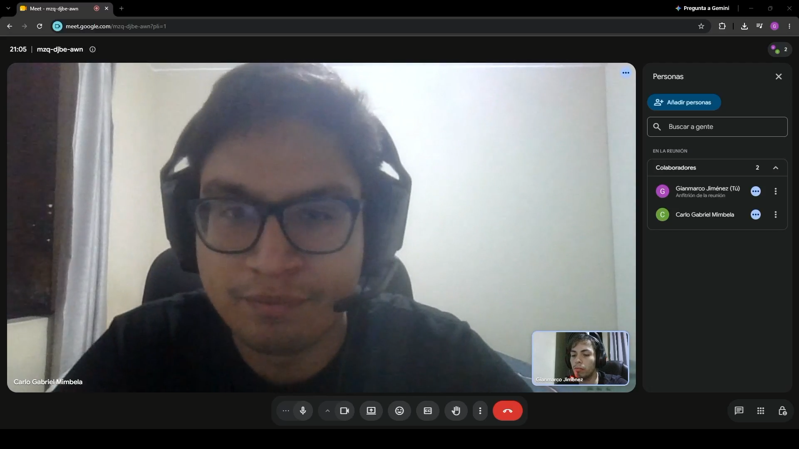

- **Inicio:** 32:40 min
- **Duración:** 07:25 min
- **Url:** [`https://upcedupe-my.sharepoint.com/:v:/g/personal/u20241a352_upc_edu_pe/IQDtPmZWk-kPSL7Hk4eeGOo3AVHl5d9OkXV4RKNw_Aqf10U?e=WiACqp&nav=eyJyZWZlcnJhbEluZm8iOnsicmVmZXJyYWxBcHAiOiJTdHJlYW1XZWJBcHAiLCJyZWZlcnJhbFZpZXciOiJTaGFyZURpYWxvZy1MaW5rIiwicmVmZXJyYWxBcHBQbGF0Zm9ybSI6IldlYiIsInJlZmVycmFsTW9kZSI6InZpZXcifSwicGxheWJhY2tPcHRpb25zIjp7InN0YXJ0VGltZUluU2Vjb25kcyI6MjQ3NS43M319`](https://upcedupe-my.sharepoint.com/:v:/g/personal/u20241a352_upc_edu_pe/IQDtPmZWk-kPSL7Hk4eeGOo3AVHl5d9OkXV4RKNw_Aqf10U?e=WiACqp&nav=eyJyZWZlcnJhbEluZm8iOnsicmVmZXJyYWxBcHAiOiJTdHJlYW1XZWJBcHAiLCJyZWZlcnJhbFZpZXciOiJTaGFyZURpYWxvZy1MaW5rIiwicmVmZXJyYWxBcHBQbGF0Zm9ybSI6IldlYiIsInJlZmVycmFsTW9kZSI6InZpZXcifSwicGxheWJhY2tPcHRpb25zIjp7InN0YXJ0VGltZUluU2Vjb25kcyI6MjQ3NS43M319)

- **Resumen:** El entrevistado comentó que trabajar con información distribuida en diferentes medios suele generar desorden y tareas repetitivas, especialmente cuando existen cambios de horario, no dispone de información previa sobre una congeladora o debe organizar manualmente las rutas de atención. El entrevistado considera que una aplicación móvil sencilla y disponible en español facilitaría considerablemente su trabajo. Entre las funciones que considera más importantes se encuentran consultar los equipos de cada heladería, recibir alertas ante posibles fallas, tomar fotografías durante las visitas, registrar los trabajos realizados y generar reportes técnicos automáticamente. Asimismo, mencionó que anteriormente dejó de utilizar una plataforma debido a que era complicada, estaba disponible en otro idioma y tenía un costo elevado. Por ello, considera importante que IceTrack sea una solución práctica, accesible y fácil de utilizar durante sus servicios técnicos.

### 2.2.3. Análisis de entrevistas

## Segmento objetivo #1: Heladerías con equipos de refrigeración

**Análisis:** Las entrevistas realizadas muestran que uno de los principales problemas de las heladerías es la dependencia de sus equipos de refrigeración para conservar adecuadamente sus productos. Una falla inesperada puede ocasionar pérdidas de mercadería y generar gastos adicionales por reparaciones. Actualmente, los entrevistados realizan revisiones periódicas de sus congeladoras y coordinan mantenimientos preventivos; sin embargo, gran parte de este control continúa realizándose de manera manual, lo que dificulta detectar problemas con anticipación.

De manera general, los entrevistados mostraron interés en contar con alertas automáticas que les permitan conocer rápidamente cualquier anomalía en sus equipos sin necesidad de supervisarlos constantemente. Asimismo, consideran importante disponer de un historial técnico por equipo y reportes de los mantenimientos realizados, ya que esto facilitaría el seguimiento de las fallas y reparaciones anteriores. También existe disposición a pagar por una solución como IceTrack siempre que contribuya a reducir las pérdidas económicas y sea confiable y sencilla de utilizar. Por ello, para este segmento, las funcionalidades más relevantes serían el monitoreo del estado de los equipos, las alertas automáticas, el historial de mantenimiento y la generación de reportes.

En las entrevistas hemos podido identificar lo siguiente:

## Uso de herramientas digitales
Dos de las tres heladerías utilizan herramientas digitales para supervisar sus equipos, mientras que una no lo hace. Esto evidencia una oportunidad para ofrecer una solución que facilite el monitoreo de la refrigeración.
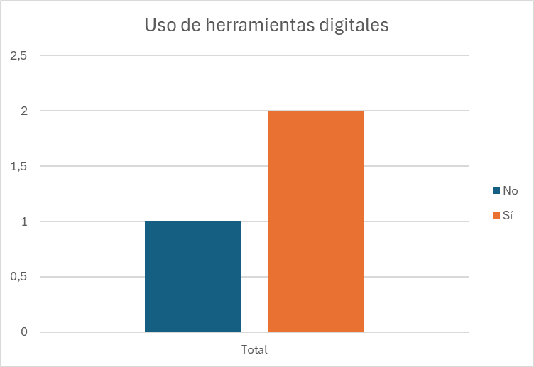

## Pérdidas por fallas de refrigeración
Las tres heladerías entrevistadas reportaron pérdidas de productos ocasionadas por fallas en sus equipos de refrigeración. Este resultado resalta la importancia de implementar mecanismos preventivos que permitan detectar anomalías oportunamente.
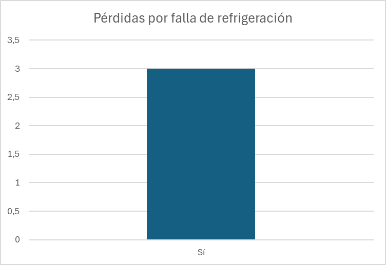

## Necesidad de alertas automáticas
Las tres heladerías manifestaron la necesidad de recibir alertas automáticas ante posibles anomalías en sus equipos. Esto respalda la incorporación de notificaciones en IceTrack para facilitar la detección temprana de problemas y reducir el riesgo de pérdidas.
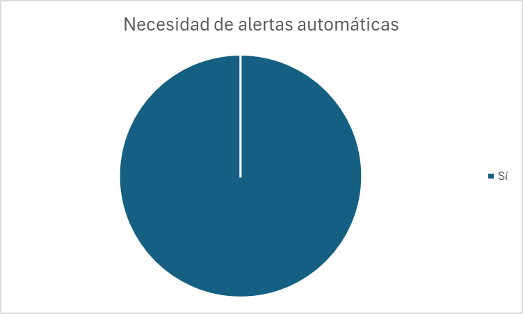


## Segmento Objetivo 2 - Técnicos y empresas de mantenimiento de refrigeración:

**Análisis:** En este segmento se identificó que las principales dificultades están relacionadas con la organización y gestión de los servicios técnicos. Los entrevistados utilizan herramientas como WhatsApp, llamadas, Excel, calendarios digitales, fotografías y anotaciones manuales para coordinar visitas y registrar los trabajos realizados. Al encontrarse la información distribuida en diferentes medios, pueden generarse problemas como pérdida de información, dificultad para consultar intervenciones anteriores, cambios de horarios y mayor tiempo destinado a la elaboración de reportes.

Los entrevistados consideran favorable contar con una plataforma centralizada que permita consultar el historial de cada equipo, organizar las visitas técnicas y registrar directamente en campo las actividades realizadas. También valoran la posibilidad de adjuntar fotografías, recibir alertas sobre posibles fallas y generar reportes técnicos automáticamente. Además, la facilidad de uso aparece como un factor importante para la adopción de la solución, especialmente para los técnicos que necesitan acceder rápidamente a la información mientras realizan una atención. En conjunto, las entrevistas muestran que IceTrack podría contribuir a reducir tareas manuales, mejorar la planificación de los servicios y facilitar la comunicación entre los técnicos y las heladerías atendidas.

A continuación se mostrará de manera gráfica la información obtenida:

## Ejecución de tareas administrativas de manera manual

Los resultados muestran que los tres talleres realizan tareas administrativas manualmente, lo que evidencia una oportunidad para automatizar el registro de información y agilizar la gestión de sus actividades.

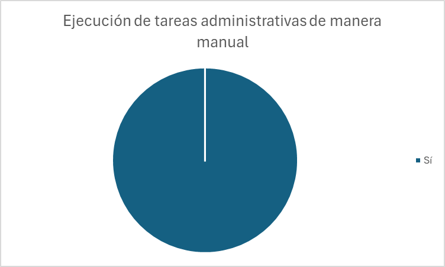

## Información técnica dispersa o desorganizada
Los tres talleres reportan dificultades relacionadas con la dispersión o desorganización de la información técnica. Esto resalta la necesidad de centralizar los registros para facilitar su consulta y seguimiento.
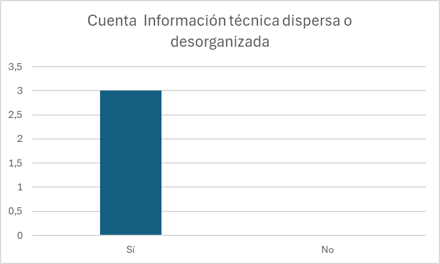

## Dificultades para organizar mantenimientos y visitas
Dos de los tres talleres presentan dificultades para organizar los mantenimientos y las visitas técnicas, mientras que uno no reporta este problema. Estos resultados sugieren que IceTrack podría contribuir a mejorar la planificación y coordinación de los servicios.
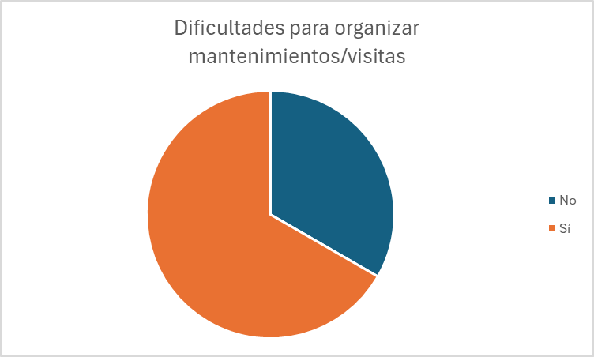


## 2.3. Needfinding

### 2.3.1. User Personas

Este apartado expone los arquetipos de User Persona, elaborados a partir del análisis de las entrevistas realizadas a nuestros segmentos objetivo. Estas representaciones sintetizan de manera estratégica los objetivos, destrezas, motivaciones y principales puntos de dolor de los usuarios, integrando sus necesidades reales con las tendencias del sector para detectar oportunidades de mercado y construir una solución a su medida.

**Segmento Objetivo 1: Heladerias con equipos de refrigeración**

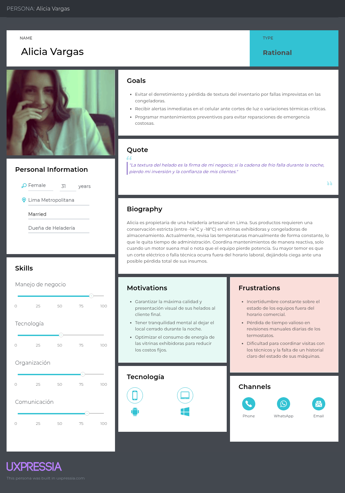

<br>

**Segmento Objetivo 2: Técnicos y empresas de mantenimiento**


### 2.3.2. User Task Matrix

En esta sección se presenta el User Task Matrix, realizado en base a los User Persona que representan a los dos segmentos clave identificados:

Segmento 1: Heladerías con equipos de refrigeración (representado por Alicia Vargas).

Segmento 2: Técnicos y empresas de mantenimiento (representado por Luis Paredes).

Las tareas se determinaron mediante el análisis cualitativo de las entrevistas, valorando luego su periodicidad e impacto crítico para cada perfil.

<table>
  <tr>
    <th rowspan="2">Tarea / Task</th>
    <th colspan="2">Alicia Vargas</th>
    <th colspan="2">Luis Paredes</th>
  </tr>
  <tr>
    <th>Frecuencia</th>
    <th>Importancia</th>
    <th>Frecuencia</th>
    <th>Importancia</th>
  </tr>
  <tr>
    <td>Verificar temperatura de vitrinas y congeladoras</td>
    <td>Alta</td>
    <td>Alta</td>
    <td>Alta</td>
    <td>Alta</td>
  </tr>
  <tr>
    <td>Registrar consumo energético</td>
    <td>Media</td>
    <td>Media</td>
    <td>Alta</td>
    <td>Media</td>
  </tr>
  <tr>
    <td>Coordinar servicios de mantenimiento</td>
    <td>Media</td>
    <td>Alta</td>
    <td>Alta</td>
    <td>Alta</td>
  </tr>
  <tr>
    <td>Contactar técnicos o proveedores</td>
    <td>Media</td>
    <td>Media</td>
    <td>Alta</td>
    <td>Alta</td>
  </tr>
  <tr>
    <td>Realizar o solicitar mantenimiento preventivo</td>
    <td>Media</td>
    <td>Alta</td>
    <td>Alta</td>
    <td>Alta</td>
  </tr>
  <tr>
    <td>Revisar estado físico y estético de los equipos</td>
    <td>Alta</td>
    <td>Alta</td>
    <td>Alta</td>
    <td>Alta</td>
  </tr>
  <tr>
    <td>Generar reportes técnicos</td>
    <td>Baja</td>
    <td>Baja</td>
    <td>Media</td>
    <td>Alta</td>
  </tr>
  <tr>
    <td>Organizar agenda de mantenimientos</td>
    <td>Baja</td>
    <td>Media</td>
    <td>Alta</td>
    <td>Alta</td>
  </tr>
  <tr>
    <td>Supervisar cumplimiento de normas sanitarias</td>
    <td>Media</td>
    <td>Alta</td>
    <td>Baja</td>
    <td>Media</td>
  </tr>
  <tr>
    <td>Controlar calidad y textura del inventario de helados</td>
    <td>Alta</td>
    <td>Alta</td>
    <td>-</td>
    <td>-</td>
  </tr>
  <tr>
    <td>Comunicar incidencias a clientes o equipo</td>
    <td>-</td>
    <td>-</td>
    <td>Alta</td>
    <td>Alta</td>
  </tr>
</table>

<br>

**Análisis:**

El User Task Matrix permite contrastar la frecuencia y relevancia de las actividades en cada segmento analizado para orientar las decisiones de diseño. Las tareas prioritarias y recurrentes para ambos perfiles son el control térmico, la gestión del mantenimiento, la inspección física de las unidades y la solicitud de revisiones preventivas, lo que confirma un interés mutuo en la prevención operativa. No obstante, las prioridades difieren según el rol: Alicia Vargas se enfoca críticamente en la conservación de la textura y calidad de sus helados, requiriendo un control estricto de las vitrinas exhibidoras y congeladoras para evitar mermas totales, especialmente por cortes de energía fuera del horario comercial. Por su parte, Luis Paredes atiende los diagnósticos técnicos, los informes de servicio y el reporte de averías. A pesar de estas diferencias, ambos perfiles demandan una herramienta que facilite la supervisión de los activos a distancia, anticipe fallos y optimice sus procesos diarios.

### 2.3.3. User Journey Mapping

En esta sección se presentan los User Journey Maps de los dos segmentos objetivo: Alicia Vargas, propietaria de una heladería con equipos de refrigeración y Luis Paredes, técnico especializado en refrigeración. Cada mapa refleja el recorrido actual que estos usuarios realizan para cumplir sus objetivos sin contar aún con una solución tecnológica integrada, mostrando los puntos críticos, emociones, tareas clave y oportunidades de mejora. Estos recorridos nos permiten entender los desafíos que enfrentan los usuarios día a día.

<br>

**Segmento Objetivo 1: Heladerías con equipos de refrigeración**

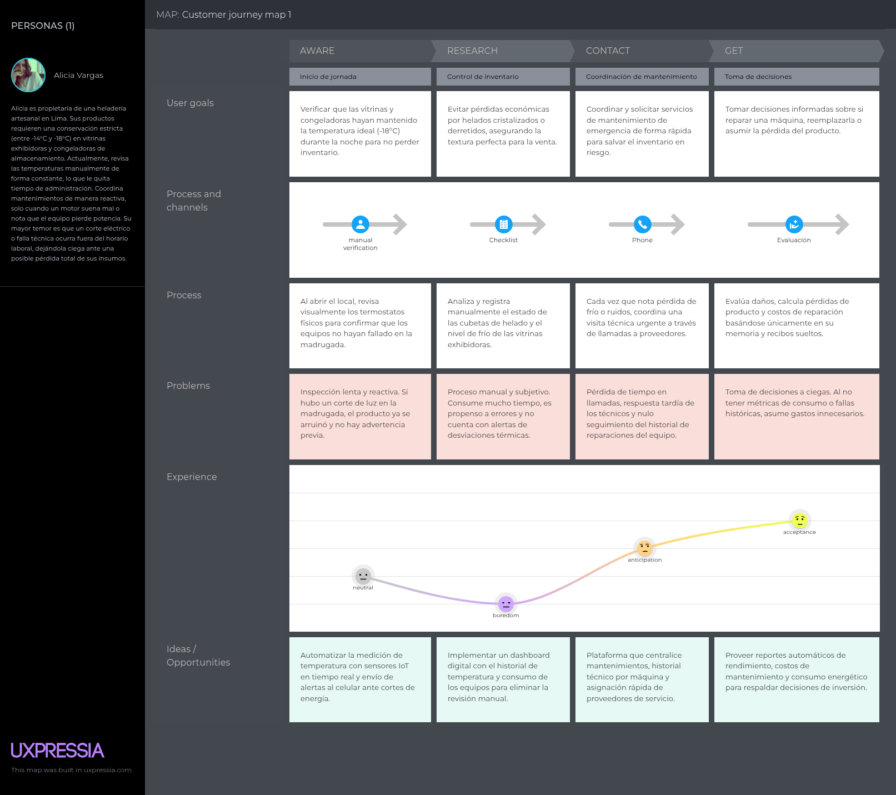

<br>

**Segmento Objetivo 2: Técnicos y empresas de mantenimiento**


### 2.3.4. Empathy Mapping

En esta sección se presentan los Empathy Maps. Estos nos ayudarán a comprender las experiencias, emociones y pensamientos que expresan los usuarios de cada segmento objetivo.

<br>

**Segmento Objetivo 1: Heladerías con equipos de refrigeración**

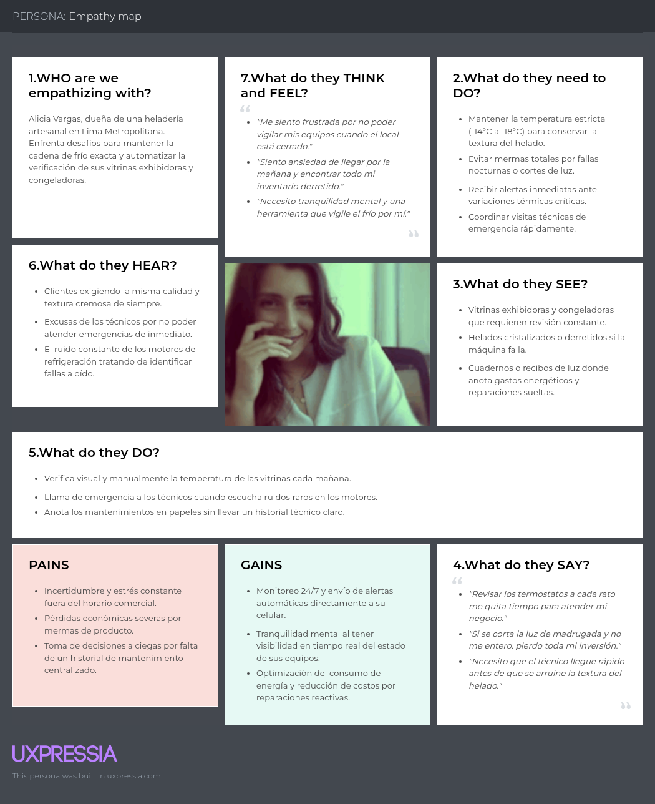

<br>

**Segmento Objetivo 2: Técnicos y empresas de mantenimiento**


## 2.4. Big Picture Event Storming

En esta sección se presenta el Big Picture Event Storming de IceTrack IoT. El análisis permitió identificar y delimitar los bounded contexts que componen la plataforma, así como los actores, comandos, eventos de negocio y políticas que intervienen en cada uno de ellos.

Los diagramas representan los principales cambios de estado del sistema: la gestión de usuarios, sitios y equipos; la atención de solicitudes de servicio; la administración de técnicos; las notificaciones de mantenimiento; la evaluación del servicio y la personalización del dashboard. Esta representación facilita la comprensión del dominio, la definición de responsabilidades y la identificación de dependencias entre los procesos del negocio.

La siguiente leyenda se aplica a todos los diagramas: los bloques verdes representan bounded contexts, los celestes representan comandos, los naranjas representan eventos de dominio, los morados representan políticas o reglas de negocio y los amarillos identifican a los actores responsables de cada acción.

## 1. IAM

El bounded context de Identity and Access Management gestiona el acceso de los usuarios a la plataforma. Incluye el registro de nuevas cuentas, la validación del nombre de usuario y la contraseña, así como el inicio de sesión.

El proceso puede finalizar con una autenticación exitosa o fallida.

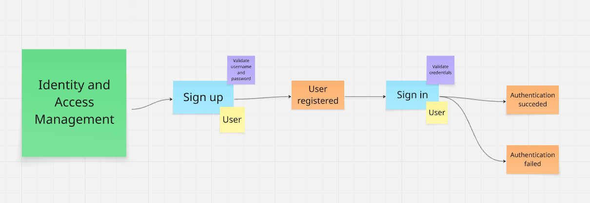

## 2. Profiles and Preferences

Este bounded context administra la información de perfil y las preferencias de los usuarios. Permite crear perfiles para Owners y Technicians, actualizar la información personal y consultar el dashboard actual.

También permite añadir y eliminar tarjetas de información del dashboard según las preferencias del usuario.

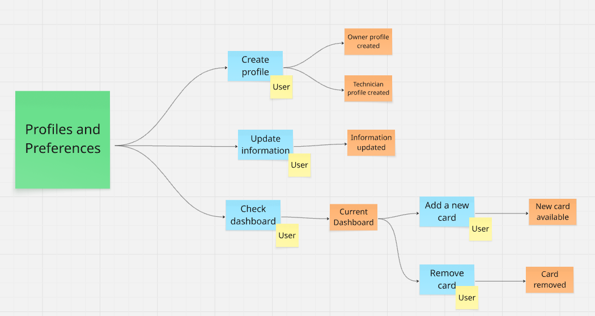

## 3. Assets Management

El bounded context de Assets Management gestiona los sitios pertenecientes a un Owner. Incluye el registro, edición y eliminación de sitios.

Antes de registrar un sitio, el sistema valida la información proporcionada, como el nombre, la dirección, el responsable y el número telefónico. Si la información no es válida, el registro puede fallar.

Además, desde este contexto se inicia el proceso de incorporación de equipos a un sitio, generando los eventos correspondientes al registro y actualización de la información del equipo.

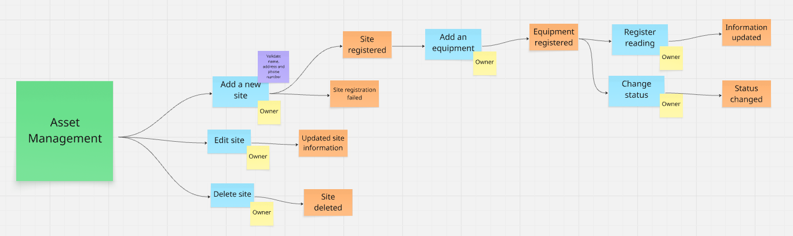

## 4. Device Management

Device Management controla la relación entre los dispositivos y el sistema. Sus operaciones principales son consultar la información de un dispositivo, asociarlo y desvincularlo.

El Owner puede emparejar un dispositivo con la plataforma o retirarlo cuando ya no debe formar parte del sistema.

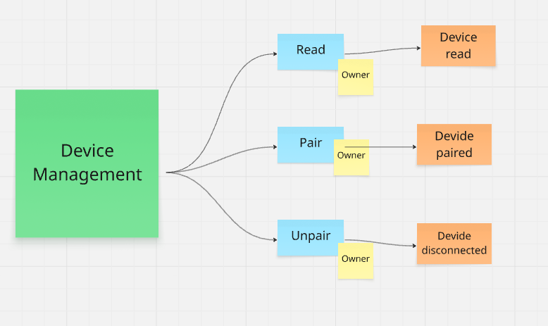

## 5. Service Request and Feedback Management

Este bounded context representa el flujo principal de atención de servicios técnicos.

El Owner inicia una solicitud cuando necesita asistencia para un equipo. Posteriormente, el Provider revisa la solicitud y puede aceptarla o rechazarla. Si la solicitud es aceptada, el Provider asigna un técnico, quien registra la intervención realizada.

Finalmente, el Owner puede calificar el servicio recibido. Por ello, este contexto integra tanto la gestión de solicitudes como la evaluación del servicio técnico.

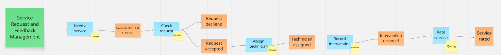

## 6. Notifications Management

El bounded context de Notifications Management gestiona las notificaciones generadas por el sistema.

Cuando ocurre un evento relevante, como la contratación o creación de un servicio, el sistema puede generar una notificación para el Owner. Posteriormente, el usuario puede descartar o eliminar la notificación.

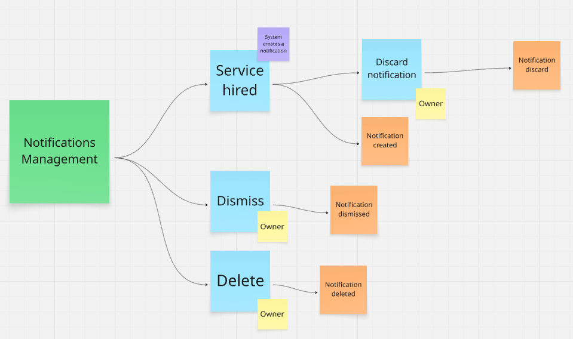

## 7. Reporting and Analysis Management

Reporting and Analysis Management permite al usuario generar reportes y consultar indicadores relevantes de la plataforma.

El usuario puede crear un reporte, aplicar filtros sobre la información disponible y consultar los principales KPIs del sistema. Este contexto facilita el análisis del estado de los sitios, dispositivos y servicios registrados.

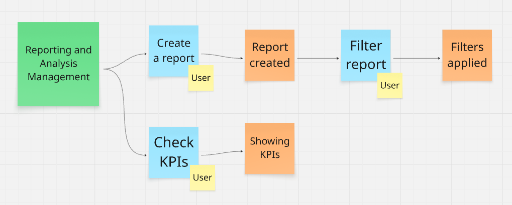

## 8. Monitoring and Alerting Management

Este bounded context administra el monitoreo de los equipos y la gestión de alertas.

Permite registrar, editar y eliminar equipos, además de gestionar las alertas asociadas a su funcionamiento. El Owner puede descartar una alerta cuando deja de ser relevante o resolverla cuando la situación reportada ha sido atendida.

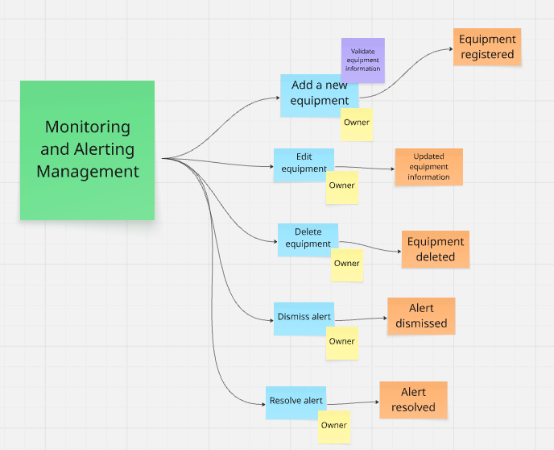


## 2.5. Ubiquitous Language

1. **User Profile (Perfil de Usuario):** Información asociada a un usuario de la plataforma, incluyendo su identidad, rol y datos personales.

2. **Owner (Propietario):** Usuario responsable de administrar sitios, equipos, solicitudes de servicio y preferencias de la plataforma.

3. **Provider (Proveedor):** Usuario encargado de gestionar solicitudes de servicio y asignar técnicos para su atención.

4. **Technician (Técnico):** Persona encargada de ejecutar y registrar las intervenciones técnicas solicitadas por un Provider.

5. **Smart Dashboard (Panel Inteligente):** Interfaz central donde el usuario consulta indicadores, reportes, alertas y tarjetas configurables.

6. **Dashboard Card (Tarjeta del Panel):** Elemento configurable del dashboard que presenta información resumida, como equipos monitoreados, alertas o reportes.

7. **Report (Reporte):** Representación organizada de información operativa para analizar el estado de los equipos, servicios y actividades registradas.

8. **KPI (Indicador Clave de Rendimiento):** Métrica utilizada para resumir y analizar información relevante del sistema.

9. **Site (Sitio):** Establecimiento o ubicación física donde se encuentran instalados los equipos administrados por un Owner.

10. **Asset (Activo):** Recurso físico registrado en la plataforma, principalmente sitios y equipos asociados.

11. **Equipment (Equipo):** Unidad de refrigeración registrada en un sitio, con información como nombre, modelo, tipo, serie, estado y conectividad.

12. **Equipment Status (Estado del Equipo):** Condición operativa actual de un equipo, por ejemplo encendido, apagado, disponible o fuera de línea.

13. **Device Pairing (Asociación de Dispositivo):** Proceso mediante el cual un dispositivo se vincula con la plataforma o con un equipo registrado.

14. **Device Unpairing (Desvinculación de Dispositivo):** Proceso mediante el cual se elimina la asociación entre un dispositivo y la plataforma.

15. **Service Request (Solicitud de Servicio):** Petición creada por un Owner para solicitar atención técnica sobre un equipo.

16. **Service Request Status (Estado de la Solicitud):** Situación actual de una solicitud, como pendiente, aceptada, rechazada, en progreso, completada o cancelada.

17. **Service Request Type (Tipo de Solicitud):** Clasificación de la atención solicitada, por ejemplo mantenimiento preventivo o correctivo.

18. **Intervention (Intervención):** Trabajo técnico realizado sobre un equipo dentro del contexto de una solicitud de servicio.

19. **Maintenance History (Historial de Mantenimiento):** Registro de solicitudes e intervenciones asociadas a un equipo.

20. **Service Feedback (Evaluación del Servicio):** Valoración realizada por el Owner sobre la atención recibida, considerando comunicación, eficiencia y profesionalidad.

21. **Maintenance Reminder Interval (Intervalo de Recordatorio de Mantenimiento):** Número de días configurado para determinar cuándo debe generarse un recordatorio de mantenimiento.

22. **Equipment Alert (Alerta del Equipo):** Aviso relacionado con una situación que requiere revisión o atención sobre un equipo.

23. **Alert Resolution (Resolución de Alerta):** Acción mediante la cual el Owner indica que una alerta fue atendida o dejó de ser relevante.

24. **Notification (Notificación):** Mensaje generado por el sistema para informar sobre eventos relevantes, como recordatorios de mantenimiento.

25. **Report Filter (Filtro de Reporte):** Criterio utilizado para limitar o seleccionar la información mostrada en un reporte.

26. **Authentication (Autenticación):** Proceso mediante el cual el sistema valida las credenciales de un usuario.

27. **Access Token (Token de Acceso):** Credencial generada después de una autenticación exitosa para permitir el acceso a las funcionalidades autorizadas.


# Capítulo III: Requirements Specification

## 3.1. User Stories.

Las historias de usuario para este proyecto se crearon enfocándose en las necesidades de los tres actores del modelo C4: **Visitante**, **Propietario del Negocio** (Business Owner) y **Técnico** (Technician). Se eliminan los roles "empresario", "operador" y "administrador", que no corresponden a ningún actor del modelo. Las capacidades que antes tenía el "empresario" (asignar técnicos, seguir solicitudes) pasan al Propietario.

Criterios aplicados en esta revisión:

1. **Roles consolidados.** Solo existen los tres actores del C4. Las capacidades del antiguo "empresario" pasan al Propietario.
2. **Canal por rol.** El **Propietario opera desde la aplicación web** (Angular) y el **Técnico desde la aplicación móvil** (Flutter). Cuando una historia aplica a ambos canales se indica explícitamente.
3. **Tres niveles de cómputo.** Se separan las historias del **dispositivo embebido** (ESP32), del **borde** (Edge API en Flask) y de la **nube** (Spring Boot), tal como los modela el System Landscape.
4. **Un bounded context, al menos una historia.** Se agregan historias para ciclo de vida de alertas, dispositivo sin reportar, configuración de umbrales, emparejamiento y credenciales, centro de notificaciones y configuración del dashboard.
5. **Trazabilidad conservada.** Los IDs existentes se mantienen.

Para mantener la organización, las historias se agruparon en épicas según sus funcionalidades y su correspondencia con el C4. Los criterios de aceptación de cada historia se definieron utilizando la sintaxis Gherkin, asegurando que el equipo comprendiera el problema desde la perspectiva del usuario final.

### Épicas

| Epic ID | Título de la Épica | Descripción | Corresponde en el C4 a |
| --- | --- | --- | --- |
| EP-01 | Gestión de Cuentas y Perfiles de Usuario | Registro, autenticación federada, gestión del perfil profesional y preferencias de interfaz de cada usuario. | IAM BC, Profiles and Preferences BC |
| EP-02 | Gestión de Activos y Dispositivos IoT | Registro de sitios y equipos de refrigeración, configuración de sus umbrales de temperatura, y emparejamiento y credenciales de los dispositivos físicos de monitoreo. | Asset Management BC, Device Management BC |
| EP-03 | Proceso de Solicitudes de Servicio | Ciclo completo de la orden de trabajo: creación, aceptación, asignación de técnico, intervención en campo y cierre. | Service Request BC |
| EP-04 | Análisis e Informes de Datos y Telemetría | Generación asíncrona de reportes analíticos y cálculo de los indicadores cuantitativos de cadena de frío. | Reporting and Analytics BC |
| EP-05 | Mecanismo de Evaluación del Servicio | Calificación del servicio recibido dentro del plazo permitido. | Agregado Review (Service Request BC) |
| EP-06 | Página de Aterrizaje y Experiencia Inicial | Sitio estático con la propuesta de valor por segmento y los call-to-action hacia la plataforma. | IceTrack Landing Page |
| EP-07 | Aplicación Móvil de Campo e Integración con API | Aplicación multiplataforma para el técnico en campo, integrada con la API RESTful y operativa con conectividad intermitente. | Contenedor Mobile Application |
| EP-08 | Procesamiento en el Borde (Edge Computing) | Gateway en el local del cliente: ingesta de lecturas por red local, evaluación autónoma de umbrales, agregación y sincronización confiable con la nube. | IceTrack Edge System, IceTrack Monitoring Device |
| EP-09 | Monitoreo y Alertas Térmicas | Ingesta de telemetría agregada, historial de lecturas, ciclo de vida completo de las alertas térmicas y de conectividad, y transmisión en vivo al dashboard. | Monitoring and Alerting BC |
| EP-10 | Notificaciones | Resolución de destinatarios, entrega por canal y centro de notificaciones de la plataforma. | Notification BC |

Además, para facilitar la planificación, el seguimiento y la priorización de las tareas, el equipo utilizó la plataforma Trello.

### User Stories

| Epic / Story ID | Título | Descripción | Criterios de Aceptación | Relacionado con (Epic ID) |
| --- | --- | --- | --- | --- |
| US-01 | Registro de usuario | Como nuevo usuario, quiero registrarme indicando si soy propietario de negocio o técnico, para acceder a la plataforma con las capacidades que corresponden a mi rol. | **Escenario 1: Creación exitosa de la cuenta**<br>Dado que el nuevo usuario accede al formulario de registro,<br>Cuando ingresa un nombre de usuario único de 4 a 30 caracteres (letras, dígitos, . o _), una contraseña de 8 a 64 caracteres con al menos una mayúscula, una minúscula y un dígito, y selecciona el rol OWNER_ROLE o TECHNICIAN_ROLE,<br>Entonces la API responde 201, el sistema crea la cuenta, genera el perfil correspondiente a ese rol y redirige al usuario a la plataforma.<br><br>**Escenario 2: Nombre de usuario ya registrado**<br>Dado que el usuario envía el formulario con un nombre de usuario existente,<br>Cuando el sistema procesa la solicitud,<br>Entonces la API responde 409 CONFLICT, el formulario muestra que el nombre de usuario no está disponible y no se crea la cuenta.<br><br>**Escenario 3: Contraseña que no cumple la política**<br>Dado que el usuario ingresa una contraseña con menos de 8 caracteres o sin alguna mayúscula, minúscula o dígito,<br>Cuando intenta registrarse,<br>Entonces la API responde 400 VALIDATION_ERROR, el formulario lista cada requisito incumplido y no se crea la cuenta. | EP-01 |
| US-02 | Inicio de sesión | Como usuario, quiero iniciar sesión con mi cuenta para acceder a la plataforma. | **Escenario 1: Inicio de sesión exitoso**<br>Dado que el usuario tiene una cuenta activa,<br>Cuando envía su nombre de usuario y su contraseña registrados,<br>Entonces la API responde 200 con un JWT de 60 minutos de vigencia y el usuario es dirigido a su panel según su rol (Owner o Technician).<br><br>**Escenario 2: Credenciales incorrectas**<br>Dado que el usuario envía un nombre de usuario inexistente o una contraseña que no coincide,<br>Cuando intenta iniciar sesión,<br>Entonces la API responde 401 UNAUTHORIZED con el mismo mensaje en ambos casos (sin revelar cuál campo falló), no emite JWT y el intento queda registrado.<br><br>**Escenario 3: Campos vacíos**<br>Dado que el usuario deja vacío el nombre de usuario o la contraseña,<br>Cuando intenta iniciar sesión,<br>Entonces la API responde 400 VALIDATION_ERROR indicando el campo faltante. | EP-01 |
| US-03 | Registrar y actualizar equipos de refrigeración | Como propietario del negocio, quiero registrar mis equipos de refrigeración asociándolos a un sitio, para mantener un inventario detallado de cada activo. | **Escenario 1: Registro de un equipo**<br>Dado que el propietario tiene los datos de un equipo nuevo,<br>Cuando ingresa nombre, tipo (FREEZER, COLD_ROOM o REFRIGERATOR), código de equipo y sitio de operación,<br>Entonces el sistema registra el equipo con estado ACTIVE y lo asocia al sitio indicado.<br><br>**Escenario 2: Actualización de un equipo**<br>Dado que el propietario desea modificar los datos de un equipo registrado,<br>Cuando realiza los cambios y confirma,<br>Entonces la información se actualiza y el historial de telemetría previo del equipo se conserva. | EP-02 |
| US-04 | Solicitar un servicio de mantenimiento o reparación | Como propietario del negocio, quiero solicitar servicios preventivos y correctivos para mis equipos, para asegurar su funcionamiento y recibir confirmación de mi solicitud. | **Escenario 1: Solicitud registrada**<br>Dado que el propietario requiere un servicio para uno de sus equipos,<br>Cuando selecciona el equipo, el tipo (PREVENTIVE_MAINTENANCE o REPAIR), la prioridad y describe el problema,<br>Entonces la solicitud se registra en estado PENDING con su fecha de creación y se notifica al propietario.<br><br>**Escenario 2: Confirmación con resumen**<br>Dado que la solicitud fue enviada,<br>Cuando el sistema la procesa,<br>Entonces el propietario recibe una confirmación con el número de orden, el equipo, el sitio y el tipo de servicio solicitado. | EP-03 |
| US-05 | Dar seguimiento al progreso de un servicio | Como propietario del negocio, quiero seguir el avance de una solicitud con su historial de estados, para saber en qué etapa se encuentra y cuándo estará completada. | **Escenario 1: Estado actual e historial**<br>Dado que el propietario tiene una solicitud activa,<br>Cuando accede a su detalle,<br>Entonces visualiza el estado actual y la secuencia de transiciones previas con sus fechas y responsables.<br><br>**Escenario 2: Reflejo de un cambio de estado**<br>Dado que una solicitud está en curso,<br>Cuando el técnico actualiza su estado desde la aplicación móvil,<br>Entonces el nuevo estado queda visible para el propietario en la aplicación web. | EP-03 |
| US-06 | Cancelar o rechazar una solicitud de servicio | Como propietario del negocio o técnico, quiero cancelar o rechazar una solicitud indicando el motivo, para cerrar correctamente las órdenes que no procederán. | **Escenario 1: Cancelación por el propietario**<br>Dado que una solicitud se encuentra en estado PENDING o ACCEPTED,<br>Cuando el propietario la cancela indicando el motivo,<br>Entonces la solicitud pasa a CANCELED, el motivo queda registrado y, si había un técnico asignado, este es notificado.<br><br>**Escenario 2: Cancelación no permitida**<br>Dado que una solicitud ya se encuentra en estado COMPLETED,<br>Cuando se intenta cancelarla,<br>Entonces el sistema rechaza la operación e indica que una orden completada no puede cancelarse. | EP-03 |
| US-07 | Completar el perfil profesional del técnico | Como técnico, quiero completar mi perfil profesional con mi especialidad y número de certificación, para que los propietarios puedan asignarme servicios acordes a mi competencia. | **Escenario 1: Perfil completado**<br>Dado que el técnico accede a su perfil,<br>Cuando registra su nombre completo, teléfono, especialidad (REFRIGERATION, ELECTRICAL o GENERAL) y número de certificación,<br>Entonces el sistema guarda el perfil y el técnico queda disponible para asignación.<br><br>**Escenario 2: Campos obligatorios incompletos**<br>Dado que el técnico omite la especialidad o el número de certificación,<br>Cuando intenta guardar,<br>Entonces el sistema rechaza la operación, señala los campos faltantes y el técnico no queda disponible para asignación. | EP-01 |
| US-08 | Consultar el perfil de un técnico | Como propietario del negocio, quiero consultar el perfil de un técnico con su especialidad y calificación promedio, para decidir a quién asignar una solicitud de servicio. | **Escenario 1: Perfil con evaluaciones**<br>Dado que el propietario selecciona un técnico desde la aplicación web,<br>Cuando accede a su perfil,<br>Entonces visualiza su nombre, especialidad, certificación, historial de servicios atendidos y calificación promedio.<br><br>**Escenario 2: Perfil sin evaluaciones**<br>Dado que el técnico aún no ha recibido evaluaciones,<br>Cuando se consulta su perfil,<br>Entonces el sistema muestra los datos profesionales e indica que todavía no hay calificaciones disponibles, sin mostrar un promedio en cero. | EP-01 |
| US-09 | Asignar un técnico a una solicitud de servicio | Como propietario del negocio, quiero asignar un técnico a una solicitud considerando su especialidad, para asegurar que el trabajo lo realice alguien competente. | **Escenario 1: Asignación del técnico**<br>Dado que el propietario tiene una solicitud en estado PENDING o ACCEPTED,<br>Cuando consulta los técnicos disponibles por especialidad y selecciona uno,<br>Entonces el técnico queda asignado a la solicitud y el sistema registra el momento de la asignación.<br><br>**Escenario 2: Notificación de la asignación**<br>Dado que un técnico fue asignado,<br>Cuando se confirma la asignación,<br>Entonces el técnico recibe una notificación con el equipo, la sede, la prioridad y la fecha de la orden. | EP-03 |
| US-10 | Consultar el historial de intervenciones de un equipo | Como propietario del negocio, quiero consultar todas las intervenciones realizadas sobre un equipo, para evaluar su confiabilidad y decidir sobre su reemplazo. | **Escenario 1: Historial completo**<br>Dado que un equipo tuvo servicios previos,<br>Cuando el propietario accede a su historial técnico,<br>Entonces visualiza cada intervención con su fecha, técnico, tipo de servicio, diagnóstico y duración.<br><br>**Escenario 2: Equipo sin intervenciones**<br>Dado que un equipo nunca ha requerido servicio,<br>Cuando se consulta su historial,<br>Entonces el sistema muestra un estado vacío indicando que no registra intervenciones. | EP-03 |
| US-11 | Filtrar equipos por sitio, tipo y estado | Como propietario del negocio, quiero filtrar el listado de equipos, para localizar rápidamente los que requieren mi atención. | **Escenario 1: Filtrado por estado**<br>Dado que el propietario necesita ver solo los equipos en mantenimiento,<br>Cuando aplica el filtro de estado MAINTENANCE,<br>Entonces el listado se actualiza mostrando únicamente los equipos que coinciden.<br><br>**Escenario 2: Combinación de filtros sin resultados**<br>Dado que el propietario combina filtros de sitio y tipo que ningún equipo satisface,<br>Cuando aplica los filtros,<br>Entonces el sistema muestra un estado vacío explicando que no hay coincidencias y ofrece limpiar los filtros. | EP-02 |
| US-12 | Evaluar un servicio completado | Como propietario del negocio, quiero evaluar un servicio finalizado en varias dimensiones, para dejar retroalimentación útil sobre el trabajo recibido. | **Escenario 1: Envío de la evaluación**<br>Dado que una solicitud se encuentra en estado COMPLETED y aún no fue evaluada,<br>Cuando el propietario califica comunicación, eficacia y desempeño en una escala de 1 a 5 y agrega un comentario,<br>Entonces la evaluación se registra, queda asociada a la solicitud y al técnico, y se fija su plazo de edición.<br><br>**Escenario 2: Modificación dentro del plazo**<br>Dado que el propietario evaluó el servicio hace menos de 48 horas,<br>Cuando actualiza la calificación,<br>Entonces la nueva calificación reemplaza a la anterior; transcurrido el plazo el sistema rechaza la edición e indica que venció. | EP-05 |
| US-13 | Visualizar la propuesta de valor principal | Como visitante, quiero conocer la propuesta de valor de la plataforma para entender si se ajusta a mis necesidades. | **Escenario 1: Propuesta visible al ingresar**<br>Dado que un visitante llega a la página principal,<br>Cuando la página carga,<br>Entonces se le presenta un enunciado que explica con claridad la propuesta de valor.<br><br>**Escenario 2: Contenido orientado a la cadena de frío**<br>Dado que el visitante pertenece al segmento de gestión de equipos,<br>Cuando revisa la propuesta de valor,<br>Entonces encuentra conceptos de monitoreo inteligente y protección del inventario refrigerado. | EP-06 |
| US-14 | Explorar soluciones específicas para mi rubro | Como visitante, quiero conocer las soluciones que ofrece la plataforma para mi tipo de negocio, para saber si se ajusta a mis necesidades. | **Escenario 1: Negocios con equipos de refrigeración**<br>Dado que un visitante explora las soluciones,<br>Cuando revisa el contenido disponible,<br>Entonces encuentra descripciones dirigidas a negocios que dependen de la cadena de frío.<br><br>**Escenario 2: Proveedores de servicio técnico**<br>Dado que un visitante explora las soluciones,<br>Cuando revisa el contenido disponible,<br>Entonces encuentra información dirigida a técnicos y proveedores de mantenimiento. | EP-06 |
| US-15 | Comprender las funcionalidades clave | Como visitante, quiero entender las funcionalidades principales de la plataforma para evaluar si se adaptan a mi operación. | **Escenario 1: Acceso a las funcionalidades**<br>Dado que un visitante consulta las características,<br>Cuando revisa la lista de funcionalidades,<br>Entonces identifica el monitoreo en tiempo real, la automatización de alertas y la gestión de mantenimientos.<br><br>**Escenario 2: Descripciones orientadas al valor**<br>Dado que el visitante lee cada descripción,<br>Cuando las evalúa,<br>Entonces comprende el beneficio concreto que aporta a su operación. | EP-06 |
| US-16 | Conocer la misión y visión | Como visitante, quiero conocer la misión y visión de la empresa para entender su enfoque. | **Escenario 1: Acceso a la misión**<br>Dado que un visitante accede a la información institucional,<br>Cuando revisa el contenido corporativo,<br>Entonces encuentra una descripción clara de la misión.<br><br>**Escenario 2: Acceso a la visión**<br>Dado que un visitante accede a la información institucional,<br>Cuando revisa el contenido estratégico,<br>Entonces encuentra una descripción clara de la visión a futuro. | EP-06 |
| US-17 | Acceder a la plataforma desde el call to action | Como visitante o usuario registrado, quiero acceder a la plataforma desde la página de inicio por el canal que me corresponde, para empezar a operar sin buscar el enlace. | **Escenario 1: Acceso a la aplicación web**<br>Dado que un visitante del segmento propietario busca ingresar,<br>Cuando selecciona el call to action correspondiente,<br>Entonces es dirigido a la pantalla de inicio de sesión de la aplicación web.<br><br>**Escenario 2: Acceso a la aplicación móvil**<br>Dado que un visitante del segmento técnico busca ingresar,<br>Cuando selecciona el call to action correspondiente,<br>Entonces es dirigido al punto de descarga de la aplicación móvil. | EP-06 |
| US-18 | Consultar el listado y detalle de equipos | Como propietario del negocio, quiero visualizar mis equipos registrados con su estado operativo, para conocer la situación general de mis activos. | **Escenario 1: Listado de equipos**<br>Dado que el propietario accede al módulo Equipments,<br>Cuando carga la pantalla,<br>Entonces visualiza nombre, tipo, código, sitio, estado y última temperatura conocida de cada equipo.<br><br>**Escenario 2: Detalle de un equipo**<br>Dado que existe un equipo registrado,<br>Cuando el propietario selecciona "Equipment Detail",<br>Entonces el sistema muestra sus datos, su umbral configurado, el dispositivo emparejado y sus alertas recientes. | EP-02 |
| US-19 | Visualizar el dashboard con telemetría en tiempo real | Como propietario del negocio, quiero visualizar un dashboard con métricas resumidas y la temperatura en vivo de mis equipos, para conocer el estado general de mi operación de un vistazo. | **Escenario 1: Carga del dashboard**<br>Dado que el propietario ingresa al dashboard de la aplicación web,<br>Cuando carga la pantalla,<br>Entonces visualiza la cantidad de equipos monitoreados, la temperatura actual de cada sensor, las alertas abiertas y los reportes recientes.<br><br>**Escenario 2: Actualización en vivo**<br>Dado que el propietario mantiene el dashboard abierto,<br>Cuando la plataforma recibe nueva telemetría del borde,<br>Entonces los indicadores y gráficos se actualizan por el canal de streaming sin recargar la página. | EP-09 |
| US-20 | Registrar y consultar sitios | Como propietario del negocio, quiero registrar los sitios donde opera mi equipamiento, para organizar mis activos por ubicación. | **Escenario 1: Registro de un sitio**<br>Dado que el propietario selecciona "Register New Site" en la aplicación web,<br>Cuando ingresa nombre, dirección, persona de contacto y teléfono,<br>Entonces el sistema registra el sitio y lo asocia al propietario.<br><br>**Escenario 2: Listado de sitios**<br>Dado que existen sitios registrados,<br>Cuando el propietario accede al módulo Sites,<br>Entonces visualiza nombre, dirección, contacto, teléfono y la cantidad de equipos de cada sitio. | EP-02 |
| US-21 | Consultar y filtrar las solicitudes de servicio | Como propietario del negocio, quiero consultar todas mis solicitudes con sus datos y filtrarlas, para organizar la atención de mi operación. | **Escenario 1: Listado de solicitudes**<br>Dado que existen solicitudes registradas,<br>Cuando el propietario accede al módulo Services,<br>Entonces visualiza número de orden, fecha, equipo, sede, técnico asignado, tipo, prioridad y estado.<br><br>**Escenario 2: Filtrado por estado**<br>Dado que el propietario quiere enfocarse en las solicitudes activas,<br>Cuando filtra por estado IN_PROGRESS,<br>Entonces el listado se actualiza mostrando únicamente las solicitudes que coinciden. | EP-03 |
| US-22 | Buscar y filtrar reportes | Como propietario del negocio, quiero buscar reportes por nombre, tipo o estado, para localizar información rápidamente. | **Escenario 1: Búsqueda por nombre**<br>Dado que existen múltiples reportes generados,<br>Cuando el propietario escribe al menos 2 caracteres en el buscador,<br>Entonces el listado muestra los reportes cuyo nombre contiene el texto, sin distinguir mayúsculas ni tildes.<br><br>**Escenario 2: Filtrado por tipo y estado**<br>Dado que el propietario necesita segmentar la información,<br>Cuando aplica un tipo de reporte (cumplimiento de mantenimiento, disponibilidad del equipo, desempeño de técnicos o excursiones de temperatura) y un estado de generación (pendiente, generando, completado o fallido),<br>Entonces el listado muestra solo los reportes que cumplen ambos filtros.<br><br>**Escenario 3: Sin coincidencias**<br>Dado que ningún reporte cumple la búsqueda o los filtros,<br>Cuando el propietario los aplica,<br>Entonces se muestra un estado vacío que indica que no hay coincidencias y ofrece limpiar los filtros. | EP-04 |
| US-23 | Cambiar el idioma de la interfaz | Como usuario, quiero cambiar el idioma de la interfaz entre inglés y español latinoamericano, para usar la plataforma en mi idioma preferido en la web y en el móvil. | **Escenario 1: Cambio a español latinoamericano**<br>Dado que el usuario selecciona es-419 en sus preferencias,<br>Cuando confirma la acción,<br>Entonces la interfaz se muestra en español y la preferencia persiste en su siguiente sesión y en el otro canal.<br><br>**Escenario 2: Cambio a inglés**<br>Dado que el usuario selecciona en-US,<br>Cuando confirma la acción,<br>Entonces la interfaz se muestra en inglés, que es el idioma por defecto del sistema. | EP-01 |
| US-24 | Consultar el reporte de un servicio realizado | Como propietario del negocio, quiero consultar el reporte detallado de un servicio, para saber qué se hizo en mi equipo y conservar la constancia. | **Escenario 1: Generación automática del reporte**<br>Dado que una solicitud de servicio pasa a estado COMPLETED,<br>Cuando el sistema procesa el evento,<br>Entonces genera automáticamente el reporte de servicio con el diagnóstico, las acciones ejecutadas y los tiempos de la intervención.<br><br>**Escenario 2: Descarga del reporte**<br>Dado que el reporte fue generado,<br>Cuando el propietario lo solicita,<br>Entonces el sistema lo entrega en el formato elegido (PDF, EXCEL o CSV). | EP-04 |
| US-25 | Visualizar indicadores del dashboard | Como propietario del negocio, quiero visualizar indicadores resumidos de mi operación, para conocer rápidamente su estado general. | **Escenario 1: Visualización de métricas**<br>Dado que el propietario ingresa al dashboard,<br>Cuando carga la pantalla principal,<br>Entonces en menos de 3 segundos visualiza cuatro indicadores: cantidad de sitios, cantidad de equipos con dispositivo emparejado, cantidad de alertas en estado OPEN y cantidad de solicitudes en estado IN_PROGRESS, calculados solo con los datos de su cuenta.<br><br>**Escenario 2: Actualización manual**<br>Dado que el propietario desea forzar la lectura más reciente,<br>Cuando selecciona "Refresh Dashboard",<br>Entonces el sistema recalcula los cuatro indicadores y muestra la fecha y hora de la última actualización. | EP-09 |
| US-26 | Programar el ESP32 para enviar telemetría al gateway del local | Como desarrollador de hardware, quiero programar el ESP32 con la sonda de temperatura para que envíe lecturas al Edge API por la red local, para alimentar la telemetría sin exponer el microcontrolador a internet. | **Escenario 1: Envío exitoso de una lectura**<br>Dado que el ESP32 está configurado con las credenciales Wi-Fi, la URL del Edge API y su identificador de dispositivo,<br>Cuando la sonda registra una medición y el firmware ejecuta POST a `/edge/api/v1/readings` cada 10 segundos,<br>Entonces el Edge API responde 201 y la lectura queda almacenada localmente.<br><br>**Escenario 2: Pérdida del enlace local**<br>Dado que el ESP32 pierde la conexión con la red Wi-Fi del local,<br>Cuando intenta enviar una lectura,<br>Entonces conserva las lecturas más recientes en memoria, reintenta con espera creciente y las transmite al restablecerse el enlace. | EP-08 |
| US-27 | Visualizar la telemetría histórica y actual de un equipo | Como propietario o técnico, quiero visualizar la evolución de temperatura de un equipo combinando historial y lecturas recientes, para entender su comportamiento y no solo su estado momentáneo. | **Escenario 1: Línea de tiempo continua**<br>Dado que el usuario selecciona un equipo monitoreado,<br>Cuando accede al módulo de gráficos de rendimiento,<br>Entonces el sistema muestra una línea de tiempo que combina los datos históricos con las últimas lecturas recibidas, y marca visualmente los periodos de excursión.<br><br>**Escenario 2: Equipo sin telemetría**<br>Dado que un equipo no tiene dispositivo emparejado o nunca reportó,<br>Cuando se consulta su gráfico,<br>Entonces el sistema muestra un estado vacío explicando que el equipo aún no envía telemetría. | EP-09 |
| US-28 | Generar alertas automáticas por excursión térmica sostenida | Como sistema, quiero abrir una alerta cuando un equipo reporte temperatura fuera de su rango configurado de forma sostenida, para advertir antes de que se comprometa el inventario. | **Escenario 1: Apertura de la alerta**<br>Dado un equipo cuyo umbral máximo configurado es superado durante al menos 2 minutos continuos,<br>Cuando la plataforma procesa el evento recibido del borde,<br>Entonces abre una alerta de severidad CRITICAL, registra la lectura que la disparó y no abre una segunda alerta para el mismo equipo mientras esa siga abierta.<br><br>**Escenario 2: Resolución de la alerta**<br>Dado que existe una alerta abierta por excursión térmica,<br>Cuando la temperatura regresa dentro del rango con el margen de histéresis durante 2 minutos,<br>Entonces la alerta pasa a RESOLVED y se registra su duración total y la temperatura máxima alcanzada. | EP-09 |
| US-29 | Interpretar una alerta y generar la orden correctiva | Como propietario del negocio, quiero interpretar con claridad una alerta y generar desde ella la orden de servicio, para reducir el tiempo entre la detección y la reparación. | **Escenario 1: Resalte visual del estado**<br>Dado que un equipo presenta una alerta activa,<br>Cuando el propietario visualiza el listado o el detalle del equipo,<br>Entonces el sistema resalta el estado con un indicador de severidad y ofrece la acción sugerida de generar una orden de servicio correctivo.<br><br>**Escenario 2: Orden precargada desde la alerta**<br>Dado que el propietario revisa una alerta crítica,<br>Cuando selecciona "Generar Orden de Servicio",<br>Entonces el sistema precarga el equipo, el sitio, el tipo REPAIR y el contexto de la alerta en el formulario de nueva solicitud, dejando la confirmación final al usuario. | EP-09 |
| US-30 | Recibir y aceptar una asignación de servicio en el móvil | Como técnico en campo, quiero recibir y aceptar mis asignaciones desde la aplicación móvil, para organizar mis visitas sin depender de la plataforma web. | **Escenario 1: Recepción de la asignación**<br>Dado que el propietario asignó un servicio al técnico,<br>Cuando el técnico abre la aplicación móvil,<br>Entonces visualiza la nueva orden con sede, equipo, fecha y prioridad.<br><br>**Escenario 2: Aceptación de la orden**<br>Dado que el técnico visualiza una orden pendiente,<br>Cuando pulsa "Aceptar servicio",<br>Entonces la aplicación consume el endpoint de transición, el estado pasa a ACCEPTED y el cambio es visible para el propietario en la aplicación web. | EP-07 |
| US-31 | Registrar intervención sin conexión | Como técnico en campo, quiero registrar la intervención realizada aunque no tenga conectividad, para dejar constancia inmediata del mantenimiento ejecutado. | **Escenario 1: Registro en línea**<br>Dado que el técnico concluyó el servicio y tiene conexión,<br>Cuando completa el diagnóstico y las acciones ejecutadas (obligatorios), opcionalmente los repuestos y la evidencia fotográfica, y pulsa "Finalizar",<br>Entonces la API responde 201 a POST /api/v1/interventions, la intervención queda asociada al equipo y a la orden, y la orden pasa a COMPLETED.<br><br>**Escenario 2: Registro diferido sin conexión**<br>Dado que el técnico no dispone de conexión en la sede,<br>Cuando completa los mismos campos y pulsa "Finalizar",<br>Entonces la aplicación guarda la intervención en una cola local con un identificador único, la marca como "Pendiente de sincronizar" y la orden permanece en IN_PROGRESS hasta la sincronización.<br><br>**Escenario 3: Sincronización al recuperar la red**<br>Dado que existen registros en la cola local,<br>Cuando la aplicación recupera la conexión,<br>Entonces envía cada registro y la API responde 201 si es nuevo o 200 si ya fue recibido (según su identificador único), sin crear duplicados, y la orden pasa a COMPLETED. | EP-07 |
| US-32 | Recibir alertas push de anomalías térmicas en el móvil | Como técnico en campo, quiero recibir notificaciones push de alertas críticas, para acudir oportunamente a los equipos en riesgo. | **Escenario 1: Recepción de la alerta push**<br>Dado que se generó una alerta crítica sobre un equipo con una orden asignada al técnico,<br>Cuando el servicio de notificaciones procesa el evento,<br>Entonces el técnico recibe una notificación push con el equipo, la sede, la temperatura registrada y la severidad.<br><br>**Escenario 2: Navegación contextual**<br>Dado que el técnico recibe la alerta push,<br>Cuando la selecciona,<br>Entonces la aplicación abre el detalle del equipo afectado, muestra su telemetría reciente y ofrece la acción de generar una orden de servicio. | EP-10 |
| US-33 | Actualizar el estado del servicio y consultar telemetría en campo | Como técnico en campo, quiero consultar el detalle del equipo y actualizar el estado de la orden, para mantener la trazabilidad durante el desplazamiento. | **Escenario 1: Consulta del equipo en campo**<br>Dado que el técnico aceptó una orden,<br>Cuando accede al detalle del equipo vinculado,<br>Entonces visualiza el historial técnico, la última telemetría de temperatura y las intervenciones previas.<br><br>**Escenario 2: Actualización del estado**<br>Dado que el técnico llegó al sitio,<br>Cuando cambia el estado de la orden a IN_PROGRESS,<br>Entonces la aplicación sincroniza el cambio con la API y el nuevo estado queda visible para el propietario. | EP-07 |
| US-34 | Iniciar sesión con Google mediante OAuth 2.0 | Como nuevo usuario, quiero iniciar sesión o registrarme con mi cuenta de Google mediante OAuth 2.0 para acceder a la plataforma sin crear una contraseña adicional. | **Escenario 1: Autenticación exitosa**<br>Dado que el usuario selecciona "Continuar con Google" en la aplicación web o móvil,<br>Cuando autoriza a IceTrack en la pantalla de consentimiento y Google devuelve un ID Token con firma verificable, audiencia igual al client ID de IceTrack, fecha de expiración vigente y correo verificado,<br>Entonces el backend responde 200, crea la cuenta o la vincula a una existente con el mismo correo y entrega un JWT propio.<br><br>**Escenario 2: Primer ingreso con Google**<br>Dado que el correo de Google no tiene cuenta en IceTrack,<br>Cuando el backend valida el ID Token,<br>Entonces el usuario debe elegir explícitamente su rol (Owner o Technician) antes de recibir el JWT.<br><br>**Escenario 3: Consentimiento cancelado o token rechazado**<br>Dado que el usuario cancela el consentimiento, o el ID Token tiene firma inválida, audiencia distinta, está vencido o el correo no está verificado,<br>Cuando la plataforma procesa la respuesta de Google,<br>Entonces la API responde 401 UNAUTHORIZED, no se emite JWT, se muestra "No fue posible autenticar con Google" y se mantiene disponible el ingreso con credenciales. | EP-01 |
| US-35 | Configurar las tarjetas del dashboard | Como propietario del negocio, quiero elegir qué tarjetas se muestran en mi dashboard y en qué orden, para priorizar la información que más uso en mi operación. | **Escenario 1: Agregar y ordenar tarjetas**<br>Dado que el propietario accede a la configuración del dashboard,<br>Cuando agrega una tarjeta de tipo MONITORED_EQUIPMENT, OPEN_ALERTS, ACTIVE_ORDERS o EQUIPMENT_STATUS y define su posición,<br>Entonces el dashboard se reordena y la configuración persiste para ese usuario.<br><br>**Escenario 2: Ocultar una tarjeta**<br>Dado que una tarjeta está visible en el dashboard,<br>Cuando el propietario cambia su visibilidad a oculta,<br>Entonces la tarjeta deja de mostrarse sin eliminarse de la configuración y puede reactivarse después. | EP-01 |
| US-36 | Configurar el umbral de temperatura de un equipo | Como propietario del negocio, quiero definir la temperatura mínima y máxima aceptable de cada equipo, para que el sistema sepa cuándo su contenido está en riesgo. | **Escenario 1: Definición del umbral**<br>Dado que el propietario accede al detalle de un equipo,<br>Cuando define una temperatura mínima y una máxima en grados Celsius dentro de −40 °C a 30 °C, con mínima menor que máxima,<br>Entonces la API responde 200, el umbral queda guardado y se aplica a las siguientes lecturas, tanto en el borde como en la nube.<br><br>**Escenario 2: Rango incoherente**<br>Dado que el propietario ingresa una mínima mayor o igual que la máxima,<br>Cuando intenta guardar,<br>Entonces la API responde 400 VALIDATION_ERROR indicando "la mínima debe ser menor que la máxima" y el umbral anterior se conserva.<br><br>**Escenario 3: Valor fuera de los límites**<br>Dado que el propietario ingresa una temperatura menor a −40 °C o mayor a 30 °C,<br>Cuando intenta guardar,<br>Entonces la API responde 400 VALIDATION_ERROR indicando el campo y el rango permitido, y el umbral anterior se conserva. | EP-02 |
| US-37 | Emparejar un dispositivo de monitoreo con un equipo | Como propietario del negocio, quiero enlazar el identificador de un dispositivo físico con un equipo de refrigeración, para que sus lecturas queden atribuidas al activo correcto. | **Escenario 1: Emparejamiento exitoso**<br>Dado que el propietario tiene el identificador de un dispositivo sin emparejar,<br>Cuando lo asocia a un equipo de su propiedad,<br>Entonces la API responde 201, el dispositivo pasa a estado PAIRED, el sistema emite su API key (visible una sola vez) y las lecturas siguientes se atribuyen a ese equipo.<br><br>**Escenario 2: Dispositivo ya emparejado**<br>Dado que el dispositivo ya está enlazado a otro equipo,<br>Cuando se intenta el emparejamiento,<br>Entonces la API responde 409 CONFLICT con el mensaje "El dispositivo ya está emparejado", sin revelar el equipo ni el propietario de ese enlace.<br><br>**Escenario 3: Equipo ajeno o inexistente**<br>Dado que el equipo no pertenece al propietario o no existe,<br>Cuando se intenta el emparejamiento,<br>Entonces la API responde 404 NOT_FOUND y no se crea ningún enlace. | EP-02 |
| US-38 | Rotar o revocar la credencial de un dispositivo | Como propietario del negocio, quiero regenerar o revocar la API key de un dispositivo, para cortar el acceso si sospecho que la credencial fue comprometida. | **Escenario 1: Rotación de la credencial**<br>Dado que el propietario solicita regenerar la API key de un dispositivo emparejado,<br>Cuando confirma la acción,<br>Entonces el sistema genera una nueva credencial, invalida la anterior y muestra la nueva una sola vez para su configuración en el gateway.<br><br>**Escenario 2: Rechazo de lecturas con la credencial anterior**<br>Dado que una API key fue rotada,<br>Cuando llega una trama autenticada con la credencial anterior,<br>Entonces la plataforma responde 401 y no almacena la lectura. | EP-02 |
| US-39 | Señalizar el estado del equipo en el propio dispositivo | Como propietario del negocio, quiero que el dispositivo instalado en el equipo indique físicamente su estado, para enterarme de una anomalía aunque no esté mirando una pantalla. | **Escenario 1: Indicación de excursión térmica**<br>Dado que el borde detecta una excursión sostenida en el equipo monitoreado,<br>Cuando el estado se comunica al dispositivo,<br>Entonces el LED pasa a rojo intermitente y el zumbador emite una señal audible.<br><br>**Escenario 2: Indicación de pérdida de conectividad**<br>Dado que el dispositivo no logra comunicarse con el gateway del local,<br>Cuando transcurren tres intentos fallidos,<br>Entonces el LED pasa a ámbar fijo, distinguible de la señal de operación normal en verde. | EP-08 |
| US-40 | Consultar el estado local de los dispositivos en sitio | Como técnico, quiero consultar desde el gateway el estado de los dispositivos del local durante la instalación o el diagnóstico, para verificar que reportan correctamente sin depender de internet. | **Escenario 1: Consulta del estado local**<br>Dado que el técnico accede al endpoint de estado del Edge API en la red del local,<br>Cuando solicita el estado de los dispositivos,<br>Entonces obtiene, por cada dispositivo, su última lectura, la hora de recepción, si tiene una excursión local abierta y cuántos registros están pendientes de sincronizar.<br><br>**Escenario 2: Consulta sin conexión a internet**<br>Dado que el local no tiene salida a internet,<br>Cuando el técnico realiza la consulta,<br>Entonces el Edge API responde igualmente con el estado local e indica que la sincronización con la nube está pendiente. | EP-08 |
| US-41 | Gestionar el ciclo de vida de una alerta | Como propietario del negocio, quiero reconocer, resolver manualmente o descartar una alerta, para dejar constancia de que la atendí y mantener limpio mi panel. | **Escenario 1: Reconocimiento de la alerta**<br>Dado que existe una alerta abierta,<br>Cuando el propietario la reconoce desde la aplicación web,<br>Entonces la alerta pasa a ACKNOWLEDGED, registra quién la reconoció y cuándo, y deja de contarse entre las alertas sin atender.<br><br>**Escenario 2: Descarte de una falsa alarma**<br>Dado que el propietario determina que la alerta no corresponde a una anomalía real (por ejemplo, un ciclo de descarche),<br>Cuando la descarta indicando el motivo,<br>Entonces la alerta pasa a DISMISSED, el motivo queda registrado y la alerta se excluye de los reportes de excursión. | EP-09 |
| US-42 | Detectar un equipo que dejó de reportar | Como propietario del negocio, quiero enterarme cuando un equipo deja de enviar lecturas, para distinguir un sensor caído de un equipo que está operando correctamente. | **Escenario 1: Detección del silencio**<br>Dado un equipo monitoreado con sincronización cada 60 segundos,<br>Cuando transcurren tres ventanas consecutivas sin recibir telemetría,<br>Entonces el sistema marca el dispositivo como OFFLINE, abre una alerta de tipo DEVICE_OFFLINE y notifica al propietario.<br><br>**Escenario 2: Restablecimiento del reporte**<br>Dado que un dispositivo marcado OFFLINE vuelve a enviar telemetría,<br>Cuando la plataforma recibe la primera trama,<br>Entonces lo marca ONLINE, resuelve la alerta de desconexión y registra la duración de la interrupción. | EP-09 |
| US-43 | Consultar el centro de notificaciones | Como usuario, quiero consultar mis notificaciones y marcarlas como leídas, para no perder eventos relevantes de mis equipos y servicios. | **Escenario 1: Listado con no leídas**<br>Dado que el usuario tiene notificaciones pendientes,<br>Cuando abre el centro de notificaciones,<br>Entonces visualiza cada notificación con su tipo, severidad y fecha, y un contador de no leídas.<br><br>**Escenario 2: Marcar como leída y descartar**<br>Dado que el usuario revisa una notificación,<br>Cuando la marca como leída o la descarta,<br>Entonces el contador se actualiza y la notificación descartada deja de listarse sin eliminarse del registro. | EP-10 |
| US-44 | Recibir la notificación correcta según mi rol | Como usuario, quiero recibir únicamente las notificaciones que me corresponden según mi relación con el equipo o la orden, para no recibir avisos irrelevantes. | **Escenario 1: Alerta térmica crítica**<br>Dado que se abre una alerta crítica sobre un equipo,<br>Cuando el sistema procesa el evento,<br>Entonces notifica al propietario del equipo y a los técnicos con una orden activa sobre ese equipo, y a nadie más.<br><br>**Escenario 2: Cambio de estado de una orden**<br>Dado que una solicitud cambia de estado,<br>Cuando el sistema procesa el evento,<br>Entonces notifica al propietario solicitante y al técnico asignado, en el idioma configurado por cada destinatario. | EP-10 |
| US-45 | Generar el reporte de excursiones térmicas con indicadores de cadena de frío | Como propietario del negocio, quiero un reporte que cuantifique las excursiones térmicas de un equipo en un periodo, para sustentar ante terceros que mi cadena de frío se mantuvo bajo control. | **Escenario 1: Cálculo de indicadores**<br>Dado que el propietario solicita el reporte de excursión térmica de un equipo para un rango de fechas,<br>Cuando el sistema procesa la telemetría de ese periodo,<br>Entonces calcula la Temperatura Cinética Media (ponderación de Arrhenius), los grados-minuto de excursión, el porcentaje de tiempo en rango y la desviación estándar de temperatura.<br><br>**Escenario 2: Periodo sin datos suficientes**<br>Dado que el rango solicitado no contiene lecturas,<br>Cuando se procesa la solicitud,<br>Entonces el reporte finaliza en estado FAILED indicando que no hay telemetría suficiente para el periodo. | EP-04 |
| US-46 | Iniciar sesión en la aplicación móvil | Como técnico en campo, quiero iniciar sesión en la aplicación móvil con mi cuenta de Google, para acceder a mis asignaciones sin recordar otra contraseña. | **Escenario 1: Sesión iniciada en el móvil**<br>Dado que el técnico selecciona "Continuar con Google" en la aplicación móvil,<br>Cuando autoriza el acceso y el backend valida el ID Token según los criterios de US-34,<br>Entonces la aplicación guarda el JWT en el almacenamiento seguro del sistema (Keychain en iOS, Keystore en Android) y presenta el listado de solicitudes obtenido con GET /api/v1/service-requests?assignedTo=me.<br><br>**Escenario 2: Sesión vencida en campo**<br>Dado que el JWT del técnico caducó,<br>Cuando la aplicación recibe 401 al consumir la API,<br>Entonces solicita reautenticación con Google, conserva sin modificar los registros de la cola local pendientes de sincronizar y los envía tras reautenticarse. | EP-07 |

### Technical Stories

| Epic / Story ID | Título | Descripción | Criterios de Aceptación | Relacionado con (Epic ID) |
| --- | --- | --- | --- | --- |
| TS-01 | Creación de solicitudes de servicio por API RESTful | Como desarrollador, quiero implementar la API que permite crear solicitudes de servicio, para que los negocios reporten necesidades de soporte técnico. | **Escenario 1: Creación exitosa**<br>Dado que se envía POST `/api/v1/service-requests` con equipmentId, type, priority y description,<br>Cuando la solicitud es procesada,<br>Entonces se recibe 201, la solicitud queda registrada en estado `PENDING` y la respuesta incluye su identificador.<br><br>**Escenario 2: Campo obligatorio faltante**<br>Dado que se envía la solicitud sin alguno de equipmentId, type, priority o description,<br>Cuando es procesada,<br>Entonces se recibe 400 `VALIDATION_ERROR` que lista los campos faltantes y no se crea ninguna solicitud.<br><br>**Escenario 3: Equipo ajeno**<br>Dado que equipmentId no pertenece al propietario autenticado,<br>Cuando es procesada,<br>Entonces se recibe 404 `NOT_FOUND`. | EP-03 |
| TS-02 | Registro de intervenciones técnicas por API RESTful | Como desarrollador, quiero registrar las intervenciones realizadas a través de la API, para llevar un seguimiento detallado del mantenimiento. | **Escenario 1: Registro exitoso**<br>Dado que se envía POST a `/api/v1/interventions` con la solicitud, el técnico, el diagnóstico y las acciones ejecutadas,<br>Cuando la solicitud es procesada,<br>Entonces se recibe 201, la intervención se almacena y la solicitud padre pasa a COMPLETED.<br><br>**Escenario 2: Técnico inexistente**<br>Dado que el identificador del técnico no existe,<br>Cuando se realiza la solicitud,<br>Entonces se recibe 404 con el mensaje "Technician not found". | EP-03 |
| TS-03 | Gestión de evaluaciones de servicio vía API | Como desarrollador, quiero implementar los endpoints que permiten registrar y actualizar una evaluación de servicio, para reflejar la experiencia del cliente. | **Escenario 1: Evaluación inicial**<br>Dado que el cliente recibió un servicio completado,<br>Cuando se envía POST a `/api/v1/reviews` con las puntuaciones (1 a 5),<br>Entonces se recibe 201 y la evaluación queda almacenada junto a su fecha límite de edición.<br><br>**Escenario 2: Edición fuera de plazo**<br>Dado que transcurrieron más de 48 horas desde la evaluación,<br>Cuando se envía PUT a `/api/v1/reviews/{id}`,<br>Entonces se recibe 409 con el mensaje "Review edit window expired" y la evaluación no se modifica. | EP-05 |
| TS-04 | Registrar nuevo usuario a través de API RESTful | Como desarrollador, quiero exponer un endpoint para registrar nuevos usuarios validando unicidad y formato, para permitir el acceso seguro de nuevos usuarios. | **Escenario 1: Registro exitoso**<br>Dado que se envía POST `/api/v1/users` con nombre de usuario único (4 a 30 caracteres: letras, dígitos, ., _), contraseña de 8 a 64 caracteres con al menos una mayúscula, una minúscula y un dígito, y rol `OWNER_ROLE` o `TECHNICIAN_ROLE`,<br>Cuando la solicitud es procesada,<br>Entonces se recibe 201 y la respuesta devuelve el usuario sin incluir la contraseña ni su hash.<br><br>**Escenario 2: Nombre de usuario ya registrado**<br>Dado que el nombre de usuario ya existe,<br>Cuando se intenta registrar nuevamente,<br>Entonces se recibe 409 `CONFLICT` con el mensaje "Username already registered" y no se crea la cuenta.<br><br>**Escenario 3: Formato o política incumplidos**<br>Dado que la contraseña, el nombre de usuario o el rol no cumplen las reglas establecidas,<br>Cuando es procesada,<br>Entonces se recibe 400 VALIDATION_ERROR que lista cada campo y la regla incumplida. | EP-01 |
| TS-05 | Consulta del estado de una solicitud por API | Como desarrollador, quiero exponer un endpoint para consultar el estado de una solicitud de servicio, para que la web y el móvil muestren información consistente. | **Escenario 1: Consulta exitosa**<br>Dado que se envía GET a `/api/v1/service-requests/{id}` con un identificador válido,<br>Cuando la solicitud es procesada,<br>Entonces se recibe 200 con el estado actual y el historial de transiciones.<br><br>**Escenario 2: Identificador inexistente**<br>Dado que el identificador no corresponde a ninguna solicitud,<br>Cuando se realiza la consulta,<br>Entonces se recibe 404 con el mensaje "Service request not found". | EP-03 |
| TS-06 | Integración de la aplicación móvil cross-platform con la API RESTful | Como desarrollador, quiero integrar la aplicación móvil multiplataforma con la API RESTful, para que el técnico opere con los mismos datos que la plataforma web. | **Escenario 1: Consumo autenticado**<br>Dado que la aplicación dispone de un JWT vigente,<br>Cuando solicita GET a `/api/v1/service-requests?assignedTo=me` con el encabezado Authorization Bearer,<br>Entonces recibe 200 con sus órdenes asignadas y las presenta en el listado móvil.<br><br>**Escenario 2: Sincronización idempotente de la cola**<br>Dado que la aplicación acumuló registros offline,<br>Cuando restablece la conexión y sincroniza la cola,<br>Entonces la API responde 201 por cada registro nuevo y 200 por los ya recibidos según su identificador único, sin crear duplicados. | EP-07 |
| TS-07 | Validación de credenciales en el API Gateway | Como desarrollador, quiero que el API Gateway valide el JWT del tráfico de usuarios y la API key del tráfico del borde antes de enrutar a cada bounded context, para centralizar el control de acceso. | **Escenario 1: Tráfico de usuario con JWT válido**<br>Dado que una solicitud incluye el encabezado Authorization Bearer con un JWT vigente,<br>Cuando el gateway la procesa,<br>Entonces valida la firma y el vencimiento, y enruta al controlador del bounded context correspondiente.<br><br>**Escenario 2: Tráfico del borde sin API key válida**<br>Dado que una solicitud dirigida a `/api/v1/telemetry` presenta una API key de dispositivo desconocida o revocada,<br>Cuando el gateway la procesa,<br>Entonces responde 401, no enruta la solicitud y registra el intento. | EP-01 |
| TS-08 | Endpoints de gestión de dispositivos por API RESTful | Como desarrollador, quiero exponer endpoints para emparejar, desemparejar y rotar credenciales de dispositivos, para que la gestión de la flota se realice desde la aplicación web. | **Escenario 1: Emparejamiento exitoso**<br>Dado que se envía POST a `/api/v1/devices/{id}/pair` con el identificador del equipo,<br>Cuando la solicitud es procesada y el equipo pertenece al solicitante,<br>Entonces se recibe 201 con el dispositivo emparejado y su credencial.<br><br>**Escenario 2: Equipo inexistente**<br>Dado que el identificador de equipo no existe,<br>Cuando se realiza la solicitud,<br>Entonces se recibe 404 con el mensaje "Equipment not found". | EP-02 |
| TS-09 | Endpoint de ingesta de lecturas en el Edge API | Como desarrollador, quiero implementar en el Edge API el endpoint que recibe las lecturas del ESP32, para persistir toda medición antes de cualquier procesamiento. | **Escenario 1: Ingesta exitosa**<br>Dado que se envía POST a `/edge/api/v1/readings` con el identificador del dispositivo, la temperatura y la humedad,<br>Cuando la solicitud es procesada,<br>Entonces se recibe 201, la lectura se persiste en SQLite con su marca de tiempo de recepción y se dispara la evaluación local de umbrales.<br><br>**Escenario 2: Trama incompleta**<br>Dado que se envía una trama sin el identificador de dispositivo o sin temperatura,<br>Cuando la solicitud es procesada,<br>Entonces se recibe 400 con el mensaje "Invalid reading payload" y nada se persiste. | EP-08 |
| TS-10 | Evaluación local de umbrales con histéresis en el borde | Como desarrollador, quiero que el Edge API evalúe los umbrales de temperatura localmente aplicando la regla de excursión sostenida, para que el local quede protegido aunque la nube sea inalcanzable. | **Escenario 1: Apertura de excursión local**<br>Dado un equipo con umbral máximo configurado,<br>Cuando se reciben 12 lecturas consecutivas por encima del umbral (2 minutos a 10 segundos),<br>Entonces el borde abre una excursión local, activa el indicador físico del dispositivo y encola el evento para envío prioritario a la nube.<br><br>**Escenario 2: Cierre con histéresis**<br>Dado que existe una excursión local abierta,<br>Cuando la temperatura permanece al menos 0.5 °C por debajo del umbral durante 2 minutos continuos,<br>Entonces el borde cierra la excursión y no vuelve a abrir una nueva mientras la temperatura siga dentro del margen. | EP-08 |
| TS-11 | Sincronización confiable del borde con la nube (patrón Outbox) | Como desarrollador, quiero que el Edge API agregue las lecturas y las sincronice con la nube de forma confiable e idempotente, para no perder ni duplicar telemetría ante cortes de red. | **Escenario 1: Envío del lote agregado**<br>Dado que el borde acumuló las lecturas de los últimos 60 segundos,<br>Cuando se ejecuta el ciclo de sincronización,<br>Entonces calcula mínimo, máximo, promedio y número de muestras, envía un único registro con un identificador único generado localmente y marca las entradas como sincronizadas al recibir 201.<br><br>**Escenario 2: Reintento tras corte de red**<br>Dado que la nube es inalcanzable durante varios ciclos,<br>Cuando se restablece la conexión,<br>Entonces el borde reenvía las entradas pendientes con espera exponencial y jitter, y la plataforma descarta las que ya había recibido por su identificador único. | EP-08 |
| TS-12 | Endpoint de ingesta de telemetría agregada en la nube | Como desarrollador, quiero implementar el endpoint que recibe del borde la telemetría agregada y los eventos de alerta, para alimentar el historial y la evaluación de la plataforma de forma idempotente. | **Escenario 1: Ingesta exitosa**<br>Dado que se envía POST a `/api/v1/telemetry` con la API key del dispositivo y un lote agregado con su identificador único,<br>Cuando la solicitud es procesada,<br>Entonces se recibe 201, la lectura se almacena y se dispara la evaluación de umbrales.<br><br>**Escenario 2: Lote duplicado**<br>Dado que se reenvía un lote con un identificador único ya recibido,<br>Cuando la solicitud es procesada,<br>Entonces se recibe 200 indicando que el lote ya estaba registrado y no se crea un segundo registro ni una alerta adicional. | EP-09 |
| TS-13 | Transmisión de telemetría en vivo al dashboard | Como desarrollador, quiero exponer un canal de streaming que empuje las lecturas y los cambios de estado de alerta al dashboard, para cumplir la latencia exigida sin recarga de página. | **Escenario 1: Suscripción al canal**<br>Dado que la aplicación web se suscribe a `/api/v1/telemetry/stream` con un JWT vigente,<br>Cuando la plataforma registra una nueva lectura de un equipo del usuario,<br>Entonces el cliente recibe el evento en menos de 3 segundos desde la recepción del paquete.<br><br>**Escenario 2: Aislamiento entre propietarios**<br>Dado que dos propietarios distintos están suscritos al canal,<br>Cuando se emite un evento de un equipo,<br>Entonces solo lo recibe el propietario de ese equipo. | EP-09 |
| TS-14 | Endpoints de transición de estado de una solicitud | Como desarrollador, quiero exponer endpoints para aceptar, rechazar, cancelar y asignar técnico, para que la máquina de estados de la solicitud se respete desde cualquier canal. | **Escenario 1: Transición válida**<br>Dado que una solicitud está en estado PENDING,<br>Cuando se envía PUT a `/api/v1/service-requests/{id}/accept`,<br>Entonces se recibe 200, el estado pasa a ACCEPTED y la transición queda registrada en el historial.<br><br>**Escenario 2: Transición inválida**<br>Dado que una solicitud está en estado COMPLETED,<br>Cuando se intenta aceptarla,<br>Entonces se recibe 409 con el mensaje "Invalid status transition" y el estado permanece sin cambios. | EP-03 |
| TS-15 | Integración con el servicio de notificaciones push | Como desarrollador, quiero integrar el envío de notificaciones push con un proveedor externo, para entregar alertas críticas al técnico aunque la aplicación esté cerrada. | **Escenario 1: Registro del token del dispositivo**<br>Dado que el técnico inicia sesión en la aplicación móvil,<br>Cuando la aplicación envía POST a `/api/v1/notifications/device-tokens` con su token de notificación,<br>Entonces se recibe 201 y el token queda asociado al usuario.<br><br>**Escenario 2: Entrega fallida y reintento**<br>Dado que el proveedor rechaza el envío por un token caducado,<br>Cuando la plataforma procesa la respuesta,<br>Entonces marca la entrega como fallida, invalida el token y conserva la notificación disponible en el centro de notificaciones de la aplicación. | EP-10 |
| TS-16 | Generación asíncrona de reportes por API RESTful | Como desarrollador, quiero que la generación de reportes se ejecute de forma asíncrona con una máquina de estados consultable, para que un reporte extenso no bloquee la interfaz. | **Escenario 1: Solicitud aceptada**<br>Dado que se envía POST a `/api/v1/reports` con el tipo, los filtros y el formato,<br>Cuando la solicitud es procesada,<br>Entonces se recibe 202 con el identificador del reporte en estado PENDING.<br><br>**Escenario 2: Consulta del resultado**<br>Dado que la generación concluyó,<br>Cuando se consulta GET a `/api/v1/reports/{id}`,<br>Entonces se recibe 200 con el estado COMPLETED y el enlace al artefacto generado; si falló, el estado es FAILED con el motivo. | EP-04 |

**Requisitos No Funcionales (RNF)**

| RNF ID | Categoría | Descripción del Requisito No Funcional | Verificación |
| --- | --- | --- | --- |
| RNF-01 | Disponibilidad | El servicio de ingesta de telemetría debe alcanzar una disponibilidad mensual de 99.0 % y la API de consulta de 98.0 %, medidas sobre peticiones correctas en ventanas de 5 minutos. La indisponibilidad de la nube no debe impedir la detección local de excursiones en el borde. | Registro de disponibilidad por endpoint durante el sprint de release. |
| RNF-02 | Tiempo de respuesta y frescura del dato | El dashboard debe reflejar una nueva lectura en menos de 3 segundos en el percentil 95, medidos desde que la plataforma recibe el paquete del borde hasta que el evento llega al navegador. La frescura máxima del dato de extremo a extremo es de 70 segundos, dada la agregación de 60 segundos del gateway. | Medición por tramos: ingesta a persistencia, y persistencia a entrega por streaming. |
| RNF-03 | Escalabilidad | La arquitectura debe sostener al menos 50 dispositivos reportando cada 10 segundos al borde y 50 lotes agregados por minuto hacia la nube, sin que el percentil 95 de la ingesta supere 500 ms. El diseño debe permitir multiplicar por diez esa carga incorporando una cola de ingesta, sin modificar el firmware ni los contratos de la API. | Prueba de carga sobre el endpoint de telemetría con dispositivos simulados. |
| RNF-04 | Seguridad y cifrado | Las comunicaciones entre el gateway Edge, la API RESTful, la aplicación web y la aplicación móvil deben usar HTTPS/TLS. El tramo entre el ESP32 y el gateway permanece dentro de la red local del sitio y no sale a internet. Cada dispositivo debe autenticarse con una API key propia, revocable y rotable sin visita presencial; los usuarios se autentican con JWT emitido por la plataforma. | Revisión de certificados, pruebas de acceso con credencial revocada. |
| RNF-05 | Resiliencia y tolerancia a fallos | El gateway Edge debe persistir en SQLite toda lectura recibida y reintentar su envío a la nube con espera exponencial y jitter ante cortes de red, conservando al menos 24 horas de telemetría. El ESP32 mantiene únicamente un búfer en memoria para cortes del enlace local. | Prueba de desconexión de internet durante 30 minutos con verificación de cero pérdida de lecturas. |
| RNF-06 | Usabilidad y accesibilidad | La aplicación web y la móvil deben tener diseño responsivo mobile-first y cumplir WCAG 2.1 nivel AA, incluyendo atributos ARIA en la experiencia web. Una alerta crítica de temperatura debe ser identificable sin depender únicamente del color y comprensible sin capacitación técnica. | Auditoría de accesibilidad y entrevistas de validación por heurísticas. |
| RNF-07 | Idempotencia | Toda escritura originada en el gateway Edge o en la cola offline de la aplicación móvil debe ser idempotente mediante un identificador único generado en el cliente. Un reenvío no debe crear un segundo registro ni disparar una segunda alerta. | Reenvío deliberado de lotes y de intervenciones ya sincronizadas. |
| RNF-08 | Autonomía del borde | El gateway Edge debe detectar excursiones térmicas, activar el indicador físico del dispositivo y conservar la evidencia sin conexión a internet, durante al menos 24 horas de operación aislada. | Prueba de operación del sitio con el enlace WAN deshabilitado. |
| RNF-09 | Internacionalización | La landing page, la aplicación web, la aplicación móvil y los mensajes de la API deben ofrecer inglés (en-US) y español latinoamericano (es-419), con inglés como idioma por defecto. Las notificaciones deben emitirse en el idioma configurado por el destinatario. | Revisión de los archivos de recursos y de la respuesta de la API según el encabezado de idioma. |
| RNF-10 | Observabilidad y trazabilidad | Cada lectura debe conservar la hora de medición y la hora de recepción por separado, y cada alerta debe registrar la lectura que la disparó. Toda transición de estado de una solicitud de servicio debe quedar registrada con su autor y su momento. | Inspección del historial de una alerta y de una orden completa de extremo a extremo. |

## 3.2. Impact Mapping.
El equipo desarrolló un Impact Mapping en colaboración utilizando la herramienta UXPressia. Este mapa se creó para conectar los objetivos de negocio directamente con los requisitos funcionales de la plataforma.

<figure style="page-break-inside: avoid; text-align: center;">
  
  <figcaption style="font-size: 0.9em; color: #555;">
    <strong>Figura 1:</strong> Impact Mapping.
  </figcaption>
</figure>

## 3.3. Product Backlog.
Para el desarrollo de nuestra plataforma, hemos creado un Product Backlog que funciona como una lista completa de todas las funcionalidades, características e incluso tareas técnicas necesarias para avanzar en el proyecto.

Para mantener el proyecto organizado, usamos la escala de Fibonacci (1, 2, 3, 5, 8, 13, 21) para estimar el esfuerzo de cada tarea. Esta escala de Story Points nos ayuda a priorizar y planificar de la siguiente manera:

1: Tareas sencillas y rápidas.
2: Tareas de complejidad moderada.
3: Tareas que requieren más tiempo y esfuerzo.
5: Tareas complejas.
8: Tareas de alta complejidad que impactan varias áreas del proyecto.

<figure style="page-break-inside: avoid; text-align: center;">
  
  <figcaption style="font-size: 0.9em; color: #555;">
    <strong>Figura 1:</strong> Product Backlog.
  </figcaption>
</figure>

| Orden | User Story ID | Titulo | Descripcion | Story Points |
| --- | --- | --- | --- | --- |
| 01 | US-13 | Visualizar la propuesta de valor principal | Como visitante, quiero conocer la propuesta de valor de la plataforma para entender si se ajusta a mis necesidades. | 2 |
| 02 | US-14 | Explorar soluciones específicas para mi rubro | Como visitante, quiero conocer las soluciones que ofrece la plataforma para mi tipo de negocio, para saber si se ajusta a mis necesidades. | 2 |
| 03 | US-15 | Comprender las funcionalidades clave | Como visitante, quiero entender las funcionalidades principales de la plataforma para evaluar si se adaptan a mi operación. | 3 |
| 04 | US-16 | Conocer la misión y visión | Como visitante, quiero conocer la misión y visión de la empresa para entender su enfoque y propuesta de valor. | 2 |
| 05 | US-17 | Acceder a la plataforma desde el call to action | Como visitante o usuario registrado, quiero acceder a la plataforma desde la página de inicio por el canal que me corresponde, para empezar a operar sin buscar el enlace. | 2 |
| 06 | US-26 | Programar el ESP32 para enviar telemetría al gateway del local | Como desarrollador de hardware, quiero programar el ESP32 con la sonda de temperatura para que envíe lecturas al Edge API por la red local, para alimentar la telemetría sin exponer el microcontrolador a internet. | 8 |
| 07 | TS-04 | Registrar nuevo usuario a través de API RESTful | Como desarrollador, quiero exponer un endpoint para registrar nuevos usuarios validando unicidad y formato, para permitir el acceso seguro de nuevos usuarios. | 5 |
| 08 | TS-01 | Creación de solicitudes de servicio por API RESTful | Como desarrollador, quiero implementar la API que permite crear solicitudes de servicio, para que los negocios reporten necesidades de soporte técnico. | 8 |
| 09 | TS-02 | Registro de intervenciones técnicas por API RESTful | Como desarrollador, quiero registrar las intervenciones realizadas a través de la API, para llevar un seguimiento detallado del mantenimiento. | 5 |
| 10 | TS-03 | Gestión de evaluaciones de servicio vía API | Como desarrollador, quiero implementar los endpoints que permiten registrar y actualizar una evaluación de servicio, para reflejar la experiencia del cliente. | 5 |
| 11 | TS-05 | Consulta del estado de una solicitud por API | Como desarrollador, quiero exponer un endpoint para consultar el estado de una solicitud de servicio, para que la web y el móvil muestren información consistente. | 8 |
| 12 | US-01 | Registro de usuario | Como nuevo usuario, quiero registrarme indicando si soy propietario de negocio o técnico, para acceder a la plataforma con las capacidades que corresponden a mi rol. | 5 |
| 13 | US-02 | Inicio de sesión | Como usuario, quiero iniciar sesión con mi cuenta para acceder a la plataforma. | 3 |
| 14 | US-20 | Registrar y consultar sitios | Como propietario del negocio, quiero registrar los sitios donde opera mi equipamiento, para organizar mis activos por ubicación. | 5 |
| 15 | US-03 | Registrar y actualizar equipos de refrigeración | Como propietario del negocio, quiero registrar mis equipos de refrigeración asociándolos a un sitio, para mantener un inventario detallado de cada activo. | 5 |
| 16 | US-18 | Consultar el listado y detalle de equipos | Como propietario del negocio, quiero visualizar mis equipos registrados con su estado operativo, para conocer la situación general de mis activos. | 3 |
| 17 | US-11 | Filtrar equipos por sitio, tipo y estado | Como propietario del negocio, quiero filtrar el listado de equipos, para localizar rápidamente los que requieren mi atención. | 3 |
| 18 | US-19 | Visualizar el dashboard con telemetría en tiempo real | Como propietario del negocio, quiero visualizar un dashboard con métricas resumidas y la temperatura en vivo de mis equipos, para conocer el estado general de mi operación de un vistazo. | 8 |
| 19 | US-27 | Visualizar la telemetría histórica y actual de un equipo | Como propietario o técnico, quiero visualizar la evolución de temperatura de un equipo combinando historial y lecturas recientes, para entender su comportamiento y no solo su estado momentáneo. | 8 |
| 20 | US-25 | Visualizar métricas resumidas del sistema | Como propietario del negocio, quiero visualizar indicadores resumidos de mi operación, para conocer rápidamente su estado general. | 8 |
| 21 | US-28 | Generar alertas automáticas por excursión térmica sostenida | Como sistema, quiero abrir una alerta cuando un equipo reporte temperatura fuera de su rango configurado de forma sostenida, para advertir antes de que se comprometa el inventario. | 8 |
| 22 | US-29 | Interpretar una alerta y generar la orden correctiva | Como propietario del negocio, quiero interpretar con claridad una alerta y generar desde ella la orden de servicio, para reducir el tiempo entre la detección y la reparación. | 5 |
| 23 | US-04 | Solicitar un servicio de mantenimiento o reparación | Como propietario del negocio, quiero solicitar servicios preventivos y correctivos para mis equipos, para asegurar su funcionamiento y recibir confirmación de mi solicitud. | 5 |
| 24 | US-21 | Consultar y filtrar las solicitudes de servicio | Como propietario del negocio, quiero consultar todas mis solicitudes con sus datos y filtrarlas, para organizar la atención de mi operación. | 5 |
| 25 | US-05 | Dar seguimiento al progreso de un servicio | Como propietario del negocio, quiero seguir el avance de una solicitud con su historial de estados, para saber en qué etapa se encuentra y cuándo estará completada. | 3 |
| 26 | US-06 | Cancelar o rechazar una solicitud de servicio | Como propietario del negocio o técnico, quiero cancelar o rechazar una solicitud indicando el motivo, para cerrar correctamente las órdenes que no procederán. | 3 |
| 27 | US-07 | Completar el perfil profesional del técnico | Como técnico, quiero completar mi perfil profesional con mi especialidad y número de certificación, para que los propietarios puedan asignarme servicios acordes a mi competencia. | 5 |
| 28 | US-08 | Consultar el perfil de un técnico | Como propietario del negocio, quiero consultar el perfil de un técnico con su especialidad y calificación promedio, para decidir a quién asignar una solicitud de servicio. | 3 |
| 29 | US-09 | Asignar un técnico a una solicitud de servicio | Como propietario del negocio, quiero asignar un técnico a una solicitud considerando su especialidad, para asegurar que el trabajo lo realice alguien competente. | 8 |
| 30 | US-10 | Consultar el historial de intervenciones de un equipo | Como propietario del negocio, quiero consultar todas las intervenciones realizadas sobre un equipo, para evaluar su confiabilidad y decidir sobre su reemplazo. | 5 |
| 31 | US-12 | Evaluar un servicio completado | Como propietario del negocio, quiero evaluar un servicio finalizado en varias dimensiones, para dejar retroalimentación útil sobre el trabajo recibido. | 5 |
| 32 | US-22 | Buscar y filtrar reportes | Como propietario del negocio, quiero buscar reportes por nombre, tipo o estado, para localizar información rápidamente. | 3 |
| 33 | US-23 | Cambiar el idioma de la interfaz | Como usuario, quiero cambiar el idioma de la interfaz entre inglés y español latinoamericano, para usar la plataforma en mi idioma preferido en la web y en el móvil. | 3 |
| 34 | US-24 | Consultar el reporte de un servicio realizado | Como propietario del negocio, quiero consultar el reporte detallado de un servicio, para saber qué se hizo en mi equipo y conservar la constancia. | 3 |
| 35 | US-34 | Iniciar sesión con Google mediante OAuth 2.0 | Como nuevo usuario, quiero iniciar sesión o registrarme con mi cuenta de Google mediante OAuth 2.0 para acceder a la plataforma sin crear una contraseña adicional. | 5 |
| 36 | US-30 | Recibir y aceptar una asignación de servicio en el móvil | Como técnico en campo, quiero recibir y aceptar mis asignaciones desde la aplicación móvil, para organizar mis visitas sin depender de la plataforma web. | 5 |
| 37 | US-31 | Registrar la intervención técnica desde el móvil, incluso sin conexión | Como técnico en campo, quiero registrar la intervención realizada aunque no tenga conectividad, para dejar constancia inmediata del mantenimiento ejecutado. | 8 |
| 38 | US-32 | Recibir alertas push de anomalías térmicas en el móvil | Como técnico en campo, quiero recibir notificaciones push de alertas críticas, para acudir oportunamente a los equipos en riesgo. | 5 |
| 39 | US-33 | Actualizar el estado del servicio y consultar telemetría en campo | Como técnico en campo, quiero consultar el detalle del equipo y actualizar el estado de la orden, para mantener la trazabilidad durante el desplazamiento. | 5 |
| 40 | TS-06 | Integración de la aplicación móvil cross-platform con la API RESTful | Como desarrollador, quiero integrar la aplicación móvil multiplataforma con la API RESTful, para que el técnico opere con los mismos datos que la plataforma web. | 8 |
| 41 | US-35 | Configurar las tarjetas del dashboard | Como propietario del negocio, quiero elegir qué tarjetas se muestran en mi dashboard y en qué orden, para priorizar la información que más uso en mi operación. | 5 |
| 42 | US-36 | Configurar el umbral de temperatura de un equipo | Como propietario del negocio, quiero definir la temperatura mínima y máxima aceptable de cada equipo, para que el sistema sepa cuándo su contenido está en riesgo. | 5 |
| 43 | US-37 | Emparejar un dispositivo de monitoreo con un equipo | Como propietario del negocio, quiero enlazar el identificador de un dispositivo físico con un equipo de refrigeración, para que sus lecturas queden atribuidas al activo correcto. | 8 |
| 44 | US-38 | Rotar o revocar la credencial de un dispositivo | Como propietario del negocio, quiero regenerar o revocar la API key de un dispositivo, para cortar el acceso si sospecho que la credencial fue comprometida. | 5 |
| 45 | TS-07 | Validación de credenciales en el API Gateway | Como desarrollador, quiero que el API Gateway valide el JWT del tráfico de usuarios y la API key del tráfico del borde antes de enrutar a cada bounded context, para centralizar el control de acceso. | 8 |
| 46 | TS-08 | Endpoints de gestión de dispositivos por API RESTful | Como desarrollador, quiero exponer endpoints para emparejar, desemparejar y rotar credenciales de dispositivos, para que la gestión de la flota se realice desde la aplicación web. | 5 |
| 47 | US-39 | Señalizar el estado del equipo en el propio dispositivo | Como propietario del negocio, quiero que el dispositivo instalado en el equipo indique físicamente su estado, para enterarme de una anomalía aunque no esté mirando una pantalla. | 5 |
| 48 | US-40 | Consultar el estado local de los dispositivos en sitio | Como técnico, quiero consultar desde el gateway el estado de los dispositivos del local durante la instalación o el diagnóstico, para verificar que reportan correctamente sin depender de internet. | 3 |
| 49 | TS-09 | Endpoint de ingesta de lecturas en el Edge API | Como desarrollador, quiero implementar en el Edge API el endpoint que recibe las lecturas del ESP32, para persistir toda medición antes de cualquier procesamiento. | 5 |
| 50 | TS-10 | Evaluación local de umbrales con histéresis en el borde | Como desarrollador, quiero que el Edge API evalúe los umbrales de temperatura localmente aplicando la regla de excursión sostenida, para que el local quede protegido aunque la nube sea inalcanzable. | 8 |
| 51 | TS-11 | Sincronización confiable del borde con la nube (patrón Outbox) | Como desarrollador, quiero que el Edge API agregue las lecturas y las sincronice con la nube de forma confiable e idempotente, para no perder ni duplicar telemetría ante cortes de red. | 8 |
| 52 | US-41 | Gestionar el ciclo de vida de una alerta | Como propietario del negocio, quiero reconocer, resolver manualmente o descartar una alerta, para dejar constancia de que la atendí y mantener limpio mi panel. | 5 |
| 53 | US-42 | Detectar un equipo que dejó de reportar | Como propietario del negocio, quiero enterarme cuando un equipo deja de enviar lecturas, para distinguir un sensor caído de un equipo que está operando correctamente. | 8 |
| 54 | TS-12 | Endpoint de ingesta de telemetría agregada en la nube | Como desarrollador, quiero implementar el endpoint que recibe del borde la telemetría agregada y los eventos de alerta, para alimentar el historial y la evaluación de la plataforma de forma idempotente. | 5 |
| 55 | TS-13 | Transmisión de telemetría en vivo al dashboard | Como desarrollador, quiero exponer un canal de streaming que empuje las lecturas y los cambios de estado de alerta al dashboard, para cumplir la latencia exigida sin recarga de página. | 8 |
| 56 | TS-14 | Endpoints de transición de estado de una solicitud | Como desarrollador, quiero exponer endpoints para aceptar, rechazar, cancelar y asignar técnico, para que la máquina de estados de la solicitud se respete desde cualquier canal. | 5 |
| 57 | US-43 | Consultar el centro de notificaciones | Como usuario, quiero consultar mis notificaciones y marcarlas como leídas, para no perder eventos relevantes de mis equipos y servicios. | 5 |
| 58 | US-44 | Recibir la notificación correcta según mi rol | Como usuario, quiero recibir únicamente las notificaciones que me corresponden según mi relación con el equipo o la orden, para no recibir avisos irrelevantes. | 5 |
| 59 | TS-15 | Integración con el servicio de notificaciones push | Como desarrollador, quiero integrar el envío de notificaciones push con un proveedor externo, para entregar alertas críticas al técnico aunque la aplicación esté cerrada. | 8 |
| 60 | US-45 | Generar el reporte de excursiones térmicas con indicadores de cadena de frío | Como propietario del negocio, quiero un reporte que cuantifique las excursiones térmicas de un equipo en un periodo, para sustentar ante terceros que mi cadena de frío se mantuvo bajo control. | 8 |
| 61 | TS-16 | Generación asíncrona de reportes por API RESTful | Como desarrollador, quiero que la generación de reportes se ejecute de forma asíncrona con una máquina de estados consultable, para que un reporte extenso no bloquee la interfaz. | 8 |
| 62 | US-46 | Iniciar sesión en la aplicación móvil | Como técnico en campo, quiero iniciar sesión en la aplicación móvil con mi cuenta de Google, para acceder a mis asignaciones sin recordar otra contraseña. | 3 |


# Capítulo IV: Solution Software Design

En este capítulo presentamos el diseño de la solución de software de IceTrack. Primero aplicamos un enfoque estratégico de Domain-Driven Design, con el que identificamos los bounded contexts, sus relaciones y la arquitectura general del sistema. Luego bajamos al nivel táctico, donde detallamos las capas, los componentes y los modelos de cada contexto.

## 4.1. Strategic-Level Domain-Driven Design

En esta sección aplicamos el DDD estratégico para dividir el dominio de IceTrack en contextos con responsabilidades claras. Con el EventStorming a nivel de diseño descubrimos los bounded contexts y los flujos de mensajes entre ellos, los documentamos en los Bounded Context Canvases y definimos sus relaciones mediante el Context Mapping. Finalmente, representamos la arquitectura del sistema con los diagramas de System Landscape, Context, Container y Deployment.

### 4.1.1. Design-Level EventStorming

En esta sección se aplican las técnicas de EventStorming para poder identificar los distintos Bounded Context dentro del dominio de la aplicación, asi como las interacciones y dependencias entre ellos. Esto nos permite tener una visión clara de cómo se estructura los distintos componentes y cómo se comunican entre sí.

#### 4.1.1.1. Candidate Context Discovery

En esta sección aplicamos la técnica de Candidate Discovery para identificar y separar los posibles Bounded Context. Esto divide el trabajo en subramas donde se trabajan distintas funcionalidades por separado.

Con esto, nos llevó a crear los siguientes Bounded Context:

| Bounded Context | Descripción | Eventos Clave |
| :--- | :--- | :--- |
| IAM | Contexto donde se maneja la autenticación de los usuarios (dueños de negocio, proveedores de mantenimiento y técnicos), el registro de cuentas y la validación de credenciales mediante JWT. | Usuario Registrado, Sesión Iniciada |
| Profiles and Preferences Management | Contexto donde se administran los datos personales y profesionales de dueños y técnicos (nombre, contacto, especialidad), así como las preferencias de presentación de cada usuario: disposición y visibilidad de las tarjetas de su panel de control, rango de temperatura preferido e idioma de la interfaz. | Perfil Creado, Perfil Actualizado, Configuración de Dashboard Actualizada |
| Assets Management | Contexto donde se administran las sedes (Sites) de un dueño de negocio y el catálogo de equipos de refrigeración instalados en ellas, incluyendo el umbral de temperatura de cada equipo y su intervalo de mantenimiento preventivo. | Sitio Creado, Equipo Registrado, Umbral de Temperatura Actualizado |
| Monitoring and Alerting | Contexto núcleo del negocio. Ingiere la telemetría agregada enviada por los dispositivos IoT, mantiene el histórico de lecturas de cada equipo y gestiona el ciclo de vida completo de una alerta —térmica o de conectividad— desde que se detecta hasta que se resuelve. | Lectura Registrada, Alerta Generada, Alerta Resuelta |
| Device Management | Contexto donde se administra el ciclo de vida del hardware físico (placas IoT): registro, emparejamiento con un equipo, rotación de credenciales de acceso y baja del dispositivo. | Dispositivo Registrado, Dispositivo Emparejado, Dispositivo Dado de Baja |
| Service Request Management | Contexto donde se gestiona el ciclo de vida completo de una solicitud de mantenimiento —creación, aceptación, asignación de técnico, registro de intervenciones en campo y finalización—, así como la calificación que el cliente otorga al servicio recibido una vez completado. | Solicitud Creada, Solicitud Completada, Reseña Creada |
| Notifications | Contexto donde se generan y gestionan las notificaciones dirigidas a cada usuario, ya sea por mantenimiento vencido, alertas de monitoreo o actualizaciones de una solicitud de servicio. | Notificación Generada, Notificación Leída, Notificación Descartada |
| Reporting & Analytics | Contexto donde se calculan indicadores de negocio a partir de la información de los demás contextos: cumplimiento de mantenimiento, tiempo de actividad de los equipos y desempeño de los técnicos. | Reporte Generado |

#### 4.1.1.2. Domain Message Flows Modeling

El Domain Message Flow Modeling es una técnica que nos permite representar cómo fluyen los mensajes de dominios (comandos, eventos y consultas) entre los distintos Bounded Context. Esto se hace con el objetivo de especificar dentro de el entorno las dependencias y responsabilidades de cada uno de los contextos.

**Escenario 01: Registro y la Creación de Dashboard**

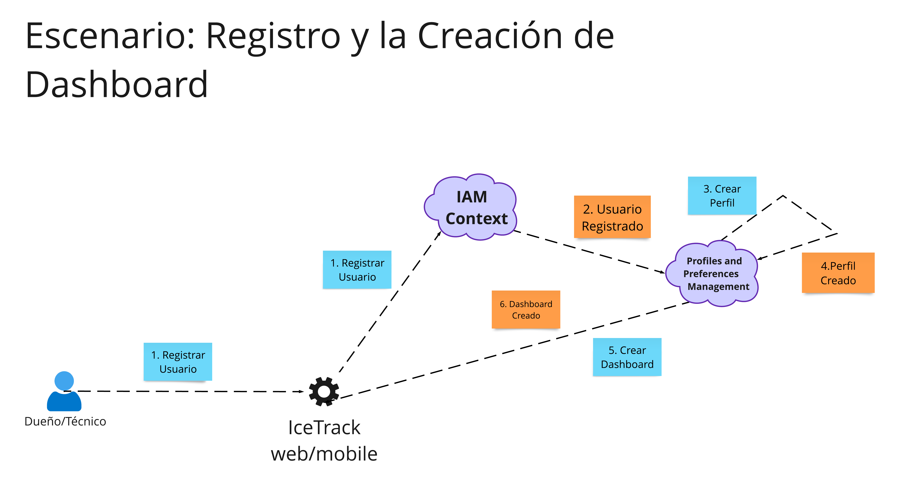

**Escenario 02: Crear/Registrar Equipo en el Sitio**
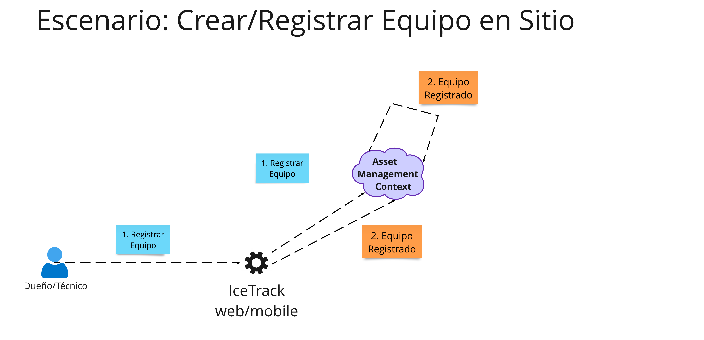

**Escenario 03: Crear Solicitud de Servicio referenciando un Equipo**
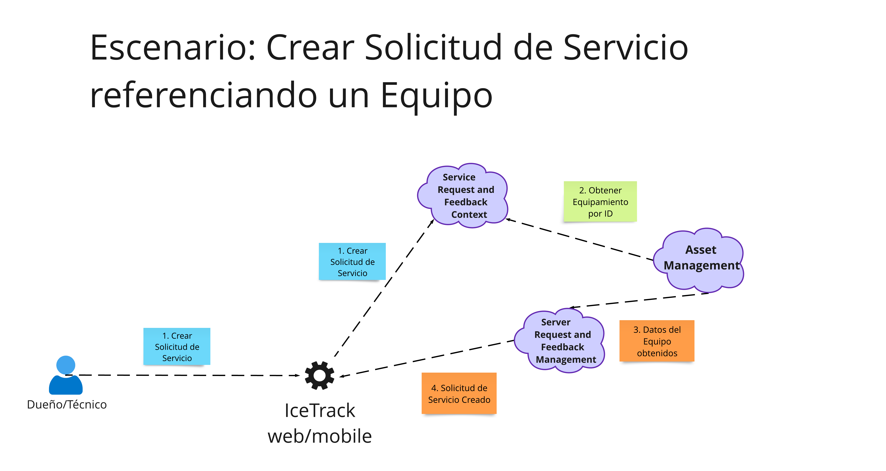

**Escenario 04: Generar Reporte de cumplimiento**
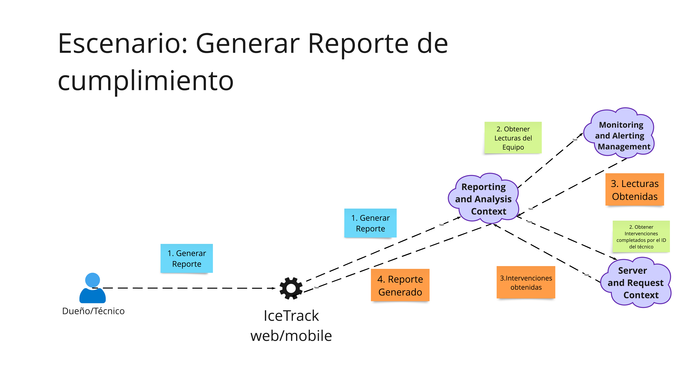

**Escenario 05: Emparejar dispositivo IoT a un Equipo**
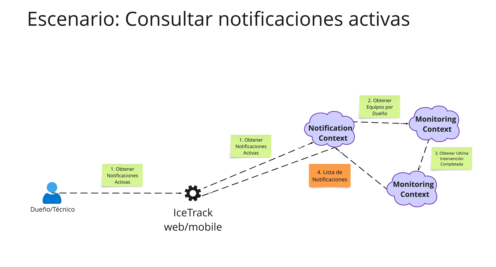

#### 4.1.1.3. Bounded Context Canvases

El Bounded Context Canvas es una herramienta que se aplica dentro del marco del DDD (Domain-Driven Design) que nos permite representar de manera clara los límites, las responsabilidades e interacciones de cada contexto dentro de un sistema que pueda llegar a ser complejo.

En esta sección se representan los Bounded Context correspondientes a los contextos identificados dentro de la aplicación a trabajar:


**IAM (Identity and Access Management)**
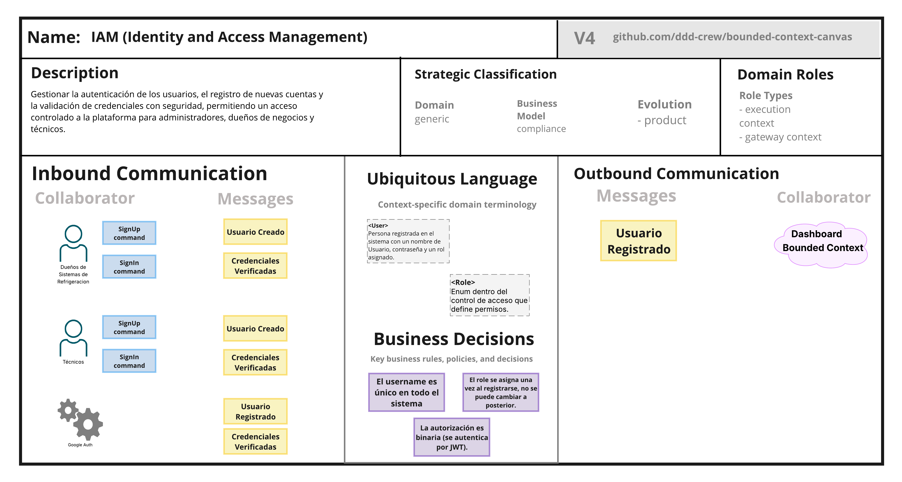

**Profiles and Preferences Management**
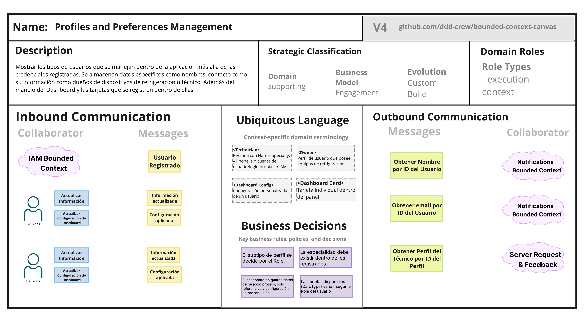

**Assets Management**
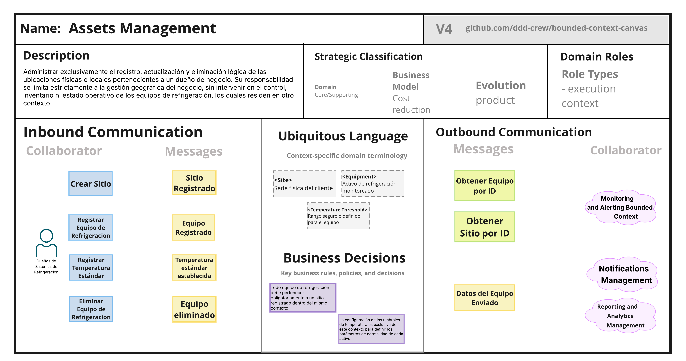

**Device Management**
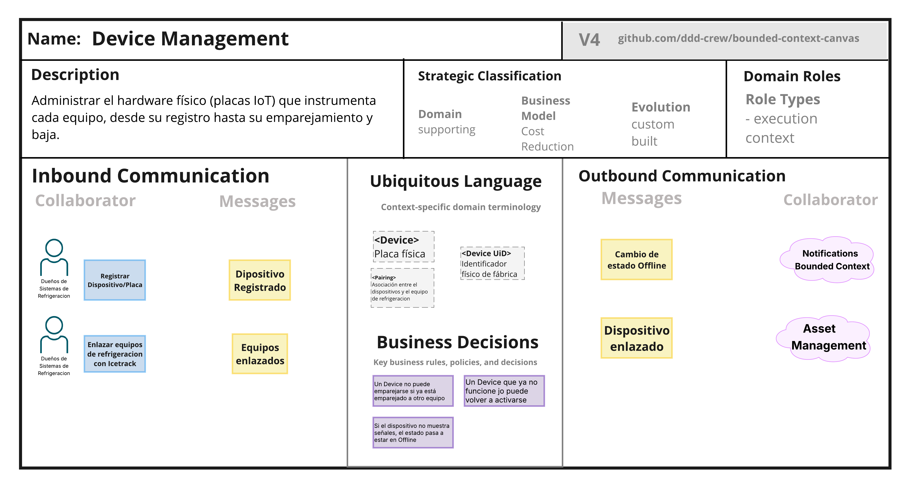

**Service Request Management**
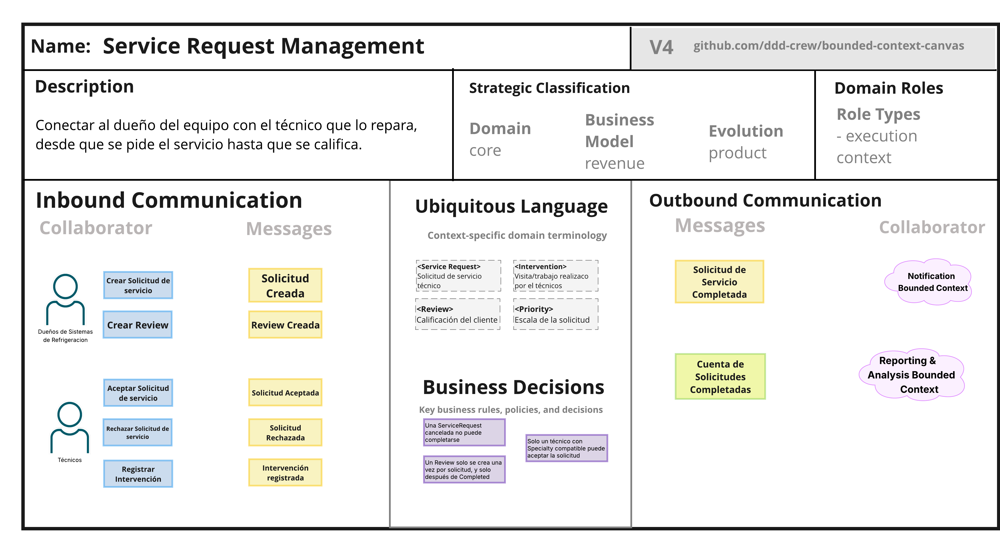

**Notification Management**
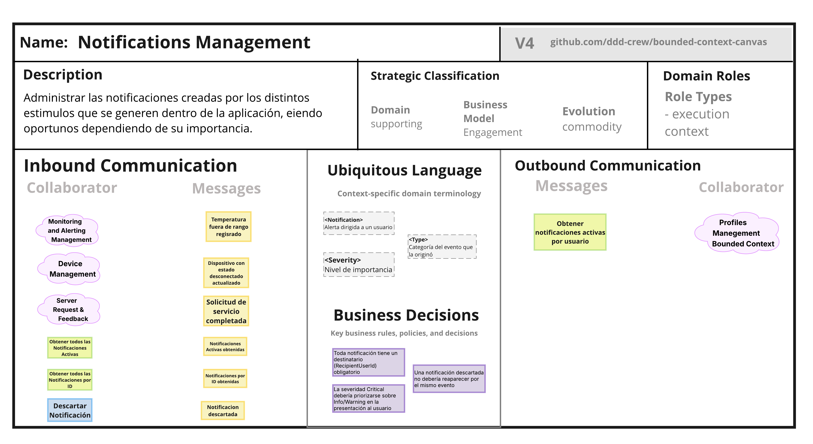

**Reporting and Analytics**
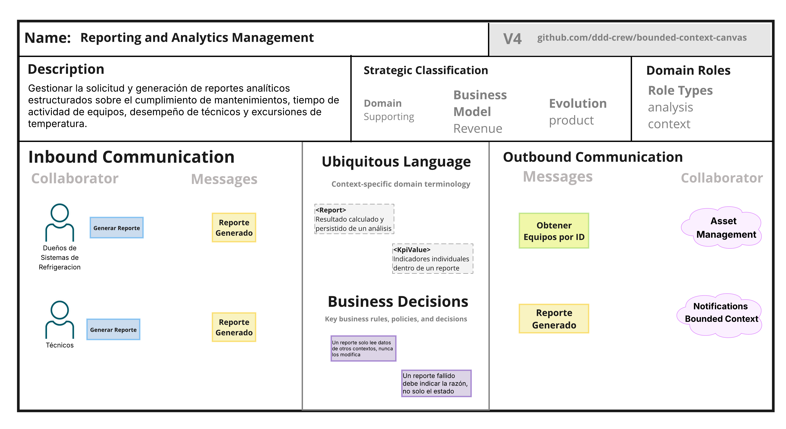

**Monitoring and Alerting**
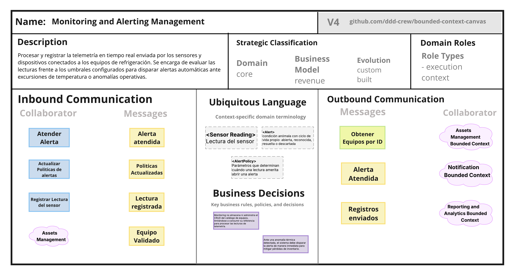

### 4.1.2. Context Mapping

El Context Mapping es la técnica de DDD estratégico que permite visualizar las relaciones e integraciones entre los Bounded Context identificados, así como con sistemas externos. Define quién es Upstream (U: proveedor del modelo/datos) y quién es Downstream (D: consumidor), y qué patrón de integración se aplica: Conformist (CF), Anticorruption Layer (ACL), Open Host Service (OHS) y Published Language (PL).

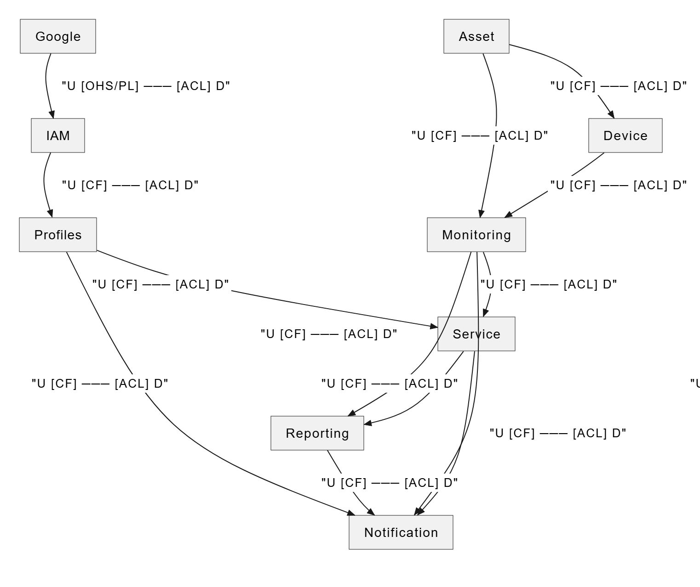

En conjunto, el mapa muestra una arquitectura fuertemente centrada en **Monitoring como Core Domain**, con **Service como segundo núcleo operativo**, y con **Notification y Reporting como contextos de soporte o consumo** que dependen de casi todos los demás. **IAM y Google** actúan como contextos genéricos de soporte a la entrada del sistema, mientras **Asset y Device** forman la base física IoT. La elección homogénea de Conformist con ACL es coherente para un equipo único y una plataforma centralizada: simplifica la integración al imponer el modelo Upstream, pero delega en cada Downstream la responsabilidad de traducir y protegerse mediante ACL, lo que facilita la evolución independiente de cada Bounded Context.

### 4.1.3. Software Architecture

En esta sección se presentan los diagramas de arquitectura de software que representan la estructura y organización del sistema, incluyendo los componentes principales, sus relaciones y la forma en que interactúan entre sí.

#### 4.1.3.1. Software Architecture System Landscape Diagram

El System Landscape Diagram presenta una vista de alcance del sistema IceTrack y su entorno, delimitando lo que pertenece a la solución y lo que es externo a ella. 

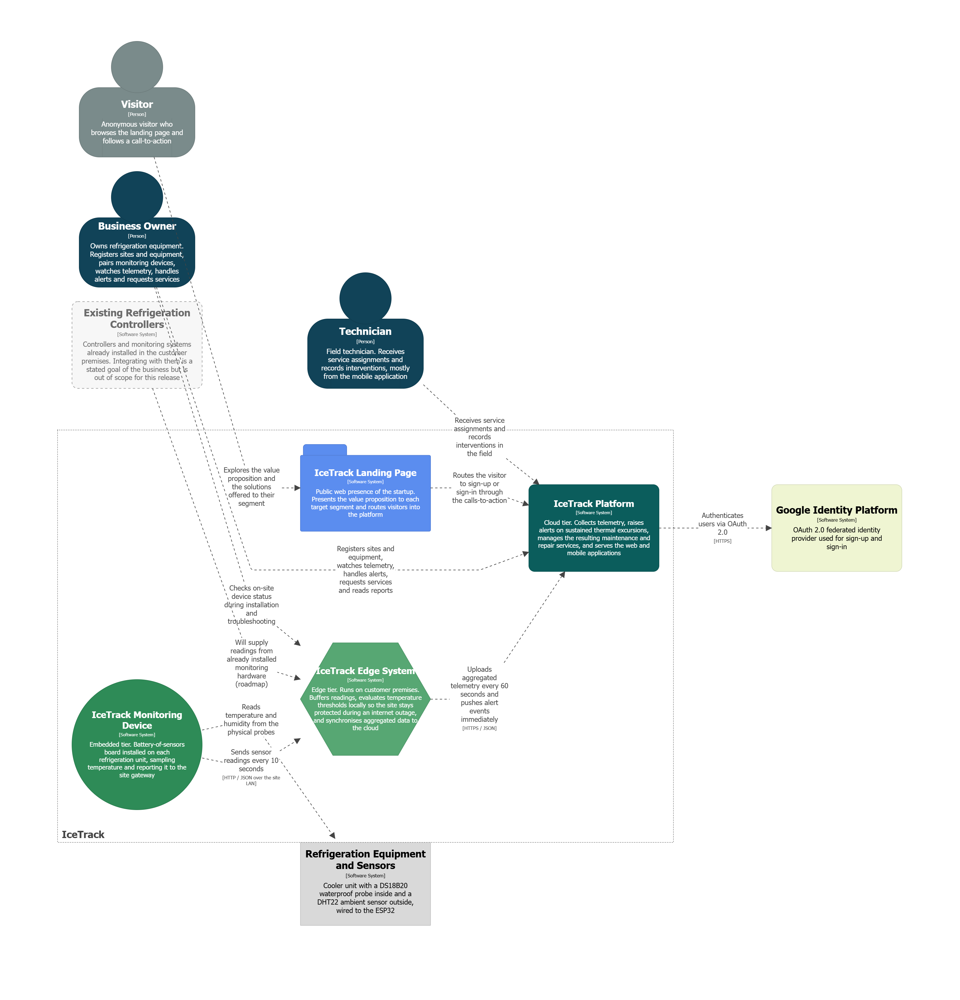

En conjunto, el landscape justifica el alcance del MVP: adquisición propia con hardware ESP32 y DS18B20/DHT22, procesamiento Edge con resiliencia offline, plataforma Cloud para telemetría, alertas y servicios, Landing pública para adquisición y delegación de identidad a Google, dejando la integración con controladores legacy como roadmap.

#### 4.1.3.2. Software Architecture Context Level Diagrams

El Context Level Diagram muestra la relación entre el sistema IceTrack y los actores externos que interactúan con él, incluyendo usuarios, sistemas de terceros y dispositivos IoT.

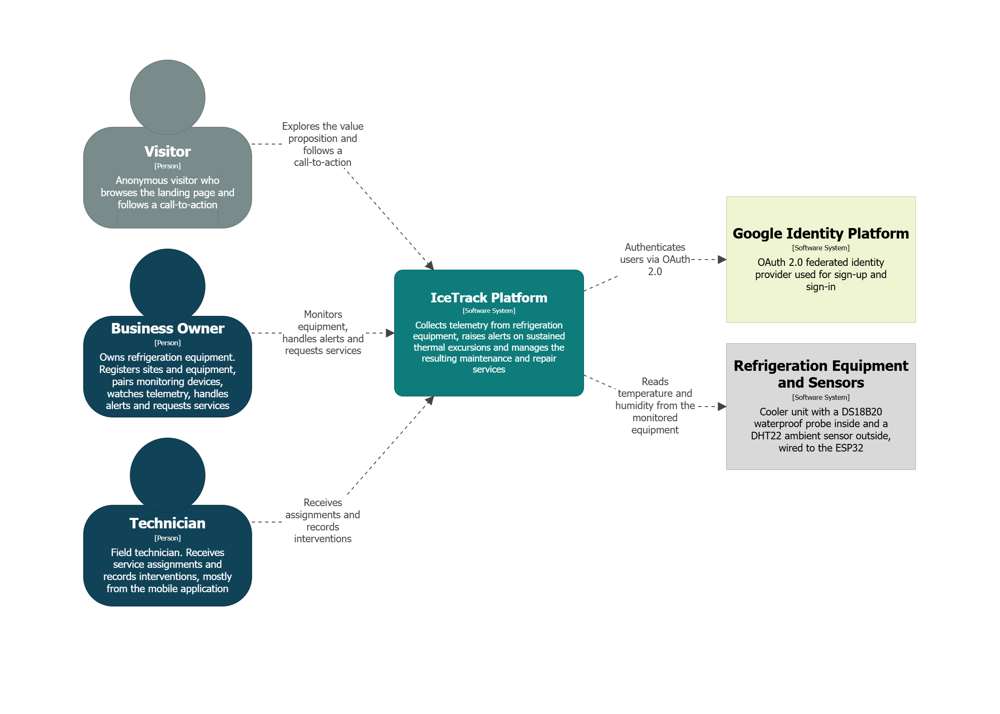

#### 4.1.3.3. Software Architecture Container Level Diagrams

El Container Level Diagram muestra los contenedores de software que componen el sistema IceTrack, incluyendo aplicaciones web, servicios backend, bases de datos y otros componentes relevantes.

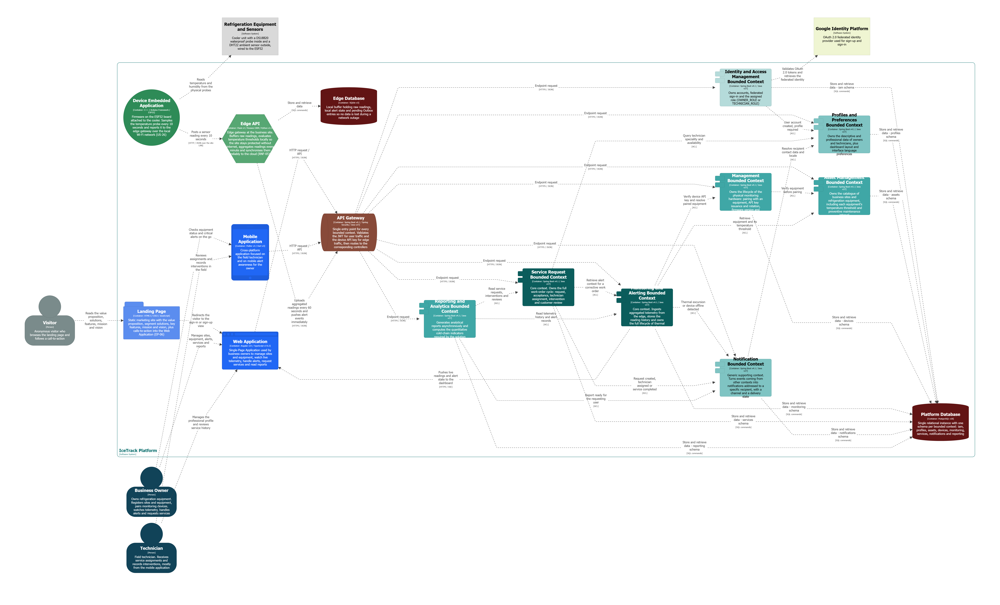

#### 4.1.3.4. Software Architecture Deployment Diagrams

El Deployment Diagram muestra la infraestructura de despliegue del sistema IceTrack, incluyendo nodos cloud, dispositivos IoT Edge (ESP32), base de datos y servicios externos como Google OAuth 2.0.


## 4.2. Tactical-Level Domain-Driven Design

En esta sección se aplican las técnicas de DDD a nivel táctico para diseñar la arquitectura de software de cada uno de los Bounded Context identificados en la sección anterior. Esto incluye la definición de las capas de cada contexto, los componentes que lo conforman y cómo interactúan entre sí. También se incluyen diagramas de componentes y diagramas de código para cada contexto, lo que permite una mayor claridad en la implementación de cada uno de los contextos y su integración con el resto del sistema.

### 4.2.1. Bounded Context: Identity and Access Management

En el Bounded Context de IAM se manejan todas las funcionalidades relacionadas con la gestión de identidades, autenticación y autorización de los usuarios dentro del sistema. Esto incluye el registro de usuarios, la asignación de roles y permisos, y la verificación de credenciales para el acceso a la aplicación. Es un contexto de soporte genérico, Upstream de Profiles.

#### 4.2.1.1. Domain Layer.
La Domain Layer del bounded context **IAM** concentra las reglas de negocio de identidad y acceso, y es independiente de frameworks, base de datos y servicios externos. Su modelo gira en torno a un único aggregate, **User**, que representa a la persona registrada en la plataforma (dueño de negocio o proveedor de mantenimiento).

**Aggregate Root**

| Clase | Categoría | Descripción |
| :--- | :--- | :--- |
| `User` | Aggregate Root / Entity | Representa a la persona registrada en el sistema. Es la única puerta de entrada para modificar el estado de una cuenta y garantiza sus invariantes. |

Atributos de `User`:

| Atributo | Tipo | Descripción |
| :--- | :--- | :--- |
| `id` | `UUID` | Identificador único de la cuenta. |
| `username` | `String` | Nombre de usuario con el que la persona inicia sesión. |
| `passwordHash` | `String` | Hash de la contraseña. Nunca se almacena la contraseña en texto plano. |
| `role` | `String` | Rol asignado al usuario (`Owner` o `Provider`). |

Métodos de `User`:

| Método | Descripción |
| :--- | :--- |
| `authenticate(pass: String): boolean` | Verifica que la contraseña ingresada corresponda con el hash almacenado. Es la regla central para validar credenciales. |

**Value Objects y enumeraciones**

| Clase | Categoría | Descripción |
| :--- | :--- | :--- |
| `Role` | Enum / Value Object | Define los roles válidos dentro del contexto: `Owner` (dueño o cliente de los equipos de refrigeración) y `Provider` (empresa de mantenimiento). El rol se asigna una sola vez, en el registro. |

**Comandos y consultas del dominio**

| Clase | Categoría | Descripción |
| :--- | :--- | :--- |
| `SignUpCommand` | Command (record) | Solicita el registro de una cuenta nueva (username, contraseña y rol). |
| `SignInCommand` | Command (record) | Solicita la autenticación con credenciales. |
| `RefreshTokenCommand` | Command (record) | Solicita renovar el token de acceso. |
| `AssignRoleCommand` | Command (record) | Asigna el rol al usuario en el momento del registro. |
| `GetUserByIdQuery` | Query (record) | Consulta una cuenta por su identificador. |
| `GetUserByUsernameQuery` | Query (record) | Consulta una cuenta por su nombre de usuario. |

**Domain Events**

| Evento | Descripción |
| :--- | :--- |
| `UserRegisteredEvent` | Se emite cuando una cuenta se crea correctamente. Lo consumen otros contextos, principalmente Profiles and Preferences Management, para crear el perfil asociado. |

**Domain Services (interfaces)**

| Interfaz | Descripción |
| :--- | :--- |
| `UserCommandService` | Contrato de las operaciones que cambian el estado: registro (`SignUpCommand`) e inicio de sesión (`SignInCommand`). |
| `UserQueryService` | Contrato de las operaciones de lectura de cuentas (`GetUserByIdQuery`). |

**Repositories (interfaces)**

| Interfaz | Descripción |
| :--- | :--- |
| `UserRepository` | Abstracción de persistencia del aggregate `User`. El dominio solo conoce esta interfaz. Su implementación pertenece a la Infrastructure Layer. |

**Reglas de negocio del dominio**

- El `username` es único en todo el sistema.
- El `role` se asigna una sola vez, al registrarse, y no puede cambiarse después.
- La autorización es binaria: el acceso se concede o se deniega según la validez del JWT.
- La contraseña se almacena únicamente como hash.

**Factories:** no se requieren factories separadas. La creación del `User` se resuelve en el `UserCommandServiceImpl`, que aplica las reglas de registro antes de persistir el aggregate.

#### 4.2.1.2. Interface Layer.

La Interface Layer expone las capacidades del contexto IAM hacia el exterior. Recibe las solicitudes HTTP que el **API Gateway** enruta tras validar el JWT o la API key. Traduce los recursos REST a comandos y consultas del dominio, y devuelve las respuestas. Se organiza en cuatro subpaquetes: `controllers`, `resources`, `assemblers` y `acl`.

**Controllers**

| Clase | Descripción |
| :--- | :--- |
| `AuthenticationController` | Controlador REST de registro, inicio de sesión y renovación de token. Cubre las historias US-01 (Registro de usuario), US-02 (Inicio de sesión) y TS-04 (Registro de usuario vía API RESTful). Depende de `UserCommandService` y `UserQueryService`. |

Métodos de `AuthenticationController`:

| Método | Descripción |
| :--- | :--- |
| `signUp(res: SignUpResource): ResponseEntity<UserResource>` | Recibe los datos de registro, los convierte en un `SignUpCommand`, invoca al servicio de comandos y devuelve la cuenta creada. |
| `signIn(res: SignInResource): ResponseEntity<TokenResource>` | Recibe las credenciales, las convierte en un `SignInCommand` y devuelve el token de acceso. |

**Resources (records)**

| Clase | Descripción |
| :--- | :--- |
| `SignUpResource` | Datos de entrada para el registro (username, contraseña y rol). |
| `SignInResource` | Datos de entrada para el inicio de sesión (username y contraseña). |
| `UserResource` | Representación de una cuenta en las respuestas. No expone el hash de la contraseña. |
| `TokenResource` | Representación del token de acceso (JWT) devuelto tras autenticarse. |

**Assemblers**

| Clase | Método | Descripción |
| :--- | :--- | :--- |
| `AuthenticationAssembler` | `toCommandFromResource(resource: SignUpResource): SignUpCommand` | Transforma el recurso de registro en el comando del dominio. |
| `AuthenticationAssembler` | `toCommandFromResource(resource: SignInResource): SignInCommand` | Transforma el recurso de inicio de sesión en el comando del dominio. |
| `UserAssembler` | `toResourceFromEntity(entity: User): UserResource` | Convierte el aggregate `User` en el recurso de respuesta. |

**ACL / Facade (inbound services)**

| Clase | Descripción |
| :--- | :--- |
| `IamContextFacade` | Fachada que expone a los demás bounded contexts la consulta de cuentas y roles sin revelar el aggregate `User`. Depende de `UserQueryService`. |

Método de `IamContextFacade`:

| Método | Descripción |
| :--- | :--- |
| `fetchUserIdByUsername(username: String): Optional<UUID>` | Devuelve el identificador de un usuario a partir de su username, para que otros contextos referencien la cuenta sin acceder al modelo interno de IAM. |


#### 4.2.1.3. Application Layer.

La Application Layer orquesta los flujos del negocio del contexto IAM. Recibe los comandos y consultas de la Interface Layer, coordina al aggregate `User`, los repositorios y los servicios externos, y reacciona a eventos. No contiene reglas de negocio propias: las delega en el dominio. Implementa las capabilities del contexto: **registro de cuentas, autenticación con credenciales o Google OAuth 2.0, emisión de tokens y consulta de cuentas**.

**Command Services**

| Clase | Implementa | Descripción |
| :--- | :--- | :--- |
| `UserCommandServiceImpl` | `UserCommandService` | Ejecuta los procesos que modifican el estado de las cuentas. |

Dependencias de `UserCommandServiceImpl`:

| Dependencia | Uso |
| :--- | :--- |
| `UserRepository` | Persistir y consultar el aggregate `User`. |
| `GoogleTokenService` | Validar el token de Google y obtener la identidad federada. |
| `HashingService` | Generar y verificar el hash de las contraseñas. |

Manejadores de comandos:

| Método | Flujo |
| :--- | :--- |
| `handle(cmd: SignUpCommand): Optional<User>` | 1) Verifica que el username no exista. 2) Genera el hash de la contraseña con `HashingService`. 3) Asigna el rol (`AssignRoleCommand`). 4) Crea y persiste el `User`. 5) Publica `UserRegisteredEvent`. Si el registro es con Google, valida antes la identidad con `GoogleTokenService`. |
| `handle(cmd: SignInCommand): Optional<TokenDTO>` | 1) Busca al usuario por username. 2) Valida las credenciales con `User.authenticate(pass)`, o el token de Google si el ingreso es federado. 3) Emite el JWT y lo devuelve en un `TokenDTO`. |
| `handle(cmd: RefreshTokenCommand)` | Renueva el token de acceso a partir de una sesión vigente. |

**Query Services**

| Clase | Implementa | Descripción |
| :--- | :--- | :--- |
| `UserQueryServiceImpl` | `UserQueryService` | Resuelve las consultas de lectura sobre cuentas usando `UserRepository`. |

Manejadores de consultas:

| Método | Descripción |
| :--- | :--- |
| `handle(q: GetUserByIdQuery): Optional<User>` | Devuelve la cuenta que corresponde al identificador. |
| `handle(q: GetUserByUsernameQuery): Optional<User>` | Devuelve la cuenta que corresponde al username. Es la consulta que usa `IamContextFacade`. |

**Event Handlers**

| Clase | Descripción |
| :--- | :--- |
| `UserRegisteredEventHandler` | Escucha `UserRegisteredEvent` (`on(event: UserRegisteredEvent): void`) y solicita al contexto **Profiles and Preferences Management** la creación del perfil y las preferencias iniciales del usuario. Así se cumple el flujo de registro y creación de dashboard, sin acoplar IAM al modelo de Profiles. |

**Outbound Services (ACL)**

| Clase | Descripción |
| :--- | :--- |
| `ProfilesExternalService` | Anti-Corruption Layer que solicita al contexto Profiles la creación del perfil una vez que la cuenta existe. |
| `GoogleIdentityExternalService` | Anti-Corruption Layer que traduce los claims del token de Google OAuth 2.0 al modelo de identidad de la plataforma, sin filtrar detalles del proveedor al dominio. |

#### 4.2.1.4. Infrastructure Layer.

La Infrastructure Layer contiene las clases que acceden a recursos técnicos externos: la base de datos y los servicios de terceros. Implementa las abstracciones definidas en el dominio, de modo que el modelo no dependa de tecnologías concretas.

**Persistencia (Repositories)**

| Clase | Implementa | Descripción |
| :--- | :--- | :--- |
| `SpringDataJpaUserRepository` | `UserRepository` | Implementación con Spring Data JPA del repositorio del aggregate `User`. Opera sobre el esquema `iam` de la instancia PostgreSQL v18 (Platform Database), que mantiene un esquema por bounded context. |

Responsabilidades de `SpringDataJpaUserRepository`:

- Guardar, actualizar y consultar cuentas de usuario.
- Buscar usuarios por identificador y por username.
- Verificar la unicidad del username antes del registro.

**Servicios de seguridad**

| Clase | Descripción |
| :--- | :--- |
| `HashingService` (implementación) | Genera y verifica el hash de las contraseñas usando un algoritmo de hashing de Spring Security. Lo consume `UserCommandServiceImpl`. |
| Servicio de tokens JWT | Firma y valida los JWT emitidos tras la autenticación. El API Gateway los valida en cada solicitud antes de enrutarla al controlador. |

**Integraciones con servicios externos**

| Clase | Descripción |
| :--- | :--- |
| `GoogleTokenService` (implementación) | Se comunica por HTTPS con **Google Identity Platform** para validar el token OAuth 2.0 y recuperar la identidad federada del usuario. Es el adaptador técnico que usa `GoogleIdentityExternalService`. |
| Adaptador hacia Profiles | Implementa la comunicación con el contexto Profiles and Preferences Management, para la creación del perfil tras el registro. |

**Resumen de dependencias externas**

| Recurso externo | Tipo | Uso en IAM |
| :--- | :--- | :--- |
| PostgreSQL v18 (esquema `iam`) | Base de datos relacional | Persistencia de cuentas de usuario. |
| Google Identity Platform | Proveedor de identidad OAuth 2.0 | Registro e inicio de sesión con cuenta de Google. |
| Profiles and Preferences Management | Bounded context interno | Creación del perfil una vez registrada la cuenta. |

#### 4.2.1.5. Bounded Context Software Architecture Component Level Diagrams.

En el siguiente diagrama de componentes mostramos cómo organizamos internamente el bounded context Identity and Access Management. Se observa el Authentication Controller que recibe las solicitudes desde el API Gateway, los servicios de comandos y consultas de usuario, el aggregate User con su repositorio y la fachada que expone la información de cuentas y roles a los demás contextos. También se muestran las integraciones con Google Identity Platform y con Profiles and Preferences Management, ambas protegidas mediante capas anticorrupción, y el esquema `iam` de la base de datos.

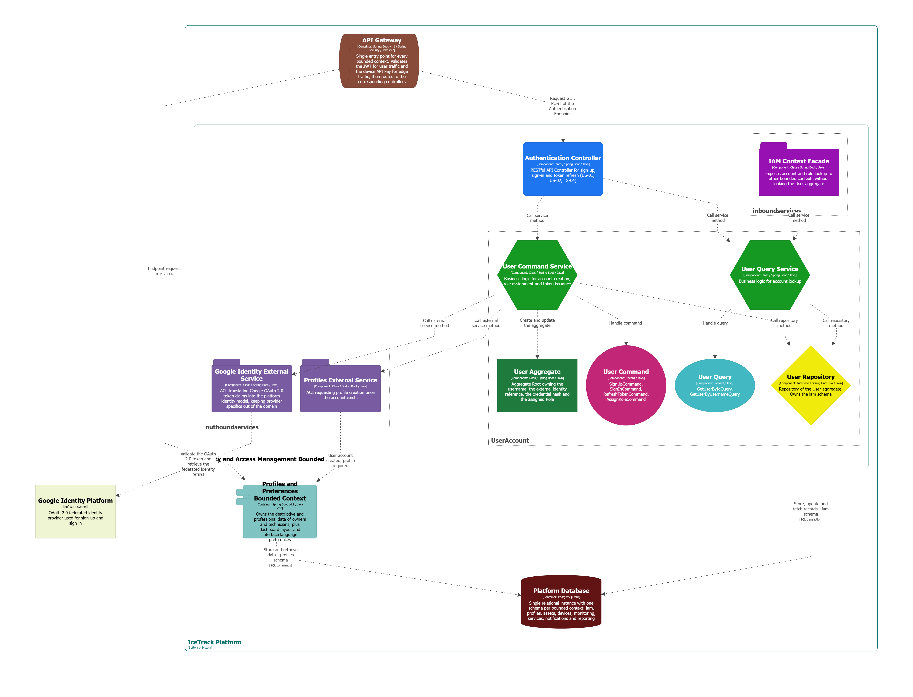

#### 4.2.1.6. Bounded Context Software Architecture Code Level Diagrams.

En esta sección presentamos los diagramas de nivel de código del bounded context Identity and Access Management. Estos diagramas bajan al detalle de implementación: el diagrama de clases de la capa de dominio y el diseño de la base de datos que respalda el modelo.

##### 4.2.1.6.1. Bounded Context Domain Layer Class Diagrams.

El siguiente diagrama de clases representa la estructura del contexto IAM organizada por capas. En el dominio se encuentra el aggregate `User` con sus atributos y la regla de autenticación, junto con las interfaces de servicios y del repositorio. Sobre ellas se ubican los servicios de comandos y consultas y el manejador del evento de usuario registrado en la capa de aplicación, los controladores, assemblers, recursos y la fachada en la capa de interfaces, y la implementación JPA del repositorio en la capa de infraestructura.

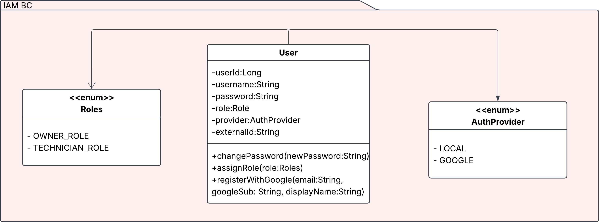

##### 4.2.1.6.2. Bounded Context Database Design Diagram.

El siguiente diagrama presenta el diseño de la base de datos del esquema `iam`, donde persistimos las cuentas de usuario junto con su nombre de usuario, el hash de la contraseña y el rol asignado.

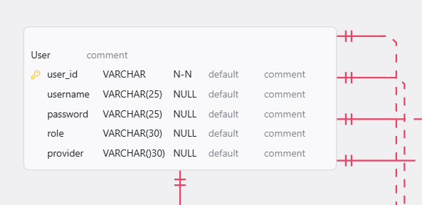

---

### 4.2.2. Bounded Context: Profiles and Preferences Management

En el bounded context Profiles and Preferences Management administramos los datos personales y profesionales de los dueños de negocio y de los técnicos, así como las preferencias de presentación de cada usuario: la disposición de las tarjetas del dashboard, el rango de temperatura preferido y el idioma de la interfaz. Es un contexto de soporte que recibe la información de la cuenta desde IAM, y que a su vez sirve datos de contacto y de disponibilidad de técnicos a Notification Management y a Service Request Management.

#### 4.2.2.1. Domain Layer.
La Domain Layer del bounded context **Profiles and Preferences Management** contiene el modelo de los datos personales y profesionales de dueños y técnicos, y el de las preferencias de presentación de cada usuario. Está organizada en dos aggregates independientes: **Profile**, con sus especializaciones `OwnerProfile` y `TechnicianProfile`, y **DashboardConfig**, que agrupa la configuración del panel de control y del idioma. Ambos se asocian al usuario de IAM mediante `userId`, sin depender del modelo interno de ese contexto.

**Aggregate Roots**

| Clase | Categoría | Descripción |
| :--- | :--- | :--- |
| `Profile` | Aggregate Root (clase abstracta) | Representa los datos descriptivos de una persona dentro de la plataforma. Es abstracta y se especializa según el rol asignado en IAM. |
| `OwnerProfile` | Entity (especialización de `Profile`) | Perfil del dueño de negocio (cliente). Agrega el RUC del negocio. |
| `TechnicianProfile` | Entity (especialización de `Profile`) | Perfil del técnico. Agrega su especialidad y su número de certificación, y se vincula al perfil del proveedor al que pertenece. |
| `DashboardConfig` | Aggregate Root | Configuración de presentación de un usuario: tarjetas del dashboard con su orden y visibilidad, rango de temperatura preferido e idioma de la interfaz. Existe una configuración por usuario. |

Atributos de `Profile`:

| Atributo | Tipo | Descripción |
| :--- | :--- | :--- |
| `id` | `UUID` | Identificador único del perfil. |
| `userId` | `UUID` | Referencia a la cuenta de usuario del contexto IAM. |
| `fullName` | `String` | Nombre completo de la persona. |
| `email` | `Email` (Value Object) | Correo de contacto. |
| `phone` | `Phone` (Value Object) | Teléfono de contacto. |
| `address` | `Address` (Value Object) | Dirección de la persona o del negocio. |

Atributos específicos de las especializaciones:

| Clase | Atributo | Descripción |
| :--- | :--- | :--- |
| `OwnerProfile` | `ruc` | Registro Único de Contribuyente del negocio del dueño. |
| `TechnicianProfile` | `speciality` | Especialidad técnica del técnico (por ejemplo, refrigeración comercial). |
| `TechnicianProfile` | `certificationNumber` | Número de certificación del técnico. |
| `TechnicianProfile` | `providerProfileId` | Referencia al perfil del proveedor al que pertenece el técnico. |

Atributos de `DashboardConfig`:

| Atributo | Tipo | Descripción |
| :--- | :--- | :--- |
| `id` | `UUID` | Identificador único de la configuración. |
| `userId` | `UUID` | Usuario propietario de la configuración. |
| `layout` | `String` | Disposición de las tarjetas del dashboard (orden y visibilidad). |
| `temperatureRange` | `TemperatureRange` | Rango de temperatura preferido por el usuario. |
| `locale` | `Locale` | Idioma de la interfaz (ES o EN). |

**Value Objects**

| Clase | Descripción |
| :--- | :--- |
| `Email` | Correo electrónico validado. |
| `Phone` | Número de teléfono de contacto. |
| `Address` | Dirección postal o de ubicación. |
| `TemperatureRange` | Rango de temperatura mínima y máxima preferido para visualizar los equipos. |
| `Locale` | Idioma de la interfaz de usuario (US-23). |
| `DashboardCard` | Tarjeta del panel, con su orden y su visibilidad dentro del layout. |

**Commands y Queries del dominio**

| Clase | Categoría | Descripción |
| :--- | :--- | :--- |
| `CreateProfileCommand` | Command (record) | Crea el perfil de un usuario recién registrado. |
| `UpdateProfileInfoCommand` | Command (record) | Actualiza los datos descriptivos del perfil. |
| `AddCardCommand` | Command (record) | Agrega una tarjeta al dashboard. |
| `RemoveCardCommand` | Command (record) | Quita una tarjeta del dashboard. |
| `ChangeVisibilityCommand` | Command (record) | Muestra u oculta una tarjeta. |
| `UpdateDashboardLayoutCommand` | Command (record) | Actualiza la disposición y el orden de las tarjetas. |
| `ChangeLocaleCommand` | Command (record) | Cambia el idioma de la interfaz. |
| `GetProfileByUserIdQuery` | Query (record) | Obtiene el perfil asociado a un usuario. |
| `GetProfileByIdQuery` | Query (record) | Obtiene un perfil por su identificador. |
| `GetAvailableTechniciansBySpecialityQuery` | Query (record) | Lista los técnicos disponibles según su especialidad. |
| `GetDashboardConfigByUserIdQuery` | Query (record) | Obtiene la configuración del dashboard de un usuario. |

**Domain Services y Factories**

| Clase | Categoría | Descripción |
| :--- | :--- | :--- |
| `UserProfileFactory` | Factory / Domain Service | Construye un `OwnerProfile` o un `TechnicianProfile` a partir de los datos de registro, según el rol asignado en IAM. Encapsula la decisión de qué especialización crear. |
| `ProfileCommandService` | Domain Service (interfaz) | Contrato de las operaciones que crean y actualizan perfiles. |
| `ProfileQueryService` | Domain Service (interfaz) | Contrato de las consultas de perfiles y de disponibilidad de técnicos. |
| `DashboardConfigCommandService` | Domain Service (interfaz) | Contrato de las operaciones que modifican la configuración del dashboard y del idioma. |

**Repositories (interfaces)**

| Interfaz | Descripción |
| :--- | :--- |
| `ProfileRepository` | Abstracción de persistencia del aggregate `Profile` y sus especializaciones. |
| `DashboardConfigRepository` | Abstracción de persistencia del aggregate `DashboardConfig`. |

**Domain Events**

| Evento | Descripción |
| :--- | :--- |
| `Perfil Creado` | Se emite cuando se crea el perfil de un usuario. |
| `Perfil Actualizado` | Se emite cuando cambian los datos descriptivos del perfil. |
| `Configuración de Dashboard Actualizada` | Se emite cuando el usuario modifica su dashboard o su idioma. |

**Reglas de negocio del dominio**

- Cada perfil pertenece a un único usuario de IAM (`userId`).
- El tipo de perfil (`OwnerProfile` o `TechnicianProfile`) se define por el rol asignado en IAM al registrarse.
- Un `OwnerProfile` requiere un RUC. Un `TechnicianProfile` requiere especialidad y número de certificación.
- Cada usuario tiene una única configuración de dashboard, asociada de manera individual.

#### 4.2.2.2. Interface Layer.

La Interface Layer expone las capacidades del contexto hacia el exterior. Recibe las solicitudes HTTP que el **API Gateway** enruta después de validar el JWT, y publica una fachada para los demás bounded contexts. Se organiza en los subpaquetes `controllers`, `resources`, `assemblers` y `acl`.

**Controllers**

| Clase | Descripción |
| :--- | :--- |
| `ProfileController` | Controlador REST del *Profile Endpoint* (GET, POST, PUT). Gestiona la creación y actualización de perfiles y cubre las historias US-07 (registro y gestión de técnicos) y US-08 (consulta del perfil de un técnico). Depende de `ProfileCommandService` y `ProfileQueryService`. |
| `PreferencesController` | Controlador REST del *Preferences Endpoint* (GET, POST, PUT). Gestiona la disposición del dashboard y el idioma de la interfaz, y cubre las historias US-23 (cambio de idioma) y US-25 (métricas del dashboard). Depende de los servicios de configuración del dashboard. |

Métodos principales:

| Clase | Método | Descripción |
| :--- | :--- | :--- |
| `ProfileController` | `createOwner(res: CreateOwnerProfileRequest): ResponseEntity<ProfileResponse>` | Recibe los datos del dueño, los convierte en un `CreateProfileCommand` y devuelve el perfil creado. |

**Resources (records)**

| Clase | Descripción |
| :--- | :--- |
| `CreateOwnerProfileRequest` | Datos de entrada para crear el perfil de un dueño. |
| `ProfileResponse` | Representación del perfil en las respuestas de la API. |

**Assemblers**

| Clase | Método | Descripción |
| :--- | :--- | :--- |
| `ProfileAssembler` | `toResourceFromEntity(entity: Profile): ProfileResponse` | Convierte el aggregate `Profile` en el recurso de respuesta. |
| `ProfileAssembler` | `toCommandFromResource(resource: CreateOwnerProfileRequest): CreateProfileCommand` | Transforma el recurso de creación en el comando del dominio. |

**ACL / Facade (inbound services)**

| Clase | Descripción |
| :--- | :--- |
| `ProfilesContextFacade` | Fachada que expone a otros bounded contexts la creación de perfiles, los datos de contacto y la disponibilidad de técnicos, sin revelar el modelo interno. Depende de `ProfileQueryService`. |

Método de `ProfilesContextFacade`:

| Método | Descripción |
| :--- | :--- |
| `isTechnicianAvailable(technicianId: UUID): boolean` | Indica si un técnico está disponible para ser asignado a una solicitud de servicio. |

Consumidores de la fachada:

| Contexto consumidor | Uso |
| :--- | :--- |
| Identity and Access Management | Solicita la creación del perfil cuando se registra una cuenta de usuario. |
| Notification Management | Resuelve los datos de contacto y el idioma del destinatario de una notificación. |
| Service Request Management | Consulta la especialidad y la disponibilidad de los técnicos al asignar una solicitud. |

#### 4.2.2.3. Application Layer.

La Application Layer orquesta los flujos del contexto. Recibe los comandos y consultas de la Interface Layer, coordina los aggregates y los repositorios, y delega en el dominio las reglas de negocio. Sus capabilities son **crear y actualizar perfiles, consultar perfiles y disponibilidad de técnicos, y administrar la configuración del dashboard y del idioma**.

**Command Services**

| Clase | Implementa | Descripción |
| :--- | :--- | :--- |
| `ProfileCommandServiceImpl` | `ProfileCommandService` | Ejecuta los procesos de creación y actualización de perfiles. Depende de `ProfileRepository`. |
| `DashboardConfigCommandServiceImpl` | `DashboardConfigCommandService` | Ejecuta los procesos que modifican el dashboard y el idioma. Depende de `DashboardConfigRepository`. |

Manejadores de comandos:

| Clase | Método | Flujo |
| :--- | :--- | :--- |
| `ProfileCommandServiceImpl` | `handle(cmd: CreateProfileCommand): Optional<Profile>` | 1) Recibe los datos de registro y el rol del usuario. 2) Usa `UserProfileFactory` para construir el `OwnerProfile` o el `TechnicianProfile`. 3) Persiste el perfil. 4) Registra el evento `Perfil Creado`. |
| `ProfileCommandServiceImpl` | `handle(cmd: UpdateProfileInfoCommand)` | Busca el perfil, actualiza sus datos y emite `Perfil Actualizado`. |
| `DashboardConfigCommandServiceImpl` | `handle(cmd: UpdateDashboardLayoutCommand): void` | Actualiza la disposición y el orden de las tarjetas del usuario y emite `Configuración de Dashboard Actualizada`. |
| `DashboardConfigCommandServiceImpl` | `handle(cmd: AddCardCommand / RemoveCardCommand / ChangeVisibilityCommand)` | Agrega, quita o cambia la visibilidad de una tarjeta del dashboard. |
| `DashboardConfigCommandServiceImpl` | `handle(cmd: ChangeLocaleCommand)` | Cambia el idioma de la interfaz del usuario. |

**Query Services**

| Clase | Implementa | Descripción |
| :--- | :--- | :--- |
| `ProfileQueryServiceImpl` | `ProfileQueryService` | Resuelve las consultas de lectura de perfiles y de disponibilidad de técnicos. |
| `DashboardConfigQueryService` | — | Resuelve la consulta de la configuración del dashboard de un usuario. |

Manejadores de consultas:

| Clase | Método | Descripción |
| :--- | :--- | :--- |
| `ProfileQueryServiceImpl` | `handle(q: GetProfileByIdQuery): Optional<Profile>` | Devuelve el perfil que corresponde al identificador. |
| `ProfileQueryServiceImpl` | `handle(q: GetProfileByUserIdQuery)` | Devuelve el perfil asociado a un usuario de IAM. |
| `ProfileQueryServiceImpl` | `handle(q: GetAvailableTechniciansBySpecialityQuery)` | Devuelve los técnicos disponibles de una especialidad. Lo usa Service Request Management para asignar técnicos. |
| `DashboardConfigQueryService` | `handle(q: GetDashboardConfigByUserIdQuery)` | Devuelve la configuración del dashboard del usuario. |

**Integración con otros contextos**

| Flujo | Descripción |
| :--- | :--- |
| Registro de usuario → creación de perfil | Cuando IAM registra una cuenta, solicita mediante `ProfilesContextFacade` la creación del perfil. Este contexto lo crea con el tipo correspondiente al rol y deja lista la configuración inicial del dashboard. |
| Notificaciones → datos del destinatario | Notification Management consulta la fachada para obtener los datos de contacto y el idioma del usuario que recibirá el mensaje. |
| Solicitudes de servicio → técnicos | Service Request Management consulta la especialidad y la disponibilidad de los técnicos antes de asignarlos. |

#### 4.2.2.4. Infrastructure Layer.

La Infrastructure Layer contiene las clases que acceden a la base de datos. Implementa las abstracciones de repositorio definidas en el dominio, de modo que el modelo no dependa de una tecnología concreta.

**Persistencia (Repositories)**

| Clase | Implementa | Descripción |
| :--- | :--- | :--- |
| `SpringDataJpaProfileRepository` | `ProfileRepository` | Implementación con Spring Data JPA del repositorio de `Profile`, `OwnerProfile` y `TechnicianProfile`. |
| `SpringDataJpaDashboardConfigRepository` | `DashboardConfigRepository` | Implementación con Spring Data JPA del repositorio de `DashboardConfig`. |

Ambos repositorios operan sobre el esquema `profiles` de la instancia **PostgreSQL v18** (*Platform Database*), que mantiene un esquema por bounded context.

Responsabilidades de los repositorios:

- Guardar, actualizar y consultar perfiles por identificador y por `userId`.
- Consultar técnicos por especialidad y disponibilidad.
- Guardar y consultar la configuración del dashboard de cada usuario.

**Modelo de tablas del esquema `profiles`**

| Tabla | Columna | Tipo | Descripción |
| :--- | :--- | :--- | :--- |
| `Profile` | `profile_id` | `VARCHAR` (PK) | Identificador del perfil. |
| `Profile` | `full_name` | `VARCHAR(25)` | Nombre completo. |
| `Profile` | `email` | `VARCHAR(30)` | Correo de contacto. |
| `Profile` | `phone` | `CHAR` | Teléfono de contacto. |
| `Profile` | `user_id` | `VARCHAR` (FK) | Usuario de IAM asociado. |
| `OwnerProfile` | `profiles_id` | `VARCHAR` (PK/FK) | Referencia al perfil base. |
| `OwnerProfile` | `ruc` | `VARCHAR(10)` | RUC del negocio. |
| `TechnicianProfile` | `profile_id` | `VARCHAR` (PK/FK) | Referencia al perfil base. |
| `TechnicianProfile` | `speciality` | `VARCHAR(30)` | Especialidad del técnico. |
| `TechnicianProfile` | `certification_number` | `VARCHAR(30)` | Número de certificación. |
| `TechnicianProfile` | `provider_profiles_id` | `VARCHAR` | Perfil del proveedor al que pertenece. |

**Resumen de dependencias externas**

| Recurso | Tipo | Uso en Profiles and Preferences |
| :--- | :--- | :--- |
| PostgreSQL v18 (esquema `profiles`) | Base de datos relacional | Persistencia de perfiles y configuración de dashboard. |
| Identity and Access Management | Bounded context interno (Upstream) | Origen del `userId` y del rol que determina el tipo de perfil. |

#### 4.2.2.5. Bounded Context Software Architecture Component Level Diagrams.

En el siguiente diagrama de componentes mostramos cómo organizamos el contexto Profiles and Preferences en dos subdominios: Profile y DashboardConfiguration. Cada uno cuenta con su controlador, sus servicios de comandos y consultas, su aggregate y su repositorio. Se incluye también la fábrica que construye el perfil según el rol asignado, la fachada que expone el contexto a IAM, Notification y Service Request, y el esquema `profiles` de la base de datos.

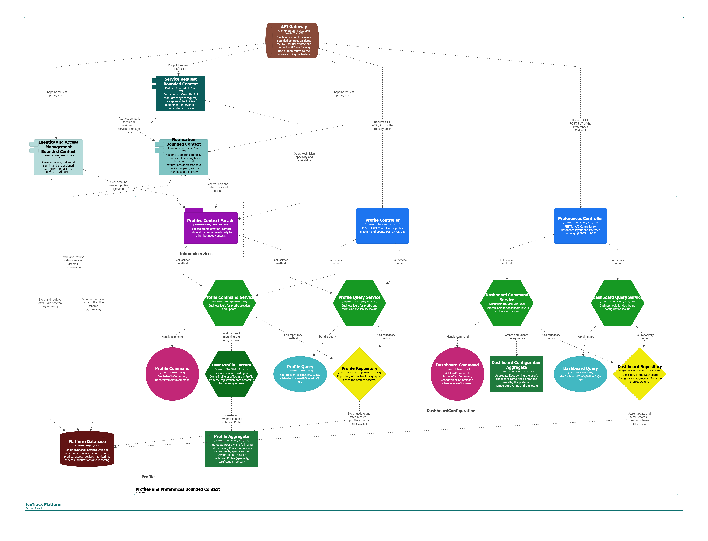

#### 4.2.2.6. Bounded Context Software Architecture Code Level Diagrams.

En esta sección presentamos los diagramas de nivel de código del bounded context Profiles and Preferences Management: el diagrama de clases de la capa de dominio y el diseño de la base de datos del esquema `profiles`.

##### 4.2.2.6.1. Bounded Context Domain Layer Class Diagrams.

El siguiente diagrama de clases muestra el modelo de este contexto. El aggregate `Profile` es una clase abstracta que se especializa en `OwnerProfile` y `TechnicianProfile`, mientras que `DashboardConfig` agrupa la configuración del panel y del idioma de cada usuario. El diagrama incluye además los servicios de comandos y consultas, el controlador con su assembler y recursos, la fachada del contexto y los repositorios con su implementación JPA.

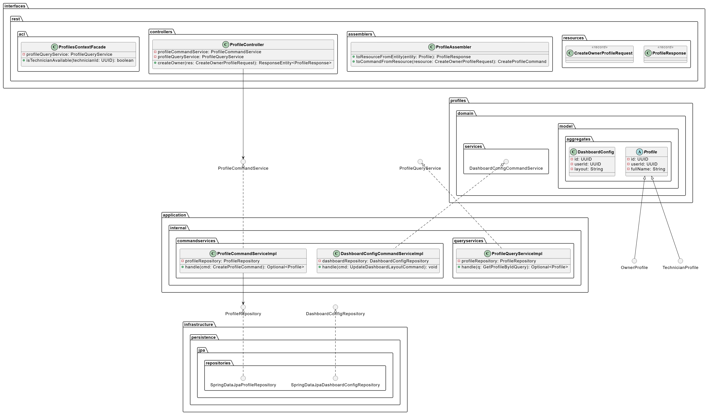

##### 4.2.2.6.2. Bounded Context Database Design Diagram.

El siguiente diagrama presenta el diseño de la base de datos del esquema `profiles`. La tabla `Profile` guarda los datos comunes de cada persona, y las tablas `OwnerProfile` y `TechnicianProfile` almacenan los datos propios de cada tipo de perfil, como el RUC del negocio o la especialidad y la certificación del técnico.

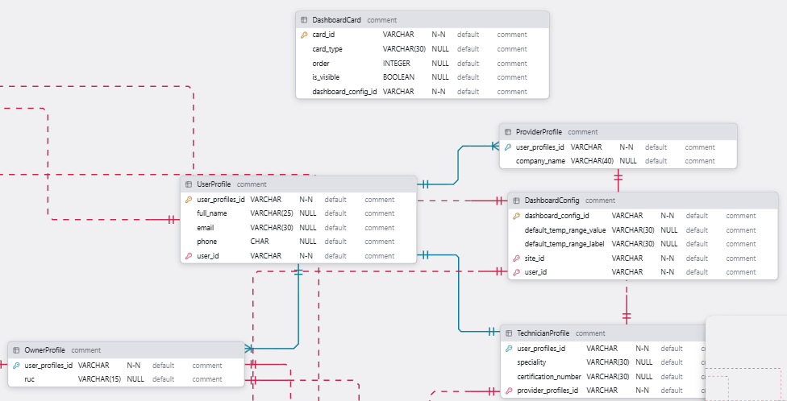

---

### 4.2.3. Bounded Context: Monitoring and Alerting

#### 4.2.3.1. Domain Layer.

La Domain Layer del bounded context **Monitoring and Alerting** contiene el modelo del **Core Domain** de IceTrack. Su función es recibir la telemetría de los dispositivos IoT, conservar el histórico de lecturas de cada equipo y gestionar el ciclo de vida completo de una alerta, ya sea térmica o de conectividad. El modelo se organiza en dos subdominios: **SensorReading**, para las lecturas, y **Alert**, para las alertas y sus reglas de evaluación.

**Aggregate Roots y Entities**

| Clase | Categoría | Descripción |
| :--- | :--- | :--- |
| `Alert` | Aggregate Root | Representa una alerta sobre un equipo. Controla su ciclo de vida (`OPEN`, `ACKNOWLEDGED`, `RESOLVED`, `DISMISSED`) y garantiza las transiciones de estado válidas. |
| `SensorReading` | Entity (inmutable) | Lectura agregada enviada por un dispositivo. Una vez registrada no se modifica. |
| `AlertPolicy` | Entity | Política de evaluación configurada por equipo: define cuándo se abre o se cierra una alerta y cuándo se considera offline un dispositivo. |

Atributos de `Alert`:

| Atributo | Tipo | Descripción |
| :--- | :--- | :--- |
| `id` | `UUID` | Identificador único de la alerta. |
| `equipmentId` | `UUID` | Equipo de refrigeración afectado (referencia al contexto Assets Management). |
| `severity` | `String` | Nivel de severidad de la alerta. |
| `status` | `String` | Estado actual: `OPEN`, `ACKNOWLEDGED`, `RESOLVED` o `DISMISSED`. |
| `type` | `AlertType` | Tipo de alerta: excursión térmica o `DEVICE_OFFLINE`. |
| `readingId` | `UUID` | Lectura que disparó la alerta. |
| `peakTemperature` | `Double` | Temperatura máxima alcanzada durante la excursión. |
| `excursionDuration` | `Integer` | Duración de la excursión, en minutos. |

Atributos de `SensorReading`:

| Atributo | Tipo | Descripción |
| :--- | :--- | :--- |
| `id` | `UUID` | Identificador de la lectura. Se usa para descartar duplicados. |
| `equipmentId` | `UUID` | Equipo al que pertenece la lectura. |
| `deviceId` | `UUID` | Dispositivo IoT que la envió. |
| `temperature` | `Double` | Temperatura registrada. La lectura agregada incluye mínimo, máximo y promedio. |
| `humidity` | `Double` | Humedad registrada. |
| `sampleCount` | `Integer` | Cantidad de muestras agregadas en la lectura. |
| `recordedAt` | `DateTime` | Momento en que el dispositivo tomó la lectura. |
| `receivedAt` | `DateTime` | Momento en que la plataforma la recibió. |

Atributos de `AlertPolicy`:

| Atributo | Tipo | Descripción |
| :--- | :--- | :--- |
| `id` | `UUID` | Identificador de la política. |
| `equipmentId` | `UUID` | Equipo al que aplica. |
| `sustainedExcursionMinutes` | `Integer` | Minutos fuera de rango necesarios para abrir una alerta. |
| `hysteresisMarginCelsius` | `Double` | Margen en °C para considerar que la temperatura volvió a rango. |
| `missedSyncForOffline` | `Integer` | Ventanas de sincronización perdidas para declarar el dispositivo offline. |
| `isActive` | `Boolean` | Indica si la política está vigente. |

**Value Objects y enumeraciones**

| Clase | Descripción |
| :--- | :--- |
| `AlertStatus` | Enum con los estados del ciclo de vida de una alerta. |
| `AlertType` | Enum con el tipo de alerta (térmica o de conectividad). |
| `Severity` | Nivel de severidad de una alerta. |
| `TemperatureReading` | Conjunto de valores de temperatura (mínimo, máximo y promedio) de una lectura agregada. |

**Commands y Queries del dominio**

| Clase | Categoría | Descripción |
| :--- | :--- | :--- |
| `RecordReadingBatchCommand` | Command (record) | Registra un lote de lecturas agregadas enviadas por un dispositivo. |
| `RaiseAlertCommand` | Command (record) | Genera una alerta. |
| `AcknowledgeAlertCommand` | Command (record) | Marca una alerta como reconocida por un usuario. |
| `ResolveAlertCommand` | Command (record) | Cierra una alerta cuando la condición se normaliza. |
| `DismissAlertCommand` | Command (record) | Descarta una alerta. |
| `GetLastReadingByEquipmentQuery` | Query (record) | Obtiene la última lectura de un equipo. |
| `GetReadingsInRangeQuery` | Query (record) | Obtiene las lecturas de un equipo en un rango de fechas. |
| `GetLiveReadingsQuery` | Query (record) | Obtiene las lecturas en vivo para el dashboard. |
| `GetOpenAlertsByOwnerQuery` | Query (record) | Lista las alertas abiertas de un dueño de negocio. |
| `GetAlertByIdQuery` | Query (record) | Obtiene el detalle de una alerta. |
| `GetAlertsByEquipmentQuery` | Query (record) | Lista las alertas de un equipo. |

**Domain Services**

| Clase | Categoría | Descripción |
| :--- | :--- | :--- |
| `ThresholdEvaluationService` | Domain Service | Aplica la política de excursión sostenida con histéresis. Abre una alerta cuando la temperatura permanece fuera de rango durante 2 minutos y la cierra cuando vuelve a rango, con un margen de 0.5 °C, durante 2 minutos. |
| `DeviceSilenceDetector` | Domain Service | Se ejecuta de forma programada. Marca un dispositivo como offline tras tres ventanas de sincronización perdidas y genera una alerta `DEVICE_OFFLINE`. |
| `ReadingCommandService` | Interfaz | Contrato del registro de lecturas. |
| `ReadingQueryService` | Interfaz | Contrato de las consultas de lecturas. |
| `AlertCommandService` | Interfaz | Contrato de las operaciones del ciclo de vida de una alerta. |
| `AlertQueryService` | Interfaz | Contrato de las consultas y filtros de alertas. |

**Repositories (interfaces)**

| Interfaz | Descripción |
| :--- | :--- |
| `ReadingRepository` | Abstracción de persistencia de las lecturas de sensores. |
| `AlertRepository` | Abstracción de persistencia del aggregate `Alert`. |

**Domain Events**

| Evento | Descripción |
| :--- | :--- |
| `Lectura Registrada` | Se emite cuando una lectura es validada y almacenada. |
| `Alerta Generada` | Se emite cuando se abre una alerta. |
| `Alerta Resuelta` | Se emite cuando la condición se normaliza y la alerta se cierra. |

**Reglas de negocio del dominio**

- Las lecturas son inmutables y se identifican por un UUID. Una lectura ya registrada no se vuelve a procesar.
- Una alerta térmica se abre cuando la temperatura permanece fuera del umbral del equipo durante el tiempo sostenido definido en la política.
- Una alerta térmica se cierra solo cuando la temperatura vuelve al rango con el margen de histéresis durante el tiempo sostenido. Esto evita alertas intermitentes.
- Un dispositivo se declara offline tras tres ventanas de sincronización perdidas, y se genera una alerta `DEVICE_OFFLINE`.
- El ciclo de vida de una alerta sigue los estados `OPEN`, `ACKNOWLEDGED`, `RESOLVED` y `DISMISSED`.
- El umbral de temperatura de cada equipo se obtiene de Assets Management y no se define en este contexto.

#### 4.2.3.2. Interface Layer.

La Interface Layer expone las capacidades del contexto. Recibe la telemetría de los dispositivos, transmite el estado en vivo hacia el dashboard y permite gestionar alertas. También publica una fachada para otros bounded contexts. Las solicitudes llegan a través del **API Gateway**, que valida el JWT en el tráfico de usuario y la API key en el tráfico de dispositivos.

**Controllers**

| Clase | Descripción |
| :--- | :--- |
| `TelemetryController` | Controlador REST del *Telemetry Endpoint* (POST). Recibe lecturas agregadas y eventos de alerta prioritarios desde el Edge, autenticados con la API key del dispositivo. Cubre la historia US-26. |
| `TelemetryStreamController` | Endpoint de **Server-Sent Events** que envía al dashboard las lecturas en vivo y el estado de las alertas con una latencia menor a 3 segundos. Cubre US-19, US-27 y RNF-02. |
| `AlertController` | Controlador REST del *Alert Endpoint* (GET, PUT). Permite listar alertas, ver su detalle y reconocerlas. Cubre US-28 y US-29. |

Métodos principales:

| Clase | Método | Descripción |
| :--- | :--- | :--- |
| `TelemetryController` | `ingest(req: TelemetryRequest): ResponseEntity<Void>` | Recibe el lote de lecturas, lo convierte en un `RecordReadingBatchCommand` y lo delega a `ReadingCommandService`. |
| `AlertController` | `acknowledge(id: UUID): ResponseEntity<Void>` | Convierte la solicitud en un `AcknowledgeAlertCommand` y lo delega a `AlertCommandService`. |

**Resources (records)**

| Clase | Descripción |
| :--- | :--- |
| `TelemetryRequest` | Datos de entrada enviados por el dispositivo (identificador de lectura, valores de temperatura y humedad, cantidad de muestras y marca de tiempo). |
| `AlertResponse` | Representación de una alerta en las respuestas de la API (severidad, estado, temperatura pico y duración). |

**ACL / Facade (inbound services)**

| Clase | Descripción |
| :--- | :--- |
| `MonitoringContextFacade` | Fachada que expone a otros contextos el detalle de alertas y el historial de lecturas, sin revelar el aggregate `Alert`. Depende de `AlertQueryService`. |

Método de `MonitoringContextFacade`:

| Método | Descripción |
| :--- | :--- |
| `getAlertStatus(id: UUID): String` | Devuelve el estado actual de una alerta a partir de su identificador. |

Consumidores de la fachada:

| Contexto consumidor | Uso |
| :--- | :--- |
| Service Request Management | Recupera el contexto de la alerta para generar una orden de trabajo correctiva. |
| Reporting and Analytics | Lee el historial de telemetría y los registros de alertas para calcular indicadores. |

#### 4.2.3.3. Application Layer.

La Application Layer orquesta los flujos del contexto. Recibe los comandos y consultas de la Interface Layer, coordina los aggregates, los repositorios y los servicios externos, y delega las reglas de negocio en el dominio. Sus capabilities son **ingerir telemetría, evaluar umbrales, detectar dispositivos sin señal, gestionar el ciclo de vida de las alertas y notificar a otros contextos**.

**Command Services**

| Clase | Implementa | Descripción |
| :--- | :--- | :--- |
| `ReadingCommandServiceImpl` | `ReadingCommandService` | Valida, deduplica y almacena las lecturas, y dispara la evaluación de umbrales. Depende de `ReadingRepository` y `AlertCommandService`. |
| `AlertCommandServiceImpl` | `AlertCommandService` | Gestiona el ciclo de vida de las alertas y notifica a los contextos interesados. Depende de `AlertRepository` y del servicio externo de notificaciones. |

Manejadores de comandos:

| Clase | Método | Flujo |
| :--- | :--- | :--- |
| `ReadingCommandServiceImpl` | `handle(cmd: RecordReadingBatchCommand): void` | 1) Verifica la API key del dispositivo y obtiene su equipo emparejado mediante Device Management. 2) Descarta lecturas duplicadas por UUID. 3) Obtiene el umbral del equipo desde Assets Management. 4) Persiste las lecturas y registra `Lectura Registrada`. 5) Solicita la evaluación de excursión sostenida a `ThresholdEvaluationService`. |
| `AlertCommandServiceImpl` | `handle(cmd: RaiseAlertCommand): Optional<Alert>` | 1) Crea el aggregate `Alert` en estado `OPEN`, con severidad, tipo, lectura disparadora y temperatura pico. 2) Lo persiste. 3) Solicita la notificación mediante Notification Management. 4) Envía el nuevo estado al dashboard por el flujo SSE. 5) Registra `Alerta Generada`. |
| `AlertCommandServiceImpl` | `handle(cmd: AcknowledgeAlertCommand)` | Cambia la alerta a `ACKNOWLEDGED`. |
| `AlertCommandServiceImpl` | `handle(cmd: ResolveAlertCommand)` | Cambia la alerta a `RESOLVED`, notifica y registra `Alerta Resuelta`. |
| `AlertCommandServiceImpl` | `handle(cmd: DismissAlertCommand)` | Cambia la alerta a `DISMISSED`. |

**Query Services**

| Clase | Implementa | Descripción |
| :--- | :--- | :--- |
| `ReadingQueryServiceImpl` | `ReadingQueryService` | Resuelve las consultas de lecturas históricas y en vivo. Depende de `ReadingRepository`. |
| `AlertQueryServiceImpl` | `AlertQueryService` | Resuelve las consultas y filtros de alertas. Depende de `AlertRepository`. |

Manejadores de consultas:

| Clase | Método | Descripción |
| :--- | :--- | :--- |
| `ReadingQueryServiceImpl` | `handle(q: GetLastReadingByEquipmentQuery)` | Devuelve la última lectura de un equipo. |
| `ReadingQueryServiceImpl` | `handle(q: GetReadingsInRangeQuery)` | Devuelve el historial de lecturas de un equipo en un rango. |
| `ReadingQueryServiceImpl` | `handle(q: GetLiveReadingsQuery)` | Devuelve las lecturas en vivo para el dashboard. |
| `AlertQueryServiceImpl` | `handle(q: GetOpenAlertsByOwnerQuery)` | Devuelve las alertas abiertas de un dueño. |
| `AlertQueryServiceImpl` | `handle(q: GetAlertByIdQuery)` | Devuelve el detalle de una alerta. |
| `AlertQueryServiceImpl` | `handle(q: GetAlertsByEquipmentQuery)` | Devuelve las alertas de un equipo. |

**Flujos automáticos y eventos**

| Flujo | Descripción |
| :--- | :--- |
| Excursión térmica | Tras registrar una lectura, `ThresholdEvaluationService` aplica la política. Si la temperatura lleva 2 minutos fuera de rango, se emite un `RaiseAlertCommand`. Si vuelve a rango con el margen de histéresis durante 2 minutos, se emite un `ResolveAlertCommand`. |
| Dispositivo sin señal | `DeviceSilenceDetector` revisa periódicamente los dispositivos. Si detecta tres ventanas de sincronización perdidas, emite un `RaiseAlertCommand` de tipo `DEVICE_OFFLINE`. |
| Alerta generada o resuelta | Los eventos `Alerta Generada` y `Alerta Resuelta` se propagan a Notification Management y al dashboard mediante el flujo SSE. |
| Lectura registrada | El evento `Lectura Registrada` alimenta la evaluación de umbrales y el historial que consumen Reporting and Analytics y Service Request Management. |

**Outbound Services (ACL)**

| Clase | Contexto destino | Descripción |
| :--- | :--- | :--- |
| `DeviceManagementExternalService` | Device Management | ACL que verifica la API key del dispositivo y resuelve a qué equipo está emparejado. |
| `AssetManagementExternalService` | Assets Management | ACL que obtiene la identidad del equipo y su umbral de temperatura configurado. |
| `NotificationExternalService` | Notification Management | ACL que solicita el envío de notificaciones cuando una alerta se genera o se resuelve. |

#### 4.2.3.4. Infrastructure Layer.

La Infrastructure Layer contiene las clases que acceden a la base de datos y a los demás contextos. Implementa los repositorios definidos en el dominio y los adaptadores técnicos de los servicios externos.

**Persistencia (Repositories)**

| Clase | Implementa | Descripción |
| :--- | :--- | :--- |
| `SpringDataJpaReadingRepository` | `ReadingRepository` | Implementación con Spring Data JPA del repositorio de lecturas de sensores. |
| `SpringDataJpaAlertRepository` | `AlertRepository` | Implementación con Spring Data JPA del repositorio del aggregate `Alert`. |

Ambos repositorios operan sobre el esquema `monitoring` de la instancia **PostgreSQL v18** (*Platform Database*), que mantiene un esquema por bounded context.

Responsabilidades de los repositorios:

- Guardar lecturas y verificar si una lectura ya fue registrada por su UUID.
- Consultar la última lectura y el historial de un equipo por rango de fechas.
- Guardar y actualizar alertas, y consultarlas por dueño, por equipo o por identificador.
- Persistir y consultar la política de alertas de cada equipo.

**Modelo de tablas del esquema `monitoring`**

| Tabla | Columna | Tipo | Descripción |
| :--- | :--- | :--- | :--- |
| `SensorReadings` | `read_id` | `VARCHAR` (PK) | Identificador de la lectura. |
| `SensorReadings` | `temperature` | `DOUBLE` | Temperatura registrada. |
| `SensorReadings` | `humidity` | `DOUBLE` | Humedad registrada. |
| `SensorReadings` | `recorded_at` | `DATETIME` | Momento de la medición en el dispositivo. |
| `SensorReadings` | `received_at` | `DATETIME` | Momento de recepción en la plataforma. |
| `SensorReadings` | `equipment_id` | `VARCHAR` (FK) | Equipo asociado. |
| `SensorReadings` | `device_id` | `VARCHAR` (FK) | Dispositivo emisor. |
| `Alert` | `alert_id` | `VARCHAR` (PK) | Identificador de la alerta. |
| `Alert` | `severity` | `VARCHAR(30)` | Severidad. |
| `Alert` | `status` | `VARCHAR(30)` | Estado del ciclo de vida. |
| `Alert` | `peak_temperature` | `DOUBLE` | Temperatura pico de la excursión. |
| `Alert` | `excursion_duration` | `INTEGER` | Duración de la excursión. |
| `Alert` | `equipment_id` | `VARCHAR` (FK) | Equipo afectado. |
| `Alert` | `read_id` | `VARCHAR` (FK) | Lectura que disparó la alerta. |
| `AlertPolicy` | `policy_id` | `VARCHAR` (PK) | Identificador de la política. |
| `AlertPolicy` | `sustained_excursion_minutes` | `INTEGER` | Minutos de excursión sostenida. |
| `AlertPolicy` | `hysteresis_margin_celsius` | `DOUBLE` | Margen de histéresis en °C. |
| `AlertPolicy` | `missed_sync_for_offline` | `INTEGER` | Ventanas perdidas para declarar offline. |
| `AlertPolicy` | `is_active` | `BOOLEAN` | Indica si la política está activa. |
| `AlertPolicy` | `equipment_id` | `VARCHAR` (FK) | Equipo al que aplica. |

**Adaptadores hacia otros contextos**

| Clase | Descripción |
| :--- | :--- |
| Adaptador de `DeviceManagementExternalService` | Comunicación con Device Management para verificar la API key y resolver el equipo emparejado. |
| Adaptador de `AssetManagementExternalService` | Comunicación con Assets Management para obtener el umbral de temperatura del equipo. |
| Adaptador de `NotificationExternalService` | Comunicación con Notification Management para solicitar el envío de notificaciones. |
| Programador de tareas del `DeviceSilenceDetector` | Ejecuta de forma periódica la detección de dispositivos sin señal. |

**Resumen de dependencias externas**

| Recurso | Tipo | Uso en Monitoring and Alerting |
| :--- | :--- | :--- |
| PostgreSQL v18 (esquema `monitoring`) | Base de datos relacional | Persistencia de lecturas, alertas y políticas. |
| Device Management | Bounded context interno | Verificación de API key y emparejamiento dispositivo–equipo. |
| Assets Management | Bounded context interno | Identidad del equipo y umbral de temperatura. |
| Notification Management | Bounded context interno | Envío de notificaciones de alertas. |

#### 4.2.3.5. Bounded Context Software Architecture Component Level Diagrams.

En el siguiente diagrama de componentes mostramos la organización del contexto Monitoring and Alerting, que es el núcleo del negocio de IceTrack. Se distinguen los subdominios SensorReading y Alert. El primero recibe la telemetría mediante el Telemetry Controller, la almacena y la transmite al dashboard en tiempo real con el Telemetry Stream Controller. El segundo evalúa los umbrales, detecta dispositivos sin señal y gestiona el ciclo de vida de las alertas. También se muestran las capas anticorrupción hacia Device Management, Assets Management y Notification Management, la fachada que consumen otros contextos y el esquema `monitoring` de la base de datos.


#### 4.2.3.6. Bounded Context Software Architecture Code Level Diagrams.

En esta sección presentamos los diagramas de nivel de código del bounded context Monitoring and Alerting: el diagrama de clases de la capa de dominio y el diseño de la base de datos del esquema `monitoring`.

##### 4.2.3.6.1. Bounded Context Domain Layer Class Diagrams.

El siguiente diagrama de clases representa la estructura del contexto organizada por capas. En el dominio se encuentra el aggregate `Alert` y las interfaces de los servicios de lecturas y alertas. En la capa de aplicación se ubican los servicios que registran lecturas y gestionan alertas, en la capa de interfaces los controladores de telemetría y de alertas junto con la fachada del contexto, y en infraestructura los repositorios JPA de lecturas y alertas.


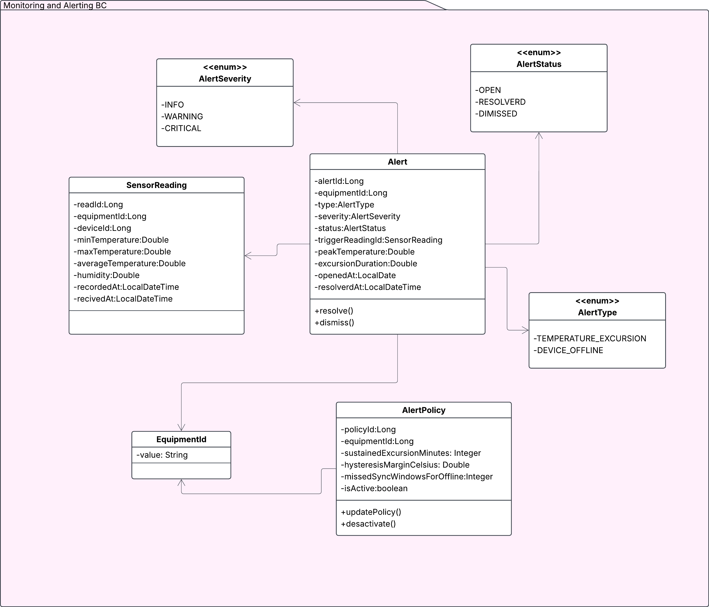

##### 4.2.3.6.2. Bounded Context Database Design Diagram.

El siguiente diagrama presenta el diseño de la base de datos del esquema `monitoring`. La tabla `SensorReadings` conserva el histórico de lecturas de cada equipo y dispositivo, la tabla `Alert` registra las alertas generadas con su severidad, estado y duración de la excursión, y la tabla `AlertPolicy` guarda las reglas de evaluación configuradas para cada equipo.

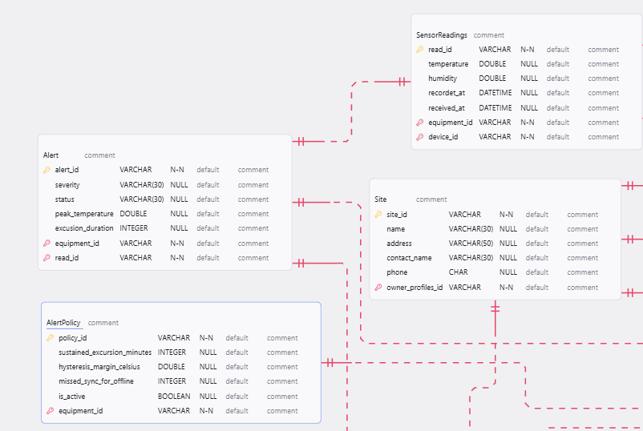

---

### 4.2.4. Bounded Context: Assets Management

En el bounded context Assets Management administramos las sedes de cada dueño de negocio y el catálogo de equipos de refrigeración instalados en ellas, incluyendo el umbral de temperatura y el intervalo de mantenimiento preventivo de cada equipo. Es la base física del dominio IoT: los contextos de Device Management, Monitoring and Alerting y Service Request Management se apoyan en este contexto para identificar y validar los equipos.

#### 4.2.4.1. Domain Layer.

La Domain Layer del bounded context **Assets Management** contiene el modelo de la base física del negocio: las sedes donde opera cada dueño y los equipos de refrigeración instalados en ellas. Es el contexto que define la identidad, la pertenencia y el umbral de temperatura de cada equipo, por lo que los demás contextos lo consultan para identificar y validar los activos. Su modelo está organizado en dos aggregates: **Site**, que representa una sede, y **Equipment**, que representa un equipo de refrigeración. Ambos se asocian al dueño mediante su perfil, sin depender del modelo interno de otros contextos.

**Aggregate Roots**

| Clase | Categoría | Descripción |
| :--- | :--- | :--- |
| `Site` | Aggregate Root | Representa una sede o establecimiento del dueño. Guarda su nombre, su dirección y sus datos de contacto. |
| `Equipment` | Aggregate Root | Representa un equipo de refrigeración instalado en una sede. Controla su identidad, su tipo, su estado, su umbral de temperatura y su intervalo de mantenimiento preventivo. |

Atributos de `Site`:

| Atributo | Tipo | Descripción |
| :--- | :--- | :--- |
| `id` | `UUID` | Identificador único de la sede. |
| `ownerId` | `UUID` | Perfil del dueño al que pertenece la sede (referencia a Profiles). |
| `name` | `String` | Nombre de la sede. |
| `address` | `Address` (Value Object) | Dirección de la sede. |
| `contactName` | `String` | Nombre de la persona de contacto de la sede. |
| `phone` | `Phone` (Value Object) | Teléfono de contacto de la sede. |

Atributos de `Equipment`:

| Atributo | Tipo | Descripción |
| :--- | :--- | :--- |
| `id` | `UUID` | Identificador único del equipo. |
| `siteId` | `UUID` | Sede donde está instalado el equipo. |
| `uid` | `String` | Identificador propio del equipo. |
| `name` | `String` | Nombre asignado al equipo. |
| `equipmentType` | `EquipmentType` | Tipo de equipo (por ejemplo, congeladora, vitrina o cámara). |
| `status` | `StatusEquipment` | Estado operativo actual del equipo. |
| `online` | `Boolean` | Indica si el equipo está conectado. |
| `temperatureThreshold` | `TemperatureThreshold` | Umbral de temperatura mínima y máxima permitido para el equipo. |
| `reminderIntervalDays` | `Integer` | Intervalo, en días, del mantenimiento preventivo. |
| `lastReadingAt` | `DateTime` | Fecha y hora de la última lectura recibida del equipo. |
| `lastKnownTemperature` | `Double` | Última temperatura conocida del equipo. |

**Value Objects y enumeraciones**

| Clase | Descripción |
| :--- | :--- |
| `TemperatureThreshold` | Value Object que agrupa la temperatura mínima y máxima permitidas. Garantiza que el mínimo sea menor que el máximo. |
| `EquipmentType` | Enum con el tipo de equipo de refrigeración. |
| `StatusEquipment` | Enum con los estados operativos del equipo. |
| `Address` | Dirección de la sede. |
| `Phone` | Teléfono de contacto de la sede. |

**Commands y Queries del dominio**

| Clase | Categoría | Descripción |
| :--- | :--- | :--- |
| `RegisterSiteCommand` | Command (record) | Registra una nueva sede. |
| `UpdateSiteInfoCommand` | Command (record) | Actualiza los datos de una sede. |
| `RegisterEquipmentCommand` | Command (record) | Registra un equipo en una sede. |
| `UpdateEquipmentCommand` | Command (record) | Actualiza los datos de un equipo. |
| `ChangeThresholdCommand` | Command (record) | Cambia el umbral de temperatura de un equipo. |
| `ChangeStatusCommand` | Command (record) | Cambia el estado de un equipo. |
| `GetSitesByOwnerQuery` | Query (record) | Lista las sedes de un dueño. |
| `GetSiteByIdQuery` | Query (record) | Obtiene una sede por su identificador. |
| `GetEquipmentByIdQuery` | Query (record) | Obtiene un equipo por su identificador. |
| `GetEquipmentBySiteQuery` | Query (record) | Lista los equipos de una sede. |
| `GetEquipmentByOwnerQuery` | Query (record) | Lista los equipos de un dueño. |

**Domain Services (interfaces)**

| Interfaz | Descripción |
| :--- | :--- |
| `SiteCommandService` | Contrato de las operaciones que registran y actualizan sedes. |
| `SiteQueryService` | Contrato de las consultas de sedes. |
| `EquipmentCommandService` | Contrato de las operaciones que registran equipos, cambian su umbral y sus estados. |
| `EquipmentQueryService` | Contrato de las consultas y filtros de equipos. |

**Repositories (interfaces)**

| Interfaz | Descripción |
| :--- | :--- |
| `SiteRepository` | Abstracción de persistencia del aggregate `Site`. |
| `EquipmentRepository` | Abstracción de persistencia del aggregate `Equipment`. |

**Domain Events**

| Evento | Descripción |
| :--- | :--- |
| `Sitio Creado` | Se emite cuando se registra una nueva sede. |
| `Equipo Registrado` | Se emite cuando se registra un equipo en una sede. |
| `Umbral de Temperatura Actualizado` | Se emite cuando cambia el umbral de temperatura de un equipo. |

**Reglas de negocio del dominio**

- Cada sede pertenece a un único dueño, identificado por su perfil.
- Cada equipo pertenece a una sola sede y, por lo tanto, a un único dueño.
- El umbral de temperatura de un equipo debe tener un mínimo menor que el máximo.
- Cada equipo define su propio intervalo de mantenimiento preventivo.
- El umbral de cada equipo se define y se modifica solo en este contexto. Monitoring and Alerting lo consulta para evaluar las alertas.

#### 4.2.4.2. Interface Layer.

La Interface Layer expone las capacidades del contexto hacia el exterior. Recibe las solicitudes HTTP que el **API Gateway** enruta después de validar el JWT y publica una fachada para que otros contextos consulten la identidad, la pertenencia y el umbral de temperatura de los equipos. Se organiza en los subpaquetes `controllers`, `resources`, `assemblers` y `acl`.

**Controllers**

| Clase | Descripción |
| :--- | :--- |
| `SiteController` | Controlador REST del *Site Endpoint* (GET, POST, PUT). Gestiona el registro y el listado de sedes. Cubre la historia US-20 (registrar nuevos sitios). Depende de los servicios de comandos y consultas de sedes. |
| `EquipmentController` | Controlador REST del *Equipment Endpoint* (GET, POST, PUT). Gestiona el registro, la actualización, la configuración de umbrales y el listado de equipos. Cubre las historias US-03 (gestión de equipos), US-11 (equipos asignados a clientes) y US-18 (consulta de equipos registrados). Depende de `EquipmentCommandService` y `EquipmentQueryService`. |

Método principal:

| Clase | Método | Descripción |
| :--- | :--- | :--- |
| `EquipmentController` | `register(req: RegisterEquipmentRequest): ResponseEntity<EquipmentResponse>` | Recibe los datos del equipo, los convierte en un `RegisterEquipmentCommand`, invoca al servicio de comandos y devuelve el equipo registrado. |

**Resources (records)**

| Clase | Descripción |
| :--- | :--- |
| `RegisterEquipmentRequest` | Datos de entrada para registrar un equipo (sede, nombre, tipo, umbral e intervalo de mantenimiento). |
| `EquipmentResponse` | Representación del equipo en las respuestas de la API. |

**Assemblers**

| Clase | Método | Descripción |
| :--- | :--- | :--- |
| `EquipmentAssembler` | `toResource(entity: Equipment): EquipmentResponse` | Convierte el aggregate `Equipment` en el recurso de respuesta. |
| `EquipmentAssembler` | `toCommand(req: RegisterEquipmentRequest): RegisterEquipmentCommand` | Transforma el recurso de registro en el comando del dominio. |

**ACL / Facade (inbound services)**

| Clase | Descripción |
| :--- | :--- |
| `AssetContextFacade` | Fachada que expone a otros contextos la identidad del equipo, su pertenencia y su umbral de temperatura, sin revelar los aggregates internos. Depende de `EquipmentQueryService`. |

Método de `AssetContextFacade`:

| Método | Descripción |
| :--- | :--- |
| `getEquipmentThreshold(id: UUID): Optional<Double>` | Devuelve el umbral de temperatura configurado para el equipo indicado. |

Consumidores de la fachada:

| Contexto consumidor | Uso |
| :--- | :--- |
| Monitoring and Alerting | Recupera la identidad del equipo y su umbral de temperatura para evaluar las lecturas y generar alertas. |
| Device Management | Verifica que el equipo exista y pertenezca al dueño solicitante antes de emparejarlo con un dispositivo. |

#### 4.2.4.3. Application Layer.

La Application Layer orquesta los flujos del contexto. Recibe los comandos y consultas de la Interface Layer, coordina los aggregates y los repositorios, y delega las reglas de negocio en el dominio. Sus capabilities son **registrar y actualizar sedes, registrar y actualizar equipos, configurar el umbral de temperatura y el estado de cada equipo, y consultar sedes y equipos por dueño o por sede**.

**Command Services**

| Clase | Implementa | Descripción |
| :--- | :--- | :--- |
| `SiteCommandServiceImpl` | `SiteCommandService` | Ejecuta los procesos que registran y actualizan sedes. Depende de `SiteRepository`. |
| `EquipmentCommandServiceImpl` | `EquipmentCommandService` | Ejecuta los procesos que registran equipos y modifican su umbral y su estado. Depende de `EquipmentRepository`. |

Manejadores de comandos:

| Clase | Método | Flujo |
| :--- | :--- | :--- |
| `SiteCommandServiceImpl` | `handle(cmd: RegisterSiteCommand): Optional<Site>` | Crea el aggregate `Site` asociado al perfil del dueño, lo persiste y registra `Sitio Creado`. |
| `SiteCommandServiceImpl` | `handle(cmd: UpdateSiteInfoCommand)` | Busca la sede, actualiza sus datos de ubicación y contacto, y persiste el cambio. |
| `EquipmentCommandServiceImpl` | `handle(cmd: RegisterEquipmentCommand): Optional<Equipment>` | Crea el aggregate `Equipment` en la sede indicada, con su tipo, su umbral y su intervalo de mantenimiento. Lo persiste y registra `Equipo Registrado`. |
| `EquipmentCommandServiceImpl` | `handle(cmd: UpdateEquipmentCommand)` | Busca el equipo, actualiza sus datos y persiste el cambio. |
| `EquipmentCommandServiceImpl` | `handle(cmd: ChangeThresholdCommand)` | Cambia el umbral de temperatura del equipo y registra `Umbral de Temperatura Actualizado`. |
| `EquipmentCommandServiceImpl` | `handle(cmd: ChangeStatusCommand)` | Cambia el estado del equipo mediante las transiciones permitidas por el dominio. |

**Query Services**

| Clase | Implementa | Descripción |
| :--- | :--- | :--- |
| `SiteQueryServiceImpl` | `SiteQueryService` | Resuelve las consultas de sedes usando `SiteRepository`. |
| `EquipmentQueryServiceImpl` | `EquipmentQueryService` | Resuelve las consultas y filtros de equipos usando `EquipmentRepository`. |

Manejadores de consultas:

| Clase | Método | Descripción |
| :--- | :--- | :--- |
| `SiteQueryServiceImpl` | `handle(q: GetSitesByOwnerQuery)` | Devuelve las sedes de un dueño. |
| `SiteQueryServiceImpl` | `handle(q: GetSiteByIdQuery)` | Devuelve la sede que corresponde al identificador. |
| `EquipmentQueryServiceImpl` | `handle(q: GetEquipmentByIdQuery): Optional<Equipment>` | Devuelve el equipo que corresponde al identificador. |
| `EquipmentQueryServiceImpl` | `handle(q: GetEquipmentBySiteQuery)` | Devuelve los equipos de una sede. |
| `EquipmentQueryServiceImpl` | `handle(q: GetEquipmentByOwnerQuery)` | Devuelve los equipos de un dueño. |

**Flujos de integración**

| Flujo | Descripción |
| :--- | :--- |
| Registrar un equipo en un sitio | El dueño registra una sede y luego un equipo dentro de ella, con su tipo, umbral e intervalo de mantenimiento. Corresponde al Escenario 02 del Domain Message Flow. |
| Emparejamiento de dispositivo | Antes de emparejar una placa IoT, Device Management consulta la fachada para verificar que el equipo exista y pertenezca al dueño. |
| Evaluación de lecturas | Cuando Monitoring and Alerting recibe telemetría, consulta la fachada para obtener la identidad del equipo y su umbral de temperatura. |

Este contexto es Upstream de los demás. No depende de servicios externos de otros contextos para su operación.

#### 4.2.4.4. Infrastructure Layer.

La Infrastructure Layer contiene las clases que acceden a la base de datos. Implementa las abstracciones de repositorio definidas en el dominio, de modo que el modelo no dependa de una tecnología concreta.

**Persistencia (Repositories)**

| Clase | Implementa | Descripción |
| :--- | :--- | :--- |
| `SpringDataJpaSiteRepository` | `SiteRepository` | Implementación con Spring Data JPA del repositorio del aggregate `Site`. |
| `SpringDataJpaEquipmentRepository` | `EquipmentRepository` | Implementación con Spring Data JPA del repositorio del aggregate `Equipment`. |

Ambos repositorios operan sobre el esquema `assets` de la instancia **PostgreSQL v18** (*Platform Database*), que mantiene un esquema por bounded context.

Responsabilidades de los repositorios:

- Guardar, actualizar y consultar sedes por identificador y por dueño.
- Guardar, actualizar y consultar equipos por identificador, por sede y por dueño.
- Persistir el umbral de temperatura, el estado y el intervalo de mantenimiento de cada equipo.

**Modelo de tablas del esquema `assets`**

| Tabla | Columna | Tipo | Descripción |
| :--- | :--- | :--- | :--- |
| `Site` | `site_id` | `VARCHAR` (PK) | Identificador de la sede. |
| `Site` | `name` | `VARCHAR(30)` | Nombre de la sede. |
| `Site` | `address` | `VARCHAR(50)` | Dirección de la sede. |
| `Site` | `contact_name` | `VARCHAR(30)` | Persona de contacto. |
| `Site` | `phone` | `CHAR` | Teléfono de contacto. |
| `Site` | `owner_profiles_id` | `VARCHAR` (FK) | Perfil del dueño de la sede. |
| `Equipment` | `equipment_id` | `VARCHAR` (PK) | Identificador del equipo. |
| `Equipment` | `equipment_uid` | `VARCHAR(30)` | Identificador propio del equipo. |
| `Equipment` | `name` | `VARCHAR(30)` | Nombre del equipo. |
| `Equipment` | `status` | `VARCHAR(50)` | Estado operativo. |
| `Equipment` | `equipment_type` | `VARCHAR(35)` | Tipo de equipo. |
| `Equipment` | `online` | `BOOLEAN` | Indica si el equipo está conectado. |
| `Equipment` | `reminder_interval_days` | `INTEGER` | Intervalo de mantenimiento preventivo, en días. |
| `Equipment` | `threshold_min_celsius` | `DOUBLE` | Temperatura mínima permitida. |
| `Equipment` | `threshold_max_celsius` | `DOUBLE` | Temperatura máxima permitida. |
| `Equipment` | `last_reading_at` | `DATETIME` | Fecha de la última lectura recibida. |
| `Equipment` | `last_known_temperature` | `DATETIME` | Última temperatura conocida. |
| `Equipment` | `site_id` | `VARCHAR` (FK) | Sede donde está instalado el equipo. |

**Resumen de dependencias externas**

| Recurso | Tipo | Uso en Assets Management |
| :--- | :--- | :--- |
| PostgreSQL v18 (esquema `assets`) | Base de datos relacional | Persistencia de sedes y equipos. |
| Profiles and Preferences Management | Bounded context interno (Upstream) | Origen del perfil del dueño al que pertenecen las sedes. |
| Monitoring and Alerting | Bounded context interno (consumidor) | Consulta la identidad y el umbral de temperatura de los equipos. |
| Device Management | Bounded context interno (consumidor) | Verifica la existencia y la pertenencia del equipo antes del emparejamiento. |

#### 4.2.4.5. Bounded Context Software Architecture Component Level Diagrams.

En el siguiente diagrama de componentes mostramos cómo organizamos el contexto Assets Management. Se observan el controlador que recibe las solicitudes desde el API Gateway, los servicios de comandos y consultas de sedes y equipos, sus aggregates y repositorios, y la fachada que expone los datos de los equipos a los demás contextos. También se muestra la relación con el esquema `assets` de la base de datos.

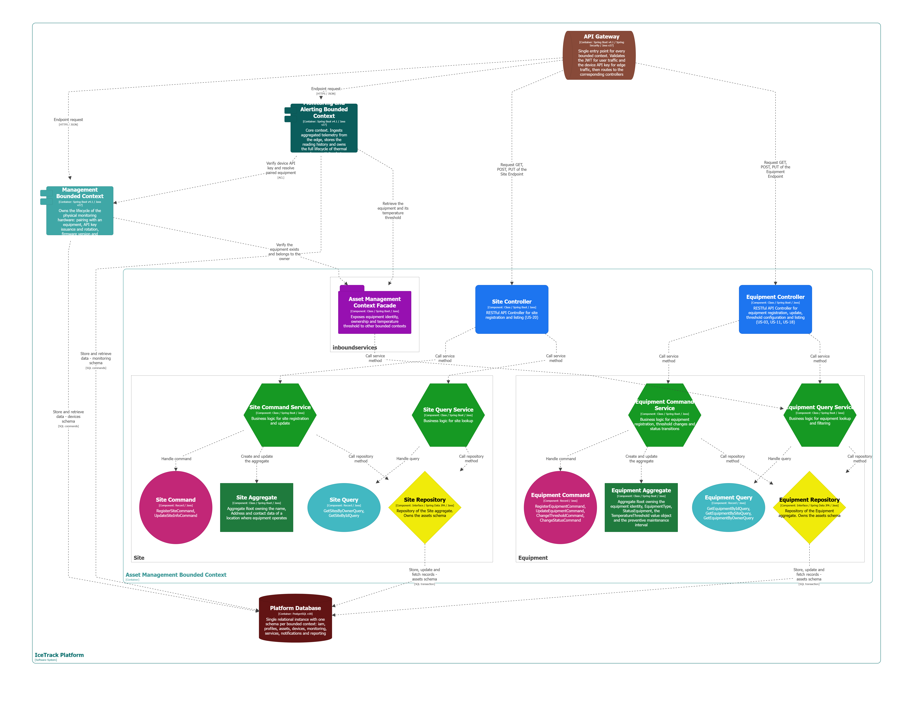

#### 4.2.4.6. Bounded Context Software Architecture Code Level Diagrams.

En esta sección presentamos los diagramas de nivel de código del bounded context Assets Management: el diagrama de clases de la capa de dominio y el diseño de la base de datos del esquema `assets`.

##### 4.2.4.6.1. Bounded Context Domain Layer Class Diagrams.

El siguiente diagrama de clases representa el modelo de este contexto y su distribución en capas. Incluye los aggregates de sedes y equipos con sus reglas de negocio, las interfaces de servicios y repositorios del dominio, los servicios de la capa de aplicación, los controladores y la fachada de la capa de interfaces, y los repositorios JPA de la capa de infraestructura.

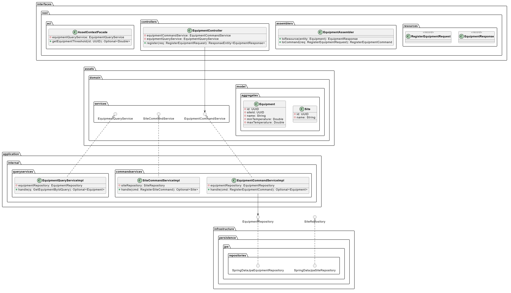

##### 4.2.4.6.2. Bounded Context Database Design Diagram.

El siguiente diagrama presenta el diseño de la base de datos del esquema `assets`. Las sedes se asocian al perfil del dueño con sus datos de ubicación y contacto, y los equipos se vinculan a una sede y almacenan su umbral de temperatura y su intervalo de mantenimiento.

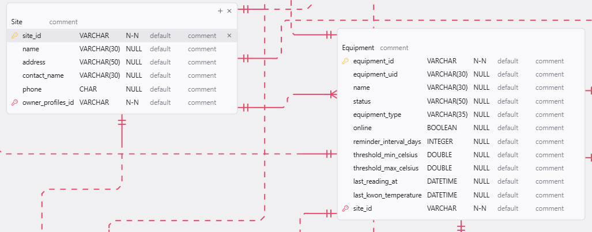

---

### 4.2.5. Bounded Context: Device Management

En el bounded context Device Management administramos el ciclo de vida del hardware físico de monitoreo, es decir, las placas IoT ESP32. Esto comprende su registro, su emparejamiento con un equipo de refrigeración, la rotación de sus credenciales de acceso y su baja. Otros contextos, en especial Monitoring and Alerting, consultan este contexto para verificar la API key de cada dispositivo antes de aceptar su telemetría.

#### 4.2.5.1. Domain Layer.

La Domain Layer del bounded context **Device Management** contiene el modelo del hardware físico de monitoreo (las placas IoT ESP32). Gestiona su ciclo de vida: registro, emparejamiento con un equipo de refrigeración, rotación de credenciales de acceso y baja. Su modelo gira en torno a un único aggregate, **Device**, que garantiza que cada dispositivo tenga una identidad, una credencial segura y, como máximo, un equipo asociado.

**Aggregate Root**

| Clase | Categoría | Descripción |
| :--- | :--- | :--- |
| `Device` | Aggregate Root / Entity | Representa una placa IoT física. Controla su emparejamiento, su API key y sus transiciones de estado, y es la única vía para modificar esos datos. |

Atributos de `Device`:

| Atributo | Tipo | Descripción |
| :--- | :--- | :--- |
| `id` | `UUID` | Identificador único del dispositivo dentro de la plataforma. |
| `serialNumber` (`device_uid`) | `String` | Identificador físico del dispositivo, grabado en la placa. |
| `boardModel` | `String` | Modelo de la placa (por ejemplo, ESP32). |
| `firmwareVersion` | `String` | Versión del firmware instalado en el dispositivo. |
| `apiKeyHash` | `String` | Hash de la API key con la que el dispositivo se autentica. La clave nunca se almacena en texto plano. |
| `status` | `DeviceStatus` | Estado operativo actual del dispositivo. |
| `lastRead` | `DateTime` | Fecha y hora de la última lectura recibida del dispositivo. |
| `pairedEquipmentId` | `UUID` | Equipo de refrigeración con el que está emparejado (referencia al contexto Assets Management). |

**Value Objects y enumeraciones**

| Clase | Descripción |
| :--- | :--- |
| `DeviceStatus` | Enum con los estados del ciclo de vida del dispositivo. |
| `ApiKey` | Credencial de acceso del dispositivo. Se entrega una sola vez, en texto plano, en el momento de emitirla o rotarla, y después solo se conserva su hash. |
| `EquipmentId` | Referencia tipada al equipo con el que se empareja el dispositivo. |

**Commands y Queries del dominio**

| Clase | Categoría | Descripción |
| :--- | :--- | :--- |
| `PairDeviceCommand` | Command (record) | Empareja un dispositivo con un equipo de refrigeración. |
| `UnpairDeviceCommand` | Command (record) | Desvincula un dispositivo de su equipo. |
| `RotateApiKeyCommand` | Command (record) | Emite una nueva API key e invalida la anterior. |
| `ChangeDeviceStatusCommand` | Command (record) | Cambia el estado del dispositivo, incluida su baja. |
| `GetDeviceByIdQuery` | Query (record) | Obtiene un dispositivo por su identificador. |
| `GetDeviceByApiKeyQuery` | Query (record) | Obtiene el dispositivo que corresponde a una API key. |
| `GetDevicesByEquipmentQuery` | Query (record) | Lista los dispositivos emparejados con un equipo. |

**Domain Services (interfaces)**

| Interfaz | Descripción |
| :--- | :--- |
| `DeviceCommandService` | Contrato de las operaciones que cambian el estado: emparejar, desemparejar, rotar credencial y cambiar estado. |
| `DeviceQueryService` | Contrato de las consultas de dispositivos y de verificación de credenciales. |

**Repositories (interfaces)**

| Interfaz | Descripción |
| :--- | :--- |
| `DeviceRepository` | Abstracción de persistencia del aggregate `Device`. El dominio solo conoce esta interfaz. Su implementación pertenece a la Infrastructure Layer. |

**Domain Events**

| Evento | Descripción |
| :--- | :--- |
| `Dispositivo Registrado` | Se emite cuando un dispositivo se da de alta en la plataforma. |
| `Dispositivo Emparejado` | Se emite cuando un dispositivo queda vinculado a un equipo. |
| `Dispositivo Dado de Baja` | Se emite cuando un dispositivo se retira de la plataforma. |

**Reglas de negocio del dominio**

- Cada dispositivo se autentica con una API key, y de ella se guarda únicamente el hash.
- Un dispositivo se empareja con un equipo. Antes de emparejarlo, el equipo debe existir y pertenecer al dueño que lo solicita.
- Al rotar la API key, la credencial anterior deja de ser válida.
- Un dispositivo dado de baja no puede autenticarse ni enviar telemetría.

#### 4.2.5.2. Interface Layer.

La Interface Layer expone las capacidades del contexto. Recibe las solicitudes HTTP que el **API Gateway** enruta hacia el *Device Endpoint* (GET, POST, PUT) y publica una fachada para que otros contextos verifiquen credenciales de dispositivos. Se organiza en los subpaquetes `controllers`, `resources`, `assemblers` y `acl`.

**Controllers**

| Clase | Descripción |
| :--- | :--- |
| `DeviceController` | Controlador REST para el emparejamiento y desemparejamiento de dispositivos y la rotación de su API key. Cubre las historias US-03 (gestión de equipos con su identificador de dispositivo) y US-26 (programación del ESP32 para enviar telemetría). Depende de `DeviceCommandService` y `DeviceQueryService`. |

Método principal:

| Método | Descripción |
| :--- | :--- |
| `pair(req: PairDeviceRequest): ResponseEntity<DeviceResponse>` | Recibe la solicitud de emparejamiento, la convierte en un `PairDeviceCommand`, la delega al servicio de comandos y devuelve el dispositivo emparejado. |

**Resources (records)**

| Clase | Descripción |
| :--- | :--- |
| `PairDeviceRequest` | Datos de entrada para emparejar un dispositivo con un equipo. |
| `DeviceResponse` | Representación del dispositivo en las respuestas de la API. No expone el hash de la API key. |

**Assemblers**

| Clase | Método | Descripción |
| :--- | :--- | :--- |
| `DeviceAssembler` | `toResource(d: Device): DeviceResponse` | Convierte el aggregate `Device` en el recurso de respuesta. |
| `DeviceAssembler` | `toCommand(r: PairDeviceRequest): PairDeviceCommand` | Transforma el recurso de emparejamiento en el comando del dominio. |

**ACL / Facade (inbound services)**

| Clase | Descripción |
| :--- | :--- |
| `DeviceContextFacade` | Fachada que expone a otros contextos la verificación de la API key y la resolución del dispositivo hacia su equipo, sin revelar el aggregate `Device`. Depende de `DeviceQueryService`. |

Método de `DeviceContextFacade`:

| Método | Descripción |
| :--- | :--- |
| `verifyApiKey(key: String): Optional<UUID>` | Verifica la API key recibida y devuelve el identificador asociado. Si la clave no es válida, devuelve un resultado vacío. |

Consumidor de la fachada:

| Contexto consumidor | Uso |
| :--- | :--- |
| Monitoring and Alerting | Verifica la API key del dispositivo y resuelve el equipo emparejado antes de aceptar la telemetría. |

#### 4.2.5.3. Application Layer.

La Application Layer orquesta los flujos del contexto. Recibe los comandos y consultas de la Interface Layer, coordina el aggregate `Device`, el repositorio y los servicios externos, y delega las reglas de negocio en el dominio. Sus capabilities son **registrar y emparejar dispositivos, rotar credenciales, cambiar el estado o dar de baja un dispositivo, y verificar credenciales**.

**Command Services**

| Clase | Implementa | Descripción |
| :--- | :--- | :--- |
| `DeviceCommandServiceImpl` | `DeviceCommandService` | Ejecuta los procesos que modifican el estado de los dispositivos. Depende de `DeviceRepository` y del servicio externo de activos. |

Manejadores de comandos:

| Método | Flujo |
| :--- | :--- |
| `handle(cmd: PairDeviceCommand): Optional<Device>` | 1) Consulta a Assets Management, mediante el ACL, que el equipo exista y pertenezca al dueño solicitante. 2) Emite la API key del dispositivo y guarda su hash. 3) Asocia el `pairedEquipmentId` al aggregate `Device`. 4) Persiste el dispositivo. 5) Registra el evento `Dispositivo Emparejado`. |
| `handle(cmd: UnpairDeviceCommand)` | Desvincula el dispositivo de su equipo y persiste el cambio. |
| `handle(cmd: RotateApiKeyCommand)` | Genera una nueva API key, reemplaza el hash almacenado e invalida la credencial anterior. |
| `handle(cmd: ChangeDeviceStatusCommand)` | Cambia el estado del dispositivo. Si se trata de una baja, registra `Dispositivo Dado de Baja`. |

**Query Services**

| Clase | Implementa | Descripción |
| :--- | :--- | :--- |
| `DeviceQueryServiceImpl` | `DeviceQueryService` | Resuelve las consultas de lectura sobre dispositivos usando `DeviceRepository`. |

Manejadores de consultas:

| Método | Descripción |
| :--- | :--- |
| `handle(q: GetDeviceByIdQuery)` | Devuelve el dispositivo que corresponde al identificador. |
| `handle(q: GetDeviceByApiKeyQuery): Optional<Device>` | Devuelve el dispositivo cuya API key coincide con la recibida. Es la consulta que usa `DeviceContextFacade`. |
| `handle(q: GetDevicesByEquipmentQuery)` | Devuelve los dispositivos emparejados con un equipo. |

**Outbound Services (ACL)**

| Clase | Contexto destino | Descripción |
| :--- | :--- | :--- |
| `ExternalAssetServiceFromDevice` | Assets Management | Anti-Corruption Layer que verifica que el equipo exista y pertenezca al dueño solicitante antes del emparejamiento. |

**Método del ACL:**

| Método | Descripción |
| :--- | :--- |
| `checkEquipment(id: UUID): boolean` | Indica si el equipo existe y puede emparejarse con el dispositivo. |

**Flujo de integración**

| Flujo | Descripción |
| :--- | :--- |
| Emparejar dispositivo IoT a un equipo | El dueño solicita el emparejamiento. Device Management consulta a Assets Management si el equipo es válido, genera la credencial del dispositivo y registra el vínculo. Corresponde al Escenario 05 del Domain Message Flow. |
| Verificación de telemetría | Cuando el dispositivo envía lecturas, Monitoring and Alerting consulta la fachada de este contexto para validar la API key y resolver el equipo antes de procesar los datos. |

#### 4.2.5.4. Infrastructure Layer.

La Infrastructure Layer contiene las clases que acceden a la base de datos. Implementa la abstracción de repositorio definida en el dominio, de modo que el modelo no dependa de una tecnología concreta.

**Persistencia (Repositories)**

| Clase | Implementa | Descripción |
| :--- | :--- | :--- |
| `SpringDataJpaDeviceRepository` | `DeviceRepository` | Implementación con Spring Data JPA del repositorio del aggregate `Device`. Opera sobre el esquema `devices` de la instancia **PostgreSQL v18** (*Platform Database*), que mantiene un esquema por bounded context. |

Responsabilidades del repositorio:

- Guardar, actualizar y consultar dispositivos.
- Buscar un dispositivo por identificador y por hash de API key.
- Listar los dispositivos emparejados con un equipo.

**Modelo de tabla del esquema `devices`**

| Tabla | Columna | Tipo | Descripción |
| :--- | :--- | :--- | :--- |
| `Device` | `device_id` | `VARCHAR` (PK) | Identificador del dispositivo. |
| `Device` | `device_uid` | `VARCHAR(10)` | Identificador físico grabado en la placa. |
| `Device` | `board_model` | `VARCHAR(30)` | Modelo de la placa. |
| `Device` | `firmware_version` | `VARCHAR(30)` | Versión del firmware. |
| `Device` | `api_hash` | `VARCHAR(30)` | Hash de la API key. |
| `Device` | `status` | `VARCHAR(35)` | Estado del dispositivo. |
| `Device` | `last_read` | `VARCHAR(25)` | Fecha de la última lectura recibida. |
| `Device` | `equipment_id` | `VARCHAR` (FK) | Equipo con el que está emparejado. |

**Adaptador hacia otro contexto**

| Clase | Descripción |
| :--- | :--- |
| Adaptador de `ExternalAssetServiceFromDevice` | Comunicación con Assets Management para verificar la existencia y la pertenencia del equipo antes de emparejar. |

**Resumen de dependencias externas**

| Recurso | Tipo | Uso en Device Management |
| :--- | :--- | :--- |
| PostgreSQL v18 (esquema `devices`) | Base de datos relacional | Persistencia de los dispositivos. |
| Assets Management | Bounded context interno | Verificación del equipo antes del emparejamiento. |
| Monitoring and Alerting | Bounded context interno (consumidor) | Verifica la API key y resuelve el equipo de cada dispositivo. |

#### 4.2.5.5. Bounded Context Software Architecture Component Level Diagrams.

En el siguiente diagrama de componentes mostramos cómo organizamos el contexto Device Management. Se observan el Device Controller que atiende el emparejamiento, el desemparejamiento y la rotación de la API key, los servicios de comandos y consultas, el aggregate `Device` con su repositorio y la fachada que usa Monitoring and Alerting para verificar credenciales. También se muestra la capa anticorrupción hacia Assets Management, que valida el equipo antes de emparejarlo, y el esquema `devices` de la base de datos.

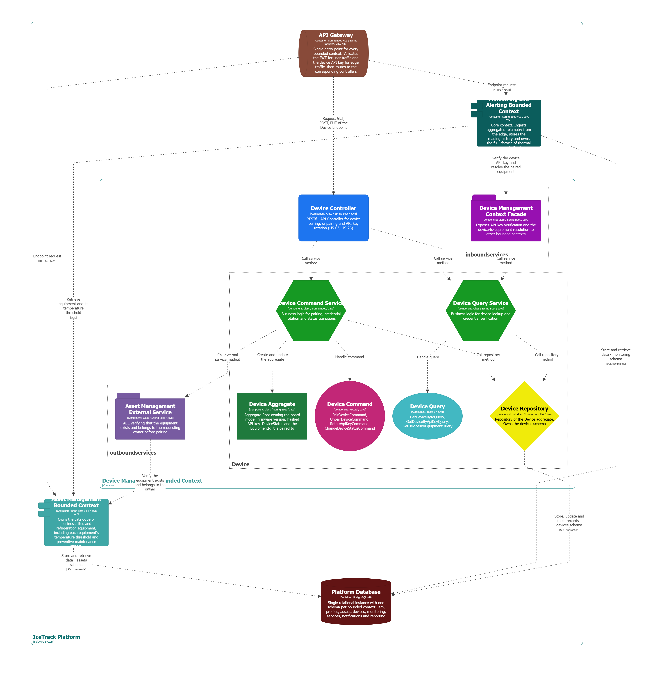

#### 4.2.5.6. Bounded Context Software Architecture Code Level Diagrams.

En esta sección presentamos los diagramas de nivel de código del bounded context Device Management: el diagrama de clases de la capa de dominio y el diseño de la base de datos del esquema `devices`.

##### 4.2.5.6.1. Bounded Context Domain Layer Class Diagrams.

El siguiente diagrama de clases representa la estructura del contexto organizada por capas. En el dominio se encuentra el aggregate `Device` junto con las interfaces de servicios, y en la capa de aplicación los servicios de comandos y consultas y el servicio externo hacia Assets Management. En la capa de interfaces se ubican el controlador, el assembler, los recursos y la fachada, y en infraestructura la implementación JPA del repositorio.


##### 4.2.5.6.2. Bounded Context Database Design Diagram.

El siguiente diagrama presenta el diseño de la base de datos del esquema `devices`. La tabla `Device` almacena la identificación física de cada placa, su modelo, la versión de firmware, el hash de su API key, su estado, la fecha de la última lectura y el equipo con el que está emparejada.


---

### 4.2.6. Bounded Context: Service Request Management

En el bounded context Service Request Management gestionamos el ciclo de vida completo de una solicitud de mantenimiento: su creación por el dueño, su aceptación o rechazo por el proveedor, la asignación de un técnico, el registro de las intervenciones en campo y su finalización. También incluye la evaluación que el dueño realiza del servicio recibido. Junto con Monitoring and Alerting, es uno de los dos núcleos operativos de IceTrack.

#### 4.2.6.1. Domain Layer.

La Domain Layer del bounded context **Service Request Management** contiene el modelo del segundo núcleo operativo de IceTrack: el ciclo de vida de una solicitud de mantenimiento y la calificación del servicio recibido. El dueño crea la solicitud, el proveedor la acepta o rechaza, se asigna un técnico, el técnico registra sus intervenciones en campo y la solicitud se completa. Luego el dueño evalúa el servicio. El modelo se organiza en tres subdominios, cada uno con su propio aggregate: **ServiceRequest**, **Intervention** y **Review**.

**Aggregate Roots**

| Clase | Categoría | Descripción |
| :--- | :--- | :--- |
| `ServiceRequest` | Aggregate Root | Representa una solicitud de mantenimiento o reparación sobre un equipo. Controla su máquina de estados, el técnico asignado y el historial de estados. |
| `Intervention` | Aggregate Root | Representa una intervención técnica realizada en campo para atender una solicitud. Registra el técnico, el periodo de ejecución y el resumen de hallazgos. |
| `Review` | Aggregate Root | Representa la evaluación que el dueño hace de un servicio completado. Solo puede editarse durante una ventana de tiempo limitada. |

Atributos de `ServiceRequest`:

| Atributo | Tipo | Descripción |
| :--- | :--- | :--- |
| `id` | `UUID` | Identificador único de la solicitud. |
| `equipmentId` | `UUID` | Equipo sobre el que se solicita el servicio (referencia a Assets Management). |
| `ownerId` | `UUID` | Perfil del dueño que crea la solicitud (referencia a Profiles). |
| `siteId` | `UUID` | Sede donde se encuentra el equipo. |
| `technicianId` | `UUID` | Técnico asignado. Es nulo hasta que el proveedor lo asigna. |
| `origin` | `String` | Origen de la solicitud. |
| `type` | `ServiceType` | Tipo de servicio (mantenimiento preventivo o reparación correctiva). |
| `priority` | `ServicePriority` | Prioridad de la solicitud. |
| `description` | `String` | Detalle del problema o del servicio requerido. |
| `status` | `ServiceRequestStatus` | Estado actual dentro de la máquina de estados. |
| `completedAt` | `DateTime` | Fecha de finalización. |
| `canceledAt` | `DateTime` | Fecha de cancelación. |

Atributos de `Intervention`:

| Atributo | Tipo | Descripción |
| :--- | :--- | :--- |
| `id` | `UUID` | Identificador de la intervención. |
| `requestId` | `UUID` | Solicitud que atiende. |
| `technicianId` | `UUID` | Técnico que realiza la intervención. |
| `status` | `InterventionStatus` | Estado de la intervención. |
| `summary` | `String` | Resumen de hallazgos y acciones realizadas. |
| `startTime` | `DateTime` | Inicio de la intervención. |
| `endTime` | `DateTime` | Fin de la intervención. |

Atributos de `Review`:

| Atributo | Tipo | Descripción |
| :--- | :--- | :--- |
| `id` | `UUID` | Identificador de la evaluación. |
| `requestId` | `UUID` | Solicitud evaluada. |
| `ownerId` | `UUID` | Dueño que evalúa. |
| `technicianId` | `UUID` | Técnico evaluado. |
| `rating` | `ReviewRating` | Calificación en comunicación, eficacia y desempeño. |
| `comment` | `String` | Comentario libre del dueño. |
| `editableUntil` | `DateTime` | Fecha límite para editar la evaluación (48 horas). |

**Value Objects y enumeraciones**

| Clase | Descripción |
| :--- | :--- |
| `ServiceRequestStatus` | Enum con la máquina de estados de la solicitud: `PENDING`, `ACCEPTED`, `REJECTED`, `IN_PROGRESS`, `CANCELED` y `COMPLETED`. |
| `ServiceType` | Tipo de servicio solicitado (preventivo o correctivo). |
| `ServicePriority` | Prioridad de atención de la solicitud. |
| `InterventionStatus` | Estado de una intervención técnica. |
| `ReviewRating` | Value Object que agrupa las calificaciones de comunicación, eficacia y desempeño. |

**Commands y Queries del dominio**

| Clase | Categoría | Descripción |
| :--- | :--- | :--- |
| `CreateRequestCommand` | Command (record) | Crea una solicitud de servicio. |
| `AcceptRequestCommand` | Command (record) | El proveedor acepta la solicitud. |
| `RejectRequestCommand` | Command (record) | El proveedor rechaza la solicitud. |
| `CancelRequestCommand` | Command (record) | Cancela la solicitud. |
| `AssignTechnicianCommand` | Command (record) | Asigna un técnico a la solicitud. |
| `StartInterventionCommand` | Command (record) | Registra el inicio de una intervención. |
| `CompleteInterventionCommand` | Command (record) | Registra la finalización de una intervención y cierra la solicitud. |
| `SubmitReviewCommand` | Command (record) | Envía la evaluación de un servicio completado. |
| `UpdateReviewCommand` | Command (record) | Edita una evaluación dentro de su ventana de edición. |
| `GetRequestByIdQuery` | Query (record) | Obtiene una solicitud por su identificador. |
| `GetRequestsByOwnerQuery` | Query (record) | Lista las solicitudes de un dueño. |
| `GetRequestsByTechnicianQuery` | Query (record) | Lista las solicitudes asignadas a un técnico. |
| `GetRequestsByStatusQuery` | Query (record) | Lista las solicitudes según su estado. |
| `GetInterventionsByRequestQuery` | Query (record) | Lista las intervenciones de una solicitud. |
| `GetInterventionsByTechnicianQuery` | Query (record) | Lista las intervenciones de un técnico. |
| `GetReviewByRequestQuery` | Query (record) | Obtiene la evaluación de una solicitud. |
| `GetAverageRatingByTechnicianQuery` | Query (record) | Calcula el promedio de calificaciones de un técnico. |

**Domain Services (interfaces)**

| Interfaz | Descripción |
| :--- | :--- |
| `TechnicianAssignmentService` | Domain Service que resuelve los técnicos candidatos para una solicitud según su especialidad y disponibilidad. |
| `ServiceRequestCommandService` | Contrato de las operaciones que modifican el ciclo de vida de una solicitud. |
| `ServiceRequestQueryService` | Contrato de las consultas, el seguimiento y el filtrado de solicitudes. |
| `InterventionCommandService` | Contrato del registro de intervenciones y del cierre de la solicitud padre. |
| `InterventionQueryService` | Contrato de las consultas de intervenciones. |
| `ReviewCommandService` | Contrato del envío y la edición de evaluaciones. |
| `ReviewQueryService` | Contrato de las consultas de evaluaciones y promedios de calificación. |

**Repositories (interfaces)**

| Interfaz | Descripción |
| :--- | :--- |
| `ServiceRequestRepository` | Abstracción de persistencia del aggregate `ServiceRequest`. |
| `InterventionRepository` | Abstracción de persistencia del aggregate `Intervention`. |
| `ReviewRepository` | Abstracción de persistencia del aggregate `Review`. |

**Domain Events**

| Evento | Descripción |
| :--- | :--- |
| `Solicitud Creada` | Se emite cuando se registra una nueva solicitud de servicio. |
| `Solicitud Completada` | Se emite cuando la solicitud finaliza tras completarse la intervención. |
| `Reseña Creada` | Se emite cuando el dueño envía la evaluación del servicio. |

**Reglas de negocio del dominio**

- La solicitud sigue una máquina de estados: `PENDING`, `ACCEPTED`, `REJECTED`, `IN_PROGRESS`, `CANCELED` y `COMPLETED`. No se permiten transiciones fuera de ese flujo.
- El dueño crea la solicitud y el proveedor la acepta o la rechaza. Solo una solicitud aceptada puede tener un técnico asignado.
- El técnico se asigna según su especialidad y disponibilidad.
- Al completarse la intervención, la solicitud padre pasa a `COMPLETED`.
- El dueño solo puede evaluar un servicio ya completado, y solo puede editar su evaluación durante las 48 horas posteriores a enviarla.

#### 4.2.6.2. Interface Layer.

La Interface Layer expone las capacidades del contexto hacia el exterior. Recibe las solicitudes HTTP que el **API Gateway** enruta después de validar el JWT, y publica una fachada para que otros contextos lean solicitudes, intervenciones y evaluaciones. Cada subdominio tiene su propio controlador.

**Controllers**

| Clase | Descripción |
| :--- | :--- |
| `ServiceRequestController` | Controlador REST del *Service Request Endpoint* (GET, POST, PUT). Gestiona la creación, el seguimiento, la aceptación, el rechazo, la cancelación y la asignación de técnico. Cubre US-04, US-05, US-21, TS-01 y TS-05. Depende de `ServiceRequestCommandService` y `ServiceRequestQueryService`. |
| `InterventionController` | Controlador REST del *Intervention Endpoint* (GET, POST). Gestiona el inicio y la finalización de intervenciones técnicas. Cubre TS-02. |
| `ReviewController` | Controlador REST del *Review Endpoint* (GET, POST, PUT). Gestiona el envío y la edición de evaluaciones. Cubre US-12 y TS-03. |

**Método principal:**

| Clase | Método | Descripción |
| :--- | :--- | :--- |
| `ServiceRequestController` | `create(req: CreateRequestResource): ResponseEntity<ServiceResponse>` | Recibe los datos de la solicitud, los convierte en un `CreateRequestCommand`, invoca al servicio de comandos y devuelve la solicitud creada. |

**Resources (records)**

| Clase | Descripción |
| :--- | :--- |
| `CreateRequestResource` | Datos de entrada para crear una solicitud de servicio (equipo, tipo, prioridad y descripción). |
| `ServiceResponse` | Representación de una solicitud en las respuestas de la API. |

**ACL / Facade (inbound services)**

| Clase | Descripción |
| :--- | :--- |
| `ServiceRequestContextFacade` | Fachada que expone a otros contextos los datos de solicitudes, intervenciones y evaluaciones, sin revelar los aggregates internos. Depende de `ServiceRequestQueryService`. |

**Consumidor de la fachada:**

| Contexto consumidor | Uso |
| :--- | :--- |
| Reporting and Analytics | Lee solicitudes, intervenciones y evaluaciones para calcular el cumplimiento de mantenimiento y el desempeño de los técnicos. |

#### 4.2.6.3. Application Layer.
La Application Layer orquesta los flujos del contexto. Recibe los comandos y consultas de la Interface Layer, coordina los aggregates, los repositorios y los servicios externos, y delega las reglas de negocio en el dominio. Sus capabilities son **crear y gestionar solicitudes, asignar técnicos, registrar intervenciones en campo, completar el servicio, y recibir y consultar evaluaciones**.

**Command Services**

| Clase | Implementa | Descripción |
| :--- | :--- | :--- |
| `ServiceRequestCommandServiceImpl` | `ServiceRequestCommandService` | Gestiona el ciclo de vida de la solicitud y sus transiciones de estado. Depende de `ServiceRequestRepository`, `TechnicianAssignmentService` y los servicios externos. |
| `InterventionCommandServiceImpl` | `InterventionCommandService` | Registra las intervenciones y cierra la solicitud padre al completarlas. Depende de `InterventionRepository`. |
| `ReviewCommandServiceImpl` | `ReviewCommandService` | Gestiona el envío de evaluaciones y su edición dentro de la ventana permitida. Depende de `ReviewRepository`. |

**Manejadores de comandos:**

| Clase | Método | Flujo |
| :--- | :--- | :--- |
| `ServiceRequestCommandServiceImpl` | `handle(cmd: CreateRequestCommand): Optional<ServiceRequest>` | 1) Crea el aggregate `ServiceRequest` en estado `PENDING`. 2) Lo persiste. 3) Registra `Solicitud Creada`. 4) Solicita la notificación mediante Notification Management. Si la solicitud es correctiva, puede precargarse con el contexto de la alerta desde Monitoring and Alerting (US-29). |
| `ServiceRequestCommandServiceImpl` | `handle(cmd: AcceptRequestCommand / RejectRequestCommand)` | El proveedor acepta o rechaza la solicitud y el aggregate cambia de estado. |
| `ServiceRequestCommandServiceImpl` | `handle(cmd: AssignTechnicianCommand)` | Resuelve los candidatos con `TechnicianAssignmentService`, asigna el técnico, persiste el cambio y notifica la asignación. |
| `ServiceRequestCommandServiceImpl` | `handle(cmd: CancelRequestCommand)` | Cancela la solicitud y registra la fecha de cancelación. |
| `InterventionCommandServiceImpl` | `handle(cmd: StartInterventionCommand)` | Crea la intervención, registra la hora de inicio y pasa la solicitud a `IN_PROGRESS`. |
| `InterventionCommandServiceImpl` | `handle(cmd: CompleteInterventionCommand): void` | Registra el fin, el resumen de hallazgos y el estado de la intervención, y cierra la solicitud padre como `COMPLETED`. Registra `Solicitud Completada` y solicita la notificación. |
| `ReviewCommandServiceImpl` | `handle(cmd: SubmitReviewCommand)` | Verifica que la solicitud esté completada, crea la evaluación con su fecha límite de edición y registra `Reseña Creada`. |
| `ReviewCommandServiceImpl` | `handle(cmd: UpdateReviewCommand)` | Permite editar la evaluación solo si sigue dentro de las 48 horas. |

**Query Services**

| Clase | Implementa | Descripción |
| :--- | :--- | :--- |
| `ServiceRequestQueryServiceImpl` | `ServiceRequestQueryService` | Resuelve las consultas, el seguimiento y el filtrado de solicitudes. |
| `InterventionQueryServiceImpl` | `InterventionQueryService` | Resuelve las consultas de intervenciones por solicitud o por técnico. |
| `ReviewQueryServiceImpl` | `ReviewQueryService` | Resuelve las consultas de evaluaciones y el promedio de calificación de un técnico. |

**Manejadores de consultas:**

| Clase | Método | Descripción |
| :--- | :--- | :--- |
| `ServiceRequestQueryServiceImpl` | `handle(q: GetRequestByIdQuery)` | Devuelve la solicitud que corresponde al identificador. |
| `ServiceRequestQueryServiceImpl` | `handle(q: GetRequestsByOwnerQuery / GetRequestsByTechnicianQuery / GetRequestsByStatusQuery)` | Devuelve las solicitudes de un dueño, de un técnico o en un estado determinado. |
| `InterventionQueryServiceImpl` | `handle(q: GetInterventionsByRequestQuery / GetInterventionsByTechnicianQuery)` | Devuelve las intervenciones de una solicitud o de un técnico. |
| `ReviewQueryServiceImpl` | `handle(q: GetReviewByRequestQuery)` | Devuelve la evaluación de una solicitud. |
| `ReviewQueryServiceImpl` | `handle(q: GetAverageRatingByTechnicianQuery)` | Devuelve el promedio de calificaciones de un técnico. |

**Outbound Services (ACL)**

| Clase | Contexto destino | Descripción |
| :--- | :--- | :--- |
| `MonitoringExternalService` | Monitoring and Alerting | ACL que recupera el contexto de la alerta y del equipo para precargar una orden de trabajo correctiva (US-29). |
| `ProfilesExternalService` | Profiles and Preferences Management | ACL que consulta la especialidad y la disponibilidad de los técnicos para la asignación. |
| `NotificationExternalService` | Notification Management | ACL que solicita el envío de notificaciones cuando una solicitud se crea, se asigna o se completa. |

**Flujos de integración**

| Flujo | Descripción |
| :--- | :--- |
| Crear solicitud referenciando un equipo | El dueño crea la solicitud sobre un equipo. El contexto la registra en estado `PENDING` y notifica al proveedor. Corresponde al Escenario 03 del Domain Message Flow. |
| Asignación de técnico | Al asignar, el contexto consulta a Profiles por especialidad y disponibilidad, y notifica al técnico. |
| Cierre del servicio | Al completarse la intervención, la solicitud pasa a `COMPLETED`, se notifica al dueño y queda habilitada la evaluación. |
| Indicadores de desempeño | Reporting and Analytics consulta las solicitudes, intervenciones y evaluaciones mediante la fachada. |

#### 4.2.6.4. Infrastructure Layer.

La Infrastructure Layer contiene las clases que acceden a la base de datos. Implementa los repositorios definidos en el dominio, de modo que el modelo no dependa de una tecnología concreta.

**Persistencia (Repositories)**

| Clase | Implementa | Descripción |
| :--- | :--- | :--- |
| `SpringDataJpaServiceRequestRepository` | `ServiceRequestRepository` | Implementación con Spring Data JPA del repositorio del aggregate `ServiceRequest`. |
| `SpringDataJpaInterventionRepository` | `InterventionRepository` | Implementación con Spring Data JPA del repositorio del aggregate `Intervention`. |
| `SpringDataJpaReviewRepository` | `ReviewRepository` | Implementación con Spring Data JPA del repositorio del aggregate `Review`. |

Los tres repositorios operan sobre el esquema `services` de la instancia **PostgreSQL v18** (*Platform Database*), que mantiene un esquema por bounded context.

Responsabilidades de los repositorios:

- Guardar, actualizar y consultar solicitudes por identificador, dueño, técnico y estado.
- Guardar intervenciones y consultarlas por solicitud o por técnico.
- Guardar evaluaciones y consultarlas por solicitud, además de calcular el promedio de calificación por técnico.

**Modelo de tablas del esquema `services`**

| Tabla | Columna | Tipo | Descripción |
| :--- | :--- | :--- | :--- |
| `ServiceRequest` | `request_id` | `VARCHAR` (PK) | Identificador de la solicitud. |
| `ServiceRequest` | `origin` | `VARCHAR(25)` | Origen de la solicitud. |
| `ServiceRequest` | `type` | `VARCHAR(35)` | Tipo de servicio. |
| `ServiceRequest` | `priority` | `VARCHAR(35)` | Prioridad. |
| `ServiceRequest` | `description` | `VARCHAR(50)` | Descripción del problema. |
| `ServiceRequest` | `status` | `VARCHAR(40)` | Estado de la solicitud. |
| `ServiceRequest` | `completed_at` | `DATETIME` | Fecha de finalización. |
| `ServiceRequest` | `canceled_at` | `DATETIME` | Fecha de cancelación. |
| `ServiceRequest` | `owner_profiles_id` | `VARCHAR` (FK) | Perfil del dueño. |
| `ServiceRequest` | `user_id` | `VARCHAR` (FK) | Usuario asociado. |
| `ServiceRequest` | `site_id` | `VARCHAR` (FK) | Sede del equipo. |
| `ServiceRequest` | `equipment_id` | `VARCHAR` (FK) | Equipo del servicio. |
| `ServiceRequest` | `user_profiles_id` | `VARCHAR` (FK) | Perfil asociado al servicio. |
| `Intervention` | `intervention_id` | `VARCHAR` (PK) | Identificador de la intervención. |
| `Intervention` | `status` | `VARCHAR(30)` | Estado de la intervención. |
| `Intervention` | `summary` | `VARCHAR(50)` | Resumen de hallazgos. |
| `Intervention` | `start_time` | `DATETIME` | Inicio. |
| `Intervention` | `end_time` | `DATETIME` | Fin. |
| `Intervention` | `request_id` | `VARCHAR` (FK) | Solicitud atendida. |
| `Intervention` | `technician_profiles_id` | `VARCHAR` (FK) | Técnico que interviene. |
| `Review` | `review_id` | `VARCHAR` (PK) | Identificador de la evaluación. |
| `Review` | `rating_comunication` | `INTEGER` | Calificación de comunicación. |
| `Review` | `rating_eficacy` | `INTEGER` | Calificación de eficacia. |
| `Review` | `performance` | `VARCHAR(40)` | Calificación de desempeño. |
| `Review` | `comment` | `VARCHAR(50)` | Comentario del dueño. |
| `Review` | `request_id` | `VARCHAR` (FK) | Solicitud evaluada. |
| `Review` | `owner_profiles_id` | `VARCHAR` (FK) | Dueño que evalúa. |
| `Review` | `technician_profiles_id` | `VARCHAR` (FK) | Técnico evaluado. |

**Adaptadores hacia otros contextos**

| Clase | Descripción |
| :--- | :--- |
| Adaptador de `MonitoringExternalService` | Comunicación con Monitoring and Alerting para obtener el contexto de la alerta. |
| Adaptador de `ProfilesExternalService` | Comunicación con Profiles para consultar la especialidad y la disponibilidad de los técnicos. |
| Adaptador de `NotificationExternalService` | Comunicación con Notification Management para solicitar el envío de notificaciones. |

**Resumen de dependencias externas**

| Recurso | Tipo | Uso en Service Request Management |
| :--- | :--- | :--- |
| PostgreSQL v18 (esquema `services`) | Base de datos relacional | Persistencia de solicitudes, intervenciones y evaluaciones. |
| Monitoring and Alerting | Bounded context interno | Contexto de la alerta para precargar solicitudes correctivas. |
| Profiles and Preferences Management | Bounded context interno | Especialidad y disponibilidad de los técnicos. |
| Notification Management | Bounded context interno | Notificaciones de creación, asignación y finalización. |
| Reporting and Analytics | Bounded context interno (consumidor) | Lectura de solicitudes, intervenciones y evaluaciones. |

#### 4.2.6.5. Bounded Context Software Architecture Component Level Diagrams.

En el siguiente diagrama de componentes mostramos cómo organizamos el contexto en tres subdominios: ServiceRequest, Intervention y Review. Cada uno cuenta con su controlador, sus servicios de comandos y consultas, su aggregate y su repositorio. Se incluye el servicio de dominio que resuelve los técnicos candidatos a una asignación, la fachada que consume Reporting and Analytics, las capas anticorrupción hacia Monitoring, Profiles y Notification, y el esquema `services` de la base de datos.


#### 4.2.6.6. Bounded Context Software Architecture Code Level Diagrams.

En esta sección presentamos los diagramas de nivel de código del bounded context Service Request Management: el diagrama de clases de la capa de dominio y el diseño de la base de datos del esquema `services`.

##### 4.2.6.6.1. Bounded Context Domain Layer Class Diagrams.

El siguiente diagrama de clases representa la estructura del contexto organizada por capas. Incluye el aggregate de la solicitud de servicio, las interfaces de los servicios de solicitudes e intervenciones, el servicio de asignación de técnicos, los servicios de comandos de la capa de aplicación, el controlador, los recursos y la fachada de la capa de interfaces, y los repositorios JPA de la capa de infraestructura.


##### 4.2.6.6.2. Bounded Context Database Design Diagram.

El siguiente diagrama presenta el diseño de la base de datos del esquema `services`. La tabla `ServiceRequest` guarda las solicitudes con su tipo, prioridad, estado y fechas, la tabla `Intervention` registra las intervenciones realizadas por los técnicos, y la tabla `Review` almacena las evaluaciones de los dueños sobre cada servicio.


---

### 4.2.7. Bounded Context: Notification Management

En el bounded context Notification Management generamos y gestionamos las notificaciones dirigidas a cada usuario, ya sea por un mantenimiento vencido, una alerta de monitoreo o una actualización de una solicitud de servicio. Es un contexto genérico de soporte: no decide cuándo notificar, sino que actúa cuando otro contexto se lo solicita mediante su fachada, resolviendo quién debe recibir el mensaje y en qué idioma.

#### 4.2.7.1. Domain Layer.

La Domain Layer del bounded context **Notification Management** contiene el modelo de las notificaciones que la plataforma envía a sus usuarios. Es un contexto genérico de soporte: convierte los eventos que ocurren en otros contextos (alertas de monitoreo, cambios en solicitudes de servicio, mantenimientos vencidos) en mensajes dirigidos a un destinatario concreto, con un canal y un estado de entrega. Su modelo se centra en un único aggregate, **Notification**, y en un domain service que determina a quién debe notificarse cada evento.

**Aggregate Root**

| Clase | Categoría | Descripción |
| :--- | :--- | :--- |
| `Notification` | Aggregate Root / Entity | Representa un mensaje dirigido a un usuario. Controla su estado de lectura, su descarte y su estado de entrega. |

Atributos de `Notification`:

| Atributo | Tipo | Descripción |
| :--- | :--- | :--- |
| `id` | `UUID` | Identificador único de la notificación. |
| `userId` | `UUID` | Destinatario de la notificación (referencia al usuario de IAM). |
| `message` | `String` | Mensaje localizado que se muestra al destinatario. |
| `type` | `NotificationType` | Tipo de notificación (mantenimiento vencido, alerta de monitoreo o actualización de una solicitud). |
| `severity` | `NotificationSeverity` | Nivel de severidad de la notificación. |
| `channel` | `String` | Canal por el que se entrega la notificación. |
| `deliveryStatus` | `String` | Estado de entrega de la notificación. |
| `isRead` | `Boolean` | Indica si el destinatario ya la leyó. |
| `dismissedAt` | `DateTime` | Fecha y hora en que el destinatario la descartó. |
| `equipmentId` | `UUID` | Equipo relacionado con el evento que originó la notificación. |
| `deviceId` | `UUID` | Dispositivo relacionado, cuando el evento proviene de telemetría. |
| `alertId` | `UUID` | Alerta relacionada, cuando la notificación se origina en Monitoring and Alerting. |

**Value Objects y enumeraciones**

| Clase | Descripción |
| :--- | :--- |
| `NotificationType` | Enum con el tipo de notificación: mantenimiento vencido, alerta de monitoreo o actualización de solicitud de servicio. |
| `NotificationSeverity` | Enum con el nivel de severidad de la notificación. |
| `Recipient` | Value Object que identifica al destinatario, con sus datos de contacto y su idioma. |

**Commands y Queries del dominio**

| Clase | Categoría | Descripción |
| :--- | :--- | :--- |
| `CreateNotificationCommand` | Command (record) | Solicita la creación de una notificación a partir de un evento de otro contexto. |
| `MarkAsReadCommand` | Command (record) | Marca una notificación como leída. |
| `DismissCommand` | Command (record) | Descarta una notificación. |
| `GetUserNotificationsQuery` | Query (record) | Lista las notificaciones de un usuario. |
| `GetUnreadCountQuery` | Query (record) | Obtiene la cantidad de notificaciones no leídas de un usuario. |

**Domain Services**

| Clase | Categoría | Descripción |
| :--- | :--- | :--- |
| `RecipientResolver` | Domain Service | Determina quién debe ser notificado ante un evento dado: el dueño del equipo, el técnico asignado o ambos. |
| `NotificationCommandService` | Interfaz | Contrato de las operaciones que crean y modifican notificaciones. |
| `NotificationQueryService` | Interfaz | Contrato de las consultas de notificaciones y del contador de no leídas. |

**Repositories (interfaces)**

| Interfaz | Descripción |
| :--- | :--- |
| `NotificationRepository` | Abstracción de persistencia del aggregate `Notification`. El dominio solo conoce esta interfaz. Su implementación pertenece a la Infrastructure Layer. |

**Domain Events**

| Evento | Descripción |
| :--- | :--- |
| `Notificación Generada` | Se emite cuando se crea una notificación para un destinatario. |
| `Notificación Leída` | Se emite cuando el destinatario marca la notificación como leída. |
| `Notificación Descartada` | Se emite cuando el destinatario descarta la notificación. |

**Reglas de negocio del dominio**

- Una notificación pertenece a un único destinatario.
- Los destinatarios de un evento los determina `RecipientResolver`: el dueño del equipo, el técnico asignado o ambos, según el evento.
- El mensaje se construye en el idioma del destinatario, con base en las preferencias de su perfil.
- Una notificación puede leerse y descartarse por el destinatario, y guarda la fecha de descarte.
- Este contexto no decide cuándo se debe notificar. Solo actúa cuando otro contexto se lo solicita.

#### 4.2.7.2. Interface Layer.

La Interface Layer expone las capacidades del contexto hacia el exterior. Recibe las solicitudes HTTP que el **API Gateway** enruta hacia el *Notification Endpoint* (GET, PUT) y publica una fachada para que los demás contextos soliciten notificaciones sin conocer los detalles del canal ni de la entrega.

**Controllers**

| Clase | Descripción |
| :--- | :--- |
| `NotificationController` | Controlador REST que permite al usuario listar sus notificaciones, marcarlas como leídas y descartarlas. Depende de `NotificationCommandService` y `NotificationQueryService`. |

**Método principal:**

| Método | Descripción |
| :--- | :--- |
| `markAsRead(id: UUID): ResponseEntity<Void>` | Convierte la solicitud en un `MarkAsReadCommand` y lo delega al servicio de comandos. |

**Resources (records)**

| Clase | Descripción |
| :--- | :--- |
| `NotificationResponse` | Representación de una notificación en las respuestas de la API (mensaje, tipo, severidad, estado de lectura). |

**ACL / Facade (inbound services)**

| Clase | Descripción |
| :--- | :--- |
| `NotificationContextFacade` | Fachada que expone a los demás contextos la creación de notificaciones, ocultando el canal y los detalles de entrega. Depende de `NotificationCommandService`. |

Método de `NotificationContextFacade`:

| Método | Descripción |
| :--- | :--- |
| `dispatch(userId: UUID, msg: String): void` | Solicita el envío de una notificación al usuario indicado. |

**Consumidores de la fachada:**

| Contexto consumidor | Evento que origina la notificación |
| :--- | :--- |
| Monitoring and Alerting | Excursión térmica o dispositivo sin señal. |
| Service Request Management | Solicitud creada, técnico asignado o servicio completado. |
| Reporting and Analytics | Reporte listo para el usuario que lo solicitó. |

#### 4.2.7.3. Application Layer.

La Application Layer orquesta los flujos del contexto. Recibe los comandos y consultas de la Interface Layer y de la fachada, coordina el aggregate `Notification`, el repositorio y los servicios externos, y delega las reglas de negocio en el dominio. Sus capabilities son **crear notificaciones a partir de eventos de otros contextos, resolver a sus destinatarios, y permitir su consulta, lectura y descarte**.

**Command Services**

| Clase | Implementa | Descripción |
| :--- | :--- | :--- |
| `NotificationCommandServiceImpl` | `NotificationCommandService` | Construye el mensaje localizado, resuelve los destinatarios y registra el resultado de la entrega. Depende de `NotificationRepository`. |

Manejadores de comandos:

| Método | Flujo |
| :--- | :--- |
| `handle(cmd: CreateNotificationCommand): void` | 1) Recibe el evento de otro contexto a través de la fachada. 2) Usa `RecipientResolver` para determinar los destinatarios. 3) Consulta a Profiles los datos de contacto y el idioma de cada destinatario. 4) Construye el mensaje localizado. 5) Crea y persiste una `Notification` por destinatario. 6) Registra `Notificación Generada` y el resultado de la entrega. |
| `handle(cmd: MarkAsReadCommand): void` | Busca la notificación, la marca como leída, persiste el cambio y registra `Notificación Leída`. |
| `handle(cmd: DismissCommand)` | Descarta la notificación, registra la fecha de descarte y emite `Notificación Descartada`. |

**Query Services**

| Clase | Implementa | Descripción |
| :--- | :--- | :--- |
| `NotificationQueryServiceImpl` | `NotificationQueryService` | Resuelve las consultas de notificaciones usando `NotificationRepository`. |

Manejadores de consultas:

| Método | Descripción |
| :--- | :--- |
| `handle(q: GetUserNotificationsQuery): List<Notification>` | Devuelve las notificaciones de un usuario. |
| `handle(q: GetUnreadCountQuery)` | Devuelve la cantidad de notificaciones no leídas de un usuario, útil para el indicador del dashboard. |

**Outbound Services (ACL)**

| Clase | Contexto destino | Descripción |
| :--- | :--- | :--- |
| `ProfilesExternalService` | Profiles and Preferences Management | ACL que resuelve los datos de contacto y el idioma de cada destinatario. |

**Flujos de integración**

| Flujo | Descripción |
| :--- | :--- |
| Alerta de monitoreo | Cuando Monitoring and Alerting detecta una excursión térmica o un dispositivo sin señal, solicita la notificación mediante la fachada. Este contexto resuelve los destinatarios y la crea. |
| Actualización de solicitud de servicio | Cuando una solicitud se crea, se asigna a un técnico o se completa, Service Request Management solicita la notificación al dueño, al técnico o a ambos. |
| Reporte listo | Cuando Reporting and Analytics termina un reporte, solicita notificar al usuario que lo pidió. |
| Mantenimiento vencido | Cuando un equipo supera su intervalo de mantenimiento configurado, se genera una notificación que el dueño puede consultar y descartar. |

#### 4.2.7.4. Infrastructure Layer.

La Infrastructure Layer contiene las clases que acceden a la base de datos y a otros contextos. Implementa la abstracción de repositorio definida en el dominio, de modo que el modelo no dependa de una tecnología concreta.

**Persistencia (Repositories)**

| Clase | Implementa | Descripción |
| :--- | :--- | :--- |
| `SpringDataJpaNotificationRepository` | `NotificationRepository` | Implementación con Spring Data JPA del repositorio del aggregate `Notification`. Opera sobre el esquema `notifications` de la instancia **PostgreSQL v18** (*Platform Database*), que mantiene un esquema por bounded context. |

Responsabilidades del repositorio:

- Guardar y actualizar notificaciones.
- Consultar las notificaciones de un usuario.
- Contar las notificaciones no leídas de un usuario.

**Modelo de tabla del esquema `notifications`**

| Tabla | Columna | Tipo | Descripción |
| :--- | :--- | :--- | :--- |
| `Notification` | `notification_id` | `VARCHAR` (PK) | Identificador de la notificación. |
| `Notification` | `message` | `VARCHAR(50)` | Mensaje mostrado al destinatario. |
| `Notification` | `type` | `VARCHAR(40)` | Tipo de notificación. |
| `Notification` | `severity` | `VARCHAR(40)` | Severidad. |
| `Notification` | `is_read` | `BOOLEAN` | Indica si fue leída. |
| `Notification` | `dismissed_at` | `DATETIME` | Fecha de descarte. |
| `Notification` | `user_id` | `VARCHAR` (FK) | Destinatario. |
| `Notification` | `equipment_id` | `VARCHAR` (FK) | Equipo relacionado. |
| `Notification` | `device_id` | `VARCHAR` (FK) | Dispositivo relacionado. |
| `Notification` | `alert_id` | `VARCHAR` (FK) | Alerta relacionada. |

**Adaptador hacia otro contexto**

| Clase | Descripción |
| :--- | :--- |
| Adaptador de `ProfilesExternalService` | Comunicación con Profiles para obtener los datos de contacto y el idioma del destinatario. |

**Resumen de dependencias externas**

| Recurso | Tipo | Uso en Notification Management |
| :--- | :--- | :--- |
| PostgreSQL v18 (esquema `notifications`) | Base de datos relacional | Persistencia de las notificaciones. |
| Profiles and Preferences Management | Bounded context interno | Datos de contacto e idioma de los destinatarios. |
| Monitoring and Alerting, Service Request Management y Reporting and Analytics | Bounded contexts internos (consumidores) | Solicitan la creación de notificaciones mediante la fachada. |

#### 4.2.7.5. Bounded Context Software Architecture Component Level Diagrams.

En el siguiente diagrama de componentes mostramos cómo organizamos el contexto Notification Management. Se observan el Notification Controller que permite consultar, leer y descartar notificaciones, la fachada que reciben Monitoring, Service Request y Reporting, los servicios de comandos y consultas, el aggregate `Notification` con su repositorio y el servicio de dominio que resuelve a los destinatarios. También se muestra la capa anticorrupción hacia Profiles and Preferences y el esquema `notifications` de la base de datos.


#### 4.2.7.6. Bounded Context Software Architecture Code Level Diagrams.

En esta sección presentamos los diagramas de nivel de código del bounded context Notification Management: el diagrama de clases de la capa de dominio y el diseño de la base de datos del esquema `notifications`.

##### 4.2.7.6.1. Bounded Context Domain Layer Class Diagrams.

El siguiente diagrama de clases representa la estructura del contexto organizada por capas. En el dominio se encuentra el aggregate `Notification` y las interfaces de los servicios de comandos y consultas. En la capa de aplicación se ubican sus implementaciones, en la capa de interfaces el controlador, el recurso de respuesta y la fachada del contexto, y en infraestructura la implementación JPA del repositorio.


##### 4.2.7.6.2. Bounded Context Database Design Diagram.

El siguiente diagrama presenta el diseño de la base de datos del esquema `notifications`. La tabla `Notification` almacena el mensaje, su tipo y severidad, su estado de lectura y de descarte, y las referencias al usuario destinatario y al equipo, dispositivo o alerta que originó la notificación.


---

### 4.2.8. Bounded Context: Reporting and Analytics

En el bounded context Reporting and Analytics calculamos indicadores de negocio a partir de la información de otros contextos: el cumplimiento del mantenimiento, el tiempo de actividad de los equipos, las excursiones de temperatura y el desempeño de los técnicos. Es un contexto de consumo, ya que no es dueño de los datos operativos, sino que los lee de Monitoring and Alerting y de Service Request Management para generar reportes de forma asíncrona.

#### 4.2.8.1. Domain Layer.

La Domain Layer del bounded context **Reporting and Analytics** contiene el modelo de los reportes que la plataforma genera para sus usuarios. Es un contexto de soporte y consumo: no es dueño de los datos operativos, sino que calcula indicadores de negocio a partir de la información de otros contextos (cumplimiento de mantenimiento, tiempo de actividad de los equipos y desempeño de los técnicos). Su modelo gira en torno a un único aggregate, **Report**, y a dos domain services: uno que elige la estrategia de generación según el tipo de reporte y otro que calcula los indicadores cuantitativos de la cadena de frío.

**Aggregate Root**

| Clase | Categoría | Descripción |
| :--- | :--- | :--- |
| `Report` | Aggregate Root | Representa una solicitud de reporte y su resultado. Controla su máquina de estados y la referencia al archivo generado. |

Atributos de `Report`:

| Atributo | Tipo | Descripción |
| :--- | :--- | :--- |
| `id` | `UUID` | Identificador único del reporte. |
| `type` | `ReportType` | Tipo de reporte solicitado. |
| `format` | `ReportFormat` | Formato de salida del reporte. |
| `filters` | `ReportFilters` | Filtros aplicados a la generación (equipo, sede, rango de fechas, entre otros). |
| `status` | `ReportStatus` | Estado actual dentro de la máquina de estados. |
| `url` | `String` | Referencia al archivo generado, disponible cuando el reporte se completa. |

**Value Objects y enumeraciones**

| Clase | Descripción |
| :--- | :--- |
| `ReportType` | Enum con los tipos de reporte: `MaintenanceCompliance`, `EquipmentUptime`, `TechnicianPerformance` y `TemperatureExcursion`. |
| `ReportFormat` | Formato de salida del reporte. |
| `ReportFilters` | Value Object que agrupa los criterios con los que se genera el reporte. |
| `ReportStatus` | Enum con los estados del reporte: `PENDING`, `GENERATING`, `COMPLETED` y `FAILED`. |

**Commands y Queries del dominio**

| Clase | Categoría | Descripción |
| :--- | :--- | :--- |
| `RequestReportCommand` | Command (record) | Solicita la generación de un reporte. |
| `MarkAsGeneratingCommand` | Command (record) | Marca el reporte como en proceso de generación. |
| `MarkAsCompletedCommand` | Command (record) | Marca el reporte como completado y registra la referencia al archivo generado. |
| `MarkAsFailedCommand` | Command (record) | Marca el reporte como fallido. |
| `GetReportByIdQuery` | Query (record) | Obtiene un reporte por su identificador. |
| `SearchReportsByFiltersQuery` | Query (record) | Busca reportes por nombre, tipo o estado. |
| `GetRecentReportsQuery` | Query (record) | Lista los reportes generados más recientemente. |

**Domain Services**

| Clase | Categoría | Descripción |
| :--- | :--- | :--- |
| `ReportGenerationStrategy` | Domain Service (interfaz, patrón Strategy) | Define cómo se genera cada tipo de reporte. Hay una estrategia por cada `ReportType`: `MaintenanceCompliance`, `EquipmentUptime`, `TechnicianPerformance` y `TemperatureExcursion`. |
| `ReportGenerationStrategyRegistry` | Domain Service | Selecciona la estrategia correspondiente al tipo de reporte solicitado. |
| `ColdChainMetricsCalculator` | Domain Service | Calcula los indicadores cuantitativos de la cadena de frío: temperatura cinética media (ponderada con Arrhenius), grados-minuto de excursión, porcentaje de tiempo de actividad, desviación estándar de la temperatura, tiempo medio de reparación (MTTR) y calificación promedio. |
| `ReportCommandService` | Interfaz | Contrato de las operaciones que solicitan y actualizan el estado de un reporte. |
| `ReportQueryService` | Interfaz | Contrato de las consultas, la búsqueda y la descarga de reportes. |

**Repositories (interfaces)**

| Interfaz | Descripción |
| :--- | :--- |
| `ReportRepository` | Abstracción de persistencia del aggregate `Report`. El dominio solo conoce esta interfaz. Su implementación pertenece a la Infrastructure Layer. |

**Domain Events**

| Evento | Descripción |
| :--- | :--- |
| `Reporte Generado` | Se emite cuando un reporte termina su generación y queda disponible para el usuario que lo solicitó. |

**Reglas de negocio del dominio**

- La generación de un reporte es asíncrona. El reporte recorre los estados `PENDING`, `GENERATING` y `COMPLETED`, o `FAILED` si la generación no puede completarse.
- La estrategia de generación se elige según el tipo de reporte solicitado.
- Los indicadores se calculan con datos provenientes de otros contextos, y este contexto no modifica esa información.
- Un reporte solo puede descargarse cuando su estado es `COMPLETED`.

#### 4.2.8.2. Interface Layer.

La Interface Layer expone las capacidades del contexto hacia el exterior. Recibe las solicitudes HTTP que el **API Gateway** enruta hacia el *Report Endpoint* (GET, POST) después de validar el JWT. Este contexto solo consume información de otros contextos, por lo que no publica fachada de entrada.

**Controllers**

| Clase | Descripción |
| :--- | :--- |
| `ReportController` | Controlador REST para solicitar reportes, buscarlos por nombre, tipo y estado, y descargarlos. Cubre las historias US-22 (buscar reportes por filtros) y US-24 (ver reporte de servicio realizado). Depende de `ReportCommandService` y `ReportQueryService`. |

Método principal:

| Método | Descripción |
| :--- | :--- |
| `generate(req: RequestReportResource): ResponseEntity<ReportResponse>` | Recibe la solicitud de reporte, la convierte en un `RequestReportCommand`, la delega al servicio de comandos y devuelve el reporte creado. |

**Resources (records)**

| Clase | Descripción |
| :--- | :--- |
| `RequestReportResource` | Datos de entrada para solicitar un reporte (tipo, formato y filtros). |
| `ReportResponse` | Representación del reporte en las respuestas de la API (tipo, estado y enlace de descarga). |

#### 4.2.8.3. Application Layer.

La Application Layer orquesta los flujos del contexto. Recibe los comandos y consultas de la Interface Layer, coordina el aggregate `Report`, el repositorio, las estrategias de generación y los servicios externos, y delega las reglas de negocio en el dominio. Sus capabilities son **solicitar y generar reportes de forma asíncrona, calcular indicadores de la cadena de frío, buscar y descargar reportes, y avisar al usuario cuando su reporte está listo**.

**Command Services**

| Clase | Implementa | Descripción |
| :--- | :--- | :--- |
| `ReportCommandServiceImpl` | `ReportCommandService` | Conduce la generación asíncrona del reporte a través de su máquina de estados. Depende de `ReportRepository` y de `ReportGenerationStrategyRegistry`. |

Manejadores de comandos:

| Método | Flujo |
| :--- | :--- |
| `handle(cmd: RequestReportCommand): Optional<Report>` | 1) Crea el aggregate `Report` en estado `PENDING` y lo persiste. 2) Selecciona la estrategia correspondiente al tipo mediante `ReportGenerationStrategyRegistry`. 3) Marca el reporte como `GENERATING`. 4) La estrategia solicita los datos a los contextos de origen y `ColdChainMetricsCalculator` calcula los indicadores. 5) Al terminar, marca el reporte como `COMPLETED` con la referencia al archivo generado, o como `FAILED` si ocurre un error. 6) Registra `Reporte Generado` y solicita la notificación al usuario. |
| `handle(cmd: MarkAsGeneratingCommand)` | Cambia el estado del reporte a `GENERATING`. |
| `handle(cmd: MarkAsCompletedCommand)` | Cambia el estado a `COMPLETED` y guarda la referencia al archivo generado. |
| `handle(cmd: MarkAsFailedCommand)` | Cambia el estado a `FAILED`. |

**Query Services**

| Clase | Implementa | Descripción |
| :--- | :--- | :--- |
| `ReportQueryServiceImpl` | `ReportQueryService` | Resuelve las consultas de reportes usando `ReportRepository`. |

Manejadores de consultas:

| Método | Descripción |
| :--- | :--- |
| `handle(q: GetReportByIdQuery): Optional<Report>` | Devuelve el reporte que corresponde al identificador. |
| `handle(q: SearchReportsByFiltersQuery)` | Busca reportes por nombre, tipo o estado. |
| `handle(q: GetRecentReportsQuery)` | Devuelve los reportes generados más recientemente. |

**Estrategias de generación**

| Tipo de reporte | Contexto de origen de los datos | Indicadores que calcula |
| :--- | :--- | :--- |
| `MaintenanceCompliance` | Service Request Management | Cumplimiento del mantenimiento programado. |
| `EquipmentUptime` | Monitoring and Alerting | Porcentaje de tiempo de actividad de los equipos. |
| `TechnicianPerformance` | Service Request Management | Tiempo medio de reparación (MTTR) y calificación promedio de los técnicos. |
| `TemperatureExcursion` | Monitoring and Alerting | Temperatura cinética media, grados-minuto de excursión y desviación estándar de la temperatura. |

**Outbound Services (ACL)**

| Clase | Contexto destino | Descripción |
| :--- | :--- | :--- |
| `ServiceRequestExternalService` | Service Request Management | ACL que lee solicitudes, intervenciones y evaluaciones, que alimentan los reportes de cumplimiento y de desempeño de técnicos. |
| `MonitoringExternalService` | Monitoring and Alerting | ACL que lee el historial de telemetría y los registros de alertas, que alimentan los reportes de temperatura y de tiempo de actividad. |
| `NotificationExternalService` | Notification Management | ACL que anuncia que el reporte está listo para el usuario que lo solicitó. |

**Flujo de integración**

| Flujo | Descripción |
| :--- | :--- |
| Generar reporte de cumplimiento | El usuario solicita un reporte. El contexto lo registra, elige la estrategia según el tipo, lee los datos de los contextos de origen, calcula los indicadores y guarda el resultado. Al finalizar, notifica al usuario. Corresponde al Escenario 04 del Domain Message Flow. |

#### 4.2.8.4. Infrastructure Layer.

La Infrastructure Layer contiene las clases que acceden a la base de datos y a los demás contextos. Implementa la abstracción de repositorio definida en el dominio, de modo que el modelo no dependa de una tecnología concreta.

**Persistencia (Repositories)**

| Clase | Implementa | Descripción |
| :--- | :--- | :--- |
| `SpringDataJpaReportRepository` | `ReportRepository` | Implementación con Spring Data JPA del repositorio del aggregate `Report`. Opera sobre el esquema `reporting` de la instancia **PostgreSQL v18** (*Platform Database*), que mantiene un esquema por bounded context. |

Responsabilidades del repositorio:

- Guardar y actualizar reportes, incluido su estado y la referencia al archivo generado.
- Consultar reportes por identificador.
- Buscar reportes por nombre, tipo y estado.
- Listar los reportes más recientes.

**Adaptadores hacia otros contextos**

| Clase | Descripción |
| :--- | :--- |
| Adaptador de `ServiceRequestExternalService` | Comunicación con Service Request Management para leer solicitudes, intervenciones y evaluaciones. |
| Adaptador de `MonitoringExternalService` | Comunicación con Monitoring and Alerting para leer el historial de telemetría y las alertas. |
| Adaptador de `NotificationExternalService` | Comunicación con Notification Management para solicitar el aviso de reporte listo. |

**Resumen de dependencias externas**

| Recurso | Tipo | Uso en Reporting and Analytics |
| :--- | :--- | :--- |
| PostgreSQL v18 (esquema `reporting`) | Base de datos relacional | Persistencia de los reportes. |
| Service Request Management | Bounded context interno (Upstream) | Solicitudes, intervenciones y evaluaciones. |
| Monitoring and Alerting | Bounded context interno (Upstream) | Historial de telemetría y alertas. |
| Notification Management | Bounded context interno | Aviso de reporte listo. |

#### 4.2.8.5. Bounded Context Software Architecture Component Level Diagrams.

En el siguiente diagrama de componentes mostramos cómo organizamos el contexto Reporting and Analytics. Se observan el Report Controller que atiende la solicitud, búsqueda y descarga de reportes, los servicios de comandos y consultas, el aggregate `Report` con su repositorio, la estrategia de generación seleccionada según el tipo de reporte y el calculador de indicadores de la cadena de frío. También se muestran las capas anticorrupción hacia Service Request, Monitoring y Notification, y el esquema `reporting` de la base de datos.


#### 4.2.8.6. Bounded Context Software Architecture Code Level Diagrams.

En esta sección presentamos los diagramas de nivel de código del bounded context Reporting and Analytics: el diagrama de clases de la capa de dominio y el diseño de la base de datos del esquema `reporting`.

##### 4.2.8.6.1. Bounded Context Domain Layer Class Diagrams.

El siguiente diagrama de clases representa la estructura del contexto organizada por capas. En el dominio se encuentra el aggregate `Report` y las interfaces de los servicios de comandos y consultas. En la capa de aplicación se ubican sus implementaciones junto con el registro de estrategias de generación, en la capa de interfaces el controlador y los recursos de solicitud y respuesta, y en infraestructura la implementación JPA del repositorio.


##### 4.2.8.6.2. Bounded Context Database Design Diagram.

El siguiente diagrama presenta el diseño de la base de datos del esquema `reporting`, donde persistimos los reportes solicitados por los usuarios junto con su tipo, su estado de generación y la referencia al archivo resultante.


# Capítulo V: Solution UI/UX Design

## 5.1. Style Guidelines
El diseño del logo de IceTrack busca transmitir los conceptos de protección, tecnología y monitoreo constante. Se eligió como elemento central un escudo estilizado con un copo de nieve integrado, simbolizando la protección de la cadena de frío. El escudo representa confianza y seguridad, mientras que el copo de nieve refleja el enfoque en la refrigeración. De manera complementaria, las líneas suaves y geométricas refuerzan la idea de precisión, estabilidad y eficiencia tecnológica.

### 5.1.1. General Style Guidelines
**Typography:** La tipografía del producto es *Roboto Serif*, en seis variantes (Regular 400, Medium 500, SemiBold 600, Bold 700, ExtraBold 800 e Italic), cargadas como fuentes propias de la aplicación. Dentro de esto se incluye todo los títulos, párrafos, etiquetas y datos técnicos. Esta decisión simplifica la carga de fuentes y mantiene coherencia visual en una sola familia, en lugar de combinar dos.

	
  - **Escala:**

  


  - **Weight:**
	
  
  
  - **Nomenclatura:**
	
  
  
  - **Example:**
  
  

  - **Colors:**

  


### 5.1.2. Web, Mobile and IoT Style Guidelines
Esta sección establece los estándares visuales e interactivos para los distintos canales digitales de IceTrack: la interfaz web de administración, la experiencia en dispositivos móviles, y los dispositivos IoT (placas ESP32 con sensores) instalados junto a cada equipo de refrigeración. Los tres comparten la misma identidad visual definida en los General Style Guidelines: la paleta de azules, rojo y Roboto Serif, pero cada canal tiene particularidades propias de interacción.

**Web Style Guide:**
Elegimos la paleta basada en azules, rojo, blanco y negro descrita en la sección anterior, porque queremos representar los valores de tecnología, confianza y alerta crítica. El azul oscuro (`#004AAD`) transmite estabilidad y profesionalismo, siendo el color principal de fondos y elementos de marca. El celeste (`#0C8DDF`) simboliza frescura, innovación y eficiencia, usado en botones y elementos interactivos. El rojo (`#FF5757`) se reserva exclusivamente para alertas y notificaciones, comunicando de manera inmediata fallas o eventos críticos en los equipos de refrigeración.

El uso balanceado de estos tonos asegura que la información clave sea rápidamente perceptible sin perder sobriedad visual.

- Componentes: menú lateral siempre visible a partir de 1025px, layout de 3 columnas en el dashboard y las secciones de métricas, tablas con jerarquía tipográfica clara para cabeceras, cards para resumir el estado de cada equipo o alerta.
- Autenticación: la pantalla de registro e inicio de sesión soporta dos vías credenciales locales (correo y contraseña) e **inicio de sesión federado con Google** —, ambas resultando en la selección explícita de un rol (Owner o Technician), ya que el sistema ya no contempla un rol intermedio de "empresa proveedora": cada técnico se registra directamente con su propia cuenta.
- Interactividad: hover con cambio de fondo a celeste (`#0C8DDF`) o sombra suave; transiciones de 200–300ms con curva ease-in-out; botones con bordes redondeados en 12px.
- Accesibilidad: navegación totalmente compatible con teclado (Tab, Enter, Esc); todo ícono con alternativa textual; contraste WCAG AA, validado en particular para el rojo de alerta sobre fondos claros.

**Mobile Style Guide:**
Al tratarse de la misma aplicación web en un viewport reducido, el Mobile Style Guide hereda la paleta, tipografía y componentes del Web Style Guide, ajustando su disposición:

- Mobile (360px – 768px): navegación tipo hamburguesa, cards apiladas en columna única, botones grandes y legibles pensados para uso táctil.
- Gestos soportados: tap como interacción principal en botones y tarjetas; swipe horizontal para descartar una notificación no crítica desde la lista de alertas. No se contemplan gestos propios de apps nativas (long press, pull-to-refresh) al no existir un contenedor nativo que los soporte de forma consistente entre navegadores móviles.
- Gestión de alertas en campo: el técnico que recibe una notificación de una solicitud asignada puede aceptarla y registrar su intervención desde el navegador móvil, sin requerir instalación de una app.

**IoT Style Guide:**
Dispositivos IoT (placas ESP32 con sensor de temperatura) instalados junto a cada equipo de refrigeración monitoreado:

- **Indicadores visuales:** uso de un LED de estado con tres comportamientos (verde fijo para operación normal, rojo intermitente para excursión térmica y ámbar fijo para pérdida de conectividad). El rojo es el mismo rojo reservado en la plataforma para alertas críticas, y cada estado se corresponde con una etiqueta de la interfaz web (alerta Abierta de tipo excursión térmica, o Dispositivo sin conexión).

- **Pantallas embarcadas:** el dispositivo no incorpora pantalla ni interacción táctil. Toda la configuración (umbral de temperatura, política de alerta y emparejamiento con el equipo) se administra desde la web, nunca desde la placa, por lo que la tipografía Roboto Serif no aplica en este canal.

- **Jerarquía de alertas:** la excursión térmica es el único estado que se acompaña de refuerzo sonoro (buzzer), que se silencia al normalizarse la lectura. La pérdida de conectividad se indica solo de forma visual, para informar con claridad sin generar alarma innecesaria.

- **Contraste:** se garantiza que el LED sea visible a distancia y bajo iluminación variable de cocinas y almacenes, con difusor y sin competir con el equipo. Los estados no dependen solo del color: el rojo parpadea (máx. 2 Hz) y el ámbar permanece fijo, para ser distinguibles también por personas con daltonismo.


## 5.2. Information Architecture

### 5.2.1. Organization Systems
Se utilizarán diversos métodos para organizar la información según su relevancia, y su presentación visual se ha realizado de las siguientes maneras:

- **Organización Jerárquica:** Se usará en el dashboard principal, donde se prioriza mostrar primero las alertas críticas (provenientes del contexto de Monitoring and Alerting), luego el estado general de los equipos monitoreados, y por último los reportes históricos generados bajo demanda.
- **Organización Secuencial:** En los flujos de interacción, como el registro de un sitio y sus equipos, la creación de una solicitud de servicio (desde su creación hasta la intervención y calificación del técnico), o la configuración de una política de alerta (umbral de temperatura, minutos de excursión sostenida, margen de histéresis).
- **Organización Matricial:** Para la comparación de desempeño entre equipos y entre técnicos dentro de los reportes del sistema, cruzando criterios como sede, tipo de equipo o rango de fechas.
- **Organización por Audiencia (Rol):** Dado que el sistema distingue dos roles de usuario(Owner y Technician), cada uno accede a una configuración de navegación distinta. El Owner administra sedes, equipos, políticas de alerta, solicitudes de servicio y reportes; el Technician accede únicamente a las solicitudes que tiene asignadas y a las alertas de los equipos relacionados con ellas.

### 5.2.2. Labeling Systems

El sistema de etiquetado se diseñó con enfoque en simplicidad, consistencia y precisión operacional, utilizando palabras cortas y familiares para dueños de negocio y técnicos. Se priorizó la claridad en la asociación entre etiqueta y contenido, evitando tecnicismos innecesarios pero respetando el lenguaje ubicuo del dominio (Sitio, Equipo, Alerta, Solicitud de servicio, Intervención). Las etiquetas están disponibles en español e inglés mediante el selector de idioma.

- **Menú principal (menú lateral – Owner):** Dashboard, Sitios y Equipos, Alertas, Solicitudes de Servicio, Reportes, Notificaciones y Perfil.
Menú principal (menú lateral – Technician): Mis Solicitudes, Alertas, Notificaciones y Perfil.

- **Menú principal (navegación móvil – ambos roles):** el mismo conjunto de opciones del rol, presentado en menú hamburguesa, priorizando la consulta rápida y la atención de solicitudes desde el navegador móvil en campo.
Acceso: Iniciar sesión, Registrarse, Continuar con Google y Cerrar sesión. Al registrarse, el usuario elige explícitamente su rol (Owner o Technician).

Las etiquetas funcionan como puntos de entrada semánticos, permitiendo que los usuarios identifiquen rápidamente la funcionalidad:

- **Dashboard:** Vista principal del Owner con tarjetas configurables (equipos monitoreados, alertas abiertas, solicitudes activas y estado de equipos), ordenadas por prioridad con las alertas críticas primero.

- **Sitios y Equipos:** Registro y consulta de sedes y equipos de refrigeración (Congelador, Cámara fría, Refrigerador), con su detalle, umbral de temperatura, dispositivo emparejado e historial de mantenimiento.

- **Alertas:** Administración de alertas térmicas y de conectividad según su estado (Abierta, Reconocida, Resuelta, Descartada), con indicación clara de severidad y equipo afectado.

- **Solicitudes de Servicio:** Creación, seguimiento y calificación de servicios técnicos según su estado (Pendiente, Aceptada, Rechazada, En progreso, Completada, Cancelada).

- **Reportes:** Generación bajo demanda de reportes de cumplimiento de mantenimiento, disponibilidad del equipo, desempeño de técnicos y excursiones de temperatura, con filtros por sede, equipo o rango de fechas.

- **Notificaciones:** Centro de notificaciones con recordatorios de mantenimiento, alertas de monitoreo y actualizaciones de solicitudes.

- **Perfil:** Datos del usuario, idioma de la interfaz y preferencias del dashboard.

### 5.2.3. SEO Tags and Meta Tags

Para asegurar el posicionamiento orgánico en motores de búsqueda (SEO) de las plataformas web y maximizar la visibilidad y conversión de descargas en las tiendas de aplicaciones (ASO), se han estructurado los siguientes metadatos, etiquetas y elementos de optimización:

##### 1. Landing Page

Diseñado para la captación de dueños de heladerías, enfocándose en la prevención de mermas y el monitoreo de la cadena de frío.

* **Title:** `IceTrack | Gestión Inteligente y Monitoreo IoT para la Cadena de Frío`
* **Meta Description:** `Optimiza la gestión de tu cadena de frío con monitoreo IoT en tiempo real, alertas automáticas de temperatura y mantenimiento predictivo. Protege tu inventario y reduce costos operativos en Lima y el Perú.`
* **Meta Keywords:** `gestión de refrigeración, monitoreo IoT, cadena de frío, sensores ESP32, mantenimiento predictivo, control de temperatura, eficiencia energética, heladerías, IceTrack, FrostShield`
* **Meta Author:** `FrostShield Startup`
* **Open Graph (Redes Sociales):**
* `og:title` -> `IceTrack: Inteligencia IoT y Monitoreo para la Cadena de Frío`
* `og:description` -> `Protege tu inventario refrigerado con alertas térmicas en tiempo real y gestión centralizada de mantenimiento.`
* `og:type` -> `website`
* `og:image` -> `[URL del banner institucional alojado en la carpeta assets del proyecto]`

##### 2. Aplicación Web 

Orientada a la administración interna de sedes, equipos, analítica y órdenes de servicio por parte de los propietarios y gestores de negocio.

* **Title:** `IceTrack Platform | Panel de Control y Telemetría en Vivo`
* **Meta Description:** `Supervisa el estado en vivo de tus equipos de refrigeración, administra sedes, programa órdenes de servicio técnico y gestiona alertas críticas desde un solo lugar.`
* **Meta Keywords:** `panel de control refrigeración, telemetría en vivo, gestión de activos IoT, órdenes de servicio técnico, histórico de temperatura`
* **Robots Meta Tag:** `noindex, nofollow` *(Aplica exclusivamente para las rutas protegidas tras la autenticación por motivos de seguridad y privacidad de los datos operativos de los negocios).*

##### 3. Aplicación Móvil

Diseñada para los técnicos especializados que operan en campo, facilitando la recepción de alertas, aceptación de órdenes y registro de intervenciones incluso con conectividad intermitente.

* **App Title:** `IceTrack Technician: Mantenimiento y Alertas IoT`
* **App Subtitle:** `Gestiona órdenes de servicio y monitorea equipos en campo`
* **App Keywords (iOS / Google Play):** `refrigeración, mantenimiento, técnico, cadena de frío, alertas, órdenes de trabajo, IoT, telemetría`
* **App Description:**
`IceTrack Technician es la herramienta móvil definitiva para profesionales y empresas de mantenimiento de equipos de refrigeración. Conéctate con la plataforma IoT de tus clientes y optimiza tu trabajo diario en campo:`
* *Recibe notificaciones push inmediatas* ante alertas críticas de temperatura y excursiones térmicas en los equipos asignados.
* *Acepta y gestiona órdenes de trabajo* directamente desde tu smartphone o tablet.
* *Modo Offline:* Registra tus intervenciones técnicas, diagnósticos y evidencias fotográficas sin conexión; la app se sincronizará automáticamente al recuperar la red.
* *Consulta el historial técnico completo* de cada congeladora o cámara frigorífica antes de realizar una intervención.
* *Generación automática de reportes técnicos* para entregar constancias transparentes a tus clientes.

### 5.2.4. Searching Systems

El sistema de búsqueda implementado en la plataforma **IceTrack** ha sido diseñado para optimizar la localización y recuperación de información operativa, garantizando que los administradores (*Owners*) y el personal técnico (*Technicians*) accedan de manera eficiente a los datos críticos de los activos y servicios. La arquitectura de búsqueda incorpora mecanismos orientados a reducir la sobrecarga cognitiva y mitigar el riesgo de pérdida de información en entornos de alta criticidad como la gestión de la cadena de frío.

La plataforma expone una **barra de búsqueda global** de acceso transversal, la cual permite la consulta mediante texto libre sobre identificadores unívocos de equipos (UIDs), números de serie de dispositivos de telemetría IoT, denominaciones de sedes o nombres del personal técnico asignado. Los resultados se actualizan de forma dinámica mediante filtrado en tiempo real conforme el usuario introduce los criterios de búsqueda.

Adicionalmente, el sistema integra **filtros multifactoriales** estructurados según el dominio del problema:

* **Filtros por tipología y estado de activos:** Permiten segmentar el inventario de refrigeración entre congeladores, cámaras frías y vitrinas, así como discriminar unidades según su estado operativo y conectividad con la red de sensores (activos, en mantenimiento o fuera de línea).
* **Filtros de criticidad e incidencias:** Facilitan la catalogación de alertas térmicas y de conectividad según su nivel de severidad (*Crítica*, *Advertencia* o *Normal*), priorizando la atención de eventos con riesgo de excursión térmica.
* **Filtros temporales y espaciales:** Delimitan el análisis histórico de telemetría y los registros de intervención a periodos o sucursales geográficas específicas.

La presentación de los resultados tras la ejecución de una búsqueda se estructura mediante tarjetas de datos tabulares enriquecidas con indicadores visuales de severidad. Cada resultado proporciona de manera inmediata los parámetros térmicos más recientes, el estado del hardware asociado y accesos directos hacia las acciones correctivas o el historial técnico del activo.

### 5.2.5. Navigation Systems

Los sistemas de navegación de **IceTrack** establecen los lineamientos de interacción y recorrido que guían a los usuarios a través de la página de presentación (*Landing Page*), la plataforma web administrativa y la aplicación móvil en campo. Su diseño persigue asegurar que las metas operativas de cada rol se ejecuten de manera fluida, intuitiva y exenta de fricción.

El recorrido del contenido se encuentra segmentado de acuerdo con la audiencia y el canal digital:

1. **Recorrido en la Landing Page (Adquisición y Propuesta de Valor):** La navegación se estructura mediante un esquema secuencial de tipo *storytelling* comercial. El flujo conduce al visitante desde la identificación del problema en la cadena de frío y la presentación de la solución tecnológica basada en IoT, hasta los beneficios operativos, la validación institucional, los casos de éxito y los formularios de conversión orientados a la adopción del servicio.
2. **Navegación en la Aplicación Web (Gestión Operativa - Owner):** Los administradores operan a través de un **menú lateral persistente** (*Sidebar*) que distribuye la funcionalidad en áreas lógicas de negocio (*Dashboard*, *Sitios y Equipos*, *Alertas*, *Servicios*, *Reportes* y *Configuración*). Se complementa con el uso de **migas de pan (*breadcrumbs*)** en las vistas de detalle profundo, permitiendo al usuario retornar a los niveles jerárquicos superiores sin perder la traza de su navegación.
3. **Navegación en la Aplicación Móvil (Operaciones en Campo - Technician):** Diseñada bajo un enfoque *mobile-first*, la interfaz prioriza la accesibilidad táctil mediante una estructura de pestañas inferiores (*Bottom Navigation*). Esto garantiza que el personal técnico en desplazamiento gestione con rapidez sus órdenes de trabajo asignadas, consulte el historial del equipo en riesgo y registre sus intervenciones técnicas bajo condiciones de conectividad intermitente.

Para prevenir la desorientación del usuario, las interfaces incorporan indicadores visuales de estado activo en los elementos del menú y adaptan de manera fluida la distribución espacial de los componentes según la resolución del dispositivo (diseño responsivo).

## 5.3. Landing Page UI Design

### 5.3.1. Landing Page Wireframe

El diseño esquemático inicial de la página de presentación (*Landing Page*) de **IceTrack** se estructuró mediante un *wireframe* de baja fidelidad. Su propósito fundamental consistió en definir la arquitectura de información, la jerarquía visual y la distribución espacial de los componentes antes de la aplicación de elementos gráficos definitivos. El esquema prioriza una narrativa comercial de tipo *storytelling* B2B, orientada a la conversión de visitantes en usuarios registrados mediante la exposición clara del problema de la cadena de frío y la propuesta de valor tecnológica de la startup.

La estructura del *wireframe* se organizó en las siguientes zonas funcionales:

1. **Cabecera (*Header*):** Ubicada en la parte superior fija, contiene la isotipografía institucional de IceTrack y un menú de navegación simplificado con anclajes hacia las secciones clave, acompañado de los selectores de idioma (*es-419* / *en-US*) y accesos directos de autenticación.
2. **Sección Principal (*Hero Section*):** Diseñada como el primer impacto visual, integra un titular de gran formato enfocado en la prevención de mermas por ruptura térmica, un párrafo explicativo sobre la integración de sensores IoT y un doble botón de llamada a la acción (*Call to Action* - CTA) para iniciar pruebas o solicitar demostraciones.
3. **Bloque de Propuesta de Valor y Características:** Organizado mediante una retícula (*grid*) de tres columnas para destacar los pilares operativos de la plataforma: monitoreo en tiempo real, alertas automatizadas y gestión centralizada de mantenimiento.
4. **Sección Institucional y de Autoridad:** Espacio dedicado a exponer la misión y visión de FrostShield, reforzando la confianza corporativa mediante la validación de casos de uso y testimonios de operadores del sector.
5. **Formulario de Conversión (*Lead Generation*):** Un bloque centralizado con campos estructurados para la captura de prospectos comerciales (nombre, correo corporativo, tipo de establecimiento y requerimiento).
6. **Pie de Página (*Footer*):** Contiene los enlaces legales, avisos de privacidad, referencias a los repositorios públicos del proyecto en GitHub y accesos directos a redes sociales corporativas.


*Figura 1: Esquema estructural (Wireframe) de la Landing Page de IceTrack.*

### 5.3.2. Landing Page Mock-up

A partir de la validación del esquema estructural, se desarrollaron los prototipos de alta fidelidad (*mock-ups*) de la Landing Page. Esta fase aplicó de manera estricta las directrices de la guía de estilo visual de la plataforma (empleando la paleta de azules corporativos `#004AAD` y `#0C8DDF`, el tono de alerta crítico `#FF5757` para acentos clave, y la tipografía *Roboto Serif*), logrando una interfaz moderna, limpia y alineada con los estándares de diseño de soluciones SaaS industriales.

A continuación se detalla la distribución y el propósito visual de cada una de las vistas implementadas:

#### A. Vista de Inicio (*Hero Section*)

Presenta la interfaz de bienvenida con un banner superior de alta resolución que ilustra un entorno de refrigeración comercial conectado a infraestructura inalámbrica. La tipografía destaca el mensaje central de la plataforma, guiando de inmediato la atención del visitante hacia los botones de acción principal.


*Figura 1: Vista de Inicio de la Landing Page de IceTrack.*

#### B. Sección de Beneficios

Organizada mediante tarjetas (*cards*) con bordes redondeados e iconografía esquemática en color celeste. Su diseño resalta métricas de impacto comercial y operativo, facilitando una lectura rápida y comprensible para gerentes y administradores.


*Figura 2: Sección de Beneficios y Ventajas Competitivas.*

#### C. Sección Institucional (Sobre Nosotros)

Comunica la misión, visión y los valores corporativos de FrostShield. Utiliza un estilo visual sobrio que transmite estabilidad tecnológica y profesionalismo en la gestión de la cadena de frío.


*Figura 3: Sección Institucional y Propósito Estratégico.*

#### D. Sección de Testimonios y Prueba Social

Incorpora reseñas y valoraciones de usuarios reales (operadores logísticos y dueños de establecimientos), aportando evidencia social sobre la fiabilidad y efectividad del sistema de monitoreo.


*Figura 4: Módulo de Testimonios y Validación de Clientes.*

#### E. Formulario de Contacto

Ofrece un canal de comunicación directo y estructurado con campos de entrada optimizados y un botón de envío principal con efectos visuales de interacción (*hover*), asegurando una experiencia de conversión fluida.


*Figura 5: Formulario de Contacto y Captación de Prospectos.*

## 5.4. Applications UX/UI Design

### 5.4.1. Applications Wireframes

Los wireframes de las aplicaciones web de IceTrack ilustran la organización de las pantallas y la ubicación de los menús de navegación. Al priorizar la usabilidad y la función, estos esquemas sirven como mapa para el diseño definitivo. Su propósito es garantizar una experiencia intuitiva y una interacción eficiente, permitiendo que el equipo de diseño y desarrollo perfeccione la distribución de todos los elementos.

---

**Vista de Dueños**

<div align="center">
  
  <p><em><b>Figura 1:</b> Wireframe de Registro de Cuenta y Rol Operativo</em></p>
</div>

---

<div align="center">
  
  <p><em><b>Figura 2:</b> Wireframe de Autenticación e Inicio de Sesión</em></p>
</div>

---

<div align="center">
  
  <p><em><b>Figura 3:</b> Wireframe de Preferencias de Idioma, Región y Formato de Telemetría</em></p>
</div>

---

<div align="center">
  
  <p><em><b>Figura 4:</b> Wireframe de Inventario Global de Sedes y Equipos</em></p>
</div>

---

<div align="center">
  
  <p><em><b>Figura 5:</b> Wireframe de Ficha Técnica del Activo, Parámetros Térmicos y Sensores IoT</em></p>
</div>

---

<div align="center">
  
  <p><em><b>Figura 6:</b> Wireframe de Dashboard Ejecutivo y Monitoreo Multizona en Tiempo Real</em></p>
</div>

---

<div align="center">
  
  <p><em><b>Figura 7:</b> Wireframe de Centro de Notificaciones y Reglas de Despacho</em></p>
</div>

---

<div align="center">
  
  <p><em><b>Figura 8:</b> Wireframe de Monitor y Gestión Global de Órdenes de Servicio</em></p>
</div>

---

<div align="center">
  
  <p><em><b>Figura 9:</b> Wireframe de Alta y Emisión de Solicitud de Servicio Técnico</em></p>
</div>

---

<div align="center">
  
  <p><em><b>Figura 10:</b> Wireframe de Despacho y Asignación Pericial de Técnico Especialista</em></p>
</div>

---

<div align="center">
  
  <p><em><b>Figura 11:</b> Wireframe de Seguimiento en Vivo de la Intervención Técnica en Campo</em></p>
</div>

---

<div align="center">
  
  <p><em><b>Figura 12:</b> Wireframe de Justificación Oficial y Dictamen de Descarte de Incidencia</em></p>
</div>

---

<div align="center">
  
  <p><em><b>Figura 13:</b> Wireframe de Directorio de Especialistas y Evaluación de Calidad de Servicio</em></p>
</div>

---

<div align="center">
  
  <p><em><b>Figura 14:</b> Wireframe de Bitácora Histórica de Intervenciones y Mantenimientos del Activo</em></p>
</div>

---

<div align="center">
  
  <p><em><b>Figura 15:</b> Wireframe de Centro de Auditoría Regulatoria y Certificación de Cadena de Frío</em></p>
</div>

---

<div align="center">
  
  <p><em><b>Figura 16:</b> Wireframe de Centro de Reportes y Auditoría Regulatoria</em></p>
</div>

---

**Vista de Técnicos**

<div align="center">
  
  <p><em><b>Figura 1:</b> Wireframe Iniciar sesión.</em></p>
</div>

---

<div align="center">
  
  <p><em><b>Figura 2:</b> Wireframe Crear cuenta de técnico.</em></p>
</div>

---

<div align="center">
  
  <p><em><b>Figura 3:</b> Wireframe Mis órdenes asignadas.</em></p>
</div>

---

<div align="center">
  
  <p><em><b>Figura 4:</b> Wireframe Detalle y aceptación de la orden.</em></p>
</div>

---

<div align="center">
  
  <p><em><b>Figura 5:</b> Wireframe Orden aceptada - Llegada a la sede.</em></p>
</div>

---

<div align="center">
  
  <p><em><b>Figura 6:</b> Wireframe Equipo y telemetría en campo.</em></p>
</div>

---

<div align="center">
  
  <p><em><b>Figura 7:</b> Wireframe Registrar intervención sin conexión.</em></p>
</div>

---

<div align="center">
  
  <p><em><b>Figura 8:</b> Wireframe Alerta push en pantalla bloqueada.</em></p>
</div>

---

<div align="center">
  
  <p><em><b>Figura 9:</b> Wireframe Centro de notificaciones por rol.</em></p>
</div>

---

<div align="center">
  
  <p><em><b>Figura 10:</b> Wireframe Perfil, idioma y sincronización.</em></p>
</div>

---

<div align="center">
  
  <p><em><b>Figura 11:</b> Wireframe Sesión vencida en campo.</em></p>
</div>

---

<div align="center">
  
  <p><em><b>Figura 12:</b> Wireframe Alertas activas de mis equipos.</em></p>
</div>

### 5.4.2. Applications Wireflow Diagrams

En este apartado se mostrarán mediante los Wireframes los flujos de actividades a realizar para que el usuario pueda alcanzar sus respectivas metas

**Apartado de Dueños**

### Goal 1: Onboarding y Personalización del Entorno
* **Tipo de usuario:** Administrador de negocio de refrigeración / Técnico de mantenimiento.
* **Descripción:** Permite conocer la propuesta de valor en la landing page, registrarse formalmente indicando el rol operativo (`OWNER_ROLE` o `TECHNICIAN_ROLE`)[cite: 18], iniciar sesión con credenciales directas o Google Workspace (OAuth 2.0)[cite: 19] y configurar las preferencias iniciales de idioma, zona horaria y unidades métricas (°C/°F)[cite: 20].

* 

---

### Goal 2: Estructuración de Infraestructura de Frío y Sensores IoT
* **Tipo de usuario:** Administrador de negocio de refrigeración.
* **Descripción:** Abarca el alta de sedes operativas y equipos frigoríficos en el catálogo central[cite: 21], el emparejamiento de los nodos sensores físicos (IoT/LoRaWAN), la parametrización de sus umbrales de temperatura y la gestión de sus credenciales API de comunicación[cite: 32].

* 

---

### Goal 3: Supervisión Operativa Continua y Diagnóstico Térmico
* **Tipo de usuario:** Administrador de negocio de refrigeración.
* **Descripción:** Facilita la vigilancia en tiempo real de la cadena de frío mediante indicadores globales y gráficos multizona en el dashboard[cite: 23], permitiendo filtrar el inventario para aislar activos comprometidos[cite: 21] y analizar curvas históricas de temperatura frente a los límites permitidos[cite: 32].

* 

---

### Goal 4: Gestión de Contingencias Térmicas y Generación de Orden de Servicio
* **Tipo de usuario:** Administrador de negocio de refrigeración.
* **Descripción:** Canaliza la atención inmediata ante alertas críticas de ruptura térmica[cite: 24], permitiendo reconocer el incidente en el dashboard y emitir una orden de servicio correctivo con los datos del equipo y la telemetría automáticamente precargados[cite: 23, 25].

* 

---

### Goal 5: Evaluación de Competencias y Despacho Técnico
* **Tipo de usuario:** Administrador de negocio de refrigeración.
* **Descripción:** Permite consultar las solicitudes pendientes de atención[cite: 27], verificar certificaciones y valoraciones previas en el directorio de técnicos[cite: 30], y adjudicar el servicio mediante una matriz de compatibilidad por especialidad, SLA de arribo y stock de refacciones[cite: 26].

* 

---

### Goal 6: Validación de Cierre o Dictamen de Descarte de Incidencias
* **Tipo de usuario:** Administrador de negocio de refrigeración.
* **Descripción:** Asegura el cierre formal de las intervenciones validando la normalización térmica y calificando el servicio ejecutado[cite: 28, 30], o bien formalizando el descarte de falsas alarmas (descarches/puerta abierta) con un dictamen técnico obligatorio y firma digital sanitaria[cite: 29].

* 

---

### Goal 7: Sustentación del Cumplimiento Normativo y Auditoría de Cadena de Frío
* **Tipo de usuario:** Administrador de negocio de refrigeración.
* **Descripción:** Proporciona el respaldo legal ante entidades regulatorias (COFEPRIS/FDA 21 CFR Part 11) mediante el cálculo automático de Temperatura Cinética Media (MKT) y horas de excursión[cite: 33], cotejando calibraciones vigentes de sondas[cite: 31, 33] y exportando expedientes foliados con firmas electrónicas avanzadas[cite: 33].

* 


**Apartado de Técnicos**

<div align="center">
  
  <p><em><b>Figura 1:</b> Wireflow - Registrarse, iniciar sesión y acceder a la aplicación</em></p>
</div>

<div align="center">
  
  <p><em><b>Figura 2:</b> Wireflow - Recibir y aceptar una asignación de servicio</em></p>
</div>

<div align="center">
  
  <p><em><b>Figura 3:</b> Wireflow - Consultar el equipo y actualizar el estado en campo</em></p>
</div>

<div align="center">
  
  <p><em><b>Figura 4:</b> Wireflow - Registrar la intervención técnica, incluso sin conexión</em></p>
</div>

<div align="center">
  
  <p><em><b>Figura 5:</b> Wireflow - Atender una alerta térmica crítica</em></p>
</div>

<div align="center">
  
  <p><em><b>Figura 6:</b> Wireflow - Consultar el centro de notificaciones</em></p>
</div>

<div align="center">
  
  <p><em><b>Figura 7:</b> Wireflow - Configurar idioma, sincronización y sesión</em></p>
</div>

<div align="center">
  
  <p><em><b>Figura 8:</b> Wireflow - Recuperar la sesión vencida en campo</em></p>
</div>

### 5.4.2. Applications Mock-ups

A continuación, presentamos los mock-ups de alta fidelidad creados con base en los wireframes iniciales. En esta fase ya hemos incorporado la identidad visual del proyecto, incluyendo la paleta de colores, las fuentes y los elementos gráficos finales. El propósito es ofrecer una vista realista y minuciosa de la interfaz definitiva, asegurando una experiencia de usuario (UX) fluida y un diseño (UI) estético y operativo para todos los perfiles del sistema.

**Aplicación Web**

<div align="center">
  
  <p><em><b>Figura 1:</b> Registro de Cuenta y Rol Operativo</em></p>
</div>

---

<div align="center">
  
  <p><em><b>Figura 2:</b> Autenticación e Inicio de Sesión</em></p>
</div>

---

<div align="center">
  
  <p><em><b>Figura 3:</b> Preferencias de Idioma, Región y Formato de Telemetría</em></p>
</div>

---

<div align="center">
  
  <p><em><b>Figura 4:</b> Inventario Global de Sedes y Equipos</em></p>
</div>

---

<div align="center">
  
  <p><em><b>Figura 5:</b> Ficha Técnica del Activo, Parámetros Térmicos y Sensores IoT</em></p>
</div>

---

<div align="center">
  
  <p><em><b>Figura 6:</b> Dashboard Ejecutivo y Monitoreo Multizona en Tiempo Real</em></p>
</div>

---

<div align="center">
  
  <p><em><b>Figura 7:</b> Centro de Notificaciones y Reglas de Despacho</em></p>
</div>

---

<div align="center">
  
  <p><em><b>Figura 8:</b> Monitor y Gestión Global de Órdenes de Servicio</em></p>
</div>

---

<div align="center">
  
  <p><em><b>Figura 9:</b> Alta y Emisión de Solicitud de Servicio Técnico</em></p>
</div>

---

<div align="center">
  
  <p><em><b>Figura 10:</b> Despacho y Asignación Pericial de Técnico Especialista</em></p>
</div>

---

<div align="center">
  
  <p><em><b>Figura 11:</b> Seguimiento en Vivo de la Intervención Técnica en Campo</em></p>
</div>

---

<div align="center">
  
  <p><em><b>Figura 12:</b> Justificación Oficial y Dictamen de Descarte de Incidencia</em></p>
</div>

---

<div align="center">
  
  <p><em><b>Figura 13:</b> Directorio de Especialistas y Evaluación de Calidad de Servicio</em></p>
</div>

---

<div align="center">
  
  <p><em><b>Figura 14:</b> Bitácora Histórica de Intervenciones y Mantenimientos del Activo</em></p>
</div>

---

<div align="center">
  
  <p><em><b>Figura 15:</b> Centro de Auditoría Regulatoria y Certificación de Cadena de Frío</em></p>
</div>

---

<div align="center">
  
  <p><em><b>Figura 16:</b> Centro de Reportes y Auditoría Regulatoria</em></p>
</div>

---

**Aplicación Móvil**

<div align="center">
  
  <p><em><b>Figura 1:</b> Iniciar sesión</em></p>
</div>

---

<div align="center">
  
  <p><em><b>Figura 2:</b> Crear cuenta de técnico</em></p>
</div>

---

<div align="center">
  
  <p><em><b>Figura 3:</b> Mis órdenes asignadas</em></p>
</div>

---

<div align="center">
  
  <p><em><b>Figura 4:</b> Detalle y aceptación de la orden</em></p>
</div>

---

<div align="center">
  
  <p><em><b>Figura 5:</b> Orden aceptada - Llegada a la sede</em></p>
</div>

---

<div align="center">
  
  <p><em><b>Figura 6:</b> Equipo y telemetría en campo</em></p>
</div>

---

<div align="center">
  
  <p><em><b>Figura 7:</b> Registrar intervención sin conexión</em></p>
</div>

---

<div align="center">
  
  <p><em><b>Figura 8:</b> Alerta push en pantalla bloqueada</em></p>
</div>

---

<div align="center">
  
  <p><em><b>Figura 9:</b> Centro de notificaciones por rol</em></p>
</div>

---

<div align="center">
  
  <p><em><b>Figura 10:</b> Perfil, idioma y sincronización</em></p>
</div>

---

<div align="center">
  
  <p><em><b>Figura 11:</b> Sesión vencida en campo</em></p>
</div>

---

<div align="center">
  
  <p><em><b>Figura 12:</b> Alertas activas de mis equipos</em></p>
</div>

### 5.4.3. Applications User Flow Diagrams

En este apartado se muestran los flujos de actividades que realiza el técnico en la aplicación móvil para alcanzar sus metas. Cada flujo se construye a partir de los mock-ups de la aplicación y de las historias de usuario asociadas.

**Apartado de Dueños**

### Goal 1: Onboarding y Personalización del Entorno
* **Tipo de usuario:** Administrador de negocio de refrigeración / Técnico de mantenimiento.
* **Descripción:** Permite conocer la propuesta de valor en la landing page, registrarse formalmente indicando el rol operativo (`OWNER_ROLE` o `TECHNICIAN_ROLE`)[cite: 18], iniciar sesión con credenciales directas o Google Workspace (OAuth 2.0)[cite: 19] y configurar las preferencias iniciales de idioma, zona horaria y unidades métricas (°C/°F)[cite: 20].

* 

---

### Goal 2: Estructuración de Infraestructura de Frío y Sensores IoT
* **Tipo de usuario:** Administrador de negocio de refrigeración.
* **Descripción:** Abarca el alta de sedes operativas y equipos frigoríficos en el catálogo central[cite: 21], el emparejamiento de los nodos sensores físicos (IoT/LoRaWAN), la parametrización de sus umbrales de temperatura y la gestión de sus credenciales API de comunicación[cite: 32].

* 

---

### Goal 3: Supervisión Operativa Continua y Diagnóstico Térmico
* **Tipo de usuario:** Administrador de negocio de refrigeración.
* **Descripción:** Facilita la vigilancia en tiempo real de la cadena de frío mediante indicadores globales y gráficos multizona en el dashboard[cite: 23], permitiendo filtrar el inventario para aislar activos comprometidos[cite: 21] y analizar curvas históricas de temperatura frente a los límites permitidos[cite: 32].

* 

---

### Goal 4: Gestión de Contingencias Térmicas y Generación de Orden de Servicio
* **Tipo de usuario:** Administrador de negocio de refrigeración.
* **Descripción:** Canaliza la atención inmediata ante alertas críticas de ruptura térmica[cite: 24], permitiendo reconocer el incidente en el dashboard y emitir una orden de servicio correctivo con los datos del equipo y la telemetría automáticamente precargados[cite: 23, 25].

* 

---

### Goal 5: Evaluación de Competencias y Despacho Técnico
* **Tipo de usuario:** Administrador de negocio de refrigeración.
* **Descripción:** Permite consultar las solicitudes pendientes de atención[cite: 27], verificar certificaciones y valoraciones previas en el directorio de técnicos[cite: 30], y adjudicar el servicio mediante una matriz de compatibilidad por especialidad, SLA de arribo y stock de refacciones[cite: 26].

* 

---

### Goal 6: Validación de Cierre o Dictamen de Descarte de Incidencias
* **Tipo de usuario:** Administrador de negocio de refrigeración.
* **Descripción:** Asegura el cierre formal de las intervenciones validando la normalización térmica y calificando el servicio ejecutado[cite: 28, 30], o bien formalizando el descarte de falsas alarmas (descarches/puerta abierta) con un dictamen técnico obligatorio y firma digital sanitaria[cite: 29].

* 

---

### Goal 7: Sustentación del Cumplimiento Normativo y Auditoría de Cadena de Frío
* **Tipo de usuario:** Administrador de negocio de refrigeración.
* **Descripción:** Proporciona el respaldo legal ante entidades regulatorias (COFEPRIS/FDA 21 CFR Part 11) mediante el cálculo automático de Temperatura Cinética Media (MKT) y horas de excursión[cite: 33], cotejando calibraciones vigentes de sondas[cite: 31, 33] y exportando expedientes foliados con firmas electrónicas avanzadas[cite: 33].

* 


**Apartado de Técnicos**

**User Goal 1: Registrarse, iniciar sesión y acceder a la aplicación**
El técnico abre la aplicación e inicia sesión con su correo o con su cuenta de Google. Si ya tiene una cuenta, accede directamente al listado de órdenes asignadas. Si no la tiene, completa el formulario de creación de cuenta de técnico y, al finalizar, ingresa al mismo listado.

<div align="center">
  
  <p><em><b>Figura 1:</b> User Goal 1 - Registrarse, iniciar sesión y acceder a la aplicación</em></p>
</div>

**User Goal 2: Recibir y aceptar una asignación de servicio**
El técnico recibe una notificación de nueva orden asignada y la abre desde el listado de órdenes. En el detalle revisa la sede, el equipo, la fecha, la prioridad y el problema reportado. Si acepta el servicio, la orden pasa a ACEPTADA y el cambio queda visible para el propietario en la aplicación web; si la rechaza, vuelve al listado de órdenes.

<div align="center">
  
  <p><em><b>Figura 2:</b> User Goal 2 - Recibir y aceptar una asignación de servicio</em></p>
</div>

**User Goal 3: Consultar el equipo y actualizar el estado en campo**
Con la orden aceptada, el técnico consulta durante el desplazamiento el detalle del equipo: la última telemetría de temperatura, el historial técnico y las intervenciones previas. Al llegar a la sede marca su llegada y la orden pasa a EN PROGRESO; mientras no llegue, la orden permanece aceptada.

<div align="center">
  
  <p><em><b>Figura 3:</b> User Goal 3 - Consultar el equipo y actualizar el estado en campo</em></p>
</div>

**User Goal 4: Registrar la intervención técnica, incluso sin conexión**
Al concluir el servicio, el técnico completa el formulario de intervención con el diagnóstico, las acciones realizadas, los repuestos y la evidencia fotográfica, y pulsa "Finalizar servicio". Si hay conexión, la intervención se envía y la orden pasa a COMPLETADA. Si no la hay, se guarda en una cola local con un identificador único y se sincroniza automáticamente al recuperar la red, sin generar registros duplicados.

<div align="center">
  
  <p><em><b>Figura 4:</b> User Goal 4 - Registrar la intervención técnica, incluso sin conexión</em></p>
</div>

**User Goal 5: Atender una alerta térmica crítica**
El técnico recibe una notificación push con el equipo, la sede, la temperatura registrada y la severidad. Al seleccionarla se abre el detalle del equipo con su telemetría reciente. Si el equipo requiere intervención, procede a registrarla; caso contrario, puede darle seguimiento desde el apartado de alertas activas.

<div align="center">
  
  <p><em><b>Figura 5:</b> User Goal 5 - Atender una alerta térmica crítica</em></p>
</div>

**User Goal 6: Consultar el centro de notificaciones**
Desde el listado de órdenes, el técnico ingresa al centro de notificaciones, donde solo ve los avisos que le corresponden según las órdenes y equipos que tiene asignados. Puede marcarlos como leídos y, según el tipo de aviso, abrir el equipo afectado (alerta) o el detalle de la orden (asignación).

<div align="center">
  
  <p><em><b>Figura 6:</b> User Goal 6 - Consultar el centro de notificaciones</em></p>
</div>

**User Goal 7: Configurar idioma, sincronización y sesión**
En el apartado "Perfil", el técnico puede cambiar el idioma de la interfaz entre español latinoamericano e inglés, revisar los registros pendientes de sincronizar, forzar una sincronización y configurar las notificaciones push. También puede cerrar sesión, con lo que vuelve a la pantalla de inicio de sesión.

<div align="center">
  
  <p><em><b>Figura 7:</b> User Goal 7 - Configurar idioma, sincronización y sesión</em></p>
</div>

**User Goal 8: Recuperar la sesión vencida en campo**
Si el token de sesión caduca mientras el técnico trabaja, la aplicación le pide volver a autenticarse. Si se reautentica con Google, la sesión se renueva y los registros pendientes se sincronizan. Si elige "Ahora no", sus registros se conservan en el dispositivo sin pérdida hasta que vuelva a iniciar sesión.

<div align="center">
  
  <p><em><b>Figura 8:</b> User Goal 8 - Recuperar la sesión vencida en campo</em></p>
</div>


## 5.5. Applications Prototyping

A continuación, se presenta los videos de los prototipos de la aplicación web y móvil de IceTrack destinada a los técnicos de mantenimiento. Los prototipo cuenta con un flujo de navegación definido e interactividad en los principales botones y elementos de la interfaz, lo que permite recorrer los escenarios clave del  dueño y técnico.


Link del video: [https://upcedupe-my.sharepoint.com/:v:/g/personal/u202123843_upc_edu_pe/IQAsE4xzMD0ES4UXgryZEz8sAWu-k1CA6TqAmQ9_MqvK1vQ?e=KqBKcP](https://upcedupe-my.sharepoint.com/:v:/g/personal/u202123843_upc_edu_pe/IQAsE4xzMD0ES4UXgryZEz8sAWu-k1CA6TqAmQ9_MqvK1vQ?e=KqBKcP)


Link del prototipo: [Prototipo móvil de IceTrack](https://www.figma.com/proto/4aJUpnAi9WWZRhQjSwR2nQ/IceTrack-%E2%80%93-App-M%C3%B3vil-T%C3%A9cnico?node-id=78-13766&p=f&viewport=40%2C349%2C0.14&t=fYf5sHV2I1R9Qiol-1&scaling=min-zoom&content-scaling=fixed&starting-point-node-id=78%3A13766&page-id=78%3A13765&show-proto-sidebar=1)

## 5.6. IoT Device Design
La propuesta de diseño de los dispoitivos IoT de Icetrack está fundamentada en 3 criterios principales: garantía del funcionamiento de la cadena de frío mediante supervisión en la cámara de congelación, detección preventiva de fugas térmicas por puerta abierta, y comunicación de baja latencia con el centro de control mediante el protocolo MQTT. Los dispositivos actúan como una primera capa de captura de telemetría ambiental e industrial en los puntos de venta y almacén. Estos datos obtenidos permitirán alimentar el dashboard de supervisión ocn información objetiva para prevenir la pérdida de producto.

El dispositivo está construido sobre el microcontrolador ESP32 DevKit-C-v4, que ofrece conectividad Wi-Fi integrada, procesamiento dual-core adecuado para el firmware embebido en C++ y una gestión precisa del protocolo OneWire y señales de tiempo para sensores ambientales. El protocolo MQTT 3.1.1 sobre TLS1.2 servirá para tener la conexión con el backend, publicando eventos al broker AWS IoT Core.

| Decisión técnica | Valor |
|---|---|
| Microcontrolador | ESP32 DevKit-C-v4 (38 pines) |
| Protocolo de comunicación | MQTT 3.1.1 sobre TLS 1.2 |
| Broker | AWS IoT Core |
| Calidad de servicio | QoS 1 (entrega garantizada) |
| Autenticación | Certificados X.509 por dispositivo |
| Firmware | C++ (Framework Arduino) |
| Simulador | Wokwi |

## Aplicación del Framework IoT System Design Steps

Para fundamentar la selección de cada dispositivo y sus componentes, se aplicó el framework de Iot System Desgin Steps, que consiste en 12 pasos en los cuales no aseguraremos que cada elemento responda a un requisito específico de la cadena de frío.


### Paso 1: Definición de los requisitos del sistema

A partir del análisis de entrevistas y requerimientos operativos, se definieron los siguientes requisitos funcionales:

- **RF-01**: Monitorear continuamente la temperatura interna del congelador mediante sonda sumergible (DS18B20).
- **RF-02**: Medir la temperatura y humedad relativa del entorno/tienda donde opera la congeladora (DHT22).
- **RF-03**: Detectar aperturas prolongadas o no autorizadas de la puerta del congelador mediante nivel de iluminación interna (LDR).
- **RF-04**: Emitir alertas visuales (LEDs) y sonoras (Buzzer) locales cuando alguna variable supere los umbrales críticos.
- **RF-05**: Desplegar el estado del sistema y lecturas de sensores en una pantalla LCD 16×2 en el punto de venta.
- **RF-06**: Transmitir la telemetría en formato JSON estructurado hacia el broker central en la nube.

Requisitos no funcionales clave: latencia de alerta local menor a 100 ms, alta estabilidad en lecturas bajo cero y tolerancia al ambiente húmedo.

### Paso 2: Selección de la tipología del sistema IoT

Se optó por una arquitectura de Nodo Fijo de Monitoreo de Cadena de Frío (Stationary Cold-Chain Node) instalado directamente en cada congeladora comercial. Se conecta a la red Wi-Fi del establecimiento y se alimenta mediante la red eléctrica principal de 5 V DC, asegurando operación continua 24/7.

### Paso 3: Definición de los requisitos de la capa física

El entorno comercial e industrial de heladería impone las siguientes condiciones:

| Requisito | Especificación |
|---|---|
| Rango de temperatura operativa del sensor interno | –55 °C a +125 °C (Sonda DS18B20) |
| Rango de temperatura operativa del nodo exterior | 0 °C a +50 °C |
| Humedad relativa ambiental | 10 % a 90 % sin condensación |
| Alimentación del nodo | Red eléctrica 5 V DC (Adaptador USB-C / Jack DC) |
| Estanqueidad de la sonda | Cable de acero inoxidable sumergible con IP67 |

### Paso 4: Definición de los requisitos de la capa de intercambio

La capa de transporte implementa MQTT sobre Wi-Fi con las siguientes políticas:

- **Protocolo**: MQTT 3.1.1 con cifrado TLS 1.2.
- **QoS**: Nivel 1 (At least once).
- **Keep-alive**: 30 segundos.
- **Topics jerárquicos**:
  - `icetrack/freezer/{freezerId}/telemetry`
  - `icetrack/freezer/{freezerId}/alerts`
  - `icetrack/freezer/{freezerId}/status`

### Paso 5: Definición de los requisitos de la capa de información

Los mensajes se envían serializados en JSON UTF-8. Ejemplo de payload de telemetría regular:

```json
{
  "dispositivo": "congeladora_01",
  "temp_congelador": -18.5,
  "temp_ambiente": 22.4,
  "humedad_ambiente": 55.0,
  "luz_interior_lux": 15.0,
  "puerta_abierta": false,
  "humedad_critica": false,
  "alerta_general": false
}
```

### Paso 6: Definición de los requisitos de la capa de servicios de aplicación

Integración directa con los Bounded Contexts del sistema:

| **Bounded Context**                 | **Función respecto al IoT**                                                                           |
| ----------------------------------- | ----------------------------------------------------------------------------------------------------- |
| Monitoring and Alerting Management | Ingesta de datos, evaluación de reglas de negocio en tiempo real y disparo de notificaciones Push/SMS |
| Reporting and Analysis Management             | Procesamiento analítico de curvas de temperatura y pérdida de frío histórica                          |
| Assets Management                    | Registro y asignación de nodos sensores a congeladoras específicas por tienda                         |

### Paso 7: Selección de las arquitecturas de intercambio e integración

- **Broker**: AWS IoT Core con autenticación mutua mediante certificados X.509.
- **Integración backend**: AWS IoT Rules → AWS Kinesis / Lambda → API REST Microservicios.
- **Persistencia**: AWS Timestream (Series temporales) y PostgreSQL (Estado del activo).

### Paso 8: Selección de sensores y actuadores

| **Componente**    | **Tipo**                                | **Requisito atendido** | **Justificación**                                                                             |
| ----------------- | --------------------------------------- | ---------------------- | --------------------------------------------------------------------------------------------- |
| DS18B20           | Sensor de temperatura digital (OneWire) | RF-01                  | Precisión de ±0.5 °C entre –10 °C y +85 °C. Sonda blindada ideal para temperaturas bajo cero  |
| DHT22             | Sensor de temp. y humedad               | RF-02                  | Rango de 0–100 % RH y alta estabilidad para evaluar el clima local                            |
| LDR               | Fotoresistor analógico                  | RF-03                  | Detecta el incremento de iluminación cuando la puerta se abre e ingresa luz exterior/interior |
| LCD 16x2 I2C      | Display de caracteres                   | RF-05                  | Permite al personal de tienda verificar rápidamente la temperatura sin abrir la congeladora   |
| LEDs (Verde/Rojo) | Actuadores luminosos                    | RF-04                  | Indicadores de estado de alta visibilidad (OK vs ALERTA)                                      |
| Buzzer Activo 5V  | Actuador sonoro                         | RF-04                  | Emite un tono de advertencia audible ante fallas en la congeladora                            |


### Paso 9: Selección del microcontrolador y transceivers de radio

| **Criterio**                 | **ESP32 DevKit-C-v4**                 | **Justificación**                                                                |
| ---------------------------- | ------------------------------------- | -------------------------------------------------------------------------------- |
| Procesamiento                | Xtensa Dual-Core 32-bit LX6 @ 240 MHz | Manejo fluido de OneWire, lecturas analógicas y cliente MQTT con cifrado SSL/TLS |
| Conectividad                 | Wi-Fi 802.11 b/g/n (2.4 GHz)          | Eliminación de módulos de red externos                                           |
| GPIOs                        | 38 pines (26 utilizables)             | Distribución holgada para buses I2C, OneWire y líneas digitales                  |
| Estabilidad de temporización | Hardware Timers precisos              | Imprescindible para emular y leer el protocolo OneWire sin perder frames         |
| Costo unitario               | \~S/ 28                               | Altamente rentable para producción en masa de nodos                              |
| Simulador                    | Soporte nativo en Wokwi               | Validación completa del circuito y firmware antes del ensamblaje                 |

### Paso 10: Definición del procesamiento de datos por nodo y en la nube

**Procesamiento en el borde (Edge — ESP32):**

- Verificación de la integridad de lectura OneWire (descarte de lecturas erróneas `-127.0 °C`).
- Mapeo de iluminación LDR de valor ADC a Lux mediante curva logarítmica.
- Alternancia de datos en pantalla LCD cada 2 segundos.
- Evaluación inmediata de umbrales locales (Disparo de LED Rojo y Buzzer).

**Procesamiento en la nube (AWS):**

- Generación de informes de cumplimiento HACCP de la cadena de frío.
- Algoritmos de predicción de falla de aislamiento basados en la frecuencia de apertura de puerta.
- Envío de alertas críticas a gerentes de tienda.

### Paso 11: Análisis del tiempo de procesamiento

| **Etapa**                                              | **Latencia objetivo** | **Latencia esperada** |
| ------------------------------------------------------ | --------------------- | --------------------- |
| Lectura de sensor (DS18B20/DHT22)                      | < 750 ms              | \~200 ms              |
| Procesamiento y lógica local en ESP32                  | < 50 ms               | \~10 ms               |
| Activación de alerta local (LED/Buzzer)                | < 100 ms              | \~15 ms               |
| Publicación MQTT a broker cloud                        | < 300 ms              | \~140 ms              |
| Ingesta en backend y actualización dashboard           | < 200 ms              | \~120 ms              |
| **Total: Evento físico → Alerta visible en Dashboard** | **< 1000 ms**         | **\~485 ms**          |

### Paso 12: Definición de la interfaz gráfica de usuario

La interacción se divide en tres niveles:

1. **Interfaz física local**: Pantalla LCD 16x2 que alterna entre lecturas del congelador/puerta y ambiente/humedad, junto con el LED Verde (Estado OK) o LED Rojo + Buzzer (Estado Alerta).
2. **Dashboard Web Supervisor**: Panel interactivo con gráficos en tiempo real, histórico de temperatura y gestión de alertas.
3. **App Móvil de Operador**: Notificaciones push inmediatas al detectar ruptura de cadena de frío.

## Dispositivo 01: Módulo de Monitoreo de Cadena de Frío (IceTrack Freezer Monitoring Node)

### Descripción y criterios de diseño

El **IceTrack Freezer Monitoring Node** es el dispositivo encargado de supervisar las condiciones físicas internas y externas de las congeladoras comerciales. Su diseño garantiza que la sonda de temperatura DS18B20 permanezca en el interior del congelador, mientras que la unidad central con la pantalla LCD, el sensor DHT22, el sensor LDR, las alertas y el microcontrolador se ubican en el exterior.

Cuando la temperatura del congelador supera los **$-15.0\text{ }^\circ\text{C}$**, la luz interior supera los **$200\text{Lux}$** (puerta abierta) o la humedad ambiental supera el **$70\text{ \%}$**, el sistema activa la alerta sonora local, conmuta el LED Verde al LED Rojo, cambia el mensaje de la pantalla LCD a `!ALERTA SISTEMA!` indicando la causa específica y transmite el evento en formato JSON mediante MQTT.

El gabinete exterior está diseñado en plástico ABS resistente a impactos en color blanco industrial con frontal acrílico para la pantalla LCD, garantizando legibilidad y facilidad de limpieza en entornos comerciales.

### Componentes

| **Componente**                 | **Función**                                                            |
| ------------------------------ | ---------------------------------------------------------------------- |
| ESP32 DevKit-C-v4              | MCU Principal — Procesamiento, Wi-Fi, protocolo OneWire y cliente MQTT |
| DS18B20 (Sonda sumergible)     | Mide la temperatura interna del congelador                             |
| DHT22                          | Mide la temperatura y humedad del aire del local/tienda                |
| LDR (Fotoresistor)             | Mide la intensidad luminosa para detectar apertura de puerta           |
| LCD 16x2 I2C (PCF8574)         | Visualización local de métricas y mensajes de alerta                   |
| LED Verde (5 mm)               | Indicar estado del sistema operativo y en rango normal                 |
| LED Rojo (5 mm)                | Indicar condición de alerta activa                                     |
| Resistencias 220 $\Omega$ (x2) | Limitación de corriente para los LEDs                                  |
| Buzzer Activo 5V               | Alarma sonora local para el personal                                   |
| Fuente / Adaptador 5V DC       | Alimentación continua del sistema                                      |


### Simulación en Wokwi

En la plataforma Wokwi, la sonda DS18B20 se simula utilizando el componente wokwi-ds18b20 alimentado en su pin VDD. El sensor DHT22 se simula con wokwi-dht22 conectado a GPIO15 y el sensor de luz con wokwi-photoresistor-sensor. La comunicación I2C del LCD 16x2 utiliza los pines nativos GPIO21 (SDA) y GPIO22 (SCL).

La siguiente figura muestra el circuito del **IceTrack Freezer Monitoring Node** simulado en Wokwi.

### Flujo de interacción

1. El sensor DS18B20 realiza lecturas de temperatura interna mediante el bus OneWire en GPIO4.
2. El DHT22 captura la humedad y temperatura ambiental en GPIO15.
3. El sensor LDR lee el nivel de luz en el pin analógico GPIO33.
4. El ESP32 evalúa las condiciones:
   - Si Temp. Congelador > -15.0: **Alerta por Temperatura Alta**.
   - Si Luz LDR > 200 **Alerta por Puerta Abierta**.
   - Si Humedad DHT22 > 70 **Alerta por Humedad Crítica**.
5. En estado normal:
   - Mantiene encendido el LED Verde (GPIO18) y apaga el LED Rojo (GPIO19).
   - Mantiene apagado el Buzzer (GPIO23).
   - Alterna la pantalla LCD cada 2 segundos entre:
     - *Vista 1*: Temp. Congelador y Estado de Puerta.
     - *Vista 2*: Temp. Ambiente y Humedad.
6. En estado de alerta:
   - Apaga el LED Verde y enciende el LED Rojo.
   - Activa el Buzzer con tono continuo de 1000 Hz.
   - Fija la pantalla LCD mostrando `!ALERTA SISTEMA!` y la causa del fallo.
7. Publica la trama de telemetría JSON vía Serial / MQTT cada 2 segundos.

### Tabla de conexiones (Pinout)

| **Componente** | **Pin componente**         | **Pin ESP32** | **Tipo de señal**      |
| -------------- | -------------------------- | ------------- | ---------------------- |
| DS18B20        | VDD                        | 3V3           | Alimentación           |
| DS18B20        | GND                        | GND           | Tierra                 |
| DS18B20        | DQ                         | GPIO4         | Digital (OneWire)      |
| DHT22          | VCC                        | 3V3           | Alimentación           |
| DHT22          | GND                        | GND           | Tierra                 |
| DHT22          | SDA                        | GPIO15        | Digital Bi-direccional |
| LDR            | VCC                        | 3V3           | Alimentación           |
| LDR            | GND                        | GND           | Tierra                 |
| LDR            | AO                         | GPIO33        | Analógico (ADC 0–3.3V) |
| LCD 16x2 I2C   | VCC                        | 5V            | Alimentación 5 V       |
| LCD 16x2 I2C   | GND                        | GND           | Tierra                 |
| LCD 16x2 I2C   | SDA                        | GPIO21        | I2C Data               |
| LCD 16x2 I2C   | SCL                        | GPIO22        | I2C Clock              |
| LED Verde      | Anodo (+) vía 220 $\Omega$ | GPIO18        | Salida Digital         |
| LED Verde      | Cátodo (-)                 | GND           | Tierra                 |
| LED Rojo       | Anodo (+) vía 220 $\Omega$ | GPIO19        | Salida Digital         |
| LED Rojo       | Cátodo (-)                 | GND           | Tierra                 |
| Buzzer Activo  | (+)                        | GPIO23        | Salida Digital / PWM   |
| Buzzer Activo  | (-)                        | GND           | Tierra                 |


Simulación disponible en Wokwi
[https://wokwi.com/projects/476819184905206785](https://wokwi.com/projects/476819184905206785)

## Arquitectura de comunicación MQTT

El nodo de monitoreo establece comunicación cifrada con la plataforma en la nube a través de los siguientes tópicos MQTT estructurados:

| **Dispositivo**       | **Tópico MQTT**                          | **Microservicio suscriptor**                           |
| --------------------- | ---------------------------------------- | ------------------------------------------------------ |
| IceTrack Freezer Node | `icetrack/freezer/{freezerId}/telemetry` | Monitoring Service (Cold Chain Execution BC)           |
| IceTrack Freezer Node | `icetrack/freezer/{freezerId}/alerts`    | Alert & Notification Service (Cold Chain Execution BC) |
| IceTrack Freezer Node | `icetrack/freezer/{freezerId}/status`    | Device Watchdog Service (Asset Management BC)          |

La autenticación se realiza mediante certificados X.509 únicos incrustados en la memoria flash del ESP32 durante el proceso de aprovisionamiento en fábrica.

## Paleta de colores e indicadores de estado — Guía de estilos IoT IceTrack

Los elementos de visualización local (LEDs e interfaz gráfica del LCD) responden a la guía de estilos del producto IceTrack para garantizar la rápida interpretación del personal operativo:

| **Elemento / Color** | **Código Hex** | **Condición del sistema**                                                                                    |
| -------------------- | -------------- | ------------------------------------------------------------------------------------------------------------ |
| **LED Verde**        | #1D9E75`     | Cadena de frío asegurada ($\text{Temp} \le -15\text{ }^\circ\text{C}$), puerta cerrada y parámetros normales |
| **LED Rojo**         | #E24B4A      | Alerta crítica activa: Temperatura del congelador elevada, puerta abierta o alta humedad                     |
| **LCD Luz de fondo** | Estándar I2C   | Encendido permanente durante operación para lectura clara                                                    |
| **LCD Texto Normal** | Caracteres 5x8 | Muestra cíclica de métricas de temperatura, puerta y humedad                                                 |
| **LCD Texto Alerta** | Caracteres 5x8 | Mensaje parpadeante de `!ALERTA SISTEMA!` con la descripción de la falla                                     |

# Capítulo VI: Product Implementation, Validation & Deployment

En este capítulo se documenta el proceso de implementación de IceTrack, considerando los diferentes componentes que conforman la solución: Landing Page, aplicación web para propietarios, aplicación móvil para técnicos, servicios backend en la nube, Edge API y dispositivos IoT basados en ESP32. Asimismo, se presentan las configuraciones utilizadas durante el desarrollo, la gestión del código fuente, las convenciones empleadas, las evidencias correspondientes al Sprint 1, las pruebas realizadas y el proceso de despliegue de los componentes implementados.

## 6.1. Software Configuration Management

## 6.1.1. Software Development Environment Configuration

Para el desarrollo de IceTrack, el equipo utiliza un conjunto de herramientas de software orientadas a cubrir las diferentes actividades del ciclo de vida del producto. Estas herramientas permiten coordinar el trabajo del equipo, gestionar requisitos, diseñar la experiencia de usuario, desarrollar los distintos componentes de software e IoT, realizar pruebas, documentar los servicios y preparar el despliegue de la solución.

### Project Management

#### GitHub

Se utiliza como plataforma colaborativa para gestionar los repositorios del proyecto, controlar cambios, realizar Pull Requests y mantener trazabilidad sobre las contribuciones de cada integrante. IceTrack mantiene repositorios independientes para el reporte, Landing Page, Frontend y Backend, permitiendo desarrollar y versionar cada componente de manera separada.

- **Tipo:** SaaS
- **Propósito:** Gestión colaborativa de repositorios y control de versiones.
- **Link:** https://github.com/

<p align="center">
  
</p>

### Requirements Management

#### Trello

Se utiliza para organizar y dar seguimiento a las User Stories, Technical Stories y tareas definidas en el Product Backlog.

- **Tipo:** SaaS
- **Propósito:** Organización y seguimiento de requerimientos funcionales y técnicos.
- **Ruta de referencia:** https://trello.com/

<p align="center">
  
</p>

#### Lucidchart

Lucidchart se utiliza para la elaboración de diagramas y artefactos visuales relacionados con el análisis y diseño de la solución, incluyendo los diagramas de arquitectura y otros modelos utilizados durante el desarrollo de IceTrack.

- **Tipo:** SaaS
- **Propósito:** Diseño de diagramas de arquitectura, flujos y modelos del sistema.
- **Ruta de referencia:** https://www.lucidchart.com/

<p align="center">
  
</p>

### Product UX/UI Design

#### Figma

Se utiliza para el diseño de wireframes, mockups y prototipos de las interfaces de IceTrack. Permite al equipo diseñar de manera colaborativa las interfaces correspondientes a la aplicación web y móvil antes de su implementación.

- **Tipo:** SaaS
- **Propósito:** Diseño UX/UI, wireframes, mockups y prototipos.
- **Ruta de referencia:** https://www.figma.com/

<p align="center">
  
</p>

### Software Development

#### Visual Studio Code

Visual Studio Code se utiliza para el desarrollo de la Landing Page de IceTrack.

- **Tipo:** Aplicación de escritorio
- **Propósito:** Desarrollo y edición del código fuente de la Landing Page.
- **Ruta de descarga:** https://code.visualstudio.com/

<p align="center">
  
</p>

#### WebStorm

WebStorm se utiliza como entorno de desarrollo para la aplicación web de IceTrack.

- **Tipo:** Aplicación de escritorio
- **Propósito:** Desarrollo, depuración y mantenimiento de la aplicación web.
- **Ruta de descarga:** https://www.jetbrains.com/webstorm/

#### Angular Framework

Angular es el framework principal utilizado para el desarrollo de la aplicación web de IceTrack.

- **Tipo:** Framework de desarrollo web
- **Propósito:** Desarrollo de la aplicación web utilizada por los propietarios de negocio.
- **Ruta de referencia:** https://angular.dev/

<p align="center">
  
</p>


#### Angular Material

Angular Material se utiliza como librería de componentes visuales para la aplicación web.

- **Tipo:** Librería UI
- **Propósito:** Implementación de componentes visuales y elementos de interfaz siguiendo Material Design.
- **Ruta de referencia:** https://material.angular.dev/

<p align="center">
  
</p>

#### Android Studio

Android Studio se utiliza como entorno de desarrollo para la aplicación móvil de IceTrack.

- **Tipo:** Aplicación de escritorio
- **Propósito:** Desarrollo, ejecución y depuración de la aplicación móvil.
- **Ruta de descarga:** https://developer.android.com/studio

<p align="center">
  
</p>

#### Flutter

Flutter se utiliza como framework principal para desarrollar la aplicación móvil destinada a los técnicos.

- **Tipo:** Framework / SDK
- **Propósito:** Desarrollo de la aplicación móvil multiplataforma de IceTrack.
- **Ruta de descarga:** https://flutter.dev/

<p align="center">
  
</p>

#### IntelliJ IDEA

IntelliJ IDEA se utiliza como entorno de desarrollo principal para los servicios backend de IceTrack.

- **Tipo:** Aplicación de escritorio
- **Propósito:** Desarrollo, depuración y mantenimiento de los servicios backend.
- **Ruta de descarga:** https://www.jetbrains.com/idea/

<p align="center">
  
</p>

#### Spring Boot Framework

Spring Boot es el framework principal utilizado para desarrollar los servicios backend de IceTrack.

- **Tipo:** Framework de desarrollo backend
- **Propósito:** Implementación de APIs REST y lógica de negocio.
- **Ruta de referencia:** https://spring.io/projects/spring-boot

<p align="center">
  
</p>

#### Spring Data JPA

Spring Data JPA se utiliza para gestionar el acceso y persistencia de datos desde los servicios backend.

- **Tipo:** Framework / módulo de persistencia
- **Propósito:** Acceso a datos, definición de repositorios y persistencia de entidades.
- **Ruta de referencia:** https://spring.io/projects/spring-data-jpa

<p align="center">
  
</p>

#### Spring Security

Spring Security se utiliza para implementar mecanismos de autenticación y autorización en los servicios backend.

- **Tipo:** Framework de seguridad
- **Propósito:** Gestión de autenticación, autorización y protección de recursos.
- **Ruta de referencia:** https://spring.io/projects/spring-security

<p align="center">
  
</p>

#### Arduino IDE

Arduino IDE se utiliza para desarrollar, compilar y cargar el firmware utilizado por los dispositivos ESP32 encargados de recopilar y transmitir telemetría desde los equipos de refrigeración.

- **Tipo:** Aplicación de escritorio.
- **Propósito:** Programación y carga del firmware del ESP32.
- **Ruta de descarga:** https://www.arduino.cc/en/software

<p align="center">
  
</p>

#### Flask

Flask se utiliza para implementar el **Edge API** de IceTrack. Este componente recibe la información generada por los dispositivos IoT, realiza procesamiento local y posteriormente sincroniza los datos con los servicios Cloud.

- **Tipo:** Framework de desarrollo backend.
- **Propósito:** Implementación del procesamiento y servicios ejecutados en el Edge.
- **Ruta de referencia:** https://flask.palletsprojects.com/

<p align="center">
  
</p>

### Software Testing

#### Postman

Postman se utiliza para probar los servicios REST implementados en IceTrack, permitiendo enviar solicitudes HTTP, validar respuestas, códigos de estado y comprobar el comportamiento de los endpoints antes de su integración con las aplicaciones cliente.

- **Tipo:** Aplicación de escritorio / SaaS.
- **Propósito:** Pruebas funcionales de APIs REST.
- **Ruta de descarga:** https://www.postman.com/downloads/

<p align="center">
  
</p>

#### JUnit

JUnit se utiliza para implementar pruebas unitarias sobre los servicios desarrollados con Spring Boot, incluyendo reglas de negocio, servicios de aplicación y otros componentes backend.

- **Tipo:** Framework de testing.
- **Propósito:** Pruebas unitarias del backend Cloud.
- **Ruta de referencia:** https://junit.org/

<p align="center">
  
</p>

### Software Deployment

#### Vercel

Vercel se utiliza para desplegar la Landing Page de IceTrack y la aplicación web desarrollada con Angular.

- **Tipo:** SaaS / Cloud Platform
- **Propósito:** Hosting y despliegue de la Landing Page y aplicación web.
- **Ruta de referencia:** https://vercel.com/

<p align="center">
  
</p>

#### Render

Render se utiliza para desplegar los servicios backend desarrollados con Spring Boot.

- **Tipo:** SaaS / Cloud Platform
- **Propósito:** Hosting y ejecución de los servicios backend.
- **Ruta de referencia:** https://render.com/

<p align="center">
  
</p>

### Software Documentation

#### GitHub Markdown

Los archivos Markdown almacenados dentro de los repositorios de GitHub son utilizados para documentar aspectos técnicos del proyecto, incluyendo instrucciones de configuración, arquitectura, instalación, ejecución y decisiones técnicas.

- **Tipo:** Integrado en GitHub.
- **Propósito:** Documentación técnica de los componentes del proyecto.
- **Ruta de referencia:** https://docs.github.com/en/get-started/writing-on-github

<p align="center">
  
</p>

#### Swagger / OpenAPI

Swagger/OpenAPI se utiliza para documentar los servicios REST desarrollados para IceTrack. Permite describir los endpoints, métodos HTTP, parámetros de entrada, respuestas y códigos de estado de las APIs del sistema.

- **Tipo:** Herramienta de documentación de APIs.
- **Propósito:** Documentación y prueba interactiva de servicios REST.
- **Ruta de referencia:** https://swagger.io/

<p align="center">
  
</p>

## 6.1.2. Source Code Management

Para la gestión del código fuente de IceTrack, el equipo utiliza GitHub como plataforma colaborativa y Git como sistema de control de versiones distribuido. Debido a que IceTrack está conformado por diferentes productos digitales, el código fuente se organiza en repositorios independientes para la Landing Page, la aplicación Frontend y los Web Services. Esta separación facilita el mantenimiento, despliegue y evolución independiente de cada componente.

### GitHub Repositories

Los repositorios principales utilizados para el desarrollo de IceTrack son los siguientes:

| Product                  | Repository                                                   | Purpose |
| ------------------------ | ------------------------------------------------------------ | --- |
| Landing Page             | https://github.com/IceTrack-IoT/LandingPage-IceTrack_IoT.git | Contiene el código fuente de la Landing Page de IceTrack. |
| Frontend Web Application | https://github.com/IceTrack-IoT/Frontend-IceTrack_IoT.git    | Contiene la aplicación web destinada principalmente al Technician. |
| Frontend Web Application | https://github.com/IceTrack-IoT/Icetrack-mobile-app.git      | Contiene la aplicación mobile destinada principalmente al Business Owner. |
| Backend   | https://github.com/IceTrack-IoT/Platform-IceTrack_IoT.git    | Contiene los servicios backend de IceTrack, así como los archivos correspondientes a pruebas unitarias y de integración/aceptación. |

### GitFlow Workflow

Para la gestión de versiones de los diferentes productos de IceTrack, el equipo utiliza GitFlow como referencia para la organización de ramas. Debido a que los productos se encuentran en diferentes etapas de implementación, actualmente los repositorios presentan distintos niveles de adopción del workflow.

#### Backend

El repositorio `Platform-IceTrack_IoT` utiliza `master` como rama estable principal y `develop` como rama de integración. Las nuevas funcionalidades son implementadas mediante ramas independientes utilizando la convención:

`feat/<feature-name>`

Actualmente se encuentran creadas, entre otras, las siguientes ramas:

- `master`
- `develop`
- `feat/assets-managment`
- `feat/iam`
- `feat/monitoring`
- `feat/notifications`

Las ramas `feat/*` son creadas a partir de `develop` y permiten desarrollar de manera independiente los diferentes Bounded Context y funcionalidades del backend antes de su integración.

#### Frontend Web Application

El repositorio `Frontend-IceTrack_IoT` utiliza igualmente `master` como rama principal y `develop` como rama de integración.

Actualmente cuenta con:

- `master`
- `develop`
- `feat/iam`

La rama `feat/iam` concentra el desarrollo de las funcionalidades de autenticación e identidad del Frontend antes de su integración con `develop`.

#### Mobile Application

El repositorio `Icetrack-mobile-app` utiliza actualmente `main` como rama principal. Debido a que el desarrollo de este producto se encuentra en una etapa inicial, todavía no se han creado las ramas `develop` ni `feat/*`.

#### Landing Page

El repositorio `LandingPage-IceTrack_IoT` utiliza actualmente `master` como rama principal y estable.

A diferencia de los demás productos de IceTrack, la Landing Page ya se encuentra finalizada, por lo que no requiere actualmente una rama `develop` ni ramas `feat/*` activas.

### 6.1.3. Source Code Style Guide & Conventions

Para que el código de IceTrack sea consistente, legible y mantenible entre los siete integrantes del equipo y los seis componentes de la solución (Landing Page, aplicación web, aplicación móvil, servicios backend Cloud, Edge API y firmware del ESP32), el equipo adopta guías de estilo reconocidas por la industria en lugar de definir reglas propias desde cero. Esta sección indica qué guía se sigue en cada lenguaje, las convenciones de nomenclatura que se aplican y las herramientas que verifican su cumplimiento.

#### General Principles

1. **Nomenclatura en inglés.** Todo identificador del código (clases, métodos, variables, archivos, paquetes, tablas, columnas, endpoints, campos JSON, ramas, mensajes de commit y archivos `.feature`) se escribe en inglés. El español se reserva para este reporte y para los textos visibles al usuario, que se gestionan mediante recursos de internacionalización (`en-US` por defecto y `es-419`, según RNF-09). Nunca se escriben textos en español directamente en el código.
2. **Ubiquitous Language.** Los nombres del dominio deben coincidir con los términos de la sección 2.5: `Owner`, `Provider`, `Technician`, `Site`, `Equipment`, `Alert`, `ServiceRequest`, `Intervention`, `Review`, etc. No se crean sinónimos como `Client`, `Branch` o `Fridge`.
3. **Nombres que se explican solos.** No se usan abreviaturas salvo las universales (`id`, `uid`, `url`, `api`, `dto`). Los booleanos usan los prefijos `is`, `has`, `can` o `should`.
4. **El formateador decide.** El formato lo aplica una herramienta automática y no se discute en las revisiones de código.
5. **Los comentarios explican el porqué.** El código explica el qué. La documentación de código (Javadoc, TSDoc, docstrings) también se escribe en inglés.
6. **Sin valores mágicos.** Los parámetros del dominio se definen como constantes con nombre (por ejemplo, el intervalo de envío de 10 s, la ventana de agregación de 60 s o el margen de histéresis de 0.5 °C).
7. **Sin secretos en el repositorio.** Las API keys, credenciales Wi-Fi y secretos JWT se leen de variables de entorno o de archivos ignorados por Git.

#### Language and Reference Matrix

| Componente | Lenguaje(s) | Guía de referencia adoptada | Indentación | Línea máx. |
| :--- | :--- | :--- | :---: | :---: |
| Landing Page | HTML5, CSS3, JavaScript (ES6+) | Google HTML/CSS Style Guide; HTML Style Guide and Coding Conventions (W3Schools) | 2 espacios | 100 |
| Aplicación web (Owner) | TypeScript, HTML, SCSS | Google TypeScript Style Guide; Angular Coding Style Guide | 2 espacios | 100 |
| Aplicación móvil (Technician) | Dart (Flutter) | Effective Dart | 2 espacios | 80 |
| Backend Cloud | Java (Spring Boot) | Google Java Style Guide; Spring Boot Features | 2 espacios | 100 |
| Edge API | Python (Flask) | PEP 8 y PEP 257 | 4 espacios | 88 |
| Firmware ESP32 | C++ (Arduino) | Google C++ Style Guide (formato); Arduino Library Style Guide (nombres) | 2 espacios | 80 |
| Criterios de aceptación | Gherkin (`.feature`) | Cucumber: *Gherkin Reference* y *Writing better Gherkin* | 2 espacios | — |
| Bases de datos | SQL (PostgreSQL v18, SQLite) | Convención `snake_case` de Spring Boot | — | — |


#### Cross-Language Naming Summary

| Elemento | Java | TypeScript | Dart | Python | C++ |
| :--- | :--- | :--- | :--- | :--- | :--- |
| Clases, interfaces y tipos | `UpperCamelCase` | `UpperCamelCase` | `UpperCamelCase` | `PascalCase` | `PascalCase` |
| Métodos y funciones | `lowerCamelCase` | `lowerCamelCase` | `lowerCamelCase` | `snake_case` | `lowerCamelCase` |
| Variables y parámetros | `lowerCamelCase` | `lowerCamelCase` | `lowerCamelCase` | `snake_case` | `lowerCamelCase` |
| Constantes | `UPPER_SNAKE_CASE` | `UPPER_SNAKE_CASE` | `lowerCamelCase` | `UPPER_SNAKE_CASE` | `UPPER_SNAKE_CASE` |
| Valores de enum | `UPPER_SNAKE_CASE` | `UPPER_SNAKE_CASE` | `lowerCamelCase` | `UPPER_SNAKE_CASE` | `UPPER_SNAKE_CASE` |
| Paquetes o módulos | `lowercase` | — | `lowercase_with_underscores` | `snake_case` | — |
| Archivos | `ClassName.java` | `kebab-case.ts` | `snake_case.dart` | `snake_case.py` | `snake_case.cpp` / `.h` |

Los enums que viajan por la API (`ACTIVE`, `COLD_ROOM`, `PENDING`, `IN_PROGRESS`, etc.) se transmiten siempre en `UPPER_SNAKE_CASE`. En Dart se convierten a `lowerCamelCase` en la capa de infraestructura.

#### Universal Formatting Rules

Cada repositorio incluye un archivo `.editorconfig` en su raíz para que todos los editores (IntelliJ IDEA, WebStorm, Visual Studio Code y Android Studio) apliquen la misma configuración base.

```ini
root = true

[*]
charset = utf-8
end_of_line = lf
insert_final_newline = true
trim_trailing_whitespace = true
indent_style = space
indent_size = 2

[*.py]
indent_size = 4

[*.md]
trim_trailing_whitespace = false
```

#### HTML, CSS and JavaScript (Landing Page)

La Landing Page sigue la *Google HTML/CSS Style Guide* y las reglas de la *HTML Style Guide and Coding Conventions*.

**HTML**

- Todo documento inicia con `<!DOCTYPE html>`, declara `<html lang="en">` (o `es-419` en la versión traducida) e incluye `<meta charset="utf-8">`, `<meta name="viewport" ...>` y un `<title>`.
- Elementos y atributos en minúsculas, valores entre comillas dobles, indentación de 2 espacios y un solo `<h1>` por página.
- Se usan elementos semánticos (`header`, `nav`, `main`, `section`, `footer`) en lugar de `div` genéricos.
- Toda imagen incluye el atributo `alt`. El contenido cumple WCAG 2.1 nivel AA (RNF-06).
- Se omite el atributo `type` en `<link rel="stylesheet">` y `<script>`, y las etiquetas vacías no llevan barra de cierre (`<br>`, no `<br />`).
- No se usan estilos ni manejadores de eventos en línea (`style=""`, `onclick=""`).

**CSS**

- Los nombres de clase y los `id` usan `kebab-case` y describen el contenido, no la apariencia. Se permite la convención BEM (`hero__title--highlighted`).
- Un selector por línea, una declaración por línea, un espacio después de los dos puntos y punto y coma al final de cada declaración.
- Se escriben los colores en minúscula y en forma corta cuando es posible (`#fff`) y se omite la unidad en los valores cero (`margin: 0`).
- Se evita `!important` y los selectores por `id`.
- Los colores, tipografías y espaciados de la guía de estilo (sección 5.1) se declaran como variables CSS (`--color-primary`) en `:root`.
- El diseño es *mobile-first*, con `@media (min-width: ...)` para pantallas mayores (RNF-06).

```html
<section class="features" aria-labelledby="features-title">
  <h2 id="features-title" class="features__title">Real-time monitoring</h2>
  <p class="features__description">Detect temperature anomalies before they cause losses.</p>
</section>
```

```css
:root {
  --color-primary: #0a6ebd;
  --spacing-md: 16px;
}

.features__title {
  color: var(--color-primary);
  margin: 0 0 var(--spacing-md);
}
```

**JavaScript**

Sigue las mismas reglas de la guía de TypeScript, sin anotaciones de tipos: `const` y `let` (nunca `var`), comparación estricta (`===`), punto y coma obligatorio, comillas simples, módulos ES y ninguna variable global.

#### TypeScript and Angular (Web Application)

La aplicación web sigue la *Google TypeScript Style Guide* y la *Angular Coding Style Guide*.

**Estructura de carpetas.** El código se organiza por Bounded Context, con las mismas capas del backend para que el equipo reconozca la arquitectura en ambos lados:

```text
src/app/
├── shared/                         # shared components, pipes and utilities
├── iam/
│   ├── domain/model/               # user.entity.ts, role.enum.ts
│   ├── application/                # sign-in.store.ts
│   ├── infrastructure/             # iam-api.service.ts, user.assembler.ts, user.resource.ts
│   └── presentation/
│       ├── components/
│       └── views/                  # sign-in.component.ts / .html / .scss
├── assets-management/
├── monitoring/
└── service-requests/
```

**Reglas de nomenclatura**

| Elemento | Convención | Ejemplo |
| :--- | :--- | :--- |
| Archivos | `kebab-case` con sufijo de tipo | `equipment-list.component.ts`, `equipment-api.service.ts` |
| Clases | `UpperCamelCase` con el sufijo de su tipo | `EquipmentListComponent`, `AuthGuard`, `EquipmentAssembler` |
| Interfaces y tipos | `UpperCamelCase`, sin prefijo `I` | `EquipmentResource` |
| Selectores de componentes | Prefijo `ice-` y `kebab-case` | `ice-equipment-list` |
| Propiedades `Observable` | Sufijo `$` | `equipments$` |
| Miembros privados | Palabra clave `private`, sin prefijo `_` | `private readonly equipmentApi` |

**Reglas de código**

- Modo `strict` activado en `tsconfig.json`. No se usa `any` (se usa `unknown` cuando el tipo no se conoce).
- `const` y `let` (nunca `var`), comillas simples, punto y coma obligatorio y `readonly` en las propiedades que no cambian.
- Exportaciones nombradas (`export class ...`), sin `export default`.
- Las dependencias se inyectan con `inject()` o con el constructor. Los componentes no llaman a `HttpClient` directamente: usan los servicios de la capa `infrastructure`.
- La plantilla no contiene lógica de negocio. Los datos asíncronos se consumen con el pipe `async`.
- La capa `infrastructure` transforma las respuestas de la API en entidades de dominio mediante los *assemblers*, igual que en el backend.
- Los textos visibles usan los recursos de traducción y los componentes de Angular Material se importan de forma individual.

#### Dart and Flutter (Mobile Application)

La aplicación móvil sigue *Effective Dart*.

```text
lib/
├── core/                           # theme, l10n, http client, offline queue
└── features/
    ├── iam/
    ├── service_requests/
    │   ├── domain/                 # service_request.dart, service_request_status.dart
    │   ├── application/            # service_request_bloc.dart
    │   ├── infrastructure/         # service_request_api.dart, service_request_assembler.dart
    │   └── presentation/           # pages/ and widgets/
    └── equipments/
```

- Los archivos, librerías y paquetes usan `snake_case`. Las clases y los widgets usan `UpperCamelCase` (`EquipmentCard`). Los miembros privados llevan el prefijo `_`.
- Las constantes y los valores de enum usan `lowerCamelCase`, como indica *Effective Dart*.
- Los constructores de widgets son `const` siempre que sea posible. No se usa `dynamic` ni `print` (se usa un `Logger`).
- Se aplica `dart format` y el análisis estático con `flutter_lints`.
- Los textos se almacenan en archivos ARB (`app_en.arb`, `app_es_419.arb`).
- Los registros creados sin conexión llevan un UUID generado en el cliente, que garantiza la idempotencia exigida por RNF-07.

```dart
enum EquipmentType { freezer, coldRoom, refrigerator }

class EquipmentCard extends StatelessWidget {
  const EquipmentCard({super.key, required this.equipment});

  final Equipment equipment;

  @override
  Widget build(BuildContext context) {
    return ListTile(title: Text(equipment.name));
  }
}
```

#### Java and Spring Boot (Backend Cloud)

El backend sigue la *Google Java Style Guide* y las prácticas de *Spring Boot Features*. Cada Bounded Context es un paquete raíz con las cuatro capas definidas en la sección 4.2:

```text
com.icetrack.platform.<boundedContext>/
├── domain/
│   ├── model/        (aggregates, entities, valueobjects, commands, queries, events)
│   ├── services/     (CommandService and QueryService interfaces)
│   └── repositories/
├── application/
│   ├── commandservices/    queryservices/    eventhandlers/    outboundservices/
├── interfaces/
│   ├── controllers/    resources/    assemblers/    acl/
└── infrastructure/
    └── persistence/jpa/repositories/
```

Los nombres de los Bounded Contexts (`iam`, `profiles`, `assets`, `devices`, `monitoring`, `services`, `notifications`, `reporting`) coinciden con los esquemas de la base de datos. El paquete base `com.icetrack.platform` debe ajustarse al `groupId` real del repositorio.

**Nomenclatura de clases por patrón DDD**

| Elemento | Patrón | Ejemplo |
| :--- | :--- | :--- |
| Aggregate, Entity | Sustantivo del dominio | `ServiceRequest`, `Equipment` |
| Value Object, Enum | Sustantivo descriptivo | `TemperatureThreshold`, `AlertStatus` |
| Command (`record`) | `<Verb><Noun>Command` | `RegisterEquipmentCommand` |
| Query (`record`) | `Get<Noun>By<Criteria>Query` | `GetEquipmentBySiteQuery` |
| Domain Event | `<Noun><PastParticiple>Event` | `UserRegisteredEvent`, `AlertRaisedEvent` |
| Servicios de dominio | `<Aggregate>CommandService`, `<Aggregate>QueryService` | `DeviceCommandService` |
| Implementación de servicio | Nombre de la interfaz + `Impl` | `DeviceCommandServiceImpl` |
| Repositorio (dominio) | `<Aggregate>Repository` | `AlertRepository` |
| Repositorio (infraestructura) | `SpringDataJpa<Aggregate>Repository` | `SpringDataJpaAlertRepository` |
| Controller | `<Aggregate>Controller` | `EquipmentController` |
| Resource (`record`) | `<Name>Resource` | `SignUpResource`, `EquipmentResource` |
| Assembler | `<Aggregate>Assembler` con `toResourceFromEntity` y `toCommandFromResource` | `EquipmentAssembler` |
| Facade (ACL entrante) | `<Context>ContextFacade` | `AssetContextFacade` |
| Servicio saliente (ACL) | `<TargetContext>ExternalService` | `DeviceManagementExternalService` |
| Event Handler | `<Event>Handler` | `UserRegisteredEventHandler` |

Los manejadores de comandos y consultas se llaman `handle(...)` y se sobrecargan según el tipo de comando o consulta.

**Reglas de código**

- Indentación de 2 espacios, línea máxima de 100 columnas, llaves obligatorias en todos los bloques y sin imports con comodín (`*`).
- Inyección por constructor. No se usa `@Autowired` sobre campos.
- Los *resources*, comandos y consultas son `record`. Las entidades JPA nunca se exponen en la API, y los campos sensibles (`passwordHash`, `apiKeyHash`) nunca aparecen en un *resource*.
- Las reglas de negocio viven en el dominio (agregados y servicios de dominio), nunca en los controllers.
- Los `CommandService` que modifican el estado se anotan con `@Transactional`.
- Se usa `Optional` solo como tipo de retorno, nunca como campo ni parámetro.
- El logging usa SLF4J con parámetros (`log.info("Alert {} opened", alert.getId())`). No se usa `System.out`.
- Los mensajes de error de la API están en inglés (`"Invalid data"`, `"Equipment not found"`).
- Los secretos y las URL de conexión se leen de variables de entorno desde `application.yml`.

```java
@Service
public class EquipmentCommandServiceImpl implements EquipmentCommandService {

  private final EquipmentRepository equipmentRepository;

  public EquipmentCommandServiceImpl(EquipmentRepository equipmentRepository) {
    this.equipmentRepository = equipmentRepository;
  }

  @Override
  @Transactional
  public Optional<Equipment> handle(RegisterEquipmentCommand command) {
    var equipment = new Equipment(command);
    equipmentRepository.save(equipment);
    return Optional.of(equipment);
  }
}
```

**Convenciones de la API REST**

| Aspecto | Convención | Ejemplo |
| :--- | :--- | :--- |
| Recursos | Sustantivos en plural y `kebab-case`, con versión | `/api/v1/service-requests` |
| Acciones de estado | Subrecurso con verbo | `PUT /api/v1/service-requests/{id}/accept` |
| API del Edge | Prefijo propio | `/edge/api/v1/readings` |
| Campos JSON | `camelCase` en toda la solución | `equipmentId`, `recordedAt` |
| Fechas | ISO-8601 en UTC | `2026-09-20T14:30:00Z` |
| Códigos HTTP | `201` creación, `200` lectura o duplicado idempotente, `400` datos inválidos, `401` credencial inválida, `404` no encontrado, `409` conflicto de estado | Historias TS-01 a TS-14 |

**Persistencia.** Se usa la estrategia de nombres por defecto de Spring Boot, que convierte `UpperCamelCase` y `lowerCamelCase` a `snake_case`. Cada Bounded Context usa su propio esquema, las tablas van en singular (`service_request`), la clave primaria es `<entity>_id`, las claves foráneas reutilizan el nombre de la clave que referencian, las marcas de tiempo terminan en `_at` y los booleanos usan `is_` (`is_active`).

**Pruebas (JUnit).** La clase de prueba se llama `<ClassName>Test` y se ubica en el mismo paquete que la clase probada. Los métodos usan el patrón `should<ExpectedBehavior>When<Condition>` (por ejemplo, `shouldRejectReviewWhenEditWindowExpired`) y se estructuran en las fases *Arrange*, *Act* y *Assert*.

#### Python and Flask (Edge API)

La Edge API sigue *PEP 8* y *PEP 257*, con líneas de hasta 88 columnas.

```text
edge-api/
├── app/
│   ├── __init__.py          # application factory (create_app)
│   ├── readings/            # blueprint: routes.py, service.py, repository.py, schemas.py
│   ├── thresholds/          # excursion evaluation with hysteresis
│   └── sync/                # outbox and cloud synchronization
├── tests/
└── requirements.txt
```

- Módulos, funciones y variables en `snake_case`. Clases en `PascalCase`. Constantes en `UPPER_SNAKE_CASE`.
- Anotaciones de tipo en las firmas públicas y docstrings en inglés para módulos, clases y funciones públicas.
- Las rutas (*blueprints*) solo validan la trama y delegan en servicios. La lógica de umbrales no se escribe dentro de las rutas.
- Los parámetros del dominio se declaran como constantes.
- La estructura de las tablas SQLite usa `snake_case` y cada entrada del *outbox* lleva un UUID generado localmente (TS-11).
- Los errores se devuelven como JSON con el código HTTP correspondiente (`400` con `"Invalid reading payload"` ante una trama incompleta).

```python
SEND_INTERVAL_SECONDS = 10
SYNC_WINDOW_SECONDS = 60
SUSTAINED_EXCURSION_SAMPLES = 12  # 2 minutes at 10-second intervals
HYSTERESIS_CELSIUS = 0.5


def is_sustained_excursion(temperatures: list[float], max_threshold: float) -> bool:
    """Return True when the last readings are all above the maximum threshold."""
    recent = temperatures[-SUSTAINED_EXCURSION_SAMPLES:]
    return len(recent) == SUSTAINED_EXCURSION_SAMPLES and all(
        value > max_threshold for value in recent
    )
```

#### C++ and Arduino (ESP32 Firmware)

El firmware usa la *Google C++ Style Guide* para el formato y la estructura, y las convenciones de nombres de Arduino para mantener coherencia con su API (`digitalWrite`, `millis`).

```text
firmware/icetrack_esp32/
├── icetrack_esp32.ino       # setup() and loop()
├── config.h                 # constants (intervals, pins, endpoints)
├── secrets.example.h        # template; the real secrets.h is in .gitignore
├── temperature_sensor.h/.cpp
└── status_indicator.h/.cpp  # LED and buzzer
```

- Clases en `PascalCase`, funciones y variables en `lowerCamelCase`, constantes y macros en `UPPER_SNAKE_CASE` y miembros privados con sufijo `_` (`lastSentAt_`).
- Los pines, intervalos y URL se definen en `config.h` con `constexpr`. Las credenciales Wi-Fi y la API key se definen en `secrets.h`, que nunca se versiona.
- No se usa `delay()` en el ciclo principal. Los intervalos se controlan con `millis()` para no bloquear el envío ni las señales del LED.
- Los reintentos ante pérdida del enlace usan espera creciente (US-26).
- Los estados físicos se representan con un `enum class` (verde = normal, rojo intermitente = excursión térmica, ámbar fijo = pérdida de conectividad, según US-39).

```cpp
constexpr unsigned long SEND_INTERVAL_MS = 10000;
constexpr uint8_t STATUS_LED_PIN = 2;

enum class DeviceState { NORMAL, EXCURSION, CONNECTIVITY_LOST };

unsigned long lastSentAtMs = 0;

void loop() {
  const unsigned long nowMs = millis();
  if (nowMs - lastSentAtMs >= SEND_INTERVAL_MS) {
    lastSentAtMs = nowMs;
    sendReading();
  }
}
```

#### Gherkin (`.feature` Files)

Los criterios de aceptación de las historias de usuario (sección 3.1) se convierten en archivos `.feature` siguiendo las guías de Cucumber para especificaciones legibles. El reporte presenta los escenarios en español (*Dado, Cuando, Entonces*), pero los archivos `.feature` se escriben en inglés (*Given, When, Then*).

- **Ubicación y nombre.** Un archivo por *feature*, agrupados por Bounded Context: `src/test/resources/features/<bounded-context>/<feature-name>.feature`, con nombre en `kebab-case` (`sign-in.feature`).
- **Etiquetas.** Cada *feature* lleva la etiqueta de su historia y la de su contexto (`@US-02 @iam`). Se agregan `@smoke` o `@wip` cuando corresponda.
- **Estructura.** `Feature` con la historia en formato *As a / I want / So that*, seguido de los escenarios. Cada escenario lleva un título que describe el comportamiento.
- **Estilo declarativo.** Los pasos describen el comportamiento del negocio, no la interfaz (`When the owner configures the threshold`, no `When the owner clicks the "Save" button`).
- **Un solo `When` por escenario.** Los pasos `Given` describen el estado inicial y los `Then` el resultado observable. Se recomienda no superar 5 a 7 pasos por escenario.
- **Lenguaje ubicuo.** Se usan los términos de la sección 2.5 y los valores de enum del dominio (`PENDING`, `COMPLETED`).
- **Variaciones de datos.** Se usa `Scenario Outline` con `Examples` en lugar de duplicar escenarios. `Background` se reserva para precondiciones comunes y cortas.

```gherkin
@US-02 @iam
Feature: User sign-in
  As a user
  I want to sign in with my account
  So that I can access the platform

  Scenario: Successful sign-in
    Given a user with an active account
    When the user signs in with valid credentials
    Then the system issues a valid session
    And the user is redirected to the dashboard

  Scenario: Invalid credentials
    Given a user with an active account
    When the user signs in with invalid credentials
    Then the system denies access
    And the error message does not reveal which field failed
```

```gherkin
@US-36 @assets
Feature: Equipment temperature threshold
  As a business owner
  I want to define the acceptable temperature range of each equipment
  So that the system knows when its contents are at risk

  Scenario Outline: Reject an invalid temperature range
    Given an equipment owned by the business owner
    When the owner sets the minimum to <min> and the maximum to <max>
    Then the system rejects the operation
    And it states that the range is not valid

    Examples:
      | min | max |
      | 5   | -18 |
      | 4   | 4   |
```

#### Git Conventions

Estas convenciones complementan el flujo de ramas descrito en la sección 6.1.2.

- **Ramas.** `<type>/<feature-name>` en inglés y en `kebab-case`: `feat/device-pairing`, `fix/alert-duplicate`, `docs/style-guide`, `release/1.0.0`. Las ramas se crean a partir de `develop`.
- **Commits.** Siguen *Conventional Commits* y se escriben en inglés, en modo imperativo y con el Bounded Context como alcance: `feat(monitoring): add sustained excursion evaluation`. Los tipos usados son `feat`, `fix`, `docs`, `style`, `refactor`, `test`, `build`, `ci` y `chore`.
- **Pull Requests.** Todo cambio llega a `develop` mediante un Pull Request revisado por al menos otro integrante. El título sigue el formato de Conventional Commits y la descripción referencia el ID de la historia (`US-28`, `TS-12`).

#### Automated Style Enforcement

El equipo adopta las siguientes herramientas para verificar el estilo. Se configuran en cada repositorio y se ejecutan localmente antes del commit y en cada Pull Request.

| Lenguaje | Formato | Análisis estático |
| :--- | :--- | :--- |
| Java | Spotless con `google-java-format` | Checkstyle con `google_checks.xml` |
| TypeScript / Angular | Prettier (comillas simples, 100 columnas) | ESLint con `angular-eslint` |
| HTML / CSS / JavaScript | Prettier | HTMLHint, Stylelint y ESLint |
| Dart / Flutter | `dart format` | `flutter analyze` con `flutter_lints` |
| Python | Ruff (formato) | Ruff (lint) |
| C++ (ESP32) | `clang-format` con `BasedOnStyle: Google` | — |
| Gherkin | — | `gherkin-lint` |

### 6.1.4. Software Deployment Configuration

Esta sección describe cómo se despliega cada producto digital de IceTrack a partir de su repositorio de código fuente. La solución se compone de seis productos que se despliegan en entornos distintos: la Landing Page y la aplicación web (Vercel), los servicios backend y la base de datos (Render), la aplicación móvil (instalable en Android), la Edge API (gateway en el local del cliente) y el firmware del ESP32 (placa instalada en el equipo de refrigeración).

#### Deployment Overview

| Producto | Repositorio | Tecnología | Plataforma de despliegue | Disparador |
| :--- | :--- | :--- | :--- | :--- |
| Landing Page | `LandingPage-IceTrack_IoT` | HTML, CSS, JavaScript | Vercel | Push a `master` |
| Web Application (Owner) | `Frontend-IceTrack_IoT` | Angular, TypeScript | Vercel | Push a `master` |
| Web Services (Cloud) | `Platform-IceTrack_IoT` | Spring Boot, Java | Render (Docker) | Push a `master` |
| Platform Database | — | PostgreSQL v18 | Render (PostgreSQL) | Configuración inicial |
| Mobile Application (Technician) | `Icetrack-mobile-app` | Flutter, Dart | Instalador Android (APK) | Manual, por versión |
| Edge API | *(repositorio por definir)* | Python, Flask, SQLite | Gateway Linux en el local del cliente | Manual, por versión |
| Embedded Application | *(repositorio por definir)* | C++ (Arduino), ESP32 | Carga por USB desde Arduino IDE | Manual, por versión |

**Orden de despliegue.** Como los productos dependen entre sí, el despliegue sigue este orden: (1) base de datos, (2) servicios backend, (3) Landing Page y aplicación web, (4) Edge API, (5) firmware del ESP32 y (6) aplicación móvil.

**Ramas y entornos.** Siguiendo el flujo de la sección 6.1.2, `develop` es la rama de integración y `master` (o `main` en la app móvil) es la rama estable que se publica. En Vercel, cada Pull Request genera además un *Preview Deployment* con una URL propia para validar los cambios antes de integrarlos.

**Versionado.** Cada versión publicada se marca con un tag de Git bajo *Semantic Versioning* (`v1.0.0`) sobre la rama estable.

#### Deployment Diagram (C4 Model)

El Deployment Diagram del modelo C4 muestra los nodos de infraestructura donde se ejecuta cada contenedor de IceTrack y cómo se comunican.

<figure style="page-break-inside: avoid; text-align: center;">
  
  <figcaption style="font-size: 0.9em; color: #555;">
  </figcaption>
</figure>

| Nodo | Contenedores que aloja | Comunicación |
| :--- | :--- | :--- |
| Dispositivo IoT (ESP32 con sensor DS18B20/DHT22) | Firmware de monitoreo | HTTP hacia la Edge API dentro de la red local del sitio, cada 10 segundos. No sale a internet. |
| Gateway Edge (equipo en el local del cliente) | Edge API (Flask) y base de datos SQLite | HTTPS hacia la API Cloud con lotes agregados cada 60 segundos, autenticado con la API key del dispositivo. |
| Vercel | Landing Page y aplicación web (Angular) | HTTPS hacia el navegador del usuario. La aplicación web consume la API Cloud con JWT y recibe telemetría en vivo por Server-Sent Events. |
| Render (Web Service) | Servicios backend Spring Boot (API Gateway y Bounded Contexts) | HTTPS hacia web y móvil. HTTPS hacia Google Identity Platform y hacia el proveedor de notificaciones push. |
| Render (PostgreSQL) | Platform Database (PostgreSQL v18, un esquema por Bounded Context) | Conexión privada con el backend. |
| Dispositivo Android del técnico | Aplicación móvil Flutter | HTTPS hacia la API Cloud con JWT. |
| Google Identity Platform | Servicio externo OAuth 2.0 | Validación de ID Tokens por parte del backend. |

#### 1. Platform Database (PostgreSQL v18)

1. Crear una instancia de PostgreSQL v18 en Render y registrar su *Internal Database URL* (para el backend desplegado en Render) y su *External Database URL* (para administración local).
2. Crear un esquema por Bounded Context, que coincide con el nombre del paquete del backend. Hibernate crea las tablas, pero no los esquemas, por lo que este script se ejecuta una sola vez:

```sql
CREATE SCHEMA IF NOT EXISTS iam;
CREATE SCHEMA IF NOT EXISTS profiles;
CREATE SCHEMA IF NOT EXISTS assets;
CREATE SCHEMA IF NOT EXISTS devices;
CREATE SCHEMA IF NOT EXISTS monitoring;
CREATE SCHEMA IF NOT EXISTS services;
CREATE SCHEMA IF NOT EXISTS notifications;
CREATE SCHEMA IF NOT EXISTS reporting;
```

3. Verificar que el backend se conecta correctamente al iniciar (las tablas aparecen en cada esquema tras el primer arranque).

#### 2. Web Services (Spring Boot en Render)

Render no incluye un entorno nativo de Java, por lo que el backend se despliega como contenedor Docker. El repositorio `Platform-IceTrack_IoT` incluye el siguiente `Dockerfile` en su raíz:

```dockerfile
FROM eclipse-temurin:21-jdk AS build
WORKDIR /app
COPY . .
RUN ./mvnw -B -DskipTests clean package

FROM eclipse-temurin:21-jre
WORKDIR /app
COPY --from=build /app/target/*.jar app.jar
EXPOSE 8080
ENTRYPOINT ["java", "-jar", "app.jar"]
```

**Pasos**

1. En Render, crear un **Web Service** conectado al repositorio `Platform-IceTrack_IoT`.
2. Seleccionar el runtime **Docker**, la rama `master` y el *Auto-Deploy* activado.
3. Configurar las variables de entorno. Los valores sensibles nunca se versionan (sección 6.1.3).

| Variable | Descripción |
| :--- | :--- |
| `PORT` | Puerto asignado por Render. `application.yml` lo lee como `server.port: ${PORT:8080}`. |
| `SPRING_DATASOURCE_URL` | URL JDBC de la Platform Database (`jdbc:postgresql://<host>:5432/<database>`). |
| `SPRING_DATASOURCE_USERNAME` | Usuario de la base de datos. |
| `SPRING_DATASOURCE_PASSWORD` | Contraseña de la base de datos. |
| `JWT_SECRET` | Clave de firma de los JWT emitidos por el contexto IAM. |
| `GOOGLE_CLIENT_ID` | ID de cliente de Google OAuth 2.0 usado para validar los ID Tokens. |
| `CORS_ALLOWED_ORIGINS` | Orígenes permitidos: el dominio de la aplicación web en Vercel. |
| `PUSH_PROVIDER_CREDENTIALS` | Credenciales del proveedor de notificaciones push (TS-15). |

4. Iniciar el despliegue. Render construye la imagen y publica el servicio en `https://<service-name>.onrender.com`.
5. Verificar el despliegue abriendo la documentación Swagger/OpenAPI del servicio (por defecto, `/swagger-ui/index.html`) y probando el registro y el inicio de sesión (`POST /api/v1/users` y el endpoint de autenticación) con Postman.

#### 3. Web Application y Landing Page (Vercel)

Ambos productos se despliegan en Vercel, cada uno como un proyecto independiente conectado a su repositorio.

**Web Application (Angular)**

1. En Vercel, elegir **Add New Project** e importar `Frontend-IceTrack_IoT`.
2. Configurar el proyecto:

| Parámetro | Valor |
| :--- | :--- |
| Framework Preset | Angular |
| Branch de producción | `master` |
| Install Command | `npm ci` |
| Build Command | `npm run build` (`ng build --configuration production`) |
| Output Directory | `dist/<project-name>/browser` (según la versión de Angular) |

3. Definir la URL de la API Cloud en el archivo de entorno de producción (`environment.production.ts`), por ejemplo `apiBaseUrl: 'https://<service-name>.onrender.com/api/v1'`. Esta URL no es un secreto, por lo que se versiona.
4. Agregar un archivo `vercel.json` en la raíz del repositorio para que las rutas internas de la SPA no devuelvan error 404 al recargar la página:

```json
{
  "rewrites": [{ "source": "/(.*)", "destination": "/index.html" }]
}
```

5. Registrar el dominio de Vercel en dos lugares: en `CORS_ALLOWED_ORIGINS` del backend y en los *Authorized JavaScript origins* y *redirect URIs* del cliente OAuth de Google Cloud.

**Landing Page**

1. Importar `LandingPage-IceTrack_IoT` como un nuevo proyecto de Vercel con la rama `master` como producción.
2. Si el sitio es estático (HTML, CSS y JavaScript), usar el preset **Other**, sin *Build Command* y con la raíz del repositorio como *Output Directory*. Si utiliza un bundler, el *Build Command* es `npm run build` y el directorio de salida es `dist`.
3. Los botones de acceso (US-17) apuntan a la URL de la aplicación web de Vercel y al enlace de descarga de la aplicación móvil.

**Verificación.** Abrir cada URL de producción, comprobar el inicio de sesión desde la aplicación web (incluido el botón «Continuar con Google») y confirmar que la recarga de una ruta interna no devuelve 404.

#### 4. Mobile Application (Flutter, Android)

La aplicación móvil del técnico se compila desde el repositorio `Icetrack-mobile-app` y se distribuye como archivo instalable de Android.

1. Instalar Flutter y Android Studio (sección 6.1.1) y ejecutar `flutter doctor` para validar el entorno.
2. Clonar el repositorio y descargar las dependencias:

```bash
git clone https://github.com/IceTrack-IoT/Icetrack-mobile-app.git
cd Icetrack-mobile-app
flutter pub get
```

3. Validar la calidad antes de compilar:

```bash
flutter analyze
flutter test
```

4. Crear el archivo de firma `android/key.properties` con el *keystore* de la aplicación. Ni este archivo ni el *keystore* se suben al repositorio.
5. Generar el instalador de producción apuntando a la API Cloud:

```bash
flutter build apk --release --dart-define=API_BASE_URL=https://<service-name>.onrender.com/api/v1
```

6. El archivo resultante (`build/app/outputs/flutter-apk/app-release.apk`) se adjunta a un *Release* de GitHub con el tag de la versión (`v1.0.0`). El enlace de descarga se publica en la Landing Page.

**Verificación.** Instalar el APK en un dispositivo Android, iniciar sesión con la cuenta de un técnico, y confirmar que se listan las órdenes asignadas y que el registro de una intervención sin conexión se sincroniza al recuperar la red.

#### 5. Edge API (Flask en el gateway del local)

La Edge API se instala en un equipo Linux dentro del local del cliente. Este equipo recibe las lecturas del ESP32 por la red local, las guarda en SQLite y las sincroniza con la nube. No se expone a internet.

1. Preparar el gateway con Python 3 y acceso a la red local y a internet. Crear un usuario de servicio y los directorios de trabajo:

```bash
sudo useradd --system --create-home icetrack
sudo mkdir -p /opt/icetrack /etc/icetrack /var/lib/icetrack
```

2. Obtener el código en la versión a desplegar e instalar las dependencias en un entorno virtual:

```bash
cd /opt/icetrack
git clone <edge-api-repository-url> edge-api
cd edge-api
git checkout v1.0.0
python3 -m venv .venv
.venv/bin/pip install -r requirements.txt gunicorn
```

3. Crear el archivo de configuración `/etc/icetrack/edge.env` con permisos restringidos (`chmod 600`):

```ini
CLOUD_BASE_URL=https://<service-name>.onrender.com
SQLITE_PATH=/var/lib/icetrack/edge.db
DEVICE_CREDENTIALS_FILE=/etc/icetrack/devices.json
```

El archivo `devices.json` relaciona cada identificador de dispositivo con su API key. La clave se genera en la aplicación web al emparejar el dispositivo (US-37) y se muestra una sola vez; si se rota (US-38), se actualiza en este archivo.

4. Registrar la aplicación como servicio de `systemd` para que se inicie con el equipo y se reinicie ante fallos. Se usa un solo proceso con varios hilos para evitar conflictos de escritura sobre SQLite. Archivo `/etc/systemd/system/icetrack-edge.service`:

```ini
[Unit]
Description=IceTrack Edge API
After=network-online.target
Wants=network-online.target

[Service]
User=icetrack
WorkingDirectory=/opt/icetrack/edge-api
EnvironmentFile=/etc/icetrack/edge.env
ExecStart=/opt/icetrack/edge-api/.venv/bin/gunicorn -w 1 --threads 4 -b 0.0.0.0:5000 "app:create_app()"
Restart=always
RestartSec=5

[Install]
WantedBy=multi-user.target
```

5. Activar e iniciar el servicio:

```bash
sudo systemctl daemon-reload
sudo systemctl enable --now icetrack-edge
sudo systemctl status icetrack-edge
```

**Verificación.** Enviar una lectura de prueba al endpoint `/edge/api/v1/readings` desde otro equipo de la red local y confirmar que responde `201`. Para validar la autonomía del borde (RNF-05 y RNF-08), desconectar el gateway de internet unos minutos y comprobar que sigue recibiendo lecturas y que las sincroniza al restablecer el enlace.

#### 6. Embedded Application (ESP32)

El firmware se carga en cada placa ESP32 desde Arduino IDE, mediante cable USB.

1. Instalar Arduino IDE y agregar el soporte de placas ESP32 desde el Gestor de Tarjetas (paquete *esp32* de Espressif Systems).
2. Instalar desde el Gestor de Bibliotecas las dependencias del sensor y del manejo de JSON (por ejemplo, `DHT sensor library` o `DallasTemperature` con `OneWire`, y `ArduinoJson`).
3. Abrir el sketch `icetrack_esp32.ino` y crear el archivo `secrets.h` a partir de la plantilla `secrets.example.h`. Este archivo está en `.gitignore`:

```cpp
#pragma once

constexpr char WIFI_SSID[] = "your-wifi-name";
constexpr char WIFI_PASSWORD[] = "your-wifi-password";
constexpr char EDGE_API_URL[] = "http://192.168.1.50:5000/edge/api/v1/readings";
constexpr char DEVICE_ID[] = "ICE-0001";
```

4. Seleccionar la placa (*ESP32 Dev Module*) y el puerto USB, y pulsar **Upload**.
5. Instalar la placa junto al equipo de refrigeración, con la sonda de temperatura dentro de la cámara o vitrina.

**Verificación.** Abrir el Monitor Serie a 115200 baudios y confirmar la conexión Wi-Fi y las respuestas `201` de la Edge API. El LED debe mostrarse en verde en operación normal y en ámbar fijo si se pierde la conexión con el gateway (US-39). Finalmente, confirmar que la lectura aparece en el dashboard de la aplicación web, tras emparejar el dispositivo con su equipo.

#### Post-Deployment Verification

| Producto | Prueba de humo |
| :--- | :--- |
| Platform Database | El backend arranca y crea las tablas en cada esquema. |
| Web Services | Swagger responde y el registro e inicio de sesión funcionan por Postman. |
| Web Application | Inicio de sesión con credenciales y con Google; el dashboard carga. |
| Landing Page | Las secciones cargan y los botones de acceso llevan a la plataforma. |
| Edge API | `POST /edge/api/v1/readings` responde `201` y los registros quedan en SQLite. |
| ESP32 | El Monitor Serie muestra envíos exitosos y el LED en verde. |
| Mobile Application | El técnico inicia sesión, ve sus órdenes y sincroniza una intervención. |
| Flujo extremo a extremo | Una lectura del ESP32 llega al dashboard en menos de 3 segundos desde su recepción en la nube (RNF-02). |

#### Rollback

| Producto | Procedimiento |
| :--- | :--- |
| Landing Page y Web Application | En Vercel, promover un despliegue anterior a producción desde la pestaña *Deployments*. |
| Web Services | En Render, volver a desplegar la versión previa desde el historial de *Deploys*. |
| Edge API | `git checkout <previous-tag>` en `/opt/icetrack/edge-api` y `sudo systemctl restart icetrack-edge`. |
| ESP32 | Volver a cargar el firmware del tag anterior desde Arduino IDE. |
| Mobile Application | Reinstalar el APK del *Release* anterior. |

## 6.2. Landing Page, Services & Applications Implementation

### 6.2.1. Sprint 1

#### 6.2.1.1. Sprint Planning 1

El Sprint Planning 1 es la reunión con la que el Scrum Team de IceTrack inicia su primer Sprint. Como punto de partida se usó el Product Backlog, del cual se tomaron los elementos de mayor prioridad que el equipo puede completar con su capacidad. El resultado de la reunión es un Sprint Goal compartido, medible y centrado en el valor para los usuarios, y el conjunto de User Stories y Technical Stories que lo hacen posible.

Al ser el primer Sprint, el equipo no cuenta con un *Velocity* histórico. El *Velocity* del Sprint 1 se estableció a partir de la capacidad del equipo de siete integrantes y de la complejidad de los elementos priorizados, y será la referencia para calibrar la planificación de los siguientes Sprints.

| **Sprint #** | Sprint 1 |
| :--- | :--- |
| **Sprint Planning Background** | |
| Date | 2026-10-25 10:00 AM |
| Location | Reunión virtual en Meet |
| Prepared By | Jeremy Alexander Quijada Magro |
| Attendees (to planning meeting) | Arostegui Alzamora Cesar Augusto, Cuentas Peña Joaquin Alberto, Fajardo Monrroy Walter Luis, Guillen Galindo Julio Adolfo, Jiménez Guerra Gianmarco Fabian, Quijada Magro Jeremy Alexander y Tenorio Medina, Piero Francesco |
| Sprint 0 Review Summary | No aplica. Sprint 1 es el primer Sprint de implementación, por lo que no existe un Sprint anterior que revisar. |
| Sprint 0 Retrospective Summary | No aplica.  |
| **Sprint Goal & User Stories** | |
| Sprint 1 Goal | Nuestro enfoque está en ofrecer a los propietarios de negocios y técnicos de la cadena de frío que visitan IceTrack una visión clara del valor, las soluciones y las funcionalidades clave de la plataforma, con un acceso directo a las aplicaciones web y móvil; ofrecer a los desarrolladores frontend y móvil los primeros endpoints RESTful seguros para registrar usuarios y gestionar solicitudes de servicio, intervenciones y evaluaciones de servicio; y ofrecer a los propietarios y técnicos el primer flujo de acceso (registro e inicio de sesión) en la aplicación web. <br><br>Creemos que esto entrega mayor confianza a los visitantes para evaluar IceTrack en su operación de refrigeración; una base de API extensible sobre la cual los equipos de frontend y móvil puedan construir las funcionalidades de propietarios y técnicos de los próximos Sprints sin depender del equipo de backend; y un primer camino funcional para que los nuevos usuarios se registren e ingresen a la plataforma. <br><br> Esto se confirmará cuando un visitante pueda encontrar la propuesta de valor, las soluciones por tipo de negocio, las funcionalidades clave y la misión y visión en la Landing Page desplegada en Vercel, y llegar al inicio de sesión de la aplicación web o a la descarga de la aplicación móvil con un solo clic; los endpoints de usuarios, solicitudes de servicio (creación y consulta de estado), intervenciones y evaluaciones de servicio estén desplegados en Render, documentados en Swagger y respondan correctamente a sus escenarios de aceptación (respuestas 201, 400, 404 y 409); y un nuevo usuario pueda registrarse e iniciar sesión desde la aplicación web, consumiendo la API desplegada. |
| Sprint 1 Velocity | 42 Story Points |
| Sum of Story Points | 42 Story Points |

#### 6.2.1.2. Aspect Leaders and Collaborators

Para el Sprint 1 el equipo organizó el trabajo en de la siguiente manera:

| Team Member (Last Name, First Name) | GitHub Username | Landing Page | IAM API | Service Requests API | Interventions & Reviews API | Web App Authentication | Testing & API Documentation | Deployment & Configuration |
| :--- | :--- | :---: | :---: | :---: | :---: | :---: | :---: | :---: |
| Arostegui Alzamora, Cesar Augusto | `[Legendnt1]` | C | - | - | - | - | - | L |
| Cuentas Peña, Joaquin Alberto | `[JoaCupe]` | - | - | L | C | - | - | C |
| Fajardo Monrroy, Walter Luis | `[WalterFajardo]` | L | - | - | - | C | - | - |
| Guillen Galindo, Julio Adolfo | `[julio645]` | C | - | - | C | - | L | - |
| Jiménez Guerra, Gianmarco Fabian | `[ZAICO21]` | - | C | - | L | C | - | - |
| Quijada Magro, Jeremy Alexander | `jquijada-dev` | - | - | - | - | L | C | - |
| Tenorio Medina, Piero Francesco | `[PieroTM2005]` | - | L | C | - | - | C | - |

#### 6.2.1.3. Sprint Backlog 1

#### 6.2.1.4. Development Evidence for Sprint Review

#### 6.2.1.5. Testing Suite Evidence for Sprint Review

#### 6.2.1.6. Execution Evidence for Sprint Review

#### 6.2.1.7. Services Documentation Evidence for Sprint Review

#### 6.2.1.8. Software Deployment Evidence for Sprint Review

#### 6.2.1.9. Team Collaboration Insights during Sprint

# Conclusiones

## Conclusiones y Recomendaciones

**Conclusiones**

-  En los capítulos I y II confirmamos que los negocios con cadena de frío en Lima operan con mantenimiento reactivo y datos aislados en controladores. Esto genera pérdidas de inventario, sobreconsumo eléctrico y fallas inesperadas. Las entrevistas a heladerías y a técnicos, junto con los User Personas, el User Task Matrix y los Journey Maps, nos mostraron que ambos segmentos comparten la necesidad de controlar la temperatura y prevenir fallas.

- En el capítulo III convertimos las necesidades en épicas, historias de usuario y historias técnicas con criterios de aceptación en Gherkin. También definimos requisitos no funcionales concretos, como una latencia menor a 3 segundos en el dashboard, almacenamiento en búfer en el ESP32 ante cortes de red y comunicaciones cifradas. 

- En el capítulo IV dividimos la solución en ocho bounded contexts, con Monitoring and Alerting como Core Domain y Service Request Management como segundo núcleo operativo. Definimos sus relaciones con Context Mapping y protegimos la integración entre contextos con capas anticorrupción. Documentamos la arquitectura con los diagramas C4 y detallamos cada contexto en sus capas de dominio, interfaz, aplicación e infraestructura, con sus diagramas de componentes, de clases y de base de datos. Esta separación permite que cada integrante del equipo trabaje un contexto de forma independiente y que el sistema evolucione sin afectar a los demás.

En cuanto al trabajo en equipo, como grupo consolidamos liderazgo conjunto, colaboración inclusiva y planificación por metas. Cada integrante asumió tareas según sus fortalezas, cumplió plazos y aportó a la coherencia del informe. Este modo de trabajo permitió integrar entrevistas, modelos de dominio y arquitectura en una propuesta sólida y lista para la siguiente fase.

**Recomendación**

- Recomendamos construir primero un flujo completo y mínimo del Core Domain, que va desde el envío de la telemetría por el ESP32 hasta la generación de una alerta y su visualización en el dashboard, e implementarlo con las historias de mayor prioridad del backlog. Una vez funcionando, conviene validarlo con una prueba piloto en una o dos heladerías de Lima antes de desarrollar los contextos de soporte, como Reporting and Analytics. Esto permitirá confirmar con usuarios reales las hipótesis sobre alertas y umbrales, y ajustar las reglas de evaluación con datos reales de operación. Así reducimos el riesgo de invertir esfuerzo en funciones que los usuarios no necesiten.

# Bibliografía

- Agraria.pe. (2 de julio de 2019). *Perú pierde más del 33% de los alimentos que produce por mal uso de la cadena de frío*. Agencia Agraria de Noticias. https://www.agraria.pe/noticias/peru-pierde-mas-del-33-de-los-alimentos-que-produce-por-mal--19324

- Agroperú Informa. (2 de julio de 2026). *Eficiencia en la cadena de frío reduce el desperdicio de alimentos y fortalece el abastecimiento*. Agroperú. https://www.agroperu.pe/eficiencia-en-la-cadena-de-frio-reduce-el-desperdicio-de-alimentos-y-fortalece-el-abastecimiento/

- Axios. (s.f.). *Axios: Promise based HTTP client for the browser and node.js*. https://axios-http.com/docs/intro

- Conventional Commits. (s.f.). *Conventional commits*. https://www.conventionalcommits.org/

- Dawsongroup TCS. (2024). *Eficiencia energética en refrigeración industrial: cómo reducir el consumo sin comprometer la calidad*. Dawsongroup Ibérica. https://dawsongrouptcs.com/iberica/proyectos/eficiencia-energetica-en-refrigeracion-industrial-como-reducir-el-consumo-sin-comprometer-la-calidad/

- Google. (s.f.). *Google HTML/CSS style guide*. https://google.github.io/styleguide/htmlcssguide.html

- PrimeVue. (s.f.). *PrimeVue: The most complete UI component library for Vue.js*. https://primevue.org

- REST API Tutorial. (s.f.). *What is REST?*. https://www.restapitutorial.com/introduction/whatisrest

- RESTfulAPI.net. (s.f.). *REST API tutorial*. https://restfulapi.net

- Seguas. (2024). *La importancia del frío industrial en la industria alimentaria*. Seguas - Refrigeración Industrial. https://www.seguas.com/importancia-frio-industria-alimentaria/

- W3Schools. (s.f.). *HTML style guide and coding conventions*. https://www.w3schools.com/html/html5_syntax.asp

- Zabarburu. (4 de marzo de 2026). *Guía básica sobre cadena de frío y su continuidad térmica*. Zabarburu Soluciones. https://zabarburu.com.pe/recursos/guias/sobre-cadena-de-frio/

- La Noticia Perú. (29 de septiembre de 2023). *Se malograron 345 mil vacunas y las pérdidas ascienden a S/14 millones.* La Noticia. https://lanoticia.com.pe/se-malograron-345-mil-vacunas-y-las-perdidas-ascienden-a-s-14-millones/

# Anexos

## Recursos y enlaces del proyecto
  
- **URL de la organización del proyecto:** 
  https://github.com/1ASI0730-2520-7452-G1-FrostShield
  <br>
- **URL del repositorio del reporte:** 
  https://github.com/1ASI0730-2520-7452-G1-FrostShield/Report
  <br>
- **URL del repositorio de la Landing Page:** 
  https://github.com/1ASI0730-2520-7452-G1-FrostShield/IceTrack---Landing-Page
  <br>
- **URL del repositorio del Frontend:** 
  https://github.com/1ASI0730-2520-7452-G1-FrostShield/IceTrack-Frontend
  <br>
- **URL del repositorio del Backend:** 
  https://github.com/1ASI0730-2520-7452-G1-FrostShield/IceTrack-Platform
  <br>

- **Enlace del Lucidchart:**
https://lucid.app/lucidchart/817cb83d-3d5c-4aca-9dd8-25223ee29a7f/edit?viewport_loc=-1747%2C-10860%2C36858%2C19690%2C0_0&invitationId=inv_b7e0210c-55d8-452c-a5f7-617ffe06cfaa
